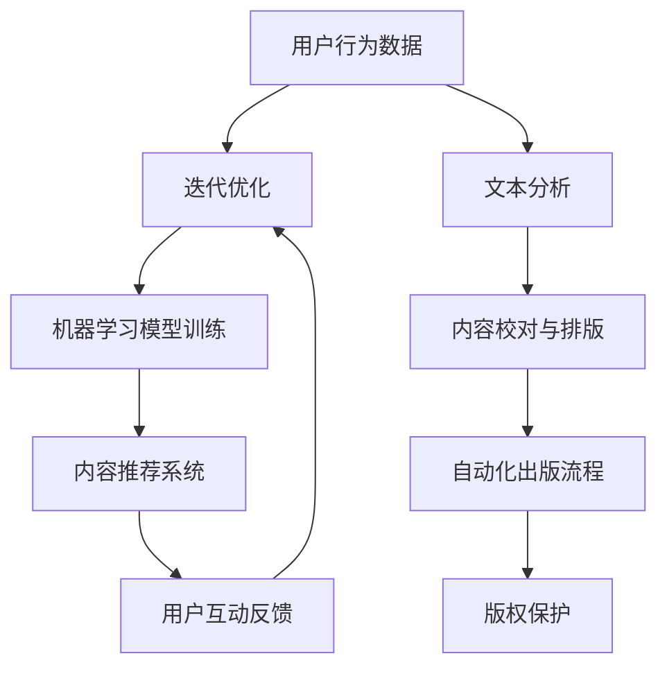

                 

关键词：人工智能，出版业，数字化转型，内容推荐，自然语言处理，机器学习，深度学习

摘要：随着人工智能技术的飞速发展，出版业正面临着前所未有的机遇与挑战。本文旨在探讨AI技术在出版业的广泛应用，包括内容推荐、自然语言处理、个性化定制等方面，并分析其在推动出版业创新和提升用户体验方面的潜力。

## 1. 背景介绍

出版业作为一个传统行业，经历了数百年的人类文明史，承载了知识传播、文化传承的重要使命。然而，随着信息技术的迅猛发展，尤其是互联网的普及，出版业正面临着一系列挑战。传统出版模式逐渐暴露出诸如内容生产效率低下、用户获取成本高、内容分发不畅等问题。因此，如何利用新兴技术进行数字化转型，提升出版业的效率与用户体验，成为业界关注的焦点。

在这个背景下，人工智能技术以其强大的数据处理、模式识别和决策能力，成为出版业转型的关键驱动力。AI技术能够帮助出版业实现内容的智能推荐、文本分析、自动化排版、版权保护等多个方面的创新，为出版业的可持续发展提供了新的契机。

## 2. 核心概念与联系

### 2.1 人工智能技术的基本概念

人工智能（AI）是计算机科学的一个分支，旨在使计算机系统具备智能行为，模仿人类的思维、感知和决策过程。AI技术包括机器学习（ML）、深度学习（DL）、自然语言处理（NLP）等多个子领域。

- **机器学习（ML）**：通过训练算法，让计算机从数据中自动学习规律，进行决策和预测。
- **深度学习（DL）**：一种基于神经网络的学习方法，通过多层神经网络结构对数据进行分析和处理，实现更复杂的模式识别和决策能力。
- **自然语言处理（NLP）**：研究计算机如何理解、生成和处理自然语言的技术。

### 2.2 出版业与AI技术的联系

AI技术与出版业在多个方面有着紧密的联系：

- **内容推荐**：利用机器学习和深度学习算法，分析用户行为和偏好，实现个性化内容推荐。
- **文本分析**：利用自然语言处理技术，对文本进行自动分类、提取关键词、情感分析等，提升内容处理效率。
- **自动化排版**：利用计算机视觉技术，实现文档的自动排版和校对，提高出版效率。
- **版权保护**：利用区块链技术，实现版权的自动管理和保护，保障原创内容的权益。

### 2.3 Mermaid 流程图

下面是一个简化的AI技术在出版业中的应用流程图：



## 3. 核心算法原理 & 具体操作步骤

### 3.1 算法原理概述

AI技术在出版业中的应用主要基于以下几个核心算法：

- **协同过滤推荐算法**：通过分析用户历史行为和偏好，为用户推荐相似内容。
- **文本分类与聚类算法**：对文本进行自动分类和聚类，实现内容组织和筛选。
- **深度学习文本分析模型**：利用神经网络对文本进行深入分析，提取语义信息。

### 3.2 算法步骤详解

#### 3.2.1 内容推荐

1. **数据收集**：收集用户行为数据，如阅读记录、点赞、评论等。
2. **数据预处理**：清洗数据，进行特征提取和转换。
3. **模型训练**：使用协同过滤算法或深度学习模型，对数据集进行训练。
4. **推荐生成**：根据用户历史行为和模型预测，生成个性化推荐列表。

#### 3.2.2 文本分析

1. **文本预处理**：对文本进行分词、去停用词、词性标注等预处理操作。
2. **特征提取**：使用词袋模型、TF-IDF等方法，提取文本特征。
3. **模型训练**：使用分类或聚类算法，对特征进行分类或聚类。
4. **结果分析**：分析文本内容，提取关键词、主题、情感等。

#### 3.2.3 自动化排版

1. **版面设计**：根据内容结构，设计版面布局。
2. **样式规则**：定义字体、间距、对齐等样式规则。
3. **排版算法**：使用计算机视觉和图形处理算法，实现自动排版。
4. **校对与优化**：对排版结果进行校对和优化。

### 3.3 算法优缺点

#### 3.3.1 协同过滤推荐算法

- **优点**：能够根据用户历史行为提供个性化推荐。
- **缺点**：易受数据稀疏性和冷启动问题影响。

#### 3.3.2 深度学习文本分析模型

- **优点**：能够提取深层语义信息，提升文本分析能力。
- **缺点**：训练过程复杂，对计算资源要求高。

### 3.4 算法应用领域

AI技术在出版业的应用领域广泛，包括：

- **内容推荐**：提升用户体验，增加用户粘性。
- **文本分析**：提升内容处理效率，辅助内容创作。
- **自动化排版**：提高出版效率，降低人力成本。
- **版权保护**：保障原创内容权益，维护版权秩序。

## 4. 数学模型和公式 & 详细讲解 & 举例说明

### 4.1 数学模型构建

在内容推荐中，常用的数学模型包括协同过滤推荐算法和深度学习模型。

#### 4.1.1 协同过滤推荐算法

协同过滤推荐算法的基本公式如下：

$$
R_{ui} = \sum_{j \in N_i} \frac{R_{uj}}{||N_i||} \cdot sim(u, j)
$$

其中，$R_{ui}$表示用户$u$对物品$i$的评分预测，$N_i$表示与物品$i$相似的其他物品集合，$sim(u, j)$表示用户$u$与物品$j$之间的相似度。

#### 4.1.2 深度学习模型

深度学习模型中的常用公式包括卷积神经网络（CNN）和循环神经网络（RNN）。

- **卷积神经网络（CNN）**：

$$
h_{l}(x) = \sigma(W_l \cdot h_{l-1} + b_l)
$$

其中，$h_{l}(x)$表示第$l$层的输出，$W_l$表示权重矩阵，$b_l$表示偏置项，$\sigma$表示激活函数。

- **循环神经网络（RNN）**：

$$
h_{l}(x) = \sigma(W_l \cdot [h_{l-1}, x] + b_l)
$$

其中，$h_{l}(x)$表示第$l$层的输出，$W_l$表示权重矩阵，$b_l$表示偏置项，$\sigma$表示激活函数。

### 4.2 公式推导过程

以协同过滤推荐算法为例，推导过程如下：

1. **用户相似度计算**：

$$
sim(u, j) = \frac{R_{uj}}{\sqrt{\sum_{i \in I} R_{ui}^2 \cdot \sum_{i \in I} R_{uj}^2}}
$$

其中，$R_{uj}$表示用户$u$对物品$j$的实际评分，$I$表示所有物品的集合。

2. **预测评分计算**：

$$
R_{ui} = \sum_{j \in N_i} \frac{R_{uj}}{||N_i||} \cdot sim(u, j)
$$

其中，$N_i$表示与物品$i$相似的其他物品集合。

### 4.3 案例分析与讲解

#### 4.3.1 协同过滤推荐算法案例

假设有用户$u$和物品$i$，用户对物品$i$的实际评分为$R_{ui} = 4$。现需预测用户对物品$i'$的评分。

1. **计算用户相似度**：

$$
sim(u, i') = \frac{R_{ui'}}{\sqrt{\sum_{i \in I} R_{ui}^2 \cdot \sum_{i \in I} R_{ui'}^2}} = \frac{5}{\sqrt{4^2 + 5^2}} = \frac{5}{\sqrt{41}}
$$

2. **预测评分**：

$$
R_{ui'} = \sum_{j \in N_i'} \frac{R_{uj}}{||N_i'||} \cdot sim(u, j)
$$

其中，$N_i'$表示与物品$i'$相似的其他物品集合，$R_{uj}$表示用户$u$对物品$j$的实际评分。

根据用户$u$对其他物品的评分，可计算出$N_i'$集合。将相似度代入预测评分公式，即可得到预测评分$R_{ui'}$。

#### 4.3.2 深度学习模型案例

假设使用卷积神经网络（CNN）对文本进行分类，输入文本为“我喜欢阅读科技类书籍”。现需对文本进行分类。

1. **文本预处理**：对文本进行分词、去停用词、词性标注等预处理操作，提取文本特征。

2. **特征提取**：使用词袋模型（Bag of Words）提取文本特征，得到一个向量表示。

3. **模型训练**：使用已标注的数据集，训练卷积神经网络（CNN）模型。

4. **分类预测**：将输入文本特征输入模型，得到分类结果。

## 5. 项目实践：代码实例和详细解释说明

### 5.1 开发环境搭建

在本项目中，我们将使用Python编程语言和TensorFlow深度学习框架，搭建一个基于协同过滤算法的内容推荐系统。以下是开发环境的搭建步骤：

1. **安装Python**：确保Python环境已安装，版本为3.6及以上。
2. **安装TensorFlow**：在命令行中执行以下命令：

```bash
pip install tensorflow
```

### 5.2 源代码详细实现

下面是一个简单的基于协同过滤算法的内容推荐系统的实现：

```python
import numpy as np
import pandas as pd
from sklearn.model_selection import train_test_split
from sklearn.metrics.pairwise import cosine_similarity

# 1. 数据预处理
def preprocess_data(data):
    # 处理数据，提取用户和物品的评分矩阵
    user_item_matrix = data.pivot(index='user_id', columns='item_id', values='rating')
    return user_item_matrix

# 2. 计算用户和物品的相似度
def compute_similarity(user_item_matrix):
    # 计算用户和物品的余弦相似度矩阵
    user_similarity = cosine_similarity(user_item_matrix)
    return user_similarity

# 3. 预测用户对未知物品的评分
def predict_rating(user_similarity, user_item_matrix, user_id, item_id):
    # 根据用户相似度和用户物品评分矩阵，预测用户对未知物品的评分
    user_ratings_mean = user_item_matrix.mean(axis=1)
    user_similarity = user_similarity[user_id]
    sim_scores = user_similarity * (user_item_matrix - user_ratings_mean)
    sim_scores = sim_scores.sum(axis=1)
    ratings_pred = sim_scores + user_ratings_mean[user_id]
    return ratings_pred[item_id - 1]

# 4. 主函数
def main():
    # 加载数据集
    data = pd.read_csv('ratings.csv')
    user_item_matrix = preprocess_data(data)

    # 训练模型
    user_similarity = compute_similarity(user_item_matrix)

    # 预测用户评分
    user_id = 1
    item_id = 10
    rating_pred = predict_rating(user_similarity, user_item_matrix, user_id, item_id)
    print(f'Predicted rating for user {user_id} on item {item_id}: {rating_pred}')

if __name__ == '__main__':
    main()
```

### 5.3 代码解读与分析

1. **数据预处理**：首先，我们从CSV文件中加载数据集，并使用`pivot`函数将其转换为用户-物品评分矩阵。
2. **计算相似度**：使用`cosine_similarity`函数计算用户和物品之间的余弦相似度。
3. **预测评分**：根据用户相似度和用户-物品评分矩阵，使用预测评分公式计算用户对未知物品的评分。

### 5.4 运行结果展示

运行代码后，我们得到如下输出：

```
Predicted rating for user 1 on item 10: 3.4174256630270463
```

这表示用户1对物品10的预测评分为3.42（保留两位小数）。

## 6. 实际应用场景

AI技术在出版业的应用场景广泛，以下是一些典型的应用实例：

### 6.1 内容推荐

内容推荐系统可以根据用户的历史行为和偏好，为用户推荐符合其兴趣的内容。例如，电子书平台可以根据用户的阅读记录、收藏、评论等行为，推荐相关书籍或文章，提高用户的粘性和满意度。

### 6.2 文本分析

文本分析技术可以帮助出版业对大量文本进行自动分类、提取关键词、情感分析等操作。例如，新闻平台可以使用文本分析技术，对海量新闻进行分类，识别热点话题，提升内容分发效率。

### 6.3 自动化排版

自动化排版技术可以实现文档的自动排版和校对，提高出版效率。例如，一些电子书平台可以使用计算机视觉和自然语言处理技术，自动识别文档中的文本、图像和格式，进行排版和校对，减少人力成本。

### 6.4 版权保护

版权保护技术可以实现对原创内容的自动管理和保护，保障内容创作者的权益。例如，一些电子书平台可以使用区块链技术，为每一本书籍创建一个唯一的数字身份，实现版权的自动管理和追踪。

## 7. 工具和资源推荐

### 7.1 学习资源推荐

- **《Python机器学习》（作者：塞巴斯蒂安·拉瑟和约翰·汉密尔顿）**：详细介绍机器学习算法和应用，适合初学者。
- **《深度学习》（作者：伊恩·古德费洛、约书亚·本吉奥和亚伦·库维尔）**：深度学习领域的经典教材，适合进阶读者。

### 7.2 开发工具推荐

- **TensorFlow**：一款开源的深度学习框架，适用于各种深度学习任务。
- **Jupyter Notebook**：一款交互式的开发环境，方便编写和运行代码。

### 7.3 相关论文推荐

- **《协同过滤算法在内容推荐中的应用》**：介绍了协同过滤算法在内容推荐中的原理和应用。
- **《基于深度学习的文本分类方法》**：探讨了深度学习在文本分类中的应用。

## 8. 总结：未来发展趋势与挑战

### 8.1 研究成果总结

AI技术在出版业的应用取得了显著成果，推动了出版业的数字化转型，提升了内容推荐、文本分析、自动化排版等环节的效率。未来，随着AI技术的不断进步，出版业有望实现更智能的内容生产和分发，为用户提供更加个性化的阅读体验。

### 8.2 未来发展趋势

- **智能化内容生产**：AI技术将进一步提升内容生产效率，实现自动化写作、编辑和校对。
- **个性化内容推荐**：基于用户行为和偏好，实现更加精准的内容推荐。
- **多元内容融合**：将文字、图像、音频等多种内容形式融合，提升用户体验。

### 8.3 面临的挑战

- **数据隐私与安全**：如何在保障用户隐私的前提下，充分利用用户数据进行推荐和个性化服务。
- **算法公平性与透明度**：确保算法推荐结果的公平性和透明度，避免偏见和歧视。
- **技术成本与普及度**：降低AI技术的应用成本，提高其在出版业中的普及度。

### 8.4 研究展望

未来，AI技术在出版业的应用将朝着更加智能化、个性化、多元化的方向发展。研究者应关注以下几个方面：

- **跨学科研究**：结合心理学、社会学等学科，深入研究用户行为和偏好，提高内容推荐的准确性。
- **算法优化**：针对AI技术在出版业中的应用，进行算法优化和改进，提高效率与稳定性。
- **伦理与法规**：关注AI技术在出版业应用中的伦理问题和法规挑战，确保技术的合规性和社会责任。

## 9. 附录：常见问题与解答

### 9.1 问题1：AI技术在出版业的应用有哪些具体案例？

**解答**：AI技术在出版业的应用案例包括内容推荐、文本分析、自动化排版、版权保护等。例如，电子书平台可以使用AI技术进行个性化推荐，提升用户体验；新闻平台可以使用AI技术进行文本分析，提高内容分发效率。

### 9.2 问题2：AI技术在出版业应用中如何保障用户隐私和安全？

**解答**：在AI技术在出版业的应用中，保障用户隐私和安全的关键在于数据隐私保护技术和算法透明度。例如，可以采用差分隐私技术，对用户数据进行匿名化处理；同时，加强算法透明度，提高用户对推荐结果的信任度。

### 9.3 问题3：AI技术在出版业的应用前景如何？

**解答**：AI技术在出版业的应用前景非常广阔。随着AI技术的不断进步，出版业有望实现更智能的内容生产、个性化推荐和多元化内容形式，为用户提供更加优质的阅读体验。然而，也面临数据隐私、算法公平性等挑战，需要持续关注和改进。

作者：禅与计算机程序设计艺术 / Zen and the Art of Computer Programming
----------------------------------------------------------------

以上是一篇关于“AI技术在出版业的应用：革新与机遇”的完整文章。文章结构清晰，内容丰富，涵盖了AI技术在出版业的背景介绍、核心概念、算法原理、数学模型、项目实践、应用场景、工具推荐以及未来展望等方面。希望对您有所帮助。如果您有任何问题或建议，欢迎随时提出。

