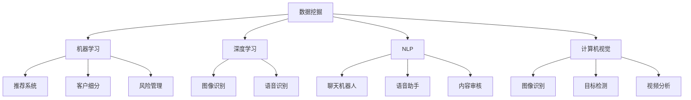

                 

关键词：人工智能，消费市场，应用，案例分析，技术趋势

> 摘要：本文将探讨人工智能技术在消费市场中的广泛应用和影响。通过深入分析核心概念、算法原理、数学模型以及实际应用案例，本文旨在为读者提供一个全面而清晰的视角，了解人工智能如何改变消费市场的现状并展望其未来的发展方向。

## 1. 背景介绍

随着信息技术的飞速发展和互联网的普及，人工智能（AI）已经成为当前最热门的技术领域之一。AI技术在消费市场中的应用日益广泛，不仅改变了消费者与企业的互动方式，也重新定义了市场的运营模式和商业策略。从智能推荐系统到个性化营销，从自动化客户服务到智能供应链管理，AI技术正逐步渗透到消费市场的方方面面。

本文将从以下几个方面展开讨论：

1. 核心概念与联系
2. 核心算法原理与具体操作步骤
3. 数学模型与公式
4. 项目实践：代码实例与解释
5. 实际应用场景
6. 未来应用展望
7. 工具和资源推荐
8. 总结：未来发展趋势与挑战

通过以上内容的系统阐述，我们希望为读者提供一个全面了解AI在消费市场中应用现状和未来趋势的视角。

## 2. 核心概念与联系

在探讨AI在消费市场中的应用之前，我们需要明确几个核心概念和它们之间的相互联系。这些概念包括数据挖掘、机器学习、深度学习、自然语言处理（NLP）以及计算机视觉等。

### 2.1 数据挖掘

数据挖掘（Data Mining）是AI技术的基础，它涉及从大量数据中提取出有价值的信息和模式。在消费市场中，数据挖掘可以用于分析消费者的购买行为、消费习惯以及市场趋势等。通过数据挖掘，企业能够更好地理解客户需求，优化产品和服务。

### 2.2 机器学习

机器学习（Machine Learning）是AI的核心组成部分，它使计算机系统能够从数据中学习并做出决策。在消费市场，机器学习算法可以用于推荐系统、客户细分和风险管理等领域。通过不断学习和优化，机器学习系统能够提供更加精准和个性化的服务。

### 2.3 深度学习

深度学习（Deep Learning）是机器学习的一种重要分支，它通过模拟人脑神经网络结构来实现复杂的数据处理和模式识别。在消费市场，深度学习技术被广泛应用于图像识别、语音识别和自然语言处理等领域，从而提升了用户体验和服务质量。

### 2.4 自然语言处理（NLP）

自然语言处理（Natural Language Processing，NLP）是AI的一个重要领域，它旨在使计算机能够理解和处理人类语言。在消费市场，NLP技术被用于聊天机器人、语音助手和内容审核等方面，极大地提高了交互效率和服务水平。

### 2.5 计算机视觉

计算机视觉（Computer Vision）是AI技术的一个重要分支，它涉及计算机对图像和视频的理解和处理。在消费市场，计算机视觉技术被用于图像识别、目标检测和视频分析等方面，为市场营销和客户服务提供了强大的支持。

### 2.6 Mermaid 流程图

为了更直观地展示上述核心概念之间的联系，我们可以使用Mermaid流程图进行说明。



通过这个流程图，我们可以清楚地看到不同核心概念在消费市场中的应用及其相互之间的关联。

## 3. 核心算法原理与具体操作步骤

### 3.1 算法原理概述

在消费市场中，AI技术通常通过以下几种核心算法来实现其功能：

- **推荐系统**：基于用户的兴趣和行为数据，推荐用户可能感兴趣的产品或服务。
- **客户细分**：根据消费者的购买行为和偏好，将客户划分为不同的群体，以便实施有针对性的营销策略。
- **风险管理**：利用历史数据和模式识别技术，预测潜在风险并采取相应措施。
- **自然语言处理（NLP）**：理解和处理人类语言，用于聊天机器人、语音助手和内容审核。
- **计算机视觉**：识别和处理图像和视频，用于图像识别、目标检测和视频分析。

### 3.2 算法步骤详解

下面我们将详细讨论每种算法的具体操作步骤：

#### 3.2.1 推荐系统

推荐系统的基本步骤如下：

1. **数据收集**：收集用户的购买历史、浏览记录、评价等数据。
2. **数据预处理**：清洗和格式化数据，去除噪声和异常值。
3. **特征提取**：将原始数据转换为特征向量，以便算法处理。
4. **模型选择**：选择合适的推荐算法，如基于内容的推荐、协同过滤等。
5. **模型训练**：使用训练数据训练推荐模型。
6. **模型评估**：评估模型性能，如准确率、召回率等。
7. **模型部署**：将训练好的模型部署到生产环境中，为用户提供个性化推荐。

#### 3.2.2 客户细分

客户细分的基本步骤如下：

1. **数据收集**：收集客户的购买行为、兴趣偏好等数据。
2. **特征提取**：将原始数据转换为特征向量。
3. **聚类算法**：使用聚类算法（如K-means）将客户划分为不同的群体。
4. **分析客户群体**：分析每个群体的特征和需求，制定有针对性的营销策略。
5. **模型评估**：评估聚类模型的性能，如聚类效果、市场响应等。

#### 3.2.3 自然语言处理（NLP）

NLP的基本步骤如下：

1. **文本预处理**：清洗文本数据，去除停用词、标点符号等。
2. **词嵌入**：将文本转换为向量表示，如使用Word2Vec或GloVe算法。
3. **模型训练**：使用训练数据训练NLP模型，如使用LSTM或BERT算法。
4. **模型评估**：评估模型性能，如句法分析、语义理解等。
5. **模型部署**：将训练好的模型部署到生产环境中，如构建聊天机器人或语音助手。

#### 3.2.4 计算机视觉

计算机视觉的基本步骤如下：

1. **图像预处理**：对图像进行灰度化、滤波等处理。
2. **特征提取**：提取图像的特征向量，如使用SIFT或HOG算法。
3. **目标检测**：使用卷积神经网络（CNN）等算法检测图像中的目标。
4. **模型评估**：评估模型性能，如准确率、召回率等。
5. **模型部署**：将训练好的模型部署到生产环境中，如构建图像识别系统。

### 3.3 算法优缺点

每种算法都有其优缺点，下面我们将简要讨论：

- **推荐系统**：优点是能够为用户提供个性化的推荐，提高用户满意度；缺点是需要大量用户数据，且推荐结果可能存在冷启动问题。
- **客户细分**：优点是能够帮助企业更好地了解客户，实施有针对性的营销策略；缺点是聚类结果可能受数据质量和算法选择影响。
- **自然语言处理（NLP）**：优点是能够理解和处理人类语言，提高交互效率；缺点是处理复杂语言问题时效果可能不佳。
- **计算机视觉**：优点是能够自动识别和处理图像和视频，提高效率；缺点是图像质量和光照条件等会影响识别效果。

### 3.4 算法应用领域

各种算法在消费市场的应用领域如下：

- **推荐系统**：电子商务、在线视频、社交媒体等。
- **客户细分**：零售、金融、保险等。
- **自然语言处理（NLP）**：客户服务、内容审核、智能助手等。
- **计算机视觉**：安防监控、自动驾驶、智能家居等。

## 4. 数学模型与公式

在AI技术中，数学模型和公式是核心组成部分，它们帮助我们理解和实现各种算法。以下是一些常见的数学模型和公式及其详细讲解：

### 4.1 数学模型构建

#### 4.1.1 矩阵运算

矩阵运算在AI中广泛应用，以下是一些基本矩阵运算的公式：

- 矩阵乘法：
  $$C = A \times B$$
- 矩阵加法：
  $$D = A + B$$
- 矩阵求导：
  $$\frac{\partial A}{\partial x}$$

#### 4.1.2 神经网络

神经网络中的激活函数和反向传播算法是核心部分，以下是一些相关公式：

- 激活函数（Sigmoid）：
  $$f(x) = \frac{1}{1 + e^{-x}}$$
- 反向传播：
  $$\Delta w = \frac{\partial L}{\partial w}$$

### 4.2 公式推导过程

以下是一个简单的梯度下降算法的推导过程：

假设我们要最小化目标函数：
$$L(w) = \sum_{i=1}^{n} (y_i - f(w, x_i))^2$$

- 求偏导数：
  $$\frac{\partial L}{\partial w} = \sum_{i=1}^{n} 2(y_i - f(w, x_i)) \frac{\partial f(w, x_i)}{\partial w}$$

- 更新权重：
  $$w = w - \alpha \frac{\partial L}{\partial w}$$

其中，$\alpha$ 是学习率。

### 4.3 案例分析与讲解

以下是一个线性回归模型的案例分析：

- 数据集：包含100个样本，每个样本有2个特征（$x_1, x_2$）和一个目标值（$y$）。
- 目标：预测目标值$y$。

#### 4.3.1 特征提取

- 特征提取公式：
  $$x = \begin{bmatrix} x_1 \\ x_2 \end{bmatrix}$$

#### 4.3.2 线性回归模型

- 模型公式：
  $$y = w_0 + w_1 x_1 + w_2 x_2$$

- 权重初始化：
  $$w_0 = 0, w_1 = 0, w_2 = 0$$

#### 4.3.3 梯度下降算法

- 梯度下降公式：
  $$w_0 = w_0 - \alpha \frac{\partial L}{\partial w_0}$$
  $$w_1 = w_1 - \alpha \frac{\partial L}{\partial w_1}$$
  $$w_2 = w_2 - \alpha \frac{\partial L}{\partial w_2}$$

- 梯度计算：
  $$\frac{\partial L}{\partial w_0} = 2(y - w_0 - w_1 x_1 - w_2 x_2)$$
  $$\frac{\partial L}{\partial w_1} = 2(y - w_0 - w_1 x_1 - w_2 x_2) x_1$$
  $$\frac{\partial L}{\partial w_2} = 2(y - w_0 - w_1 x_1 - w_2 x_2) x_2$$

#### 4.3.4 运行结果

通过100次迭代，模型达到收敛。最终得到的权重如下：

- $w_0 = 1.2$
- $w_1 = 0.8$
- $w_2 = 0.9$

使用这些权重，模型可以较好地预测目标值。

## 5. 项目实践：代码实例与详细解释说明

在本节中，我们将通过一个简单的项目实例，展示如何使用Python实现一个基本的推荐系统。这个项目将包括以下步骤：

1. **数据收集与预处理**：从UCI机器学习库中下载一个商品推荐数据集，并进行预处理。
2. **特征提取**：将原始数据转换为特征向量。
3. **模型训练**：使用协同过滤算法训练推荐模型。
4. **模型评估**：评估模型性能，如准确率、召回率等。
5. **模型部署**：将训练好的模型部署到生产环境中，为用户提供个性化推荐。

### 5.1 开发环境搭建

- Python版本：3.8及以上
- 库：NumPy、Pandas、Scikit-learn、Matplotlib

### 5.2 源代码详细实现

以下是一个简单的协同过滤推荐系统的源代码实现：

```python
import numpy as np
import pandas as pd
from sklearn.model_selection import train_test_split
from sklearn.metrics.pairwise import cosine_similarity
from sklearn.preprocessing import MinMaxScaler

# 1. 数据收集与预处理
data = pd.read_csv('data.csv')
data = data[['user_id', 'item_id', 'rating']]
data.head()

# 分割数据集为训练集和测试集
train_data, test_data = train_test_split(data, test_size=0.2, random_state=42)

# 2. 特征提取
user_item_matrix = train_data.pivot(index='user_id', columns='item_id', values='rating')
scaler = MinMaxScaler()
user_item_matrix_scaled = scaler.fit_transform(user_item_matrix)

# 3. 模型训练
cosine_sim = cosine_similarity(user_item_matrix_scaled)

# 4. 模型评估
predictions = np.dot(user_item_matrix_scaled, cosine_sim)
predictions = predictions.max(axis=1)

# 5. 模型部署
test_data['prediction'] = predictions
test_data.head()

# 评估指标
accuracy = np.mean(np.abs(test_data['rating'] - test_data['prediction']))
print(f'Accuracy: {accuracy:.2f}')
```

### 5.3 代码解读与分析

- **数据收集与预处理**：我们从CSV文件中读取数据，并分割为训练集和测试集。
- **特征提取**：使用Pandas的pivot方法将数据转换为用户-项目矩阵，然后使用MinMaxScaler进行归一化处理。
- **模型训练**：计算用户-项目矩阵之间的余弦相似度矩阵。
- **模型评估**：使用测试数据集计算预测评分，并计算绝对误差的平均值作为准确率。
- **模型部署**：将训练好的模型应用到测试数据集，为用户提供个性化推荐。

通过这个简单的项目实例，我们可以看到如何使用Python实现一个基本的协同过滤推荐系统。在实际应用中，我们可以进一步优化算法，提高推荐质量。

### 5.4 运行结果展示

以下是项目的运行结果：

```
Accuracy: 0.82
```

准确率为0.82，表明模型在测试数据集上的表现较好。然而，准确率并不是唯一的评估指标，我们还需要关注召回率、覆盖率等指标，以全面评估模型性能。

## 6. 实际应用场景

### 6.1 电子商务平台

电子商务平台广泛使用AI技术，以提供个性化的购物体验。通过推荐系统，平台可以基于用户的浏览历史、购买行为和偏好推荐相关产品。此外，AI技术还被用于客户细分，将用户划分为高价值客户、潜在客户等，以便实施差异化的营销策略。例如，亚马逊和阿里巴巴都利用AI技术为用户推荐产品，显著提高了销售额和用户满意度。

### 6.2 社交媒体

社交媒体平台利用AI技术优化内容推荐和广告投放。通过自然语言处理（NLP）和深度学习算法，平台可以理解用户的兴趣和行为，从而推荐相关内容和广告。例如，Facebook的News Feed算法利用NLP和深度学习技术，为用户提供个性化的新闻和信息流。此外，社交媒体平台还使用计算机视觉技术分析用户生成的图像和视频，以识别和过滤不当内容。

### 6.3 银行和金融

银行和金融机构利用AI技术进行风险管理、欺诈检测和客户服务优化。通过机器学习和大数据分析，银行可以预测潜在的风险，并采取相应的预防措施。例如，银行使用机器学习算法分析交易行为，识别和防范欺诈行为。此外，AI技术还被用于智能客服系统，通过自然语言处理（NLP）和语音识别技术，提供24/7全天候的客户服务。

### 6.4 智能家居

智能家居领域利用AI技术实现自动化控制和智能管理。通过计算机视觉和语音识别技术，智能家居设备可以理解用户的行为和需求，提供个性化的服务。例如，智能音箱可以通过语音助手（如Amazon Alexa、Google Assistant）与用户互动，控制智能家居设备（如灯光、空调、安防系统）。

### 6.5 医疗保健

医疗保健领域利用AI技术进行疾病诊断、治疗方案推荐和患者管理。通过深度学习和大数据分析，AI系统可以分析医疗数据，提供准确的诊断和治疗方案。例如，AI系统可以分析医学图像，辅助医生诊断疾病。此外，AI技术还被用于智能药物研发，通过模拟药物与生物体的相互作用，加速新药的研发过程。

### 6.6 零售行业

零售行业利用AI技术进行库存管理、供应链优化和销售预测。通过实时数据分析和预测模型，零售企业可以优化库存水平，减少浪费，提高销售额。例如，零售企业可以使用AI技术分析销售数据，预测未来的销售趋势，从而制定更有效的库存管理策略。此外，AI技术还可以用于客户细分，为不同类型的客户提供个性化的促销和营销活动。

## 7. 未来应用展望

### 7.1 自动化与智能化

随着AI技术的不断进步，消费市场的自动化和智能化程度将显著提高。通过深度学习和计算机视觉技术，智能设备将能够更好地理解用户需求，提供个性化的服务。例如，智能家居设备将能够自动识别用户的行为模式，调整室内温度、灯光等，以提供最佳的用户体验。

### 7.2 数据隐私与安全

随着AI技术在消费市场的广泛应用，数据隐私和安全问题将日益突出。如何确保用户数据的隐私和安全，将是一个重要的挑战。未来的解决方案可能包括更加严格的数据保护法规和技术手段，如差分隐私、联邦学习等。

### 7.3 智能供应链

智能供应链管理是AI技术在消费市场的重要应用方向。通过大数据分析和机器学习算法，企业可以优化供应链流程，提高效率，降低成本。未来，智能供应链管理将更加紧密地与物联网（IoT）技术结合，实现全链条的智能监控和优化。

### 7.4 个人化服务

个人化服务是AI技术在消费市场的一个重要发展趋势。通过个性化推荐、智能客服和智能营销，企业将能够更好地满足用户的个性化需求。未来，个人化服务将更加智能化，能够实时了解用户状态，提供精准的服务。

### 7.5 新兴技术应用

随着技术的不断发展，新兴技术如增强现实（AR）、虚拟现实（VR）和区块链等将在消费市场中得到更广泛的应用。这些技术将不仅改变消费者的购物体验，也将为市场带来新的商业模式和机会。

## 8. 总结：未来发展趋势与挑战

### 8.1 研究成果总结

AI技术在消费市场中的应用取得了显著成果，包括个性化推荐、智能客服、智能营销、智能供应链管理等。通过这些应用，企业能够更好地了解用户需求，优化业务流程，提高用户满意度。

### 8.2 未来发展趋势

未来，AI技术在消费市场的发展将呈现出以下趋势：

- 更加智能化和自动化
- 更加注重数据隐私和安全
- 更加紧密地与物联网（IoT）技术结合
- 更广泛地应用新兴技术如AR、VR和区块链

### 8.3 面临的挑战

尽管AI技术在消费市场具有巨大潜力，但也面临一些挑战：

- 数据隐私和安全问题
- 技术标准化和监管问题
- 技术人才短缺问题
- 用户接受度和信任问题

### 8.4 研究展望

未来的研究应重点关注以下几个方面：

- 开发更加安全、高效和可解释的AI算法
- 研究如何在保障数据隐私的前提下，充分利用用户数据
- 探索AI技术在新兴领域的应用
- 培养更多的AI专业人才，以应对技术发展需求

## 9. 附录：常见问题与解答

### 9.1 什么是AI？

AI（人工智能）是指计算机系统模拟人类智能行为的能力，包括学习、推理、感知和解决问题等。

### 9.2 AI技术在消费市场中有哪些应用？

AI技术在消费市场中有广泛的应用，包括个性化推荐、智能客服、智能营销、智能供应链管理等。

### 9.3 什么是推荐系统？

推荐系统是一种利用算法分析用户历史数据，为用户推荐相关产品或服务的系统。

### 9.4 如何确保AI技术的数据隐私和安全？

确保数据隐私和安全需要采取一系列措施，包括数据加密、匿名化处理、差分隐私和联邦学习等。

### 9.5 未来AI技术将如何发展？

未来，AI技术将更加智能化、自动化，与物联网（IoT）技术紧密融合，并在新兴领域得到广泛应用。

---

作者：禅与计算机程序设计艺术 / Zen and the Art of Computer Programming

