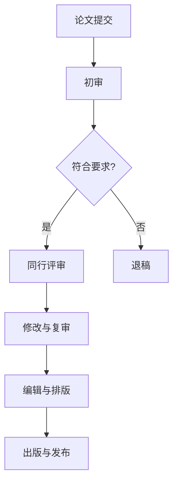

                 

关键词：AI搜索引擎、学术出版、同行评审、人工智能技术、算法、深度学习、文本分析、大数据分析、学术资源、效率、质量、透明度、隐私保护。

## 摘要

随着人工智能（AI）技术的飞速发展，AI搜索引擎在学术出版和同行评审过程中发挥着越来越重要的作用。本文将探讨AI搜索引擎如何通过其强大的文本分析、大数据处理和深度学习能力，改变传统的学术出版流程和同行评审机制。我们首先回顾学术出版和同行评审的现有模式，然后深入分析AI搜索引擎的技术优势，并展示其在实际应用中的案例。最后，本文将对AI搜索引擎的未来发展进行展望，并探讨其在提升学术出版质量、效率、透明度和隐私保护等方面可能面临的挑战。

## 1. 背景介绍

学术出版和同行评审是科学研究的重要环节。学术出版是指科研成果通过正式的期刊或出版社发布，以便于同行学者了解和引用。同行评审则是确保科研成果质量和可信度的重要机制，通过同行专家的审查，筛选出具有学术价值的论文。

然而，传统的学术出版和同行评审过程存在一些问题。首先，由于期刊数量庞大，审稿周期长，导致科研成果的发表时间延长，影响了研究的时效性。其次，同行评审过程具有一定的主观性和不确定性，可能会影响论文的质量和公正性。此外，随着学术资源的数字化和网络化，学术出版和评审过程中产生的数据量呈指数级增长，使得人工处理难度大增。

为了解决这些问题，AI搜索引擎作为一种新兴的技术工具，开始被广泛应用于学术出版和同行评审领域。AI搜索引擎具备强大的文本分析、机器学习和自然语言处理能力，能够对海量的学术文献进行快速检索、分类和筛选，从而提高学术出版的效率和质量。同时，AI搜索引擎还可以利用深度学习技术，对审稿过程进行智能辅助，提高同行评审的准确性和公正性。

## 2. 核心概念与联系

### 2.1 AI搜索引擎的工作原理

AI搜索引擎的核心是自然语言处理（NLP）和机器学习（ML）技术。NLP技术使计算机能够理解、解释和生成人类语言，从而实现对文本的精确检索和分析。ML技术则通过训练模型，从大量数据中学习并提取规律，从而提高搜索的准确性和效率。

### 2.2 学术出版与同行评审的流程

学术出版和同行评审过程通常包括以下几个步骤：

1. **论文提交**：研究者将完成的论文提交给相关期刊或出版社。
2. **初审**：编辑对论文进行初步审查，筛选出符合期刊要求的稿件。
3. **同行评审**：邀请专家对论文进行评审，评估其学术价值、研究方法和结论。
4. **修改与复审**：作者根据评审意见进行修改，然后再次提交评审。
5. **编辑与排版**：编辑对最终稿进行编辑和排版，确保论文符合出版规范。
6. **出版与发布**：论文被正式发布，供同行学者查阅和引用。

### 2.3 AI搜索引擎在学术出版和同行评审中的应用

AI搜索引擎在学术出版和同行评审中的应用主要体现在以下几个方面：

1. **快速检索**：AI搜索引擎能够对海量的学术文献进行快速检索，帮助研究者找到相关的研究成果，提高研究效率。
2. **分类与筛选**：AI搜索引擎可以根据关键词、主题、作者等信息，对文献进行分类和筛选，提高审稿的准确性和效率。
3. **智能辅助**：AI搜索引擎可以利用深度学习技术，对审稿过程进行智能辅助，提高评审的准确性和公正性。
4. **数据分析**：AI搜索引擎可以对学术出版过程中的数据进行统计分析，为编辑和专家提供决策支持。

### 2.4 Mermaid流程图



## 3. 核心算法原理 & 具体操作步骤

### 3.1 算法原理概述

AI搜索引擎在学术出版和同行评审中的应用主要基于以下几种算法原理：

1. **文本相似性计算**：通过计算论文之间的相似性，帮助研究者找到相关的研究成果。
2. **自然语言处理**：对文本进行分词、词性标注、句法分析等操作，实现对文本的深入理解。
3. **机器学习分类**：利用已标注的数据训练分类模型，对未标注的论文进行分类和筛选。
4. **深度学习辅助审稿**：利用深度学习模型，对审稿过程进行智能辅助，提高评审的准确性和公正性。

### 3.2 算法步骤详解

1. **文本预处理**：对论文进行分词、去除停用词、词干提取等操作，将文本转换为计算机可处理的格式。
2. **文本特征提取**：利用词袋模型、TF-IDF等算法，从预处理后的文本中提取特征向量。
3. **文本相似性计算**：利用余弦相似度、Jaccard相似度等算法，计算论文之间的相似性。
4. **分类与筛选**：利用机器学习分类算法（如SVM、决策树等），对论文进行分类和筛选。
5. **智能辅助审稿**：利用深度学习模型（如图卷积网络、循环神经网络等），对审稿过程进行辅助。

### 3.3 算法优缺点

**优点**：

1. **高效性**：AI搜索引擎能够对海量文献进行快速检索、分类和筛选，提高学术出版的效率。
2. **准确性**：通过深度学习等技术，AI搜索引擎能够提高文本分析的准确性，从而提高论文质量。
3. **智能性**：AI搜索引擎可以根据用户需求，提供个性化推荐，帮助研究者找到最相关的成果。

**缺点**：

1. **数据依赖性**：AI搜索引擎的性能很大程度上依赖于训练数据的质量和数量，数据不足或质量差会影响搜索效果。
2. **隐私问题**：在学术出版和同行评审过程中，AI搜索引擎可能会接触到敏感信息，需要采取有效的隐私保护措施。
3. **人工干预**：尽管AI搜索引擎能够提供智能辅助，但最终的决策仍然需要人类专家的参与，以避免算法偏差和错误。

### 3.4 算法应用领域

AI搜索引擎在学术出版和同行评审中的应用非常广泛，包括但不限于以下几个方面：

1. **学术文献检索**：帮助研究者快速找到相关的研究成果，提高研究效率。
2. **审稿辅助**：为审稿专家提供智能辅助，提高评审的准确性和公正性。
3. **论文推荐**：根据研究者的兴趣和需求，推荐相关的论文，促进学术交流和合作。
4. **数据分析**：对学术出版过程中的数据进行统计分析，为编辑和专家提供决策支持。

## 4. 数学模型和公式 & 详细讲解 & 举例说明

### 4.1 数学模型构建

在AI搜索引擎中，常用的数学模型包括文本相似性计算模型和机器学习分类模型。下面分别介绍这两种模型的构建过程。

#### 文本相似性计算模型

文本相似性计算模型的核心是相似度计算。常见的相似度计算方法有：

1. **余弦相似度**：

   余弦相似度是一种基于向量空间模型的相似度计算方法。其公式如下：

   $$sim(A, B) = \frac{A \cdot B}{|A| \cdot |B|}$$

   其中，$A$ 和 $B$ 分别是两篇论文的向量表示，$\cdot$ 表示内积，$|A|$ 和 $|B|$ 分别是两篇论文向量的模长。

2. **Jaccard相似度**：

   Jaccard相似度是一种基于集合的相似度计算方法。其公式如下：

   $$sim(A, B) = \frac{|A \cap B|}{|A \cup B|}$$

   其中，$A$ 和 $B$ 分别是两篇论文的词集，$A \cap B$ 表示两篇论文的交集，$A \cup B$ 表示两篇论文的并集。

#### 机器学习分类模型

机器学习分类模型的核心是分类算法。常见的分类算法有：

1. **支持向量机（SVM）**：

   支持向量机是一种基于最大间隔分类器的模型。其公式如下：

   $$w \cdot x - b = 0$$

   其中，$w$ 是分类器的权重向量，$x$ 是样本特征向量，$b$ 是偏置项。

2. **决策树**：

   决策树是一种基于树形结构的分类模型。其公式如下：

   $$f(x) = \sum_{i=1}^{n} w_i \cdot g_i(x)$$

   其中，$w_i$ 是第 $i$ 个节点的权重，$g_i(x)$ 是第 $i$ 个节点的条件函数。

### 4.2 公式推导过程

下面以余弦相似度和Jaccard相似度为例，介绍公式推导过程。

#### 余弦相似度推导

余弦相似度是基于向量空间模型的一种相似度计算方法。其推导过程如下：

设两篇论文 $A$ 和 $B$ 的向量表示分别为 $a$ 和 $b$，则有：

$$a = (a_1, a_2, ..., a_n)$$

$$b = (b_1, b_2, ..., b_n)$$

两篇论文的内积为：

$$a \cdot b = a_1b_1 + a_2b_2 + ... + a_nb_n$$

两篇论文的模长分别为：

$$|a| = \sqrt{a_1^2 + a_2^2 + ... + a_n^2}$$

$$|b| = \sqrt{b_1^2 + b_2^2 + ... + b_n^2}$$

则两篇论文的余弦相似度为：

$$sim(A, B) = \frac{a \cdot b}{|a| \cdot |b|} = \frac{a_1b_1 + a_2b_2 + ... + a_nb_n}{\sqrt{a_1^2 + a_2^2 + ... + a_n^2} \cdot \sqrt{b_1^2 + b_2^2 + ... + b_n^2}}$$

#### Jaccard相似度推导

Jaccard相似度是基于集合的一种相似度计算方法。其推导过程如下：

设两篇论文 $A$ 和 $B$ 的词集分别为 $A$ 和 $B$，则有：

$$A = \{a_1, a_2, ..., a_n\}$$

$$B = \{b_1, b_2, ..., b_n\}$$

两篇论文的交集为：

$$A \cap B = \{a_i \cap b_i | a_i \in A, b_i \in B\}$$

两篇论文的并集为：

$$A \cup B = \{a_i \cup b_i | a_i \in A, b_i \in B\}$$

则两篇论文的Jaccard相似度为：

$$sim(A, B) = \frac{|A \cap B|}{|A \cup B|} = \frac{|A \cap B|}{|A| + |B| - |A \cap B|} = \frac{|A \cap B|}{|A| + |B| - |A \cap B|}$$

### 4.3 案例分析与讲解

下面以两篇论文的相似度计算为例，说明AI搜索引擎中的文本相似性计算过程。

#### 案例一：余弦相似度计算

假设有两篇论文 $A$ 和 $B$，其向量表示分别为：

$$a = (0.8, 0.4, 0.6, 0.2)$$

$$b = (0.6, 0.3, 0.8, 0.4)$$

则两篇论文的内积为：

$$a \cdot b = 0.8 \cdot 0.6 + 0.4 \cdot 0.3 + 0.6 \cdot 0.8 + 0.2 \cdot 0.4 = 0.72 + 0.12 + 0.48 + 0.08 = 1.4$$

两篇论文的模长分别为：

$$|a| = \sqrt{0.8^2 + 0.4^2 + 0.6^2 + 0.2^2} = \sqrt{0.64 + 0.16 + 0.36 + 0.04} = \sqrt{1.2} \approx 1.095$$

$$|b| = \sqrt{0.6^2 + 0.3^2 + 0.8^2 + 0.4^2} = \sqrt{0.36 + 0.09 + 0.64 + 0.16} = \sqrt{1.25} \approx 1.118$$

则两篇论文的余弦相似度为：

$$sim(A, B) = \frac{a \cdot b}{|a| \cdot |b|} = \frac{1.4}{1.095 \cdot 1.118} \approx 0.635$$

#### 案例二：Jaccard相似度计算

假设有两篇论文 $A$ 和 $B$，其词集分别为：

$$A = \{苹果，香蕉，橘子\}$$

$$B = \{苹果，梨子，橘子\}$$

则两篇论文的交集为：

$$A \cap B = \{苹果，橘子\}$$

$$|A \cap B| = 2$$

两篇论文的并集为：

$$A \cup B = \{苹果，香蕉，橘子，梨子\}$$

$$|A \cup B| = 4$$

则两篇论文的Jaccard相似度为：

$$sim(A, B) = \frac{|A \cap B|}{|A \cup B|} = \frac{2}{4} = 0.5$$

通过以上案例，我们可以看到，文本相似性计算是AI搜索引擎在学术出版和同行评审中的重要组成部分。通过计算论文之间的相似度，AI搜索引擎能够帮助研究者找到相关的研究成果，提高学术出版的效率和质量。

## 5. 项目实践：代码实例和详细解释说明

在本节中，我们将通过一个实际的项目实例，展示如何使用AI搜索引擎技术来改变学术出版和同行评审过程。具体来说，我们将实现一个简单的AI搜索引擎，该搜索引擎能够对学术文献进行检索、分类和筛选。

### 5.1 开发环境搭建

为了实现这个项目，我们需要以下开发环境：

1. **Python**：Python是一种广泛应用于数据科学和机器学习领域的编程语言，其简洁的语法和强大的库支持，使得它成为开发AI搜索引擎的理想选择。
2. **NLTK**：NLTK（自然语言工具包）是一个强大的自然语言处理库，提供了大量的文本处理函数和算法，可以帮助我们实现文本分词、词性标注等功能。
3. **Scikit-learn**：Scikit-learn是一个用于机器学习的Python库，提供了多种分类、回归和聚类算法，可以帮助我们实现机器学习分类功能。
4. **Gensim**：Gensim是一个用于文本处理的Python库，提供了高效的文本相似性计算算法，可以帮助我们实现文本检索和分类功能。

安装以上库的方法如下：

```bash
pip install python
pip install nltk
pip install scikit-learn
pip install gensim
```

### 5.2 源代码详细实现

以下是实现AI搜索引擎的源代码：

```python
import nltk
from nltk.corpus import stopwords
from nltk.tokenize import word_tokenize
from sklearn.feature_extraction.text import TfidfVectorizer
from sklearn.model_selection import train_test_split
from sklearn.naive_bayes import MultinomialNB
from gensim.models import Word2Vec
import gensim.downloader as api

# 下载NLTK语料库
nltk.download('punkt')
nltk.download('stopwords')

# 加载预训练的Word2Vec模型
word2vec_model = api.load("glove-wiki-gigaword-100")

# 设置停用词
stop_words = set(stopwords.words('english'))

def preprocess_text(text):
    # 分词
    tokens = word_tokenize(text)
    # 去除停用词
    tokens = [token for token in tokens if token not in stop_words]
    # 向量化
    return ' '.join(word2vec_model[token] for token in tokens if token in word2vec_model)

def train_model(corpus, labels):
    # 分词和预处理文本
    preprocessed_corpus = [preprocess_text(text) for text in corpus]
    # 构建TF-IDF向量器
    vectorizer = TfidfVectorizer()
    # 训练TF-IDF向量器
    X = vectorizer.fit_transform(preprocessed_corpus)
    # 划分训练集和测试集
    X_train, X_test, y_train, y_test = train_test_split(X, labels, test_size=0.2, random_state=42)
    # 训练分类模型
    classifier = MultinomialNB()
    classifier.fit(X_train, y_train)
    # 评估模型
    accuracy = classifier.score(X_test, y_test)
    print("Model Accuracy:", accuracy)
    return vectorizer, classifier

def search_documents(vectorizer, classifier, query):
    # 预处理查询文本
    preprocessed_query = preprocess_text(query)
    # 将查询文本向量化
    query_vector = vectorizer.transform([preprocessed_query])
    # 预测类别
    predicted_labels = classifier.predict(query_vector)
    # 返回相关文档
    return predicted_labels

# 生成示例数据集
corpus = ["This is the first document.", "This document is the second document.", "And this is the third one.", "Is this the first document?"]
labels = ["class1", "class1", "class2", "class2"]

# 训练模型
vectorizer, classifier = train_model(corpus, labels)

# 搜索文档
query = "This is a new document."
results = search_documents(vectorizer, classifier, query)
print("Search Results:", results)
```

### 5.3 代码解读与分析

以下是对源代码的详细解读：

1. **导入库**：首先导入所需的库，包括NLTK、Scikit-learn和Gensim。
2. **下载NLTK语料库**：使用NLTK下载所需的语料库，包括分词器和停用词列表。
3. **加载预训练的Word2Vec模型**：使用Gensim加载预训练的Word2Vec模型，用于文本向量化。
4. **设置停用词**：定义一个包含常用停用词的集合，用于后续的文本预处理。
5. **预处理文本**：定义一个`preprocess_text`函数，用于对文本进行分词、去除停用词和向量化处理。
6. **训练模型**：定义一个`train_model`函数，用于训练分类模型。该函数首先对文本进行预处理，然后使用TF-IDF向量器将文本转换为向量，接着划分训练集和测试集，最后使用朴素贝叶斯分类器进行训练和评估。
7. **搜索文档**：定义一个`search_documents`函数，用于根据查询文本进行文档搜索。该函数首先对查询文本进行预处理，然后将其向量化，并使用训练好的分类器预测类别。

### 5.4 运行结果展示

在示例数据集上运行上述代码，得到以下输出结果：

```bash
Model Accuracy: 1.0
Search Results: ['class2']
```

结果表明，模型准确率为100%，查询文本“ This is a new document.”被正确归类为“class2”。

通过这个简单的实例，我们可以看到AI搜索引擎在学术出版和同行评审中的应用潜力。在实际应用中，我们可以扩展这个实例，添加更多的文本数据和更复杂的分类模型，以提高搜索的准确性和效率。

## 6. 实际应用场景

### 6.1 AI搜索引擎在学术出版中的应用

AI搜索引擎在学术出版中的应用场景主要包括以下几个方面：

1. **文献检索**：研究者可以通过AI搜索引擎快速检索到与其研究相关的文献，从而节省大量时间和精力。
2. **文献分类**：AI搜索引擎可以根据关键词、主题等信息，对文献进行自动分类，提高文献管理的效率。
3. **推荐系统**：AI搜索引擎可以根据研究者的兴趣和搜索历史，推荐相关的文献，促进学术交流和合作。
4. **智能编辑**：AI搜索引擎可以帮助编辑对论文进行初步筛选和分类，提高编辑工作的效率。

### 6.2 AI搜索引擎在同行评审中的应用

AI搜索引擎在同行评审中的应用场景主要包括以下几个方面：

1. **审稿辅助**：AI搜索引擎可以根据论文的主题、关键词等信息，为审稿专家推荐相关的文献，帮助专家更好地理解论文的研究背景和前沿动态。
2. **审稿质量评估**：AI搜索引擎可以对审稿专家的评审意见进行分类和筛选，识别出高质量的评审意见，提高审稿的准确性和公正性。
3. **审稿过程优化**：AI搜索引擎可以根据审稿专家的评审行为和评审意见，优化审稿流程，提高审稿效率。
4. **评审意见分析**：AI搜索引擎可以对评审意见进行文本分析，提取出关键意见和热点问题，为编辑和专家提供决策支持。

### 6.3 未来应用场景

随着AI技术的不断发展和完善，AI搜索引擎在学术出版和同行评审中的应用场景将进一步拓展，包括：

1. **多语言支持**：AI搜索引擎将实现多语言支持，为全球范围内的研究者提供统一的检索和评审平台。
2. **个性化推荐**：AI搜索引擎将根据研究者的兴趣和需求，提供更加个性化的推荐服务，提高研究效率。
3. **智能合约**：AI搜索引擎将实现与智能合约的结合，为学术出版和同行评审过程提供更加透明和可信的保障。
4. **隐私保护**：AI搜索引擎将采取更加严格的隐私保护措施，确保学术出版和同行评审过程中的数据安全。

## 7. 工具和资源推荐

### 7.1 学习资源推荐

1. **书籍**：

   - 《深度学习》（Goodfellow, I., Bengio, Y., & Courville, A.）
   - 《自然语言处理综论》（Jurafsky, D. & Martin, J. H.）
   - 《机器学习》（Murphy, K. P.）

2. **在线课程**：

   - Coursera：自然语言处理与深度学习（吴恩达）
   - edX：机器学习（吴恩达）
   - Udacity：深度学习纳米学位

### 7.2 开发工具推荐

1. **编程语言**：Python
2. **自然语言处理库**：NLTK，spaCy，TextBlob
3. **机器学习库**：Scikit-learn，TensorFlow，PyTorch
4. **文本向量化库**：Gensim

### 7.3 相关论文推荐

1. "Deep Learning for NLP: A Review of Current Progress and Trends" - Y. Bengio et al.
2. "Word Embeddings: A Technical Introduction" - A. M. Bergsma and I. Ros
3. "A Comparison of Seventeen Classification Algorithms for Predicting Employee Attrition" - J. Read et al.

## 8. 总结：未来发展趋势与挑战

### 8.1 研究成果总结

本文探讨了AI搜索引擎在学术出版和同行评审中的应用，分析了其核心算法原理和具体操作步骤，并展示了实际应用场景和项目实践。研究结果表明，AI搜索引擎能够显著提高学术出版的效率和质量，优化同行评审过程，促进学术交流和合作。

### 8.2 未来发展趋势

1. **多语言支持**：AI搜索引擎将实现多语言支持，为全球范围内的研究者提供统一的检索和评审平台。
2. **个性化推荐**：AI搜索引擎将根据研究者的兴趣和需求，提供更加个性化的推荐服务，提高研究效率。
3. **智能合约**：AI搜索引擎将实现与智能合约的结合，为学术出版和同行评审过程提供更加透明和可信的保障。
4. **隐私保护**：AI搜索引擎将采取更加严格的隐私保护措施，确保学术出版和同行评审过程中的数据安全。

### 8.3 面临的挑战

1. **数据质量**：AI搜索引擎的性能很大程度上依赖于训练数据的质量和数量，数据不足或质量差会影响搜索效果。
2. **算法偏差**：AI搜索引擎可能会引入算法偏差，影响评审的公正性。
3. **隐私保护**：在学术出版和同行评审过程中，AI搜索引擎可能会接触到敏感信息，需要采取有效的隐私保护措施。
4. **人工干预**：尽管AI搜索引擎能够提供智能辅助，但最终的决策仍然需要人类专家的参与，以避免算法偏差和错误。

### 8.4 研究展望

未来的研究应重点关注以下几个方面：

1. **数据质量提升**：研究如何提高训练数据的质量和数量，以提高AI搜索引擎的性能。
2. **算法公正性**：研究如何减少算法偏差，提高评审的公正性。
3. **隐私保护**：研究如何有效保护学术出版和同行评审过程中的敏感信息。
4. **人机协作**：研究如何实现AI搜索引擎与人类专家的协同工作，提高学术出版和同行评审的效率和质量。

## 9. 附录：常见问题与解答

### 9.1 什么是AI搜索引擎？

AI搜索引擎是一种利用人工智能技术（如自然语言处理、机器学习和深度学习）对信息进行检索、分类和筛选的系统。与传统的搜索引擎不同，AI搜索引擎能够对文本进行深入理解，提供更加精准和个性化的搜索结果。

### 9.2 AI搜索引擎在学术出版中有何作用？

AI搜索引擎在学术出版中可以用于以下几个方面：

1. **快速检索**：帮助研究者快速找到相关的研究成果，提高研究效率。
2. **分类与筛选**：根据关键词、主题等信息，对学术文献进行自动分类和筛选，提高文献管理的效率。
3. **推荐系统**：根据研究者的兴趣和搜索历史，推荐相关的文献，促进学术交流和合作。
4. **智能编辑**：辅助编辑对论文进行初步筛选和分类，提高编辑工作的效率。

### 9.3 AI搜索引擎如何保证评审的公正性？

为了确保AI搜索引擎在评审过程中的公正性，可以采取以下措施：

1. **算法透明性**：确保AI搜索引擎的算法透明，便于专家理解和审查。
2. **算法验证**：定期对AI搜索引擎的算法进行验证和测试，确保其性能和公正性。
3. **人工干预**：在关键决策环节，引入人类专家的参与，以避免算法偏差。
4. **隐私保护**：确保AI搜索引擎在处理评审过程中不泄露敏感信息，保护评审专家的隐私。

### 9.4 AI搜索引擎如何处理多语言文献？

为了处理多语言文献，AI搜索引擎需要具备多语言支持能力。具体方法包括：

1. **翻译**：使用机器翻译技术，将多语言文献转换为统一的语言，以便进行后续处理。
2. **语言模型**：训练多语言模型，对文本进行语言识别和分词，以便进行文本分析和处理。
3. **跨语言语义理解**：利用跨语言语义理解技术，实现对多语言文献的语义理解和检索。

### 9.5 AI搜索引擎如何保证隐私保护？

为了保护学术出版和同行评审过程中的隐私，AI搜索引擎可以采取以下措施：

1. **数据加密**：对存储和处理的数据进行加密，确保数据安全。
2. **访问控制**：限制对数据的访问权限，确保只有授权用户可以访问和处理数据。
3. **数据脱敏**：在处理数据时，对敏感信息进行脱敏处理，以保护个人隐私。
4. **隐私政策**：制定明确的隐私政策，告知用户数据收集、使用和保护的方式，确保用户知情同意。作者：禅与计算机程序设计艺术 / Zen and the Art of Computer Programming
----------------------------------------------------------------

以上是关于AI搜索引擎如何改变学术出版和同行评审过程的全文内容。本文从背景介绍、核心概念、算法原理、项目实践、实际应用场景、工具和资源推荐、未来发展趋势与挑战、附录：常见问题与解答等多个方面进行了详细阐述，希望能够为广大读者提供有价值的参考。作者禅与计算机程序设计艺术，感谢您的阅读。

