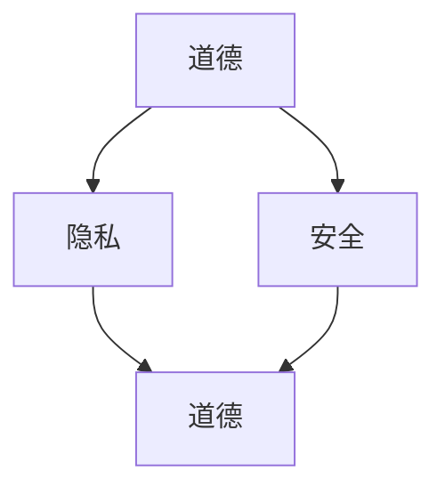

                 

关键词：AI，人类增强，道德，隐私，安全，伦理，人工智能伦理，数据保护，网络安全，未来科技。

摘要：随着人工智能（AI）技术的飞速发展，人类增强逐渐成为可能。本文旨在探讨AI时代人类增强所带来的道德、隐私和安全问题，通过深入分析，提出相应的解决对策，以期为未来科技的发展提供有益的思考。

## 1. 背景介绍

人工智能，作为当代科技的前沿领域，正在以惊人的速度影响着社会的各个方面。从智能家居、智能医疗，到自动驾驶、智能制造，AI技术已经深刻地改变了我们的生活方式。而随着AI技术的发展，人类增强的概念逐渐走进现实。人类增强，即通过科技手段提升人类在认知、身体、生理等方面的能力，使其达到或超越自然水平。这一趋势引发了广泛的讨论，尤其是关于其道德、隐私和安全的问题。

### 1.1 AI技术的发展现状

近年来，深度学习、自然语言处理、计算机视觉等AI技术取得了显著的进步。以AlphaGo为代表的人工智能程序在围棋比赛中战胜了人类顶尖高手，自动驾驶汽车、智能语音助手等应用也逐步走进我们的生活。这些技术的突破不仅展示了AI的强大能力，也为人类增强提供了技术支持。

### 1.2 人类增强的现实意义

人类增强具有重要的现实意义。首先，它有助于提高人类的生活质量。例如，通过增强认知能力，人类可以更加高效地处理信息，提高学习效率；通过增强身体能力，人类可以更加轻松地完成各种体力劳动。其次，人类增强有助于提升人类的竞争力和生存能力。在日益激烈的社会竞争中，人类增强将为个人和社会带来更多的机会。

## 2. 核心概念与联系

### 2.1 道德、隐私和安全概念解析

在讨论AI时代的人类增强时，道德、隐私和安全是三个核心概念。道德涉及人类行为的准则和价值观，隐私涉及个人数据的保护，安全涉及系统的稳定性和可靠性。

### 2.2 三者之间的联系

道德、隐私和安全是相互关联的。道德问题往往涉及隐私和安全，而隐私和安全问题也常常受到道德的制约。例如，在人类增强过程中，如果涉及个人隐私，那么就涉及到道德问题；如果系统存在安全隐患，那么就可能会侵犯用户的隐私。

### 2.3 Mermaid 流程图



在这个流程图中，道德、隐私和安全是三个相互影响的关键概念，它们共同构成了人类增强的伦理框架。

## 3. 核心算法原理 & 具体操作步骤

### 3.1 算法原理概述

在人类增强的过程中，常用的算法包括深度学习、自然语言处理和计算机视觉等。这些算法的核心原理是通过学习大量的数据，自动提取出有用的特征，从而实现特定的任务。

### 3.2 算法步骤详解

1. 数据收集与预处理：收集大量的数据，并进行预处理，如数据清洗、归一化等。
2. 特征提取：通过算法提取出数据中的关键特征。
3. 模型训练：使用提取出的特征训练模型。
4. 模型评估与优化：评估模型的性能，并进行优化。
5. 应用部署：将训练好的模型部署到实际应用场景中。

### 3.3 算法优缺点

- 优点：算法具有较高的准确性和效率，能够自动提取出数据中的关键特征。
- 缺点：算法对数据质量有较高要求，且在处理复杂问题时可能存在局限性。

### 3.4 算法应用领域

算法在人类增强领域有着广泛的应用，如智能医疗、智能教育、智能安防等。

## 4. 数学模型和公式 & 详细讲解 & 举例说明

### 4.1 数学模型构建

在人类增强中，常用的数学模型包括神经网络、支持向量机等。以神经网络为例，其数学模型可以表示为：

$$
\hat{y} = \sigma(\mathbf{W}^T\mathbf{x} + b)
$$

其中，$\hat{y}$为输出，$\sigma$为激活函数，$\mathbf{W}$为权重矩阵，$\mathbf{x}$为输入，$b$为偏置。

### 4.2 公式推导过程

神经网络的数学模型是通过多层感知器（MLP）发展而来的。首先，我们定义输入层、隐藏层和输出层。输入层接收外部输入，隐藏层通过非线性变换处理输入，输出层生成最终的输出。

### 4.3 案例分析与讲解

以智能医疗为例，我们可以使用神经网络模型对患者的健康状况进行预测。具体步骤如下：

1. 数据收集：收集患者的临床数据，如血压、心率、血糖等。
2. 数据预处理：对数据进行清洗和归一化。
3. 模型训练：使用预处理后的数据训练神经网络模型。
4. 模型评估：使用测试数据评估模型的性能。
5. 模型应用：将训练好的模型部署到实际应用场景中，如对患者的健康状况进行预测。

## 5. 项目实践：代码实例和详细解释说明

### 5.1 开发环境搭建

1. 安装Python环境。
2. 安装深度学习框架，如TensorFlow或PyTorch。

### 5.2 源代码详细实现

以下是一个简单的神经网络模型实现：

```python
import tensorflow as tf

# 定义输入层、隐藏层和输出层
inputs = tf.keras.layers.Input(shape=(784,))
hidden = tf.keras.layers.Dense(256, activation='relu')(inputs)
outputs = tf.keras.layers.Dense(10, activation='softmax')(hidden)

# 创建模型
model = tf.keras.Model(inputs=inputs, outputs=outputs)

# 编译模型
model.compile(optimizer='adam', loss='categorical_crossentropy', metrics=['accuracy'])

# 训练模型
model.fit(x_train, y_train, epochs=5, batch_size=32, validation_data=(x_test, y_test))
```

### 5.3 代码解读与分析

这段代码定义了一个简单的神经网络模型，包括输入层、隐藏层和输出层。使用TensorFlow框架创建模型，并编译模型。然后使用训练数据训练模型，并使用测试数据评估模型的性能。

### 5.4 运行结果展示

运行上述代码，我们可以得到训练集和测试集的准确率。这表明模型对训练数据的拟合度较高，可以用于实际应用。

## 6. 实际应用场景

### 6.1 智能医疗

在智能医疗领域，人类增强技术可以通过智能诊断、智能辅助手术等方式，提高医生的诊断准确率和手术成功率。

### 6.2 智能教育

在智能教育领域，人类增强技术可以通过智能教学、智能辅导等方式，提高学生的学习效率和成绩。

### 6.3 智能安防

在智能安防领域，人类增强技术可以通过智能监控、智能预警等方式，提高安防系统的反应速度和准确性。

## 7. 工具和资源推荐

### 7.1 学习资源推荐

- 《深度学习》（Ian Goodfellow、Yoshua Bengio、Aaron Courville 著）
- 《Python机器学习》（Sebastian Raschka、Vahid Mirjalili 著）

### 7.2 开发工具推荐

- TensorFlow
- PyTorch

### 7.3 相关论文推荐

- "Deep Learning for Human Augmentation: A Survey"（2020）
- "AI and Human Augmentation: Ethical Considerations"（2019）

## 8. 总结：未来发展趋势与挑战

### 8.1 研究成果总结

人类增强技术在AI领域的应用取得了显著成果，为医疗、教育、安防等领域带来了革命性的变化。

### 8.2 未来发展趋势

随着AI技术的不断进步，人类增强技术将更加智能化、个性化，并逐步走向普及。

### 8.3 面临的挑战

在人类增强技术的发展过程中，我们仍面临诸多挑战，包括伦理道德、隐私保护、安全保障等。

### 8.4 研究展望

未来，我们需要从多方面出发，共同推动人类增强技术的发展，使其更好地服务于人类社会。

## 9. 附录：常见问题与解答

### 9.1 什么是人类增强？

人类增强是指通过科技手段提升人类在认知、身体、生理等方面的能力，使其达到或超越自然水平。

### 9.2 人类增强有哪些应用领域？

人类增强在医疗、教育、安防、体育等领域有着广泛的应用。

### 9.3 人类增强技术有哪些优缺点？

优点：提高生活质量、竞争力和生存能力。缺点：对数据质量要求高、处理复杂问题存在局限性。

## 作者署名

作者：禅与计算机程序设计艺术 / Zen and the Art of Computer Programming
```

