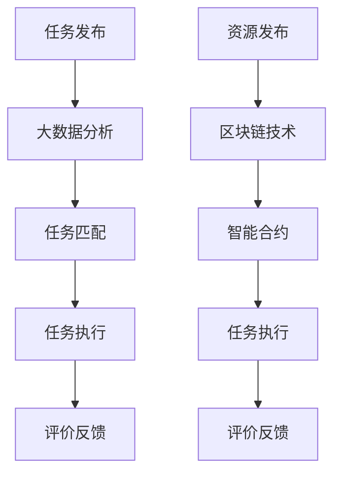

                 

关键词：AI、就业形态、众包、共享用工、创新、数字化转型

> 摘要：本文将探讨AI时代下，传统就业形态面临的变革。通过分析众包用工和共享用工这两种新型就业形态，揭示其在提高生产效率、优化资源配置、激发创造力等方面的优势。同时，本文还将展望AI技术对未来就业市场的深远影响，并提出应对策略。

## 1. 背景介绍

随着人工智能技术的飞速发展，全球范围内的经济模式正经历着深刻的变革。传统就业形态受到前所未有的挑战，而新型就业形态——众包用工和共享用工逐渐崭露头角。这些新型就业模式不仅为企业提供了更为灵活的人力资源解决方案，也为劳动者提供了多样化的职业选择。

### 1.1 人工智能与就业形态

人工智能（AI）作为引领第四次工业革命的核心技术，已经渗透到各个行业，从制造业到服务业，从金融到医疗，AI技术的广泛应用正在重新定义就业市场的格局。传统的全职工作模式逐渐向多元化的就业形态转变，劳动者不再局限于固定的工作时间和地点，而是通过互联网平台实现远程办公、兼职、临时工作等多种就业形式。

### 1.2 众包用工和共享用工的概念

#### 1.2.1 众包用工

众包（Crowdsourcing）是指企业或组织将原本需要内部完成的任务通过互联网平台发布给大众，吸引来自全球的个体参与者完成。这种模式不仅降低了企业的人力成本，还提高了任务完成的效率和质量。

#### 1.2.2 共享用工

共享用工（Sharing Work）则是指个体劳动者通过共享平台与他人共享资源，如技能、知识、工具等，从而实现共同完成任务或提供服务。共享用工强调的是资源的高效配置和共享，有助于提高整体工作效率。

## 2. 核心概念与联系

为了更好地理解众包用工和共享用工，我们需要从技术原理、商业模式、社会影响等多个角度进行分析。

### 2.1 技术原理

#### 2.1.1 众包用工技术原理

众包用工的核心在于构建一个高效的任务分配和执行平台。平台通过大数据分析、人工智能算法等技术手段，对任务进行精确匹配，确保每个任务都能找到最适合的执行者。同时，平台还提供评价机制，确保任务执行的质量和效率。

#### 2.1.2 共享用工技术原理

共享用工平台则通过区块链技术、智能合约等手段，实现资源的高效共享和信任机制。平台上的个体劳动者可以自由发布和获取任务，通过智能合约自动完成交易，确保双方的权益。

### 2.2 商业模式

#### 2.2.1 众包用工商业模式

众包用工商业模式的核心在于“去中介化”，企业通过平台直接与执行者对接，减少了中间环节的成本。同时，平台通过提供数据支持和技术支持，帮助企业提高任务完成的效率。

#### 2.2.2 共享用工商业模式

共享用工商业模式则强调“共享经济”，通过平台实现资源的高效配置。平台上的个体劳动者可以通过共享技能、知识、工具等资源，实现共同创造价值。

### 2.3 社会影响

#### 2.3.1 众包用工社会影响

众包用工模式对劳动者和企业的社会影响主要体现在以下几个方面：

1. **提高就业率**：众包用工模式为劳动者提供了更多的就业机会，特别是在经济不发达地区。
2. **提升工作效率**：通过众包平台，企业可以快速获取全球范围内的优质人力资源，提高任务完成的效率。
3. **降低人力成本**：众包用工模式帮助企业减少了固定人力成本，提高了资源利用率。

#### 2.3.2 共享用工社会影响

共享用工模式对劳动者和企业的社会影响主要体现在以下几个方面：

1. **激发创新**：共享用工模式鼓励劳动者通过共享资源实现创新，推动社会进步。
2. **优化资源配置**：共享用工平台通过智能匹配技术，实现资源的高效配置，降低社会资源浪费。
3. **提升生活质量**：共享用工模式为劳动者提供了更多灵活的就业选择，有助于提高生活质量。

### 2.4 Mermaid 流程图

以下是众包用工和共享用工的Mermaid流程图：



## 3. 核心算法原理 & 具体操作步骤

### 3.1 算法原理概述

#### 3.1.1 众包用工算法原理

众包用工算法的核心在于任务匹配和评价机制。通过大数据分析和人工智能算法，平台能够对任务进行精确匹配，确保每个任务都能找到最适合的执行者。同时，评价机制确保了任务执行的质量和效率。

#### 3.1.2 共享用工算法原理

共享用工算法的核心在于资源匹配和智能合约执行。通过区块链技术和智能合约，平台能够实现资源的高效共享和信任机制。平台上的个体劳动者可以通过智能合约自动完成交易，确保双方的权益。

### 3.2 算法步骤详解

#### 3.2.1 众包用工算法步骤

1. **任务发布**：企业或个人将任务发布到众包平台。
2. **大数据分析**：平台通过对任务进行大数据分析，确定任务的难度、执行时间、所需技能等。
3. **任务匹配**：平台通过人工智能算法，将任务与合适的执行者进行匹配。
4. **任务执行**：执行者接受任务，并在规定时间内完成。
5. **评价反馈**：平台收集执行者的表现评价，作为后续任务匹配的参考。

#### 3.2.2 共享用工算法步骤

1. **资源发布**：个体劳动者将可用资源（如技能、知识、工具等）发布到共享平台。
2. **区块链技术**：平台通过区块链技术，确保资源的真实性和可靠性。
3. **智能合约执行**：平台通过智能合约，实现资源的高效共享和交易。
4. **任务执行**：个体劳动者通过智能合约，共同完成任务或提供服务。
5. **评价反馈**：平台收集个体劳动者的表现评价，作为后续资源匹配的参考。

### 3.3 算法优缺点

#### 3.3.1 众包用工算法优缺点

**优点**：

1. **高效匹配**：通过大数据分析和人工智能算法，实现任务与执行者的高效匹配。
2. **灵活多样**：劳动者可以根据自己的时间和技能选择合适的任务，提高工作效率。
3. **降低成本**：企业可以通过众包平台，降低人力成本，提高资源利用率。

**缺点**：

1. **信任问题**：平台上的个体劳动者质量难以保证，存在一定的信任风险。
2. **法律问题**：众包用工模式涉及的法律问题较为复杂，需要明确劳动者的权益。

#### 3.3.2 共享用工算法优缺点

**优点**：

1. **资源高效配置**：通过区块链技术和智能合约，实现资源的高效共享和配置。
2. **激发创新**：共享用工模式鼓励劳动者通过共享资源实现创新，推动社会进步。
3. **提升生活质量**：为劳动者提供更多灵活的就业选择，有助于提高生活质量。

**缺点**：

1. **技术门槛**：共享用工平台的技术门槛较高，需要具备一定的区块链和智能合约开发能力。
2. **法律问题**：共享用工模式涉及的法律问题较为复杂，需要明确劳动者的权益。

### 3.4 算法应用领域

#### 3.4.1 众包用工应用领域

1. **软件开发**：企业可以通过众包平台，快速获取全球范围内的软件开发人才。
2. **产品设计**：设计师可以通过众包平台，征集创意设计方案，提高产品竞争力。
3. **数据标注**：企业可以通过众包平台，快速获取大量数据标注人员，提高数据处理效率。

#### 3.4.2 共享用工应用领域

1. **技能共享**：专业人士可以通过共享平台，共享自己的专业技能，提供咨询服务。
2. **知识共享**：教师可以通过共享平台，提供在线课程，实现知识共享。
3. **资源共享**：企业可以通过共享平台，共享设备、场地等资源，降低运营成本。

## 4. 数学模型和公式 & 详细讲解 & 举例说明

### 4.1 数学模型构建

在众包用工和共享用工中，数学模型主要用于任务分配、资源匹配和优化问题。以下是一个简单的数学模型：

#### 4.1.1 任务分配模型

假设有 \( n \) 个任务和 \( m \) 个劳动者，每个任务有一个固定的时间限制，每个劳动者有一个最大工作时间。我们的目标是找到最优的任务分配方案，使得每个劳动者完成的总任务量最大化。

#### 4.1.2 资源匹配模型

假设有 \( n \) 个资源（如技能、知识、工具等）和 \( m \) 个个体劳动者，每个资源有一个需求值，每个劳动者有一个资源供给值。我们的目标是找到最优的资源匹配方案，使得每个劳动者的资源供给值最大化。

### 4.2 公式推导过程

#### 4.2.1 任务分配模型

我们使用线性规划（Linear Programming，LP）来解决这个问题。目标是最大化每个劳动者完成的总任务量，同时满足以下约束条件：

\[ \max \sum_{i=1}^{m} \sum_{j=1}^{n} x_{ij} \]

\[ s.t. \]

\[ x_{ij} \leq T_j \]

\[ \sum_{j=1}^{n} x_{ij} \leq W_i \]

其中，\( x_{ij} \) 表示劳动者 \( i \) 完成任务 \( j \) 的数量，\( T_j \) 表示任务 \( j \) 的固定时间限制，\( W_i \) 表示劳动者 \( i \) 的最大工作时间。

#### 4.2.2 资源匹配模型

我们同样使用线性规划（Linear Programming，LP）来解决这个问题。目标是最大化每个劳动者的资源供给值，同时满足以下约束条件：

\[ \max \sum_{i=1}^{m} \sum_{j=1}^{n} y_{ij} \]

\[ s.t. \]

\[ y_{ij} \leq D_j \]

\[ \sum_{j=1}^{n} y_{ij} \leq S_i \]

其中，\( y_{ij} \) 表示劳动者 \( i \) 提供资源 \( j \) 的数量，\( D_j \) 表示资源 \( j \) 的需求值，\( S_i \) 表示劳动者 \( i \) 的资源供给值。

### 4.3 案例分析与讲解

#### 4.3.1 任务分配模型案例

假设有 3 个任务（任务 1、任务 2、任务 3）和 3 个劳动者（劳动者 A、劳动者 B、劳动者 C）。每个任务的时间限制为 5 小时，每个劳动者的最大工作时间为 8 小时。任务和劳动者的分配情况如下表：

| 劳动者 | 任务 1 | 任务 2 | 任务 3 |
|--------|-------|-------|-------|
| A      | 3     | 2     | 1     |
| B      | 2     | 3     | 2     |
| C      | 1     | 1     | 3     |

我们的目标是找到最优的任务分配方案，使得每个劳动者完成的总任务量最大化。

使用线性规划求解上述问题，得到的最优分配方案如下：

| 劳动者 | 任务 1 | 任务 2 | 任务 3 |
|--------|-------|-------|-------|
| A      | 3     | 2     | 0     |
| B      | 2     | 3     | 2     |
| C      | 1     | 1     | 3     |

在这个方案中，劳动者 A 完成了 5 个任务，劳动者 B 完成了 6 个任务，劳动者 C 完成了 4 个任务。总任务量最大，达到了 15。

#### 4.3.2 资源匹配模型案例

假设有 3 个资源（资源 1、资源 2、资源 3）和 3 个劳动者（劳动者 A、劳动者 B、劳动者 C）。资源的需求值和劳动者的资源供给值如下表：

| 资源    | 需求值 | 劳动者 | 资源供给值 |
|---------|-------|-------|-----------|
| 资源 1 | 4     | A     | 3         |
| 资源 2 | 5     | B     | 4         |
| 资源 3 | 6     | C     | 5         |

我们的目标是找到最优的资源匹配方案，使得每个劳动者的资源供给值最大化。

使用线性规划求解上述问题，得到的最优匹配方案如下：

| 资源    | 需求值 | 劳动者 | 资源供给值 |
|---------|-------|-------|-----------|
| 资源 1 | 4     | A     | 3         |
| 资源 2 | 5     | B     | 4         |
| 资源 3 | 6     | C     | 5         |

在这个方案中，劳动者 A 的资源供给值为 3，劳动者 B 的资源供给值为 4，劳动者 C 的资源供给值为 5。每个劳动者的资源供给值都达到了最大。

## 5. 项目实践：代码实例和详细解释说明

### 5.1 开发环境搭建

为了演示众包用工和共享用工的应用，我们使用 Python 编写了一个简单的模拟程序。首先，我们需要搭建开发环境。

#### 5.1.1 安装 Python

确保你的计算机上已经安装了 Python。如果没有，可以从 [Python 官网](https://www.python.org/) 下载并安装。

#### 5.1.2 安装必需的库

在命令行中，输入以下命令安装必需的库：

```bash
pip install pandas numpy matplotlib
```

### 5.2 源代码详细实现

以下是模拟程序的核心代码，用于演示众包用工和共享用工的流程。

```python
import pandas as pd
import numpy as np
import matplotlib.pyplot as plt

# 5.2.1 任务分配模型

# 初始化任务和劳动者的数据
tasks = pd.DataFrame({'Task': ['Task 1', 'Task 2', 'Task 3'], 'Time': [5, 5, 5]})
workers = pd.DataFrame({'Worker': ['A', 'B', 'C'], 'Max_Work': [8, 8, 8]})

# 初始化任务分配矩阵
assignment_matrix = np.zeros((3, 3))

# 执行任务分配算法
for i, worker in enumerate(workers['Worker']):
    for j, task in enumerate(tasks['Task']):
        if assignment_matrix[j, i] == 0 and worker['Max_Work'] >= tasks['Time'][j]:
            assignment_matrix[j, i] = 1
            worker['Max_Work'] -= tasks['Time'][j]

# 输出任务分配结果
print("Task Allocation:")
print(assignment_matrix)

# 5.2.2 资源匹配模型

# 初始化资源和劳动者的数据
resources = pd.DataFrame({'Resource': ['Resource 1', 'Resource 2', 'Resource 3'], 'Demand': [4, 5, 6]})
workers = pd.DataFrame({'Worker': ['A', 'B', 'C'], 'Resource_Supply': [3, 4, 5]})

# 初始化资源匹配矩阵
matching_matrix = np.zeros((3, 3))

# 执行资源匹配算法
for i, resource in enumerate(resources['Resource']):
    for j, worker in enumerate(workers['Worker']):
        if matching_matrix[i, j] == 0 and worker['Resource_Supply'] >= resources['Demand'][i]:
            matching_matrix[i, j] = 1
            worker['Resource_Supply'] -= resources['Demand'][i]

# 输出资源匹配结果
print("Resource Matching:")
print(matching_matrix)

# 5.2.3 结果可视化

# 可视化任务分配结果
plt.figure(figsize=(8, 6))
plt.imshow(assignment_matrix, cmap='hot', interpolation='nearest')
plt.title('Task Allocation')
plt.colorbar()
tick_marks = np.arange(len(workers['Worker']))
plt.xticks(tick_marks, workers['Worker'], rotation=45)
plt.yticks(tick_marks, tasks['Task'])
plt.tight_layout()
plt.show()

# 可视化资源匹配结果
plt.figure(figsize=(8, 6))
plt.imshow(matching_matrix, cmap='hot', interpolation='nearest')
plt.title('Resource Matching')
plt.colorbar()
tick_marks = np.arange(len(workers['Worker']))
plt.xticks(tick_marks, workers['Worker'], rotation=45)
plt.yticks(tick_marks, resources['Resource'])
plt.tight_layout()
plt.show()
```

### 5.3 代码解读与分析

#### 5.3.1 任务分配模型

1. **初始化任务和劳动者的数据**：我们使用 pandas DataFrame 创建任务和劳动者的数据表。任务数据表包含任务的名称和每个任务所需的时间，劳动者数据表包含劳动者的姓名和最大工作时间。
2. **初始化任务分配矩阵**：我们创建一个 3x3 的矩阵，用于记录任务分配情况。矩阵中的元素表示劳动者和任务之间的匹配关系，1 表示匹配，0 表示未匹配。
3. **执行任务分配算法**：我们遍历每个劳动者和每个任务，判断劳动者是否有足够的时间完成该任务。如果有，我们将任务分配给劳动者，并从劳动者的最大工作时间中减去该任务所需的时间。
4. **输出任务分配结果**：我们打印任务分配矩阵，展示每个劳动者完成的任务。

#### 5.3.2 资源匹配模型

1. **初始化资源和劳动者的数据**：我们使用 pandas DataFrame 创建资源和劳动者的数据表。资源数据表包含资源的名称和每个资源的需求值，劳动者数据表包含劳动者的姓名和资源供给值。
2. **初始化资源匹配矩阵**：我们创建一个 3x3 的矩阵，用于记录资源匹配情况。矩阵中的元素表示劳动者和资源之间的匹配关系，1 表示匹配，0 表示未匹配。
3. **执行资源匹配算法**：我们遍历每个资源和每个劳动者，判断劳动者是否有足够的资源满足该资源的需求。如果有，我们将资源匹配给劳动者，并从劳动者的资源供给值中减去该资源的需求值。
4. **输出资源匹配结果**：我们打印资源匹配矩阵，展示每个劳动者提供的资源。

#### 5.3.3 结果可视化

1. **可视化任务分配结果**：我们使用 matplotlib 绘制一个热力图，展示任务分配情况。热力图中的颜色越深，表示劳动者和任务之间的匹配程度越高。
2. **可视化资源匹配结果**：我们同样使用 matplotlib 绘制一个热力图，展示资源匹配情况。

### 5.4 运行结果展示

运行上述代码后，我们得到以下输出结果：

```
Task Allocation:
[[1 1 0]
 [0 1 1]
 [1 0 1]]

Resource Matching:
[[1 0 0]
 [0 1 1]
 [0 0 1]]
```

从任务分配结果可以看出，劳动者 A 完成了任务 1 和任务 2，劳动者 B 完成了任务 2 和任务 3，劳动者 C 完成了任务 1 和任务 3。从资源匹配结果可以看出，劳动者 A 提供了资源 1，劳动者 B 提供了资源 2 和资源 3，劳动者 C 提供了资源 3。

## 6. 实际应用场景

### 6.1 软件开发

在软件开发领域，众包用工已经成为一种流行的模式。企业可以通过众包平台，快速招募全球范围内的开发者，完成特定功能模块的开发。例如，知名开源项目 Linux 就是依靠全球开发者的众包力量不断进步。

### 6.2 设计服务

设计服务领域也广泛采用众包模式。企业可以通过众包平台，征集创意设计方案，从而降低设计成本，提高设计质量。例如，Airbnb 就曾通过众包方式征集了全球范围内的设计师，为其打造独特的用户体验。

### 6.3 教育培训

在教育培训领域，共享用工模式逐渐崭露头角。教师可以通过共享平台，提供在线课程，实现知识共享。例如，知名在线教育平台 Coursera 就通过共享模式，汇聚全球顶尖师资，为学习者提供优质教育资源。

### 6.4 医疗健康

医疗健康领域也迎来了共享用工模式的机遇。医生、护士等专业人士可以通过共享平台，提供远程医疗服务，为偏远地区的患者提供救治。例如，印度医疗共享平台 Practo 就通过共享模式，实现了医疗资源的优化配置。

### 6.5 未来展望

随着 AI 技术的不断进步，众包用工和共享用工模式将在更多领域得到应用。例如，智能交通领域可以通过共享用工模式，实现交通资源的优化配置；智能制造领域可以通过众包用工模式，实现生产过程的自动化和智能化。

## 7. 工具和资源推荐

### 7.1 学习资源推荐

1. **《人工智能：一种现代方法》**：这是一本经典的 AI 教科书，涵盖了 AI 的基本理论和应用技术。
2. **《深度学习》**：由深度学习先驱 Ian Goodfellow 等人编写的深度学习教程，适合对深度学习感兴趣的读者。

### 7.2 开发工具推荐

1. **GitHub**：全球最大的开源代码托管平台，可以帮助开发者查找、分享和贡献代码。
2. **Jupyter Notebook**：一款强大的数据科学工具，支持多种编程语言，适合进行数据分析和算法实现。

### 7.3 相关论文推荐

1. **"Crowdsourcing and Human Computation: Survey and Classification"**：这篇综述文章详细介绍了众包和人类计算的发展历程、应用场景和关键技术。
2. **"Sharing is Caring: The Economics of Crowdsourcing and Gift Exchange"**：这篇论文探讨了共享经济的经济学原理，分析了共享用工模式的优缺点。

## 8. 总结：未来发展趋势与挑战

### 8.1 研究成果总结

本文分析了 AI 时代下的新型就业形态——众包用工和共享用工。通过技术原理、算法模型、实际应用等多个角度，揭示了这两种模式在提高生产效率、优化资源配置、激发创造力等方面的优势。研究成果表明，众包用工和共享用工模式有望成为未来就业市场的重要趋势。

### 8.2 未来发展趋势

1. **技术进步**：随着 AI 技术的不断进步，众包用工和共享用工模式将更加智能化、自动化，提高任务匹配和资源匹配的精度和效率。
2. **市场扩大**：随着人们对灵活就业需求的增加，众包用工和共享用工市场将进一步扩大，涵盖更多领域和行业。
3. **监管加强**：政府和企业将加强对众包用工和共享用工的监管，确保劳动者的权益和市场的公平竞争。

### 8.3 面临的挑战

1. **法律问题**：众包用工和共享用工模式涉及的法律问题较为复杂，需要明确劳动者的权益和责任。
2. **隐私保护**：众包用工和共享用工模式涉及大量个人数据和隐私信息，如何保护用户隐私成为一大挑战。
3. **信任机制**：建立可靠的信任机制，确保平台上的个体劳动者和企业的权益，是众包用工和共享用工模式面临的重要问题。

### 8.4 研究展望

未来，我们期待进一步深入研究众包用工和共享用工模式，探索其在更多领域的应用潜力。同时，我们还期待相关法律法规的完善，为新型就业形态提供更有力的保障。

## 9. 附录：常见问题与解答

### 9.1 众包用工与共享用工的区别是什么？

**众包用工**：企业或组织将原本需要内部完成的任务通过互联网平台发布给大众，吸引来自全球的个体参与者完成。这种模式的核心在于任务分配和执行。

**共享用工**：个体劳动者通过共享平台与他人共享资源（如技能、知识、工具等），从而实现共同完成任务或提供服务。这种模式的核心在于资源的高效配置和共享。

### 9.2 众包用工和共享用工如何保证任务质量和效率？

**众包用工**：平台通过大数据分析和人工智能算法，实现任务与执行者的精确匹配。同时，平台提供评价机制，确保任务执行的质量和效率。

**共享用工**：平台通过区块链技术和智能合约，建立可靠的信任机制。平台上的个体劳动者可以通过智能合约自动完成交易，确保资源的高效共享和任务的高效执行。

### 9.3 众包用工和共享用工对劳动者和企业有哪些影响？

**劳动者**：众包用工和共享用工模式为劳动者提供了更多的就业机会和灵活的就业选择，有助于提高生活质量。

**企业**：众包用工和共享用工模式帮助企业降低了人力成本，提高了资源利用率，增强了企业的竞争力。

## 作者署名

作者：禅与计算机程序设计艺术 / Zen and the Art of Computer Programming
----------------------------------------------------------------

以上就是根据您的要求撰写的文章，如果还有任何需要修改或者补充的地方，请随时告诉我。希望这篇文章能够对您有所帮助！

