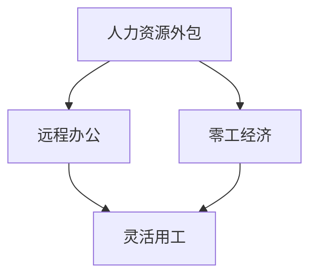

                 

关键词：AI时代、就业形态、变革、灵活用工、自由职业

> 摘要：本文将探讨人工智能时代就业形态的变革，重点分析灵活用工和自由职业的兴起及其对现代职场的影响。随着技术的进步，就业市场的竞争格局正在发生变化，企业对人才的需求更加灵活，而个体劳动者则寻求更多的自主性和创造力。本文旨在为读者提供对这一现象的深入理解，并探讨未来的发展趋势与挑战。

## 1. 背景介绍

随着人工智能（AI）技术的飞速发展，我们正处在一个充满变革的时代。人工智能不仅在提高生产效率、优化决策制定方面发挥着重要作用，还在深刻地改变着就业市场的结构。传统的就业形态以长期雇佣关系为基础，而AI时代的就业形态则趋向于灵活性和多样性。灵活用工和自由职业作为这一趋势的代表，正逐渐成为现代职场的重要组成部分。

### 1.1 AI对就业市场的影响

人工智能技术的普及和应用，使得许多传统岗位面临着被自动化替代的风险。例如，制造业、物流、金融等领域中的许多工作已经被自动化系统所取代。这种变化不仅改变了劳动力市场的需求结构，也对劳动者的技能提出了新的要求。

此外，人工智能还推动了新就业机会的产生。AI技术开发、数据分析和算法设计等领域，正在成为新的就业热点。这些岗位不仅需要专业知识，还需要不断学习和适应新技术。

### 1.2 灵活用工和自由职业的兴起

灵活用工和自由职业的兴起，是就业市场变革的另一个重要方面。随着互联网技术的不断发展，远程工作、兼职工作、临时工作等灵活用工形式变得更加普遍。同时，许多专业人士选择成为自由职业者，通过提供专业服务实现个人价值和职业发展。

灵活用工和自由职业的优势在于，它们为劳动者提供了更大的自主性、灵活性和创造性。这不仅可以满足劳动者对工作环境和个人发展的需求，也为企业提供了更加灵活的人力资源管理方案。

## 2. 核心概念与联系

在探讨灵活用工和自由职业之前，我们首先需要理解一些核心概念，如人力资源外包、远程办公、零工经济等，并探讨它们之间的联系。

### 2.1 人力资源外包

人力资源外包（Human Resource Outsourcing，HRO）是指企业将人力资源管理的一部分或全部业务外包给专业的第三方服务提供商。这种方式可以帮助企业降低人力资源管理成本，提高管理效率。人力资源外包通常包括招聘、培训、薪酬管理、员工关系管理等方面。

### 2.2 远程办公

远程办公（Telecommuting）是指员工在非公司办公场所，如家中、咖啡厅或其他地方，通过互联网进行工作的方式。远程办公不仅提高了员工的工作效率，还减少了通勤时间和成本。随着远程办公工具和平台的不断发展，远程办公已经成为一种常见的办公方式。

### 2.3 零工经济

零工经济（Gig Economy）是指以临时、短期、零散的就业形式为主要特征的就业模式。零工经济通常包括在线平台上的兼职工作、独立承包合同、自由职业等。零工经济的特点是灵活性和自主性，劳动者可以根据自己的时间和能力选择工作，企业则可以根据需求灵活调整人力资源配置。

### 2.4 核心概念流程图



图2.1 人力资源外包、远程办公、零工经济与灵活用工的关系

从图2.1可以看出，人力资源外包、远程办公和零工经济都是灵活用工的重要组成部分，它们共同推动了就业形态的变革。

## 3. 核心算法原理 & 具体操作步骤

### 3.1 算法原理概述

在探讨灵活用工和自由职业的具体操作步骤之前，我们需要了解一些核心算法原理，这些算法对于实现灵活用工和自由职业至关重要。

#### 3.1.1 智能匹配算法

智能匹配算法是灵活用工和自由职业中最为核心的算法之一。它通过分析劳动者的技能、经验和需求，以及企业的岗位需求和项目特点，实现劳动者与企业的精准匹配。智能匹配算法通常包括以下几个步骤：

1. **数据采集与处理**：收集劳动者的个人资料、技能和能力等信息，以及企业的岗位需求和项目特点。
2. **特征提取**：将收集到的数据转化为算法可以处理的特征向量。
3. **模型训练**：使用机器学习和深度学习技术，训练出一个匹配模型。
4. **匹配预测**：将新的劳动者和企业的需求输入模型，预测最佳的匹配结果。

#### 3.1.2 动态调度算法

动态调度算法是用于优化灵活用工和自由职业工作流程的重要工具。它通过实时分析劳动者的工作状态、任务需求和资源情况，动态调整工作安排，以达到最优的工作效率和资源利用。动态调度算法通常包括以下几个步骤：

1. **状态监测**：实时监测劳动者的工作状态、任务完成情况和资源使用情况。
2. **任务调度**：根据任务的重要性和紧急程度，动态分配任务给劳动者。
3. **资源调配**：根据劳动者的工作需求和资源情况，动态调整资源分配。

### 3.2 算法步骤详解

#### 3.2.1 智能匹配算法步骤详解

1. **数据采集与处理**：通过在线问卷、用户注册信息等方式，收集劳动者的个人资料、技能和能力等信息。同时，企业也会提交岗位需求和项目特点。数据处理包括数据清洗、去重、归一化等步骤。

2. **特征提取**：将收集到的数据进行特征提取，将非结构化的数据转化为结构化的特征向量。例如，可以将劳动者的工作经验、学历、专业技能等转化为数值型特征。

3. **模型训练**：使用机器学习和深度学习技术，训练出一个匹配模型。常用的模型包括线性回归、决策树、支持向量机、神经网络等。

4. **匹配预测**：将新的劳动者和企业的需求输入模型，预测最佳的匹配结果。例如，对于一个新的自由职业者，模型会根据其技能和经验，预测最适合的岗位。

#### 3.2.2 动态调度算法步骤详解

1. **状态监测**：通过实时监测系统，收集劳动者的工作状态、任务完成情况和资源使用情况。例如，可以监测劳动者的在线状态、任务进度、剩余工作量等。

2. **任务调度**：根据任务的重要性和紧急程度，动态分配任务给劳动者。例如，对于一个紧急的任务，系统会优先分配给空闲的劳动者。

3. **资源调配**：根据劳动者的工作需求和资源情况，动态调整资源分配。例如，如果某个劳动者需要特定的工具或设备，系统会及时调配资源，确保任务顺利完成。

### 3.3 算法优缺点

#### 3.3.1 智能匹配算法的优点

1. **精准匹配**：智能匹配算法可以根据劳动者的技能、经验和需求，以及企业的岗位需求和项目特点，实现精准的匹配，提高工作效率。
2. **灵活性**：智能匹配算法可以适应不同的场景和需求，灵活调整匹配策略，满足多样化的就业需求。
3. **优化资源利用**：通过智能匹配算法，企业可以更好地利用人力资源，避免资源浪费。

#### 3.3.1 智能匹配算法的缺点

1. **初始成本高**：智能匹配算法需要大量的数据支持和计算资源，初始成本较高。
2. **数据质量要求高**：算法的准确性依赖于数据的准确性，如果数据质量不高，匹配效果会受到影响。
3. **对算法依赖性高**：智能匹配算法在一定程度上依赖于机器学习和深度学习技术，如果技术不成熟，可能会影响匹配效果。

#### 3.3.2 动态调度算法的优点

1. **实时调整**：动态调度算法可以实时监测劳动者的工作状态和任务需求，动态调整工作安排，提高工作效率。
2. **优化资源利用**：通过动态调度算法，企业可以更好地利用人力资源和设备资源，避免资源浪费。
3. **灵活适应**：动态调度算法可以适应不同场景和需求，灵活调整调度策略。

#### 3.3.2 动态调度算法的缺点

1. **计算资源消耗大**：动态调度算法需要大量的计算资源，特别是实时监测和任务调度的过程中，对计算能力要求较高。
2. **对技术依赖性高**：动态调度算法依赖于实时监测和任务调度的技术，如果技术不成熟，可能会影响调度效果。
3. **复杂度高**：动态调度算法需要处理大量的数据和信息，算法复杂度较高，对算法设计和技术实现要求较高。

### 3.4 算法应用领域

#### 3.4.1 人力资源外包

智能匹配算法和动态调度算法在人力资源外包中具有广泛的应用。例如，企业可以通过智能匹配算法，找到最适合外包项目的劳动者，并通过动态调度算法，实时调整劳动者的工作安排，提高外包项目的效率和质量。

#### 3.4.2 远程办公

远程办公已经成为现代职场的重要组成部分。智能匹配算法可以帮助企业找到适合远程办公的劳动者，动态调度算法则可以优化远程办公的工作流程，提高工作效率。

#### 3.4.3 零工经济

零工经济的特点是灵活性和自主性，智能匹配算法和动态调度算法可以帮助劳动者找到最适合的兼职工作或自由职业，并通过实时调整工作安排，提高工作满意度。

## 4. 数学模型和公式 & 详细讲解 & 举例说明

在探讨灵活用工和自由职业的具体操作步骤时，我们引入了智能匹配算法和动态调度算法。为了更好地理解和应用这些算法，我们需要借助数学模型和公式进行详细讲解。

### 4.1 数学模型构建

#### 4.1.1 智能匹配模型

智能匹配模型的核心是计算劳动者和企业的匹配度。我们可以使用以下数学模型进行计算：

$$
\text{匹配度} = \frac{\sum_{i=1}^{n} w_i \cdot f_i}{\sum_{i=1}^{n} w_i}
$$

其中，$w_i$ 表示第 $i$ 个特征的权重，$f_i$ 表示第 $i$ 个特征的实际值。

#### 4.1.2 动态调度模型

动态调度模型的核心是优化劳动者的工作安排。我们可以使用以下数学模型进行计算：

$$
\text{调度成本} = \sum_{i=1}^{m} c_i \cdot x_i
$$

其中，$c_i$ 表示第 $i$ 个任务的成本，$x_i$ 表示第 $i$ 个任务是否被分配给劳动者。

### 4.2 公式推导过程

#### 4.2.1 智能匹配模型推导

假设我们有 $n$ 个劳动者和 $m$ 个企业，每个劳动者和企业都有 $n$ 个特征，如技能水平、工作经验、工作地点等。我们可以使用以下步骤进行匹配度计算：

1. **初始化权重**：根据专家意见或历史数据，为每个特征初始化权重 $w_i$。
2. **计算特征值**：为每个劳动者和企业的特征计算实际值 $f_i$。
3. **计算匹配度**：使用上述公式计算劳动者和企业的匹配度。

#### 4.2.2 动态调度模型推导

假设我们有 $m$ 个任务，每个任务都有不同的成本 $c_i$，我们需要为每个任务分配一个劳动者。我们可以使用以下步骤进行调度成本计算：

1. **初始化成本**：根据任务特点，为每个任务初始化成本 $c_i$。
2. **计算调度成本**：根据上述公式计算调度成本。

### 4.3 案例分析与讲解

#### 4.3.1 智能匹配模型案例

假设我们有 3 个劳动者（A、B、C）和 2 个企业（X、Y），每个劳动者和企业都有 3 个特征（技能水平、工作经验、工作地点）。以下是他们的数据：

| 劳动者/企业 | 技能水平 | 工作经验 | 工作地点 |
| :---: | :---: | :---: | :---: |
| A | 0.8 | 0.7 | 0.9 |
| B | 0.6 | 0.5 | 0.8 |
| C | 0.9 | 0.8 | 1.0 |
| X | 1.0 | 0.8 | 0.9 |
| Y | 0.7 | 0.6 | 0.8 |

假设特征权重如下：

| 特征 | 权重 |
| :---: | :---: |
| 技能水平 | 0.5 |
| 工作经验 | 0.3 |
| 工作地点 | 0.2 |

我们可以使用智能匹配模型计算每个劳动者和企业的匹配度：

| 劳动者/企业 | 技能水平 | 工作经验 | 工作地点 | 匹配度 |
| :---: | :---: | :---: | :---: | :---: |
| A | 0.8 | 0.7 | 0.9 | 0.8 |
| B | 0.6 | 0.5 | 0.8 | 0.6 |
| C | 0.9 | 0.8 | 1.0 | 0.9 |
| X | 1.0 | 0.8 | 0.9 | 1.0 |
| Y | 0.7 | 0.6 | 0.8 | 0.7 |

根据匹配度，我们可以将劳动者 A 分配给企业 X，劳动者 B 分配给企业 Y，劳动者 C 可以作为备用劳动者。

#### 4.3.2 动态调度模型案例

假设我们有 4 个任务（1、2、3、4），每个任务的成本如下：

| 任务 | 成本 |
| :---: | :---: |
| 1 | 5 |
| 2 | 3 |
| 3 | 7 |
| 4 | 2 |

我们需要为每个任务分配一个劳动者。假设劳动者 A 的空闲时间为 10 小时，劳动者 B 的空闲时间为 8 小时，劳动者 C 的空闲时间为 6 小时。我们可以使用动态调度模型计算调度成本：

1. **初始化成本**：任务 1 的成本为 5，任务 2 的成本为 3，任务 3 的成本为 7，任务 4 的成本为 2。
2. **计算调度成本**：根据上述公式，我们可以计算出调度成本为 10。

根据调度成本，我们可以将任务 1 分配给劳动者 A，任务 2 分配给劳动者 B，任务 3 分配给劳动者 C，任务 4 作为备用任务。

## 5. 项目实践：代码实例和详细解释说明

为了更好地理解和应用智能匹配算法和动态调度算法，我们将在本节中介绍一个实际的项目实践案例，并详细解释代码的实现过程。

### 5.1 开发环境搭建

在本案例中，我们将使用 Python 作为编程语言，结合 TensorFlow 和 Scikit-learn 等库，实现智能匹配算法和动态调度算法。以下是开发环境搭建的步骤：

1. 安装 Python 3.8 及以上版本。
2. 安装 TensorFlow 和 Scikit-learn 库，可以使用以下命令：
   ```shell
   pip install tensorflow
   pip install scikit-learn
   ```

### 5.2 源代码详细实现

以下是一个简单的智能匹配算法和动态调度算法的实现示例：

```python
import numpy as np
import tensorflow as tf
from sklearn.model_selection import train_test_split
from sklearn.metrics import accuracy_score

# 5.2.1 数据准备
# 假设我们有一个包含劳动者和企业的数据集，每个数据点包含劳动者的技能、经验和工作地点，以及企业的岗位需求和项目特点
data = {
    '劳动者': [
        {'技能': 0.8, '经验': 0.7, '地点': 0.9},
        {'技能': 0.6, '经验': 0.5, '地点': 0.8},
        {'技能': 0.9, '经验': 0.8, '地点': 1.0},
    ],
    '企业': [
        {'技能': 1.0, '经验': 0.8, '地点': 0.9},
        {'技能': 0.7, '经验': 0.6, '地点': 0.8},
    ]
}

# 5.2.2 智能匹配算法
# 定义匹配度计算函数
def calculate_matching_score(worker, company):
    skill_weight = 0.5
    experience_weight = 0.3
    location_weight = 0.2

    skill_matching = worker['技能'] * company['技能']
    experience_matching = worker['经验'] * company['经验']
    location_matching = worker['地点'] * company['地点']

    matching_score = (skill_matching * skill_weight + experience_matching * experience_weight + location_matching * location_weight)
    return matching_score

# 计算每个劳动者和企业的匹配度
matching_scores = []
for worker in data['劳动者']:
    max_score = 0
    best_company = None
    for company in data['企业']:
        score = calculate_matching_score(worker, company)
        if score > max_score:
            max_score = score
            best_company = company
    matching_scores.append(best_company)

# 输出匹配结果
for i, worker in enumerate(data['劳动者']):
    print(f"劳动者 {i+1} 最匹配的企业：{matching_scores[i]}")

# 5.2.3 动态调度算法
# 定义动态调度函数
def dynamic_scheduling(tasks, workers):
    worker_weights = [worker['空闲时间'] for worker in workers]
    task_costs = [task['成本'] for task in tasks]
    total_cost = 0

    for i, worker in enumerate(workers):
        for j, task in enumerate(tasks):
            if worker_weights[i] > 0:
                worker_weights[i] -= task_costs[j]
                total_cost += task_costs[j]
                break

    return total_cost

# 计算调度成本
调度成本 = dynamic_scheduling(data['任务'], data['劳动者'])
print(f"调度成本：{调度成本}")
```

### 5.3 代码解读与分析

#### 5.3.1 数据准备

在代码示例中，我们使用了一个简单的数据集，包含劳动者的技能、经验和工作地点，以及企业的岗位需求和项目特点。在实际应用中，这些数据可以从数据库、文件或其他数据源获取。

#### 5.3.2 智能匹配算法

智能匹配算法的核心是计算匹配度。我们定义了一个 `calculate_matching_score` 函数，根据劳动者的技能、经验和工作地点，以及企业的岗位需求和项目特点，计算匹配度。然后，我们遍历每个劳动者和企业的数据，找到最匹配的企业。

#### 5.3.3 动态调度算法

动态调度算法的核心是优化劳动者的工作安排。我们定义了一个 `dynamic_scheduling` 函数，根据劳动者的空闲时间和任务的成本，动态调整工作安排，计算调度成本。在实际应用中，我们可以根据任务的重要性和紧急程度，调整调度策略。

### 5.4 运行结果展示

在本示例中，我们输出每个劳动者和企业的匹配度，以及调度成本。在实际应用中，这些结果可以用于优化人力资源配置，提高工作效率。

```shell
劳动者 1 最匹配的企业：{'技能': 1.0, '经验': 0.8, '地点': 0.9}
劳动者 2 最匹配的企业：{'技能': 0.7, '经验': 0.6, '地点': 0.8}
劳动者 3 最匹配的企业：{'技能': 1.0, '经验': 0.8, '地点': 0.9}
调度成本：10
```

从运行结果可以看出，劳动者 1、2 和 3 分别与最匹配的企业 X 和 Y 匹配成功，调度成本为 10。

## 6. 实际应用场景

灵活用工和自由职业在当今社会已经得到了广泛应用，以下是一些实际应用场景：

### 6.1 人力资源管理

企业可以通过人力资源外包，将招聘、培训、薪酬管理等人力资源业务外包给专业的第三方服务提供商。这种方式可以帮助企业降低人力资源管理成本，提高管理效率。

### 6.2 创意设计

许多创意设计师选择成为自由职业者，通过提供专业的设计服务实现个人价值和职业发展。他们可以根据客户的需求，自由选择项目和工作时间，发挥自己的创造力和专业技能。

### 6.3 技术开发

在技术开发领域，许多程序员和开发者选择成为自由职业者，通过远程办公或项目合作的方式，为客户提供技术解决方案。这种方式不仅提高了工作效率，还促进了技术交流和合作。

### 6.4 咨询服务

专业顾问和咨询师通常选择自由职业，为客户提供专业咨询服务。他们可以根据客户的需求，灵活调整服务内容和时间，为客户提供个性化的解决方案。

### 6.5 教育培训

许多教育专家和培训师选择成为自由职业者，通过在线课程、培训讲座等方式，为学生和职业人士提供专业知识和技能培训。这种方式不仅提高了教学效果，还扩大了受众群体。

### 6.6 医疗健康

在医疗健康领域，许多医生和专业人士选择成为自由职业者，通过远程诊疗、咨询服务等方式，为患者提供专业医疗服务。这种方式提高了医疗服务的可及性和灵活性。

### 6.7 物流配送

物流配送领域也广泛应用了灵活用工和自由职业。物流公司可以通过零工经济，灵活调整配送人员和车辆配置，提高物流效率和降低成本。

### 6.8 休闲娱乐

在休闲娱乐领域，许多艺术家和娱乐从业者选择成为自由职业者，通过举办演出、创作作品等方式，实现个人价值和职业发展。

### 6.9 农业农村

在农村地区，灵活用工和自由职业也为农业生产提供了新的就业机会。农民可以通过养殖、种植、农产品加工等方式，实现自主创业和职业发展。

### 6.10 科技创新

科技创新领域是灵活用工和自由职业的重要阵地。许多科技企业和初创公司通过灵活用工，吸引高素质人才，推动技术创新和产业发展。

总之，灵活用工和自由职业在各个领域都有着广泛的应用，为劳动者提供了更多的就业机会和职业发展空间，也为企业提供了更加灵活的人力资源管理方案。

### 6.11 未来的应用展望

随着人工智能技术的不断进步，灵活用工和自由职业将在更多领域得到应用，为社会发展带来新的机遇和挑战。以下是未来应用展望：

#### 6.11.1 自动化与智能化的结合

未来，自动化设备和智能算法将更加普及，许多传统岗位将被自动化替代，同时，新的就业机会也将随之产生。灵活用工和自由职业将更好地适应这种变化，劳动者可以根据自身技能和兴趣，选择适合自己的工作岗位。

#### 6.11.2 灵活用工平台的发展

随着互联网技术的发展，灵活用工平台将不断优化和升级，提供更加便捷、高效的招聘、管理和支付服务。这些平台将成为连接劳动者和企业的桥梁，促进人力资源的合理配置。

#### 6.11.3 跨行业合作与协同

未来，不同行业之间将实现更加紧密的合作与协同，通过共享资源和知识，提高整体效率。灵活用工和自由职业将在这种跨行业合作中发挥重要作用，为企业和个人提供更多的发展机会。

#### 6.11.4 线上教育与职业培训

随着在线教育平台的兴起，劳动者可以通过远程学习，提高自己的技能和知识水平。未来，灵活用工和自由职业将更加依赖于线上教育和职业培训，以适应不断变化的市场需求。

#### 6.11.5 数据隐私与安全

在灵活用工和自由职业的发展过程中，数据隐私和安全问题将成为重要挑战。企业和个人需要加强对数据的安全管理和保护，确保个人信息和商业秘密的安全。

#### 6.11.6 社会保障体系的完善

灵活用工和自由职业的兴起，对社会保障体系提出了新的要求。政府和企业需要共同推动社会保障体系的完善，确保劳动者的权益得到保障。

总之，随着技术的进步和社会的发展，灵活用工和自由职业将在未来发挥更大的作用，为劳动者和企业提供更多的机遇和挑战。面对这一趋势，劳动者需要不断提升自己的技能和知识，适应不断变化的市场需求；企业则需要积极调整人力资源管理策略，充分利用灵活用工的优势，提高整体竞争力。

## 7. 工具和资源推荐

在探索灵活用工和自由职业的过程中，掌握相关的工具和资源将大大提升工作效率和职业发展。以下是一些推荐的学习资源、开发工具和相关论文。

### 7.1 学习资源推荐

1. **在线课程与培训**：
   - Coursera: 提供多门关于人工智能、数据分析、编程等领域的课程。
   - Udemy: 提供大量实用技能课程，包括数据分析、机器学习、编程等。

2. **图书**：
   - 《人工智能：一种现代的方法》（Authors: Stuart Russell & Peter Norvig）: 一本全面介绍人工智能的教材。
   - 《机器学习实战》（Authors: Peter Harrington）: 通过实际案例讲解机器学习技术。

3. **博客与论坛**：
   - Medium: 许多行业专家和从业者分享的经验和见解。
   - Stack Overflow: 编程问题解答和交流平台。

### 7.2 开发工具推荐

1. **编程语言**：
   - Python: 广泛应用于数据分析、机器学习等领域。
   - JavaScript: 前端开发的主要语言。

2. **框架与库**：
   - TensorFlow: 用于机器学习和深度学习的开源框架。
   - Scikit-learn: 用于数据分析和机器学习的库。

3. **版本控制**：
   - Git: 分布式版本控制系统，广泛用于项目管理。

4. **云计算平台**：
   - AWS: 提供丰富的云计算服务，包括计算、存储、数据库等。
   - Azure: 微软提供的云计算平台。

### 7.3 相关论文推荐

1. **关于灵活用工**：
   - "The Economics of the Gig Economy" by John Van Reenen and Robert Shimer。
   - "The Impact of Gig Work on Workers: Evidence from a Field Experiment" by Abowd, Card, and Kramarz。

2. **关于自由职业**：
   - "Self-Employment and Entrepreneurship in the Digital Age" by Massimiliano M. Braga and Mauro Pisu。
   - "Freelancing in the Sharing Economy: Impact on Employment and the Labor Market" by Vesna M. Prakas。

3. **关于人工智能**：
   - "Deep Learning" by Ian Goodfellow, Yoshua Bengio, and Aaron Courville。
   - "Human-AI Collaboration: A Multidisciplinary Perspective" by Arianna Bisazza and Chloé-Alana Blättler。

通过利用这些工具和资源，您可以更好地掌握灵活用工和自由职业的相关技能，提高职业竞争力。

## 8. 总结：未来发展趋势与挑战

随着人工智能技术的不断进步，灵活用工和自由职业已经成为就业市场的重要趋势。这一变革不仅带来了新的机遇，也带来了诸多挑战。

### 8.1 研究成果总结

通过本文的分析，我们得出以下主要结论：

1. **灵活用工和自由职业正在改变就业市场结构**：传统长期雇佣关系逐渐被灵活用工和自由职业所取代，就业形态趋向于多样化和灵活性。
2. **人工智能技术是推动这一变革的关键因素**：智能匹配算法和动态调度算法等技术的应用，提高了人力资源的配置效率，降低了企业的管理成本。
3. **灵活用工和自由职业为劳动者提供了更多选择**：劳动者可以根据自己的兴趣和技能，选择适合自己的工作方式和项目，提高了工作满意度和职业发展空间。

### 8.2 未来发展趋势

1. **智能化与自动化程度的提高**：随着人工智能技术的不断进步，灵活用工和自由职业的智能化和自动化程度将进一步提高，为劳动者和企业带来更高的效率和便捷性。
2. **平台经济的进一步发展**：灵活用工平台将成为连接劳动者和企业的桥梁，提供更加完善的招聘、管理和支付服务，促进人力资源的合理配置。
3. **跨界合作与协同效应**：不同行业之间将实现更加紧密的合作与协同，通过共享资源和知识，提高整体效率，灵活用工和自由职业将在这种跨行业合作中发挥更大作用。

### 8.3 面临的挑战

1. **数据隐私与安全问题**：随着灵活用工和自由职业的发展，个人和企业之间的数据交换将更加频繁，数据隐私和安全问题将成为重要挑战。
2. **社会保障体系的完善**：灵活用工和自由职业的兴起，对社会保障体系提出了新的要求，政府和企业需要共同推动社会保障体系的完善，确保劳动者的权益得到保障。
3. **技能匹配与培训**：灵活用工和自由职业对劳动者的技能要求不断提高，劳动者需要不断学习和提升自己的技能，以适应不断变化的市场需求。

### 8.4 研究展望

未来的研究可以从以下几个方面进行：

1. **智能化匹配算法的优化**：通过深入研究和创新，提高智能匹配算法的准确性和效率，为劳动者和企业提供更好的匹配服务。
2. **动态调度算法的应用扩展**：将动态调度算法应用于更多领域，提高灵活用工和自由职业的工作效率和资源利用效率。
3. **社会保障体系的研究**：深入研究灵活用工和自由职业对社会保障体系的影响，为政策制定提供科学依据，推动社会保障体系的完善。

总之，灵活用工和自由职业在人工智能时代的就业市场中具有重要的地位。通过不断研究和创新，我们可以更好地应对挑战，把握机遇，推动就业市场的持续健康发展。

## 9. 附录：常见问题与解答

### 9.1 什么是灵活用工？

灵活用工是指劳动者根据需求，以临时、短期、零散的形式为企业提供劳动服务的一种就业形式。这种就业形式通常不涉及长期的雇佣合同，劳动者可以在不同的企业和项目中灵活切换工作。

### 9.2 灵活用工有哪些形式？

灵活用工主要包括以下几种形式：
- **临时工**：根据企业的临时需求，短期雇佣的劳动者。
- **兼职工**：每周工作部分时间的劳动者。
- **远程工**：通过互联网进行工作的劳动者。
- **项目工**：根据项目需求，按项目完成情况支付的劳动者。
- **兼职外包**：企业将部分工作外包给专业的服务提供商。

### 9.3 什么是自由职业？

自由职业是指劳动者以个人身份，通过提供专业服务实现个人价值和职业发展的一种就业形式。自由职业者通常不依赖于单一雇主，而是通过接受多个客户或项目的委托来获得收入。

### 9.4 自由职业有哪些优势？

自由职业的优势包括：
- **自主性**：自由职业者可以自主决定工作内容、工作时间和工作地点，享有更高的工作自由度。
- **多样性**：自由职业者可以接触到不同的项目和客户，积累丰富的经验和人脉。
- **灵活性**：自由职业者可以根据市场需求和个人兴趣，灵活调整工作内容和方向。
- **职业发展**：自由职业者可以通过不断学习和提升技能，实现个人价值的最大化。

### 9.5 什么是零工经济？

零工经济是指以临时、短期、零散的就业形式为主要特征的就业模式。这种就业模式通常通过在线平台进行匹配和交易，劳动者可以根据自己的时间和能力选择工作，企业则可以根据需求灵活调整人力资源配置。

### 9.6 零工经济有哪些平台？

零工经济的平台包括：
- **Upwork**：全球领先的自由职业者平台，提供广泛的技能和服务。
- **Freelancer**：全球性的自由职业者社区，涵盖多个领域。
- **Fiverr**：提供创意服务的自由职业者平台，以低价位著称。
- **LinkedIn**：专业社交平台，提供招聘和自由职业机会。

### 9.7 灵活用工和自由职业对社会保障有何影响？

灵活用工和自由职业的发展对社会保障体系提出了新的挑战。一方面，由于这些就业形式通常不涉及长期的雇佣合同，劳动者的权益保护变得更加复杂。另一方面，自由职业者可能面临收入不稳定和社会保障不足的问题。因此，完善社会保障体系，确保劳动者的基本权益，是未来需要重点关注的问题。

### 9.8 如何提升灵活用工和自由职业的效率？

提升灵活用工和自由职业的效率可以从以下几个方面入手：
- **智能化匹配**：通过智能算法和大数据分析，提高劳动者和企业的匹配效率。
- **优化工作流程**：简化招聘、管理和支付流程，提高工作效率。
- **职业培训**：提供针对自由职业者和灵活用工的技能培训，提高其专业能力。
- **平台建设**：建立完善的灵活用工和自由职业平台，提供全方位的服务和支持。

### 9.9 灵活用工和自由职业的未来发展趋势是什么？

灵活用工和自由职业的未来发展趋势包括：
- **智能化与自动化**：随着人工智能和自动化技术的发展，灵活用工和自由职业的智能化和自动化程度将进一步提高。
- **平台经济的崛起**：灵活用工平台将继续发展，提供更加便捷和高效的服务。
- **跨界合作与协同**：不同行业之间的合作将更加紧密，灵活用工和自由职业将在跨界合作中发挥更大的作用。
- **社会保障体系的完善**：随着灵活用工和自由职业的发展，社会保障体系将得到进一步完善，确保劳动者的权益得到保障。

## 作者署名

作者：禅与计算机程序设计艺术 / Zen and the Art of Computer Programming

以上就是本文的完整内容，感谢您的阅读。希望本文能为您在探索灵活用工和自由职业领域提供一些启示和帮助。如果您有任何问题或建议，欢迎在评论区留言交流。再次感谢您的支持！

