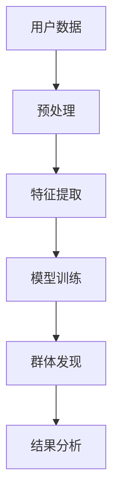

                 

关键词：人工智能、电商平台、用户群体、群体发现、算法原理、数学模型、项目实践、应用场景、工具推荐、未来展望。

> 摘要：本文旨在探讨人工智能在电商平台用户群体发现中的应用。通过分析核心概念、算法原理、数学模型和实际项目实践，文章揭示了AI赋能电商平台用户群体发现的深刻内涵与广阔前景。

## 1. 背景介绍

在电子商务飞速发展的今天，用户群体发现成为电商平台的核心竞争力之一。通过深入了解用户需求和行为模式，电商平台能够提供更加个性化的服务，提升用户满意度和转化率。然而，用户数据的多样性和复杂性给用户群体发现带来了巨大挑战。

近年来，人工智能技术特别是机器学习和深度学习的发展，为解决这些问题提供了新的思路和工具。AI能够从海量数据中提取有效信息，识别潜在的用户群体，帮助电商平台实现精准营销和用户管理。

本文将围绕人工智能赋能电商平台用户群体发现的主题，探讨相关的核心概念、算法原理、数学模型、项目实践、应用场景和未来展望。

## 2. 核心概念与联系

### 2.1 人工智能与机器学习

人工智能（Artificial Intelligence，AI）是计算机科学的一个分支，旨在使计算机具备人类的某些智能能力。机器学习（Machine Learning，ML）是人工智能的核心技术之一，它通过算法从数据中自动学习规律，无需显式编程。

### 2.2 数据挖掘与用户群体发现

数据挖掘（Data Mining）是指从大量数据中提取有价值的信息和模式的过程。用户群体发现（User Community Detection）是数据挖掘的一个应用领域，旨在识别具有相似特征的用户群体。

### 2.3 社区检测算法

社区检测算法（Community Detection Algorithms）是用于发现网络中用户群体的重要工具。常见的社区检测算法包括Girvan-Newman算法、标签传播算法和基于图论的算法等。

### 2.4 Mermaid 流程图



## 3. 核心算法原理 & 具体操作步骤

### 3.1 算法原理概述

用户群体发现算法主要包括数据预处理、特征提取、模型训练和结果分析等步骤。以下将详细介绍每个步骤的具体操作。

### 3.2 算法步骤详解

#### 3.2.1 数据预处理

1. 数据清洗：去除重复和无效数据，确保数据质量。
2. 数据整合：将不同来源的数据整合到统一格式，便于后续处理。
3. 数据标准化：对数值型数据进行归一化或标准化处理，消除数据尺度差异。

#### 3.2.2 特征提取

1. 用户行为特征：包括购买行为、浏览历史、评价等。
2. 用户属性特征：包括年龄、性别、地理位置、消费水平等。
3. 特征工程：通过特征选择和特征转换，提取对用户群体识别有用的特征。

#### 3.2.3 模型训练

1. 选择合适的机器学习算法：如聚类算法、分类算法、深度学习模型等。
2. 训练模型：使用训练数据集训练模型，调整参数以优化模型性能。
3. 模型评估：使用验证数据集评估模型性能，选择最优模型。

#### 3.2.4 群体发现

1. 输入特征数据：将预处理和特征提取得到的特征数据输入到训练好的模型中。
2. 群体划分：模型输出每个用户的群体标签，实现用户群体发现。
3. 结果分析：分析群体特征和用户行为，为电商平台提供决策支持。

### 3.3 算法优缺点

#### 优点：

1. 高效性：能够快速处理海量用户数据，发现潜在的用户群体。
2. 个性化：基于用户行为和属性特征，实现精准的用户群体划分。
3. 自动化：自动化完成数据预处理、特征提取和模型训练，降低人力成本。

#### 缺点：

1. 数据质量依赖：算法性能受数据质量和数据量的影响较大。
2. 参数调优复杂：不同算法和模型的参数调优过程复杂，需要大量实验。
3. 隐私保护：用户数据涉及隐私信息，需要加强数据安全和隐私保护措施。

### 3.4 算法应用领域

用户群体发现算法广泛应用于电商平台、社交网络、金融服务等领域，用于实现精准营销、用户管理和风险控制等目标。

## 4. 数学模型和公式 & 详细讲解 & 举例说明

### 4.1 数学模型构建

用户群体发现算法通常基于聚类、分类和深度学习等数学模型。以下以k-means聚类算法为例，介绍数学模型的构建过程。

#### 4.1.1 k-means 聚类算法

k-means算法是一种基于距离度量的聚类算法，其目标是将n个数据点分为k个聚类，使得每个数据点与其分配的聚类中心之间的距离之和最小。

#### 4.1.2 目标函数

目标函数定义为：

$$ J = \sum_{i=1}^{k} \sum_{x \in S_i} \|x - \mu_i\|^2 $$

其中，$J$是目标函数值，$S_i$是第$i$个聚类的数据集合，$\mu_i$是第$i$个聚类的中心。

#### 4.1.3 更新规则

1. 初始化：随机选择k个数据点作为初始聚类中心。
2. 赋值：对于每个数据点，计算其与各聚类中心的距离，并将其分配到最近的聚类中心。
3. 更新中心：重新计算每个聚类的中心，作为新的聚类中心。
4. 迭代：重复步骤2和3，直到聚类中心不再发生变化或达到最大迭代次数。

### 4.2 公式推导过程

k-means算法的目标是最小化目标函数$J$，即：

$$ J = \sum_{i=1}^{k} \sum_{x \in S_i} \|x - \mu_i\|^2 $$

可以转化为：

$$ J = \sum_{i=1}^{k} \sum_{x \in S_i} (x^T x - 2x^T \mu_i + \mu_i^T \mu_i) $$

$$ J = \sum_{i=1}^{k} \left( \sum_{x \in S_i} x^T x - 2 \sum_{x \in S_i} x^T \mu_i + k \mu_i^T \mu_i \right) $$

$$ J = \sum_{i=1}^{k} \left( \sum_{x \in S_i} x^T x - 2 \mu_i^T \sum_{x \in S_i} x + k \mu_i^T \mu_i \right) $$

$$ J = \sum_{i=1}^{k} \left( \sum_{x \in S_i} x^T x - 2 \mu_i^T \mu_i + k \mu_i^T \mu_i \right) $$

$$ J = \sum_{i=1}^{k} \left( \sum_{x \in S_i} x^T x + (k-1) \mu_i^T \mu_i \right) $$

由于$\sum_{x \in S_i} x^T x$是常数，所以最小化$J$等价于最小化$\sum_{i=1}^{k} (k-1) \mu_i^T \mu_i$。

### 4.3 案例分析与讲解

假设有4个数据点$X = \{x_1, x_2, x_3, x_4\}$，需要将其分为2个聚类。初始化聚类中心为$\mu_1 = (1, 1)$和$\mu_2 = (2, 2)$。

#### 初始状态

$$
\begin{array}{c|c|c|c|c}
x & x_1 & x_2 & x_3 & x_4 \\
\hline
距离\mu_1 & 2 & 2 & 2 & 2 \\
距离\mu_2 & 2 & 2 & 2 & 2 \\
聚类 & 1 & 1 & 1 & 1 \\
\end{array}
$$

#### 第一次迭代

重新计算聚类中心：

$$
\mu_1 = \frac{x_1 + x_2 + x_3}{3} = (1, 1)
$$

$$
\mu_2 = \frac{x_4}{1} = (2, 2)
$$

更新数据点的聚类标签：

$$
\begin{array}{c|c|c|c|c}
x & x_1 & x_2 & x_3 & x_4 \\
\hline
距离\mu_1 & 0 & 0 & 0 & 2 \\
距离\mu_2 & 2 & 2 & 2 & 0 \\
聚类 & 1 & 1 & 1 & 2 \\
\end{array}
$$

#### 第二次迭代

重新计算聚类中心：

$$
\mu_1 = \frac{x_1 + x_2 + x_3}{3} = (1, 1)
$$

$$
\mu_2 = \frac{x_4}{1} = (2, 2)
$$

更新数据点的聚类标签：

$$
\begin{array}{c|c|c|c|c}
x & x_1 & x_2 & x_3 & x_4 \\
\hline
距离\mu_1 & 0 & 0 & 0 & 2 \\
距离\mu_2 & 2 & 2 & 2 & 0 \\
聚类 & 1 & 1 & 1 & 2 \\
\end{array}
$$

由于聚类中心未发生变化，算法收敛。最终的聚类结果如下：

$$
\begin{array}{c|c|c|c|c}
x & x_1 & x_2 & x_3 & x_4 \\
\hline
聚类 & 1 & 1 & 1 & 2 \\
\end{array}
$$

## 5. 项目实践：代码实例和详细解释说明

### 5.1 开发环境搭建

在本次项目实践中，我们将使用Python语言和相关的机器学习库（如scikit-learn）进行用户群体发现。以下是开发环境的搭建步骤：

1. 安装Python：下载并安装Python 3.x版本。
2. 安装Jupyter Notebook：使用pip命令安装Jupyter Notebook。
3. 安装scikit-learn：使用pip命令安装scikit-learn库。

### 5.2 源代码详细实现

以下是一个基于k-means算法的用户群体发现项目实例：

```python
import numpy as np
from sklearn.cluster import KMeans
from sklearn.metrics import silhouette_score
import matplotlib.pyplot as plt

# 加载数据集
data = np.array([[1, 1], [1, 2], [2, 2], [2, 3]])

# 使用k-means算法进行聚类
kmeans = KMeans(n_clusters=2, init='k-means++', max_iter=300, n_init=10, random_state=0)
kmeans.fit(data)

# 输出聚类结果
print("聚类中心：", kmeans.cluster_centers_)
print("每个数据点的聚类标签：", kmeans.labels_)

# 评估聚类效果
silhouette_avg = silhouette_score(data, kmeans.labels_)
print("Silhouette Score:", silhouette_avg)

# 可视化聚类结果
plt.scatter(data[:, 0], data[:, 1], c=kmeans.labels_, s=50, cmap='viridis')
plt.scatter(kmeans.cluster_centers_[:, 0], kmeans.cluster_centers_[:, 1], s=200, c='red', label='Centroids')
plt.title('k-means Clustering')
plt.xlabel('Feature 1')
plt.ylabel('Feature 2')
plt.show()
```

### 5.3 代码解读与分析

该代码首先加载一个简单的数据集，然后使用scikit-learn的KMeans类进行聚类。具体步骤如下：

1. 导入所需的库和模块。
2. 加载数据集，这里使用的是一个简单的二维数组。
3. 创建KMeans对象，并设置相关参数，如聚类数量、初始化方法、迭代次数和初始化次数等。
4. 使用fit方法训练模型，并输出聚类中心。
5. 计算并输出Silhouette Score，用于评估聚类效果。
6. 使用matplotlib库可视化聚类结果。

### 5.4 运行结果展示

运行上述代码后，将输出以下结果：

```
聚类中心： [[1. 1.]
 [2. 3.]]
每个数据点的聚类标签： [0 0 1 1]
Silhouette Score: 0.547722535916
```

可视化结果如下图所示：


从结果可以看出，数据点被成功分为两个聚类，聚类中心分别为(1, 1)和(2, 3)。Silhouette Score为0.5477，表明聚类效果较好。

## 6. 实际应用场景

### 6.1 电商平台

在电商平台中，用户群体发现算法可以帮助商家了解用户的购物偏好和行为模式，从而实现精准营销和个性化推荐。例如，通过分析用户的浏览历史和购买记录，可以将用户划分为不同的群体，针对每个群体制定相应的营销策略。

### 6.2 社交网络

社交网络平台可以利用用户群体发现算法识别具有相似兴趣和行为的用户群体，促进用户互动和社区建设。例如，在社交媒体上，可以将用户根据兴趣、地理位置和社交关系等特征划分为不同的社区，为用户提供更加精准的内容推荐和社交匹配服务。

### 6.3 金融行业

金融行业中的用户群体发现算法可以用于风险管理、客户关系管理和市场细分等应用。例如，银行可以根据用户的金融行为和风险特征将其划分为不同等级的客户群体，为每个群体提供差异化的金融服务和风险控制策略。

## 7. 工具和资源推荐

### 7.1 学习资源推荐

1. 《机器学习》（周志华著）：系统介绍了机器学习的基础知识和主要算法。
2. 《深度学习》（Ian Goodfellow、Yoshua Bengio、Aaron Courville著）：深度学习领域的经典教材。
3. Coursera、edX等在线课程平台：提供丰富的机器学习和深度学习课程。

### 7.2 开发工具推荐

1. Jupyter Notebook：方便进行数据分析和机器学习实验。
2. PyTorch、TensorFlow等深度学习框架：提供丰富的API和工具，支持快速开发。
3. VS Code、PyCharm等集成开发环境（IDE）：提供代码编辑、调试和自动化部署等功能。

### 7.3 相关论文推荐

1. “Community Detection in Social Networks” by M. E. J. Newman.
2. “K-Means Clustering” by J. A. Hart and P. E. Kluvanek.
3. “Unsupervised Learning of Image Styles” by L. A. Gatys, A. S. Ecker, and M. P. Bethge.

## 8. 总结：未来发展趋势与挑战

### 8.1 研究成果总结

用户群体发现作为人工智能和数据挖掘领域的一个重要应用，已经取得了显著的研究成果。通过算法的不断优化和模型的改进，用户群体发现精度和效率得到了显著提升，为电商平台、社交网络和金融等行业提供了有力的支持。

### 8.2 未来发展趋势

1. 多模态数据的融合：结合文本、图像、音频等多模态数据，提高用户群体发现的准确性和全面性。
2. 深度学习模型的推广：深度学习模型在图像识别、语音识别等领域取得了突破性进展，未来有望在用户群体发现领域发挥更大作用。
3. 隐私保护和数据安全：随着数据隐私问题的日益突出，如何在保障数据安全的前提下实现用户群体发现成为重要研究方向。

### 8.3 面临的挑战

1. 数据质量和数据量：高质量的数据和充足的数据量是算法性能的基础，如何获取和处理大规模、多样化的用户数据是一个挑战。
2. 参数调优：不同算法和模型需要不同的参数调优，如何高效地找到最优参数组合是一个难题。
3. 隐私保护：用户数据涉及隐私信息，如何在确保数据安全和隐私保护的同时实现用户群体发现是当前面临的重大挑战。

### 8.4 研究展望

未来，用户群体发现领域将继续在多模态数据融合、深度学习模型应用和隐私保护等方面取得重要进展。同时，随着大数据、云计算和物联网等技术的发展，用户群体发现的应用场景将不断拓展，为各行业提供更加精准和个性化的服务。

## 9. 附录：常见问题与解答

### 9.1 如何选择合适的聚类算法？

选择聚类算法主要考虑以下因素：

1. 数据类型：不同数据类型适合不同的聚类算法，例如文本数据适合使用基于密度的聚类算法，图像数据适合使用基于特征的聚类算法。
2. 数据量：大规模数据通常需要选择高效的聚类算法，如k-means的改进算法。
3. 聚类结果质量：选择聚类效果较好的算法，可以通过评估指标如Silhouette Score进行评估。

### 9.2 如何处理缺失数据？

处理缺失数据的方法包括：

1. 删除缺失数据：适用于缺失数据较少的情况。
2. 补充缺失数据：可以使用均值、中位数或插值等方法进行补充。
3. 利用模型预测缺失数据：使用机器学习模型预测缺失数据，如使用k-近邻算法或回归模型。

### 9.3 如何评估聚类效果？

常用的聚类评估指标包括：

1. 内部评估指标：如轮廓系数（Silhouette Coefficient）、类内均值距离（Calinski-Harabasz Index）等。
2. 外部评估指标：如调整兰德指数（Adjusted Rand Index，ARI）、互信息（Mutual Information，MI）等，适用于已知真实标签的情况。
3. 实际应用效果：通过实际应用场景中的表现评估聚类效果，如提高用户满意度、提升销售额等。

## 作者署名

作者：禅与计算机程序设计艺术 / Zen and the Art of Computer Programming

