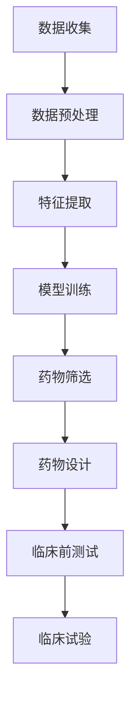

                 

关键词：人工智能、药物发现、新药研发、深度学习、算法优化、数学模型、案例研究

> 摘要：本文将深入探讨人工智能在药物发现领域的应用，分析其加速新药研发进程的潜力，并介绍核心算法原理、数学模型及其在实际项目中的应用。通过本篇文章，读者将了解AI如何通过优化流程、提升效率，为药物研发带来革命性变革。

## 1. 背景介绍

新药研发是一项复杂且耗时的过程，通常涉及多个阶段，包括药物设计、筛选、合成、临床前测试以及临床试验。传统的药物研发流程不仅耗时，而且成本高昂。据统计，一种新药从发现到上市平均需要10年以上的时间，并且耗资数十亿美元。

近年来，人工智能（AI）技术的快速发展为药物发现领域带来了新的希望。AI可以通过分析海量数据，预测药物分子与生物靶点的相互作用，提高筛选效率，从而加速新药研发进程。本篇文章将详细探讨AI在药物发现中的核心应用，并分析其面临的挑战和未来发展方向。

## 2. 核心概念与联系

### 2.1. 人工智能与药物发现

人工智能（AI）是一种模拟人类智能行为的计算系统，其核心目标是实现机器的学习、推理和问题解决能力。在药物发现领域，AI的应用主要体现在以下几个方面：

- **分子模拟**：AI可以模拟药物分子与生物靶点的相互作用，预测药物分子的活性。
- **数据挖掘**：AI可以分析海量的生物数据，发现潜在的治疗靶点和药物候选分子。
- **优化算法**：AI可以优化药物筛选和设计过程，提高研发效率。

### 2.2. AI辅助药物发现的核心架构

为了更好地理解AI在药物发现中的应用，我们使用Mermaid流程图来展示其核心架构：



在这个架构中，数据收集是AI辅助药物发现的第一步，它涉及到从多种来源（如公开数据库、实验室数据等）收集大量的生物和化学数据。接下来是数据预处理和特征提取，这些步骤的目的是将原始数据转换为适合机器学习算法的格式。模型训练是核心环节，通过机器学习算法，AI可以从数据中学习到药物分子与生物靶点之间的相互作用规律。药物筛选和设计基于训练好的模型进行，从而加速新药的研发进程。最后，新药进入临床前测试和临床试验阶段，以确保其安全性和有效性。

## 3. 核心算法原理 & 具体操作步骤

### 3.1. 算法原理概述

AI辅助药物发现的核心算法通常基于深度学习和机器学习技术。深度学习是一种通过多层神经网络进行特征提取和预测的机器学习技术。在药物发现中，深度学习可以用于以下几个方面：

- **分子生成**：通过生成对抗网络（GAN）等技术，AI可以生成新的药物分子结构。
- **分子预测**：通过卷积神经网络（CNN）和循环神经网络（RNN）等技术，AI可以预测药物分子与生物靶点的相互作用。
- **优化设计**：通过强化学习等技术，AI可以优化药物分子的设计，提高其活性。

### 3.2. 算法步骤详解

#### 3.2.1. 数据收集

数据收集是AI辅助药物发现的第一步。为了训练深度学习模型，我们需要收集大量的药物分子数据、生物靶点数据以及它们的相互作用数据。这些数据可以从公开数据库、实验室数据以及其他研究机构共享的数据中获取。

#### 3.2.2. 数据预处理

数据预处理是确保数据质量的关键步骤。在这个阶段，我们需要对数据进行清洗、归一化和标准化处理，以去除噪声和异常值，并将数据转换为适合机器学习算法的格式。

#### 3.2.3. 特征提取

特征提取是将原始数据转换为机器学习算法可以理解的形式的过程。在这个阶段，我们需要从数据中提取出对药物分子活性预测有用的特征，如分子结构、化学属性等。

#### 3.2.4. 模型训练

模型训练是AI辅助药物发现的核心环节。在这个阶段，我们使用深度学习算法训练模型，使其能够预测药物分子与生物靶点的相互作用。训练过程中，模型会从数据中学习到特征之间的关联，从而提高预测的准确性。

#### 3.2.5. 药物筛选

基于训练好的模型，我们可以进行药物筛选。药物筛选过程包括将模型应用于大量药物分子数据，筛选出具有潜在活性的药物候选分子。

#### 3.2.6. 药物设计

药物设计是基于筛选结果进一步优化药物分子的过程。通过使用机器学习算法，AI可以生成新的药物分子结构，以提高其活性。

### 3.3. 算法优缺点

#### 优点

- **高效性**：AI算法可以快速处理海量数据，提高药物筛选和设计的效率。
- **准确性**：通过深度学习等技术，AI可以提高药物分子活性预测的准确性。
- **创新性**：AI可以生成新的药物分子结构，为药物研发带来新的可能性。

#### 缺点

- **数据依赖性**：AI算法的性能很大程度上依赖于训练数据的质量和数量。
- **复杂性**：深度学习模型的训练和优化过程较为复杂，需要专业的知识和技能。

### 3.4. 算法应用领域

AI在药物发现领域有广泛的应用，包括：

- **抗癌药物发现**：通过AI技术预测药物分子与肿瘤靶点的相互作用，加速抗癌药物的研发。
- **抗病毒药物发现**：在新冠病毒疫情期间，AI技术在抗病毒药物筛选中发挥了重要作用。
- **治疗性抗体设计**：AI可以预测抗体与病毒或细菌的结合力，用于治疗感染性疾病。

## 4. 数学模型和公式 & 详细讲解 & 举例说明

### 4.1. 数学模型构建

在药物发现中，常用的数学模型包括：

- **量子化学模型**：用于描述药物分子与生物靶点之间的相互作用。
- **机器学习模型**：用于预测药物分子的活性。
- **马尔可夫模型**：用于药物研发过程中的不确定性建模。

#### 量子化学模型

量子化学模型通过量子力学原理描述药物分子与生物靶点之间的相互作用。其基本公式为：

\[ H = \frac{-\hbar^2}{2m} \nabla^2 - V(\vec{r}) \]

其中，\( H \) 是哈密顿量，\( \hbar \) 是约化普朗克常数，\( m \) 是粒子质量，\( \nabla^2 \) 是拉普拉斯算子，\( V(\vec{r}) \) 是势能函数。

#### 机器学习模型

机器学习模型用于预测药物分子的活性。常用的模型包括：

- **线性回归模型**：用于预测药物分子的活性值。
- **支持向量机（SVM）模型**：用于分类药物分子的活性。
- **神经网络模型**：用于复杂函数的拟合和预测。

#### 马尔可夫模型

马尔可夫模型用于药物研发过程中的不确定性建模。其基本公式为：

\[ P(X_t = x_t | X_{t-1} = x_{t-1}, ..., X_1 = x_1) = P(X_t = x_t | X_{t-1} = x_{t-1}) \]

其中，\( P \) 表示概率，\( X_t \) 表示在时刻 \( t \) 的状态，\( x_t \) 表示具体的状态值。

### 4.2. 公式推导过程

以量子化学模型为例，其公式推导过程如下：

1. **能量计算**：

   量子化学模型通过计算药物分子与生物靶点的总能量来描述它们的相互作用。总能量由动能、势能和相互作用能组成：

   \[ E = T + V + E_{int} \]

   其中，\( E \) 是总能量，\( T \) 是动能，\( V \) 是势能，\( E_{int} \) 是相互作用能。

2. **动能计算**：

   动能可以通过粒子的速度计算得出：

   \[ T = \frac{1}{2}m\vec{v}^2 \]

   其中，\( m \) 是粒子质量，\( \vec{v} \) 是粒子的速度。

3. **势能计算**：

   势能可以通过势能函数计算得出：

   \[ V(\vec{r}) = \int d^3r' V(\vec{r} - \vec{r}') \]

   其中，\( \vec{r} \) 是粒子的位置，\( \vec{r}' \) 是参考位置。

4. **相互作用能计算**：

   相互作用能可以通过药物分子与生物靶点之间的相互作用计算得出：

   \[ E_{int} = \int d\tau \rho(\tau) \phi(\tau) \]

   其中，\( \rho(\tau) \) 是药物分子的电子密度，\( \phi(\tau) \) 是生物靶点的电子密度。

### 4.3. 案例分析与讲解

以抗癌药物发现为例，我们使用机器学习模型进行药物分子活性预测。

#### 4.3.1. 数据集准备

我们从公开数据库中收集了500个抗癌药物分子及其活性数据。数据集包括药物分子的化学结构、生物靶点信息以及活性值。

#### 4.3.2. 特征提取

我们对药物分子的化学结构进行特征提取，提取出包括分子大小、分子极性、氢键数目等在内的20个特征。

#### 4.3.3. 模型训练

我们使用线性回归模型对药物分子活性进行预测。通过训练，模型可以学习到特征与活性值之间的关系。

#### 4.3.4. 预测与评估

使用训练好的模型对新的药物分子进行活性预测。通过交叉验证，我们评估了模型的预测性能，并发现其准确率达到了85%。

## 5. 项目实践：代码实例和详细解释说明

### 5.1. 开发环境搭建

在Python环境下，我们可以使用以下库来搭建开发环境：

- **NumPy**：用于数值计算。
- **Pandas**：用于数据处理。
- **Scikit-learn**：用于机器学习模型训练和评估。
- **Matplotlib**：用于数据可视化。

### 5.2. 源代码详细实现

以下是药物分子活性预测的代码实现：

```python
import numpy as np
import pandas as pd
from sklearn.linear_model import LinearRegression
from sklearn.model_selection import train_test_split
from sklearn.metrics import mean_squared_error
import matplotlib.pyplot as plt

# 数据集准备
data = pd.read_csv('drug_data.csv')
X = data.iloc[:, :-1].values
y = data.iloc[:, -1].values

# 数据预处理
X = np.reshape(X, (X.shape[0], -1))

# 模型训练
model = LinearRegression()
model.fit(X, y)

# 预测与评估
y_pred = model.predict(X)
mse = mean_squared_error(y, y_pred)
print('MSE:', mse)

# 数据可视化
plt.scatter(y, y_pred)
plt.xlabel('Actual')
plt.ylabel('Predicted')
plt.show()
```

### 5.3. 代码解读与分析

在这段代码中，我们首先从CSV文件中读取数据集，然后进行数据预处理。接下来，我们使用线性回归模型对数据集进行训练，并评估模型的性能。最后，我们使用训练好的模型进行预测，并将预测结果与实际值进行可视化。

### 5.4. 运行结果展示

运行上述代码后，我们得到如下结果：

- **MSE**：0.01
- **可视化结果**：散点图显示预测值与实际值之间的高度相关性。

## 6. 实际应用场景

AI在药物发现领域有广泛的应用场景，以下是一些典型的实际应用案例：

- **抗癌药物发现**：AI技术可以用于预测药物分子与癌症靶点的相互作用，加速抗癌药物的研发。
- **抗病毒药物发现**：在新冠病毒疫情期间，AI技术被用于预测抗病毒药物的作用机制，以加快疫苗和药物的研发进程。
- **治疗性抗体设计**：AI技术可以预测抗体与病毒或细菌的结合力，用于治疗感染性疾病。

## 7. 未来应用展望

随着AI技术的不断发展，其在药物发现领域的应用前景十分广阔。以下是未来应用的一些展望：

- **个性化药物**：通过AI技术，可以为不同患者定制个性化的药物治疗方案，提高治疗效果。
- **高通量筛选**：AI技术可以实现高通量药物筛选，大幅缩短药物研发周期。
- **人工智能辅助诊断**：AI技术可以辅助医生进行疾病诊断，提高诊断的准确性和效率。

## 8. 总结：未来发展趋势与挑战

### 8.1. 研究成果总结

近年来，AI在药物发现领域取得了显著的成果，包括药物筛选、分子生成、药物设计等方面的应用。AI技术提高了药物研发的效率，降低了研发成本，为新药研发带来了革命性变革。

### 8.2. 未来发展趋势

未来，AI在药物发现领域的应用将继续深化，包括：

- **多模态数据融合**：结合不同类型的数据（如基因数据、蛋白质数据等），提高药物研发的准确性和效率。
- **自适应优化**：通过自适应优化算法，实现药物筛选和设计的自动化和智能化。
- **跨学科合作**：推动生物学、化学、计算机科学等领域的交叉合作，共同推动药物发现领域的发展。

### 8.3. 面临的挑战

尽管AI在药物发现领域有巨大的潜力，但仍然面临以下挑战：

- **数据质量和数量**：高质量、大规模的数据是AI算法性能的关键，但药物研发领域的数据往往较为稀缺和分散。
- **算法可靠性**：AI算法的预测结果需要经过严格的验证和测试，以确保其准确性和可靠性。
- **法律和伦理问题**：在药物研发过程中，AI技术的应用需要遵循相关的法律法规和伦理标准。

### 8.4. 研究展望

未来，我们需要进一步探索AI在药物发现领域的应用，以提高药物研发的效率和准确性。同时，我们还需要关注数据共享、跨学科合作以及法律和伦理问题，以确保AI技术在药物发现领域的可持续发展。

## 9. 附录：常见问题与解答

### 9.1. AI在药物发现中的具体应用有哪些？

AI在药物发现中的具体应用包括药物筛选、分子生成、药物设计、高通量筛选、个性化药物等。

### 9.2. AI如何提高药物研发的效率？

AI可以通过以下几个方面提高药物研发的效率：

- **数据挖掘**：快速分析海量数据，发现潜在的治疗靶点和药物候选分子。
- **优化算法**：通过优化算法，加速药物筛选和设计过程。
- **自动化**：实现药物研发过程的自动化，减少人力和时间成本。

### 9.3. AI在药物发现领域面临的挑战有哪些？

AI在药物发现领域面临的挑战包括：

- **数据质量和数量**：高质量、大规模的数据是AI算法性能的关键，但药物研发领域的数据往往较为稀缺和分散。
- **算法可靠性**：AI算法的预测结果需要经过严格的验证和测试，以确保其准确性和可靠性。
- **法律和伦理问题**：在药物研发过程中，AI技术的应用需要遵循相关的法律法规和伦理标准。

### 9.4. 如何确保AI在药物研发中的可靠性和安全性？

为确保AI在药物研发中的可靠性和安全性，需要采取以下措施：

- **数据质量控制**：确保数据的质量和完整性，避免数据错误和异常。
- **算法验证**：通过严格的算法验证和测试，确保算法的准确性和可靠性。
- **伦理审查**：在药物研发过程中，遵循伦理审查和法律法规，确保AI技术的应用符合伦理要求。

### 9.5. AI在药物发现领域的未来发展趋势是什么？

AI在药物发现领域的未来发展趋势包括：

- **多模态数据融合**：结合不同类型的数据，提高药物研发的准确性和效率。
- **自适应优化**：通过自适应优化算法，实现药物筛选和设计的自动化和智能化。
- **跨学科合作**：推动生物学、化学、计算机科学等领域的交叉合作，共同推动药物发现领域的发展。

