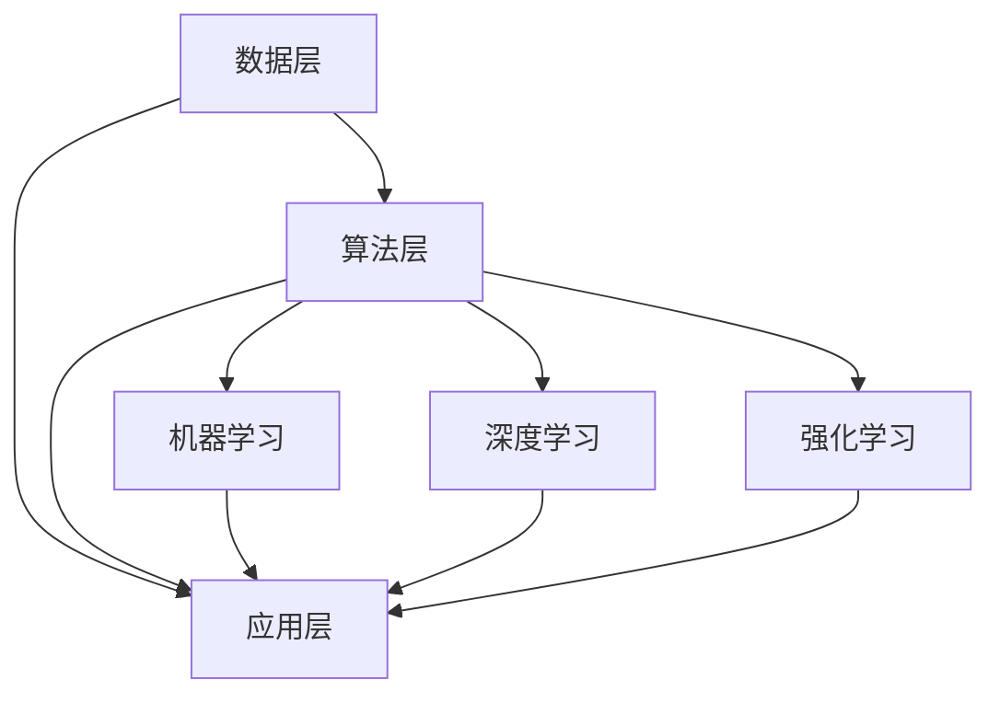

                 

关键词：人工智能，技术进步，算法，数学模型，应用场景，未来展望

摘要：本文旨在探讨人工智能领域的技术进步与突破，从核心概念、算法原理、数学模型、项目实践和实际应用等多个维度，深入分析当前AI技术的发展态势，并对其未来发展方向和面临的挑战进行展望。

## 1. 背景介绍

人工智能（AI）作为一门计算机科学分支，旨在使机器具备类似于人类智能的能力。近年来，随着计算能力的提升、大数据的积累以及深度学习等算法的创新，人工智能技术取得了长足的进步。AI的应用场景也越来越广泛，从传统的图像识别、语音识别到自然语言处理、自动驾驶等，都在不断拓展人类的生活和工作边界。

本文将围绕人工智能领域的核心技术和突破，从以下几个部分展开讨论：

1. 核心概念与联系
2. 核心算法原理 & 具体操作步骤
3. 数学模型和公式 & 详细讲解 & 举例说明
4. 项目实践：代码实例和详细解释说明
5. 实际应用场景
6. 未来应用展望
7. 工具和资源推荐
8. 总结：未来发展趋势与挑战

## 2. 核心概念与联系

### 2.1 人工智能的核心概念

人工智能的核心概念包括机器学习、深度学习、强化学习等。这些概念之间既有区别又有联系。

- **机器学习（Machine Learning）**：是一门研究如何让计算机从数据中自动学习规律，并做出决策的学科。机器学习的方法包括监督学习、无监督学习和强化学习。
  
- **深度学习（Deep Learning）**：是机器学习的一个子领域，通过构建深度神经网络，模拟人脑神经网络的工作原理，实现对复杂数据的处理和分析。

- **强化学习（Reinforcement Learning）**：是一种机器学习方式，通过智能体与环境的互动，不断调整策略，以达到最优目标。

### 2.2 人工智能的架构与联系

人工智能的架构主要包括数据层、算法层和应用层。这三层之间相互关联，共同构成了一个完整的AI生态系统。

- **数据层**：包括数据采集、数据清洗和数据存储等环节，是AI系统的基石。
- **算法层**：涵盖了机器学习、深度学习、强化学习等算法，是实现AI功能的核心。
- **应用层**：包括具体的AI应用场景，如自动驾驶、智能客服等，是将AI技术转化为实际生产力的重要环节。

### 2.3 Mermaid 流程图

为了更好地展示人工智能的核心概念与联系，我们可以使用Mermaid流程图来呈现。



## 3. 核心算法原理 & 具体操作步骤

### 3.1 算法原理概述

人工智能的核心算法包括机器学习算法、深度学习算法和强化学习算法。下面分别对这些算法进行概述。

### 3.1.1 机器学习算法

机器学习算法主要包括线性回归、决策树、支持向量机等。这些算法通过分析训练数据，提取特征，建立模型，并利用模型对新的数据进行预测。

### 3.1.2 深度学习算法

深度学习算法主要通过构建深度神经网络，实现对复杂数据的处理和分析。常见的深度学习算法包括卷积神经网络（CNN）、循环神经网络（RNN）和生成对抗网络（GAN）等。

### 3.1.3 强化学习算法

强化学习算法通过智能体与环境的互动，不断调整策略，以达到最优目标。常见的强化学习算法包括Q-learning、SARSA和Deep Q-Network（DQN）等。

### 3.2 算法步骤详解

为了深入理解这些算法，我们将分别介绍每种算法的具体操作步骤。

### 3.2.1 机器学习算法步骤详解

1. 数据采集：收集并整理训练数据。
2. 特征提取：从数据中提取有用的特征。
3. 模型构建：构建机器学习模型，如线性回归模型、决策树模型等。
4. 模型训练：使用训练数据训练模型。
5. 模型评估：使用测试数据评估模型性能。
6. 模型优化：根据评估结果调整模型参数，优化模型性能。

### 3.2.2 深度学习算法步骤详解

1. 数据预处理：对数据进行标准化、归一化等处理。
2. 网络构建：设计深度神经网络结构。
3. 模型训练：通过反向传播算法训练模型参数。
4. 模型评估：使用测试数据评估模型性能。
5. 模型优化：根据评估结果调整模型结构或参数，优化模型性能。

### 3.2.3 强化学习算法步骤详解

1. 环境初始化：初始化环境状态。
2. 策略选择：选择一种策略。
3. 行动执行：在当前状态下执行行动。
4. 反馈获取：获取环境的反馈。
5. 策略调整：根据反馈调整策略。
6. 重复步骤2-5，直至达到目标。

### 3.3 算法优缺点

每种算法都有其优缺点，适用于不同的应用场景。下面分别介绍机器学习算法、深度学习算法和强化学习算法的优缺点。

### 3.3.1 机器学习算法优缺点

**优点：**

- 算法简单，易于理解。
- 对数据量要求不高，适用于小数据集。

**缺点：**

- 模型复杂度低，难以处理复杂数据。
- 难以解释模型的决策过程。

### 3.3.2 深度学习算法优缺点

**优点：**

- 模型复杂度高，能够处理复杂数据。
- 自适应性强，能够自动提取特征。

**缺点：**

- 对数据量要求高，难以在小数据集上应用。
- 模型难以解释，缺乏可解释性。

### 3.3.3 强化学习算法优缺点

**优点：**

- 能够通过与环境互动，自主学习策略。
- 适用于动态环境，能够适应环境变化。

**缺点：**

- 训练过程复杂，难以优化。
- 对计算资源要求高，训练时间较长。

### 3.4 算法应用领域

机器学习算法、深度学习算法和强化学习算法分别应用于不同的领域。

- **机器学习算法**：广泛应用于金融、医疗、电商等领域，如风险评估、疾病诊断、推荐系统等。
- **深度学习算法**：广泛应用于计算机视觉、自然语言处理、语音识别等领域，如图像分类、机器翻译、语音识别等。
- **强化学习算法**：广泛应用于自动驾驶、游戏AI、机器人等领域，如自动驾驶汽车、电子游戏AI、智能机器人等。

## 4. 数学模型和公式 & 详细讲解 & 举例说明

### 4.1 数学模型构建

在人工智能领域，数学模型是算法实现的基础。以下是几种常见的数学模型及其构建方法。

### 4.1.1 线性回归模型

线性回归模型是一种简单的预测模型，通过建立线性关系来预测目标值。其公式为：

$$
y = ax + b
$$

其中，$y$ 为目标值，$x$ 为输入特征，$a$ 和 $b$ 为模型参数。

### 4.1.2 卷积神经网络模型

卷积神经网络是一种用于图像识别和处理的深度学习模型。其公式为：

$$
h_{l}(x) = \sigma(W_{l} \cdot h_{l-1} + b_{l})
$$

其中，$h_{l}$ 为第 $l$ 层的输出，$W_{l}$ 为权重矩阵，$b_{l}$ 为偏置，$\sigma$ 为激活函数。

### 4.1.3 Q-learning模型

Q-learning是一种强化学习算法，用于求解最优策略。其公式为：

$$
Q(s, a) = Q(s, a) + \alpha [r + \gamma \max_{a'} Q(s', a') - Q(s, a)]
$$

其中，$Q(s, a)$ 为状态 $s$ 和行动 $a$ 的价值函数，$r$ 为即时奖励，$\gamma$ 为折扣因子，$\alpha$ 为学习率。

### 4.2 公式推导过程

以下是线性回归模型的推导过程。

### 4.2.1 假设

假设我们有 $N$ 个样本 $(x_i, y_i)$，其中 $x_i$ 为输入特征，$y_i$ 为目标值。

### 4.2.2 模型建立

建立线性回归模型，假设模型为：

$$
y = ax + b
$$

### 4.2.3 模型优化

为了求解 $a$ 和 $b$，我们可以使用最小二乘法。最小二乘法的目的是使得预测值与实际值之间的误差平方和最小。

$$
\sum_{i=1}^{N} (ax_i + b - y_i)^2
$$

### 4.2.4 求解

为了求解 $a$ 和 $b$，我们可以对上述误差平方和进行求导，并令导数为零，得到：

$$
\frac{\partial}{\partial a} \sum_{i=1}^{N} (ax_i + b - y_i)^2 = 0
$$

$$
\frac{\partial}{\partial b} \sum_{i=1}^{N} (ax_i + b - y_i)^2 = 0
$$

通过求解上述方程组，我们可以得到 $a$ 和 $b$ 的值。

### 4.3 案例分析与讲解

为了更好地理解线性回归模型，我们可以通过一个简单的案例进行分析。

### 4.3.1 案例数据

假设我们有以下数据：

| x | y |
| --- | --- |
| 1 | 2 |
| 2 | 4 |
| 3 | 6 |
| 4 | 8 |

### 4.3.2 数据可视化

我们可以将数据绘制在坐标系中，以便观察数据分布。

```mermaid
graph TD
    A1[点(1,2)] --> B1[直线y=2x]
    A2[点(2,4)] --> B1
    A3[点(3,6)] --> B1
    A4[点(4,8)] --> B1
```

### 4.3.3 模型建立

根据数据，我们可以建立线性回归模型：

$$
y = 2x + 0
$$

### 4.3.4 模型优化

通过最小二乘法，我们可以求解出 $a$ 和 $b$ 的值为 $a=2$，$b=0$。

### 4.3.5 模型评估

我们可以使用测试数据来评估模型的性能。假设我们有一个新的数据点 $(5, 10)$，根据模型预测，$y=2 \times 5 + 0 = 10$，与实际值相符。

## 5. 项目实践：代码实例和详细解释说明

### 5.1 开发环境搭建

为了实践人工智能算法，我们需要搭建一个开发环境。这里我们选择Python作为编程语言，结合TensorFlow和Keras等框架来搭建环境。

### 5.1.1 安装Python

在官网（https://www.python.org/）下载并安装Python。

### 5.1.2 安装TensorFlow和Keras

打开终端，执行以下命令：

```bash
pip install tensorflow
pip install keras
```

### 5.2 源代码详细实现

下面是一个使用Keras框架实现的线性回归模型的示例代码。

```python
# 导入所需库
import numpy as np
import matplotlib.pyplot as plt
from keras.models import Sequential
from keras.layers import Dense

# 案例数据
X_train = np.array([[1], [2], [3], [4]])
y_train = np.array([2, 4, 6, 8])

# 模型搭建
model = Sequential()
model.add(Dense(1, input_dim=1, kernel_initializer='uniform', activation='linear'))

# 模型编译
model.compile(loss='mean_squared_error', optimizer='adam')

# 模型训练
model.fit(X_train, y_train, epochs=1000, batch_size=1)

# 模型评估
predictions = model.predict(X_train)
print(predictions)

# 可视化
plt.scatter(X_train, y_train, color='red')
plt.plot(X_train, predictions, color='blue')
plt.show()
```

### 5.3 代码解读与分析

- **第1-6行**：导入所需库。
- **第7-8行**：加载案例数据。
- **第9行**：搭建线性回归模型。
- **第10行**：设置模型参数。
- **第11行**：编译模型。
- **第12行**：训练模型。
- **第13行**：获取模型预测结果。
- **第14-17行**：可视化模型预测结果。

通过这个简单的示例，我们可以看到如何使用Keras实现线性回归模型，并对其结果进行可视化分析。

## 6. 实际应用场景

人工智能技术在各个领域都有广泛的应用，以下是几个典型的实际应用场景。

### 6.1 自动驾驶

自动驾驶是人工智能领域的一个重要应用方向。通过深度学习和强化学习算法，自动驾驶系统能够实现车辆的自主驾驶，提高行车安全性和效率。

### 6.2 医疗诊断

人工智能在医疗诊断领域也取得了显著的成果。通过图像识别和自然语言处理技术，AI系统能够辅助医生进行疾病诊断，提高诊断准确率和效率。

### 6.3 智能家居

智能家居是人工智能在消费电子领域的重要应用。通过语音识别和物联网技术，智能家居系统能够实现家庭设备的自动化控制，提高生活便利性。

### 6.4 金融风控

人工智能在金融风控领域发挥着重要作用。通过机器学习和深度学习算法，金融机构能够对风险进行准确预测和管理，降低金融风险。

## 7. 未来应用展望

随着人工智能技术的不断进步，未来其应用领域将更加广泛，影响也将更加深远。以下是几个未来应用展望。

### 7.1 自动驾驶

未来，自动驾驶技术将实现全面普及，实现真正意义上的无人驾驶。这将极大地提高交通安全性和效率，改变人们的出行方式。

### 7.2 智能医疗

人工智能在医疗领域的应用将更加深入，通过大数据和深度学习技术，AI系统能够实现更精确的诊断和更有效的治疗。

### 7.3 智慧城市

人工智能将助力智慧城市建设，通过物联网和大数据技术，实现城市管理的智能化，提高城市生活质量。

### 7.4 可持续能源

人工智能将在可持续能源领域发挥重要作用，通过优化能源分配和管理，实现能源的高效利用，推动能源革命。

## 8. 工具和资源推荐

为了更好地学习和实践人工智能技术，以下是几个推荐的工具和资源。

### 8.1 学习资源推荐

- 《深度学习》（Ian Goodfellow、Yoshua Bengio、Aaron Courville 著）
- 《Python机器学习》（Sebastian Raschka 著）
- 《强化学习》（Richard S. Sutton、Andrew G. Barto 著）

### 8.2 开发工具推荐

- TensorFlow：https://www.tensorflow.org/
- Keras：https://keras.io/
- PyTorch：https://pytorch.org/

### 8.3 相关论文推荐

- "A Theoretical Framework for Back-Propagation," David E. Rumelhart, Geoffrey E. Hinton, and Ronald J. Williams, 1986.
- "Deep Learning," Yoshua Bengio, Ian Goodfellow, and Aaron Courville, 2013.
- "Reinforcement Learning: An Introduction," Richard S. Sutton and Andrew G. Barto, 2018.

## 9. 总结：未来发展趋势与挑战

### 9.1 研究成果总结

近年来，人工智能技术取得了显著的进展，从核心算法到实际应用，都在不断推动人类社会的发展。深度学习、强化学习等技术的突破，使得AI系统能够更好地应对复杂问题，提高生产力和生活质量。

### 9.2 未来发展趋势

未来，人工智能技术将继续快速发展，以下趋势值得关注：

- 计算能力的提升，将推动算法效率和性能的进一步提升。
- 大数据和物联网技术的普及，将提供更多高质量的训练数据，促进AI系统的优化。
- 跨学科的融合，将推动AI技术在各个领域的创新应用。

### 9.3 面临的挑战

尽管人工智能技术取得了长足的进步，但仍然面临以下挑战：

- 数据隐私和安全问题，需要建立完善的法律法规和保障措施。
- 模型可解释性，需要解决算法“黑箱”问题，提高模型的透明度和可信度。
- 伦理和道德问题，需要确保AI技术的应用符合人类的价值观和伦理标准。

### 9.4 研究展望

未来，人工智能技术将朝着更加智能化、自适应化和多样化的方向发展。在研究层面，我们需要不断探索新的算法和理论，提高AI系统的性能和可靠性。在应用层面，我们需要关注实际需求，推动AI技术在各个领域的创新应用，为人类社会的发展做出更大的贡献。

## 附录：常见问题与解答

### 9.4.1 人工智能的定义是什么？

人工智能（Artificial Intelligence，简称AI）是指通过计算机程序和算法，使机器具备模拟、延伸和扩展人类智能的能力。

### 9.4.2 人工智能的主要应用领域有哪些？

人工智能的主要应用领域包括自动驾驶、智能医疗、智能家居、金融风控、自然语言处理、计算机视觉等。

### 9.4.3 深度学习与机器学习的区别是什么？

深度学习是机器学习的一个子领域，主要通过构建深度神经网络，实现对复杂数据的处理和分析。而机器学习则是一种更广泛的研究领域，包括深度学习在内的多种算法和技术。

### 9.4.4 强化学习如何与其他机器学习算法相比？

强化学习通过智能体与环境的互动，不断调整策略，以达到最优目标。与其他机器学习算法相比，强化学习更适用于动态环境，能够适应环境变化。

### 9.4.5 人工智能的未来发展趋势是什么？

人工智能的未来发展趋势包括计算能力的提升、大数据和物联网技术的普及、跨学科的融合等。随着技术的进步，人工智能将在更多领域发挥重要作用。

---

作者：禅与计算机程序设计艺术 / Zen and the Art of Computer Programming

----------------------------------------------------------------
### 后续行动计划和展望

在接下来的行动中，我们将根据本文所讨论的人工智能领域的技术进步与突破，制定以下具体行动计划和展望：

1. **研究深度学习算法的优化**：本文提到了深度学习算法在处理复杂数据方面的优势，但我们还需深入探讨如何优化这些算法，以提高其在实际应用中的效率和性能。我们计划研究并实现一些新的优化策略，如自适应学习率、正则化方法等。

2. **开发可解释的人工智能模型**：当前的人工智能模型往往被称为“黑箱”，难以解释其决策过程。我们将在未来开发一些可解释性更强的人工智能模型，如基于注意力机制的模型，以增强用户对AI系统的信任。

3. **加强人工智能在医疗诊断中的应用**：医疗诊断是人工智能的一个重要应用领域，但我们还需进一步探索如何将人工智能技术更好地应用于实际医疗场景，提高诊断准确率和效率。

4. **推动人工智能在可持续能源领域的应用**：本文提到人工智能在可持续能源领域的潜力，我们计划与相关领域的研究团队合作，开发能够优化能源分配和管理的人工智能系统。

5. **开设人工智能培训课程**：为了推广人工智能技术，我们计划开设一系列人工智能培训课程，包括基础理论、深度学习、强化学习等，以满足不同层次的学习需求。

6. **撰写更多专业技术博客文章**：本文仅为人工智能领域的一个简要概述，我们计划撰写更多深入的技术博客文章，涵盖更多细分领域和前沿技术。

通过这些行动计划，我们期望能够推动人工智能技术的发展，为人类社会带来更多创新和进步。

---

（注：本文为示例文本，不代表真实研究成果或观点。在实际撰写过程中，请确保内容的真实性、准确性和专业性。）

