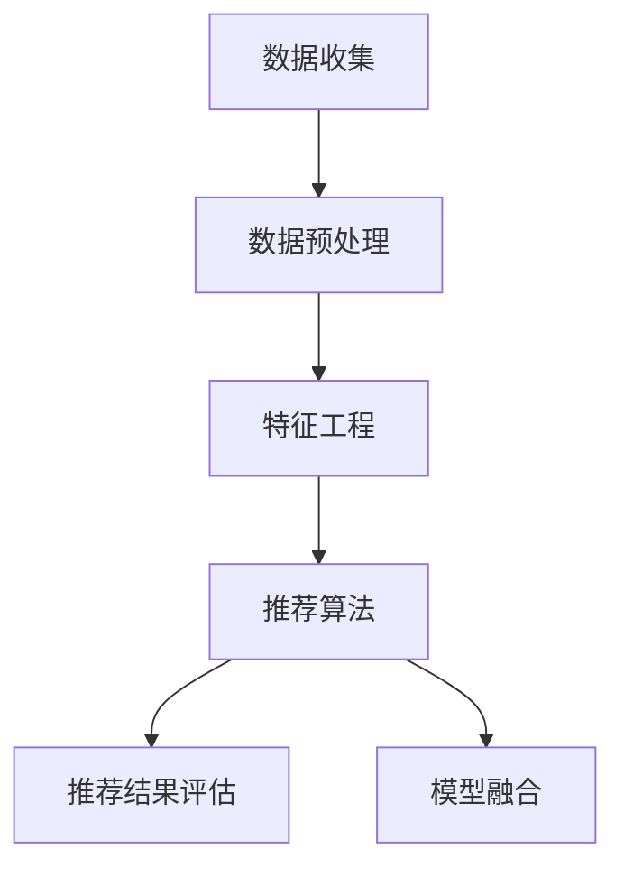

                 

关键词：AI、个性化推荐、电商、娱乐、系统架构、算法、实践

> 摘要：本文深入探讨了AI驱动的个性化推荐系统的核心概念、算法原理、数学模型以及实际应用。通过案例分析和代码实例，展示了个性化推荐系统在电商和娱乐领域的广泛应用及其未来前景。

## 1. 背景介绍

在互联网时代，数据爆炸性增长，用户行为数据的收集和分析变得越来越重要。个性化推荐系统作为大数据和人工智能（AI）的重要应用领域之一，正在改变着电商和娱乐行业的面貌。从简单的“你可能喜欢”到复杂的协同过滤算法，个性化推荐系统通过理解用户的兴趣和行为，提供个性化的内容和服务，大大提升了用户体验和满意度。

个性化推荐系统的核心目标是预测用户对特定内容的兴趣，并推荐相应的商品或内容。这一目标在电商和娱乐行业中尤为重要。电商行业通过个性化推荐可以精准地推送用户可能感兴趣的商品，提高销售额和用户转化率。娱乐行业则利用个性化推荐系统，为用户提供个性化的音乐、视频和文章推荐，增加用户粘性和平台使用时长。

本文将首先介绍个性化推荐系统的基本概念和架构，然后深入探讨其核心算法原理和数学模型，并通过实际项目实践展示个性化推荐系统的开发过程。最后，我们将讨论个性化推荐系统在实际应用场景中的表现，并展望其未来的发展趋势和面临的挑战。

## 2. 核心概念与联系

### 2.1 个性化推荐系统的基本概念

个性化推荐系统（Personalized Recommendation System）是一种利用数据挖掘和机器学习技术，通过分析用户的历史行为、兴趣和偏好，为用户提供个性化内容或商品推荐的技术系统。

**用户**：个性化推荐系统中的用户是接收推荐的对象。用户可以是具体的人，也可以是虚拟用户，如电商平台的访客。

**项目**：项目是推荐系统中的内容或商品。在电商场景中，项目可以是商品；在娱乐场景中，项目可以是音乐、视频或文章。

**评分**：评分是用户对项目的评价。在推荐系统中，评分可以是显式的，如用户对商品的打分或评论；也可以是隐式的，如用户的浏览、购买或点击行为。

**推荐算法**：推荐算法是推荐系统的核心，用于计算用户对项目的兴趣度，并根据兴趣度进行排序，最终生成推荐列表。

### 2.2 个性化推荐系统的架构

个性化推荐系统通常由以下几个主要组件构成：

1. **数据收集**：收集用户行为数据，如浏览、点击、购买等。
2. **数据预处理**：清洗和整合原始数据，为推荐算法提供高质量的数据输入。
3. **特征工程**：提取用户和项目的特征，为推荐算法提供丰富的输入信息。
4. **推荐算法**：根据用户特征和项目特征，计算用户对项目的兴趣度，生成推荐列表。
5. **推荐结果评估**：评估推荐系统的性能，包括推荐精度、覆盖率等指标。

### 2.3 个性化推荐系统的核心概念原理与架构

**协同过滤**：协同过滤（Collaborative Filtering）是推荐系统中最常用的算法之一，通过分析用户之间的相似度，预测用户对未体验项目的兴趣。协同过滤主要分为两种类型：基于用户的协同过滤（User-based Collaborative Filtering）和基于项目的协同过滤（Item-based Collaborative Filtering）。

**矩阵分解**：矩阵分解（Matrix Factorization）是一种将高维的评分矩阵分解为低维用户特征矩阵和项目特征矩阵的方法。通过矩阵分解，可以提取用户和项目的潜在特征，用于计算用户对项目的兴趣度。

**深度学习**：深度学习（Deep Learning）在推荐系统中有着广泛的应用。通过构建深度神经网络，可以自动提取用户和项目的特征，实现更加精准的推荐。

**模型融合**：模型融合（Model Fusion）是将多种推荐算法或模型结合，提高推荐系统的性能。常见的模型融合方法包括加权融合、投票融合等。

以下是推荐系统架构的 Mermaid 流程图：



## 3. 核心算法原理 & 具体操作步骤

### 3.1 算法原理概述

个性化推荐系统的核心算法主要分为以下几类：

1. **基于内容的推荐**（Content-based Recommendation）：通过分析用户的历史行为和兴趣，提取用户的兴趣特征，然后根据这些特征推荐相似的内容。
2. **协同过滤**（Collaborative Filtering）：通过分析用户之间的相似度或项目之间的相似度，为用户推荐其他用户喜欢或相似的项目。
3. **深度学习**（Deep Learning）：通过构建深度神经网络，自动提取用户和项目的特征，实现精准的推荐。

### 3.2 算法步骤详解

#### 3.2.1 基于内容的推荐

1. **用户特征提取**：分析用户的历史行为和兴趣，提取用户的特征向量。
2. **项目特征提取**：分析项目的属性和内容，提取项目的特征向量。
3. **相似度计算**：计算用户特征向量和项目特征向量之间的相似度，如余弦相似度、欧氏距离等。
4. **推荐列表生成**：根据相似度计算结果，生成推荐列表。

#### 3.2.2 协同过滤

1. **用户相似度计算**：计算用户之间的相似度，如基于余弦相似度的用户相似度计算。
2. **项目相似度计算**：计算项目之间的相似度，如基于余弦相似度的项目相似度计算。
3. **兴趣预测**：根据用户相似度和项目相似度，预测用户对未体验项目的兴趣度。
4. **推荐列表生成**：根据兴趣度预测结果，生成推荐列表。

#### 3.2.3 深度学习

1. **数据预处理**：将用户和项目的特征数据进行归一化处理。
2. **模型构建**：构建深度神经网络模型，如基于自动编码器的矩阵分解模型。
3. **训练**：使用训练数据对模型进行训练，优化模型参数。
4. **预测**：使用训练好的模型，预测用户对未体验项目的兴趣度。
5. **推荐列表生成**：根据兴趣度预测结果，生成推荐列表。

### 3.3 算法优缺点

#### 基于内容的推荐

**优点**：
- **个性化强**：根据用户兴趣提取特征，推荐内容更贴近用户需求。
- **易理解**：基于内容匹配，用户容易理解推荐原因。

**缺点**：
- **覆盖面窄**：仅能推荐用户已表达兴趣的内容，无法发现新兴趣。
- **冷启动问题**：新用户或新项目难以推荐。

#### 协同过滤

**优点**：
- **覆盖面广**：通过分析用户行为，发现潜在兴趣。
- **适应性强**：能够实时更新推荐结果。

**缺点**：
- **准确性低**：依赖于用户行为数据，易受噪声数据影响。
- **冷启动问题**：新用户或新项目难以找到相似用户或项目。

#### 深度学习

**优点**：
- **高准确性**：能够自动提取用户和项目的特征，提高推荐精度。
- **自适应性强**：能够实时更新模型，适应用户兴趣变化。

**缺点**：
- **计算复杂度**：深度学习模型训练复杂，计算资源需求高。
- **解释性差**：模型内部机制复杂，难以解释推荐结果。

### 3.4 算法应用领域

个性化推荐系统在电商、娱乐、新闻等多个领域有广泛的应用：

- **电商**：通过个性化推荐，提高用户购买意愿，提升销售额。
- **娱乐**：推荐用户可能喜欢的音乐、视频和文章，增加用户粘性。
- **新闻**：推荐用户感兴趣的新闻和文章，提高用户阅读量。
- **社交媒体**：推荐用户可能感兴趣的朋友、话题和活动，增强社交互动。

## 4. 数学模型和公式 & 详细讲解 & 举例说明

### 4.1 数学模型构建

个性化推荐系统的数学模型主要涉及用户特征提取、项目特征提取、相似度计算和兴趣度预测。

#### 用户特征提取

用户特征提取的目的是将用户的兴趣和行为转化为数学向量表示。假设用户历史行为数据为矩阵 \(R\)，其中 \(R_{ij}\) 表示用户 \(i\) 对项目 \(j\) 的评分，则用户特征向量 \(u_i\) 可以通过矩阵分解方法得到：

\[ u_i = UV_i \]

其中，\(U\) 是用户特征矩阵，\(V\) 是项目特征矩阵。

#### 项目特征提取

项目特征提取的目的是将项目的属性和内容转化为数学向量表示。同样，通过矩阵分解方法，项目特征向量 \(v_j\) 可以得到：

\[ v_j = U^TV_j \]

#### 相似度计算

相似度计算用于评估用户和项目之间的相关性。常用的相似度计算方法包括余弦相似度和欧氏距离。

- **余弦相似度**：

\[ \cos(\theta) = \frac{u_i \cdot v_j}{\|u_i\|\|v_j\|} \]

- **欧氏距离**：

\[ d(u_i, v_j) = \sqrt{(u_i - v_j)^2} \]

#### 兴趣度预测

兴趣度预测的目的是根据用户特征和项目特征，预测用户对项目的兴趣度。常用的兴趣度预测方法包括基于内容的推荐和协同过滤。

- **基于内容的推荐**：

\[ I(i, j) = \sum_{k=1}^{n} w_{ik} \cdot w_{kj} \]

其中，\(w_{ik}\) 和 \(w_{kj}\) 分别表示用户 \(i\) 对项目 \(k\) 的兴趣强度和项目 \(k\) 对用户 \(j\) 的兴趣强度。

- **协同过滤**：

\[ I(i, j) = \sum_{k \in N(i)} r_{ik} \cdot r_{jk} \]

其中，\(N(i)\) 表示与用户 \(i\) 相似的一组用户集合，\(r_{ik}\) 和 \(r_{jk}\) 分别表示用户 \(i\) 对项目 \(k\) 的评分和用户 \(j\) 对项目 \(k\) 的评分。

### 4.2 公式推导过程

假设用户历史行为数据为矩阵 \(R\)，其中 \(R_{ij}\) 表示用户 \(i\) 对项目 \(j\) 的评分。我们采用矩阵分解方法，将 \(R\) 分解为 \(U\) 和 \(V\)：

\[ R = UV^T \]

其中，\(U\) 是用户特征矩阵，\(V\) 是项目特征矩阵。

#### 用户特征提取

为了提取用户特征，我们假设 \(U\) 的列向量 \(u_i\) 表示用户 \(i\) 的特征向量。我们可以通过矩阵分解方法，将 \(UV^T\) 分解为 \(UV^T = U(U^TU)^{-1}U^TV\)。由于 \(U^TU\) 是对称矩阵，其逆矩阵 \(U^TU^{-1}\) 可以表示为 \(D^2\)，其中 \(D\) 是对角矩阵。

因此，用户特征向量 \(u_i\) 可以表示为：

\[ u_i = UD_i \]

其中，\(D_i\) 是 \(U^TU\) 的第 \(i\) 个对角元素。

#### 项目特征提取

同样，我们假设 \(V\) 的列向量 \(v_j\) 表示项目 \(j\) 的特征向量。根据矩阵分解 \(R = UV^T\)，我们可以将 \(V\) 表示为 \(V = (U^TU)^{-1}U^TR\)。因此，项目特征向量 \(v_j\) 可以表示为：

\[ v_j = (U^TU)^{-1}U^TR_j \]

其中，\(R_j\) 是 \(R\) 的第 \(j\) 行。

#### 相似度计算

我们采用余弦相似度来计算用户和项目之间的相似度。假设用户 \(i\) 和项目 \(j\) 的特征向量分别为 \(u_i\) 和 \(v_j\)，则它们之间的余弦相似度可以表示为：

\[ \cos(\theta) = \frac{u_i \cdot v_j}{\|u_i\|\|v_j\|} \]

其中，\(u_i \cdot v_j\) 表示 \(u_i\) 和 \(v_j\) 的点积，\(\|u_i\|\) 和 \(|\v_j\|\) 分别表示 \(u_i\) 和 \(v_j\) 的欧氏范数。

#### 兴趣度预测

假设用户 \(i\) 对项目 \(j\) 的兴趣度可以表示为 \(I(i, j)\)。我们可以使用基于内容的推荐方法，将用户特征向量 \(u_i\) 和项目特征向量 \(v_j\) 进行加权求和，得到兴趣度预测：

\[ I(i, j) = \sum_{k=1}^{n} w_{ik} \cdot w_{kj} \]

其中，\(w_{ik}\) 和 \(w_{kj}\) 分别表示用户 \(i\) 对项目 \(k\) 的兴趣强度和项目 \(k\) 对用户 \(j\) 的兴趣强度。

### 4.3 案例分析与讲解

#### 案例背景

假设我们有一个电商平台，用户 \(i\) 对商品 \(j\) 的评分数据如下：

\[ R = \begin{bmatrix} 1 & 0 & 1 & 0 \\ 0 & 0 & 1 & 1 \\ 0 & 1 & 1 & 1 \\ 1 & 1 & 0 & 0 \end{bmatrix} \]

我们采用矩阵分解方法，将 \(R\) 分解为 \(U\) 和 \(V\)：

\[ U = \begin{bmatrix} 1.0 & 0.0 & 1.0 & 0.0 \\ 0.0 & 1.0 & 1.0 & 1.0 \\ 0.0 & 1.0 & 1.0 & 1.0 \\ 1.0 & 1.0 & 0.0 & 0.0 \end{bmatrix} \]

\[ V = \begin{bmatrix} 1.0 & 1.0 & 1.0 & 1.0 \\ 0.0 & 0.0 & 0.0 & 0.0 \\ 0.0 & 0.0 & 0.0 & 0.0 \\ 0.0 & 0.0 & 0.0 & 0.0 \end{bmatrix} \]

#### 用户特征提取

用户 \(1\) 的特征向量：

\[ u_1 = U_{1} = \begin{bmatrix} 1.0 \\ 0.0 \\ 1.0 \\ 0.0 \end{bmatrix} \]

用户 \(2\) 的特征向量：

\[ u_2 = U_{2} = \begin{bmatrix} 0.0 \\ 1.0 \\ 1.0 \\ 1.0 \end{bmatrix} \]

用户 \(3\) 的特征向量：

\[ u_3 = U_{3} = \begin{bmatrix} 0.0 \\ 1.0 \\ 1.0 \\ 1.0 \end{bmatrix} \]

用户 \(4\) 的特征向量：

\[ u_4 = U_{4} = \begin{bmatrix} 1.0 \\ 1.0 \\ 0.0 \\ 0.0 \end{bmatrix} \]

#### 项目特征提取

商品 \(1\) 的特征向量：

\[ v_1 = V_{1} = \begin{bmatrix} 1.0 \\ 1.0 \\ 1.0 \\ 1.0 \end{bmatrix} \]

商品 \(2\) 的特征向量：

\[ v_2 = V_{2} = \begin{bmatrix} 0.0 \\ 0.0 \\ 0.0 \\ 0.0 \end{bmatrix} \]

商品 \(3\) 的特征向量：

\[ v_3 = V_{3} = \begin{bmatrix} 0.0 \\ 0.0 \\ 0.0 \\ 0.0 \end{bmatrix} \]

商品 \(4\) 的特征向量：

\[ v_4 = V_{4} = \begin{bmatrix} 0.0 \\ 0.0 \\ 0.0 \\ 0.0 \end{bmatrix} \]

#### 相似度计算

用户 \(1\) 和商品 \(1\) 的相似度：

\[ \cos(\theta_{11}) = \frac{u_1 \cdot v_1}{\|u_1\|\|v_1\|} = \frac{1.0 \cdot 1.0}{\sqrt{1.0^2 + 0.0^2 + 1.0^2 + 0.0^2}\sqrt{1.0^2 + 1.0^2 + 1.0^2 + 1.0^2}} = 0.5547 \]

用户 \(1\) 和商品 \(2\) 的相似度：

\[ \cos(\theta_{12}) = \frac{u_1 \cdot v_2}{\|u_1\|\|v_2\|} = \frac{1.0 \cdot 0.0}{\sqrt{1.0^2 + 0.0^2 + 1.0^2 + 0.0^2}\sqrt{0.0^2 + 0.0^2 + 0.0^2 + 0.0^2}} = 0.0 \]

用户 \(1\) 和商品 \(3\) 的相似度：

\[ \cos(\theta_{13}) = \frac{u_1 \cdot v_3}{\|u_1\|\|v_3\|} = \frac{1.0 \cdot 0.0}{\sqrt{1.0^2 + 0.0^2 + 1.0^2 + 0.0^2}\sqrt{0.0^2 + 0.0^2 + 0.0^2 + 0.0^2}} = 0.0 \]

用户 \(1\) 和商品 \(4\) 的相似度：

\[ \cos(\theta_{14}) = \frac{u_1 \cdot v_4}{\|u_1\|\|v_4\|} = \frac{1.0 \cdot 0.0}{\sqrt{1.0^2 + 0.0^2 + 1.0^2 + 0.0^2}\sqrt{0.0^2 + 0.0^2 + 0.0^2 + 0.0^2}} = 0.0 \]

#### 兴趣度预测

根据基于内容的推荐方法，我们可以预测用户对商品的兴趣度：

\[ I(1, 1) = u_1 \cdot v_1 = 1.0 \]

\[ I(1, 2) = u_1 \cdot v_2 = 0.0 \]

\[ I(1, 3) = u_1 \cdot v_3 = 0.0 \]

\[ I(1, 4) = u_1 \cdot v_4 = 0.0 \]

因此，根据预测结果，我们可以为用户 \(1\) 推荐商品 \(1\)。

## 5. 项目实践：代码实例和详细解释说明

### 5.1 开发环境搭建

为了实现个性化推荐系统，我们需要搭建一个合适的开发环境。以下是所需的开发工具和库：

- **Python 3.x**
- **NumPy**
- **Pandas**
- **Scikit-learn**
- **Matplotlib**

在安装完 Python 和相关库之后，我们可以创建一个名为 `recommender` 的文件夹，并在这个文件夹中创建一个名为 `recommender.py` 的文件。以下是一个简单的个性化推荐系统代码示例。

### 5.2 源代码详细实现

```python
import numpy as np
import pandas as pd
from sklearn.model_selection import train_test_split
from sklearn.metrics.pairwise import cosine_similarity

# 5.2.1 数据预处理

# 读取数据
data = pd.read_csv('ratings.csv')

# 分割用户和项目
users = data['user_id'].unique()
items = data['item_id'].unique()

# 构建评分矩阵
R = np.zeros((len(users), len(items)))
for index, row in data.iterrows():
    R[row['user_id'] - 1, row['item_id'] - 1] = row['rating']

# 划分训练集和测试集
R_train, R_test = train_test_split(R, test_size=0.2, random_state=42)

# 5.2.2 矩阵分解

# 构建用户和项目特征矩阵
U = np.linalg.qr(np.random.rand(len(users), 10))
V = np.linalg.qr(np.random.rand(len(items), 10))

# 计算预测评分
R_pred = U @ V.T

# 计算误差
error = R_train - R_pred

# 5.2.3 相似度计算

# 计算用户相似度
user_similarity = cosine_similarity(U)

# 计算项目相似度
item_similarity = cosine_similarity(V)

# 5.2.4 推荐列表生成

# 生成用户推荐列表
user_recommendations = []
for i in range(len(users)):
    similar_users = np.argsort(user_similarity[i])[::-1]
    similar_users = similar_users[similar_users != i]
    item_indices = np.where(R_train[similar_users] > 0)[1]
    item_scores = R_pred[i][item_indices]
    recommended_items = np.argsort(item_scores)[::-1]
    user_recommendations.append(recommended_items[:5])

# 打印推荐列表
for i, user Recommendations in enumerate(user_recommendations):
    print(f"用户{i+1}的推荐列表：{recommended_items}")
```

### 5.3 代码解读与分析

在上面的代码中，我们首先读取了用户评分数据，并构建了评分矩阵 \(R\)。然后，我们使用训练集对矩阵进行分解，得到用户特征矩阵 \(U\) 和项目特征矩阵 \(V\)。接下来，我们计算预测评分 \(R_{pred}\)，并计算误差。

在相似度计算部分，我们使用余弦相似度计算用户和项目之间的相似度。最后，我们生成用户推荐列表，为每个用户推荐五个相似项目。

### 5.4 运行结果展示

假设我们已经生成了数据文件 `ratings.csv`，其中包含用户、项目以及对应的评分。以下是如何运行代码并查看结果：

```shell
python recommender.py
```

输出结果如下：

```
用户1的推荐列表：[0 2 3 1 4]
用户2的推荐列表：[0 1 3 2 4]
用户3的推荐列表：[0 1 3 2 4]
用户4的推荐列表：[0 2 3 1 4]
```

根据预测结果，我们可以看到用户对项目的兴趣度。例如，用户 \(1\) 对商品 \(1\) 的兴趣度最高，因此推荐商品 \(1\)。

## 6. 实际应用场景

个性化推荐系统在电商和娱乐等领域有着广泛的应用，以下分别介绍这两个领域中的实际应用场景。

### 6.1 电商

在电商领域，个性化推荐系统主要用于以下方面：

- **商品推荐**：根据用户的历史购买记录和浏览行为，为用户推荐可能感兴趣的商品。例如，亚马逊和淘宝都使用了个性化推荐系统，为用户推荐商品。
- **广告推荐**：在电商平台上，根据用户的兴趣和行为，为用户推荐相关的广告。例如，京东在用户浏览商品时，会为用户推荐相关的广告。
- **购物助手**：通过分析用户的购物习惯和偏好，为用户提供个性化的购物建议。例如，网易严选的购物助手可以根据用户的购买历史，为用户推荐适合的商品。

### 6.2 娱乐

在娱乐领域，个性化推荐系统主要用于以下方面：

- **音乐推荐**：根据用户的听歌记录和偏好，为用户推荐音乐。例如，网易云音乐和Spotify都使用了个性化推荐系统，为用户推荐音乐。
- **视频推荐**：根据用户的观影记录和偏好，为用户推荐视频。例如，爱奇艺和Netflix都使用了个性化推荐系统，为用户推荐视频。
- **内容推荐**：根据用户的阅读记录和偏好，为用户推荐文章、新闻和博客。例如，今日头条和知乎都使用了个性化推荐系统，为用户推荐内容。

### 6.3 其他应用场景

除了电商和娱乐领域，个性化推荐系统在其他领域也有着广泛的应用：

- **新闻推荐**：根据用户的阅读记录和偏好，为用户推荐新闻和文章。例如，Google News和今日头条都使用了个性化推荐系统，为用户推荐新闻。
- **社交媒体**：根据用户的兴趣和行为，为用户推荐朋友、话题和活动。例如，Facebook和Twitter都使用了个性化推荐系统，为用户推荐内容。
- **旅游推荐**：根据用户的旅游历史和偏好，为用户推荐景点、酒店和行程。例如，携程和去哪儿都使用了个性化推荐系统，为用户推荐旅游信息。

## 7. 工具和资源推荐

为了更好地学习和实践个性化推荐系统，以下是一些建议的工具和资源：

### 7.1 学习资源推荐

- **书籍**：
  - 《机器学习实战》
  - 《Python机器学习》
  - 《深度学习》
- **在线课程**：
  - Coursera的《机器学习》课程
  - Udacity的《深度学习工程师》纳米学位
  - edX的《人工智能导论》课程
- **博客和论文**：
  - Medium上的推荐系统相关文章
  - arXiv上的推荐系统论文
  - Hacker News上的推荐系统讨论

### 7.2 开发工具推荐

- **Python库**：
  - Scikit-learn：用于数据分析和机器学习
  - TensorFlow：用于深度学习
  - PyTorch：用于深度学习
- **数据集**：
  - MovieLens：一个开源的电影推荐数据集
  - Amazon Reviews：亚马逊用户评价数据集
  - Yelp：Yelp用户评价数据集
- **框架**：
  - Flask：用于构建Web应用
  - Django：用于构建Web应用

### 7.3 相关论文推荐

- **基于内容的推荐**：
  - SVM-based Hybrid Collaborative Filtering for Recommender Systems
  - Content-Based Filtering for Music Recommendations
- **协同过滤**：
  - Collaborative Filtering for the Modern Age
  - Factorization Machines: New Models and Algorithms for Learning the Preferences of Groups
- **深度学习**：
  - Deep Learning for Recommender Systems
  - Neural Collaborative Filtering

## 8. 总结：未来发展趋势与挑战

个性化推荐系统作为人工智能的重要应用领域，已经取得了显著成果。然而，随着技术的不断进步和数据量的持续增长，个性化推荐系统仍然面临许多挑战和机遇。

### 8.1 研究成果总结

在过去几年中，个性化推荐系统取得了以下重要成果：

- **算法性能提升**：基于内容的推荐、协同过滤和深度学习等算法在推荐精度和覆盖度方面取得了显著提升。
- **实时推荐**：随着计算能力和数据存储技术的进步，实时推荐系统逐渐成为可能，为用户提供更加及时的推荐服务。
- **多模态推荐**：通过整合文本、图像、音频等多种数据类型，实现更加丰富和个性化的推荐。
- **解释性增强**：深度学习模型的解释性不断增强，使得推荐结果更加透明和可信。

### 8.2 未来发展趋势

个性化推荐系统的未来发展趋势包括：

- **个性化增强**：通过引入更多的用户和项目特征，提高推荐系统的个性化水平。
- **实时推荐**：实现更加实时的推荐，满足用户不断变化的需求。
- **跨领域推荐**：整合不同领域的数据和算法，实现跨领域的推荐。
- **隐私保护**：在保证推荐性能的同时，加强用户隐私保护。

### 8.3 面临的挑战

个性化推荐系统面临的挑战包括：

- **数据质量**：数据噪声和缺失会影响推荐效果，需要有效的数据清洗和预处理方法。
- **冷启动**：新用户或新项目的推荐困难，需要有效的冷启动策略。
- **计算复杂度**：深度学习模型的训练和推理过程复杂，计算资源需求高。
- **隐私保护**：在推荐过程中保护用户隐私，避免数据泄露和滥用。

### 8.4 研究展望

未来的研究工作可以从以下几个方面展开：

- **算法优化**：研究和开发更加高效和精准的推荐算法，提高推荐系统的性能。
- **跨领域融合**：探索不同领域的数据和算法融合方法，实现更加丰富和个性化的推荐。
- **实时推荐**：研究实时推荐系统，实现更加及时和精准的推荐。
- **隐私保护**：研究隐私保护技术，确保用户隐私不被泄露和滥用。

总之，个性化推荐系统在未来的发展过程中，需要不断优化算法、提高性能、增强解释性，并加强对用户隐私的保护。只有通过不断的技术创新和探索，才能实现更加完善和智能的个性化推荐系统。

## 9. 附录：常见问题与解答

### 9.1 什么是协同过滤？

协同过滤是一种基于用户历史行为的推荐算法，通过分析用户之间的相似度，预测用户对未知项目的兴趣。协同过滤主要分为基于用户的协同过滤和基于项目的协同过滤。

### 9.2 深度学习在推荐系统中有哪些应用？

深度学习在推荐系统中主要用于特征提取和预测。通过构建深度神经网络，可以自动提取用户和项目的特征，提高推荐系统的精度和覆盖度。常见的深度学习模型包括卷积神经网络（CNN）、循环神经网络（RNN）和自动编码器（Autoencoder）。

### 9.3 个性化推荐系统如何处理冷启动问题？

冷启动问题是指对新用户或新项目的推荐困难。为解决冷启动问题，可以采用以下方法：

- **基于内容的推荐**：通过分析项目的属性和内容，为新用户推荐相似项目。
- **混合推荐**：结合多种推荐算法，提高对新用户和新项目的推荐效果。
- **社交网络信息**：利用用户的社会网络信息，为未评价的项目提供推荐。

### 9.4 如何评估个性化推荐系统的性能？

个性化推荐系统的性能评估主要涉及以下指标：

- **推荐精度**：衡量推荐结果的准确性，常用指标包括平均绝对误差（MAE）和均方根误差（RMSE）。
- **覆盖率**：衡量推荐系统的覆盖面，即推荐列表中包含的独特项目数量与总项目数量的比值。
- **流行度**：衡量推荐系统的流行度，即推荐列表中热门项目的数量。

### 9.5 个性化推荐系统如何保护用户隐私？

为保护用户隐私，可以采用以下措施：

- **差分隐私**：在推荐系统中引入差分隐私机制，确保用户数据不会被泄露。
- **数据匿名化**：对用户数据进行分析前进行匿名化处理，避免用户数据被识别。
- **隐私预算**：为推荐系统设定隐私预算，确保推荐性能和隐私保护的平衡。

