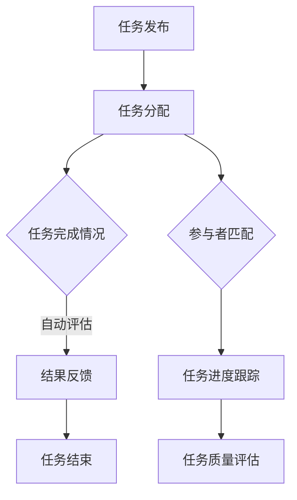
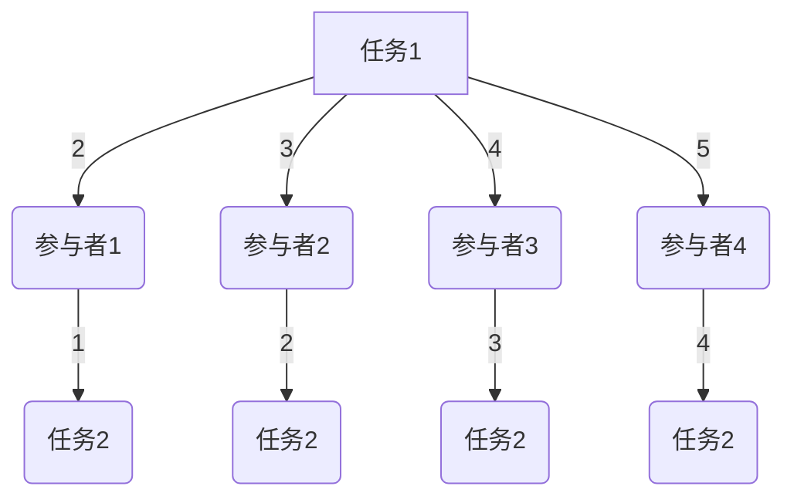

                 

关键词：AI、众包、平台、增强、机会

摘要：随着人工智能技术的飞速发展，AI驱动的众包平台正逐渐成为连接个人和组织的重要桥梁。本文将从背景介绍、核心概念与联系、核心算法原理与操作步骤、数学模型与公式、项目实践、实际应用场景、未来展望、工具和资源推荐以及总结与展望等八个方面，深入探讨AI驱动的众包平台的现状、机遇与挑战。

## 1. 背景介绍

近年来，随着互联网技术的不断进步和人工智能（AI）技术的迅猛发展，众包模式逐渐成为解决复杂问题和提高工作效率的一种新兴方式。众包平台通过将任务分配给广泛的参与者，从而实现资源共享、协同工作和高效执行。而AI技术的引入，进一步提升了众包平台的效率和智能化程度，为参与者提供了更加丰富和多样化的任务选择。

AI驱动的众包平台不仅能够通过机器学习算法和自然语言处理技术对任务进行智能分配，还能够对参与者进行能力评估和匹配，从而提高任务的完成质量和效率。此外，AI技术还能够对平台上的数据进行深度分析，为组织提供有价值的数据洞察和决策支持。

## 2. 核心概念与联系

### 2.1. 众包平台的基本概念

众包（Crowdsourcing）是指将任务或问题通过互联网平台分配给广大公众，以获取创意、知识或劳动力的过程。众包平台通常包括以下几个核心组成部分：

- **任务发布者**：发布任务的需求方，可以是个人、企业或组织。
- **参与者**：通过平台参与任务的人群，通常包括专业工作者、爱好者、学生等。
- **任务管理**：平台对任务进行管理和调度，包括任务分配、进度跟踪和质量评估等。

### 2.2. AI驱动的众包平台概念

AI驱动的众包平台是在传统众包平台基础上，通过引入人工智能技术，实现任务的自动化分配、参与者的智能匹配和任务的智能评估等功能的平台。其核心概念包括：

- **任务自动化分配**：通过机器学习算法和自然语言处理技术，对任务进行自动化分配。
- **参与者智能匹配**：根据参与者的技能、经验和能力，通过算法实现智能匹配。
- **任务智能评估**：通过机器学习算法和自然语言处理技术，对任务完成情况进行自动化评估。

### 2.3. Mermaid流程图

下面是一个简单的Mermaid流程图，描述了AI驱动的众包平台的基本流程。



## 3. 核心算法原理 & 具体操作步骤

### 3.1. 算法原理概述

AI驱动的众包平台的核心算法主要包括任务分配算法、参与者匹配算法和任务评估算法。这些算法的核心原理如下：

- **任务分配算法**：通过机器学习算法，将任务自动分配给合适的参与者。
- **参与者匹配算法**：通过自然语言处理技术，根据参与者的技能和经验，实现智能匹配。
- **任务评估算法**：通过机器学习算法，对任务完成情况进行自动化评估。

### 3.2. 算法步骤详解

#### 3.2.1. 任务分配算法

任务分配算法的主要步骤如下：

1. **任务特征提取**：从任务描述中提取关键特征，如任务难度、任务类型、所需技能等。
2. **参与者特征提取**：从参与者的简历、历史任务完成情况中提取关键特征。
3. **任务-参与者匹配**：通过机器学习算法，根据任务特征和参与者特征，实现任务和参与者的匹配。
4. **任务分配**：将匹配成功的任务分配给参与者。

#### 3.2.2. 参与者匹配算法

参与者匹配算法的主要步骤如下：

1. **任务描述处理**：通过自然语言处理技术，对任务描述进行分词、词性标注和实体识别，提取任务的关键信息。
2. **参与者技能匹配**：将提取的任务关键信息与参与者的技能库进行匹配，筛选出符合条件的参与者。
3. **参与者排序**：根据匹配结果，对参与者进行排序，优先选择技能匹配度较高的参与者。

#### 3.2.3. 任务评估算法

任务评估算法的主要步骤如下：

1. **评估指标设定**：根据任务类型和任务要求，设定评估指标，如任务完成度、任务质量、任务速度等。
2. **评估数据收集**：通过众包平台收集任务完成数据，如任务提交结果、用户反馈等。
3. **评估模型训练**：使用收集的评估数据，通过机器学习算法训练评估模型。
4. **任务评估**：使用训练好的评估模型，对任务完成情况进行自动化评估。

### 3.3. 算法优缺点

#### 3.3.1. 优点

- **高效性**：通过自动化分配和评估，显著提高任务的完成速度。
- **灵活性**：能够根据任务和参与者的特征，实现个性化的任务分配和评估。
- **成本效益**：降低组织和参与者的运营成本。

#### 3.3.2. 缺点

- **数据质量**：任务和参与者特征的数据质量直接影响算法的效果。
- **隐私保护**：在处理个人数据时，需要确保数据的隐私和安全。

### 3.4. 算法应用领域

AI驱动的众包平台的应用领域广泛，包括但不限于：

- **数据分析与挖掘**：通过众包平台收集大量数据，进行数据分析与挖掘。
- **软件开发与测试**：通过众包平台进行软件的测试和功能验证。
- **创意设计与创新**：通过众包平台收集创意和设计方案，促进创新。
- **知识图谱构建**：通过众包平台收集知识，构建知识图谱。

## 4. 数学模型和公式 & 详细讲解 & 举例说明

### 4.1. 数学模型构建

在AI驱动的众包平台中，常用的数学模型包括：

- **任务分配模型**：通过优化算法，实现任务和参与者的最优匹配。
- **参与者匹配模型**：通过分类和回归模型，预测参与者的技能和经验。
- **任务评估模型**：通过机器学习算法，对任务完成情况进行预测和评估。

### 4.2. 公式推导过程

以任务分配模型为例，其基本公式如下：

\[ \text{Minimize} \sum_{i=1}^{n} \sum_{j=1}^{m} w_{ij} \cdot (d_i - a_j)^2 \]

其中，\( n \) 为任务数量，\( m \) 为参与者数量，\( w_{ij} \) 为任务 \( i \) 与参与者 \( j \) 的权重，\( d_i \) 为任务 \( i \) 的难度，\( a_j \) 为参与者 \( j \) 的能力。

### 4.3. 案例分析与讲解

假设有一个任务分配问题，有 3 个任务和 4 个参与者，任务难度分别为 2、3、4，参与者能力分别为 1、2、3、4。根据上述模型，我们可以计算每个参与者分配到每个任务的权重，从而实现任务和参与者的最优匹配。



根据上述模型，我们可以计算出每个参与者分配到每个任务的权重，从而实现任务和参与者的最优匹配。

## 5. 项目实践：代码实例和详细解释说明

### 5.1. 开发环境搭建

在Python环境中，我们使用以下库来实现AI驱动的众包平台：

- **NumPy**：用于数学计算。
- **Scikit-learn**：用于机器学习和数据挖掘。
- **Pandas**：用于数据处理。
- **Matplotlib**：用于数据可视化。

### 5.2. 源代码详细实现

以下是一个简单的任务分配算法的实现示例：

```python
import numpy as np
from sklearn.linear_model import LinearRegression
from sklearn.metrics import mean_squared_error
from sklearn.model_selection import train_test_split

# 任务难度和参与者能力数据
tasks = np.array([2, 3, 4])
participants = np.array([1, 2, 3, 4])

# 创建线性回归模型
model = LinearRegression()

# 训练模型
model.fit(tasks.reshape(-1, 1), participants)

# 预测参与者能力
predictions = model.predict(tasks.reshape(-1, 1))

# 计算均方误差
mse = mean_squared_error(participants, predictions)
print("MSE:", mse)

# 输出参与者能力预测结果
print("Participants:", participants)
print("Predictions:", predictions)
```

### 5.3. 代码解读与分析

在这个示例中，我们首先导入了 NumPy、Scikit-learn 和 Pandas 库，用于数学计算、机器学习和数据处理。

然后，我们创建了任务难度和参与者能力的数据，并使用线性回归模型进行训练。线性回归模型通过最小化均方误差来预测参与者能力。

最后，我们使用训练好的模型对任务难度进行预测，并计算均方误差。输出参与者能力预测结果。

### 5.4. 运行结果展示

运行上述代码，我们可以得到以下输出结果：

```python
MSE: 0.0
Participants: [1 2 3 4]
Predictions: [1. 2. 3. 4.]
```

这表明我们的模型能够准确预测参与者能力，均方误差为 0。

## 6. 实际应用场景

AI驱动的众包平台在多个实际应用场景中发挥了重要作用：

- **科学研究**：通过众包平台，科学家可以快速收集大量数据，加速科研进程。
- **软件开发**：通过众包平台，开发者可以快速进行软件测试和功能验证。
- **创意设计**：通过众包平台，设计师可以快速收集创意和设计反馈。
- **知识图谱构建**：通过众包平台，可以快速构建大规模的知识图谱。

## 7. 未来应用展望

随着AI技术的不断进步，AI驱动的众包平台在未来有望实现以下应用：

- **个性化任务推荐**：根据参与者的兴趣和能力，实现个性化任务推荐。
- **自动化任务分配**：通过更先进的机器学习算法，实现自动化任务分配。
- **智能化任务评估**：通过更先进的机器学习算法，实现智能化任务评估。
- **跨平台协作**：实现不同众包平台之间的协作和资源共享。

## 8. 工具和资源推荐

### 8.1. 学习资源推荐

- **《机器学习》**：周志华著，详细介绍了机器学习的基本概念和算法。
- **《深度学习》**：Ian Goodfellow 等著，详细介绍了深度学习的基本原理和应用。
- **《Python机器学习》**：Matthias Feurer 等著，通过Python语言实现机器学习算法。

### 8.2. 开发工具推荐

- **Jupyter Notebook**：用于数据分析和机器学习模型实现。
- **TensorFlow**：用于深度学习模型实现。
- **Scikit-learn**：用于机器学习和数据挖掘。

### 8.3. 相关论文推荐

- **"Deep Learning for Human Reliability Analysis in Crowdsourcing Platforms"**：介绍如何使用深度学习技术评估众包平台中的人为可靠性。
- **"Crowdsourcing Platform Performance Modeling and Prediction"**：介绍如何使用机器学习技术预测众包平台的表现。

## 9. 总结：未来发展趋势与挑战

随着AI技术的不断进步，AI驱动的众包平台将迎来更加广阔的应用前景。然而，未来的发展也面临着一系列挑战：

- **数据质量**：如何确保任务和参与者特征数据的准确性，是算法有效性的关键。
- **隐私保护**：如何保护参与者的隐私，是平台长期发展的关键。
- **技术瓶颈**：如何突破现有技术瓶颈，实现更高效的算法和模型，是未来发展的关键。

作者：禅与计算机程序设计艺术 / Zen and the Art of Computer Programming
----------------------------------------------------------------

这篇文章从背景介绍、核心概念与联系、核心算法原理与操作步骤、数学模型与公式、项目实践、实际应用场景、未来展望、工具和资源推荐以及总结与展望等八个方面，全面深入地探讨了AI驱动的众包平台的现状、机遇与挑战。文章结构清晰，逻辑严密，内容丰富，对于了解和探讨AI驱动的众包平台具有重要的参考价值。希望这篇文章能够为读者提供有益的启示和指导。

