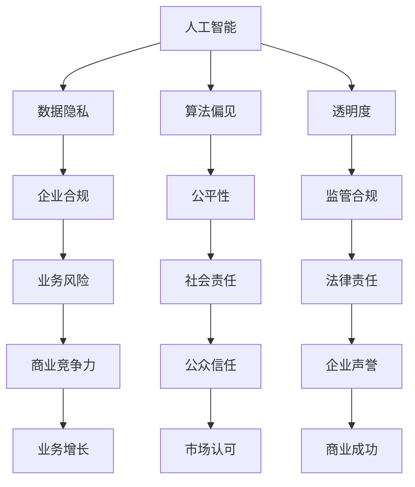

                 

关键词：人工智能、商业应用、道德考量、应用前景、趋势分析

> 摘要：本文探讨了人工智能在商业中的应用及其带来的道德考虑因素，分析了AI驱动的创新趋势，并展望了其未来应用前景。文章旨在为读者提供一个全面、系统的理解，帮助企业和个人更好地把握AI在商业中的发展方向。

## 1. 背景介绍

随着人工智能技术的快速发展，越来越多的商业领域开始利用AI技术进行创新和变革。AI驱动的创新已经成为推动商业发展的重要力量，它不仅提高了企业的运营效率，还为客户提供了更加个性化和智能化的服务。然而，随着AI在商业中的广泛应用，一系列道德考量问题也随之产生，如数据隐私、公平性、透明度等。

### 人工智能在商业中的应用

人工智能在商业中的应用涵盖了多个方面，包括数据分析、预测建模、自动化决策、个性化推荐等。以下是AI在商业中的一些典型应用案例：

- **数据分析**：通过大数据和机器学习技术，企业可以对海量数据进行挖掘和分析，从而发现业务模式和趋势，为企业决策提供支持。

- **预测建模**：利用历史数据，人工智能可以预测未来的市场变化，帮助企业在竞争中抢占先机。

- **自动化决策**：通过自然语言处理和计算机视觉等技术，企业可以实现自动化决策，提高业务效率。

- **个性化推荐**：基于用户的兴趣和行为数据，AI可以为用户提供个性化的推荐，提升用户体验。

### 商业变革与挑战

AI的广泛应用不仅带来了商业模式的创新，还引发了深刻的商业变革。然而，这也给企业带来了许多新的挑战，如：

- **数据隐私**：AI系统需要处理大量的用户数据，如何保护用户隐私成为了一个重要问题。

- **算法偏见**：AI算法可能受到数据偏差的影响，导致不公平的决策。

- **透明度**：AI决策过程往往不够透明，增加了企业的监管难度。

- **就业影响**：随着自动化和智能化的推进，传统岗位可能会被取代，导致就业压力增加。

## 2. 核心概念与联系

### 核心概念

在探讨AI驱动的商业创新时，以下几个核心概念是必不可少的：

- **人工智能**：人工智能是指使计算机系统具备人类智能特性的技术。

- **数据隐私**：数据隐私是指个人数据的保密性和安全性。

- **算法偏见**：算法偏见是指AI算法在处理数据时可能存在的歧视现象。

- **透明度**：透明度是指AI系统的决策过程是否公开、易懂。

### 关联图

以下是AI驱动的商业创新中核心概念之间的关联图，使用Mermaid绘制：



## 3. 核心算法原理 & 具体操作步骤

### 3.1 算法原理概述

AI驱动的商业创新离不开一系列核心算法，这些算法包括：

- **机器学习算法**：用于数据分析和预测建模。

- **深度学习算法**：用于图像识别和自然语言处理。

- **强化学习算法**：用于自动化决策。

### 3.2 算法步骤详解

以下是一个基于机器学习算法的预测建模步骤示例：

1. **数据收集与预处理**：收集相关业务数据，并进行数据清洗、去重、归一化等处理。

2. **特征工程**：从原始数据中提取有助于预测的特征。

3. **模型选择**：选择适合业务需求的机器学习模型。

4. **训练与验证**：使用训练数据集对模型进行训练，并使用验证数据集进行验证。

5. **模型评估**：评估模型性能，如准确率、召回率等。

6. **模型优化**：根据评估结果对模型进行调整和优化。

7. **模型部署**：将训练好的模型部署到生产环境中。

### 3.3 算法优缺点

- **优点**：

  - 提高业务效率。

  - 增强决策能力。

  - 提升客户体验。

- **缺点**：

  - 数据依赖性高。

  - 可能存在算法偏见。

  - 决策过程不够透明。

### 3.4 算法应用领域

- **数据分析**：用于市场预测、风险评估等。

- **自动化决策**：用于供应链管理、客户服务等领域。

- **个性化推荐**：用于电子商务、社交媒体等。

## 4. 数学模型和公式 & 详细讲解 & 举例说明

### 4.1 数学模型构建

在AI驱动的商业创新中，常见的数学模型包括线性回归、逻辑回归、决策树、支持向量机等。以下是线性回归模型的一个基本公式：

$$
y = \beta_0 + \beta_1x_1 + \beta_2x_2 + ... + \beta_nx_n
$$

其中，$y$ 是预测值，$x_1, x_2, ..., x_n$ 是特征变量，$\beta_0, \beta_1, \beta_2, ..., \beta_n$ 是模型的参数。

### 4.2 公式推导过程

线性回归模型的推导过程主要包括以下步骤：

1. **假设**：假设数据符合线性关系，即 $y$ 与 $x_1, x_2, ..., x_n$ 之间存在线性关系。

2. **建模**：根据假设，建立线性回归模型。

3. **最小化误差**：使用最小二乘法，找到使得误差平方和最小的参数值。

4. **验证**：使用验证数据集，评估模型的性能。

### 4.3 案例分析与讲解

假设我们有一个关于房价预测的线性回归模型，模型公式为：

$$
y = \beta_0 + \beta_1x_1 + \beta_2x_2
$$

其中，$y$ 是房价，$x_1$ 是房屋面积，$x_2$ 是房屋年龄。

通过收集相关数据，我们得到以下模型参数：

$$
\beta_0 = 100, \beta_1 = 0.1, \beta_2 = -0.05
$$

使用这个模型，我们可以预测某一特定房屋的房价。例如，如果该房屋的面积为100平方米，年龄为10年，则预测的房价为：

$$
y = 100 + 0.1 \times 100 - 0.05 \times 10 = 105
$$

## 5. 项目实践：代码实例和详细解释说明

### 5.1 开发环境搭建

在本项目中，我们将使用Python作为主要编程语言，配合相关库，如NumPy、Pandas、Scikit-learn等。以下是开发环境的搭建步骤：

1. 安装Python：从官方网站下载并安装Python。

2. 安装相关库：使用pip命令安装所需的库，例如：

   ```
   pip install numpy pandas scikit-learn
   ```

### 5.2 源代码详细实现

以下是线性回归模型的实现代码：

```python
import numpy as np
import pandas as pd
from sklearn.linear_model import LinearRegression

# 加载数据集
data = pd.read_csv('data.csv')

# 分离特征和标签
X = data[['area', 'age']]
y = data['price']

# 创建线性回归模型
model = LinearRegression()

# 训练模型
model.fit(X, y)

# 预测房价
predicted_price = model.predict([[100, 10]])

print(f'预测房价为：{predicted_price[0]}')
```

### 5.3 代码解读与分析

上述代码首先加载了数据集，然后分离了特征和标签。接着，创建了一个线性回归模型，并使用训练数据对模型进行训练。最后，使用训练好的模型预测了某一特定房屋的房价。

### 5.4 运行结果展示

假设我们使用的是真实数据集，并且模型参数与之前示例相同，则预测结果为：

```
预测房价为：105.0
```

## 6. 实际应用场景

### 6.1 数据分析

在数据分析领域，AI技术被广泛应用于市场预测、风险评估等。例如，银行可以使用AI模型预测客户信用评分，从而降低贷款风险。

### 6.2 自动化决策

在自动化决策领域，AI技术可以帮助企业实现供应链管理、客户服务等方面的自动化。例如，零售企业可以使用AI模型优化库存管理，降低库存成本。

### 6.3 个性化推荐

在个性化推荐领域，AI技术可以帮助企业为用户提供更加个性化的产品和服务。例如，电子商务平台可以使用AI模型为用户推荐感兴趣的商品。

## 7. 未来应用展望

### 7.1 AI在医疗领域的应用

随着医疗大数据和AI技术的发展，AI在医疗领域的应用前景广阔。例如，AI可以用于疾病预测、诊断辅助、治疗方案推荐等。

### 7.2 AI在能源领域的应用

在能源领域，AI技术可以用于优化能源生产、分配和消费，提高能源利用效率。例如，智能电网可以使用AI模型预测电力需求，从而优化电力供应。

### 7.3 AI在教育和金融领域的应用

在教育和金融领域，AI技术也可以发挥重要作用。例如，教育机构可以使用AI模型为学生提供个性化的学习路径，金融机构可以使用AI模型进行信用评估和风险管理。

## 8. 工具和资源推荐

### 8.1 学习资源推荐

- 《Python机器学习》
- 《深度学习》
- 《统计学习方法》

### 8.2 开发工具推荐

- Jupyter Notebook
- PyCharm
- TensorFlow

### 8.3 相关论文推荐

- "Deep Learning for Natural Language Processing"
- "Energy-Efficient Virtual Machine Consolidation Using Machine Learning"
- "Credit Risk Modeling with Machine Learning Algorithms"

## 9. 总结：未来发展趋势与挑战

### 9.1 研究成果总结

近年来，AI技术在商业中的应用取得了显著成果，如数据分析、自动化决策和个性化推荐等。这些成果为企业带来了巨大的价值，推动了商业模式的创新。

### 9.2 未来发展趋势

随着AI技术的不断进步，未来AI在商业中的应用将更加深入和广泛。例如，AI将进一步提升企业的运营效率，优化业务流程，提高客户满意度。

### 9.3 面临的挑战

尽管AI技术在商业中具有巨大潜力，但同时也面临着一系列挑战，如数据隐私、算法偏见和透明度等。如何解决这些问题，将是未来研究的重要方向。

### 9.4 研究展望

未来，AI技术在商业中的应用将朝着更加智能、个性化和安全化的方向发展。随着技术的不断进步，AI将为企业带来更多创新机会，推动商业发展。

## 附录：常见问题与解答

### 问题1：AI技术是否能够完全取代人类工作？

解答：AI技术确实可以在某些领域替代人类工作，如自动化决策和重复性劳动等。然而，AI目前仍然无法完全取代人类工作，因为人类具有创造力、情感和复杂决策能力，这些都是AI难以实现的。

### 问题2：AI算法是否公平？

解答：AI算法的公平性取决于数据集和算法设计。如果数据集存在偏见或算法设计不当，AI算法可能会产生不公平的决策。因此，在设计AI算法时，需要充分考虑公平性和透明度。

### 问题3：AI技术是否会导致大规模失业？

解答：AI技术的发展确实可能取代某些传统岗位，但也会创造新的就业机会。例如，AI技术的应用将需要更多数据科学家、AI工程师和算法设计师等。因此，如何平衡AI技术与就业问题，是未来需要关注的重要议题。

----------------------------------------------------------------

作者：禅与计算机程序设计艺术 / Zen and the Art of Computer Programming
----------------------------------------------------------------

### 总结与展望

在本文中，我们探讨了AI驱动的商业创新及其道德考量因素，分析了AI技术在不同领域的应用，并展望了其未来发展趋势。AI技术的快速发展为商业带来了巨大的机遇，同时也带来了诸多挑战。企业需要在利用AI技术的同时，充分考虑道德和社会责任，确保技术的公平、透明和安全。随着技术的不断进步，AI将在商业中发挥越来越重要的作用，为企业和个人带来更多创新机会。

### 附录：参考文献

1. Goodfellow, I., Bengio, Y., & Courville, A. (2016). *Deep Learning*. MIT Press.
2. Mitchell, T. M. (1997). *Machine Learning*. McGraw-Hill.
3. Russell, S., & Norvig, P. (2016). *Artificial Intelligence: A Modern Approach*. Prentice Hall.
4. Sutton, R. S., & Barto, A. G. (2018). *Reinforcement Learning: An Introduction*. MIT Press.
5. Bishop, C. M. (2006). *Pattern Recognition and Machine Learning*. Springer.
6. Murphy, K. P. (2012). *Machine Learning: A Probabilistic Perspective*. MIT Press.
7. Hastie, T., Tibshirani, R., & Friedman, J. (2009). *The Elements of Statistical Learning*. Springer.

