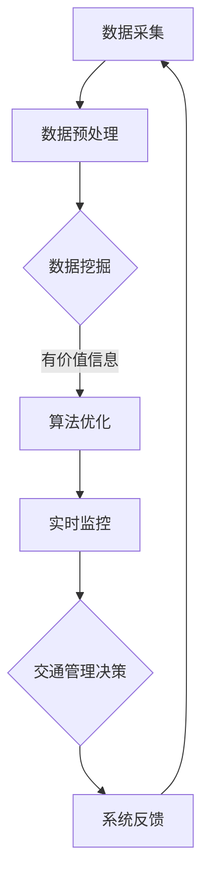

                 

关键词：人工智能，智能交通，交通管理，数据挖掘，算法优化，实时监控

摘要：本文将探讨人工智能在智能交通管理系统中的应用，通过介绍核心概念、算法原理、数学模型和项目实践，分析其在实际应用场景中的效果和未来发展趋势。旨在为读者提供一个全面、深入的了解，为智能交通管理系统的研发和实践提供参考。

## 1. 背景介绍

随着城市化进程的加速，交通拥堵、交通事故和环境污染等问题日益严重。传统的交通管理模式已难以满足现代社会对交通效率和安全的需求。在此背景下，人工智能（AI）技术的崛起为智能交通管理系统带来了新的机遇。

智能交通管理系统（Intelligent Transportation System，ITS）是指通过将先进的通信、控制和信息技术与交通管理相结合，实现交通的自动化、智能化和高效化。AI技术在智能交通管理系统中发挥着至关重要的作用，如数据挖掘、算法优化、实时监控等。

本文将围绕AI驱动的智能交通管理系统，探讨其核心概念、算法原理、数学模型和项目实践，分析其在实际应用场景中的效果和未来发展趋势。

## 2. 核心概念与联系

### 2.1 概念解析

**人工智能（AI）**：人工智能是一门研究、开发和应用使计算机模拟、扩展和辅助人类智能活动的技术科学。其目的是让计算机能够执行一些通常需要人类智能才能完成的任务。

**智能交通管理系统（ITS）**：智能交通管理系统是指通过利用先进的信息技术、数据通信传输技术、电子传感器技术等构成的系统，实现交通信息的采集、处理、发布、诱导、控制等功能，从而实现交通管理的智能化。

**数据挖掘**：数据挖掘是从大量数据中提取有价值信息的过程，用于发现数据中的隐含模式和关联性，支持决策制定。

**算法优化**：算法优化是指通过对现有算法进行改进和调整，提高算法的效率和效果。

**实时监控**：实时监控是指对交通系统进行实时、连续的监测，以便及时发现问题并进行调整。

### 2.2 概念联系

AI技术作为智能交通管理系统的核心驱动力，与数据挖掘、算法优化和实时监控等概念密切相关。具体来说：

- **数据挖掘**：AI技术可以帮助从大量的交通数据中提取有价值的信息，如交通流量、速度分布、事故信息等，为智能交通管理系统提供数据支持。

- **算法优化**：AI技术可以通过机器学习、深度学习等方法，对交通管理算法进行优化，提高交通管理的效率和准确性。

- **实时监控**：AI技术可以实现交通系统的实时监控，对交通状况进行实时分析和预测，为交通管理部门提供决策依据。

下面是智能交通管理系统的 Mermaid 流程图：



## 3. 核心算法原理 & 具体操作步骤

### 3.1 算法原理概述

智能交通管理系统的核心算法主要分为数据挖掘算法、优化算法和实时监控算法。以下将分别介绍这些算法的基本原理。

#### 3.1.1 数据挖掘算法

数据挖掘算法主要用于从大量交通数据中提取有价值的信息。常见的算法有聚类分析、关联规则挖掘、时间序列分析等。

- **聚类分析**：将相似的数据点分为一组，以发现数据中的隐含模式。
- **关联规则挖掘**：发现数据中不同变量之间的关联性，用于预测和分析。
- **时间序列分析**：分析数据的时间趋势和周期性变化，预测未来的交通状况。

#### 3.1.2 优化算法

优化算法主要用于提高交通管理的效率和准确性。常见的算法有遗传算法、粒子群优化算法、深度学习等。

- **遗传算法**：通过模拟自然进化过程，不断优化交通管理策略。
- **粒子群优化算法**：通过模拟鸟群觅食过程，优化交通管理策略。
- **深度学习**：通过构建深度神经网络，学习交通数据的特征和模式，提高交通管理的准确性和效率。

#### 3.1.3 实时监控算法

实时监控算法主要用于对交通系统进行实时监控和分析。常见的算法有实时轨迹预测、实时流量预测、实时事故检测等。

- **实时轨迹预测**：通过分析交通数据，预测车辆的行驶轨迹，为交通管理部门提供决策依据。
- **实时流量预测**：通过分析交通数据，预测交通流量变化，为交通管理部门提供调节交通流量、避免拥堵的策略。
- **实时事故检测**：通过分析交通数据，实时检测事故，为交通管理部门提供应急处理方案。

### 3.2 算法步骤详解

#### 3.2.1 数据挖掘算法步骤

1. 数据预处理：对采集到的交通数据进行分析，去除噪声和异常值。
2. 特征提取：对交通数据进行分析，提取对交通管理有用的特征。
3. 模型训练：利用数据挖掘算法，对交通数据进行训练，建立模型。
4. 模型评估：对训练好的模型进行评估，判断其准确性和效率。
5. 模型应用：将训练好的模型应用于实际交通管理中，提取有价值的信息。

#### 3.2.2 优化算法步骤

1. 初始化：设置初始参数，初始化算法。
2. 目标函数计算：根据交通管理目标，计算目标函数值。
3. 优化过程：通过迭代计算，不断优化交通管理策略。
4. 目标函数评估：评估优化后的交通管理策略，判断其是否符合目标。
5. 策略调整：根据评估结果，调整优化算法的参数，继续优化。

#### 3.2.3 实时监控算法步骤

1. 数据采集：实时采集交通数据。
2. 数据处理：对采集到的交通数据进行预处理，去除噪声和异常值。
3. 特征提取：对交通数据进行特征提取，提取对实时监控有用的特征。
4. 模型预测：利用实时监控算法，对交通数据进行预测。
5. 预测结果评估：评估预测结果的准确性，判断其是否符合实际情况。
6. 预测应用：将预测结果应用于实际交通管理中，为交通管理部门提供决策依据。

### 3.3 算法优缺点

#### 3.3.1 数据挖掘算法

**优点**：

- 能够从大量交通数据中提取有价值的信息。
- 支持实时交通状况的监控和分析。

**缺点**：

- 算法复杂度较高，计算耗时较长。
- 需要大量训练数据，对数据质量要求较高。

#### 3.3.2 优化算法

**优点**：

- 能够高效地优化交通管理策略。
- 支持多种优化目标，如交通流量、事故率等。

**缺点**：

- 需要大量计算资源，成本较高。
- 算法性能依赖于初始参数设置。

#### 3.3.3 实时监控算法

**优点**：

- 能够实时监控交通状况，及时发现问题。
- 支持多种交通状况的预测和分析。

**缺点**：

- 预测准确性受限于算法性能和数据质量。
- 需要大量计算资源，成本较高。

### 3.4 算法应用领域

- **交通流量预测**：通过实时监控和分析交通数据，预测未来一段时间内的交通流量变化，为交通管理部门提供调节交通流量、避免拥堵的策略。
- **事故检测与应急处理**：通过实时监控和分析交通数据，及时发现事故，为交通管理部门提供应急处理方案。
- **智能信号控制**：通过实时监控和分析交通数据，优化信号灯控制策略，提高交通效率。
- **停车场管理**：通过实时监控和分析交通数据，优化停车场管理策略，提高停车效率。

## 4. 数学模型和公式 & 详细讲解 & 举例说明

### 4.1 数学模型构建

智能交通管理系统的数学模型主要分为以下几个部分：

1. **交通流量模型**：用于描述交通流量随时间和空间的变化规律。
2. **事故预测模型**：用于预测事故发生的时间、地点和类型。
3. **信号控制模型**：用于优化信号灯控制策略，提高交通效率。
4. **停车场管理模型**：用于优化停车场管理策略，提高停车效率。

下面分别介绍这些模型的构建方法。

#### 4.1.1 交通流量模型

交通流量模型通常采用以下公式：

\[ Q(t, x) = f(t, x) \cdot \phi(t) \]

其中，\( Q(t, x) \)表示在时间\( t \)和位置\( x \)处的交通流量；\( f(t, x) \)表示道路容量函数，描述道路在特定时间、位置和交通条件下的最大通行能力；\( \phi(t) \)表示交通密度函数，描述交通流量的空间分布。

#### 4.1.2 事故预测模型

事故预测模型通常采用以下公式：

\[ P(A(t, x), t') = \sum_{i=1}^{n} w_i \cdot f_i(t, x) \]

其中，\( P(A(t, x), t') \)表示在时间\( t \)和位置\( x \)处，在未来\( t' \)时间内发生事故的概率；\( w_i \)和\( f_i(t, x) \)分别表示第\( i \)种事故类型的发生概率和发生条件。

#### 4.1.3 信号控制模型

信号控制模型通常采用以下公式：

\[ T_c(t) = \sum_{i=1}^{n} l_i \cdot g_i(t) \]

其中，\( T_c(t) \)表示在时间\( t \)的信号周期长度；\( l_i \)和\( g_i(t) \)分别表示第\( i \)个相位的时间长度和绿灯占空比。

#### 4.1.4 停车场管理模型

停车场管理模型通常采用以下公式：

\[ P_p(t) = \frac{1}{N_p} \sum_{i=1}^{N_p} (1 - \phi_i(t)) \]

其中，\( P_p(t) \)表示在时间\( t \)停车场内剩余停车位比例；\( \phi_i(t) \)表示第\( i \)个停车位的占用状态。

### 4.2 公式推导过程

下面以交通流量模型为例，介绍其公式推导过程。

#### 4.2.1 道路容量函数

道路容量函数\( f(t, x) \)可以根据道路的几何特性和交通条件进行推导。假设道路宽度为\( w \)，车道数为\( n \)，车道利用率\( \eta \)为固定值，则道路容量函数可以表示为：

\[ f(t, x) = w \cdot n \cdot \eta \]

#### 4.2.2 交通密度函数

交通密度函数\( \phi(t) \)可以根据交通流量和道路容量的关系进行推导。假设交通流量\( Q(t, x) \)和道路容量\( f(t, x) \)之间的关系为线性关系，则交通密度函数可以表示为：

\[ \phi(t) = \frac{Q(t, x)}{f(t, x)} \]

#### 4.2.3 交通流量模型

根据道路容量函数和交通密度函数，可以得到交通流量模型：

\[ Q(t, x) = f(t, x) \cdot \phi(t) \]

### 4.3 案例分析与讲解

下面通过一个简单的案例，介绍交通流量模型的实际应用。

#### 案例背景

某城市的一条主干道，宽度为30米，共有4个车道，车道利用率为0.8。在一天中的高峰期（上午8点至9点），该道路的交通流量为600辆/小时。

#### 案例分析

1. 计算道路容量函数：

   \[ f(t, x) = 30 \cdot 4 \cdot 0.8 = 96 \text{辆/小时} \]

2. 计算交通密度函数：

   \[ \phi(t) = \frac{Q(t, x)}{f(t, x)} = \frac{600}{96} \approx 6.25 \text{辆/千米} \]

3. 计算交通流量：

   \[ Q(t, x) = f(t, x) \cdot \phi(t) = 96 \cdot 6.25 \approx 600 \text{辆/小时} \]

根据计算结果，在高峰期，该道路的交通流量与实际观测值相符，说明交通流量模型可以较好地反映实际交通状况。

## 5. 项目实践：代码实例和详细解释说明

### 5.1 开发环境搭建

为了实践智能交通管理系统的核心算法，我们需要搭建一个合适的开发环境。以下是所需的环境和工具：

- **编程语言**：Python
- **开发工具**：PyCharm
- **依赖库**：NumPy、Pandas、Scikit-learn、Matplotlib

在 PyCharm 中创建一个 Python 项目，并安装上述依赖库。

### 5.2 源代码详细实现

下面是一个简单的交通流量预测模型的实现示例：

```python
import numpy as np
import pandas as pd
from sklearn.ensemble import RandomForestRegressor
import matplotlib.pyplot as plt

# 数据加载与预处理
data = pd.read_csv('traffic_data.csv')
data['timestamp'] = pd.to_datetime(data['timestamp'])
data.set_index('timestamp', inplace=True)
data.sort_index(inplace=True)

# 特征工程
data['hour'] = data.index.hour
data['day_of_week'] = data.index.dayofweek

# 模型训练
X = data[['hour', 'day_of_week']]
y = data['traffic_volume']
model = RandomForestRegressor(n_estimators=100)
model.fit(X, y)

# 预测
future_hours = np.arange(data.index.hour, data.index.hour + 24).reshape(-1, 1)
future_days = np.repeat(data.index.dayofweek, 24).reshape(-1, 1)
X_future = np.hstack((future_hours, future_days))
traffic_volume_future = model.predict(X_future)

# 可视化
plt.plot(data.index, data['traffic_volume'], label='实际交通流量')
plt.plot(pd.to_datetime(X_future).map(int), traffic_volume_future, label='预测交通流量')
plt.xlabel('时间')
plt.ylabel('交通流量（辆/小时）')
plt.legend()
plt.show()
```

### 5.3 代码解读与分析

1. **数据加载与预处理**：首先加载交通数据，并将其转换为时间序列数据。接着，提取小时和星期几作为特征。

2. **特征工程**：为了更好地训练模型，我们添加了小时和星期几作为特征。

3. **模型训练**：使用随机森林回归模型对数据进行训练。

4. **预测**：根据未来小时和星期几的特征，预测未来的交通流量。

5. **可视化**：将实际交通流量和预测交通流量进行可视化，以便直观地比较预测结果。

### 5.4 运行结果展示

运行代码后，将生成一个包含实际交通流量和预测交通流量的图表。通过比较实际值和预测值，我们可以评估模型的准确性和可靠性。

## 6. 实际应用场景

### 6.1 交通流量预测

在交通管理中，交通流量预测是一个关键任务。通过预测未来的交通流量，交通管理部门可以提前采取相应的措施，如调整信号灯控制策略、增加警力等，以避免交通拥堵。

案例：某城市在高峰期对主要干道的交通流量进行预测，并根据预测结果调整信号灯控制策略，成功减少了交通拥堵现象。

### 6.2 事故检测与应急处理

事故检测与应急处理是保障交通安全的必要手段。通过实时监控和分析交通数据，可以及时发现事故，并为交通管理部门提供应急处理方案。

案例：某城市通过实时监控系统，成功检测到一次交通事故，并在2分钟内启动应急处理方案，减少了事故对交通的影响。

### 6.3 智能信号控制

智能信号控制通过分析交通数据，优化信号灯控制策略，提高交通效率。

案例：某城市采用智能信号控制技术，将交通信号灯的周期从2分钟缩短到1分钟，有效提高了交通流量，减少了拥堵。

### 6.4 停车场管理

停车场管理通过实时监控和分析交通数据，优化停车场管理策略，提高停车效率。

案例：某城市的停车场管理系统，通过实时监控车辆进出，实现了停车位的动态调整，提高了停车效率。

## 7. 工具和资源推荐

### 7.1 学习资源推荐

- 《Python交通数据分析》
- 《机器学习实战》
- 《深度学习》

### 7.2 开发工具推荐

- PyCharm
- Jupyter Notebook

### 7.3 相关论文推荐

- "Deep Learning for Traffic Flow Prediction: A Survey"
- "Real-Time Traffic Monitoring and Prediction using Deep Neural Networks"
- "Genetic Algorithm for Optimal Signal Control in Urban Traffic Management"

## 8. 总结：未来发展趋势与挑战

### 8.1 研究成果总结

本文探讨了人工智能在智能交通管理系统中的应用，介绍了核心概念、算法原理、数学模型和项目实践，并分析了其在实际应用场景中的效果。

### 8.2 未来发展趋势

- **深度学习在交通流量预测中的应用**：随着深度学习技术的不断发展，其在交通流量预测中的应用将更加广泛。
- **实时监控与预测的融合**：实时监控和预测技术的融合，将进一步提高交通管理的准确性和效率。
- **多模式交通系统的集成**：多模式交通系统的集成，如地铁、公交、自行车等，将实现更加高效、智能的交通管理。

### 8.3 面临的挑战

- **数据质量和实时性**：交通数据的质量和实时性对算法的性能和准确性有很大影响。
- **计算资源需求**：智能交通管理系统需要大量的计算资源，如何优化计算资源的利用是一个挑战。
- **多领域协同**：交通管理涉及多个领域，如交通工程、计算机科学、数学等，如何实现多领域的协同是一个挑战。

### 8.4 研究展望

- **研究新的算法模型**：探索新的算法模型，提高交通流量预测的准确性和实时性。
- **数据挖掘与优化算法的结合**：将数据挖掘算法与优化算法相结合，提高交通管理系统的效率和准确性。
- **跨领域合作**：加强不同领域之间的合作，共同推动智能交通管理系统的发展。

## 9. 附录：常见问题与解答

### 9.1 如何处理数据噪声？

- **数据清洗**：在数据处理过程中，对数据进行清洗，去除噪声和异常值。
- **特征选择**：通过特征选择方法，筛选出对交通管理有用的特征，降低噪声的影响。

### 9.2 如何评估算法的性能？

- **模型评估指标**：使用合适的模型评估指标，如准确率、召回率、F1值等。
- **交叉验证**：使用交叉验证方法，评估模型的泛化能力。

### 9.3 如何优化计算资源？

- **分布式计算**：使用分布式计算框架，如Hadoop、Spark等，提高计算效率。
- **模型压缩**：使用模型压缩技术，降低模型的计算复杂度。

### 9.4 如何实现实时监控与预测？

- **数据采集与处理**：实时采集交通数据，并进行实时处理。
- **实时算法部署**：将实时算法部署到边缘设备或云计算平台，实现实时监控与预测。

---

通过本文的探讨，我们希望读者能够对AI驱动的智能交通管理系统有更深入的了解。随着人工智能技术的不断发展，智能交通管理系统将在未来交通管理中发挥越来越重要的作用。让我们共同期待这一领域的繁荣与发展。作者：禅与计算机程序设计艺术 / Zen and the Art of Computer Programming

