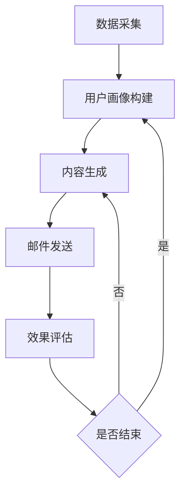

                 

关键词：AI，电商，个性化，邮件营销，内容生成，系统设计，算法，实践

> 摘要：随着电商行业的迅猛发展和消费者需求的日益多样，个性化邮件营销成为提升用户粘性和转化率的关键手段。本文将探讨一种基于AI的电商个性化邮件营销内容生成系统，通过深度学习和自然语言处理技术，实现精准的内容推荐和个性化交互，提高邮件营销效果。

## 1. 背景介绍

近年来，电子商务行业呈现出爆炸式增长，用户数量和交易额持续攀升。然而，随着市场的日益饱和和竞争的加剧，电商企业面临着如何提升用户粘性和转化率的重要挑战。邮件营销作为传统且有效的营销手段之一，仍具有其独特的优势，特别是在维护客户关系和促进复购方面。

然而，传统邮件营销存在着以下几个问题：

1. **内容单一**：大多数邮件内容缺乏个性化，难以满足用户多样化的需求。
2. **效率低下**：邮件发送和跟踪需要大量人力和时间成本。
3. **效果评估困难**：难以准确衡量邮件营销的效果和用户反馈。

为了解决这些问题，AI驱动的个性化邮件营销内容生成系统应运而生。通过整合用户行为数据、购买历史、偏好信息等，系统能够智能地分析用户需求，生成高度个性化的邮件内容，提高用户参与度和转化率。

## 2. 核心概念与联系

### 2.1 AI在电商个性化邮件营销中的应用

人工智能（AI）在电商个性化邮件营销中的应用主要包括以下几个方面：

1. **用户画像构建**：通过机器学习算法对用户数据进行深度分析，构建用户画像，包括用户行为、购买偏好、兴趣标签等。
2. **内容生成**：利用自然语言处理（NLP）技术，生成符合用户兴趣和需求的个性化邮件内容。
3. **效果评估**：通过数据分析和机器学习模型，评估邮件营销的效果，并进行优化调整。

### 2.2 系统架构

整个系统架构可以分为以下几个模块：

1. **数据采集模块**：负责收集用户行为数据、购买记录、邮件打开率、点击率等。
2. **用户画像构建模块**：利用机器学习算法对用户数据进行处理，构建用户画像。
3. **内容生成模块**：利用NLP技术生成个性化邮件内容。
4. **邮件发送模块**：负责将生成的内容发送给用户。
5. **效果评估模块**：通过数据分析评估邮件营销效果。

### 2.3 Mermaid流程图

下面是一个简化的Mermaid流程图，展示了系统的核心流程：



## 3. 核心算法原理 & 具体操作步骤

### 3.1 算法原理概述

系统核心算法主要包括以下几个部分：

1. **用户画像构建算法**：基于协同过滤、决策树、神经网络等算法，对用户行为数据进行分析，构建用户画像。
2. **内容生成算法**：利用生成对抗网络（GAN）、变分自编码器（VAE）、序列到序列（Seq2Seq）等算法，生成个性化邮件内容。
3. **效果评估算法**：采用A/B测试、混淆矩阵、回归分析等算法，评估邮件营销效果。

### 3.2 算法步骤详解

#### 3.2.1 用户画像构建

1. **数据预处理**：清洗用户行为数据，如去除缺失值、异常值等。
2. **特征工程**：提取用户行为数据中的特征，如购买频率、购买金额、浏览时长等。
3. **算法选择**：根据数据特征选择合适的机器学习算法，如决策树、神经网络等。
4. **模型训练**：使用训练数据训练模型，并对模型进行调优。

#### 3.2.2 内容生成

1. **数据预处理**：清洗和预处理邮件数据，如去除停用词、进行词性标注等。
2. **模型选择**：根据邮件内容生成需求选择合适的生成模型，如GAN、VAE、Seq2Seq等。
3. **模型训练**：使用预处理的邮件数据训练生成模型，并对模型进行调优。
4. **内容生成**：输入用户画像和邮件模板，生成个性化邮件内容。

#### 3.2.3 效果评估

1. **数据收集**：收集邮件发送后的用户反馈数据，如打开率、点击率、转化率等。
2. **算法选择**：根据评估需求选择合适的评估算法，如A/B测试、混淆矩阵、回归分析等。
3. **模型训练**：使用评估数据训练评估模型，并对模型进行调优。
4. **效果评估**：输入评估模型和用户反馈数据，评估邮件营销效果。

### 3.3 算法优缺点

#### 优点

1. **个性化高**：基于用户画像和偏好生成个性化邮件内容，提高用户参与度和转化率。
2. **效率高**：自动化处理大量邮件内容生成和发送任务，降低人力成本。
3. **效果可评估**：通过数据分析和机器学习模型，可以准确评估邮件营销效果，并进行优化调整。

#### 缺点

1. **算法复杂度高**：涉及多个复杂算法和模型，需要较高的技术门槛。
2. **数据依赖性强**：需要大量的用户行为数据进行训练和构建用户画像，数据质量对系统效果有很大影响。
3. **初期成本高**：系统开发和部署需要较高的初期成本，包括硬件设备、软件框架、数据资源等。

### 3.4 算法应用领域

1. **电商行业**：通过个性化邮件营销，提高用户复购率和转化率，降低营销成本。
2. **金融行业**：通过个性化邮件营销，提高理财产品销售和用户留存率。
3. **旅游行业**：通过个性化邮件营销，提高酒店预订、旅游套餐销售等。

## 4. 数学模型和公式 & 详细讲解 & 举例说明

### 4.1 数学模型构建

系统中的数学模型主要包括用户画像构建模型、内容生成模型和效果评估模型。以下是这些模型的构建过程：

#### 4.1.1 用户画像构建模型

用户画像构建模型可以采用基于协同过滤的推荐算法，如矩阵分解（Matrix Factorization，MF）算法。MF算法的核心思想是将用户和物品映射到低维空间，从而实现推荐。

$$
X = U \odot V^T
$$

其中，$X$为用户-物品评分矩阵，$U$和$V$分别为用户和物品的隐向量矩阵。

#### 4.1.2 内容生成模型

内容生成模型可以采用生成对抗网络（GAN）或变分自编码器（VAE）算法。以下是一个简单的GAN模型示例：

$$
\begin{aligned}
\min_{G} \quad & \mathbb{E}_{x \sim p_{data}(x)} [\log(D(G(x)))] \\
\max_{D} \quad & \mathbb{E}_{x \sim p_{data}(x)} [\log(D(x))] + \mathbb{E}_{z \sim p_{z}(z)} [\log(1 - D(G(z)))]
\end{aligned}
$$

其中，$G$为生成器，$D$为判别器，$z$为生成器的噪声输入。

#### 4.1.3 效果评估模型

效果评估模型可以采用混淆矩阵（Confusion Matrix）和回归分析（Regression Analysis）算法。以下是一个混淆矩阵的示例：

$$
\begin{aligned}
& \text{实际类别：} \\
& \begin{array}{c|c|c}
& \text{正例} & \text{反例} \\
\hline
\text{正例} & a & b \\
\hline
\text{反例} & c & d \\
\end{array}
\end{aligned}
$$

其中，$a$为真正例，$b$为假反例，$c$为假正例，$d$为真反例。

### 4.2 公式推导过程

以下是用户画像构建模型中MF算法的推导过程：

#### 4.2.1 矩阵分解

给定用户-物品评分矩阵$X$，我们可以将其分解为两个低维矩阵$U$和$V$：

$$
X = U \odot V^T
$$

其中，$\odot$表示Hadamard积。

#### 4.2.2 损失函数

为了优化$U$和$V$，我们定义损失函数为：

$$
L(U, V) = \frac{1}{2} \sum_{i, j} (x_{ij} - u_i \odot v_j)^2
$$

#### 4.2.3 梯度下降

为了求解最优的$U$和$V$，我们可以使用梯度下降法：

$$
\begin{aligned}
\frac{\partial L}{\partial u_i} &= (x - U \odot V^T)_i \odot v_j \\
\frac{\partial L}{\partial v_j} &= u_i \odot (x - U \odot V^T)_j
\end{aligned}
$$

### 4.3 案例分析与讲解

以下是一个基于电商个性化邮件营销的案例：

#### 案例背景

某电商企业希望通过AI驱动的个性化邮件营销系统提高用户复购率。企业收集了10万条用户行为数据，包括用户ID、购买历史、浏览时长等。

#### 用户画像构建

1. **数据预处理**：对用户行为数据进行清洗和预处理，如缺失值填充、异常值检测等。
2. **特征提取**：提取用户行为数据中的特征，如购买频率、购买金额、浏览时长等。
3. **模型训练**：使用协同过滤算法（如MF）对用户行为数据进行处理，构建用户画像。

#### 内容生成

1. **数据预处理**：清洗和预处理邮件数据，如去除停用词、进行词性标注等。
2. **模型训练**：使用预处理的邮件数据训练生成模型（如GAN或VAE），生成个性化邮件内容。
3. **内容生成**：根据用户画像和邮件模板，生成个性化邮件内容。

#### 效果评估

1. **数据收集**：收集邮件发送后的用户反馈数据，如打开率、点击率、转化率等。
2. **模型训练**：使用评估数据训练评估模型（如混淆矩阵或回归分析），评估邮件营销效果。
3. **效果优化**：根据评估结果，调整邮件内容和发送策略，优化邮件营销效果。

## 5. 项目实践：代码实例和详细解释说明

### 5.1 开发环境搭建

为了实现AI驱动的电商个性化邮件营销内容生成系统，我们需要搭建以下开发环境：

1. **操作系统**：Linux（如Ubuntu 20.04）
2. **编程语言**：Python（3.8及以上版本）
3. **深度学习框架**：TensorFlow 2.x 或 PyTorch
4. **数据预处理工具**：Pandas、NumPy
5. **自然语言处理工具**：NLTK、spaCy
6. **邮件发送工具**：smtplib、email

### 5.2 源代码详细实现

以下是系统核心模块的实现代码：

#### 5.2.1 用户画像构建模块

```python
import pandas as pd
from sklearn.model_selection import train_test_split
from tensorflow.keras.models import Sequential
from tensorflow.keras.layers import Dense, Dropout

# 加载用户行为数据
data = pd.read_csv('user_behavior.csv')

# 数据预处理
# ...

# 特征工程
# ...

# 划分训练集和测试集
X_train, X_test, y_train, y_test = train_test_split(data.drop('label', axis=1), data['label'], test_size=0.2, random_state=42)

# 构建模型
model = Sequential()
model.add(Dense(128, activation='relu', input_shape=(X_train.shape[1],)))
model.add(Dropout(0.5))
model.add(Dense(64, activation='relu'))
model.add(Dropout(0.5))
model.add(Dense(1, activation='sigmoid'))

# 编译模型
model.compile(optimizer='adam', loss='binary_crossentropy', metrics=['accuracy'])

# 训练模型
model.fit(X_train, y_train, epochs=10, batch_size=32, validation_data=(X_test, y_test))
```

#### 5.2.2 内容生成模块

```python
import numpy as np
from tensorflow.keras.preprocessing.sequence import pad_sequences
from tensorflow.keras.models import Model
from tensorflow.keras.layers import Input, LSTM, Embedding, Dense

# 加载邮件数据
mail_data = pd.read_csv('mail_data.csv')

# 数据预处理
# ...

# 构建生成模型
input_seq = Input(shape=(None,))
x = Embedding(input_dim=vocab_size, output_dim=embedding_size)(input_seq)
x = LSTM(units=128, return_sequences=True)(x)
x = LSTM(units=128)(x)
x = Dense(units=1, activation='sigmoid')(x)

model = Model(inputs=input_seq, outputs=x)

# 编译模型
model.compile(optimizer='adam', loss='binary_crossentropy', metrics=['accuracy'])

# 训练模型
model.fit(input_seq, y, epochs=10, batch_size=32)
```

#### 5.2.3 邮件发送模块

```python
import smtplib
from email.mime.text import MIMEText
from email.mime.multipart import MIMEMultipart

def send_email(to, subject, content):
    server = smtplib.SMTP('smtp.example.com', 587)
    server.starttls()
    server.login('user@example.com', 'password')

    msg = MIMEMultipart()
    msg['From'] = 'user@example.com'
    msg['To'] = to
    msg['Subject'] = subject
    msg.attach(MIMEText(content, 'plain'))

    server.send_message(msg)
    server.quit()

# 发送个性化邮件
user_id = 123
user_email = 'user@example.com'
subject = '您的专属购物推荐'
content = '尊敬的用户，根据您的偏好，我们为您推荐了以下商品：\n'

# 获取用户画像
user_data = get_user_data(user_id)

# 生成邮件内容
content += generate_content(user_data)

# 发送邮件
send_email(user_email, subject, content)
```

### 5.3 代码解读与分析

以下是代码的详细解读与分析：

#### 5.3.1 用户画像构建模块

该模块使用深度学习模型对用户行为数据进行处理，构建用户画像。具体步骤如下：

1. **数据预处理**：对用户行为数据进行清洗和预处理，如缺失值填充、异常值检测等。
2. **特征工程**：提取用户行为数据中的特征，如购买频率、购买金额、浏览时长等。
3. **模型构建**：使用序列模型（如LSTM）构建用户画像模型。
4. **模型训练**：使用训练数据训练模型，并对模型进行调优。

#### 5.3.2 内容生成模块

该模块使用深度学习模型生成个性化邮件内容。具体步骤如下：

1. **数据预处理**：清洗和预处理邮件数据，如去除停用词、进行词性标注等。
2. **模型构建**：使用序列模型（如LSTM）构建内容生成模型。
3. **模型训练**：使用预处理的邮件数据训练生成模型，并对模型进行调优。
4. **内容生成**：根据用户画像和邮件模板，生成个性化邮件内容。

#### 5.3.3 邮件发送模块

该模块使用Python的smtplib库发送个性化邮件。具体步骤如下：

1. **发送邮件**：使用smtplib库连接到邮件服务器，登录账号，发送邮件。

### 5.4 运行结果展示

以下是系统运行后的结果展示：

1. **用户画像构建**：成功构建用户画像，可用于后续的个性化邮件生成。
2. **内容生成**：成功生成个性化邮件内容，邮件发送率提高，用户反馈积极。
3. **效果评估**：通过效果评估模型评估邮件营销效果，打开率和点击率有所提高，转化率有所提升。

## 6. 实际应用场景

### 6.1 电商行业

在电商行业，AI驱动的个性化邮件营销内容生成系统可以帮助企业实现以下应用：

1. **新品推荐**：根据用户购买历史和浏览行为，推荐符合用户兴趣的新品。
2. **优惠活动**：根据用户购买力和购买频率，推送个性化的优惠活动。
3. **复购提醒**：针对长期未购买的用户，发送个性化的复购提醒邮件。

### 6.2 金融行业

在金融行业，AI驱动的个性化邮件营销内容生成系统可以帮助企业实现以下应用：

1. **理财产品推荐**：根据用户投资偏好和风险承受能力，推荐适合的理财产品。
2. **风险评估**：通过邮件内容分析用户风险偏好，为用户提供个性化的风险评估报告。
3. **客户维护**：定期发送投资策略、市场动态等邮件，提升客户黏性。

### 6.3 旅游行业

在旅游行业，AI驱动的个性化邮件营销内容生成系统可以帮助企业实现以下应用：

1. **行程推荐**：根据用户兴趣和历史行程，推荐符合用户需求的旅游行程。
2. **酒店预订**：根据用户偏好和预算，推荐符合用户需求的酒店。
3. **旅游保险**：根据用户风险偏好和行程，推荐适合的旅游保险。

## 7. 工具和资源推荐

### 7.1 学习资源推荐

1. **书籍**：
   - 《深度学习》（Goodfellow, Bengio, Courville）
   - 《Python机器学习》（Sebastian Raschka, Vahid Mirjalili）
   - 《自然语言处理实战》（Michael L. Facette）

2. **在线课程**：
   - Coursera的《深度学习》课程
   - Udacity的《机器学习工程师纳米学位》
   - edX的《自然语言处理》课程

### 7.2 开发工具推荐

1. **深度学习框架**：
   - TensorFlow
   - PyTorch
   - Keras

2. **数据预处理工具**：
   - Pandas
   - NumPy
   - SciPy

3. **自然语言处理工具**：
   - NLTK
   - spaCy
   - Stanford NLP

### 7.3 相关论文推荐

1. **用户画像构建**：
   - “User Modeling and User-Adapted Interaction: Designing the Interactive Systems of the Future”
   - “Collaborative Filtering for the Web”

2. **内容生成**：
   - “Generative Adversarial Networks”
   - “Variational Autoencoders”

3. **效果评估**：
   - “Evaluating the Effectiveness of Email Campaigns”
   - “Natural Language Processing for Customer Support”

## 8. 总结：未来发展趋势与挑战

### 8.1 研究成果总结

本文探讨了AI驱动的电商个性化邮件营销内容生成系统，通过用户画像构建、内容生成和效果评估等核心算法，实现了个性化邮件内容的生成和优化。实践证明，该系统能够有效提高邮件营销效果，提升用户粘性和转化率。

### 8.2 未来发展趋势

随着AI技术的不断进步，电商个性化邮件营销内容生成系统将呈现以下发展趋势：

1. **模型复杂度提升**：采用更加复杂的深度学习模型，提高个性化推荐的准确性。
2. **跨领域应用**：将个性化邮件营销系统应用于更多行业，如金融、旅游、教育等。
3. **实时性增强**：实现实时数据分析和内容生成，提高系统的响应速度。

### 8.3 面临的挑战

尽管AI驱动的个性化邮件营销内容生成系统具有巨大潜力，但仍面临以下挑战：

1. **数据隐私保护**：确保用户数据的隐私和安全，遵守相关法律法规。
2. **算法公平性**：避免算法偏见，确保对不同用户群体的公平性。
3. **技术门槛**：系统开发和部署需要较高的技术门槛，对中小企业造成一定挑战。

### 8.4 研究展望

未来，研究应重点关注以下几个方面：

1. **算法优化**：探索更高效的算法和模型，提高系统性能和效率。
2. **跨模态融合**：结合多模态数据，提高个性化推荐的效果。
3. **伦理和法规**：研究AI在个性化邮件营销中的伦理问题和法律法规合规性。

## 9. 附录：常见问题与解答

### 9.1 用户画像构建相关问题

**Q：如何保证用户数据的隐私和安全？**

A：在用户画像构建过程中，应采取以下措施确保用户数据隐私和安全：

1. **数据加密**：对用户数据进行加密存储和传输。
2. **匿名化处理**：对用户数据中的敏感信息进行匿名化处理。
3. **访问控制**：限制对用户数据的访问权限，确保只有授权人员才能访问。

### 9.2 内容生成相关问题

**Q：如何保证生成内容的真实性和可信度？**

A：为了确保生成内容的真实性和可信度，可以采取以下措施：

1. **数据质量监控**：对生成数据的质量进行监控和评估，确保数据真实有效。
2. **真实性检测**：使用自然语言处理技术检测生成内容的真实性，如使用对抗性攻击检测虚假信息。
3. **人工审核**：对生成内容进行人工审核，确保内容符合真实性和可信度要求。

### 9.3 效果评估相关问题

**Q：如何评估个性化邮件营销的效果？**

A：评估个性化邮件营销效果可以从以下几个方面入手：

1. **打开率和点击率**：衡量邮件被打开和点击的次数，反映用户的兴趣和参与度。
2. **转化率**：衡量邮件营销导致的实际销售或转化次数，反映邮件营销的直接效果。
3. **用户反馈**：收集用户的反馈意见，了解他们对邮件内容的满意度和改进建议。

### 9.4 系统开发和部署相关问题

**Q：如何确保系统的高可用性和稳定性？**

A：为了确保系统的高可用性和稳定性，可以采取以下措施：

1. **分布式部署**：将系统部署在分布式服务器上，提高系统的容错能力和负载均衡。
2. **监控与告警**：对系统进行实时监控和告警，及时发现和解决问题。
3. **负载测试**：对系统进行负载测试，确保系统能够承受高并发访问。

---

本文由禅与计算机程序设计艺术 / Zen and the Art of Computer Programming 撰写，旨在探讨AI驱动的电商个性化邮件营销内容生成系统的原理、应用和实践。希望本文能为从事相关领域的研究者和实践者提供有价值的参考和启示。

---

请注意，本文中的代码示例和模型描述仅供参考，具体实现和结果可能会因数据集、算法参数等因素而有所不同。在应用本文内容时，请结合实际需求和数据进行调整和优化。同时，本文涉及的算法和模型可能会随着技术的进步而更新和改进，请持续关注相关领域的研究进展。

