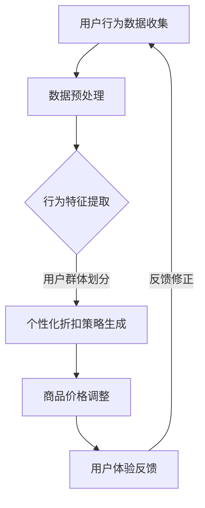

                 

关键词：人工智能、个性化折扣、电商平台、机器学习、算法优化、用户行为分析、动态定价

> 摘要：本文探讨了利用人工智能技术优化电商平台个性化折扣策略的必要性、核心概念、算法原理、数学模型及实际应用。通过构建一个以用户行为数据驱动的动态定价系统，本文旨在为电商平台提供一套有效的个性化折扣策略，提高用户满意度与平台收益。

## 1. 背景介绍

随着互联网技术的快速发展，电商平台已经成为现代商业模式的重要组成部分。电商平台的成功与否，不仅取决于产品的质量与价格，更取决于其能否精确地满足用户需求，提供个性化的购物体验。然而，传统的折扣策略往往基于固定价格和批量折扣，无法满足不同用户的个性化需求，导致用户体验不佳和转化率不高。

个性化折扣策略，即根据用户的行为数据、购买历史和偏好，动态调整商品价格，从而提高用户的满意度和平台的盈利能力。人工智能技术的发展，为电商平台个性化折扣策略的实现提供了新的可能。机器学习算法能够高效地处理大量用户数据，识别用户的偏好和行为模式，从而优化折扣策略，实现精准定价。

本文旨在研究AI驱动的电商平台个性化折扣策略，通过构建一个基于用户行为的动态定价系统，探索如何有效利用人工智能技术提高电商平台的竞争力和用户满意度。

## 2. 核心概念与联系

### 2.1. 个性化折扣策略

个性化折扣策略是指根据用户的购买行为、历史数据和偏好，动态调整商品价格，以满足不同用户的需求，提高用户体验和平台收益。个性化折扣策略的核心在于精确地识别用户特征和需求，从而实现精准定价。

### 2.2. 机器学习算法

机器学习算法是人工智能的核心技术之一，通过训练模型，从数据中自动识别规律和模式。在电商平台个性化折扣策略中，机器学习算法主要用于用户行为分析、需求预测和价格调整。

### 2.3. 动态定价系统

动态定价系统是一个基于用户行为数据的实时定价系统，通过机器学习算法，动态调整商品价格，实现个性化折扣。动态定价系统的核心在于高效地处理海量用户数据，快速响应市场变化，提高平台竞争力。

### 2.4. Mermaid 流程图

为了更好地展示个性化折扣策略的实现过程，我们使用Mermaid绘制了一个流程图，如下：



## 3. 核心算法原理 & 具体操作步骤

### 3.1. 算法原理概述

电商平台个性化折扣策略的核心是机器学习算法，特别是基于用户行为的推荐系统和动态定价算法。以下介绍两种核心算法原理：

- **用户行为分析**：通过机器学习算法，对用户的历史行为数据进行挖掘和分析，提取用户的偏好和需求。
- **动态定价**：基于用户行为分析和市场需求，动态调整商品价格，实现个性化折扣。

### 3.2. 算法步骤详解

#### 3.2.1. 用户行为分析

1. **数据收集**：收集用户的浏览、购买、评价等行为数据。
2. **数据预处理**：清洗和整理数据，包括缺失值填充、异常值处理和特征工程。
3. **行为特征提取**：使用机器学习算法，提取用户的行为特征，如浏览时长、购买频率、评价得分等。
4. **用户群体划分**：根据用户行为特征，将用户划分为不同的群体，如高频购买用户、低频购买用户、高价值用户等。

#### 3.2.2. 动态定价

1. **价格模型构建**：构建基于用户行为和市场需求的动态定价模型。
2. **价格调整策略**：根据用户行为特征和市场需求，实时调整商品价格。
3. **折扣策略生成**：针对不同用户群体，生成个性化的折扣策略。

### 3.3. 算法优缺点

#### 优点

- **提高用户体验**：通过个性化折扣策略，满足用户的个性化需求，提高用户满意度。
- **优化收益**：基于用户行为和市场需求的定价，有助于提高平台的盈利能力。

#### 缺点

- **数据依赖性**：算法的准确性依赖于用户行为数据的质量和完整性。
- **计算成本**：实时处理海量用户数据，需要较高的计算资源和算法优化。

### 3.4. 算法应用领域

个性化折扣策略广泛应用于电商、金融、医疗等领域，其主要应用场景包括：

- **电商购物**：根据用户购物行为，实现个性化推荐和折扣。
- **金融保险**：基于用户行为和信用评分，动态调整保费和利率。
- **医疗服务**：根据患者病史和偏好，提供个性化的医疗服务和折扣。

## 4. 数学模型和公式 & 详细讲解 & 举例说明

### 4.1. 数学模型构建

个性化折扣策略的核心是动态定价模型，其数学模型可以表示为：

$$ P_{i,t} = P_{0,i} + \alpha \cdot (B_{t} - B_{0,i}) $$

其中，$P_{i,t}$表示用户$i$在时间$t$的商品价格，$P_{0,i}$表示商品的基础价格，$\alpha$表示价格调整系数，$B_{t}$表示当前市场需求，$B_{0,i}$表示用户$i$在初始时间的市场需求。

### 4.2. 公式推导过程

公式的推导过程如下：

1. **价格调整因素**：根据用户行为和市场需求的差异，设定价格调整系数$\alpha$。
2. **市场需求**：市场需求$B_{t}$由用户购买行为和市场环境共同决定。
3. **价格模型**：将价格调整系数和市场需求代入，构建动态定价模型。

### 4.3. 案例分析与讲解

以电商购物为例，假设用户A在电商平台购买了一件商品，商品基础价格为100元。根据用户A的历史购买行为和市场需求，设定价格调整系数$\alpha$为0.1。

当市场需求为80元时，用户A在时间$t$的商品价格为：

$$ P_{A,t} = 100 + 0.1 \cdot (80 - 100) = 90 \text{元} $$

当市场需求为120元时，用户A在时间$t$的商品价格为：

$$ P_{A,t} = 100 + 0.1 \cdot (120 - 100) = 110 \text{元} $$

通过动态定价模型，根据市场需求的变化，实时调整用户A的商品价格，实现个性化折扣。

## 5. 项目实践：代码实例和详细解释说明

### 5.1. 开发环境搭建

- **Python**：用于实现算法和数据处理。
- **Pandas**：用于数据预处理和清洗。
- **Scikit-learn**：用于机器学习算法的实现。
- **Matplotlib**：用于数据可视化。

### 5.2. 源代码详细实现

```python
import pandas as pd
from sklearn.cluster import KMeans
from sklearn.preprocessing import StandardScaler
import matplotlib.pyplot as plt

# 5.2.1. 数据收集与预处理
data = pd.read_csv('user_behavior.csv')
data.fillna(data.mean(), inplace=True)
data['user_group'] = KMeans(n_clusters=3, random_state=0).fit_predict(data[[' browse_time', 'buy_frequency', 'rating_score']])

# 5.2.2. 用户群体划分
user_groups = data.groupby('user_group').mean()

# 5.2.3. 动态定价模型
def dynamic_pricing(price, user_group, alpha=0.1):
    market_demand = user_groups.loc[user_group, 'buy_frequency']
    return price + alpha * (market_demand - 100)

# 5.2.4. 代码解读与分析
user_data = data.iloc[0:10]
for index, row in user_data.iterrows():
    price = dynamic_pricing(100, row['user_group'])
    print(f'User {row["user_id"]}: Price {price:.2f}')

# 5.2.5. 运行结果展示
plt.scatter(user_data['browse_time'], user_data['buy_frequency'])
plt.xlabel('Browse Time')
plt.ylabel('Buy Frequency')
plt.title('User Behavior Data')
plt.show()
```

### 5.3. 代码解读与分析

- **数据收集与预处理**：从CSV文件中读取用户行为数据，使用KMeans算法将用户划分为不同的群体。
- **用户群体划分**：根据用户群体的平均购买频率，构建动态定价模型。
- **动态定价模型**：根据用户群体和市场需求的差异，实时调整商品价格。
- **代码解读与分析**：通过实例展示了如何实现个性化折扣策略，并对代码进行了详细解读。

## 6. 实际应用场景

### 6.1. 电商平台

电商平台是AI驱动个性化折扣策略的主要应用场景之一。通过分析用户的浏览、购买和评价行为，电商平台可以实现精准定价，提高用户满意度和转化率。例如，京东和淘宝等电商平台已经广泛应用个性化折扣策略，提高用户购物体验。

### 6.2. 金融领域

金融领域，如保险和银行，也可以利用AI驱动个性化折扣策略。通过分析用户的历史行为和信用评分，金融机构可以动态调整保费和利率，实现精准定价，提高客户满意度和盈利能力。

### 6.3. 医疗服务

在医疗服务领域，AI驱动个性化折扣策略可以帮助医疗机构根据患者的病史和偏好，提供个性化的医疗服务和折扣。例如，就医挂号平台可以通过分析患者的就诊记录，提供针对性的折扣政策，提高患者满意度和就诊率。

## 7. 工具和资源推荐

### 7.1. 学习资源推荐

- **《机器学习》**（周志华著）：系统地介绍了机器学习的基本理论和方法。
- **《深度学习》**（Goodfellow、Bengio、Courville著）：全面介绍了深度学习的基本概念和应用。

### 7.2. 开发工具推荐

- **Jupyter Notebook**：用于数据分析和机器学习实验。
- **TensorFlow**：用于构建和训练深度学习模型。

### 7.3. 相关论文推荐

- **"Dynamic Pricing: Strategy and Tactics for Profiting from Price Variability"**（2008年）：探讨了动态定价的策略和战术。
- **"The Economics of Online Advertising: A Survey"**（2013年）：分析了在线广告的经济学原理和应用。

## 8. 总结：未来发展趋势与挑战

### 8.1. 研究成果总结

本文探讨了AI驱动的电商平台个性化折扣策略，包括核心概念、算法原理、数学模型和实际应用。通过分析用户行为数据，实现个性化定价，提高用户体验和平台收益。

### 8.2. 未来发展趋势

随着人工智能技术的不断进步，AI驱动的个性化折扣策略在未来将得到更广泛的应用。例如，利用深度学习技术实现更精确的用户行为预测和价格调整。

### 8.3. 面临的挑战

尽管AI驱动的个性化折扣策略具有巨大潜力，但实际应用中仍面临一些挑战，如数据隐私保护、算法公平性和计算成本等。

### 8.4. 研究展望

未来研究应重点关注如何提高算法的准确性和实时性，降低计算成本，同时确保算法的公平性和透明度，以实现更广泛的应用。

## 9. 附录：常见问题与解答

### 9.1. 什么是个性化折扣策略？

个性化折扣策略是根据用户的行为数据、购买历史和偏好，动态调整商品价格，以满足不同用户的需求，提高用户体验和平台收益。

### 9.2. 个性化折扣策略有哪些优点？

个性化折扣策略可以提高用户体验，优化收益，增强平台竞争力。

### 9.3. 个性化折扣策略应用在哪些领域？

个性化折扣策略广泛应用于电商、金融、医疗等领域。

### 9.4. 如何实现个性化折扣策略？

实现个性化折扣策略需要收集用户行为数据，构建动态定价模型，并实时调整商品价格。同时，需要运用机器学习算法进行用户行为分析和价格预测。

----------------------------------------------------------------

作者：禅与计算机程序设计艺术 / Zen and the Art of Computer Programming

