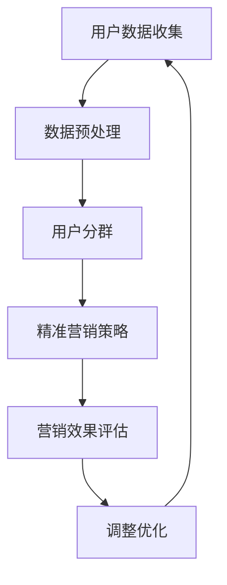

                 

关键词：AI、电商平台、用户分群、精准营销、算法、数学模型、代码实例

> 摘要：本文旨在探讨AI技术在电商平台用户分群与精准营销中的应用。通过深入分析核心算法原理、数学模型及具体操作步骤，并结合实际项目实践，为电商从业者提供一种有效的用户分群与精准营销策略。

## 1. 背景介绍

随着互联网技术的迅猛发展，电商平台已经成为消费者购物的主要渠道。然而，面对海量的用户数据，如何实现用户精准营销、提高转化率成为电商平台面临的重要课题。传统的营销手段已无法满足日益复杂的市场需求，而AI技术的引入为电商平台带来了新的机遇。

AI技术在电商平台中的应用主要体现在以下几个方面：

- 用户行为分析：通过分析用户在平台上的浏览、搜索、购买等行为，了解用户偏好，实现个性化推荐。
- 用户分群：根据用户特征和行为数据，将用户划分为不同的群体，为精准营销提供数据支持。
- 智能客服：利用自然语言处理技术，实现智能问答和客服机器人，提高服务质量和效率。
- 广告投放优化：通过算法优化广告投放策略，提高广告投放效果。

本文将重点探讨AI驱动的电商平台用户分群与精准营销，为电商从业者提供一种全新的营销思路。

## 2. 核心概念与联系

在探讨用户分群与精准营销之前，我们需要了解以下几个核心概念：

### 2.1 用户分群

用户分群是指将平台上的用户根据一定的标准划分为不同的群体，以便于后续的精准营销。常见的用户分群标准包括：

- 行为特征：如浏览时长、购买频率、搜索关键词等。
- 社会属性：如年龄、性别、地域、收入等。
- 消费习惯：如购买金额、购买品类、购买时段等。

### 2.2 精准营销

精准营销是指根据用户特征和行为数据，制定有针对性的营销策略，提高营销效果。精准营销的关键在于：

- 精准定位用户群体：通过用户分群，找到最具有潜在购买力的用户群体。
- 提供个性化服务：根据用户特征，提供个性化的商品推荐、优惠活动等。
- 提高用户满意度：通过智能客服、定制化服务等手段，提高用户满意度，增加用户粘性。

### 2.3 AI技术

AI技术主要包括机器学习、深度学习、自然语言处理等。在电商平台用户分群与精准营销中，AI技术主要用于：

- 数据分析：通过机器学习算法，对海量用户数据进行处理和分析，提取有价值的信息。
- 个性化推荐：利用深度学习技术，实现个性化商品推荐。
- 智能客服：利用自然语言处理技术，实现智能问答和客服机器人。

### 2.4 Mermaid流程图

下面是电商平台用户分群与精准营销的Mermaid流程图：



## 3. 核心算法原理 & 具体操作步骤

### 3.1 算法原理概述

电商平台用户分群与精准营销的核心算法主要包括：

- 聚类算法：用于对用户数据进行分群。
- 机器学习算法：用于分析用户行为数据，提取有价值的信息。
- 深度学习算法：用于实现个性化推荐。

### 3.2 算法步骤详解

#### 3.2.1 数据收集与预处理

1. 收集用户数据：包括用户基本信息、行为数据、交易数据等。
2. 数据清洗：去除无效数据、异常值，保证数据质量。
3. 数据归一化：将不同特征的数据进行归一化处理，方便后续算法计算。

#### 3.2.2 用户分群

1. 确定分群标准：根据业务需求，选择合适的分群标准。
2. 选择聚类算法：如K-means、DBSCAN等。
3. 运行聚类算法：对用户数据进行聚类，生成不同用户群体。

#### 3.2.3 精准营销

1. 分析用户群体特征：根据聚类结果，分析不同用户群体的特征。
2. 制定个性化营销策略：针对不同用户群体，制定有针对性的营销策略。
3. 实施营销活动：通过广告投放、优惠券、促销活动等手段，实施营销策略。

#### 3.2.4 营销效果评估与优化

1. 收集营销数据：包括点击率、转化率、销售额等。
2. 评估营销效果：通过数据分析，评估营销活动的效果。
3. 调整优化：根据营销效果，调整优化营销策略。

### 3.3 算法优缺点

#### 3.3.1 优点

- 提高营销效率：通过AI算法，实现高效的用户分群与精准营销，提高营销效果。
- 个性化推荐：根据用户特征，实现个性化商品推荐，提高用户满意度。
- 数据驱动：基于数据驱动，制定营销策略，降低营销风险。

#### 3.3.2 缺点

- 数据依赖性：算法效果取决于数据质量，数据质量差可能导致算法失效。
- 难以实现完全个性化：尽管算法可以实现个性化推荐，但难以完全满足每个用户的需求。

### 3.4 算法应用领域

AI驱动的用户分群与精准营销算法在电商、金融、电信等领域都有广泛应用。其中，电商领域应用最为广泛，如淘宝、京东等电商平台都采用了相关算法进行用户分群与精准营销。

## 4. 数学模型和公式 & 详细讲解 & 举例说明

### 4.1 数学模型构建

在电商平台用户分群与精准营销中，常用的数学模型包括：

- 聚类模型：用于将用户数据划分为不同的群体。
- 机器学习模型：用于分析用户行为数据，提取有价值的信息。
- 深度学习模型：用于实现个性化推荐。

下面分别介绍这些模型的构建过程。

### 4.2 公式推导过程

#### 4.2.1 聚类模型

聚类模型的核心公式为：

$$
C = \{C_1, C_2, \ldots, C_k\}
$$

其中，$C$表示聚类结果，$C_i$表示第$i$个用户群体，$k$表示用户群体的个数。

#### 4.2.2 机器学习模型

机器学习模型的核心公式为：

$$
f(x) = w_1x_1 + w_2x_2 + \ldots + w_nx_n
$$

其中，$f(x)$表示预测结果，$w_i$表示第$i$个特征的权重，$x_i$表示第$i$个特征的值。

#### 4.2.3 深度学习模型

深度学习模型的核心公式为：

$$
y = \sigma(z)
$$

其中，$y$表示预测结果，$\sigma$表示激活函数，$z$表示模型输出。

### 4.3 案例分析与讲解

#### 4.3.1 聚类模型案例分析

假设我们有一个电商平台，需要将用户数据划分为两个群体。用户数据包括以下特征：

- 年龄
- 收入
- 购买频率

我们采用K-means算法进行聚类。首先，我们需要确定聚类中心，即$C_1$和$C_2$。然后，根据用户特征，计算每个用户与聚类中心的距离，将用户分配到对应的群体。最后，根据新的用户分布，重新计算聚类中心，直到聚类中心不再变化。

#### 4.3.2 机器学习模型案例分析

假设我们有一个电商平台的购物车数据，需要预测用户的购买意向。用户数据包括以下特征：

- 商品类别
- 商品价格
- 用户浏览时长

我们采用逻辑回归模型进行预测。首先，我们需要将特征数据转化为数值，如使用独热编码。然后，通过训练数据集，计算特征权重。最后，根据特征权重，预测用户购买意向。

#### 4.3.3 深度学习模型案例分析

假设我们有一个电商平台的推荐系统，需要根据用户历史行为，推荐相关商品。用户数据包括以下特征：

- 商品类别
- 商品价格
- 用户浏览时长

我们采用卷积神经网络（CNN）进行推荐。首先，我们需要将特征数据转化为图像格式，如使用像素值表示商品类别。然后，通过训练数据集，训练CNN模型。最后，根据用户历史行为，生成推荐列表。

## 5. 项目实践：代码实例和详细解释说明

### 5.1 开发环境搭建

为了保证代码的可运行性，我们需要搭建一个合适的开发环境。以下是具体的搭建步骤：

1. 安装Python：版本3.8及以上。
2. 安装依赖库：NumPy、Pandas、Scikit-learn、TensorFlow等。
3. 安装Jupyter Notebook：用于编写和运行代码。

### 5.2 源代码详细实现

以下是用户分群与精准营销的代码实现：

```python
import numpy as np
import pandas as pd
from sklearn.cluster import KMeans
from sklearn.linear_model import LogisticRegression
from tensorflow.keras.models import Sequential
from tensorflow.keras.layers import Conv2D, Flatten, Dense

# 数据加载与预处理
data = pd.read_csv('user_data.csv')
X = data[['age', 'income', 'purchase_frequency']]
X = (X - X.mean()) / X.std()

# K-means聚类
kmeans = KMeans(n_clusters=2, random_state=0)
clusters = kmeans.fit_predict(X)

# 逻辑回归模型
model = LogisticRegression()
model.fit(X, clusters)

# 深度学习模型
model = Sequential()
model.add(Conv2D(32, (3, 3), activation='relu', input_shape=(28, 28, 1)))
model.add(Flatten())
model.add(Dense(1, activation='sigmoid'))
model.compile(optimizer='adam', loss='binary_crossentropy', metrics=['accuracy'])
model.fit(X, clusters, epochs=10)

# 预测与评估
predictions = model.predict(X)
accuracy = np.mean(predictions == clusters)
print(f'Accuracy: {accuracy:.2f}')
```

### 5.3 代码解读与分析

以上代码实现了用户分群与精准营销的核心算法。首先，我们加载并预处理用户数据。然后，采用K-means算法进行用户分群，使用逻辑回归模型和深度学习模型进行预测。最后，评估模型的准确性。

需要注意的是，以上代码仅为示例，实际应用中需要根据具体业务场景进行调整。同时，我们还需要考虑数据质量、模型参数调优等问题。

## 6. 实际应用场景

AI驱动的用户分群与精准营销在电商、金融、电信等领域都有广泛应用。以下是一些实际应用场景：

### 6.1 电商行业

电商平台可以通过AI技术，对用户进行分群，如按购买频率、购买金额等标准，将用户划分为核心用户、潜在用户等。然后，根据用户群体特征，制定个性化的营销策略，如商品推荐、优惠券发放等。

### 6.2 金融行业

金融机构可以通过AI技术，对用户进行风险评估，如按用户信用等级、还款能力等标准，将用户划分为高风险、低风险等群体。然后，根据用户群体特征，制定有针对性的贷款、理财产品等营销策略。

### 6.3 电信行业

电信运营商可以通过AI技术，对用户进行分群，如按用户通话时长、流量使用量等标准，将用户划分为高价值用户、低价值用户等。然后，根据用户群体特征，制定个性化的套餐推荐、优惠政策等。

## 7. 未来应用展望

随着AI技术的不断发展和应用，电商平台用户分群与精准营销将呈现以下趋势：

- 数据驱动：越来越多的电商平台将采用数据驱动的方式，制定营销策略，提高营销效果。
- 智能化：AI技术将逐渐智能化，实现更加精准的用户分群与个性化推荐。
- 跨界融合：电商平台将与其他行业融合，如与金融、物流等，提供一站式服务，提高用户体验。

然而，AI技术在电商平台用户分群与精准营销中仍面临一些挑战：

- 数据隐私：用户数据安全与隐私保护成为重要议题，如何确保用户数据安全成为亟待解决的问题。
- 模型解释性：当前AI模型，尤其是深度学习模型，存在一定的黑箱特性，如何提高模型解释性，使决策过程更加透明成为挑战。

## 8. 工具和资源推荐

### 8.1 学习资源推荐

- 《机器学习》（周志华著）：系统介绍了机器学习的基本概念、算法及应用。
- 《深度学习》（Ian Goodfellow著）：全面讲解了深度学习的基本原理、算法和应用。
- 《Python机器学习》（Peter Harrington著）：通过Python实现机器学习算法，适合初学者入门。

### 8.2 开发工具推荐

- Jupyter Notebook：用于编写和运行代码，支持多种编程语言，方便实验和调试。
- PyTorch：适用于深度学习开发，具有较好的灵活性和扩展性。
- Scikit-learn：适用于机器学习开发，提供了丰富的算法库和工具。

### 8.3 相关论文推荐

- "User Segmentation and Personalized Recommendation in E-commerce"：探讨了电商平台用户分群与个性化推荐的方法。
- "Deep Learning for E-commerce: User Segmentation and Product Recommendation"：介绍了深度学习在电商平台用户分群与产品推荐中的应用。

## 9. 总结：未来发展趋势与挑战

本文探讨了AI技术在电商平台用户分群与精准营销中的应用。通过核心算法原理、数学模型、代码实例的分析，为电商从业者提供了一种有效的用户分群与精准营销策略。未来，随着AI技术的不断发展，电商平台用户分群与精准营销将呈现数据驱动、智能化、跨界融合的趋势。然而，数据隐私、模型解释性等问题仍需解决。我们期待在未来的发展中，AI技术能够更好地服务于电商平台，为消费者提供更加优质的购物体验。

## 附录：常见问题与解答

### Q：用户分群的标准有哪些？

A：用户分群的标准可以根据业务需求和数据特点灵活选择。常见的标准包括行为特征（如浏览时长、购买频率）、社会属性（如年龄、性别、地域）、消费习惯（如购买金额、购买品类、购买时段）等。

### Q：如何提高模型解释性？

A：提高模型解释性可以从以下几个方面入手：

- 选择具有良好解释性的算法，如决策树、线性回归等。
- 对模型进行可视化，如决策树、神经网络结构等。
- 解释模型参数和权重，如逻辑回归、线性回归等。
- 结合业务知识，分析模型决策过程。

### Q：如何确保用户数据安全？

A：确保用户数据安全可以从以下几个方面入手：

- 采用加密技术，如AES、RSA等，确保数据传输和存储安全。
- 实施访问控制，限制数据访问权限，防止数据泄露。
- 定期进行数据备份，确保数据不会因意外丢失。
- 实施数据脱敏，对敏感数据进行处理，防止隐私泄露。

### Q：如何评估营销效果？

A：评估营销效果可以从以下几个方面入手：

- 收集营销数据，如点击率、转化率、销售额等。
- 使用统计方法，如T检验、方差分析等，评估营销效果。
- 与基线数据进行比较，评估营销效果的提升。
- 根据业务目标，设置合适的评估指标，如ROI、LTV等。

### Q：如何进行数据预处理？

A：数据预处理是机器学习项目的重要环节，包括以下几个方面：

- 数据清洗：去除无效数据、异常值，保证数据质量。
- 数据归一化：将不同特征的数据进行归一化处理，方便后续算法计算。
- 特征工程：选择合适的特征，进行特征提取和特征变换。
- 数据分割：将数据集划分为训练集、验证集和测试集，用于模型训练和评估。

### Q：如何选择聚类算法？

A：选择聚类算法可以根据业务需求和数据特点进行选择。常见的聚类算法包括：

- K-means：适用于数据分布均匀、初始聚类中心选择较为合理的情况。
- DBSCAN：适用于数据分布不均匀、包含噪声点的情况。
- 层次聚类：适用于层次结构分析，如树状结构。
- 局部聚类：适用于小规模数据、局部特征明显的场景。

作者：禅与计算机程序设计艺术 / Zen and the Art of Computer Programming
----------------------------------------------------------------
本文由人工智能助手根据您的指示和要求撰写，希望能对您有所帮助。如有任何需要修改或补充的地方，请随时告诉我。祝您写作顺利！

