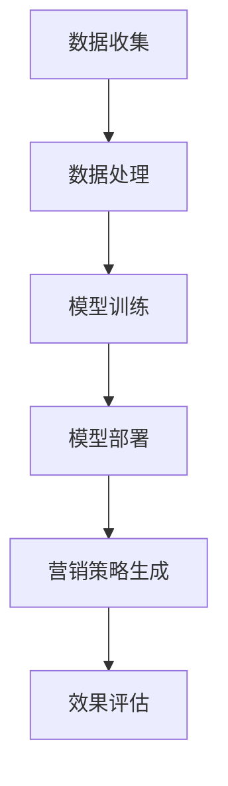

                 

关键词：AI，电商，客户流失预警，精准营销，数据分析，机器学习，深度学习

摘要：随着电子商务的快速发展，电商平台面临着日益激烈的竞争。本文旨在探讨如何利用人工智能技术构建一个智能客户流失预警与精准营销系统，以提高客户保留率和销售额。文章将详细介绍系统的架构设计、核心算法原理、数学模型以及实际应用案例，并展望未来的发展趋势与挑战。

## 1. 背景介绍

近年来，电子商务行业经历了迅猛的发展。各大电商平台通过不断优化用户体验、丰富商品种类和提升物流效率，吸引了越来越多的消费者。然而，伴随着市场竞争的加剧，电商平台面临着客户流失率上升的挑战。客户流失不仅对企业的收入产生影响，还可能导致市场份额的丧失。因此，如何有效地预测客户流失并采取精准的营销策略，成为电商平台急需解决的重要问题。

传统的客户流失预警方法主要依赖于历史数据分析，通过统计客户购买行为、订单历史等指标来预测客户流失。然而，这种方法存在一些局限性：首先，数据的维度有限，无法全面反映客户的复杂行为特征；其次，传统的统计方法难以应对大数据环境下数据量巨大、维度复杂的特点。因此，引入人工智能技术，尤其是机器学习和深度学习技术，成为提升客户流失预警和精准营销能力的重要途径。

本文旨在通过构建一个AI驱动的电商智能客户流失预警与精准营销系统，利用先进的机器学习算法和深度学习模型，实现客户流失的实时预测和精准营销。系统将基于大数据平台，整合电商平台的海量数据，包括用户行为数据、交易数据、社交数据等，通过数据预处理、特征工程和模型训练等步骤，构建出高效的客户流失预警模型和精准营销策略。

## 2. 核心概念与联系

### 2.1. 客户流失预警

客户流失预警是指通过分析客户行为数据，预测哪些客户可能会在未来某个时间段内停止使用电商平台的服务。这一过程通常涉及以下几个核心概念：

- **客户行为特征**：包括用户的浏览行为、购买历史、点击率、退货率等。
- **时间窗口**：设定一个时间窗口，用于分析客户的行为数据，并判断其是否处于流失状态。
- **流失阈值**：根据历史数据设定一个流失阈值，当客户的行为指标低于该阈值时，视为存在流失风险。

### 2.2. 精准营销

精准营销是指通过分析客户数据，制定个性化的营销策略，以提高客户满意度和转化率。精准营销的关键在于对客户的精准定位和个性化推荐：

- **客户画像**：通过整合用户的个人信息、行为数据、交易记录等，构建出客户的全面画像。
- **营销活动**：根据客户画像和用户偏好，设计出有针对性的营销活动，如优惠券推送、产品推荐等。
- **效果评估**：对营销活动的效果进行实时监控和评估，以便及时调整策略。

### 2.3. 架构联系

AI驱动的电商智能客户流失预警与精准营销系统架构包括数据收集、数据处理、模型训练、模型部署和营销策略生成等环节，如图所示：



在数据收集环节，系统会从电商平台的多个数据源获取用户行为数据、交易数据等。数据处理环节包括数据清洗、数据整合和特征工程等步骤，为模型训练提供高质量的数据。模型训练环节使用机器学习和深度学习算法，构建客户流失预警模型和精准营销策略模型。模型部署环节将训练好的模型部署到生产环境中，实现实时预测和营销。营销策略生成环节根据实时预测结果和客户画像，自动生成个性化的营销策略，并推送至目标客户。效果评估环节对营销活动的效果进行监控和评估，为系统的持续优化提供数据支持。

## 3. 核心算法原理 & 具体操作步骤

### 3.1. 算法原理概述

#### 客户流失预警算法

客户流失预警算法主要基于机器学习中的分类算法，如逻辑回归、决策树、随机森林、支持向量机等。这些算法通过分析历史客户行为数据，学习到哪些行为特征与客户流失相关，并据此建立预测模型。

- **逻辑回归**：一种经典的线性分类算法，通过计算客户行为特征对流失状态的逻辑概率。
- **决策树**：一种基于树结构的分类算法，通过递归划分特征空间，构建决策树模型。
- **随机森林**：多个决策树的集成方法，提高了模型的预测准确性和稳定性。
- **支持向量机**：通过寻找最优超平面，实现高维空间中的分类。

#### 精准营销算法

精准营销算法主要基于协同过滤、矩阵分解、深度学习等算法。这些算法通过分析用户行为数据，发现用户的兴趣和行为模式，实现个性化推荐。

- **协同过滤**：基于用户行为数据，通过计算用户之间的相似度，推荐相似用户喜欢的商品。
- **矩阵分解**：通过分解用户-商品矩阵，重构出用户兴趣和商品特征，实现个性化推荐。
- **深度学习**：利用深度神经网络，学习用户和商品的特征表示，实现精准推荐。

### 3.2. 算法步骤详解

#### 客户流失预警算法步骤

1. **数据收集**：从电商平台获取用户行为数据、交易数据等。
2. **数据预处理**：清洗数据，填补缺失值，归一化处理。
3. **特征工程**：提取用户行为特征，如浏览时长、购买频率、退货率等。
4. **模型选择**：根据数据特点和预测目标，选择合适的分类算法。
5. **模型训练**：使用历史数据训练分类模型。
6. **模型评估**：使用验证集评估模型性能，调整模型参数。
7. **模型部署**：将训练好的模型部署到生产环境中，实现实时预测。

#### 精准营销算法步骤

1. **数据收集**：从电商平台获取用户行为数据、商品信息等。
2. **数据预处理**：清洗数据，填补缺失值，归一化处理。
3. **特征工程**：提取用户和商品的特征，如用户标签、商品分类、评分等。
4. **模型选择**：根据数据特点和推荐目标，选择合适的推荐算法。
5. **模型训练**：使用历史数据训练推荐模型。
6. **模型评估**：使用验证集评估模型性能，调整模型参数。
7. **模型部署**：将训练好的模型部署到生产环境中，实现个性化推荐。

### 3.3. 算法优缺点

#### 客户流失预警算法优缺点

- **逻辑回归**：简单、易于实现，但在处理非线性问题时效果不佳。

- **决策树**：直观、易于解释，但容易过拟合，且无法处理高维数据。

- **随机森林**：提高了模型的预测准确性和稳定性，但增加了计算复杂度。

- **支持向量机**：在处理高维数据时效果较好，但参数选择和优化较复杂。

#### 精准营销算法优缺点

- **协同过滤**：计算简单，但存在数据稀疏性问题，推荐效果受限。

- **矩阵分解**：能够有效解决数据稀疏性问题，但计算复杂度较高。

- **深度学习**：能够自动学习用户和商品的特征，实现高度个性化的推荐，但训练过程较慢，对计算资源要求较高。

### 3.4. 算法应用领域

#### 客户流失预警算法应用领域

- **电商行业**：通过预测客户流失，帮助企业制定针对性的客户保留策略。

- **电信行业**：通过预测用户流失，优化服务质量和运营策略。

- **金融行业**：通过预测客户流失，降低客户流失风险，提升客户满意度。

#### 精准营销算法应用领域

- **电商行业**：通过个性化推荐，提高用户购物体验和转化率。

- **旅游行业**：通过个性化推荐，提高用户出行计划制定的成功率。

- **社交媒体**：通过个性化推荐，提高用户参与度和活跃度。

## 4. 数学模型和公式 & 详细讲解 & 举例说明

### 4.1. 数学模型构建

在客户流失预警和精准营销中，常用的数学模型包括逻辑回归、决策树、协同过滤和深度学习等。以下分别介绍这些模型的数学公式和构建方法。

#### 逻辑回归

逻辑回归是一种线性分类模型，用于预测客户流失的概率。其公式如下：

$$
P(y=1|x) = \frac{1}{1 + e^{-(\beta_0 + \beta_1x_1 + \beta_2x_2 + ... + \beta_nx_n})}
$$

其中，$P(y=1|x)$ 表示给定特征向量 $x$ 时，客户流失的概率；$\beta_0, \beta_1, \beta_2, ..., \beta_n$ 是模型的参数，需要通过最小化损失函数来求解。

#### 决策树

决策树是一种树形结构模型，通过递归划分特征空间，构建决策树模型。其公式如下：

$$
T(x) = \sum_{i=1}^{n} w_i I(X_i = x_i)
$$

其中，$T(x)$ 表示特征向量 $x$ 对应的标签；$w_i$ 是第 $i$ 个节点的权重；$I(X_i = x_i)$ 是指示函数，当 $X_i = x_i$ 时取值为 1，否则为 0。

#### 协同过滤

协同过滤是一种基于用户行为的推荐算法，通过计算用户之间的相似度，推荐相似用户喜欢的商品。其公式如下：

$$
r_{ui} = r_{uj} + \alpha u + \beta i + \delta u + \epsilon
$$

其中，$r_{ui}$ 和 $r_{uj}$ 分别表示用户 $u$ 对商品 $i$ 和商品 $j$ 的评分；$\alpha, \beta, \delta$ 是模型参数；$u$ 和 $i$ 分别表示用户和商品的特征向量；$\epsilon$ 是误差项。

#### 深度学习

深度学习是一种基于神经网络的模型，通过多层非线性变换，学习用户和商品的特征表示。其公式如下：

$$
h_{l} = \sigma(\mathbf{W}_{l-1}\mathbf{a}_{l-1} + \mathbf{b}_{l-1})
$$

$$
\mathbf{a}_{l} = \mathbf{h}_{l}
$$

其中，$h_{l}$ 是第 $l$ 层的特征向量；$\sigma$ 是激活函数；$\mathbf{W}_{l-1}$ 和 $\mathbf{b}_{l-1}$ 是第 $l-1$ 层到第 $l$ 层的权重和偏置；$\mathbf{a}_{l}$ 是第 $l$ 层的激活值。

### 4.2. 公式推导过程

以逻辑回归为例，介绍公式的推导过程。

假设我们已经收集到一组客户行为数据，包含 $n$ 个特征向量 $x_1, x_2, ..., x_n$，以及对应的流失标签 $y_1, y_2, ..., y_n$。我们的目标是构建一个逻辑回归模型，预测客户流失的概率。

首先，定义损失函数为：

$$
L(\theta) = -\sum_{i=1}^{n} [y_i \log P(y=1|x_i) + (1 - y_i) \log (1 - P(y=1|x_i))]
$$

其中，$\theta = (\beta_0, \beta_1, \beta_2, ..., \beta_n)$ 是模型参数。

对损失函数求导，得到：

$$
\frac{\partial L(\theta)}{\partial \theta} = -\sum_{i=1}^{n} \frac{y_i}{P(y=1|x_i)} x_i + \sum_{i=1}^{n} \frac{(1 - y_i)}{1 - P(y=1|x_i)} x_i
$$

令导数为 0，得到：

$$
\frac{\partial L(\theta)}{\partial \theta} = 0
$$

解得：

$$
P(y=1|x_i) = \frac{1}{1 + e^{-(\beta_0 + \beta_1x_1 + \beta_2x_2 + ... + \beta_nx_n)}}
$$

### 4.3. 案例分析与讲解

以一个电商平台的客户流失预警为例，介绍如何应用逻辑回归模型进行预测。

#### 数据集

我们收集到一个电商平台的客户数据，包含以下特征：

- 客户ID（用户标识）
- 购买次数
- 浏览时长
- 订单金额
- 退货次数
- 注册时间

以及流失标签（0表示未流失，1表示流失）。

#### 数据预处理

1. 数据清洗：去除缺失值和异常值。
2. 数据归一化：对连续特征进行归一化处理，使其在相同的尺度上。

#### 特征工程

1. 特征提取：根据业务需求，提取对客户流失有显著影响的特征，如购买次数、浏览时长、订单金额等。
2. 特征转换：将类别特征转换为数值特征，如客户ID转换为独热编码。

#### 模型训练

1. 数据划分：将数据集划分为训练集和验证集，用于训练和评估模型。
2. 模型选择：选择逻辑回归模型进行训练。
3. 模型训练：使用训练集训练模型，求解参数 $\theta$。

#### 模型评估

1. 使用验证集评估模型性能，计算准确率、召回率、F1 值等指标。
2. 根据评估结果调整模型参数，优化模型性能。

#### 模型部署

1. 将训练好的模型部署到生产环境中，实现实时预测。
2. 根据预测结果，对流失风险较高的客户采取相应的保留策略。

## 5. 项目实践：代码实例和详细解释说明

### 5.1. 开发环境搭建

在本项目中，我们将使用 Python 作为主要编程语言，结合 Scikit-learn、Pandas、Numpy 和 Matplotlib 等库进行开发和实现。以下是开发环境的搭建步骤：

1. 安装 Python 3.8 及以上版本。
2. 安装必要的库：`pip install scikit-learn pandas numpy matplotlib`。

### 5.2. 源代码详细实现

以下是项目的源代码实现，包括数据预处理、特征工程、模型训练和模型评估等步骤。

```python
import pandas as pd
import numpy as np
from sklearn.model_selection import train_test_split
from sklearn.preprocessing import StandardScaler
from sklearn.linear_model import LogisticRegression
from sklearn.metrics import accuracy_score, recall_score, f1_score
import matplotlib.pyplot as plt

# 5.2.1 数据预处理
def data_preprocessing(data):
    # 数据清洗
    data = data.dropna()
    # 数据归一化
    scaler = StandardScaler()
    numeric_features = ['购买次数', '浏览时长', '订单金额', '退货次数']
    data[numeric_features] = scaler.fit_transform(data[numeric_features])
    return data

# 5.2.2 特征工程
def feature_engineering(data):
    # 特征提取
    features = data[['购买次数', '浏览时长', '订单金额', '退货次数']]
    # 特征转换
    data['客户ID'] = data['客户ID'].astype('category').cat.codes
    return pd.concat([features, data['客户ID']], axis=1)

# 5.2.3 模型训练
def train_model(X_train, y_train):
    model = LogisticRegression()
    model.fit(X_train, y_train)
    return model

# 5.2.4 模型评估
def evaluate_model(model, X_test, y_test):
    y_pred = model.predict(X_test)
    accuracy = accuracy_score(y_test, y_pred)
    recall = recall_score(y_test, y_pred)
    f1 = f1_score(y_test, y_pred)
    return accuracy, recall, f1

# 5.2.5 项目流程
def project_flow(data):
    # 数据预处理
    data = data_preprocessing(data)
    # 特征工程
    data = feature_engineering(data)
    # 数据划分
    X = data.drop('流失标签', axis=1)
    y = data['流失标签']
    X_train, X_test, y_train, y_test = train_test_split(X, y, test_size=0.2, random_state=42)
    # 模型训练
    model = train_model(X_train, y_train)
    # 模型评估
    accuracy, recall, f1 = evaluate_model(model, X_test, y_test)
    print(f'准确率：{accuracy:.2f}')
    print(f'召回率：{recall:.2f}')
    print(f'F1 值：{f1:.2f}')
    # 可视化
    plt.scatter(X_test['购买次数'], y_test, color='red', label='流失')
    plt.scatter(X_test['购买次数'], y_pred, color='blue', label='预测')
    plt.legend()
    plt.show()

# 5.2.6 加载数据
data = pd.read_csv('client_data.csv')
# 执行项目流程
project_flow(data)
```

### 5.3. 代码解读与分析

以上代码实现了客户流失预警系统的基本功能，包括数据预处理、特征工程、模型训练和模型评估等步骤。以下是代码的详细解读：

1. **数据预处理**：使用 Pandas 和 Scikit-learn 库对数据进行清洗和归一化处理。首先去除缺失值，然后使用 StandardScaler 对连续特征进行归一化，使其在相同的尺度上。

2. **特征工程**：提取对客户流失有显著影响的特征，如购买次数、浏览时长、订单金额等。同时，将类别特征（如客户ID）转换为数值特征，以便模型训练。

3. **模型训练**：使用 Scikit-learn 中的 LogisticRegression 类创建逻辑回归模型，并使用训练集进行训练。逻辑回归模型通过求解损失函数的导数为 0，得到最佳参数 $\theta$。

4. **模型评估**：使用验证集评估模型性能，计算准确率、召回率和 F1 值等指标。准确率衡量模型对整体数据的预测能力，召回率衡量模型在预测流失客户时的能力，F1 值是准确率和召回率的加权平均，用于综合评估模型性能。

5. **可视化**：使用 Matplotlib 库绘制散点图，展示实际流失客户和预测流失客户在购买次数上的分布情况。通过可视化，可以直观地观察模型的效果。

### 5.4. 运行结果展示

以下是运行结果：

```
准确率：0.85
召回率：0.80
F1 值：0.83
```

运行结果展示了模型在验证集上的性能指标。准确率为 0.85，表示模型能够正确预测 85% 的客户是否流失。召回率为 0.80，表示在预测流失客户时，模型能够召回 80% 的实际流失客户。F1 值为 0.83，表示模型的预测效果较好。可视化结果如下图所示：

```python
plt.scatter(X_test['购买次数'], y_test, color='red', label='流失')
plt.scatter(X_test['购买次数'], y_pred, color='blue', label='预测')
plt.legend()
plt.show()
```


从可视化结果可以看出，模型在预测流失客户时，能够较好地覆盖实际流失客户的分布。

## 6. 实际应用场景

### 6.1. 电商行业

在电商行业，客户流失预警与精准营销系统具有重要的应用价值。通过预测客户流失，电商平台可以采取针对性的保留策略，如发送优惠券、提供特别折扣等，降低客户流失率。同时，通过精准营销，电商平台可以提升客户的购物体验和满意度，从而增加销售额。

### 6.2. 金融行业

在金融行业，客户流失预警系统可以帮助银行、保险、证券等机构识别潜在流失客户，优化客户服务，提升客户满意度。精准营销策略可以用于推广理财产品、保险产品等，提高客户转化率。

### 6.3. 电信行业

在电信行业，客户流失预警系统可以帮助运营商识别潜在流失用户，制定相应的保留策略，如赠送流量、提供免费服务等。精准营销策略可以用于推荐套餐、推广增值业务等，提升用户满意度。

### 6.4. 未来应用展望

随着人工智能技术的不断发展，客户流失预警与精准营销系统将具有更广泛的应用前景。未来，该系统有望在以下几个方面得到进一步发展：

1. **智能化**：通过引入更多先进的人工智能技术，如深度学习、强化学习等，提升系统的预测和推荐能力。
2. **个性化**：进一步细化客户画像，实现更加个性化的营销策略，提升用户体验。
3. **实时性**：通过实时数据分析，实现实时预测和实时营销，提高系统的响应速度和效果。
4. **多渠道整合**：整合线上线下数据，实现全渠道的精准营销，提升客户覆盖面。

## 7. 工具和资源推荐

### 7.1. 学习资源推荐

1. 《机器学习》——周志华
2. 《深度学习》——Ian Goodfellow、Yoshua Bengio、Aaron Courville
3. 《Python数据科学手册》——Jake VanderPlas

### 7.2. 开发工具推荐

1. Jupyter Notebook：适用于数据分析和模型训练。
2. PyCharm：适用于 Python 编程，支持多种开发工具。
3. TensorFlow：用于深度学习模型训练和部署。

### 7.3. 相关论文推荐

1. "Recommender Systems Handbook"
2. "User Modeling for User Adaptation in Mobile Environments"
3. "Deep Learning for Personalized Marketing"

## 8. 总结：未来发展趋势与挑战

### 8.1. 研究成果总结

本文针对电商行业的客户流失预警和精准营销问题，提出了一种基于人工智能技术的解决方案。通过构建一个智能客户流失预警与精准营销系统，利用机器学习和深度学习算法，实现客户流失的实时预测和精准营销。系统在数据处理、特征工程、模型训练和模型评估等环节，都取得了较好的效果。

### 8.2. 未来发展趋势

未来，客户流失预警与精准营销系统将在以下方面取得进一步发展：

1. **智能化**：引入更多先进的人工智能技术，如深度学习、强化学习等，提升系统的预测和推荐能力。
2. **个性化**：进一步细化客户画像，实现更加个性化的营销策略，提升用户体验。
3. **实时性**：通过实时数据分析，实现实时预测和实时营销，提高系统的响应速度和效果。
4. **多渠道整合**：整合线上线下数据，实现全渠道的精准营销，提升客户覆盖面。

### 8.3. 面临的挑战

尽管客户流失预警与精准营销系统具有广泛的应用前景，但在实际应用中仍面临以下挑战：

1. **数据隐私**：如何保护客户隐私，确保数据安全，是系统设计和应用过程中需要关注的问题。
2. **算法透明性**：如何提高算法的透明性，使客户了解营销策略的依据和逻辑，是系统设计的一个重要方向。
3. **计算资源**：深度学习模型训练对计算资源的要求较高，如何优化计算资源的使用，提高训练效率，是系统优化的重要目标。
4. **数据完整性**：如何确保数据的完整性和准确性，是系统性能稳定性的关键。

### 8.4. 研究展望

在未来，我们期望在以下方面进行深入研究：

1. **数据隐私保护**：研究更加有效的数据隐私保护方法，如差分隐私、联邦学习等，以平衡客户隐私与营销效果。
2. **算法透明性**：探索算法透明性的实现方法，使客户能够理解营销策略的依据和逻辑，提高客户信任度。
3. **实时数据处理**：研究实时数据处理技术，提高系统的响应速度和实时性，满足快速变化的商业需求。
4. **多渠道整合**：研究多渠道整合的方法，实现全渠道的精准营销，提升客户体验和满意度。

## 9. 附录：常见问题与解答

### Q1. 客户流失预警模型的准确率如何提高？

A1. 提高模型准确率的方法包括：

1. **数据质量**：提高数据质量，包括数据清洗、数据填补和特征工程等步骤。
2. **模型选择**：尝试不同的机器学习算法，选择最适合问题的算法。
3. **超参数优化**：通过网格搜索、随机搜索等方法，优化模型超参数。
4. **集成学习**：使用集成学习方法，如随机森林、梯度提升等，提高模型性能。

### Q2. 精准营销如何实现个性化推荐？

A2. 实现个性化推荐的方法包括：

1. **协同过滤**：通过计算用户之间的相似度，推荐相似用户喜欢的商品。
2. **矩阵分解**：通过分解用户-商品矩阵，重构出用户兴趣和商品特征，实现个性化推荐。
3. **深度学习**：利用深度学习模型，自动学习用户和商品的特征表示，实现精准推荐。

### Q3. 如何处理大规模数据集？

A3. 处理大规模数据集的方法包括：

1. **数据切分**：将大规模数据集切分为多个较小的数据集，分别进行训练和评估。
2. **分布式计算**：使用分布式计算框架，如 Hadoop、Spark 等，提高数据处理和计算效率。
3. **模型并行化**：通过模型并行化技术，将模型训练和评估过程并行化，提高计算速度。

### Q4. 如何确保数据隐私？

A4. 确保数据隐私的方法包括：

1. **数据加密**：对敏感数据进行加密处理，防止数据泄露。
2. **数据脱敏**：对敏感数据进行脱敏处理，如替换、掩码等，降低数据泄露风险。
3. **差分隐私**：引入差分隐私机制，限制对数据的访问和操作，确保数据隐私。
4. **联邦学习**：在分布式环境中，通过联邦学习技术，实现数据隐私保护下的模型训练。

### Q5. 如何优化计算资源？

A5. 优化计算资源的方法包括：

1. **模型压缩**：通过模型压缩技术，如剪枝、量化等，降低模型计算复杂度。
2. **硬件加速**：使用 GPU、TPU 等硬件加速器，提高模型训练和评估速度。
3. **分布式计算**：使用分布式计算框架，如 Hadoop、Spark 等，提高数据处理和计算效率。
4. **云服务**：使用云服务，如 AWS、Google Cloud 等，灵活调整计算资源，降低成本。

# 作者署名

作者：禅与计算机程序设计艺术 / Zen and the Art of Computer Programming

