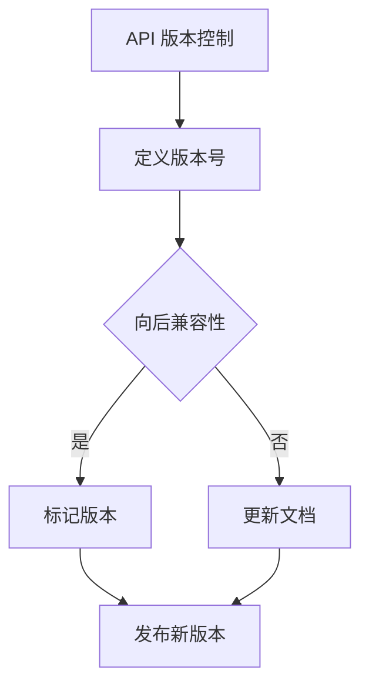

                 

关键词：API 版本控制、RESTful API、API 管理策略、向后兼容性、最佳实践、微服务架构、版本管理工具

> 摘要：本文将深入探讨 API 版本控制的最佳实践，包括其重要性、核心概念、实施策略和工具选择。通过分析常见的 API 版本控制方法，我们将揭示如何在实际项目中实现有效的 API 管理策略，确保系统的稳定性和可维护性。

## 1. 背景介绍

随着互联网和云计算的快速发展，API（应用程序编程接口）已成为现代软件开发的关键组成部分。API 使不同的系统和服务能够相互通信和协作，促进了软件组件的重用和集成。然而，随着 API 的数量和复杂性不断增加，API 管理成为了一个重要的挑战。

API 版本控制是 API 管理中的一个核心环节，它确保了在 API 更新时保持向后兼容性，避免了因版本变更而导致的服务中断和客户不满。良好的 API 版本控制策略可以帮助开发团队高效地管理 API，同时也确保了用户的体验。

本文将讨论 API 版本控制的重要性、核心概念、实施策略和工具选择，旨在为开发者提供一套全面的最佳实践指南。

## 2. 核心概念与联系

### 2.1 API 版本控制的定义

API 版本控制是指对 API 进行版本管理的过程，确保在 API 更新时，现有客户的应用程序可以平稳过渡到新版本。这通常涉及对 API 端点、请求格式、响应格式等进行标识和更新。

### 2.2 API 版本控制的重要性

- **向后兼容性**：确保现有客户的应用程序可以在新版本 API 上运行。
- **可维护性**：通过隔离不同版本的 API，使维护和升级变得更加容易。
- **可扩展性**：允许开发团队逐步引入新的功能，而不会影响到现有服务。

### 2.3 API 版本控制的核心概念

- **版本号**：通常以 MAJOR.MINOR.PATCH 的格式表示，分别代表大版本、小版本和修复版本。
- **兼容性**：向后兼容性、向前兼容性和不兼容性。
- **标记版本**：使用预发布标记（如 alpha、beta、rc）来标识不稳定版本。

### 2.4 API 版本控制的 Mermaid 流程图



## 3. 核心算法原理 & 具体操作步骤

### 3.1 算法原理概述

API 版本控制的核心原理是确保 API 的更新不会影响到现有客户的应用程序。这通常涉及以下步骤：

1. **定义版本号**：为 API 指定一个明确的版本号，以便于标识和管理。
2. **向后兼容性检查**：在发布新版本之前，检查新版本是否与旧版本兼容。
3. **更新文档**：在新版本发布时，更新 API 文档，包括版本号、端点、请求和响应格式等。
4. **标记版本**：使用预发布标记来标识不稳定版本。
5. **发布新版本**：通过 API 管理平台发布新版本。

### 3.2 算法步骤详解

1. **定义版本号**：

   - 采用 MAJOR.MINOR.PATCH 的格式。
   - MAJOR：大版本更新，不兼容旧版本。
   - MINOR：小版本更新，兼容旧版本。
   - PATCH：修复版本，兼容旧版本。

2. **向后兼容性检查**：

   - 检查新版本是否兼容旧版本，避免不兼容的更改。
   - 使用自动化工具进行兼容性测试。

3. **更新文档**：

   - 在 API 文档中包含版本号、端点、请求和响应格式。
   - 使用最新的 OpenAPI 规范来描述 API。

4. **标记版本**：

   - 使用预发布标记来标识不稳定版本。
   - 在发布前进行内部测试和 beta 版本测试。

5. **发布新版本**：

   - 通过 API 管理平台发布新版本。
   - 更新文档，确保用户了解新版本的变化。

### 3.3 算法优缺点

- **优点**：
  - 确保系统的稳定性和可维护性。
  - 提高开发团队的工作效率。
  - 支持逐步引入新功能。

- **缺点**：
  - 需要额外的管理和维护工作。
  - 可能会增加系统的复杂度。

### 3.4 算法应用领域

API 版本控制广泛应用于各种场景，包括：

- **Web 服务**：RESTful API 的版本控制。
- **微服务架构**：确保微服务之间的兼容性。
- **移动应用**：API 更新不会影响到现有用户。

## 4. 数学模型和公式 & 详细讲解 & 举例说明

### 4.1 数学模型构建

API 版本控制可以被视为一个组合优化问题，涉及以下数学模型：

- **版本兼容性矩阵**：定义新旧版本的兼容性。
- **版本更新规则**：定义版本更新的规则和约束。

### 4.2 公式推导过程

假设有两个版本 \( V_1 \) 和 \( V_2 \)，其兼容性可以通过以下公式表示：

\[ C(V_1, V_2) = \begin{cases}
1 & \text{如果 } V_1 \text{ 和 } V_2 \text{ 兼容} \\
0 & \text{如果 } V_1 \text{ 和 } V_2 \text{ 不兼容}
\end{cases} \]

### 4.3 案例分析与讲解

假设我们有两个 API 版本 \( V1.0 \) 和 \( V2.0 \)，其中 \( V2.0 \) 是 \( V1.0 \) 的更新版本。

- **版本兼容性矩阵**：

  \[
  \begin{array}{c|c}
  & V1.0 & V2.0 \\
  \hline
  V1.0 & 1 & 0 \\
  V2.0 & 1 & 1 \\
  \end{array}
  \]

- **版本更新规则**：

  - \( V1.0 \) 可以无缝升级到 \( V2.0 \)。
  - \( V2.0 \) 可以回退到 \( V1.0 \)。

通过以上数学模型和公式，我们可以更清晰地理解和实现 API 版本控制。

## 5. 项目实践：代码实例和详细解释说明

### 5.1 开发环境搭建

- **工具**：使用 Spring Boot 创建 RESTful API 服务。
- **版本管理**：使用 Git 进行版本控制。

### 5.2 源代码详细实现

以下是使用 Spring Boot 创建的 RESTful API 服务的示例代码：

```java
@RestController
@RequestMapping("/api/v1")
public class VersionOneController {

    @GetMapping("/hello")
    public String hello() {
        return "Hello from API v1.0";
    }
}

@RestController
@RequestMapping("/api/v2")
public class VersionTwoController {

    @GetMapping("/hello")
    public String hello() {
        return "Hello from API v2.0";
    }
}
```

### 5.3 代码解读与分析

在这个示例中，我们创建了两个不同的 REST Controller，分别对应不同的 API 版本。通过在 URL 中包含版本号，我们可以轻松地管理不同版本的 API。

### 5.4 运行结果展示

- 访问 `/api/v1/hello` 将返回 "Hello from API v1.0"。
- 访问 `/api/v2/hello` 将返回 "Hello from API v2.0"。

这种简单的版本控制方法在实际项目中是可行的，但在复杂场景下，可能需要更高级的版本管理策略和工具。

## 6. 实际应用场景

### 6.1 API 网关

API 网关是实现 API 版本控制的有效方法，它可以统一管理所有的 API 版本，并提供统一的接口供外部调用。

### 6.2 微服务架构

在微服务架构中，每个服务都有自己的 API 版本，通过 API 网关进行统一管理和路由。

### 6.3 移动应用

移动应用通常通过 API 调用来获取数据，API 版本控制可以确保移动应用在新版本 API 上运行。

## 7. 未来应用展望

随着技术的发展，API 版本控制将继续演进，可能的趋势包括：

- **智能版本控制**：利用 AI 技术自动检测和预测兼容性问题。
- **全生命周期管理**：从设计到部署的全生命周期管理，确保 API 版本控制的持续有效性。

## 8. 工具和资源推荐

### 7.1 学习资源推荐

- **API 版本控制最佳实践**：阅读相关的技术文档和博客文章，了解最佳实践。
- **API 管理工具**：使用 API 管理工具，如 Swagger、Postman 等进行 API 版本控制。

### 7.2 开发工具推荐

- **Spring Boot**：用于创建 RESTful API 服务。
- **Git**：用于版本控制和协作。

### 7.3 相关论文推荐

- **“API Versioning for Microservices”**：探讨微服务架构中的 API 版本控制。
- **“Principles of API Design”**：提供 API 设计的全面指南。

## 9. 总结：未来发展趋势与挑战

### 8.1 研究成果总结

API 版本控制是确保系统稳定性和可维护性的关键环节，随着微服务架构和云计算的普及，其重要性日益凸显。

### 8.2 未来发展趋势

- **智能版本控制**：利用 AI 技术提高版本控制效率。
- **全生命周期管理**：从设计到部署的全生命周期管理。

### 8.3 面临的挑战

- **兼容性问题**：在新版本 API 中引入不兼容的更改。
- **维护成本**：版本控制带来的额外维护成本。

### 8.4 研究展望

未来的研究可以关注如何利用 AI 技术优化版本控制过程，以及如何降低维护成本，提高版本控制的有效性和效率。

## 10. 附录：常见问题与解答

### 10.1 什么是 API 版本控制？

API 版本控制是指对 API 进行版本管理的过程，确保在 API 更新时，现有客户的应用程序可以平稳过渡到新版本。

### 10.2 API 版本控制的重要性是什么？

API 版本控制确保系统的稳定性和可维护性，避免因版本变更而导致的服务中断和客户不满。

### 10.3 常见的 API 版本控制方法有哪些？

常见的 API 版本控制方法包括 URL 版本控制、Header 版本控制、参数版本控制和自定义版本控制。

### 10.4 如何实现向后兼容性？

实现向后兼容性的方法包括严格定义版本号、进行兼容性测试和更新 API 文档。

### 10.5 哪些工具可以用于 API 版本控制？

常用的 API 版本控制工具有 Swagger、Postman、Spring Boot 等。

---

本文由“禅与计算机程序设计艺术 / Zen and the Art of Computer Programming”撰写，旨在为开发者提供一套全面的 API 版本控制最佳实践指南。希望通过本文，读者能够更好地理解和应用 API 版本控制策略，提高系统的稳定性和可维护性。

