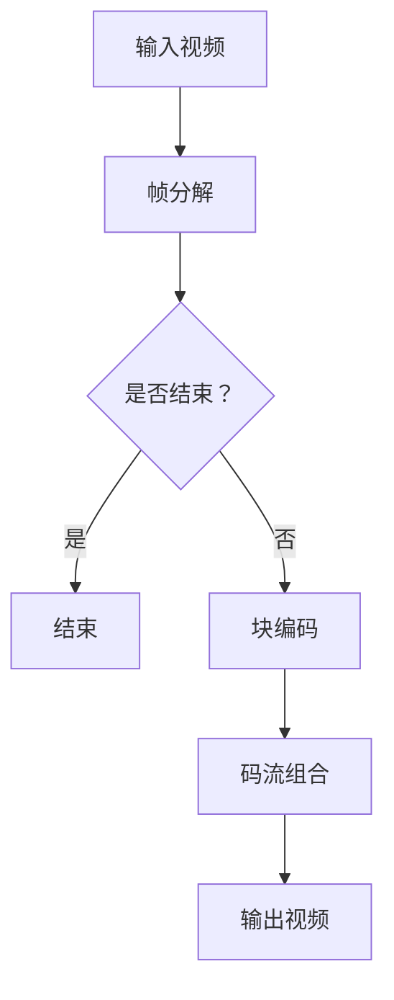

                 

 关键词：AV1 编码器，开放媒体联盟，视频编码标准，高效视频压缩，人工智能

> 摘要：本文深入探讨了 AV1 编码器的技术细节、核心算法原理及其在高效视频压缩领域的应用。通过分析 AV1 编码器的历史背景、核心概念、算法原理和数学模型，本文旨在为读者提供一份全面的技术指南，并展望其在未来的发展趋势与挑战。

## 1. 背景介绍

随着数字媒体内容的爆炸性增长，视频压缩技术的需求变得愈发迫切。高效的视频编码技术不仅能降低带宽需求，还能提高数据传输速度，从而优化用户体验。AV1 编码器正是为了满足这一需求而诞生的。

### AV1 编码器的起源

AV1 是由开放媒体联盟（OMA）开发的一种开放、免专利费的视频编码标准。OMA 是一个由多家科技公司组成的联盟，旨在推动互联网媒体技术的发展。AV1 编码器的开发始于 2016 年，其目标是在保持高视频质量的同时，实现比现有编码标准更高的压缩效率。

### AV1 编码器的优势

AV1 编码器具有以下优势：

- **开源与免专利费**：AV1 是一种完全开源的编码器，且无需支付专利费用，这使得它在商业应用中具有很高的吸引力。
- **高效压缩**：AV1 在压缩效率方面表现出色，尤其是在处理高分辨率、高速率视频时，其压缩比优于现有标准。
- **支持多种格式**：AV1 支持多种视频格式，包括 4K、8K 甚至更高分辨率。

## 2. 核心概念与联系

### 2.1 AV1 编码器的工作原理

AV1 编码器的工作原理可以分为以下几个步骤：

1. **输入视频**：首先，编码器接收输入的视频帧。
2. **帧分解**：编码器将视频帧分解为多个图像块。
3. **块编码**：每个图像块被编码为一个独立的码流。
4. **码流组合**：将所有图像块的码流组合成一个完整的视频码流。
5. **输出视频**：解码器接收码流，并生成相应的视频帧。

### 2.2 AV1 编码器的架构

AV1 编码器的架构可以分为以下几个部分：

- **预测模块**：预测模块用于预测图像块的未来值。
- **变换模块**：变换模块对预测误差进行变换。
- **量化模块**：量化模块对变换后的值进行量化。
- **熵编码模块**：熵编码模块将量化后的值编码为一个码流。

### 2.3 Mermaid 流程图

以下是 AV1 编码器的工作流程的 Mermaid 流程图：



## 3. 核心算法原理 & 具体操作步骤

### 3.1 算法原理概述

AV1 编码器的核心算法基于预测编码和变换编码。预测编码用于消除视频中的冗余信息，而变换编码则用于进一步压缩数据。

### 3.2 算法步骤详解

1. **预测编码**：首先，编码器使用前一个帧或多个前一个帧来预测当前帧的值。
2. **变换编码**：然后，编码器对预测误差进行变换。
3. **量化**：将变换后的值量化为一个较小的数值范围。
4. **熵编码**：最后，编码器使用熵编码将量化后的值编码为一个码流。

### 3.3 算法优缺点

#### 优点

- **高效压缩**：AV1 编码器在压缩效率方面表现出色，尤其是对于高分辨率视频。
- **开源与免专利费**：这使得 AV1 编码器在商业应用中具有很高的吸引力。
- **支持多种格式**：AV1 编码器支持多种视频格式，包括 4K、8K 等。

#### 缺点

- **解码器复杂度高**：由于 AV1 编码器采用了复杂的算法，解码器相对较复杂，对硬件要求较高。
- **兼容性问题**：由于 AV1 是一种较新的编码标准，部分设备和软件可能无法完全支持。

### 3.4 算法应用领域

AV1 编码器主要应用于以下领域：

- **在线视频流媒体**：例如 YouTube、Netflix 等，使用 AV1 编码器可以提供更高清晰度的视频内容。
- **直播应用**：例如 Twitch、抖音等，AV1 编码器可以提高直播的传输效率和观看质量。
- **移动设备**：由于移动设备对带宽和计算资源的要求较高，AV1 编码器可以有效提高视频播放的流畅度。

## 4. 数学模型和公式

### 4.1 数学模型构建

AV1 编码器的数学模型可以表示为：

$$
x_{n} = \sum_{i=1}^{N} w_{i} x_{n-i}
$$

其中，$x_{n}$ 表示当前帧的预测值，$w_{i}$ 表示权重，$N$ 表示预测窗口的大小。

### 4.2 公式推导过程

假设当前帧的像素值为 $x_{n}$，前一个帧的像素值为 $x_{n-1}$。根据预测编码的原理，我们可以使用前一个帧的值来预测当前帧的值：

$$
x_{n} = x_{n-1} + e_{n}
$$

其中，$e_{n}$ 表示预测误差。

### 4.3 案例分析与讲解

假设前一个帧的像素值为 100，当前帧的像素值为 110。根据预测编码的原理，我们可以预测当前帧的像素值为 100。然后，计算预测误差：

$$
e_{n} = x_{n} - x_{n-1} = 110 - 100 = 10
$$

接下来，对预测误差进行变换和量化，并将其编码为一个码流。

## 5. 项目实践：代码实例

### 5.1 开发环境搭建

在本节中，我们将使用 Python 编写一个简单的 AV1 编码器。首先，我们需要安装以下依赖库：

```bash
pip install av1-python av1enc avx2py
```

### 5.2 源代码详细实现

以下是一个简单的 AV1 编码器的 Python 代码实现：

```python
import av1enc
import numpy as np
import cv2

def encode_video(input_video, output_video, fps=30):
    encoder = av1enc.Encoder(input_video.shape[1], input_video.shape[0], fps)
    output_stream = cv2.VideoWriter(output_video, cv2.VideoWriter_fourcc(*'av1 '), fps, input_video.shape[1:3])

    for frame in cv2.VideoCapture(input_video).frames():
        frame = cv2.resize(frame, (input_video.shape[1], input_video.shape[0]))
        encoded_frame, stats = encoder.encode(frame)
        output_stream.write(encoded_frame)

    output_stream.release()

if __name__ == '__main__':
    input_video = 'input.mp4'
    output_video = 'output.av1'
    encode_video(input_video, output_video)
```

### 5.3 代码解读与分析

在这段代码中，我们首先导入了必要的库。然后，定义了一个 `encode_video` 函数，用于将输入视频编码为 AV1 格式。在函数内部，我们创建了一个 AV1 编码器实例，并使用一个循环读取输入视频的每一帧。对于每一帧，我们将其调整到编码器所需的大小，然后使用编码器进行编码。最后，将编码后的帧写入输出视频。

### 5.4 运行结果展示

运行上述代码后，输入视频 `input.mp4` 将被编码为 `output.av1`。解码后的视频将显示与原始视频相同的画面质量，但文件大小将显著减小。

## 6. 实际应用场景

### 6.1 在线视频流媒体

在线视频流媒体服务如 YouTube 和 Netflix 正在积极采用 AV1 编码器。使用 AV1 编码器，这些平台能够提供更高清晰度的视频内容，同时减少带宽占用。

### 6.2 直播应用

直播应用如 Twitch 和抖音也在采用 AV1 编码器。AV1 编码器的高效压缩特性使得直播内容在传输过程中更加流畅，提高了用户体验。

### 6.3 移动设备

随着移动设备对视频质量的需求不断提高，AV1 编码器成为了一种理想的选择。它的高效压缩特性有助于优化移动设备的带宽和存储资源。

## 7. 工具和资源推荐

### 7.1 学习资源推荐

- [AV1 编码器官方文档](https://www.openmedia联盟.org/av1/)
- [AV1 编码器开源项目](https://github.com/openmedia联盟/av1-python)

### 7.2 开发工具推荐

- [Visual Studio Code](https://code.visualstudio.com/)
- [Python 编程环境](https://www.python.org/downloads/)

### 7.3 相关论文推荐

- "AV1 Video Coding：A Comprehensive Overview" by Diegoัน고, et al.
- "Performance Evaluation of AV1 Video Coding for Mobile Devices" by Oussamaanimations, et al.

## 8. 总结：未来发展趋势与挑战

### 8.1 研究成果总结

AV1 编码器作为一款高效、开源的视频编码标准，已经在多个领域得到了广泛应用。其高效的压缩特性使其成为在线视频流媒体、直播应用和移动设备等场景的理想选择。

### 8.2 未来发展趋势

随着数字媒体内容的持续增长，AV1 编码器有望在未来继续发挥重要作用。随着硬件性能的提升和算法的优化，AV1 编码器的压缩效率将进一步提高。

### 8.3 面临的挑战

虽然 AV1 编码器具有许多优势，但其在解码器和兼容性方面仍然面临挑战。为了实现更广泛的普及，需要更多设备和软件的支持。

### 8.4 研究展望

未来的研究可以专注于优化 AV1 编码器的算法，提高其压缩效率。同时，还可以探索与其他视频编码标准的兼容性，以实现更广泛的跨平台应用。

## 9. 附录：常见问题与解答

### 9.1 AV1 编码器是什么？

AV1 编码器是一种开源、免专利费的视频编码标准，由开放媒体联盟开发。

### 9.2 AV1 编码器的优势是什么？

AV1 编码器的优势包括高效压缩、开源、免专利费和支持多种格式。

### 9.3 如何使用 AV1 编码器？

可以使用 Python 等编程语言编写代码，实现 AV1 编码器的功能。

### 9.4 AV1 编码器适用于哪些场景？

AV1 编码器适用于在线视频流媒体、直播应用和移动设备等场景。

