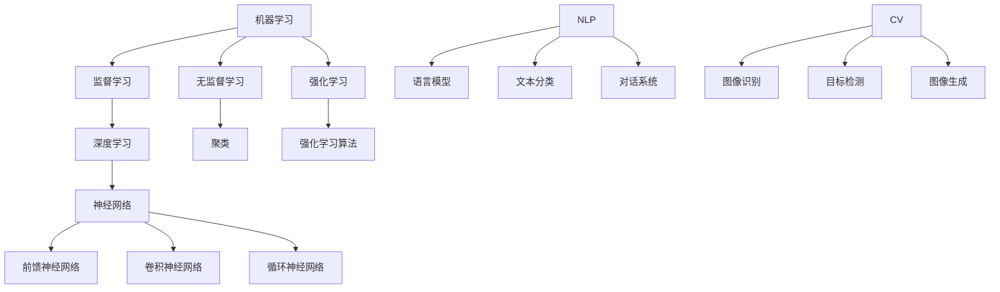

                 

关键词：人工智能，机器学习，深度学习，神经网络，自然语言处理，计算机视觉，未来趋势

摘要：本文由世界顶级人工智能专家安德烈·卡尔帕西撰写，深入探讨了人工智能技术的未来发展前景。文章涵盖了人工智能的核心概念、算法原理、应用领域，并从数学模型、项目实践和实际应用等多个角度分析了人工智能的潜力和挑战。

## 1. 背景介绍

自20世纪50年代人工智能（AI）首次被提出以来，它已经取得了令人瞩目的进展。从最初的规则系统到现代的深度学习模型，人工智能在多个领域都展现出了巨大的潜力。安德烈·卡尔帕西是这一领域的杰出代表，他的工作对自然语言处理、计算机视觉等方向产生了深远的影响。

卡尔帕西在其职业生涯中，不仅发表了大量有影响力的论文，还积极推动人工智能技术的发展。他的研究涉及从基础的机器学习算法到大规模深度学习模型的构建，为人工智能的未来发展奠定了坚实的基础。

## 2. 核心概念与联系

### 2.1 机器学习与深度学习

机器学习（ML）是人工智能的核心组成部分，它使计算机系统能够从数据中学习和改进性能。机器学习可以分为监督学习、无监督学习和强化学习等不同类型。

深度学习（DL）是机器学习的一个子领域，它使用多层神经网络对数据进行建模和处理。深度学习的核心在于其强大的表征学习能力，这使得它在图像识别、语音识别、自然语言处理等领域取得了突破性的进展。

### 2.2 神经网络

神经网络是深度学习的基础，它模拟人脑中的神经元结构，通过调整权重和偏置来学习数据的内在特征。神经网络可以分为前馈神经网络、卷积神经网络（CNN）和循环神经网络（RNN）等不同类型，每种网络都有其独特的应用场景。

### 2.3 自然语言处理与计算机视觉

自然语言处理（NLP）是人工智能的一个重要分支，它使计算机能够理解、生成和处理自然语言。计算机视觉（CV）则是使计算机能够像人类一样感知和理解视觉信息。

NLP和CV在许多领域都有广泛的应用，如搜索引擎、推荐系统、自动驾驶、医疗诊断等。卡尔帕西的研究在NLP和CV方面取得了显著成就，推动了这些领域的发展。

### 2.4 Mermaid 流程图



## 3. 核心算法原理 & 具体操作步骤

### 3.1 算法原理概述

深度学习算法的核心在于其层次化的结构，每一层都对输入数据进行特征提取和组合，从而生成高层次的抽象表示。这一过程通过反向传播算法（BP）进行优化。

### 3.2 算法步骤详解

1. **前向传播**：输入数据通过网络的每一层进行传播，每一层都会计算一个激活函数，从而生成输出。
2. **反向传播**：计算输出与目标之间的误差，将误差反向传播到网络的每一层，更新权重和偏置。
3. **优化**：使用梯度下降等优化算法调整网络参数，以最小化误差。

### 3.3 算法优缺点

**优点**：深度学习具有强大的表征学习能力，能够在大量数据上取得优异的性能。它适用于多种任务，如图像识别、语音识别、自然语言处理等。

**缺点**：深度学习模型的训练过程非常耗时，需要大量的计算资源和数据。此外，深度学习模型往往被视为“黑箱”，难以解释其决策过程。

### 3.4 算法应用领域

深度学习在图像识别、语音识别、自然语言处理、计算机视觉等领域都有广泛应用。例如，在图像识别中，深度学习模型可以准确识别各种物体；在自然语言处理中，深度学习模型可以生成高质量的自然语言文本。

## 4. 数学模型和公式 & 详细讲解 & 举例说明

### 4.1 数学模型构建

深度学习模型通常由多个层组成，每层都可以看作是一个线性变换，然后加上一个非线性激活函数。假设一个简单的全连接神经网络，其输入层、隐藏层和输出层的参数分别为 \( W_1, b_1, W_2, b_2, W_3, b_3 \)。

### 4.2 公式推导过程

对于输入 \( x \)，经过第一层隐藏层的计算，得到：

$$
z_1 = W_1x + b_1
$$

$$
a_1 = \sigma(z_1)
$$

其中，\( \sigma \) 表示激活函数，如ReLU函数：

$$
\sigma(z) = max(z, 0)
$$

同理，经过第二层隐藏层的计算，得到：

$$
z_2 = W_2a_1 + b_2
$$

$$
a_2 = \sigma(z_2)
$$

最后，输出层的计算得到：

$$
z_3 = W_3a_2 + b_3
$$

$$
\hat{y} = \sigma(z_3)
$$

其中，\( \hat{y} \) 为预测结果，\( y \) 为真实标签。

### 4.3 案例分析与讲解

以图像识别任务为例，输入为一张 \( 28 \times 28 \) 的灰度图像，目标为识别图像中的物体类别。我们可以构建一个简单的卷积神经网络，包含两个卷积层和一个全连接层。

第一层卷积层使用一个 \( 3 \times 3 \) 的卷积核，步长为 \( 1 \)，输出一个 \( 28 \times 28 \) 的特征图。第二层卷积层使用一个 \( 3 \times 3 \) 的卷积核，步长为 \( 1 \)，输出一个 \( 14 \times 14 \) 的特征图。全连接层使用一个 \( 10 \) 个神经元的层，用于分类。

训练过程中，我们使用交叉熵损失函数来评估模型的性能，并通过反向传播算法更新模型参数。

## 5. 项目实践：代码实例和详细解释说明

### 5.1 开发环境搭建

本文使用 Python 作为编程语言，依赖 TensorFlow 和 Keras 深度学习框架。安装以下依赖：

```bash
pip install tensorflow
```

### 5.2 源代码详细实现

以下是一个简单的卷积神经网络实现，用于手写数字识别任务。

```python
import tensorflow as tf
from tensorflow.keras import layers

# 构建模型
model = tf.keras.Sequential([
    layers.Conv2D(32, (3, 3), activation='relu', input_shape=(28, 28, 1)),
    layers.MaxPooling2D((2, 2)),
    layers.Conv2D(64, (3, 3), activation='relu'),
    layers.MaxPooling2D((2, 2)),
    layers.Conv2D(64, (3, 3), activation='relu'),
    layers.Flatten(),
    layers.Dense(64, activation='relu'),
    layers.Dense(10, activation='softmax')
])

# 编译模型
model.compile(optimizer='adam',
              loss='categorical_crossentropy',
              metrics=['accuracy'])

# 加载数据集
mnist = tf.keras.datasets.mnist
(x_train, y_train), (x_test, y_test) = mnist.load_data()
x_train, x_test = x_train / 255.0, x_test / 255.0

# 训练模型
model.fit(x_train, y_train, epochs=5, validation_data=(x_test, y_test))

# 评估模型
test_loss, test_acc = model.evaluate(x_test, y_test, verbose=2)
print(f'测试准确率：{test_acc:.3f}')
```

### 5.3 代码解读与分析

1. **模型构建**：使用 Keras Sequential 模型构建一个包含卷积层、池化层和全连接层的简单卷积神经网络。
2. **编译模型**：设置优化器、损失函数和评估指标。
3. **数据预处理**：将图像数据归一化到 [0, 1] 范围，以便于模型训练。
4. **训练模型**：使用 MNIST 数据集训练模型，设置训练轮数。
5. **评估模型**：计算测试集上的准确率。

## 6. 实际应用场景

深度学习在多个领域都有广泛的应用，如：

- **医疗诊断**：使用深度学习模型对医学影像进行诊断，提高诊断准确率。
- **自动驾驶**：使用深度学习模型进行目标检测和场景理解，实现自动驾驶。
- **智能家居**：使用深度学习模型进行语音识别和图像识别，实现智能家居设备的智能控制。
- **金融风控**：使用深度学习模型进行信用评分和欺诈检测，提高金融风控能力。

### 6.4 未来应用展望

随着深度学习技术的不断发展，未来将出现更多创新的智能应用。例如：

- **智能交互**：深度学习将使智能交互系统更加自然、流畅。
- **智能制造**：深度学习将推动智能制造的发展，提高生产效率和质量。
- **智能医疗**：深度学习将促进精准医疗的发展，为人类健康带来更多福祉。

## 7. 工具和资源推荐

### 7.1 学习资源推荐

- 《深度学习》（Goodfellow, Bengio, Courville 著）
- 《Python深度学习》（François Chollet 著）
- 《深度学习500问》（李飞飞 著）

### 7.2 开发工具推荐

- TensorFlow
- PyTorch
- Keras

### 7.3 相关论文推荐

- “Deep Learning for Text: A Brief History, a Case Study and a Preview”
- “EfficientNet: Rethinking Model Scaling for Convolutional Neural Networks”
- “BERT: Pre-training of Deep Bidirectional Transformers for Language Understanding”

## 8. 总结：未来发展趋势与挑战

### 8.1 研究成果总结

深度学习在过去几年取得了巨大的成功，从图像识别、语音识别到自然语言处理，深度学习模型都取得了显著的性能提升。

### 8.2 未来发展趋势

随着计算能力的提升和数据的积累，深度学习将继续推动人工智能技术的发展。未来可能出现更多定制化的深度学习模型，以及更加高效和可解释的深度学习算法。

### 8.3 面临的挑战

尽管深度学习取得了显著进展，但仍面临一些挑战，如模型可解释性、计算资源消耗、数据隐私等。

### 8.4 研究展望

未来的研究将集中在提高深度学习模型的可解释性、减少计算资源消耗、提高模型鲁棒性等方面，以实现更加高效、可靠的人工智能系统。

## 9. 附录：常见问题与解答

### 9.1 深度学习模型如何训练？

深度学习模型通过输入数据不断调整网络参数，以最小化损失函数。这个过程称为训练。训练过程中，模型会通过反向传播算法计算梯度，并使用优化算法更新参数。

### 9.2 深度学习模型为什么需要大量数据？

深度学习模型通过学习大量数据的特征来提高性能。数据量越大，模型可以学习的特征就越多，从而提高模型在未知数据上的表现。

### 9.3 深度学习模型如何部署？

深度学习模型可以在服务器上部署，并通过API接口提供服务。部署过程中，需要将训练好的模型转化为可以运行在目标硬件上的形式，如 TensorFlow Lite 或 ONNX 格式。

---

作者：禅与计算机程序设计艺术 / Zen and the Art of Computer Programming
----------------------------------------------------------------

以上内容是对人工智能领域未来发展的深入探讨，旨在为广大读者提供有价值的思考和研究方向。希望这篇文章能激发您对人工智能技术的热情，并在未来的研究工作中取得更大的成就。

