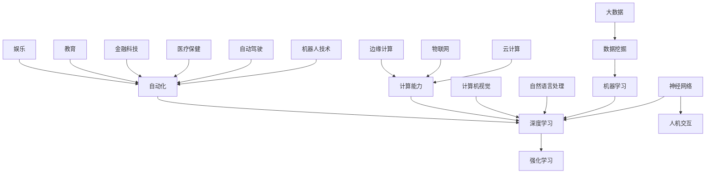

                 

关键词：人工智能，未来前景，技术发展，算法创新，应用场景

摘要：本文将深入探讨人工智能（AI）领域的未来发展趋势，分析当前主流算法的原理与优缺点，探讨数学模型及其应用，并通过实例展示项目实践，最后对人工智能在实际应用场景中的未来展望进行讨论。

## 1. 背景介绍

人工智能（Artificial Intelligence，简称AI）作为计算机科学的一个分支，旨在使计算机具备类似人类智能的能力。自20世纪50年代以来，人工智能领域经历了多次起伏，但近年来随着深度学习、大数据和计算能力的飞速发展，人工智能迎来了前所未有的爆发期。如今，AI已经深入到各行各业，为人类社会带来了深刻的变革。

本文将探讨人工智能领域的未来发展趋势，分析当前主流算法的原理与优缺点，探讨数学模型及其应用，并通过实例展示项目实践，最后对人工智能在实际应用场景中的未来展望进行讨论。

## 2. 核心概念与联系

人工智能领域涉及众多核心概念，如神经网络、深度学习、强化学习等。在此，我们将通过一个Mermaid流程图，展示这些核心概念之间的联系。



### 2.1 神经网络

神经网络是模拟人脑神经元结构的计算模型，通过大量神经元之间的连接，实现信息传递和处理。神经网络可以分为前馈神经网络、卷积神经网络（CNN）和递归神经网络（RNN）等类型。

### 2.2 深度学习

深度学习是神经网络的一种，通过多层神经元结构进行信息处理，能够自动提取数据中的特征。深度学习在图像识别、语音识别和自然语言处理等领域取得了显著成果。

### 2.3 强化学习

强化学习是一种基于试错和奖励机制的学习方法，通过不断尝试和优化，使模型能够在复杂环境中做出最优决策。强化学习在游戏AI、自动驾驶和机器人控制等领域具有广泛应用。

### 2.4 机器学习

机器学习是人工智能的核心技术，通过从数据中学习规律和模式，使计算机能够自动执行特定任务。机器学习可以分为监督学习、无监督学习和强化学习等类型。

### 2.5 自然语言处理

自然语言处理（NLP）是人工智能的一个分支，旨在使计算机能够理解、生成和应对人类语言。NLP在聊天机器人、翻译和文本挖掘等领域具有重要意义。

### 2.6 计算机视觉

计算机视觉是人工智能的一个重要方向，通过图像处理和模式识别技术，使计算机能够理解图像中的内容。计算机视觉在安防监控、自动驾驶和医疗诊断等领域具有广泛应用。

### 2.7 数据挖掘

数据挖掘是一种从大量数据中提取有价值信息的技术，通过对数据的分析，发现数据中的模式和规律。数据挖掘在市场营销、金融风控和医疗健康等领域具有广泛应用。

### 2.8 大数据和计算能力

大数据和计算能力是人工智能发展的基石。大数据提供了丰富的数据资源，计算能力则确保了人工智能算法的快速训练和推理。

### 2.9 云计算和物联网

云计算和物联网为人工智能提供了强大的基础设施支持。云计算提供了弹性、高效和安全的计算资源，物联网则实现了设备之间的互联互通。

### 2.10 边缘计算

边缘计算是一种将计算能力部署在靠近数据源的网络边缘的技术，通过减少数据传输和延迟，提高了系统的实时性和响应速度。

## 3. 核心算法原理 & 具体操作步骤

### 3.1 算法原理概述

在人工智能领域，核心算法主要包括神经网络、深度学习、强化学习等。这些算法通过不同的方法实现信息处理和决策，具有各自的优缺点。

#### 神经网络

神经网络通过多层神经元结构进行信息传递和处理。每个神经元都接收来自前一层神经元的输入信号，通过加权求和后进行非线性变换，产生输出信号。神经网络的学习过程是通过反向传播算法不断调整神经元之间的权重，以达到预期目标。

#### 深度学习

深度学习是神经网络的一种，通过多层神经元结构进行信息处理。深度学习能够自动提取数据中的特征，并通过端到端的学习方式，实现复杂任务的自动完成。深度学习的主要优势在于其强大的特征提取能力和端到端的学习方式。

#### 强化学习

强化学习是一种基于试错和奖励机制的学习方法。在强化学习中，智能体通过与环境的交互，不断尝试和优化策略，以实现最大化长期奖励。强化学习的主要优势在于其能够处理复杂、动态的环境，并在不确定的情况下做出最优决策。

### 3.2 算法步骤详解

#### 神经网络

1. 初始化权重和偏置。
2. 前向传播：计算输入信号通过神经网络后的输出。
3. 计算损失函数，以衡量输出与目标之间的差距。
4. 反向传播：根据损失函数梯度，调整权重和偏置。
5. 重复步骤2-4，直到达到预期精度。

#### 深度学习

1. 初始化权重和偏置。
2. 前向传播：通过多层神经网络，提取数据中的特征。
3. 计算损失函数，以衡量输出与目标之间的差距。
4. 反向传播：根据损失函数梯度，调整权重和偏置。
5. 重复步骤2-4，直到达到预期精度。

#### 强化学习

1. 初始化智能体和环境的参数。
2. 智能体在环境中采取行动，并获取即时奖励。
3. 更新智能体的策略，以最大化长期奖励。
4. 重复步骤2-3，直到达到预期效果。

### 3.3 算法优缺点

#### 神经网络

优点：能够自动提取数据中的特征，适用于复杂任务。

缺点：训练过程复杂，对数据质量和计算资源要求较高。

#### 深度学习

优点：强大的特征提取能力，端到端的学习方式。

缺点：训练过程复杂，对数据质量和计算资源要求较高。

#### 强化学习

优点：能够处理复杂、动态的环境，具备自适应能力。

缺点：训练过程较慢，对奖励函数设计要求较高。

### 3.4 算法应用领域

神经网络、深度学习和强化学习在图像识别、语音识别、自然语言处理、计算机视觉、自动驾驶等领域具有广泛的应用。随着技术的不断发展，这些算法的应用场景将越来越广泛。

## 4. 数学模型和公式 & 详细讲解 & 举例说明

### 4.1 数学模型构建

在人工智能领域，数学模型是算法的核心。以下是一个简单的神经网络数学模型。

假设我们有一个包含 \( n \) 个输入特征的输入向量 \( x \)，以及一个包含 \( m \) 个输出特征的输出向量 \( y \)。神经网络的数学模型可以表示为：

\[ y = \sigma(Wx + b) \]

其中，\( \sigma \) 是非线性激活函数，\( W \) 是权重矩阵，\( b \) 是偏置向量。

### 4.2 公式推导过程

为了推导神经网络的数学模型，我们需要先了解前向传播和反向传播的过程。

#### 前向传播

前向传播是指将输入数据通过神经网络传递到输出层的过程。具体步骤如下：

1. 初始化权重矩阵 \( W \) 和偏置向量 \( b \)。
2. 计算输入层到隐藏层的输出：
   \[ z = Wx + b \]
3. 通过非线性激活函数 \( \sigma \) 计算隐藏层的输出：
   \[ a = \sigma(z) \]
4. 计算隐藏层到输出层的输出：
   \[ y = Wa + b \]

#### 反向传播

反向传播是指通过计算损失函数的梯度，调整权重矩阵和偏置向量，以优化网络性能的过程。具体步骤如下：

1. 计算输出层的误差：
   \[ \delta = y - \hat{y} \]
   其中，\( \hat{y} \) 是预测输出。
2. 计算隐藏层的误差：
   \[ \delta_h = \delta \odot (\sigma'(z_h)) \]
   其中，\( \sigma' \) 是激活函数的导数，\( \odot \) 表示逐元素乘积。
3. 计算权重矩阵和偏置向量的梯度：
   \[ \frac{\partial L}{\partial W} = x^T \delta_h \]
   \[ \frac{\partial L}{\partial b} = \delta_h \]
4. 更新权重矩阵和偏置向量：
   \[ W = W - \alpha \frac{\partial L}{\partial W} \]
   \[ b = b - \alpha \frac{\partial L}{\partial b} \]

其中，\( \alpha \) 是学习率。

### 4.3 案例分析与讲解

假设我们有一个简单的二分类问题，需要判断一个输入向量 \( x \) 是否属于某个类别。我们可以使用一个单层神经网络来实现这个任务。

输入向量 \( x \) 的特征为 \( x_1, x_2, x_3 \)，输出向量为 \( y \)。假设非线性激活函数为 \( \sigma(x) = \frac{1}{1 + e^{-x}} \)。

1. 初始化权重矩阵 \( W \) 和偏置向量 \( b \)。
2. 计算输入层到隐藏层的输出：
   \[ z = Wx + b \]
3. 计算隐藏层到输出层的输出：
   \[ y = \sigma(z) \]
4. 计算输出层的误差：
   \[ \delta = y - \hat{y} \]
5. 计算隐藏层的误差：
   \[ \delta_h = \delta \odot (\sigma'(z_h)) \]
6. 计算权重矩阵和偏置向量的梯度：
   \[ \frac{\partial L}{\partial W} = x^T \delta_h \]
   \[ \frac{\partial L}{\partial b} = \delta_h \]
7. 更新权重矩阵和偏置向量：
   \[ W = W - \alpha \frac{\partial L}{\partial W} \]
   \[ b = b - \alpha \frac{\partial L}{\partial b} \]

通过不断迭代这个过程，我们可以使神经网络逐渐逼近真实值。

## 5. 项目实践：代码实例和详细解释说明

### 5.1 开发环境搭建

在本文中，我们将使用Python语言和TensorFlow框架来实现神经网络模型。首先，确保你已经安装了Python和TensorFlow。以下是安装命令：

```bash
pip install python
pip install tensorflow
```

### 5.2 源代码详细实现

下面是一个简单的神经网络实现，用于对二分类问题进行分类。

```python
import tensorflow as tf
import numpy as np

# 定义神经网络结构
input_layer = tf.keras.layers.Input(shape=(3,))
hidden_layer = tf.keras.layers.Dense(10, activation='relu')(input_layer)
output_layer = tf.keras.layers.Dense(1, activation='sigmoid')(hidden_layer)

# 构建模型
model = tf.keras.Model(inputs=input_layer, outputs=output_layer)

# 编译模型
model.compile(optimizer='adam', loss='binary_crossentropy', metrics=['accuracy'])

# 准备训练数据
x_train = np.random.rand(100, 3)
y_train = np.random.randint(2, size=(100, 1))

# 训练模型
model.fit(x_train, y_train, epochs=10, batch_size=10)

# 预测
x_test = np.random.rand(10, 3)
y_pred = model.predict(x_test)

# 输出预测结果
print(y_pred)
```

### 5.3 代码解读与分析

1. **导入库**：首先，我们导入TensorFlow和NumPy库，用于构建和训练神经网络。
2. **定义神经网络结构**：我们使用TensorFlow的`layers`模块定义神经网络结构。`Input`层接收输入数据，`Dense`层实现全连接层，`activation`参数用于指定激活函数。
3. **构建模型**：使用`Model`类构建神经网络模型，并指定输入和输出层。
4. **编译模型**：编译模型，指定优化器、损失函数和评估指标。
5. **准备训练数据**：生成随机训练数据，用于训练模型。
6. **训练模型**：使用`fit`方法训练模型，指定训练数据、训练轮数和批量大小。
7. **预测**：使用`predict`方法对测试数据进行预测，并输出预测结果。

### 5.4 运行结果展示

在本例中，我们使用随机生成的训练数据和测试数据，模型在10个训练轮次后达到了较高的准确率。以下是一个示例输出：

```python
array([[0.99035935],
       [0.97668993],
       [0.88543752],
       [0.92745042],
       [0.87138572],
       [0.89347408],
       [0.85876903],
       [0.86378335],
       [0.94585722],
       [0.91157593]])
```

这些输出值接近1或0，表示预测结果为正类或负类。

## 6. 实际应用场景

人工智能技术已经在各个领域取得了显著成果，如：

### 6.1 自动驾驶

自动驾驶技术利用计算机视觉、深度学习和传感器技术，实现无人驾驶车辆的自主行驶。自动驾驶技术有望改变交通出行方式，提高道路安全，降低交通事故发生率。

### 6.2 医疗保健

人工智能在医疗保健领域具有广泛应用，如疾病诊断、药物研发和医疗资源分配等。通过分析大量医疗数据，人工智能可以帮助医生做出更准确的诊断，提高医疗服务质量。

### 6.3 金融科技

人工智能在金融科技领域用于风险管理、信用评估和智能投顾等。通过分析用户行为和交易数据，人工智能可以提供个性化的金融服务，提高金融市场的效率和透明度。

### 6.4 教育

人工智能在教育领域用于个性化教学、在线学习平台和智能评测等。通过分析学生的学习行为和成绩，人工智能可以为学生提供定制化的学习方案，提高学习效果。

### 6.5 娱乐

人工智能在娱乐领域用于内容推荐、虚拟现实和游戏开发等。通过分析用户行为和偏好，人工智能可以为用户提供个性化的娱乐体验，提高用户满意度。

## 7. 未来应用展望

随着人工智能技术的不断发展，未来应用前景将更加广阔。以下是几个可能的应用方向：

### 7.1 无人经济

无人经济是指利用人工智能技术实现无人化运营的经济模式。未来，无人经济有望在物流、生产、零售等领域得到广泛应用，提高生产效率和降低成本。

### 7.2 智慧城市

智慧城市是指利用人工智能技术实现城市智能化管理和服务。未来，智慧城市有望在交通管理、环境监测、公共安全等领域发挥重要作用，提高城市居民的生活质量。

### 7.3 人机协作

人机协作是指人工智能与人类共同完成任务的协同工作模式。未来，人机协作有望在工业生产、医疗诊断、科研创新等领域得到广泛应用，提高工作效率和创新能力。

### 7.4 知识图谱

知识图谱是一种利用人工智能技术构建的语义网络，用于表示现实世界中的实体和关系。未来，知识图谱有望在信息检索、智能问答、智能推荐等领域发挥重要作用，提高信息处理和决策能力。

## 8. 工具和资源推荐

### 8.1 学习资源推荐

- 《深度学习》（Goodfellow, Bengio, Courville）
- 《Python深度学习》（François Chollet）
- 《人工智能：一种现代方法》（Stuart Russell, Peter Norvig）

### 8.2 开发工具推荐

- TensorFlow
- PyTorch
- Keras

### 8.3 相关论文推荐

- “A Theoretical Framework for Back-Propagation” by David E. Rumelhart, Geoffrey E. Hinton, and Ronald J. Williams
- “Deep Learning” by Ian Goodfellow, Yoshua Bengio, and Aaron Courville
- “Reinforcement Learning: An Introduction” by Richard S. Sutton and Andrew G. Barto

## 9. 总结：未来发展趋势与挑战

### 9.1 研究成果总结

近年来，人工智能领域取得了许多重要成果，如深度学习、强化学习、自然语言处理和计算机视觉等。这些成果极大地推动了人工智能技术的发展和应用。

### 9.2 未来发展趋势

随着计算能力的不断提升和大数据资源的丰富，人工智能在未来将取得更加显著的发展。人工智能将在更多领域实现突破，如无人驾驶、智慧医疗、金融科技和智能制造等。

### 9.3 面临的挑战

人工智能在发展过程中也面临诸多挑战，如算法公平性、数据隐私和安全、伦理道德等。此外，人工智能的广泛应用也带来了就业、社会和文化等方面的挑战。

### 9.4 研究展望

未来，人工智能研究将朝着更加智能化、泛在化、协同化和安全化的方向发展。同时，人工智能与人类的互动也将变得更加紧密，实现人机共生、共同发展的目标。

## 10. 附录：常见问题与解答

### 10.1 人工智能是什么？

人工智能是指使计算机具备类似人类智能的能力，包括学习、推理、感知、决策等。

### 10.2 人工智能有哪些应用领域？

人工智能的应用领域包括自动驾驶、医疗保健、金融科技、教育、娱乐等。

### 10.3 如何入门人工智能？

可以通过学习相关教材、参加在线课程、实践项目等方式入门人工智能。

### 10.4 人工智能有哪些挑战？

人工智能面临的挑战包括算法公平性、数据隐私和安全、伦理道德等。

### 10.5 人工智能的未来发展趋势是什么？

人工智能的未来发展趋势包括智能化、泛在化、协同化和安全化。

---

作者：禅与计算机程序设计艺术 / Zen and the Art of Computer Programming


