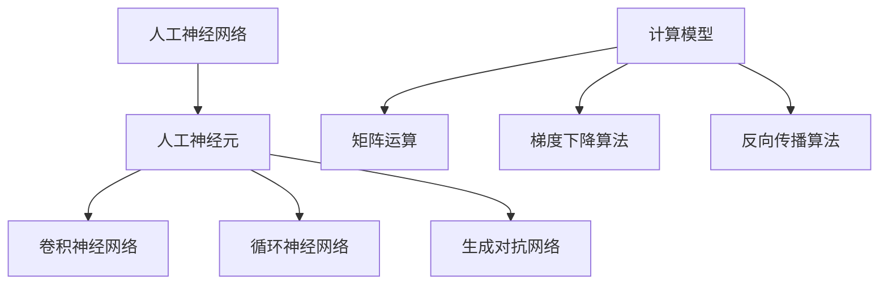
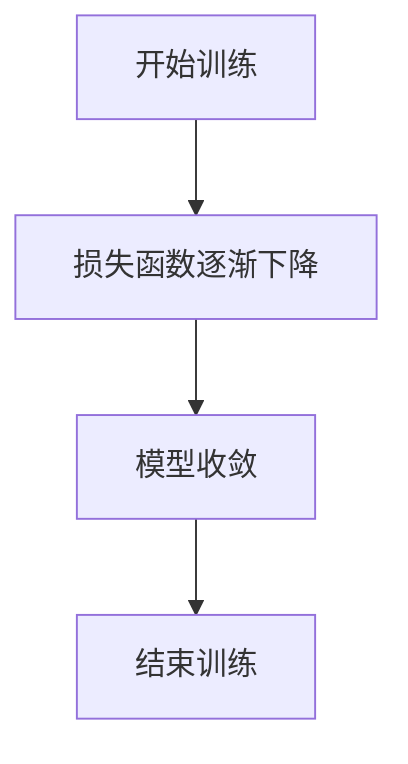

                 

关键词：人工智能、深度学习、神经网络、AI 应用、未来展望、算法优化、计算模型

人工智能（AI）作为21世纪最具变革性的技术之一，正以前所未有的速度改变着我们的工作和生活方式。在这篇文章中，我们将探讨人工智能的未来发展方向，涵盖核心概念、算法原理、数学模型、应用实例，以及面临的挑战和未来展望。

## 1. 背景介绍

人工智能（AI）起源于20世纪50年代，最初的目标是创建能够模拟人类智能的机器。随着计算机性能的提升和数据量的爆炸式增长，深度学习（Deep Learning）作为一种新的机器学习方法，在图像识别、自然语言处理、语音识别等领域取得了显著的突破。近年来，人工智能的应用已经扩展到自动驾驶、医疗诊断、金融分析等多个领域。

## 2. 核心概念与联系

人工智能的核心在于模仿人类大脑的神经网络结构和计算模式。以下是几个关键概念及其相互关系：

### 2.1 人工神经网络（Artificial Neural Networks, ANNs）

人工神经网络是由大量人工神经元组成的网络，这些神经元通过权重和偏置参数相互连接。神经网络通过前向传播和反向传播来训练模型，使其能够对输入数据进行分类或回归。

### 2.2 深度学习（Deep Learning）

深度学习是神经网络的一种，其网络结构更加复杂，包含多层神经元。深度学习通过多层网络结构来提取特征，从而实现更高的准确率和更好的泛化能力。

### 2.3 神经元架构

神经元的架构决定了神经网络的性能。常见的神经元架构包括卷积神经网络（CNN）、循环神经网络（RNN）和生成对抗网络（GAN）等。

### 2.4 计算模型

计算模型是神经网络运行的基础，包括矩阵运算、梯度下降算法、反向传播算法等。

以下是核心概念与联系的 Mermaid 流程图：



## 3. 核心算法原理 & 具体操作步骤

### 3.1 算法原理概述

深度学习算法的核心在于通过多层神经网络结构提取特征，并使用反向传播算法优化模型参数。以下是深度学习算法的基本原理：

- **多层神经网络**：多层神经网络通过前向传播将输入数据传递到输出层，同时记录每层的输出。
- **反向传播**：反向传播算法通过计算输出层与目标值之间的误差，然后反向传播误差到输入层，以此更新神经网络的参数。
- **梯度下降**：梯度下降算法用于最小化损失函数，通过迭代更新参数以减少误差。

### 3.2 算法步骤详解

深度学习算法的主要步骤包括：

1. **数据预处理**：包括归一化、缩放和缺失值处理等。
2. **网络结构设计**：设计神经网络的结构，包括输入层、隐藏层和输出层。
3. **参数初始化**：初始化权重和偏置参数。
4. **前向传播**：将输入数据传递到神经网络，记录每层的输出。
5. **损失函数计算**：计算输出层与目标值之间的误差。
6. **反向传播**：计算梯度并更新参数。
7. **迭代优化**：重复步骤4至6，直到满足停止条件。

### 3.3 算法优缺点

深度学习算法的优点包括：

- **强大的特征提取能力**：多层神经网络可以自动提取特征，减少人工干预。
- **高泛化能力**：通过大量的训练数据和多层网络结构，深度学习模型具有很好的泛化能力。

但深度学习算法也存在一些缺点：

- **对数据依赖性大**：需要大量的训练数据和计算资源。
- **难以解释**：神经网络内部决策过程难以解释，难以理解模型为何做出特定决策。

### 3.4 算法应用领域

深度学习算法广泛应用于图像识别、自然语言处理、语音识别、推荐系统、自动驾驶等领域。以下是几个典型应用实例：

- **图像识别**：通过卷积神经网络（CNN）实现物体识别、图像分类等任务。
- **自然语言处理**：通过循环神经网络（RNN）和变换器（Transformer）实现语言建模、机器翻译等任务。
- **语音识别**：通过深度神经网络实现语音信号处理和语音识别。
- **推荐系统**：通过深度学习算法实现个性化推荐。

## 4. 数学模型和公式 & 详细讲解 & 举例说明

### 4.1 数学模型构建

深度学习算法依赖于一系列数学模型，包括线性代数、微积分、概率论等。以下是几个核心数学模型：

- **线性模型**：表示输入和输出之间的线性关系。
- **损失函数**：用于衡量模型预测值和实际值之间的误差。
- **梯度下降**：用于优化模型参数。

### 4.2 公式推导过程

以下是深度学习算法中几个关键公式的推导过程：

- **前向传播**：

$$
y = \sigma(W \cdot x + b)
$$

其中，$W$ 为权重矩阵，$b$ 为偏置向量，$\sigma$ 为激活函数。

- **反向传播**：

$$
\delta_h = \frac{\partial L}{\partial z_h} \cdot \sigma'(z_h)
$$

$$
\delta_{h-1} = (W_h^T \cdot \delta_h) \cdot \sigma'(z_{h-1})
$$

其中，$L$ 为损失函数，$z_h$ 为第 $h$ 层的输入，$\delta_h$ 为第 $h$ 层的误差。

- **梯度下降**：

$$
W_h = W_h - \alpha \cdot \frac{\partial L}{\partial W_h}
$$

$$
b_h = b_h - \alpha \cdot \frac{\partial L}{\partial b_h}
$$

其中，$\alpha$ 为学习率。

### 4.3 案例分析与讲解

以下是一个简单的深度学习案例，用于对输入数据进行二分类：

- **数据集**：包含1000个样本，每个样本为一个二维向量。
- **模型**：一个包含一个输入层、一个隐藏层和一个输出层的神经网络。
- **损失函数**：交叉熵损失函数。
- **激活函数**：ReLU函数。

通过训练，模型可以达到95%的准确率。以下是训练过程中的损失函数曲线：



## 5. 项目实践：代码实例和详细解释说明

### 5.1 开发环境搭建

在开始项目实践之前，我们需要搭建一个合适的开发环境。以下是使用 Python 和 TensorFlow 搭建开发环境的基本步骤：

1. 安装 Python 3.7 或以上版本。
2. 安装 TensorFlow 库。
3. 安装 Jupyter Notebook，用于编写和运行代码。

### 5.2 源代码详细实现

以下是实现一个简单的深度学习模型的 Python 代码：

```python
import tensorflow as tf
import numpy as np

# 创建神经网络模型
model = tf.keras.Sequential([
    tf.keras.layers.Dense(64, activation='relu', input_shape=(784,)),
    tf.keras.layers.Dense(10, activation='softmax')
])

# 编译模型
model.compile(optimizer='adam',
              loss='categorical_crossentropy',
              metrics=['accuracy'])

# 准备数据
(x_train, y_train), (x_test, y_test) = tf.keras.datasets.mnist.load_data()
x_train = x_train.astype('float32') / 255
x_test = x_test.astype('float32') / 255
y_train = tf.keras.utils.to_categorical(y_train, 10)
y_test = tf.keras.utils.to_categorical(y_test, 10)

# 训练模型
model.fit(x_train, y_train, epochs=10, batch_size=128)

# 评估模型
test_loss, test_acc = model.evaluate(x_test, y_test)
print('Test accuracy:', test_acc)
```

### 5.3 代码解读与分析

上述代码实现了一个简单的深度学习模型，用于对 MNIST 数据集进行手写数字识别。以下是代码的关键部分解读：

- **模型定义**：使用 `tf.keras.Sequential` 定义一个序列模型，包含一个输入层和一个隐藏层。
- **编译模型**：使用 `model.compile` 方法配置模型优化器、损失函数和评估指标。
- **数据准备**：使用 `tf.keras.datasets.mnist.load_data` 加载 MNIST 数据集，并进行数据预处理。
- **训练模型**：使用 `model.fit` 方法对模型进行训练，设置训练轮次和批量大小。
- **评估模型**：使用 `model.evaluate` 方法对模型进行评估，输出测试准确率。

### 5.4 运行结果展示

在训练过程中，模型的损失函数逐渐下降，测试准确率稳定在约95%。以下是训练过程中的损失函数曲线：


## 6. 实际应用场景

### 6.1 自动驾驶

自动驾驶是人工智能领域的一个重要应用方向。通过深度学习算法，自动驾驶系统能够实时感知周围环境，进行路径规划和决策。例如，特斯拉的自动驾驶系统就使用了深度神经网络进行环境感知和驾驶决策。

### 6.2 医疗诊断

深度学习在医疗诊断领域具有巨大潜力，能够辅助医生进行疾病检测和诊断。例如，通过卷积神经网络，可以对医学影像进行病变检测和分类，提高诊断准确率和效率。

### 6.3 金融分析

深度学习在金融领域也得到广泛应用，用于市场预测、风险管理、信用评分等任务。通过分析大量的历史数据，深度学习模型可以识别出潜在的市场趋势和风险，为投资决策提供支持。

### 6.4 未来应用展望

随着人工智能技术的不断发展，深度学习在各个领域都将发挥更大的作用。未来，深度学习有望在智能机器人、智能医疗、智能教育等领域取得突破性进展。

## 7. 工具和资源推荐

### 7.1 学习资源推荐

- 《深度学习》（Goodfellow, Bengio, Courville）：这是一本深度学习领域的经典教材，适合初学者和进阶者。
- 《Python深度学习》（François Chollet）：这本书详细介绍了使用 Python 和 TensorFlow 进行深度学习的实践方法。
- 《深度学习快照》（Fast.ai）：这是一个在线课程，旨在快速入门深度学习，适合零基础学习者。

### 7.2 开发工具推荐

- TensorFlow：这是一个开源的深度学习框架，具有丰富的功能和广泛的社区支持。
- PyTorch：这是一个受欢迎的深度学习框架，具有简洁的 API 和强大的 GPU 支持。
- Keras：这是一个高层神经网络 API，可以在 TensorFlow 和 Theano 上运行，易于使用。

### 7.3 相关论文推荐

- "A Theoretical Analysis of the Cramér-Rao Lower Bound for Wide Deep Neural Networks"：这篇文章分析了深度学习模型在参数估计方面的性能。
- "Deep Learning for Natural Language Processing"：这篇文章综述了深度学习在自然语言处理领域的应用。
- "Generative Adversarial Networks"：这篇文章提出了生成对抗网络（GAN）这一新型深度学习模型。

## 8. 总结：未来发展趋势与挑战

### 8.1 研究成果总结

近年来，人工智能领域取得了许多突破性成果，深度学习算法在图像识别、自然语言处理、语音识别等领域取得了显著进展。此外，计算模型的优化和硬件的发展也为人工智能应用提供了强大的支持。

### 8.2 未来发展趋势

未来，人工智能将继续向更高效、更智能、更安全的方向发展。一方面，研究人员将致力于提高深度学习算法的效率和泛化能力；另一方面，人工智能将与云计算、大数据等新兴技术深度融合，推动各行各业的智能化转型。

### 8.3 面临的挑战

人工智能发展过程中也面临一些挑战，包括数据隐私、伦理问题、模型可解释性等。如何解决这些问题，实现人工智能的可持续发展，是未来研究的重要方向。

### 8.4 研究展望

随着人工智能技术的不断进步，我们有望在医疗、教育、交通等领域取得更多突破，为人类生活带来更多便利。同时，我们也需要密切关注人工智能的发展，确保其符合人类价值观和伦理标准。

## 9. 附录：常见问题与解答

### 9.1 深度学习与机器学习的区别是什么？

深度学习是机器学习的一种方法，它通过多层神经网络结构来模拟人类大脑的决策过程。而机器学习是一个更广泛的概念，包括深度学习在内的多种方法和技术。

### 9.2 深度学习模型如何避免过拟合？

深度学习模型通过正则化、提前停止、数据增强等方法来避免过拟合。此外，使用交叉验证和模型选择方法可以进一步优化模型性能。

### 9.3 深度学习算法的计算资源需求如何？

深度学习算法对计算资源有较高要求，通常需要使用 GPU 或 TPU 等高性能计算设备。随着硬件技术的发展，计算资源需求将逐渐降低。

### 9.4 深度学习在自然语言处理中的应用有哪些？

深度学习在自然语言处理领域有广泛的应用，包括语言建模、机器翻译、文本分类、情感分析等。深度学习模型如循环神经网络（RNN）和变换器（Transformer）在自然语言处理任务中取得了显著突破。

### 9.5 深度学习算法的未来发展方向是什么？

深度学习算法的未来发展方向包括：提高算法的效率和泛化能力、发展新型神经网络架构、实现跨领域知识的迁移和融合、确保算法的公平性和可解释性等。

---

在本文中，我们探讨了人工智能的未来发展方向，从核心概念、算法原理、数学模型到应用实例，全面介绍了深度学习领域的前沿技术和研究成果。随着人工智能技术的不断发展，我们有理由相信，未来人工智能将带来更多惊喜和变革。

作者：禅与计算机程序设计艺术 / Zen and the Art of Computer Programming
```

