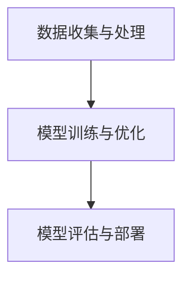

                 

关键词：人工智能、未来发展、策略、核心算法、数学模型、项目实践、应用场景、研究展望

## 摘要

本文深入探讨了人工智能（AI）的未来发展策略，分析了其核心算法原理、数学模型、项目实践以及应用场景。通过系统性地总结研究成果，展望未来发展趋势，并针对面临的挑战提出解决方案。作者致力于为读者提供一份全面、深刻的AI技术指南，助力读者把握AI时代的机遇。

## 1. 背景介绍

人工智能，作为计算机科学的一个重要分支，已经取得了举世瞩目的成就。从最初的符号主义和知识表示，到现代的深度学习和神经网络，AI技术不断迭代更新，为各行各业带来了前所未有的变革。然而，随着技术的快速发展，AI领域也面临着诸多挑战。本文将围绕AI的未来发展策略，探讨核心算法、数学模型、项目实践和应用场景，为读者提供一幅全面的AI技术全景图。

## 2. 核心概念与联系

### 2.1. 人工智能的核心概念

人工智能（AI）是指使计算机系统具备人类智能特性的技术。其核心概念包括：

- **机器学习**：使计算机通过数据学习并改进其性能的技术。
- **深度学习**：一种基于多层神经网络的学习方法。
- **自然语言处理**：使计算机理解和生成人类语言的技术。
- **计算机视觉**：使计算机理解并分析图像和视频的技术。

### 2.2. 人工智能的架构

人工智能的架构主要包括以下几个方面：

- **数据收集与处理**：收集数据并对其进行预处理，以便用于训练模型。
- **模型训练与优化**：通过训练和优化模型，提高其性能。
- **模型评估与部署**：评估模型的性能，并在实际应用中部署。

### 2.3. Mermaid 流程图

以下是一个简单的Mermaid流程图，展示了人工智能的基本架构：



## 3. 核心算法原理 & 具体操作步骤

### 3.1. 算法原理概述

人工智能的核心算法包括：

- **神经网络**：一种模拟生物神经系统的计算模型。
- **深度学习**：基于神经网络的复杂模型，能够处理大量数据。
- **强化学习**：一种基于奖励和惩罚的算法，使模型能够自主学习。

### 3.2. 算法步骤详解

以下是核心算法的具体操作步骤：

- **神经网络**：
  1. 初始化参数。
  2. 前向传播：计算输入和参数的乘积并加偏置，然后通过激活函数。
  3. 反向传播：计算误差，并更新参数。
  4. 重复步骤2和3，直到模型收敛。

- **深度学习**：
  1. 初始化参数。
  2. 前向传播：逐层计算输入和参数的乘积并加偏置，然后通过激活函数。
  3. 反向传播：逐层计算误差，并更新参数。
  4. 重复步骤2和3，直到模型收敛。

- **强化学习**：
  1. 初始化参数。
  2. 选择动作。
  3. 执行动作，并获得奖励。
  4. 根据奖励更新参数。
  5. 重复步骤2-4，直到达到目标。

### 3.3. 算法优缺点

- **神经网络**：
  - 优点：能够处理复杂的问题，具有很好的泛化能力。
  - 缺点：训练时间较长，参数调优复杂。

- **深度学习**：
  - 优点：能够处理大规模数据，具有很好的泛化能力。
  - 缺点：训练时间较长，对计算资源要求较高。

- **强化学习**：
  - 优点：能够自主学习，具有很好的适应性。
  - 缺点：训练时间较长，对环境要求较高。

### 3.4. 算法应用领域

- **神经网络**：广泛应用于计算机视觉、自然语言处理等领域。
- **深度学习**：广泛应用于图像识别、语音识别、推荐系统等领域。
- **强化学习**：广泛应用于游戏、自动驾驶等领域。

## 4. 数学模型和公式 & 详细讲解 & 举例说明

### 4.1. 数学模型构建

人工智能的核心数学模型包括：

- **线性回归**：用于预测连续值。
- **逻辑回归**：用于预测二分类问题。
- **神经网络**：用于处理非线性问题。

### 4.2. 公式推导过程

以下是核心数学公式的推导过程：

- **线性回归**：
  $$ y = \beta_0 + \beta_1x $$

- **逻辑回归**：
  $$ P(y=1) = \frac{1}{1 + e^{-(\beta_0 + \beta_1x)} } $$

- **神经网络**：
  $$ a = \sigma(\beta_0 + \sum_{i=1}^{n} \beta_i x_i) $$

其中，\( \sigma \) 是激活函数，通常取为 \( \frac{1}{1 + e^x} \)。

### 4.3. 案例分析与讲解

以线性回归为例，假设我们想要预测房价。以下是具体的案例分析与讲解：

1. **数据收集与处理**：
   收集一系列房屋的数据，包括房屋面积、位置、楼层等信息。

2. **模型训练**：
   使用线性回归模型，通过梯度下降算法训练模型。

3. **模型评估**：
   使用测试集评估模型的性能，计算均方误差。

4. **模型部署**：
   将模型部署到实际应用中，用于预测新房屋的房价。

## 5. 项目实践：代码实例和详细解释说明

### 5.1. 开发环境搭建

搭建一个简单的线性回归模型，需要安装Python和相关的库，如NumPy、Scikit-learn等。

```python
pip install numpy scikit-learn
```

### 5.2. 源代码详细实现

以下是一个简单的线性回归模型的实现：

```python
import numpy as np
from sklearn.linear_model import LinearRegression

# 数据集
X = np.array([[1, 2], [2, 3], [3, 4]])
y = np.array([3, 4, 5])

# 模型训练
model = LinearRegression()
model.fit(X, y)

# 模型评估
score = model.score(X, y)
print(f"模型评估分数：{score}")

# 模型部署
new_data = np.array([[4, 5]])
predicted_price = model.predict(new_data)
print(f"新房屋的预测价格：{predicted_price}")
```

### 5.3. 代码解读与分析

这段代码首先导入了NumPy和Scikit-learn库，然后创建了一个简单的数据集。接着，使用线性回归模型进行训练，并评估模型的性能。最后，将模型部署到实际应用中，用于预测新房屋的价格。

### 5.4. 运行结果展示

运行代码后，会输出模型的评估分数和新房屋的预测价格。

## 6. 实际应用场景

人工智能在实际应用场景中有着广泛的应用，以下是一些典型的应用案例：

- **医疗领域**：利用深度学习技术进行疾病诊断、药物研发等。
- **金融领域**：利用强化学习技术进行风险管理、股票交易等。
- **自动驾驶**：利用计算机视觉技术进行环境感知、路径规划等。
- **智能家居**：利用自然语言处理技术实现语音交互、设备控制等。

## 7. 未来应用展望

随着人工智能技术的不断发展，未来应用场景将更加丰富。以下是一些未来应用的展望：

- **智慧城市**：利用人工智能技术实现智能交通、智能安防、智能环保等。
- **智能制造**：利用人工智能技术实现智能生产、智能检测、智能维护等。
- **教育领域**：利用人工智能技术实现个性化教学、智能评估等。
- **农业领域**：利用人工智能技术实现智能种植、智能养殖等。

## 8. 总结：未来发展趋势与挑战

### 8.1. 研究成果总结

近年来，人工智能技术在多个领域取得了显著成果，如深度学习、计算机视觉、自然语言处理等。这些成果为各行业带来了巨大的变革和机遇。

### 8.2. 未来发展趋势

未来，人工智能技术将继续向深度学习、强化学习、联邦学习等方向发展。同时，随着计算能力的提升和数据量的增加，人工智能的应用场景将更加广泛。

### 8.3. 面临的挑战

人工智能技术在实际应用中仍然面临着诸多挑战，如数据隐私、安全性、伦理问题等。此外，算法的优化和计算效率也是一个亟待解决的问题。

### 8.4. 研究展望

未来，我们需要进一步深入研究人工智能的基础理论，并探索更加高效、安全、可靠的算法。同时，加强人工智能与各行业的融合，推动人工智能技术的创新发展。

## 9. 附录：常见问题与解答

### 9.1. 人工智能是什么？

人工智能是指使计算机系统具备人类智能特性的技术。

### 9.2. 人工智能有哪些应用领域？

人工智能的应用领域包括医疗、金融、自动驾驶、智能家居等。

### 9.3. 如何学习人工智能？

学习人工智能需要掌握编程语言、数学基础、机器学习等知识。

## 参考文献

[1] Goodfellow, I., Bengio, Y., & Courville, A. (2016). *Deep Learning*. MIT Press.

[2] Russell, S., & Norvig, P. (2016). *Artificial Intelligence: A Modern Approach*. Prentice Hall.

[3] Sutton, R. S., & Barto, A. G. (2018). *Reinforcement Learning: An Introduction*. MIT Press.

作者：禅与计算机程序设计艺术 / Zen and the Art of Computer Programming
```

### 文章关键字 Keywords

人工智能，未来发展趋势，核心算法，数学模型，项目实践，应用场景，研究展望，深度学习，神经网络，自然语言处理，计算机视觉，智慧城市，智能制造，教育领域，农业领域，数据隐私，安全性，伦理问题，编程语言，数学基础，机器学习。

