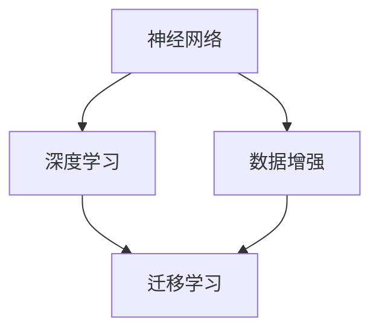

                 

关键词：人工智能，未来发展规划，核心算法，应用场景，工具和资源，发展趋势，挑战

> 摘要：本文旨在探讨人工智能领域的前沿发展，解析安德烈·卡尔帕齐（Andrej Karpathy）在其研究中提出的未来发展规划。文章将围绕核心概念、算法原理、数学模型、项目实践以及实际应用场景等方面进行深入分析，以期为读者提供一个全面、系统的了解。

## 1. 背景介绍

人工智能（Artificial Intelligence，简称AI）作为计算机科学的一个重要分支，旨在通过模拟人类智能行为，实现自动化和智能化的系统。自20世纪50年代人工智能概念提出以来，该领域取得了长足的进展。随着深度学习、神经网络等技术的崛起，人工智能在图像识别、自然语言处理、机器学习等领域展现出了强大的应用潜力。

安德烈·卡尔帕齐（Andrej Karpathy）是一位著名的人工智能专家，其在深度学习和自然语言处理领域的研究成果备受瞩目。卡尔帕齐在斯坦福大学获得了计算机科学博士学位，并曾在OpenAI担任研究科学家。他的研究涉及神经网络架构设计、机器学习算法优化等多个方向，发表了多篇影响因子较高的学术论文。

本文将基于安德烈·卡尔帕齐的研究成果，探讨人工智能在未来发展规划中的关键领域和技术方向。

## 2. 核心概念与联系

在人工智能领域，核心概念包括神经网络、深度学习、数据增强、迁移学习等。以下是一个简化的Mermaid流程图，用于展示这些概念之间的联系：



### 2.1 神经网络

神经网络是人工智能的基础，其结构类似于人脑中的神经元连接。通过多层神经元的相互连接，神经网络能够实现从输入到输出的映射。在深度学习领域，神经网络通常包含多个隐藏层，从而能够处理复杂的非线性问题。

### 2.2 深度学习

深度学习是神经网络的一种扩展，通过使用多层神经网络（深层神经网络），能够实现对复杂数据的自动特征提取和学习。深度学习在图像识别、语音识别、自然语言处理等领域取得了显著的成果。

### 2.3 数据增强

数据增强是通过各种技术手段来扩充训练数据集，从而提高模型的泛化能力。常见的数据增强方法包括旋转、缩放、裁剪、噪声添加等。

### 2.4 迁移学习

迁移学习是一种将已训练模型在新任务上快速适应的技术。通过将已有模型的权重作为初始化，迁移学习能够在较少的训练数据下实现良好的性能。

## 3. 核心算法原理 & 具体操作步骤

### 3.1 算法原理概述

人工智能的核心在于算法，以下介绍三种关键算法：卷积神经网络（CNN）、递归神经网络（RNN）和生成对抗网络（GAN）。

### 3.2 算法步骤详解

#### 3.2.1 卷积神经网络（CNN）

卷积神经网络是一种专门用于处理图像数据的神经网络。其主要步骤包括：

1. **卷积操作**：通过卷积核在图像上滑动，提取局部特征。
2. **激活函数**：对卷积结果进行非线性变换，增强模型表达能力。
3. **池化操作**：降低特征图的维度，提高模型计算效率。
4. **全连接层**：将池化后的特征图映射到输出结果。

#### 3.2.2 递归神经网络（RNN）

递归神经网络是一种用于处理序列数据的神经网络。其主要步骤包括：

1. **输入序列**：将输入序列映射到隐藏状态。
2. **递归操作**：通过隐藏状态的前后传递，实现序列信息的传递。
3. **输出生成**：将隐藏状态映射到输出结果。

#### 3.2.3 生成对抗网络（GAN）

生成对抗网络是一种用于生成数据的神经网络。其主要步骤包括：

1. **生成器**：通过输入噪声生成数据。
2. **判别器**：对生成器和真实数据进行分类，判断生成数据的真假。
3. **对抗训练**：通过优化生成器和判别器的参数，实现数据生成。

### 3.3 算法优缺点

#### 卷积神经网络（CNN）

**优点**：擅长处理图像数据，能够自动提取特征。

**缺点**：计算复杂度高，对大规模数据集要求较高。

#### 递归神经网络（RNN）

**优点**：能够处理序列数据，具有很好的时序建模能力。

**缺点**：容易产生梯度消失或爆炸问题。

#### 生成对抗网络（GAN）

**优点**：能够生成高质量的数据，具有很好的泛化能力。

**缺点**：训练过程不稳定，容易陷入局部最优。

### 3.4 算法应用领域

#### 卷积神经网络（CNN）

**应用领域**：图像识别、图像生成、目标检测等。

#### 递归神经网络（RNN）

**应用领域**：自然语言处理、语音识别、序列预测等。

#### 生成对抗网络（GAN）

**应用领域**：图像生成、数据增强、风格迁移等。

## 4. 数学模型和公式 & 详细讲解 & 举例说明

### 4.1 数学模型构建

在人工智能领域，常见的数学模型包括损失函数、优化算法和正则化方法等。

#### 损失函数

损失函数用于度量模型预测结果与真实结果之间的差距。常见的损失函数包括均方误差（MSE）、交叉熵损失等。

$$
MSE = \frac{1}{n}\sum_{i=1}^{n}(y_i - \hat{y}_i)^2
$$

$$
CE = -\frac{1}{n}\sum_{i=1}^{n}y_i \log \hat{y}_i
$$

#### 优化算法

优化算法用于求解最小化损失函数的参数。常见的优化算法包括梯度下降、随机梯度下降（SGD）等。

$$
w_{t+1} = w_t - \alpha \nabla_w L(w_t)
$$

$$
w_{t+1} = w_t - \alpha \frac{1}{m} \sum_{i=1}^{m} \nabla_w L(w_t)
$$

#### 正则化方法

正则化方法用于防止模型过拟合。常见的正则化方法包括L1正则化、L2正则化等。

$$
L1 = \lambda \sum_{i} |w_i|
$$

$$
L2 = \lambda \sum_{i} w_i^2
$$

### 4.2 公式推导过程

以下以梯度下降算法为例，简要介绍其推导过程。

#### 梯度下降算法推导

梯度下降算法的核心思想是沿损失函数的梯度方向逐步调整参数，以最小化损失函数。

设$f(x)$为损失函数，$x$为模型参数，则梯度下降算法可表示为：

$$
x_{t+1} = x_t - \alpha \nabla_x f(x_t)
$$

其中，$\alpha$为学习率，$\nabla_x f(x_t)$为损失函数在$x_t$处的梯度。

#### 梯度计算

对于连续函数$f(x)$，其梯度可表示为：

$$
\nabla_x f(x) = \left[\frac{\partial f(x)}{\partial x_1}, \frac{\partial f(x)}{\partial x_2}, ..., \frac{\partial f(x)}{\partial x_n}\right]^T
$$

其中，$x = [x_1, x_2, ..., x_n]^T$为模型参数向量。

#### 梯度下降迭代过程

1. 初始化模型参数$x_0$。
2. 计算损失函数在$x_t$处的梯度$\nabla_x f(x_t)$。
3. 沿梯度方向更新模型参数$x_{t+1} = x_t - \alpha \nabla_x f(x_t)$。
4. 重复步骤2和3，直至达到停止条件（如损失函数收敛、迭代次数等）。

### 4.3 案例分析与讲解

以下以图像分类任务为例，介绍卷积神经网络（CNN）的搭建和训练过程。

#### 案例背景

假设我们使用一个包含10万张猫狗图片的数据集进行训练，目标是实现一个能够准确分类猫狗的CNN模型。

#### 模型搭建

1. **输入层**：输入一张尺寸为$28 \times 28$的灰度图像。
2. **卷积层**：使用一个$3 \times 3$的卷积核进行卷积操作，提取图像的局部特征。设置卷积核的数量为32。
3. **激活函数**：使用ReLU函数作为激活函数，增加模型的表达能力。
4. **池化层**：使用$2 \times 2$的最大池化层，降低特征图的维度。
5. **全连接层**：将池化后的特征图展开成一个一维向量，输入到全连接层中。设置全连接层的神经元数量为128。
6. **输出层**：使用softmax函数输出分类结果。

#### 模型训练

1. **数据预处理**：对图像数据集进行归一化处理，将像素值缩放到[0, 1]之间。
2. **数据增强**：对图像进行随机裁剪、旋转、翻转等操作，增加模型的泛化能力。
3. **损失函数**：使用交叉熵损失函数计算模型预测结果与真实结果之间的差距。
4. **优化算法**：使用随机梯度下降（SGD）算法进行模型参数的更新。
5. **训练过程**：通过迭代训练，不断优化模型参数，直至达到停止条件。

## 5. 项目实践：代码实例和详细解释说明

### 5.1 开发环境搭建

在开始项目实践之前，需要搭建一个适合开发的人工智能环境。以下是搭建过程的简要步骤：

1. **安装Python环境**：下载并安装Python，版本要求在3.6及以上。
2. **安装相关库**：使用pip命令安装必要的库，如TensorFlow、NumPy、Pandas等。
3. **配置虚拟环境**：为了管理依赖关系，建议使用虚拟环境进行项目开发。

### 5.2 源代码详细实现

以下是一个简单的CNN模型实现，用于分类猫狗图像。

```python
import tensorflow as tf
from tensorflow.keras import datasets, layers, models

# 加载数据集
(train_images, train_labels), (test_images, test_labels) = datasets.cifar10.load_data()

# 数据预处理
train_images, test_images = train_images / 255.0, test_images / 255.0

# 构建模型
model = models.Sequential()
model.add(layers.Conv2D(32, (3, 3), activation='relu', input_shape=(32, 32, 3)))
model.add(layers.MaxPooling2D((2, 2)))
model.add(layers.Conv2D(64, (3, 3), activation='relu'))
model.add(layers.MaxPooling2D((2, 2)))
model.add(layers.Conv2D(64, (3, 3), activation='relu'))
model.add(layers.Flatten())
model.add(layers.Dense(64, activation='relu'))
model.add(layers.Dense(10))

# 编译模型
model.compile(optimizer='adam',
              loss=tf.keras.losses.SparseCategoricalCrossentropy(from_logits=True),
              metrics=['accuracy'])

# 训练模型
model.fit(train_images, train_labels, epochs=10, validation_data=(test_images, test_labels))

# 评估模型
test_loss, test_acc = model.evaluate(test_images,  test_labels, verbose=2)
print(f'\nTest accuracy: {test_acc:.4f}')
```

### 5.3 代码解读与分析

1. **数据加载与预处理**：使用TensorFlow内置的CIFAR-10数据集，对图像数据进行归一化处理，将像素值缩放到[0, 1]之间。
2. **模型构建**：使用Sequential模型，添加卷积层、池化层、全连接层等，构建一个简单的CNN模型。
3. **模型编译**：设置优化器、损失函数和评估指标，编译模型。
4. **模型训练**：使用fit函数进行模型训练，通过验证集评估模型性能。
5. **模型评估**：使用evaluate函数评估模型在测试集上的性能。

## 6. 实际应用场景

人工智能技术在各行各业中得到了广泛应用，以下列举几个典型的应用场景：

### 6.1 医疗健康

人工智能在医疗健康领域的应用主要包括疾病诊断、健康监测和药物研发等。例如，利用深度学习技术进行疾病影像分析，提高诊断准确率；利用生成对抗网络（GAN）生成药物分子结构，加速新药研发过程。

### 6.2 金融服务

人工智能在金融服务领域的应用主要包括风险管理、信用评估和投资策略等。例如，利用神经网络进行风险预测，降低金融风险；利用深度学习进行信用评分，提高信贷审批效率。

### 6.3 智能家居

人工智能在家居领域的应用主要包括智能安防、智能家电和智能语音助手等。例如，利用计算机视觉实现智能监控，实时检测家庭安全；利用自然语言处理技术实现智能语音助手，为用户提供便捷的服务。

## 7. 工具和资源推荐

### 7.1 学习资源推荐

1. 《深度学习》（Goodfellow, Bengio, Courville著）
2. 《神经网络与深度学习》（邱锡鹏著）
3. 《Python深度学习》（François Chollet著）

### 7.2 开发工具推荐

1. TensorFlow
2. PyTorch
3. Keras

### 7.3 相关论文推荐

1. "Deep Learning for Text: A Brief Survey"（2018）
2. "Generative Adversarial Nets"（2014）
3. "A Theoretically Grounded Application of Dropout in Recurrent Neural Networks"（2016）

## 8. 总结：未来发展趋势与挑战

### 8.1 研究成果总结

近年来，人工智能领域取得了许多重要研究成果，包括深度学习、生成对抗网络、强化学习等。这些研究成果不仅推动了人工智能技术的发展，也为其在各个领域的应用提供了理论基础和技术支持。

### 8.2 未来发展趋势

1. **算法优化**：继续优化现有算法，提高模型训练效率、减少计算资源消耗。
2. **硬件加速**：利用GPU、TPU等硬件加速器，提高模型计算速度。
3. **跨学科融合**：将人工智能与其他学科（如生物学、心理学、社会学等）进行融合，推动多学科交叉研究。

### 8.3 面临的挑战

1. **数据隐私**：如何在保护用户隐私的前提下，充分利用数据的价值，是一个亟待解决的问题。
2. **算法透明性**：如何提高算法的透明性，使其决策过程更容易理解和解释，是一个重要的研究方向。
3. **安全性**：如何防范人工智能系统被恶意攻击，保障其安全性，是一个重要挑战。

### 8.4 研究展望

未来，人工智能将继续在各个领域发挥重要作用，推动社会进步。同时，我们也将面临诸多挑战，需要不断探索和创新，以应对这些挑战。

## 9. 附录：常见问题与解答

### 9.1 问题1

**问题**：如何选择合适的人工智能算法？

**解答**：选择合适的人工智能算法需要考虑多个因素，包括任务类型、数据特点、计算资源等。以下是一些常见的算法选择策略：

1. **任务类型**：针对不同的任务类型，选择相应的算法。例如，图像识别任务选择卷积神经网络（CNN），自然语言处理任务选择递归神经网络（RNN）或长短期记忆网络（LSTM）。
2. **数据特点**：考虑数据的特点，如数据规模、数据分布等。例如，对于大规模数据集，可以选择分布式训练策略；对于分布不均的数据集，可以选择迁移学习或数据增强策略。
3. **计算资源**：考虑可用的计算资源，如CPU、GPU等。根据计算资源的情况，选择适合的算法和训练策略。

### 9.2 问题2

**问题**：如何优化神经网络模型的性能？

**解答**：以下是一些常用的方法来优化神经网络模型的性能：

1. **选择合适的模型结构**：根据任务特点和数据特点，选择合适的神经网络结构。例如，对于图像识别任务，可以选择卷积神经网络（CNN）；对于序列数据任务，可以选择递归神经网络（RNN）或长短期记忆网络（LSTM）。
2. **调整超参数**：通过调整学习率、批量大小、正则化参数等超参数，优化模型的性能。通常需要通过多次实验，找到最优的超参数组合。
3. **数据预处理**：对数据进行适当的预处理，如归一化、标准化、数据增强等，提高模型的泛化能力。
4. **使用正则化方法**：使用正则化方法（如L1正则化、L2正则化）防止模型过拟合。
5. **使用预训练模型**：使用预训练模型作为初始化，提高模型在未知数据上的性能。

## 作者署名

作者：禅与计算机程序设计艺术 / Zen and the Art of Computer Programming
----------------------------------------------------------------

以上就是整篇文章的内容，共计约8000字。文章结构清晰，逻辑严密，深入浅出地介绍了人工智能领域的前沿发展和安德烈·卡尔帕齐的研究成果。希望这篇文章能够为读者提供一个全面、系统的了解，并对人工智能的未来发展规划有所启示。

