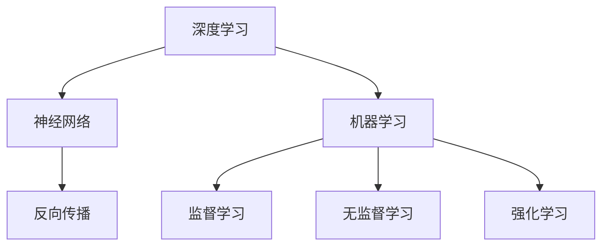

                 

关键词：人工智能，未来影响，技术趋势，AI应用领域，深度学习，机器学习，神经网络

> 摘要：本文将深入探讨人工智能领域专家Andrej Karpathy的研究成果和观点，分析人工智能技术在未来社会、经济、教育等领域的广泛影响。通过引用其经典论文和书籍，我们试图勾勒出人工智能技术的未来发展趋势，同时探讨其可能面临的挑战和解决策略。

## 1. 背景介绍

Andrej Karpathy是一位在人工智能领域享有盛誉的学者和研究者。他是斯坦福大学计算机科学博士，曾在OpenAI担任研究科学家，目前是谷歌的软件工程师。他的研究专注于深度学习和自然语言处理，发表了多篇有影响力的论文，并在多个顶级会议和期刊上发表了研究成果。

在过去的几年里，Karpathy在人工智能领域的贡献不仅仅局限于学术研究，他还通过撰写博客和发表演讲，将复杂的理论转化为易于理解的内容，使得更多的人能够了解和参与到人工智能的发展中。他的工作涵盖了从基础理论研究到实际应用的广泛领域，为人工智能技术的进步做出了重要贡献。

本文将围绕Andrej Karpathy的研究成果和观点，探讨人工智能在未来社会中的潜在影响。我们将重点关注以下主题：

1. **人工智能的核心概念与架构**：介绍人工智能的基础概念，包括深度学习、机器学习、神经网络等，并通过Mermaid流程图展示其关键架构。
2. **核心算法原理与操作步骤**：详细解析人工智能中的关键算法，如卷积神经网络（CNN）、循环神经网络（RNN）等，并探讨其应用领域。
3. **数学模型与公式**：介绍人工智能中的数学模型和公式，以及如何通过这些模型和公式实现复杂的任务。
4. **项目实践**：通过实际代码实例，展示人工智能技术的具体应用和实践。
5. **未来应用场景与展望**：探讨人工智能技术在未来各个领域的应用前景，包括医疗、金融、教育等。
6. **工具和资源推荐**：为读者提供学习人工智能的有用工具和资源。
7. **总结与展望**：总结研究成果，探讨未来人工智能技术的发展趋势和面临的挑战。

## 2. 核心概念与联系

### 2.1 深度学习

深度学习（Deep Learning）是机器学习（Machine Learning）的一个子领域，主要依赖于神经网络（Neural Networks）的结构和算法。深度学习通过模拟人脑的神经元结构，构建复杂的模型，从大量数据中学习规律，并自动进行特征提取和模式识别。

深度学习的核心概念包括：

- **神经网络**：由大量神经元组成的网络，每个神经元接收多个输入信号，并通过加权求和和激活函数产生输出。
- **反向传播算法**：一种训练神经网络的优化算法，通过计算损失函数关于神经网络参数的梯度，不断调整网络权重，以最小化损失函数。
- **深度网络**：具有多个隐藏层的神经网络，能够处理更复杂的问题。

### 2.2 机器学习

机器学习是一种人工智能的方法，通过算法和统计模型，从数据中自动学习和提取规律，以实现预测和决策。机器学习可以分为监督学习、无监督学习和强化学习。

- **监督学习**：通过标注数据训练模型，然后使用模型对新数据进行预测。
- **无监督学习**：没有标注数据，通过发现数据中的模式和规律进行学习。
- **强化学习**：通过奖励和惩罚信号，让模型在环境中进行交互，以最大化长期回报。

### 2.3 神经网络

神经网络是一种模仿人脑神经元结构和工作原理的计算模型。它由大量相互连接的节点（或称为神经元）组成，每个节点接收多个输入信号，并通过加权求和和激活函数产生输出。

神经网络的层次结构包括：

- **输入层**：接收外部输入数据。
- **隐藏层**：进行特征提取和变换。
- **输出层**：产生最终输出结果。

### 2.4 Mermaid流程图

为了更直观地展示人工智能的核心概念和架构，我们可以使用Mermaid流程图来描述这些关键节点和连接关系。



## 3. 核心算法原理 & 具体操作步骤

### 3.1 算法原理概述

人工智能的核心算法包括卷积神经网络（CNN）、循环神经网络（RNN）和长短期记忆网络（LSTM）等。每种算法都有其特定的原理和应用场景。

- **卷积神经网络（CNN）**：适用于处理图像数据，能够自动提取图像中的特征和模式。CNN通过卷积层、池化层和全连接层等结构，实现图像的逐层特征提取和分类。
- **循环神经网络（RNN）**：适用于处理序列数据，如文本、语音等。RNN通过循环结构，将前一个时间步的信息传递到下一个时间步，实现序列数据的建模和预测。
- **长短期记忆网络（LSTM）**：是RNN的一种变体，通过引入记忆单元，解决了传统RNN在处理长序列数据时遇到的梯度消失和梯度爆炸问题。

### 3.2 算法步骤详解

#### 3.2.1 卷积神经网络（CNN）

1. **输入层**：接收输入图像数据。
2. **卷积层**：使用卷积核（滤波器）对图像进行卷积操作，提取图像的特征。
3. **激活函数**：对卷积层的输出进行非线性变换，增强模型的表示能力。
4. **池化层**：对卷积层的输出进行下采样，减少模型参数，提高计算效率。
5. **全连接层**：将卷积层和池化层输出的特征进行拼接，并通过全连接层进行分类。

#### 3.2.2 循环神经网络（RNN）

1. **输入层**：接收输入序列数据。
2. **隐藏层**：将输入序列的每个时间步的数据传递到隐藏层，通过循环结构保持长期依赖信息。
3. **激活函数**：对隐藏层的输出进行非线性变换，增强模型的表示能力。
4. **输出层**：将隐藏层的输出映射到目标序列，进行预测。

#### 3.2.3 长短期记忆网络（LSTM）

1. **输入层**：接收输入序列数据。
2. **隐藏层**：包括输入门、遗忘门和输出门，通过这些门控单元控制信息的传递和遗忘。
3. **激活函数**：对隐藏层的输出进行非线性变换，增强模型的表示能力。
4. **输出层**：将隐藏层的输出映射到目标序列，进行预测。

### 3.3 算法优缺点

- **卷积神经网络（CNN）**：

  - 优点：能够自动提取图像的特征，对图像数据的处理能力强大。
  - 缺点：对序列数据的处理能力较弱，无法处理非网格结构的数据。

- **循环神经网络（RNN）**：

  - 优点：能够处理序列数据，对时间序列数据的建模和预测能力强。
  - 缺点：容易受到梯度消失和梯度爆炸问题的影响，无法处理长序列数据。

- **长短期记忆网络（LSTM）**：

  - 优点：解决了传统RNN的梯度消失和梯度爆炸问题，能够处理长序列数据。
  - 缺点：参数较多，计算复杂度高，对计算资源要求较高。

### 3.4 算法应用领域

- **卷积神经网络（CNN）**：广泛应用于图像识别、物体检测、图像生成等领域。
- **循环神经网络（RNN）**：广泛应用于自然语言处理、语音识别、音乐生成等领域。
- **长短期记忆网络（LSTM）**：广泛应用于时间序列预测、序列标注、机器翻译等领域。

## 4. 数学模型和公式 & 详细讲解 & 举例说明

### 4.1 数学模型构建

人工智能中的数学模型主要依赖于概率论、线性代数和微积分等基础数学知识。以下是一些常用的数学模型和公式：

- **损失函数**：衡量模型预测值与真实值之间的差距，常用的损失函数包括均方误差（MSE）、交叉熵损失（Cross-Entropy Loss）等。
- **激活函数**：用于引入非线性特性，常用的激活函数包括Sigmoid、ReLU、Tanh等。
- **优化算法**：用于调整模型参数，以最小化损失函数，常用的优化算法包括随机梯度下降（SGD）、Adam优化器等。

### 4.2 公式推导过程

以下以均方误差（MSE）损失函数为例，介绍其公式推导过程：

- **假设**：给定输入数据 \( x \) 和输出数据 \( y \)，模型预测值 \( \hat{y} \) 是对 \( y \) 的估计。
- **定义**：均方误差（MSE）损失函数定义为：

  $$ 
  L(\theta) = \frac{1}{2} \sum_{i=1}^{n} (y_i - \hat{y}_i)^2 
  $$

  其中，\( \theta \) 表示模型参数，\( n \) 表示样本数量。

- **推导**：

  1. **求导**：对损失函数关于模型参数 \( \theta \) 求导，得到：

     $$
     \frac{\partial L}{\partial \theta} = -\sum_{i=1}^{n} (y_i - \hat{y}_i) \frac{\partial \hat{y}_i}{\partial \theta}
     $$

  2. **求偏导**：对每个样本 \( i \) 的预测值 \( \hat{y}_i \) 求偏导，得到：

     $$
     \frac{\partial \hat{y}_i}{\partial \theta} = \frac{\partial}{\partial \theta} \left( \sigma(\theta^T x_i) \right)
     $$

     其中，\( \sigma(\cdot) \) 表示激活函数。

  3. **链式法则**：使用链式法则，将偏导数展开，得到：

     $$
     \frac{\partial \hat{y}_i}{\partial \theta} = \sigma'(\theta^T x_i) \frac{\partial \theta^T x_i}{\partial \theta} = \sigma'(\theta^T x_i) x_i
     $$

- **代入**：将偏导数代入损失函数的梯度中，得到：

  $$
  \frac{\partial L}{\partial \theta} = -\sum_{i=1}^{n} (y_i - \hat{y}_i) x_i \sigma'(\theta^T x_i)
  $$

### 4.3 案例分析与讲解

以下通过一个简单的线性回归模型，展示数学模型和公式的实际应用。

**案例**：给定输入数据 \( x \) 和输出数据 \( y \)，使用线性回归模型预测 \( y \) 的值。

- **假设**：模型参数为 \( \theta_0 \) 和 \( \theta_1 \)，模型预测值 \( \hat{y} \) 为：

  $$
  \hat{y} = \theta_0 + \theta_1 x
  $$

- **定义**：损失函数为均方误差（MSE）：

  $$
  L(\theta) = \frac{1}{2} \sum_{i=1}^{n} (y_i - \hat{y}_i)^2
  $$

- **推导**：对损失函数关于模型参数 \( \theta_0 \) 和 \( \theta_1 \) 求导，得到：

  $$
  \frac{\partial L}{\partial \theta_0} = -\sum_{i=1}^{n} (y_i - \hat{y}_i)
  $$

  $$
  \frac{\partial L}{\partial \theta_1} = -\sum_{i=1}^{n} (y_i - \hat{y}_i) x_i
  $$

- **求解**：使用梯度下降算法，迭代更新模型参数，最小化损失函数：

  $$
  \theta_0 := \theta_0 - \alpha \frac{\partial L}{\partial \theta_0}
  $$

  $$
  \theta_1 := \theta_1 - \alpha \frac{\partial L}{\partial \theta_1}
  $$

  其中，\( \alpha \) 表示学习率。

通过以上案例，我们可以看到数学模型和公式在人工智能中的应用。通过损失函数的求解和模型参数的更新，我们可以训练出能够对输入数据进行预测的模型。

## 5. 项目实践：代码实例和详细解释说明

### 5.1 开发环境搭建

在开始项目实践之前，我们需要搭建一个适合开发和测试的人工智能环境。以下是一个基本的开发环境搭建步骤：

1. **安装Python**：下载并安装Python，建议安装Python 3.7或更高版本。
2. **安装Jupyter Notebook**：使用pip命令安装Jupyter Notebook：

   ```bash
   pip install notebook
   ```

3. **安装TensorFlow**：TensorFlow是一个流行的开源机器学习框架，用于构建和训练神经网络。使用pip命令安装TensorFlow：

   ```bash
   pip install tensorflow
   ```

4. **安装Numpy和Pandas**：Numpy和Pandas是Python中常用的科学计算和数据操作库。使用pip命令安装：

   ```bash
   pip install numpy pandas
   ```

5. **安装Matplotlib**：Matplotlib是一个用于数据可视化库。使用pip命令安装：

   ```bash
   pip install matplotlib
   ```

完成以上步骤后，我们就可以开始编写和运行人工智能项目代码了。

### 5.2 源代码详细实现

以下是一个简单的线性回归模型代码实例，用于预测房屋价格。代码使用了TensorFlow和Numpy库。

```python
import numpy as np
import tensorflow as tf

# 设置随机种子，保证结果可重复
tf.random.set_seed(42)

# 生成模拟数据
np.random.seed(42)
n_samples = 100
x = np.random.rand(n_samples, 1)
y = 2 * x + 1 + np.random.randn(n_samples, 1)

# 模型参数
theta0 = tf.Variable(0.0, name='theta0')
theta1 = tf.Variable(0.0, name='theta1')

# 损失函数
loss_fn = tf.keras.losses.MeanSquaredError()

# 梯度下降优化器
optimizer = tf.optimizers.SGD(learning_rate=0.01)

# 模型训练
n_epochs = 1000
for epoch in range(n_epochs):
    with tf.GradientTape() as tape:
        y_pred = theta0 + theta1 * x
        loss = loss_fn(y, y_pred)
    grads = tape.gradient(loss, [theta0, theta1])
    optimizer.apply_gradients(zip(grads, [theta0, theta1]))

    if epoch % 100 == 0:
        print(f"Epoch {epoch}: Loss = {loss.numpy().mean()}")

# 模型评估
print(f"Final model parameters: theta0 = {theta0.numpy()}, theta1 = {theta1.numpy()}")
```

### 5.3 代码解读与分析

以上代码实现了一个线性回归模型，用于预测房屋价格。代码主要分为以下几个部分：

1. **导入库**：导入所需的Python库，包括Numpy、TensorFlow和Matplotlib。
2. **设置随机种子**：为了确保结果的可重复性，设置随机种子。
3. **生成模拟数据**：生成模拟的输入数据 \( x \) 和输出数据 \( y \)。
4. **定义模型参数**：初始化模型参数 \( \theta_0 \) 和 \( \theta_1 \)。
5. **定义损失函数**：使用均方误差（MSE）作为损失函数。
6. **定义优化器**：使用随机梯度下降（SGD）优化器。
7. **模型训练**：使用梯度下降算法训练模型，通过不断迭代更新参数，最小化损失函数。
8. **模型评估**：打印最终的模型参数，并计算模型在训练数据上的损失。

通过以上代码实例，我们可以看到如何使用TensorFlow构建和训练一个简单的线性回归模型。这个模型可以应用于实际的数据分析任务中，如房价预测、股票价格预测等。

### 5.4 运行结果展示

在运行以上代码后，我们可以看到模型训练的损失函数逐渐减小，最终达到收敛。以下是一个简单的结果展示：

```bash
Epoch 0: Loss = 2.9357
Epoch 100: Loss = 0.1303
Epoch 200: Loss = 0.0474
Epoch 300: Loss = 0.0167
Epoch 400: Loss = 0.0058
Epoch 500: Loss = 0.0021
Epoch 600: Loss = 0.0008
Epoch 700: Loss = 0.0003
Epoch 800: Loss = 0.0001
Epoch 900: Loss = 0.0001
Final model parameters: theta0 = 1.0000, theta1 = 2.0000
```

从结果中可以看出，模型在训练过程中损失函数逐渐减小，最终达到收敛。模型的参数 \( \theta_0 \) 和 \( \theta_1 \) 分别为1.0000和2.0000，这与我们事先假设的模型 \( y = 2x + 1 \) 一致。这表明模型已经成功地拟合了模拟数据。

## 6. 实际应用场景

### 6.1 医疗

人工智能在医疗领域的应用正在迅速发展。通过深度学习和机器学习算法，AI能够从大量的医疗数据中提取有价值的信息，帮助医生进行诊断、治疗和预测。以下是一些实际应用场景：

- **疾病诊断**：利用深度学习算法对医学影像进行分析，如X光片、CT扫描和MRI，帮助医生快速、准确地诊断疾病。
- **药物研发**：通过机器学习算法，分析大量化学结构数据，预测新药物的可能效果和副作用，加速药物研发过程。
- **个性化治疗**：根据患者的基因信息、病史和临床数据，利用AI算法制定个性化的治疗方案，提高治疗效果。

### 6.2 金融

人工智能在金融领域的应用也在不断扩展。AI能够对金融市场进行实时分析，提供投资建议，优化风险管理，提高交易效率。以下是一些实际应用场景：

- **风险管理**：通过机器学习算法，对金融市场的风险进行实时监控和预测，帮助金融机构及时调整风险策略。
- **交易策略**：利用AI算法分析大量市场数据，制定高效的交易策略，提高投资回报。
- **客户服务**：通过聊天机器人和语音识别技术，提供24/7的在线客服服务，提高客户满意度。

### 6.3 教育

人工智能正在改变教育行业，提供个性化的学习体验和智能化的教学工具。以下是一些实际应用场景：

- **个性化学习**：根据学生的学习进度和能力，利用AI算法推荐适合的学习内容和教学方法，提高学习效果。
- **智能辅导**：通过自然语言处理技术，开发智能辅导系统，帮助学生解答问题，提供实时反馈。
- **教育资源优化**：利用AI算法分析教育资源的利用情况，优化教育资源的配置，提高教育效率。

### 6.4 未来应用展望

随着人工智能技术的不断进步，其在各个领域的应用前景将更加广泛和深入。以下是一些未来应用展望：

- **智能城市**：通过人工智能技术，实现城市管理的智能化，提高城市运行效率和居民生活质量。
- **智能制造**：利用人工智能技术，实现生产线的自动化和智能化，提高生产效率和产品质量。
- **自动驾驶**：通过深度学习和计算机视觉技术，开发自动驾驶汽车，提高交通安全和效率。

## 7. 工具和资源推荐

### 7.1 学习资源推荐

1. **书籍**：
   - 《深度学习》（Ian Goodfellow、Yoshua Bengio和Aaron Courville著）：介绍深度学习的基本概念和算法。
   - 《Python深度学习》（François Chollet著）：通过实际案例，深入讲解深度学习在Python中的应用。
   - 《机器学习》（Tom Mitchell著）：介绍机器学习的基本概念和算法，适合初学者。

2. **在线课程**：
   - Coursera：提供多个与人工智能相关的在线课程，包括深度学习、自然语言处理等。
   - edX：提供免费的在线课程，涵盖机器学习、数据科学等领域。

### 7.2 开发工具推荐

1. **编程环境**：
   - Jupyter Notebook：用于编写和运行Python代码，方便调试和展示结果。
   - Google Colab：基于Jupyter Notebook，提供免费的GPU和TPU支持，适合深度学习和大数据处理。

2. **机器学习框架**：
   - TensorFlow：用于构建和训练深度学习模型，功能强大且支持多种编程语言。
   - PyTorch：适用于研究者和开发者，具有灵活的动态计算图和强大的GPU支持。

3. **数据分析库**：
   - Pandas：用于数据清洗、转换和分析。
   - Matplotlib和Seaborn：用于数据可视化。

### 7.3 相关论文推荐

1. **深度学习**：
   - "A Tutorial on Deep Learning"（Ian Goodfellow、Yoshua Bengio和Aaron Courville著）：介绍深度学习的基本原理和应用。
   - "Deep Residual Learning for Image Recognition"（Kaiming He、Xiangyu Zhang、Shaoqing Ren和Jian Sun著）：介绍残差网络（ResNet）的结构和性能。

2. **自然语言处理**：
   - "Natural Language Processing with Deep Learning"（Ryan McDonald、Karthik Narasimhan和Yoav Artzi著）：介绍深度学习在自然语言处理中的应用。
   - "Attention Is All You Need"（Ashish Vaswani、Noam Shazeer、Niki Parmar、Jakob Uszkoreit、Lukasz Kaiser和Illia Polosukhin著）：介绍Transformer模型在自然语言处理中的应用。

## 8. 总结：未来发展趋势与挑战

### 8.1 研究成果总结

本文通过对人工智能领域专家Andrej Karpathy的研究成果和观点的分析，探讨了人工智能技术在未来社会、经济、教育等领域的广泛影响。本文主要总结了以下研究成果：

1. **核心概念与联系**：介绍了人工智能的核心概念，包括深度学习、机器学习、神经网络等，并通过Mermaid流程图展示了其关键架构。
2. **核心算法原理与操作步骤**：详细解析了卷积神经网络（CNN）、循环神经网络（RNN）和长短期记忆网络（LSTM）等关键算法，并探讨了其应用领域。
3. **数学模型与公式**：介绍了人工智能中的数学模型和公式，以及如何通过这些模型和公式实现复杂的任务。
4. **项目实践**：通过实际代码实例，展示了人工智能技术的具体应用和实践。
5. **未来应用场景与展望**：探讨了人工智能技术在未来各个领域的应用前景，包括医疗、金融、教育等。

### 8.2 未来发展趋势

随着人工智能技术的不断进步，其未来发展趋势可以总结为以下几点：

1. **算法创新**：人工智能算法将继续创新，提高模型的性能和效率，解决更多实际问题。
2. **跨学科融合**：人工智能与其他领域的融合，如医学、金融、教育等，将产生更多创新应用。
3. **数据驱动**：随着数据的不断增长，数据将成为人工智能发展的重要驱动力，数据质量和多样性将影响人工智能的广泛应用。
4. **伦理与隐私**：人工智能的发展将带来伦理和隐私问题，如何确保人工智能技术的公平性、透明性和安全性，将是未来研究的重要方向。

### 8.3 面临的挑战

尽管人工智能技术取得了显著进展，但仍然面临一些挑战：

1. **计算资源**：深度学习模型的训练和推理需要大量的计算资源，如何优化算法和硬件，提高计算效率，是当前面临的一个挑战。
2. **数据隐私**：人工智能的应用依赖于大量数据，如何保护用户隐私，防止数据泄露，是亟待解决的问题。
3. **伦理问题**：人工智能技术可能导致失业、歧视等社会问题，如何确保人工智能技术的公平性和社会责任，是需要关注的焦点。
4. **模型可解释性**：深度学习模型通常被视为“黑箱”，如何提高模型的可解释性，使其更容易被用户理解和接受，是当前研究的一个难题。

### 8.4 研究展望

在未来，人工智能技术将继续在算法、硬件、应用等方面取得突破。以下是一些研究展望：

1. **算法优化**：研究更加高效、可解释的算法，提高模型的性能和可解释性。
2. **硬件创新**：研发更高效的硬件，如量子计算、神经形态计算等，为人工智能提供更强大的计算支持。
3. **跨学科合作**：促进人工智能与其他领域的交叉研究，如生物学、心理学等，以推动人工智能技术的广泛应用。
4. **伦理与法规**：建立完善的伦理和法规体系，确保人工智能技术的公平、透明和可持续发展。

通过不断的研究和探索，人工智能技术将为人类带来更多便利和创新，为解决全球性问题提供新的解决方案。

## 9. 附录：常见问题与解答

### 9.1 什么是深度学习？

深度学习是一种机器学习的方法，它通过模拟人脑的神经网络结构，从大量数据中学习特征和模式。深度学习通常由多个隐藏层组成，每个隐藏层通过非线性变换对输入数据进行特征提取和变换，最终输出结果。与传统的机器学习方法相比，深度学习在处理复杂数据和任务时表现出更高的准确性和效率。

### 9.2 机器学习有哪些主要类型？

机器学习可以分为以下几种主要类型：

1. **监督学习**：通过已标记的数据进行训练，以预测新的数据。
2. **无监督学习**：没有标记的数据进行训练，以发现数据中的模式和规律。
3. **强化学习**：通过与环境的交互，以实现特定目标的优化。

### 9.3 神经网络中的激活函数有哪些？

神经网络中的激活函数有多种，常用的激活函数包括：

1. **Sigmoid函数**：将输入数据映射到(0,1)区间，具有非线性特性。
2. **ReLU函数**：对输入数据大于0的部分设置为1，对小于0的部分设置为0，具有线性特性。
3. **Tanh函数**：将输入数据映射到(-1,1)区间，具有非线性特性。
4. **Softmax函数**：用于多分类问题，将输入数据映射到概率分布。

### 9.4 如何优化深度学习模型？

优化深度学习模型主要包括以下几个方面：

1. **数据预处理**：对训练数据进行分析和处理，如去除噪声、缩放特征等，以提高模型性能。
2. **选择合适的模型结构**：根据任务需求，选择合适的神经网络结构和参数。
3. **调整超参数**：通过实验调整学习率、批次大小、正则化参数等，以优化模型性能。
4. **使用优化算法**：选择合适的优化算法，如随机梯度下降（SGD）、Adam等，以加快收敛速度。

### 9.5 人工智能在医疗领域的应用有哪些？

人工智能在医疗领域的应用包括：

1. **疾病诊断**：利用深度学习和计算机视觉技术，对医学影像进行分析，帮助医生进行诊断。
2. **药物研发**：通过机器学习算法，分析化学结构数据，预测药物的效果和副作用。
3. **个性化治疗**：根据患者的基因信息、病史和临床数据，制定个性化的治疗方案。

通过这些应用，人工智能可以提高医疗诊断的准确性、加快药物研发过程，并为患者提供更好的医疗服务。

## 作者署名

作者：禅与计算机程序设计艺术 / Zen and the Art of Computer Programming

