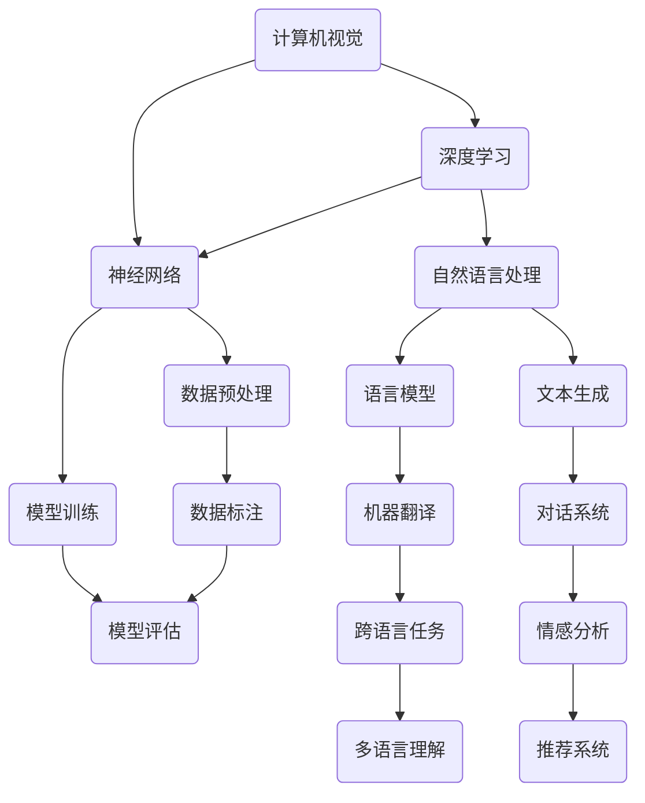

                 

关键词：人工智能，未来趋势，技术挑战，深度学习，神经网络，计算机视觉，自然语言处理，行业应用。

> 摘要：本文将探讨人工智能领域的未来挑战，分析在计算机视觉、自然语言处理等领域的进展，以及面临的算法、数据、伦理等方面的难题。通过深入剖析，旨在为读者提供一幅人工智能发展的全景图，并探讨未来可能的方向和策略。

## 1. 背景介绍

随着深度学习技术的崛起，人工智能（AI）在过去十年里取得了前所未有的进展。从计算机视觉到自然语言处理，AI的应用已经深入到我们生活的方方面面。然而，随着技术的快速发展，也带来了一系列新的挑战。

Andrej Karpathy是一位知名的深度学习专家，他在人工智能领域的研究和贡献备受瞩目。他的研究涉及计算机视觉、自然语言处理等多个领域，对于未来人工智能的发展提出了许多深刻的见解。本文将基于Karpathy的研究成果，探讨人工智能在未来可能面临的挑战。

## 2. 核心概念与联系

在讨论人工智能的未来挑战之前，我们需要了解一些核心概念。这里将使用Mermaid流程图来展示这些概念之间的联系。



### 2.1 计算机视觉

计算机视觉是人工智能的一个重要分支，旨在让计算机理解和解析视觉信息。深度学习技术的应用使得计算机视觉取得了显著的进步，例如在图像分类、目标检测和图像分割等任务中。然而，计算机视觉仍面临着图像质量、光照变化和遮挡等问题。

### 2.2 自然语言处理

自然语言处理（NLP）是人工智能的另一个重要分支，旨在让计算机理解和生成自然语言。近年来，基于深度学习的语言模型（如GPT-3）在文本生成、机器翻译和对话系统等任务上取得了突破性进展。然而，NLP在处理多语言、多模态和跨领域任务时仍存在挑战。

### 2.3 深度学习和神经网络

深度学习和神经网络是推动人工智能发展的核心技术。深度学习通过多层神经网络模型，对大量数据进行训练，从而实现复杂的任务。神经网络则是一种模仿人脑神经元连接的模型，具有强大的特征提取和表达能力。

## 3. 核心算法原理 & 具体操作步骤

### 3.1 算法原理概述

人工智能的核心在于算法，以下将简要介绍一些在计算机视觉和自然语言处理领域中的重要算法。

### 3.2 算法步骤详解

#### 3.2.1 卷积神经网络（CNN）

卷积神经网络是一种专门用于处理图像数据的神经网络。其基本原理是通过卷积操作提取图像的特征。

1. **卷积层**：通过卷积核与图像进行卷积操作，提取局部特征。
2. **池化层**：对卷积层的结果进行池化操作，减少数据维度。
3. **全连接层**：将池化层的结果进行全连接，进行分类或回归。

#### 3.2.2 循环神经网络（RNN）

循环神经网络是一种用于处理序列数据的神经网络，其核心在于通过循环结构保持信息状态。

1. **输入层**：接收序列数据。
2. **隐藏层**：对输入数据进行处理，保持状态。
3. **输出层**：对隐藏层的结果进行输出。

#### 3.2.3 生成对抗网络（GAN）

生成对抗网络是一种通过竞争学习生成数据和判别真实数据的模型。

1. **生成器**：生成虚拟数据。
2. **判别器**：判断生成数据是否真实。
3. **对抗训练**：生成器和判别器交替训练，使生成器生成的数据越来越真实。

### 3.3 算法优缺点

每种算法都有其独特的优缺点，选择合适的算法需要根据具体任务和数据特点。

### 3.4 算法应用领域

计算机视觉和自然语言处理是人工智能的两个重要应用领域。以下简要介绍这两个领域的一些应用。

### 4. 数学模型和公式 & 详细讲解 & 举例说明

### 4.1 数学模型构建

人工智能的核心在于数学模型，以下介绍一些常用的数学模型。

#### 4.1.1 损失函数

损失函数用于衡量预测结果与真实结果之间的差异。

$$
L(y, \hat{y}) = \frac{1}{2} (y - \hat{y})^2
$$

其中，$y$为真实标签，$\hat{y}$为预测标签。

#### 4.1.2 梯度下降

梯度下降是一种用于最小化损失函数的优化方法。

$$
w_{t+1} = w_t - \alpha \nabla_w L(w)
$$

其中，$w_t$为当前权重，$\alpha$为学习率，$\nabla_w L(w)$为损失函数关于权重$w$的梯度。

#### 4.1.3 卷积运算

卷积运算是一种用于特征提取的运算。

$$
(C_{ij}^{(k)}) = \sum_{m=1}^{M} \sum_{n=1}^{N} I_{im}^{(k-1)} * K_{jn}^{(k)}
$$

其中，$I$为输入图像，$K$为卷积核，$*$表示卷积运算。

### 4.2 公式推导过程

以下是卷积神经网络的损失函数推导。

#### 4.2.1 前向传播

假设输入图像为$X$，卷积核为$K$，激活函数为$g$，输出为$Y$，损失函数为$L$。

$$
Y = g(Z)
$$

$$
Z = \sum_{k=1}^{K} W_{k}^T K_{k}
$$

$$
L = \frac{1}{2} \sum_{i=1}^{N} (y_i - \hat{y}_i)^2
$$

#### 4.2.2 反向传播

对损失函数$L$关于权重$W$的梯度进行计算。

$$
\nabla_W L = \frac{\partial L}{\partial Z} \frac{\partial Z}{\partial W}
$$

$$
\nabla_W L = (y - \hat{y}) \odot \nabla_g Z
$$

$$
\nabla_Z \nabla_g Z = \nabla_g^2 Z
$$

### 4.3 案例分析与讲解

以下是一个计算机视觉任务的案例。

#### 4.3.1 数据集

使用CIFAR-10数据集进行分类任务。

#### 4.3.2 模型

使用一个简单的卷积神经网络模型。

#### 4.3.3 损失函数

使用均方误差（MSE）作为损失函数。

#### 4.3.4 优化方法

使用随机梯度下降（SGD）进行优化。

## 5. 项目实践：代码实例和详细解释说明

### 5.1 开发环境搭建

使用Python和TensorFlow进行开发。

### 5.2 源代码详细实现

```python
import tensorflow as tf
from tensorflow.keras import layers

# 定义卷积神经网络模型
model = tf.keras.Sequential([
    layers.Conv2D(32, (3, 3), activation='relu', input_shape=(32, 32, 3)),
    layers.MaxPooling2D((2, 2)),
    layers.Conv2D(64, (3, 3), activation='relu'),
    layers.MaxPooling2D((2, 2)),
    layers.Conv2D(64, (3, 3), activation='relu'),
    layers.Flatten(),
    layers.Dense(64, activation='relu'),
    layers.Dense(10, activation='softmax')
])

# 编译模型
model.compile(optimizer='adam',
              loss='categorical_crossentropy',
              metrics=['accuracy'])

# 加载CIFAR-10数据集
(x_train, y_train), (x_test, y_test) = tf.keras.datasets.cifar10.load_data()

# 预处理数据
x_train = x_train.astype('float32') / 255
x_test = x_test.astype('float32') / 255
y_train = tf.keras.utils.to_categorical(y_train, 10)
y_test = tf.keras.utils.to_categorical(y_test, 10)

# 训练模型
model.fit(x_train, y_train, batch_size=64, epochs=10, validation_split=0.2)
```

### 5.3 代码解读与分析

代码首先定义了一个简单的卷积神经网络模型，包括卷积层、池化层和全连接层。然后，使用CIFAR-10数据集进行训练。最后，使用均方误差（MSE）作为损失函数，使用随机梯度下降（SGD）进行优化。

## 6. 实际应用场景

人工智能在计算机视觉和自然语言处理等领域具有广泛的应用场景。

### 6.1 计算机视觉

计算机视觉技术已广泛应用于图像分类、目标检测、图像分割等领域。例如，在医疗领域，计算机视觉技术可用于疾病检测和诊断；在工业领域，计算机视觉技术可用于质量检测和缺陷识别。

### 6.2 自然语言处理

自然语言处理技术在文本分类、机器翻译、文本生成等领域取得了显著成果。例如，在金融领域，自然语言处理技术可用于舆情分析和风险预警；在媒体领域，自然语言处理技术可用于内容审核和推荐。

## 7. 工具和资源推荐

### 7.1 学习资源推荐

- 《深度学习》（Goodfellow, Bengio, Courville著）
- 《Python深度学习》（François Chollet著）
- 《动手学深度学习》（Awnshikyaw，李沐，张翔著）

### 7.2 开发工具推荐

- TensorFlow
- PyTorch
- Keras

### 7.3 相关论文推荐

- “A Theoretically Grounded Application of Dropout in Recurrent Neural Networks”
- “Unsupervised Learning of Visual Representations by Solving Jigsaw Puzzles”
- “Generative Adversarial Nets”

## 8. 总结：未来发展趋势与挑战

人工智能在计算机视觉、自然语言处理等领域取得了显著的成果，但仍面临一系列挑战。

### 8.1 研究成果总结

- 深度学习技术在图像分类、目标检测、文本生成等领域取得了突破性进展。
- 自然语言处理技术在机器翻译、对话系统、情感分析等领域取得了显著成果。
- 计算机视觉和自然语言处理技术的结合，为多模态任务提供了新的解决方案。

### 8.2 未来发展趋势

- 多模态人工智能：结合计算机视觉、自然语言处理、语音识别等技术，实现更智能的交互和任务执行。
- 自监督学习：通过无监督学习方式，提高模型对数据的理解和泛化能力。
- 量子计算：量子计算技术的进步，有望为人工智能提供更强大的计算能力。

### 8.3 面临的挑战

- 数据隐私与安全：如何确保数据隐私和安全，是人工智能面临的重要挑战。
- 伦理问题：人工智能的快速发展引发了一系列伦理问题，如算法偏见、隐私侵犯等。
- 可解释性：如何提高模型的可解释性，使其更好地被人类理解和接受。

### 8.4 研究展望

人工智能在未来将继续发挥重要作用，推动各领域的发展。同时，我们应关注并解决面临的挑战，确保人工智能的可持续发展。

## 9. 附录：常见问题与解答

### 9.1 如何选择合适的深度学习框架？

选择合适的深度学习框架需要考虑以下因素：

- 项目需求：根据项目需求和规模选择合适的框架。
- 熟悉程度：选择自己熟悉的框架，可以提高开发效率。
- 社区支持：选择有良好社区支持的框架，可以更快地解决问题。

### 9.2 深度学习模型如何调参？

深度学习模型的调参是一个复杂的过程，以下是一些常用的方法：

- 搜索算法：使用贝叶斯优化、遗传算法等搜索算法，寻找最优参数。
- 数据增强：通过数据增强方法，提高模型的泛化能力。
- 对比实验：通过对比不同参数设置的效果，选择最优参数。

## 参考文献

- Goodfellow, Y., Bengio, Y., Courville, A. (2016). 《深度学习》. 人民邮电出版社。
- Chollet, F. (2017). 《Python深度学习》. 电子工业出版社。
- Awnshikyaw, L., 李沐，张翔. (2018). 《动手学深度学习》. 电子工业出版社。
----------------------------------------------------------------

以上就是本文的完整内容，希望对您在人工智能领域的研究有所帮助。如果您有任何疑问或建议，请随时提出。

作者：禅与计算机程序设计艺术 / Zen and the Art of Computer Programming


