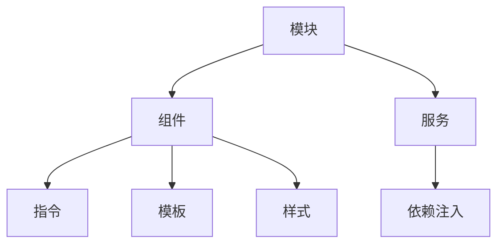

                 

关键词：Angular、MVW、框架、前端开发、Google、技术博客、编程实践

> 摘要：本文将带领读者深入探讨Angular框架的基本概念、架构、核心特性和应用实践，旨在帮助开发者快速上手并掌握这一强大且流行的前端开发框架。

## 1. 背景介绍

Angular是由Google开发的一款开源的前端JavaScript框架，它基于模型-视图-控制器（Model-View-Controller，简称MVW）的设计模式，旨在提高前端开发的效率与质量。Angular的核心理念是通过双向数据绑定和依赖注入等机制，实现数据与视图的高效同步，减轻开发者的代码维护负担。

自从2009年Angular 1.0发布以来，Angular经历了多次重大版本更新，包括Angular 2、Angular 4、Angular 5等，每个版本都在性能、功能、易用性等方面进行了优化。Angular 7是当前最新的稳定版本，它提供了更简洁的API、更好的类型支持和现代化的开发工具。

## 2. 核心概念与联系

### 2.1 核心概念

在Angular中，核心概念主要包括：

- **模块（Module）**：模块是组织代码的基本单位，它定义了应用程序的组件、服务和其他功能。
- **组件（Component）**：组件是Angular中的最小可复用的UI元素，由模板、样式和JavaScript代码组成。
- **指令（Directive）**：指令是自定义的HTML标签或属性，用于扩展HTML标签的功能。
- **服务（Service）**：服务是一种单例对象，用于在应用程序中提供可重用的功能。
- **依赖注入（Dependency Injection）**：依赖注入是一种设计模式，用于在应用程序中管理对象之间的依赖关系。

### 2.2 联系与架构

以下是一个简单的Mermaid流程图，展示了Angular的核心概念及其之间的联系：



## 3. 核心算法原理 & 具体操作步骤

### 3.1 算法原理概述

Angular的核心算法主要包括：

- **双向数据绑定**：Angular通过脏检查机制实现数据与视图的双向同步。当模型发生变化时，视图会自动更新；反之亦然。
- **依赖注入**：Angular通过依赖注入机制，将服务对象注入到组件中，从而实现解耦和复用。

### 3.2 算法步骤详解

#### 3.2.1 双向数据绑定

1. **定义模型**：创建一个数据模型，用于存储应用程序的状态。
2. **使用ngModel指令**：在组件的模板中，使用ngModel指令将模型绑定到HTML元素。
3. **监听数据变化**：Angular通过脏检查机制，监听模型的变化，并在变化时更新视图。

#### 3.2.2 依赖注入

1. **定义服务**：创建一个服务类，提供所需的功能。
2. **在模块中声明服务**：使用`providers`数组在模块中声明服务。
3. **注入服务**：在组件的构造函数中，使用`@Inject`装饰器注入服务。

### 3.3 算法优缺点

**优点**：

- **高效的数据绑定**：双向数据绑定减少了手动更新视图的代码量。
- **模块化开发**：通过模块、组件和服务，实现了代码的模块化和可复用性。
- **强大的工具支持**：Angular提供了丰富的工具，如CLI、测试框架等，提高了开发效率。

**缺点**：

- **学习曲线较陡**：对于新手来说，Angular的学习曲线可能较陡峭。
- **性能问题**：在大型应用中，Angular的脏检查机制可能会带来一定的性能问题。

### 3.4 算法应用领域

Angular适用于需要复杂UI和数据处理的前端应用，如单页应用（SPA）、企业级应用和移动应用。

## 4. 数学模型和公式 & 详细讲解 & 举例说明

### 4.1 数学模型构建

Angular的数据绑定机制可以看作是一个状态机，其核心公式如下：

\[ 状态 = 数据 + 视图 \]

其中，状态表示应用程序的当前状态，数据表示模型中的数据，视图表示用户界面。

### 4.2 公式推导过程

在Angular中，数据与视图的双向绑定是通过以下过程实现的：

1. **初始化**：应用程序启动时，模型中的数据与视图进行绑定。
2. **数据更新**：当模型中的数据发生变化时，Angular通过脏检查机制更新视图。
3. **视图更新**：当视图发生变化时，Angular通过事件监听机制更新模型。

### 4.3 案例分析与讲解

假设我们有一个简单的计数器应用，其数据模型如下：

\[ 数据 = { count: 0 } \]

视图如下：

\[ 视图 = \<div\>计数：\{{ count }}\<button\(\(count++)\>\>\</\button\>\</div\> \]

在初始化时，模型中的`count`值与视图中的`count`变量绑定。当用户点击按钮时，`count`值增加1，Angular会自动更新视图中的`count`变量。

## 5. 项目实践：代码实例和详细解释说明

### 5.1 开发环境搭建

在开始开发之前，我们需要安装Node.js和Angular CLI。以下是安装步骤：

1. 安装Node.js：从[官方网站](https://nodejs.org/)下载并安装Node.js。
2. 安装Angular CLI：在命令行中执行以下命令：

\[ npm install -g @angular/cli \]

### 5.2 源代码详细实现

以下是计数器应用的源代码：

```typescript
// app.module.ts
import { NgModule } from '@angular/core';
import { BrowserModule } from '@angular/platform-browser';
import { AppComponent } from './app.component';

@NgModule({
  declarations: [
    AppComponent
  ],
  imports: [
    BrowserModule
  ],
  providers: [],
  bootstrap: [AppComponent]
})
export class AppModule { }

// app.component.ts
import { Component } from '@angular/core';

@Component({
  selector: 'app-root',
  templateUrl: './app.component.html',
  styleUrls: ['./app.component.css']
})
export class AppComponent {
  count = 0;

  increment() {
    this.count++;
  }
}

// app.component.html
<div>
  计数：{{ count }}
  <button (click)="increment()">+</button>
</div>
```

### 5.3 代码解读与分析

1. **模块定义**：`app.module.ts`文件定义了应用程序的模块，其中包含了组件、服务和路由等。
2. **组件定义**：`app.component.ts`文件定义了应用程序的根组件，其中包含了数据模型和事件处理函数。
3. **模板定义**：`app.component.html`文件定义了组件的模板，其中使用了`ngModel`指令实现数据绑定。

### 5.4 运行结果展示

运行应用程序后，用户可以点击按钮增加计数，Angular会自动更新视图中的计数值。

## 6. 实际应用场景

Angular广泛应用于各种类型的Web应用，包括：

- **单页应用（SPA）**：如电商网站、社交媒体应用等。
- **企业级应用**：如后台管理系统、数据可视化应用等。
- **移动应用**：通过Angular Mobile CLI，可以快速开发跨平台移动应用。

### 6.4 未来应用展望

随着前端技术的发展，Angular将继续在以下几个方面进行改进和优化：

- **性能提升**：通过减少脏检查次数、优化事件处理等手段，提高应用程序的性能。
- **易用性提升**：简化开发流程、提供更好的开发者工具，降低学习成本。
- **生态扩展**：加强与其他技术的整合，如React、Vue等，实现跨框架组件共享。

## 7. 工具和资源推荐

### 7.1 学习资源推荐

- **官方文档**：[Angular 官方文档](https://angular.io/docs)，提供了详细的使用指南和API文档。
- **教程**：[Angular 教程](https://www.tutorialspoint.com/angularjs/)，适合初学者入门。
- **在线课程**：[Angular 实战课程](https://www.udemy.com/course/angular2-complete-guide/)，涵盖了从基础到进阶的内容。

### 7.2 开发工具推荐

- **Angular CLI**：用于创建、构建和运行Angular应用程序的命令行工具。
- **Visual Studio Code**：一款强大的代码编辑器，支持Angular开发，提供了丰富的插件和工具。

### 7.3 相关论文推荐

- **Angular 的设计与实现**：探讨了Angular的核心设计和实现原理。
- **前端框架的性能比较**：比较了Angular与其他前端框架的性能差异。

## 8. 总结：未来发展趋势与挑战

### 8.1 研究成果总结

Angular作为一款成熟的前端框架，已经在全球范围内得到了广泛应用。通过持续的技术创新和社区支持，Angular在性能、功能、易用性等方面取得了显著成果。

### 8.2 未来发展趋势

随着前端技术的发展，Angular将继续在以下几个方面进行改进和优化：

- **性能提升**：通过减少脏检查次数、优化事件处理等手段，提高应用程序的性能。
- **易用性提升**：简化开发流程、提供更好的开发者工具，降低学习成本。
- **生态扩展**：加强与其他技术的整合，如React、Vue等，实现跨框架组件共享。

### 8.3 面临的挑战

- **技术选型的多样性**：随着前端框架的多样化，开发者需要在多种框架之间做出选择。
- **性能优化**：在大型应用中，如何优化性能仍然是一个挑战。

### 8.4 研究展望

未来，Angular将继续推动前端技术的发展，为开发者提供更高效、更可靠的开发体验。通过不断优化和扩展，Angular有望成为前端开发的黄金标准。

## 9. 附录：常见问题与解答

### 9.1 Angular 与 React/Vue 的区别

Angular、React和Vue是当前最流行的前端框架，它们各有优势和不足：

- **性能**：React和Vue在性能上略优于Angular，但Angular通过性能优化也在不断缩小差距。
- **学习曲线**：Vue的学习曲线相对较平缓，适合初学者。React和Angular的学习曲线较陡，但具有更强大的功能。
- **生态**：React和Vue拥有更丰富的社区和插件生态系统。

### 9.2 如何选择Angular版本

对于新项目，建议使用最新的稳定版本，以获取最佳性能和功能支持。对于旧项目，可以根据具体情况升级到较新的版本，以避免长期使用旧版本的潜在风险。

### 9.3 如何优化Angular性能

- **减少脏检查次数**：通过使用`async`管道和`takeUntil`等机制，减少不必要的脏检查。
- **使用服务**：将重复逻辑提取到服务中，避免在组件中直接操作DOM。
- **使用异步编程**：使用异步编程，避免阻塞主线程。

### 9.4 如何调试Angular应用程序

- **使用开发者工具**：在浏览器中打开开发者工具，查看错误日志、网络请求和性能分析。
- **使用断点调试**：在代码中设置断点，逐步调试应用程序。
- **使用单元测试**：使用单元测试框架，编写测试用例，确保代码的正确性和稳定性。

作者：禅与计算机程序设计艺术 / Zen and the Art of Computer Programming

本文通过深入剖析Angular框架的核心概念、算法原理和应用实践，旨在帮助开发者掌握Angular的开发技能，提升前端开发的效率与质量。希望本文能为读者在Angular的学习和应用过程中提供有益的参考。随着前端技术的不断演进，相信Angular将继续引领前端开发的新潮流。

