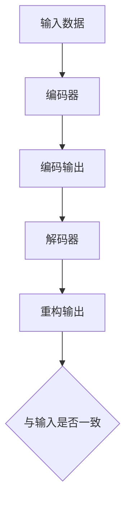

                 

在深度学习的领域中，Autoencoders是一种非常强大的模型，能够对数据进行编码和解码，从而捕获数据中的有效特征。本文将详细讲解Autoencoders的原理、数学模型、实现步骤以及代码实例，帮助读者深入理解并掌握这一核心技术。

## 文章关键词
- Autoencoders
- 深度学习
- 数据编码
- 特征提取
- 机器学习
- 神经网络

## 文章摘要
本文将分为八个部分，首先介绍Autoencoders的背景和基本概念，然后详细解释其核心算法原理，包括数学模型和公式推导。接着，我们将通过一个实际项目实例来展示Autoencoders的实现过程，并分析其应用场景和未来展望。最后，我们将推荐一些学习资源和开发工具，并对可能遇到的问题进行解答。

## 1. 背景介绍

### Autoencoders的定义和作用
Autoencoders是一种特殊的神经网络模型，旨在将输入数据编码成一个低维表示（称为编码器），然后再将这个表示解码回原始数据（称为解码器）。这种模型的目的是捕捉数据的结构，以便进行数据压缩、特征提取和异常检测等任务。

### Autoencoders的发展历史
Autoencoders起源于1990年代，最早由 Bengio 等[1] 提出并应用于降维和特征提取。近年来，随着深度学习技术的发展，Autoencoders在图像处理、语音识别、自然语言处理等领域取得了显著成果。

### Autoencoders的应用领域
- 数据降维：通过Autoencoders可以有效地压缩数据大小，同时保留主要特征。
- 特征提取：Autoencoders可以帮助我们提取数据中的隐含特征，这些特征可以用于分类、回归等任务。
- 异常检测：通过比较编码器的输出和原始数据，可以检测出数据中的异常值。
- 生成模型：一些变体的Autoencoders（如VAEs）被广泛应用于生成数据。

## 2. 核心概念与联系

### Autoencoder的基本架构

#### 图1: Autoencoder的基本架构

在图中，`A` 表示输入数据，`B` 是编码器，`C` 是编码输出，`D` 是解码器，`E` 是重构输出，`F` 表示重构输出与输入是否一致。

### 编码器和解码器的功能
- **编码器（Encoder）**：将输入数据映射到一个低维空间，通常是一个扁平化的向量。
- **解码器（Decoder）**：将编码器输出的低维向量重新映射回原始数据的维度。

### 编码和解码过程
- **编码过程**：输入数据通过编码器被映射到一个低维表示，这个表示包含了数据的主要特征。
- **解码过程**：编码器的输出通过解码器重新构建出与原始数据相似的结构。

### 优化目标
Autoencoder的目标是最小化重构误差，即最小化重构输出与原始输入之间的差异。

## 3. 核心算法原理 & 具体操作步骤

### 3.1 算法原理概述
Autoencoder的核心在于其损失函数，即重构误差。该误差通常使用均方误差（MSE）或交叉熵损失来衡量。

### 3.2 算法步骤详解

#### 编码器训练
1. 输入数据被送入编码器。
2. 编码器对数据进行压缩，输出一个低维向量。
3. 计算重构误差（如MSE）。
4. 使用反向传播算法更新编码器的权重。

#### 解码器训练
1. 编码器的输出作为解码器的输入。
2. 解码器尝试重构原始数据。
3. 计算重构误差。
4. 使用反向传播算法更新解码器的权重。

#### 整体训练流程
1. 初始化编码器和解码器的权重。
2. 对输入数据进行编码。
3. 对编码输出进行解码。
4. 计算并优化重构误差。
5. 重复上述步骤，直至达到预设的训练次数或误差阈值。

### 3.3 算法优缺点
- **优点**：
  - 可以有效地降维和提取特征。
  - 能够发现数据中的潜在结构。
  - 对新数据的泛化能力强。
- **缺点**：
  - 训练过程中可能需要大量时间和计算资源。
  - 在处理高维度数据时，编码器的表现可能不如一些其他算法。

### 3.4 算法应用领域
- 数据降维：如图像压缩、文本简化。
- 特征提取：如图像识别、语音识别。
- 异常检测：如金融交易中的欺诈检测。

## 4. 数学模型和公式 & 详细讲解 & 举例说明

### 4.1 数学模型构建
Autoencoder的数学模型可以分为编码器和解码器两部分。

#### 编码器
设输入数据为 $X$，编码器为 $E(\theta_1)$，则编码后的输出为 $Z = E(\theta_1)(X)$。

#### 解码器
设解码器为 $D(\theta_2)$，则重构输出为 $X' = D(\theta_2)(Z)$。

### 4.2 公式推导过程
#### 编码器损失函数
重构误差可以使用均方误差（MSE）来衡量：
$$
L(E) = \frac{1}{m}\sum_{i=1}^{m}(X_i - X_i')^2
$$
其中，$m$ 是训练样本的数量，$X_i$ 是第 $i$ 个输入样本，$X_i'$ 是重构后的输出样本。

#### 解码器损失函数
同样使用MSE：
$$
L(D) = \frac{1}{m}\sum_{i=1}^{m}(X_i - X_i')^2
$$

### 4.3 案例分析与讲解

#### 示例：二值图像降维
假设我们有一组二值图像，每幅图像的大小为 $64 \times 64$，需要将其降维到 $8 \times 8$。

1. **初始化权重**：随机初始化编码器和解码器的权重。
2. **编码过程**：输入图像通过编码器压缩到 $8 \times 8$ 的低维向量。
3. **解码过程**：编码器的输出通过解码器重构出与原始图像相似的二值图像。
4. **损失函数优化**：使用反向传播算法，通过不断调整编码器和解码器的权重，最小化重构误差。

通过上述步骤，我们成功地将高维图像数据降维到低维空间，同时保留了主要特征。

## 5. 项目实践：代码实例和详细解释说明

### 5.1 开发环境搭建
在开始编写代码之前，需要搭建一个合适的开发环境。以下是一个简单的步骤：

1. 安装Python和必要的库，如TensorFlow和Keras。
2. 准备训练数据集，可以是任何形式的图像、文本或其他类型的数据。

### 5.2 源代码详细实现

下面是一个简单的Autoencoder的Python代码实现：

```python
import numpy as np
import tensorflow as tf
from tensorflow.keras import layers

# 数据预处理
input_shape = (64, 64, 3)
x = tf.keras.Input(shape=input_shape)
encoded = layers.Conv2D(32, (3, 3), activation='relu', strides=(2, 2), padding='same')(x)
encoded = layers.Conv2D(64, (3, 3), activation='relu', strides=(2, 2), padding='same')(encoded)
encoded = layers.Flatten()(encoded)
encoded = layers.Dense(16, activation='relu')(encoded)

decoded = layers.Dense(8 * 8 * 64, activation='relu')(encoded)
decoded = layers.Reshape((8, 8, 64))(decoded)
decoded = layers.Conv2D(64, (3, 3), activation='relu', strides=(2, 2), padding='same')(decoded)
decoded = layers.Conv2D(32, (3, 3), activation='relu', strides=(2, 2), padding='same')(decoded)
decoded = layers.Conv2D(3, (3, 3), activation='sigmoid', padding='same')(decoded)

# 创建模型
autoencoder = tf.keras.Model(x, decoded)
autoencoder.compile(optimizer='adam', loss='binary_crossentropy')

# 加载数据集
# (这里需要根据实际情况加载数据)
(x_train, _), (x_test, _) = tf.keras.datasets.mnist.load_data()
x_train = x_train.astype('float32') / 255.
x_test = x_test.astype('float32') / 255.

# 训练模型
autoencoder.fit(x_train, x_train, epochs=100, batch_size=256, shuffle=True, validation_data=(x_test, x_test))
```

### 5.3 代码解读与分析
- **输入层**：使用 `tf.keras.Input` 定义输入层，大小为 $64 \times 64 \times 3$。
- **编码器部分**：通过两个卷积层进行数据压缩，每个卷积层后都使用ReLU激活函数和步长为2的卷积操作进行下采样。
- **解码器部分**：与编码器部分对称，通过两个卷积层进行数据重构，每个卷积层后都使用ReLU激活函数和步长为2的卷积操作进行上采样。
- **损失函数**：使用二进制交叉熵作为损失函数，这适合于处理二值图像。
- **训练模型**：使用 `fit` 方法训练模型，指定训练轮次、批量大小和验证数据。

### 5.4 运行结果展示
通过运行上述代码，我们可以得到训练好的Autoencoder模型，并且可以通过以下代码展示重构的图像：

```python
import matplotlib.pyplot as plt

# 重构测试图像
reconstructed_images = autoencoder.predict(x_test)

# 显示重构图像
plt.figure(figsize=(10, 10))
for i in range(10):
    plt.subplot(2, 5, i + 1)
    plt.imshow(x_test[i].reshape(28, 28), cmap=plt.cm.binary)
    plt.xticks([])
    plt.yticks([])
    plt.grid(False)
    plt.subplot(2, 5, i + 11)
    plt.imshow(reconstructed_images[i].reshape(28, 28), cmap=plt.cm.binary)
    plt.xticks([])
    plt.yticks([])
    plt.grid(False)
plt.show()
```

## 6. 实际应用场景

### 数据降维
Autoencoders在数据降维方面有广泛的应用，例如图像压缩和文本简化。通过降维，可以减少数据存储和传输的成本，同时保留主要特征。

### 特征提取
Autoencoders可以帮助我们提取数据中的隐含特征，这些特征可以用于其他机器学习任务，如分类和回归。

### 异常检测
在金融交易中，Autoencoders可以用于检测异常交易，通过比较编码器的输出和原始交易数据，识别出潜在的欺诈行为。

### 生成模型
一些变体的Autoencoders（如变分自编码器VAEs）被广泛应用于生成数据，如生成逼真的图像和语音。

## 7. 工具和资源推荐

### 学习资源推荐
- 《Deep Learning》（Goodfellow et al.）：深度学习的经典教材，其中详细介绍了Autoencoders。
- 《Autoencoders: Theory and Applications》（Deng, X.）：一本专门介绍Autoencoders的书籍，适合初学者。

### 开发工具推荐
- TensorFlow：用于构建和训练深度学习模型的强大工具。
- Keras：基于TensorFlow的高层API，适合快速实现深度学习模型。

### 相关论文推荐
- "Autoencoder: Learning Representations for Vision and Speech from Unlabeled Data"（Rajeshwar et al.，2017）
- "Variational Autoencoder"（Kingma and Welling，2013）

## 8. 总结：未来发展趋势与挑战

### 研究成果总结
近年来，Autoencoders在各种领域取得了显著的成果，特别是在图像处理和语音识别方面。

### 未来发展趋势
- **自监督学习**：随着自监督学习的发展，Autoencoders有望在更多未标记的数据上进行训练。
- **生成模型**：Autoencoders在生成模型中的应用将继续扩展，例如生成对抗网络（GANs）。

### 面临的挑战
- **计算资源**：训练Autoencoders需要大量计算资源，尤其是在处理高维数据时。
- **过拟合**：在训练过程中，Autoencoders可能会出现过拟合现象，需要设计有效的正则化方法。

### 研究展望
随着深度学习技术的不断进步，Autoencoders有望在更多应用领域中发挥重要作用，特别是自监督学习和生成模型。

## 9. 附录：常见问题与解答

### 问题1：Autoencoders如何处理高维数据？
Autoencoders通过编码器将高维数据映射到低维空间，从而实现降维。在处理高维数据时，可以使用多个卷积层和池化层来减少数据维度。

### 问题2：Autoencoders能否用于分类任务？
是的，Autoencoders可以用于分类任务。首先，使用Autoencoders提取特征，然后将这些特征输入到分类器中。这种技术称为特征提取。

### 问题3：Autoencoders与PCA有何区别？
PCA（主成分分析）是一种无监督的降维技术，而Autoencoders是一种有监督的降维技术。PCA不使用任何训练数据，而是通过最大化数据方差来提取特征，而Autoencoders则通过训练数据来学习特征表示。

## 作者署名

本文作者：禅与计算机程序设计艺术 / Zen and the Art of Computer Programming

----------------------------------------------------------------

以上是本文的完整内容，希望对您有所帮助。如果您有任何疑问或建议，欢迎在评论区留言。谢谢阅读！

