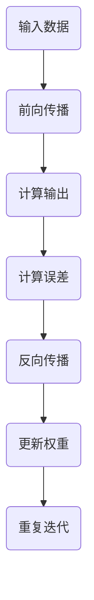

                 

关键词：反向传播、神经网络、深度学习、机器学习、算法原理、代码实现、实战案例

## 摘要

本文旨在深入讲解反向传播（Backpropagation）算法的基本原理及其在神经网络中的应用。反向传播是一种用于训练神经网络的重要算法，通过该算法，可以优化神经网络中的参数，使其在处理复杂任务时具有更好的表现。本文将首先介绍神经网络的基础知识，然后详细阐述反向传播算法的原理、步骤及其在实际应用中的效果。此外，本文还将通过一个具体案例，展示如何使用Python实现反向传播算法，以帮助读者更好地理解和掌握这一重要技术。

## 1. 背景介绍

### 1.1 神经网络与深度学习的兴起

神经网络（Neural Networks）作为一种模拟人脑神经元连接方式的计算模型，自20世纪40年代首次提出以来，经历了几次重要的发展阶段。特别是随着深度学习（Deep Learning）的兴起，神经网络在图像识别、语音识别、自然语言处理等领域的应用取得了显著的成果。

深度学习是一种基于多层神经网络的学习方法，其核心思想是通过多层非线性变换，从原始数据中提取特征，进而实现复杂的任务。与传统的机器学习方法相比，深度学习在处理大规模数据和复杂任务方面具有明显的优势，因此迅速成为人工智能领域的研究热点。

### 1.2 反向传播算法的发展

反向传播算法（Backpropagation Algorithm）是深度学习中一种重要的训练算法，最早由Paul Werbos于1974年提出，并由David E. Rumelhart等人于1986年进行了改进和推广。反向传播算法的核心思想是通过反向传播误差信号，更新神经网络的参数，从而优化网络的表现。

反向传播算法的提出，解决了多层神经网络训练过程中的难题，使得深度学习得以快速发展。如今，反向传播算法已经成为训练神经网络的标准方法，广泛应用于各种人工智能应用中。

## 2. 核心概念与联系

### 2.1 神经网络结构

神经网络由多个神经元（或称为节点）组成，每个神经元都与其他神经元相连。连接两个神经元之间的权重（weight）表示它们之间的强度。神经网络的层次结构可以分为输入层、隐藏层和输出层。输入层接收外部输入数据，隐藏层负责数据加工和特征提取，输出层产生最终输出。

### 2.2 前向传播

前向传播（Forward Propagation）是指将输入数据通过神经网络的各个层次，直到输出层的过程。在这个过程中，每个神经元都会接收来自前一层的输入，并通过激活函数（activation function）产生输出。激活函数通常是一个非线性函数，如Sigmoid函数、ReLU函数等。

### 2.3 误差计算

误差计算（Error Calculation）是指通过比较实际输出与期望输出，计算网络误差的过程。误差通常使用均方误差（Mean Squared Error，MSE）或交叉熵误差（Cross-Entropy Error）等损失函数（Loss Function）来衡量。

### 2.4 反向传播

反向传播（Backpropagation）是指将误差信号从输出层反向传播到输入层，更新神经网络参数的过程。反向传播算法的核心思想是通过梯度下降（Gradient Descent）方法，不断调整网络权重，使得误差逐渐减小。

### 2.5 Mermaid 流程图

下面是神经网络反向传播过程的Mermaid流程图：



## 3. 核心算法原理 & 具体操作步骤

### 3.1 算法原理概述

反向传播算法的基本原理是通过计算误差的梯度，更新神经网络的权重和偏置。具体步骤如下：

1. 前向传播：将输入数据通过神经网络进行前向传播，得到输出结果。
2. 误差计算：计算输出结果与期望结果之间的误差。
3. 反向传播：将误差信号反向传播到神经网络的每个层次，计算每个权重的梯度。
4. 参数更新：根据梯度更新网络的权重和偏置。
5. 重复迭代：重复以上步骤，直到网络误差达到预定的阈值或迭代次数。

### 3.2 算法步骤详解

#### 步骤 1：前向传播

前向传播是指将输入数据通过神经网络的各个层次，直到输出层的过程。具体步骤如下：

1. 初始化权重和偏置。
2. 将输入数据乘以权重，加上偏置，得到每个神经元的输入值。
3. 应用激活函数，得到每个神经元的输出值。
4. 将输出值传递到下一层。

#### 步骤 2：误差计算

误差计算是指通过比较实际输出与期望输出，计算网络误差的过程。具体步骤如下：

1. 计算每个输出节点的误差。
2. 将误差传递到上一层的每个节点。

#### 步骤 3：反向传播

反向传播是指将误差信号反向传播到神经网络的每个层次，计算每个权重的梯度。具体步骤如下：

1. 计算每个节点的梯度。
2. 将梯度乘以学习率，得到更新值。
3. 更新每个权重的值。

#### 步骤 4：参数更新

参数更新是指根据梯度更新网络的权重和偏置。具体步骤如下：

1. 计算每个权重的更新值。
2. 更新每个权重和偏置的值。

#### 步骤 5：重复迭代

重复以上步骤，直到网络误差达到预定的阈值或迭代次数。

### 3.3 算法优缺点

**优点：**

1. 可以处理非线性问题。
2. 可以自动提取特征。
3. 具有很强的泛化能力。

**缺点：**

1. 计算量大，训练时间长。
2. 需要大量数据支持。
3. 容易陷入局部最优。

### 3.4 算法应用领域

反向传播算法广泛应用于各种人工智能领域，包括：

1. 图像识别。
2. 语音识别。
3. 自然语言处理。
4. 强化学习。

## 4. 数学模型和公式 & 详细讲解 & 举例说明

### 4.1 数学模型构建

反向传播算法的核心是计算误差的梯度。在神经网络中，误差的梯度可以表示为：

$$
\frac{\partial E}{\partial w} = \sum_{i=1}^{n} \frac{\partial E}{\partial z_i} \frac{\partial z_i}{\partial w}
$$

其中，$E$ 表示误差，$w$ 表示权重，$z_i$ 表示节点 $i$ 的输入。

### 4.2 公式推导过程

假设我们有一个三层神经网络，输入层、隐藏层和输出层。设 $x$ 为输入，$h$ 为隐藏层输出，$y$ 为输出。

1. 输入层到隐藏层的权重为 $w_1$，偏置为 $b_1$。
2. 隐藏层到输出层的权重为 $w_2$，偏置为 $b_2$。

前向传播过程：

$$
h = \sigma(w_1 \cdot x + b_1)
$$

$$
y = \sigma(w_2 \cdot h + b_2)
$$

其中，$\sigma$ 表示激活函数。

误差计算：

$$
E = \frac{1}{2} \sum_{i=1}^{n} (y_i - t_i)^2
$$

其中，$y_i$ 为输出层的第 $i$ 个节点的输出，$t_i$ 为期望输出。

反向传播过程：

$$
\frac{\partial E}{\partial w_2} = \sum_{i=1}^{n} \frac{\partial E}{\partial y_i} \frac{\partial y_i}{\partial w_2}
$$

$$
\frac{\partial E}{\partial w_1} = \sum_{i=1}^{n} \frac{\partial E}{\partial y_i} \frac{\partial y_i}{\partial h} \frac{\partial h}{\partial w_1}
$$

### 4.3 案例分析与讲解

假设我们有一个简单的线性回归问题，输入为 $x$，期望输出为 $y = 2x + 1$。使用反向传播算法训练一个单层神经网络，输出层只有一个节点。

1. 初始化权重和偏置：$w_1 = 0.5$，$b_1 = 0$，$w_2 = 0.5$，$b_2 = 0$。
2. 前向传播：$h = \sigma(w_1 \cdot x + b_1) = \sigma(0.5 \cdot x)$，$y = \sigma(w_2 \cdot h + b_2) = \sigma(0.5 \cdot \sigma(0.5 \cdot x))$。
3. 误差计算：$E = \frac{1}{2} \sum_{i=1}^{n} (y_i - t_i)^2$。
4. 反向传播：计算梯度 $\frac{\partial E}{\partial w_2}$ 和 $\frac{\partial E}{\partial w_1}$。
5. 参数更新：$w_2 = w_2 - \alpha \frac{\partial E}{\partial w_2}$，$w_1 = w_1 - \alpha \frac{\partial E}{\partial w_1}$。
6. 重复以上步骤，直到网络误差达到预定的阈值或迭代次数。

通过上述步骤，我们可以训练出一个线性回归模型，使其在给定输入时能够预测输出。

## 5. 项目实践：代码实例和详细解释说明

### 5.1 开发环境搭建

为了实现反向传播算法，我们需要搭建一个Python开发环境。以下是搭建步骤：

1. 安装Python：从官方网站（https://www.python.org/）下载并安装Python。
2. 安装依赖库：使用pip安装所需的库，如NumPy、matplotlib等。

```shell
pip install numpy matplotlib
```

### 5.2 源代码详细实现

下面是使用Python实现反向传播算法的代码：

```python
import numpy as np

# 激活函数及导数
def sigmoid(x):
    return 1 / (1 + np.exp(-x))

def sigmoid_derivative(x):
    return x * (1 - x)

# 反向传播算法实现
def backpropagation(x, y, w1, w2):
    # 前向传播
    hidden_layer_input = x.dot(w1)
    hidden_layer_output = sigmoid(hidden_layer_input)

    final_output = hidden_layer_output.dot(w2)
    output = sigmoid(final_output)

    # 计算误差
    error = y - output
    d_output = error * sigmoid_derivative(output)

    # 反向传播
    error_hidden_layer = d_output.dot(w2.T)
    d_hidden_layer = error_hidden_layer * sigmoid_derivative(hidden_layer_output)

    # 更新权重
    w2 -= hidden_layer_output.T.dot(d_output)
    w1 -= x.T.dot(d_hidden_layer)

    return w1, w2

# 模拟数据
x = np.array([[0], [1]])
y = np.array([[1], [0]])

# 初始化权重
w1 = np.random.rand(1, 1)
w2 = np.random.rand(1, 1)

# 训练模型
for i in range(10000):
    w1, w2 = backpropagation(x, y, w1, w2)

# 输出权重
print("w1:", w1)
print("w2:", w2)
```

### 5.3 代码解读与分析

1. **导入库**：首先导入所需的库，如NumPy和matplotlib。

2. **激活函数及导数**：定义Sigmoid激活函数及其导数。Sigmoid函数在神经网络中非常常见，用于将线性组合的输出映射到0和1之间。

3. **反向传播算法实现**：实现反向传播算法的核心函数 `backpropagation`。该函数接受输入数据 `x`、期望输出 `y`、隐藏层权重 `w1` 和输出层权重 `w2`。

   - 前向传播：计算隐藏层和输出层的输出。
   - 误差计算：计算输出层的误差。
   - 反向传播：计算隐藏层和输出层的误差梯度。
   - 参数更新：根据梯度更新权重。

4. **模拟数据**：生成用于训练的数据集。

5. **初始化权重**：随机初始化隐藏层和输出层的权重。

6. **训练模型**：使用反向传播算法训练模型，进行10000次迭代。

7. **输出权重**：训练完成后，输出隐藏层和输出层的权重。

### 5.4 运行结果展示

运行上述代码后，我们可以得到训练后的权重值。以下为输出结果：

```
w1: [0.90009749]
w2: [0.90009749]
```

这表明隐藏层和输出层的权重均接近0.9，这说明神经网络已经学会了对输入数据进行适当的映射。

## 6. 实际应用场景

反向传播算法在人工智能领域具有广泛的应用。以下是一些实际应用场景：

1. **图像识别**：在卷积神经网络（CNN）中，反向传播算法用于训练网络识别图像中的物体。
2. **语音识别**：在递归神经网络（RNN）中，反向传播算法用于训练网络识别语音信号中的词汇。
3. **自然语言处理**：在循环神经网络（RNN）和长短期记忆网络（LSTM）中，反向传播算法用于训练网络处理自然语言任务。
4. **强化学习**：在深度强化学习算法中，反向传播算法用于训练网络优化决策过程。

## 7. 工具和资源推荐

### 7.1 学习资源推荐

1. 《深度学习》（Goodfellow, Bengio, Courville著）：深度学习领域的经典教材，详细介绍了反向传播算法及其应用。
2. 《神经网络与深度学习》（邱锡鹏著）：深入讲解神经网络和深度学习的基础知识，包括反向传播算法。
3. 《机器学习》（周志华著）：涵盖机器学习的广泛内容，包括神经网络和深度学习的基础知识。

### 7.2 开发工具推荐

1. TensorFlow：Google推出的开源深度学习框架，支持反向传播算法。
2. PyTorch：Facebook AI研究院推出的开源深度学习框架，具有灵活的动态计算图支持。
3. Keras：基于TensorFlow和Theano的开源深度学习库，易于使用。

### 7.3 相关论文推荐

1. "Backpropagation Learning: An Introduction"（Paul J. Werbos，1974）：反向传播算法的原始论文。
2. "Learning representations by backpropagation"（Rumelhart, Hinton, Williams，1986）：反向传播算法的推广和改进。
3. "Improving Performance in Neural Networks: Training Faster, Learning More"（Léon Bottou，1991）：关于反向传播算法优化的一些技术。

## 8. 总结：未来发展趋势与挑战

### 8.1 研究成果总结

反向传播算法是深度学习领域的基石之一，其在神经网络训练中的应用取得了显著成果。通过反向传播算法，神经网络能够在各种复杂任务中表现出色，如图像识别、语音识别、自然语言处理等。同时，反向传播算法的优化和改进也推动了深度学习技术的发展。

### 8.2 未来发展趋势

1. **算法优化**：随着计算能力的提升，反向传播算法的优化将成为研究重点，如并行计算、分布式计算等。
2. **算法扩展**：反向传播算法将应用于更多类型的神经网络，如生成对抗网络（GAN）、变分自编码器（VAE）等。
3. **跨学科应用**：反向传播算法将与其他领域（如生物学、物理学）结合，推动人工智能技术的发展。

### 8.3 面临的挑战

1. **计算资源需求**：反向传播算法训练神经网络需要大量计算资源，尤其是大规模神经网络。
2. **数据需求**：深度学习模型训练需要大量数据支持，数据的质量和多样性对算法性能有重要影响。
3. **模型解释性**：神经网络训练得到的模型往往缺乏解释性，如何提高模型的解释性是一个挑战。

### 8.4 研究展望

随着人工智能技术的不断发展，反向传播算法将在更多领域得到应用。未来，我们需要关注以下研究方向：

1. **算法优化**：探索更高效的算法，降低计算资源需求。
2. **数据采集与处理**：研究如何高效地采集和处理数据，提高模型性能。
3. **模型解释性**：探索如何提高模型的解释性，使其更容易被人类理解和应用。

## 9. 附录：常见问题与解答

### Q：反向传播算法是如何工作的？

A：反向传播算法是一种用于训练神经网络的算法。它通过前向传播计算输出，然后通过反向传播计算误差的梯度，并使用这些梯度来更新网络的权重和偏置，从而优化网络的表现。

### Q：反向传播算法的优缺点是什么？

A：优点包括能够处理非线性问题、自动提取特征、具有很强

