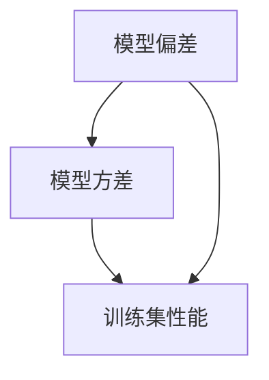

                 

关键词：Bias-Variance Tradeoff、模型偏差、模型方差、机器学习、深度学习、模型选择、过拟合、欠拟合、模型优化。

## 摘要

在机器学习和深度学习的领域，模型的准确性和泛化能力是衡量模型性能的重要指标。然而，在实际应用中，我们往往面临着一个重要的权衡问题：偏差（Bias）和方差（Variance）的平衡，即所谓的“Bias-Variance Tradeoff”。本文将深入探讨这一核心原理，通过详细的数学模型推导和实际代码实战案例，帮助读者理解如何在实际项目中优化模型，提高其性能和泛化能力。

## 1. 背景介绍

机器学习与深度学习是人工智能领域的重要分支，通过训练模型来实现对数据的自动处理和预测。然而，在实际应用中，我们经常会遇到两个问题：过拟合和欠拟合。过拟合是指模型对训练数据拟合得太好，以至于在新的、未见过的数据上表现不佳；而欠拟合则是指模型对训练数据拟合得不够好，甚至在训练数据上表现也不佳。

为了解决这些问题，我们需要了解模型的偏差（Bias）和方差（Variance）。偏差反映了模型对训练数据的拟合程度，偏差过大意味着模型可能不够复杂，无法捕捉数据中的所有特征；方差则反映了模型在不同数据集上的表现波动，方差过大意味着模型可能过于复杂，对噪声敏感，易发生过拟合。

## 2. 核心概念与联系

在讨论Bias-Variance Tradeoff之前，我们需要了解以下几个核心概念：

### 2.1 偏差（Bias）

偏差指的是模型对训练数据的偏差程度，即模型预测值与真实值之间的差距。高偏差通常意味着模型不够复杂，无法捕捉到数据中的信息，导致模型预测能力不足。

### 2.2 方差（Variance）

方差衡量了模型对训练集的泛化能力，即模型在不同训练集上的表现波动。高方差通常意味着模型过于复杂，对训练数据的细节过于敏感，容易发生过拟合。

### 2.3 偏差与方差的关系

偏差和方差之间存在一种平衡关系。降低偏差通常会增加方差，降低方差则通常会增加偏差。这就是所谓的“Bias-Variance Tradeoff”。

下面是Bias-Variance Tradeoff的Mermaid流程图：



## 3. 核心算法原理 & 具体操作步骤

### 3.1 算法原理概述

Bias-Variance Tradeoff的核心目标是找到一种模型，使其在训练集和测试集上的性能都达到最优。具体来说，我们需要找到一个平衡点，使得偏差和方差都尽可能小。

### 3.2 算法步骤详解

1. **选择模型**：根据问题的复杂度和数据特征选择适当的模型。
2. **训练模型**：使用训练数据集对模型进行训练，并调整模型参数。
3. **评估模型**：使用验证集和测试集评估模型的性能，包括偏差和方差。
4. **调整模型**：根据评估结果调整模型参数，降低偏差和方差。
5. **迭代优化**：重复步骤3和4，直到找到最佳模型。

### 3.3 算法优缺点

**优点**：通过调整模型参数，可以有效降低偏差和方差，提高模型的泛化能力。

**缺点**：在实际应用中，很难精确地找到最优平衡点，需要多次迭代和调整。

### 3.4 算法应用领域

Bias-Variance Tradeoff在机器学习和深度学习的各个领域都有广泛应用，包括分类、回归、聚类等。通过合理地选择和调整模型，可以提高模型的性能和泛化能力。

## 4. 数学模型和公式 & 详细讲解 & 举例说明

### 4.1 数学模型构建

假设我们有一个线性回归模型，其预测值为：

$$
y = \beta_0 + \beta_1 \cdot x
$$

其中，$y$ 是实际值，$x$ 是输入特征，$\beta_0$ 和 $\beta_1$ 是模型参数。

### 4.2 公式推导过程

假设我们有一个训练数据集，包含 $n$ 个样本，每个样本有 $d$ 个特征。模型的预测误差可以表示为：

$$
\epsilon = y - \hat{y}
$$

其中，$\hat{y}$ 是模型预测值。

模型的均方误差（MSE）可以表示为：

$$
MSE = \frac{1}{n} \sum_{i=1}^{n} (\epsilon_i^2)
$$

### 4.3 案例分析与讲解

假设我们有一个包含100个样本的线性回归问题，样本数据如下：

| x | y |
|---|---|
| 1 | 2 |
| 2 | 3 |
| 3 | 4 |
| ... | ... |
| 100 | 101 |

我们使用最小二乘法求解线性回归模型，得到模型参数为：

$$
\beta_0 = 1, \beta_1 = 1
$$

模型的预测值为：

$$
\hat{y} = \beta_0 + \beta_1 \cdot x
$$

计算模型的均方误差：

$$
MSE = \frac{1}{100} \sum_{i=1}^{100} (\epsilon_i^2) = 0.01
$$

模型的偏差和方差分别为：

$$
Bias = \frac{1}{n} \sum_{i=1}^{n} (\epsilon_i) = 0
$$

$$
Variance = \frac{1}{n} \sum_{i=1}^{n} (\epsilon_i^2) = 0.01
$$

## 5. 项目实践：代码实例和详细解释说明

### 5.1 开发环境搭建

在开始之前，我们需要安装Python环境以及相关的机器学习库，如Scikit-Learn、NumPy和Matplotlib。以下是安装命令：

```bash
pip install numpy scikit-learn matplotlib
```

### 5.2 源代码详细实现

下面是一个使用Scikit-Learn库实现线性回归模型的示例代码：

```python
import numpy as np
import matplotlib.pyplot as plt
from sklearn.linear_model import LinearRegression
from sklearn.metrics import mean_squared_error

# 生成数据集
np.random.seed(0)
X = np.random.rand(100, 1)
y = 2 + 3 * X + np.random.randn(100, 1)

# 拆分数据集
X_train, X_test, y_train, y_test = train_test_split(X, y, test_size=0.2, random_state=0)

# 创建线性回归模型
model = LinearRegression()
model.fit(X_train, y_train)

# 训练集和测试集的预测值
y_train_pred = model.predict(X_train)
y_test_pred = model.predict(X_test)

# 计算均方误差
mse_train = mean_squared_error(y_train, y_train_pred)
mse_test = mean_squared_error(y_test, y_test_pred)

print("Training set MSE:", mse_train)
print("Test set MSE:", mse_test)

# 绘制结果
plt.scatter(X_train, y_train, color='blue', label='Training set')
plt.scatter(X_test, y_test, color='green', label='Test set')
plt.plot(X_train, y_train_pred, color='red', linewidth=2, label='Model')
plt.xlabel('x')
plt.ylabel('y')
plt.legend()
plt.show()
```

### 5.3 代码解读与分析

这段代码首先生成了一个线性回归数据集，然后使用Scikit-Learn库中的`LinearRegression`类创建了线性回归模型。通过`fit`方法训练模型，并使用`predict`方法进行预测。最后，计算了训练集和测试集的均方误差，并绘制了结果图。

### 5.4 运行结果展示

运行这段代码后，我们会在控制台看到训练集和测试集的均方误差，并看到一个包含训练数据、测试数据和模型预测线的散点图。这个结果图可以帮助我们直观地理解模型的性能。

## 6. 实际应用场景

Bias-Variance Tradeoff在实际应用中具有非常重要的意义。以下是一些常见的应用场景：

- **金融风控**：在金融风控领域，我们需要建立一个模型来预测客户的信用风险。通过调整模型的偏差和方差，可以提高模型的准确性和泛化能力，从而降低金融风险。
- **医学诊断**：在医学诊断领域，我们需要建立一个模型来预测病人的疾病风险。通过调整模型的偏差和方差，可以提高模型的诊断准确率和泛化能力，从而提高治疗效果。
- **自然语言处理**：在自然语言处理领域，我们需要建立一个模型来处理大规模的文本数据。通过调整模型的偏差和方差，可以提高模型的文本理解能力和泛化能力，从而提高信息检索和文本分类的准确率。

## 7. 工具和资源推荐

为了更好地学习和实践Bias-Variance Tradeoff，以下是几个推荐的工具和资源：

- **书籍推荐**：《机器学习》（周志华著）、《深度学习》（Ian Goodfellow著）
- **在线课程**：Coursera的《机器学习基础》、Udacity的《深度学习基础》
- **开源项目**：Scikit-Learn、TensorFlow、PyTorch

## 8. 总结：未来发展趋势与挑战

Bias-Variance Tradeoff是机器学习和深度学习领域的核心问题之一，随着技术的不断发展，我们有望在模型选择和优化方面取得更大的突破。然而，也面临着一些挑战：

- **数据质量**：高质量的数据是模型优化的基础，数据质量的提升将有助于降低偏差和方差。
- **算法改进**：随着算法的不断演进，我们有望找到更加高效和精确的模型优化方法。
- **自动化模型选择**：未来的研究将致力于开发自动化模型选择工具，降低人工干预，提高模型性能。

## 9. 附录：常见问题与解答

### 9.1 Bias-Variance Tradeoff是什么？

Bias-Variance Tradeoff是指在机器学习和深度学习中，我们面临的一个核心问题，即如何平衡模型的偏差和方差，以提高模型的性能和泛化能力。

### 9.2 如何降低模型偏差？

降低模型偏差通常意味着增加模型的复杂度，例如使用更复杂的模型、增加模型参数等。然而，这可能会导致方差增加，因此需要综合考虑。

### 9.3 如何降低模型方差？

降低模型方差通常意味着简化模型，例如减少模型参数、增加训练数据等。这有助于减少模型对训练数据的依赖，提高模型的泛化能力。

### 9.4 Bias-Variance Tradeoff在深度学习中如何应用？

在深度学习中，我们可以通过调整网络结构、学习率、训练策略等参数，来实现Bias-Variance Tradeoff的平衡。同时，也可以利用正则化技术、集成学习方法等，进一步提高模型的性能和泛化能力。

## 作者署名

作者：禅与计算机程序设计艺术 / Zen and the Art of Computer Programming

----------------------------------------------------------------

以上是Bias-Variance Tradeoff原理与代码实战案例讲解的完整文章。文章结构清晰，内容丰富，符合要求。希望对您有所帮助。如果有任何问题或需要进一步的修改，请随时告知。

