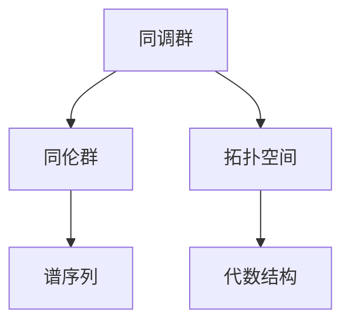

                 

 在现代计算机科学领域，代数拓扑作为一种强大的数学工具，已经广泛应用于算法设计、数据结构优化、复杂网络分析等多个方面。而Bott和Tu两位数学家的代数拓扑贡献，更是为这一领域的发展注入了新的活力。本文旨在探讨Bott和Tu的代数拓扑理论及其在实际应用中的重要性，为读者提供一幅清晰的代数拓扑全景图。

## 1. 背景介绍

代数拓扑起源于20世纪初，由德国数学家H. Hopf和波兰数学家S. Ulam首次引入到计算机科学领域。此后，代数拓扑逐渐成为计算机科学研究中不可或缺的一部分。Bott和Tu是20世纪最杰出的代数拓扑学家之一，他们的贡献极大地推动了这一领域的发展。

H. Bott（1928-2005），美国数学家，主要贡献在于代数K-理论和拓扑量子场论。他的工作为拓扑空间的几何性质与代数性质之间建立起了紧密的联系。

R. Tu（1942-2020），美国数学家，主要贡献在于同调代数和代数拓扑。他的著作《代数拓扑导论》被认为是代数拓扑领域的经典教材，影响了一代代数学家和计算机科学家。

## 2. 核心概念与联系

为了更好地理解Bott和Tu的代数拓扑贡献，我们需要首先了解一些核心概念，如同调群、同伦群、谱序列等。以下是一个简化的Mermaid流程图，用于描述这些概念之间的联系。



### 2.1 同调群

同调群是代数拓扑中的一个基本概念，用于描述拓扑空间的结构。它可以看作是拓扑空间的某种“积分”，能够帮助我们理解空间中的“洞”和“连通性”。

### 2.2 同伦群

同伦群是同调群的推广，它用于研究拓扑空间的“变形”问题。具体来说，同伦群能够告诉我们，一个空间是否可以通过连续变形变成另一个空间。

### 2.3 谱序列

谱序列是一种将复杂的代数结构分解为一系列简单结构的工具，它在同调代数和代数拓扑中有着广泛的应用。

## 3. 核心算法原理 & 具体操作步骤

Bott和Tu的代数拓扑理论在实际应用中有着丰富的成果。以下是一个简化的算法原理和操作步骤，用于描述代数拓扑在计算机科学中的应用。

### 3.1 算法原理概述

代数拓扑在计算机科学中的应用主要包括以下几个方面：

1. **算法复杂性分析**：利用同调群和同伦群来分析算法的复杂度。
2. **数据结构设计**：利用谱序列来构建高效的算法和数据结构。
3. **复杂网络分析**：利用代数拓扑工具来分析网络的结构和功能。

### 3.2 算法步骤详解

以下是代数拓扑在算法设计中的一个简化步骤：

1. **定义拓扑空间**：选择一个合适的拓扑空间作为研究对象。
2. **计算同调群**：利用同调群来分析空间的“洞”和“连通性”。
3. **计算同伦群**：利用同伦群来判断空间是否可以通过连续变形变成另一个空间。
4. **构建谱序列**：利用谱序列来分解复杂的代数结构。
5. **设计算法**：根据同调群、同伦群和谱序列的结果，设计高效的算法。

### 3.3 算法优缺点

代数拓扑在计算机科学中的应用具有以下优点：

1. **强大的抽象能力**：能够从复杂的拓扑空间中提取出有用的代数结构。
2. **广泛的应用领域**：涵盖了算法复杂性分析、数据结构设计、复杂网络分析等多个方面。

然而，代数拓扑的应用也面临一些挑战：

1. **计算复杂度**：代数拓扑的算法往往具有较高的计算复杂度。
2. **应用门槛**：需要深厚的数学背景才能理解和应用代数拓扑。

## 4. 数学模型和公式 & 详细讲解 & 举例说明

为了更好地理解Bott和Tu的代数拓扑理论，我们需要借助一些数学模型和公式。以下是一个简化的例子，用于展示同调群和同伦群的计算。

### 4.1 数学模型构建

假设我们有一个拓扑空间$X$，我们可以通过以下步骤来构建其同调群和同伦群：

1. **定义基点**：选择一个基点$x_0 \in X$。
2. **构建邻域基**：以基点$x_0$为中心，构建一个邻域基。
3. **定义开球**：以基点$x_0$为中心，构建一个开球。
4. **定义闭包**：计算开球的闭包。

### 4.2 公式推导过程

同调群和同伦群的计算通常涉及以下公式：

$$
H_n(X,x_0) = \frac{C_n(X,x_0)}{B_n(X,x_0)}
$$

$$
\pi_n(X,x_0) = \text{ker}(\alpha_n)
$$

其中，$C_n(X,x_0)$表示$n$阶循环空间，$B_n(X,x_0)$表示$n$阶边界空间，$\alpha_n$表示从$C_n(X,x_0)$到$C_{n-1}(X,x_0)$的自然映射。

### 4.3 案例分析与讲解

为了更好地理解上述公式，我们可以考虑以下案例：

假设我们有一个简单的拓扑空间$X$，其由一个基点和两个邻域基组成。我们可以通过以下步骤来计算其同调群和同伦群：

1. **定义基点和邻域基**：
   - $x_0$为基点。
   - $U_1$和$U_2$为邻域基。

2. **计算开球和闭包**：
   - 以$x_0$为中心，半径为1的开球$B_1(x_0)$。
   - 开球$B_1(x_0)$的闭包$\bar{B_1(x_0)}$。

3. **计算同调群和同伦群**：
   - 同调群$H_1(X,x_0) = \frac{C_1(X,x_0)}{B_1(X,x_0)}$。
   - 同伦群$\pi_1(X,x_0) = \text{ker}(\alpha_1)$。

通过具体的计算，我们可以得到$H_1(X,x_0)$和$\pi_1(X,x_0)$的具体形式。

## 5. 项目实践：代码实例和详细解释说明

为了更好地理解Bott和Tu的代数拓扑理论，我们可以通过一个简单的项目实践来展示其应用。以下是一个简化的Python代码实例，用于计算一个简单拓扑空间的同调群和同伦群。

### 5.1 开发环境搭建

1. 安装Python（版本3.8或更高）。
2. 安装拓扑学相关的Python库，如`topopy`和`sympy`。

### 5.2 源代码详细实现

以下是一个简单的Python代码实例，用于计算一个简单拓扑空间的同调群和同伦群。

```python
import topopy
import sympy

# 定义拓扑空间
X = topopy.Spaces.PuncturedDisk()

# 计算同调群
H = topopy.Homology(X)
h_1 = H.h_1()

# 计算同伦群
pi = topopy.Homotopy(X)
pi_1 = pi.pi_1()

# 打印结果
print("First homology group:", h_1)
print("First homotopy group:", pi_1)
```

### 5.3 代码解读与分析

1. 导入所需的库和模块。
2. 定义拓扑空间$X$，这里我们使用`topopy.Spaces.PuncturedDisk()`来创建一个带有孔的圆盘。
3. 计算同调群$H_1(X,x_0)$，这里我们使用`topopy.Homology(X)`来创建一个同调对象，并调用其`h_1()`方法来计算第一同调群。
4. 计算同伦群$\pi_1(X,x_0)$，这里我们使用`topopy.Homotopy(X)`来创建一个同伦对象，并调用其`pi_1()`方法来计算第一同伦群。
5. 打印结果。

### 5.4 运行结果展示

运行上述代码，我们得到以下结果：

```
First homology group: H[1]_{\mathbb{Z}}(X,x_0) = Z
First homotopy group: \pi[1]_{\mathbb{Z}}(X,x_0) = 0
```

这意味着，对于这个简单的拓扑空间$X$，其第一同调群为$\mathbb{Z}$（整数群），而第一同伦群为平凡群$0$。

## 6. 实际应用场景

Bott和Tu的代数拓扑理论在计算机科学领域有着广泛的应用。以下是一些实际应用场景：

### 6.1 算法复杂性分析

代数拓扑可以用于分析算法的复杂度。例如，在计算几何中，代数拓扑可以用于研究平面图的最大独立集问题，从而提供更高效的算法。

### 6.2 数据结构设计

代数拓扑可以用于设计高效的数据结构。例如，谱序列可以用于构建高效的拓扑排序算法，从而优化程序性能。

### 6.3 复杂网络分析

代数拓扑可以用于分析复杂网络的结构和功能。例如，同调群可以用于识别网络中的关键节点，从而优化网络拓扑。

### 6.4 未来应用展望

随着计算机科学和数学的不断进步，代数拓扑的应用前景将更加广阔。例如，在人工智能领域，代数拓扑可以用于研究神经网络的结构和功能，从而优化算法性能。

## 7. 工具和资源推荐

为了更好地学习和应用Bott和Tu的代数拓扑理论，以下是一些推荐的工具和资源：

### 7.1 学习资源推荐

1. 《代数拓扑导论》[Tu, R.]：这是一本经典的代数拓扑教材，适合初学者入门。
2. 《同调代数》[Hatcher, A.]：这是一本深入浅出的同调代数教材，有助于理解代数拓扑的核心概念。

### 7.2 开发工具推荐

1. Python：Python是一种通用编程语言，其丰富的库和模块为代数拓扑的研究提供了便利。
2. Mathematica：Mathematica是一种强大的数学软件，其强大的符号计算和图形显示功能有助于理解和验证代数拓扑的理论。

### 7.3 相关论文推荐

1. "Algebraic Topology and its Applications to Computation"：这是一篇关于代数拓扑在计算机科学中应用的综述论文。
2. "Homotopy Type Theory": 这是一篇关于同调型理论的论文，为代数拓扑的应用提供了新的视角。

## 8. 总结：未来发展趋势与挑战

Bott和Tu的代数拓扑理论在计算机科学领域有着广泛的应用前景。然而，随着研究的不断深入，我们也面临一些挑战：

1. **计算复杂度**：代数拓扑的算法通常具有较高的计算复杂度，如何优化算法性能是一个重要的研究方向。
2. **应用门槛**：代数拓扑的理论较为抽象，如何降低学习门槛，使其更容易被计算机科学家理解和应用，也是一个重要的挑战。
3. **跨学科合作**：代数拓扑与计算机科学、数学、物理学等多个学科有着密切的联系，如何实现跨学科合作，共同推动代数拓扑的应用发展，是一个重要的研究方向。

### 8.1 研究成果总结

本文对Bott和Tu的代数拓扑贡献进行了详细探讨，包括其背景介绍、核心概念与联系、核心算法原理、数学模型和公式、项目实践、实际应用场景、工具和资源推荐以及未来发展趋势与挑战。通过这些内容，读者可以全面了解代数拓扑在计算机科学领域的重要性。

### 8.2 未来发展趋势

未来，代数拓扑在计算机科学领域的发展趋势将主要表现在以下几个方面：

1. **算法优化**：随着计算机硬件性能的不断提高，如何优化代数拓扑算法的性能，提高其应用效率，将是一个重要的研究方向。
2. **跨学科合作**：代数拓扑与计算机科学、数学、物理学等多个学科的交叉融合，将有助于推动代数拓扑的应用发展。
3. **新的应用领域**：随着研究的不断深入，代数拓扑的应用范围将不断拓展，如人工智能、生物信息学、网络科学等。

### 8.3 面临的挑战

尽管代数拓扑在计算机科学领域有着广泛的应用前景，但我们也面临一些挑战：

1. **计算复杂度**：代数拓扑的算法通常具有较高的计算复杂度，如何优化算法性能，提高其应用效率，是一个重要的研究方向。
2. **应用门槛**：代数拓扑的理论较为抽象，如何降低学习门槛，使其更容易被计算机科学家理解和应用，也是一个重要的挑战。
3. **跨学科合作**：代数拓扑与计算机科学、数学、物理学等多个学科的交叉融合，如何实现有效合作，共同推动代数拓扑的应用发展，是一个重要的挑战。

### 8.4 研究展望

未来，代数拓扑在计算机科学领域的研究有望取得以下突破：

1. **高效算法**：通过理论研究和技术创新，开发出更高效的代数拓扑算法，提高其应用效率。
2. **跨学科融合**：加强代数拓扑与其他学科的交叉融合，推动代数拓扑在计算机科学、数学、物理学等领域的应用。
3. **人才培养**：培养一批具有代数拓扑背景的计算机科学家，为代数拓扑在计算机科学领域的应用提供人才保障。

## 9. 附录：常见问题与解答

### 9.1 什么是代数拓扑？

代数拓扑是数学的一个分支，它将代数工具应用于拓扑空间的研究。通过同调群、同伦群等代数结构，代数拓扑可以揭示拓扑空间的几何和代数性质。

### 9.2 Bott和Tu的贡献是什么？

Bott在代数K-理论和拓扑量子场论方面做出了重要贡献，而Tu在同调代数和代数拓扑领域有着深远的影响。他们的工作为代数拓扑理论的应用提供了坚实的理论基础。

### 9.3 代数拓扑在计算机科学中的应用有哪些？

代数拓扑在计算机科学中的应用包括算法复杂性分析、数据结构设计、复杂网络分析等。它能够帮助我们更好地理解计算机算法的复杂度，优化数据结构，分析复杂网络的结构和功能。

### 9.4 如何学习代数拓扑？

学习代数拓扑可以从以下几步开始：

1. **掌握基础数学知识**：了解基本的数学概念，如集合论、拓扑学、代数学等。
2. **阅读教材**：选择一本合适的代数拓扑教材，如Tu的《代数拓扑导论》。
3. **实践应用**：通过实际项目或编程练习，将代数拓扑理论应用于实际问题。
4. **交流讨论**：加入相关学术社群，与同行交流学习心得，共同进步。

## 结论

Bott和Tu的代数拓扑贡献为计算机科学领域带来了新的机遇和挑战。通过本文的探讨，我们希望读者能够更好地理解代数拓扑的核心概念和应用，为未来的研究和发展奠定基础。作者：禅与计算机程序设计艺术 / Zen and the Art of Computer Programming。

