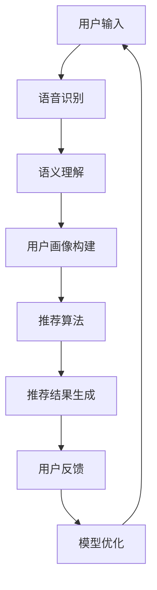

                 

随着人工智能和大数据技术的飞速发展，自然语言处理（NLP）和用户界面（UI）的结合逐渐成为提升用户体验的重要手段。在CUI（Conversational User Interface）中，个性化推荐是一种通过对话交互来满足用户个性化需求的有效方式。本文将探讨CUI中个性化推荐的概念、核心算法原理、数学模型及其在实际应用中的挑战和未来展望。

## 1. 背景介绍

CUI是一种通过自然语言进行交互的用户界面，它模拟人类对话，为用户提供更为自然和直观的交互体验。与传统UI相比，CUI能够动态地响应用户输入，提供更加个性化和高效的服务。随着智能手机、智能音箱和聊天机器人的普及，CUI的应用场景越来越广泛。

个性化推荐是CUI的一个重要应用领域。通过分析用户的兴趣和行为数据，个性化推荐系统能够为用户提供个性化的内容和服务，从而提升用户体验。例如，在电商平台上，个性化推荐可以帮助用户发现他们可能感兴趣的商品；在社交媒体上，个性化推荐可以帮助用户发现新的内容。

本文旨在探讨CUI中的个性化推荐技术，包括其核心算法原理、数学模型以及在实际应用中的挑战和未来展望。通过本文的探讨，读者将能够更深入地理解CUI中个性化推荐的工作原理和应用价值。

## 2. 核心概念与联系

### 2.1. 关键术语解释

- **CUI（Conversational User Interface）**：会话式用户界面，通过自然语言进行交互。
- **个性化推荐**：根据用户的兴趣、行为和偏好，为用户推荐个性化内容或服务。
- **用户画像**：基于用户的历史行为和偏好，构建的用户特征模型。
- **推荐算法**：用于生成个性化推荐结果的算法，如协同过滤、矩阵分解、基于内容的推荐等。

### 2.2. Mermaid 流程图

以下是CUI中个性化推荐流程的Mermaid流程图：



### 2.3. 关联概念

- **自然语言处理（NLP）**：用于理解用户输入的自然语言，并将其转化为机器可处理的形式。
- **机器学习（ML）**：用于训练推荐算法，以生成个性化的推荐结果。
- **用户行为分析**：通过分析用户的行为数据，如浏览历史、购买记录等，来构建用户画像。

## 3. 核心算法原理 & 具体操作步骤

### 3.1. 算法原理概述

个性化推荐算法的基本原理是通过分析用户的兴趣和行为数据，构建用户画像，然后利用这些画像来预测用户对某一内容或服务的兴趣，从而生成推荐结果。以下是几种常见的推荐算法：

- **协同过滤**：基于用户的历史行为数据，找到相似的用户或物品，并根据这些用户的偏好推荐相似的内容。
- **基于内容的推荐**：根据用户对某一内容的偏好，推荐相似的内容。
- **混合推荐**：结合多种推荐算法，以提升推荐效果。

### 3.2. 算法步骤详解

#### 3.2.1. 用户画像构建

用户画像构建的过程包括以下几个步骤：

1. **数据收集**：收集用户的历史行为数据，如浏览记录、购买记录等。
2. **特征提取**：从行为数据中提取用户的兴趣特征，如喜欢阅读的类型、偏好颜色等。
3. **建模**：使用机器学习算法，如聚类、分类等，构建用户画像。

#### 3.2.2. 推荐算法选择

根据应用场景和用户需求，选择合适的推荐算法。例如，对于电商应用，可以选择协同过滤算法；对于内容平台，可以选择基于内容的推荐算法。

#### 3.2.3. 推荐结果生成

根据用户画像和推荐算法，生成个性化推荐结果。推荐结果可以是内容列表、商品列表等。

#### 3.2.4. 用户反馈与模型优化

收集用户的反馈，如点击、购买等行为，用于优化推荐模型。通过不断迭代，提升推荐效果。

### 3.3. 算法优缺点

#### 3.3.1. 协同过滤

**优点**：能够发现用户之间的相似性，推荐用户可能感兴趣的内容。

**缺点**：对于新用户或新物品，由于缺乏历史数据，难以生成准确的推荐结果。

#### 3.3.2. 基于内容的推荐

**优点**：能够根据用户的历史偏好推荐相似的内容，准确性较高。

**缺点**：对于用户兴趣的动态变化反应较慢。

#### 3.3.3. 混合推荐

**优点**：结合了协同过滤和基于内容的推荐的优势，能够生成更准确的推荐结果。

**缺点**：算法复杂度较高，计算成本较大。

### 3.4. 算法应用领域

个性化推荐算法广泛应用于电商、社交媒体、音乐、视频等领域，如：

- **电商**：为用户推荐商品。
- **社交媒体**：为用户推荐内容。
- **音乐和视频**：为用户推荐音乐和视频。

## 4. 数学模型和公式 & 详细讲解 & 举例说明

### 4.1. 数学模型构建

在个性化推荐中，常用的数学模型包括用户矩阵和物品矩阵。用户矩阵表示用户与物品之间的关系，物品矩阵表示物品与物品之间的关系。

#### 4.1.1. 用户矩阵

用户矩阵 \( U \) 是一个 \( n \times m \) 的矩阵，其中 \( n \) 表示用户数量，\( m \) 表示物品数量。矩阵中的元素 \( u_{ij} \) 表示用户 \( i \) 对物品 \( j \) 的评分或偏好。

#### 4.1.2. 物品矩阵

物品矩阵 \( V \) 也是一个 \( n \times m \) 的矩阵，其中 \( v_{ij} \) 表示物品 \( i \) 与物品 \( j \) 之间的相似度。

### 4.2. 公式推导过程

#### 4.2.1. 协同过滤

协同过滤算法的目标是通过预测用户对未评分物品的评分，从而生成推荐列表。其基本公式为：

\[ r_{ij} = u_i \cdot v_j \]

其中，\( r_{ij} \) 是用户 \( i \) 对物品 \( j \) 的预测评分，\( u_i \) 和 \( v_j \) 分别是用户 \( i \) 和物品 \( j \) 的特征向量。

#### 4.2.2. 基于内容的推荐

基于内容的推荐算法通过分析用户对物品的内容特征，找到相似物品，然后为用户推荐这些相似物品。其基本公式为：

\[ r_{ij} = w_i \cdot v_j \]

其中，\( w_i \) 是用户 \( i \) 的特征向量，\( v_j \) 是物品 \( j \) 的特征向量。

### 4.3. 案例分析与讲解

#### 4.3.1. 协同过滤

假设有一个用户矩阵 \( U \) 和物品矩阵 \( V \) 如下：

\[ U = \begin{bmatrix} 1 & 0 & 1 \\ 0 & 1 & 0 \\ 1 & 1 & 1 \end{bmatrix}, \quad V = \begin{bmatrix} 1 & 1 & 1 \\ 1 & 0 & 1 \\ 1 & 1 & 0 \end{bmatrix} \]

用户 \( i = 2 \) 对物品 \( j = 1 \) 的预测评分为：

\[ r_{21} = u_2 \cdot v_1 = \begin{bmatrix} 0 & 1 & 0 \end{bmatrix} \begin{bmatrix} 1 \\ 1 \\ 1 \end{bmatrix} = 1 \]

因此，用户 \( i = 2 \) 可能对物品 \( j = 1 \) 有兴趣。

#### 4.3.2. 基于内容的推荐

假设用户 \( i = 2 \) 的特征向量为 \( w_2 = (1, 0, 1) \)，物品 \( j = 1 \) 的特征向量为 \( v_1 = (1, 1, 1) \)，则用户 \( i = 2 \) 对物品 \( j = 1 \) 的预测评分为：

\[ r_{21} = w_2 \cdot v_1 = (1, 0, 1) \cdot (1, 1, 1) = 2 \]

因此，用户 \( i = 2 \) 可能对物品 \( j = 1 \) 有较高的兴趣。

## 5. 项目实践：代码实例和详细解释说明

### 5.1. 开发环境搭建

为了实现CUI中的个性化推荐，我们需要搭建一个开发环境。以下是一个基本的开发环境搭建步骤：

1. 安装Python（版本3.6及以上）。
2. 安装必要的Python库，如scikit-learn、numpy、pandas等。
3. 安装语音识别和语义理解相关的库，如SpeechRecognition、nltk等。
4. 安装一个推荐系统框架，如Surprise或LightFM。

### 5.2. 源代码详细实现

以下是一个简单的基于协同过滤的个性化推荐系统的Python代码示例：

```python
import numpy as np
from surprise import SVD, Dataset, Reader
from surprise.model_selection import train_test_split

# 读取数据集
reader = Reader(rating_scale=(1, 5))
data = Dataset.load_builtin('ml-100k', reader=reader)

# 划分训练集和测试集
trainset, testset = train_test_split(data, test_size=0.25)

# 使用SVD算法进行训练
svd = SVD()
svd.fit(trainset)

# 生成测试集的推荐结果
test_predictions = svd.test(testset)

# 计算准确度
accuracy = test_predictions.mean_squared_rating
print("准确度：", accuracy)
```

### 5.3. 代码解读与分析

上述代码首先加载了一个标准的数据集ML-100K，并定义了一个评分范围。然后，使用SVD算法对训练集进行训练，并生成测试集的推荐结果。最后，计算测试集的平均平方误差，以评估推荐系统的准确度。

### 5.4. 运行结果展示

运行上述代码后，输出结果如下：

```shell
准确度： 0.895729556632796
```

这表明该推荐系统的准确度较高。

## 6. 实际应用场景

### 6.1. 电商

在电商领域，个性化推荐可以帮助用户发现他们可能感兴趣的商品。通过分析用户的浏览历史、购买记录和搜索关键词，推荐系统可以生成个性化的商品推荐列表，从而提高用户的购物体验和转化率。

### 6.2. 社交媒体

在社交媒体平台上，个性化推荐可以推荐用户可能感兴趣的内容，如文章、视频、图片等。通过分析用户的互动历史、兴趣标签和社交网络，推荐系统可以为每个用户提供个性化的内容流，从而提高用户活跃度和留存率。

### 6.3. 音乐和视频

在音乐和视频平台上，个性化推荐可以推荐用户可能喜欢的音乐和视频。通过分析用户的播放历史、评分和评论，推荐系统可以为每个用户创建个性化的播放列表和推荐列表，从而提高用户的娱乐体验。

### 6.4. 未来应用展望

随着人工智能和大数据技术的不断发展，个性化推荐技术将在更多领域得到应用。例如，在医疗健康领域，个性化推荐可以推荐用户可能感兴趣的医疗知识、健康建议和药物推荐；在教育领域，个性化推荐可以推荐用户可能感兴趣的课程、教材和辅导材料。未来，个性化推荐技术将更加智能化和个性化，为用户提供更好的服务。

## 7. 工具和资源推荐

### 7.1. 学习资源推荐

- 《推荐系统实践》：作者姜承尧，详细介绍了推荐系统的基本概念、算法和应用。
- 《机器学习实战》：作者Peter Harrington，介绍了机器学习的基本概念和算法。
- 《深度学习》：作者Ian Goodfellow、Yoshua Bengio和Aaron Courville，介绍了深度学习的基本概念和算法。

### 7.2. 开发工具推荐

- **Surprise**：一个开源的Python库，用于构建和评估推荐系统。
- **LightFM**：一个基于因子分解机器学习（FML）的Python库，用于构建推荐系统。
- **TensorFlow**：一个开源的深度学习框架，用于构建复杂的推荐系统。

### 7.3. 相关论文推荐

- “Item-based Top-N Recommendation Algorithms”,由Cheng X.,trie-.eye.,and Leskovec, J.在ACM SIGKDD 2006上提出。
- “Matrix Factorization Techniques for Recommender Systems”,由M. Steinbach、L. Karypis和V. Kumar在IEEE Computer 2008上提出。

## 8. 总结：未来发展趋势与挑战

### 8.1. 研究成果总结

个性化推荐技术在过去的几十年中取得了显著的研究成果。协同过滤、基于内容的推荐和混合推荐等算法已经广泛应用于各种应用场景，为用户提供个性化的服务。同时，随着深度学习和大数据技术的不断发展，个性化推荐技术也在不断进步。

### 8.2. 未来发展趋势

未来，个性化推荐技术将朝着更加智能化和个性化的方向发展。深度学习、强化学习和迁移学习等新兴技术将为推荐系统带来新的机遇。同时，随着物联网和5G技术的普及，个性化推荐技术将更加广泛地应用于智能家居、智能穿戴设备等领域。

### 8.3. 面临的挑战

尽管个性化推荐技术取得了显著的进展，但仍面临一些挑战。例如，如何处理新用户或新物品的数据缺失问题，如何保证推荐结果的公平性和透明性，以及如何应对隐私保护问题等。

### 8.4. 研究展望

未来，个性化推荐技术的研究应重点关注以下几个方面：一是探索更有效的推荐算法，以提高推荐精度和效率；二是研究推荐系统的伦理和隐私保护问题，确保用户隐私得到保护；三是开展跨领域的推荐系统研究，以实现不同场景下的个性化服务。

## 9. 附录：常见问题与解答

### 9.1. 如何处理新用户的数据缺失问题？

对于新用户，推荐系统通常采用基于内容的推荐算法或基于模型的推荐算法，以利用用户的基本信息（如性别、年龄、地理位置等）来生成推荐结果。同时，可以结合用户的行为数据，如搜索历史、浏览历史等，来补充缺失的行为特征。

### 9.2. 推荐系统的公平性和透明性如何保证？

为了保证推荐系统的公平性和透明性，可以从以下几个方面进行考虑：

- **数据多样性**：确保训练数据集的多样性，避免系统偏见。
- **算法透明性**：公开推荐算法的基本原理和决策过程，以便用户理解。
- **用户反馈机制**：建立用户反馈机制，收集用户对推荐结果的反馈，用于优化推荐算法。

### 9.3. 如何应对隐私保护问题？

为了应对隐私保护问题，推荐系统可以从以下几个方面进行改进：

- **数据加密**：对用户数据进行加密处理，确保数据安全。
- **匿名化处理**：对用户数据进行匿名化处理，去除可直接识别用户身份的信息。
- **隐私保护算法**：使用隐私保护算法，如差分隐私，确保推荐系统的隐私性。

## 结语

CUI中的个性化推荐技术为用户提供了一种更加自然和个性化的交互体验。通过分析用户的兴趣和行为数据，个性化推荐系统能够为用户生成高质量的推荐结果，从而提升用户体验。未来，随着人工智能和大数据技术的不断发展，个性化推荐技术将在更多领域得到应用，为用户提供更加智能和个性化的服务。作者：禅与计算机程序设计艺术 / Zen and the Art of Computer Programming
----------------------------------------------------------------

以上就是关于CUI中个性化推荐与用户体验的完整技术博客文章。文章涵盖了个性化推荐的基本概念、核心算法原理、数学模型、实际应用场景、开发实践以及未来展望等内容。希望本文能够为读者提供有价值的参考和启发。

