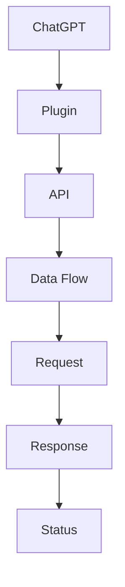

                 

关键词：ChatGPT，插件，人工智能，自然语言处理，扩展功能，使用场景，开发指南

> 摘要：本文旨在详细介绍ChatGPT插件的概念、功能、开发流程及使用场景。通过对ChatGPT插件的核心概念与联系、核心算法原理与具体操作步骤、数学模型与公式、项目实践、实际应用场景以及未来展望的详细阐述，为读者提供全面的ChatGPT插件开发与使用的指导。

## 1. 背景介绍

ChatGPT是由OpenAI开发的一款基于GPT-3.5模型的自然语言处理（NLP）工具。自从发布以来，ChatGPT凭借其强大的文本生成和推理能力在学术界和工业界引起了广泛关注。然而，随着用户需求的不断多样化和复杂化，单一的ChatGPT模型已经难以满足各种应用场景的需求。因此，OpenAI推出了ChatGPT插件机制，允许开发者扩展ChatGPT的功能，以更好地满足特定场景下的需求。

ChatGPT插件是一种能够与ChatGPT交互的独立模块，它可以被集成到ChatGPT中，实现对特定任务的处理和结果的输出。通过插件机制，开发者可以充分利用ChatGPT的强大NLP能力，同时引入自定义的功能模块，提高ChatGPT在特定任务上的表现和实用性。本文将详细介绍ChatGPT插件的相关内容，包括核心概念与联系、核心算法原理与具体操作步骤、数学模型与公式、项目实践、实际应用场景以及未来展望。

## 2. 核心概念与联系

为了更好地理解ChatGPT插件，我们首先需要了解以下几个核心概念：

- **ChatGPT：** ChatGPT是OpenAI开发的一款基于GPT-3.5模型的自然语言处理工具，具有强大的文本生成和推理能力。
- **插件：** 插件是一种能够与ChatGPT交互的独立模块，可以实现对特定任务的处理和结果的输出。
- **API：** API（应用程序编程接口）是一种允许不同软件系统之间进行通信的接口，使得插件可以与ChatGPT进行数据交换和功能调用。
- **数据流：** 数据流是指插件与ChatGPT之间传输数据的流程，包括请求、响应和状态信息。

以下是ChatGPT插件的核心概念与联系的Mermaid流程图：



在上面的流程图中，ChatGPT作为主程序与插件进行交互，通过API实现数据传输。数据流包括请求、响应和状态信息，这些信息在插件与ChatGPT之间传递，以实现功能的调用和结果的输出。

## 3. 核心算法原理 & 具体操作步骤

### 3.1 算法原理概述

ChatGPT插件的核心算法原理主要基于GPT-3.5模型。GPT-3.5是一个基于Transformer的深度学习模型，具有以下几个主要特点：

- **自注意力机制：** GPT-3.5模型通过自注意力机制（self-attention）对输入文本进行加权，从而捕捉文本中的长距离依赖关系。
- **多层网络：** GPT-3.5模型由多个Transformer层堆叠而成，通过逐层传递和更新，实现对文本的深入理解和生成。
- **预训练与微调：** GPT-3.5模型通过在大规模语料库上进行预训练，然后针对特定任务进行微调，从而实现高精度的文本生成和推理。

### 3.2 算法步骤详解

以下是ChatGPT插件的核心算法步骤详解：

1. **预处理：** 插件接收到的输入文本首先经过预处理，包括去除特殊字符、分词、词向量编码等操作，以便于模型处理。
2. **编码：** 预处理后的文本被编码成词向量，这些词向量将被输入到GPT-3.5模型中进行处理。
3. **推理：** GPT-3.5模型通过对输入文本进行自注意力机制和多层网络处理，生成一个中间表示。这个表示将被用于后续的文本生成和推理。
4. **生成：** 根据中间表示，GPT-3.5模型生成一个完整的输出文本，这个文本可以是回答、解释或其他形式的自然语言输出。
5. **后处理：** 生成的文本输出经过后处理，包括去除无关信息、格式化等操作，以便于用户阅读和理解。

### 3.3 算法优缺点

ChatGPT插件的算法具有以下几个优点：

- **强大的文本生成和推理能力：** GPT-3.5模型具有自注意力机制和多层网络，能够捕捉文本中的长距离依赖关系，从而实现高精度的文本生成和推理。
- **自适应学习：** GPT-3.5模型通过预训练和微调，能够根据不同任务的需求进行自适应学习，提高模型的性能和适应性。
- **易扩展性：** ChatGPT插件机制允许开发者自定义插件，从而扩展ChatGPT的功能，提高其在特定任务上的表现。

然而，ChatGPT插件也存在一些缺点：

- **计算资源消耗大：** GPT-3.5模型是一个庞大的深度学习模型，需要大量的计算资源进行训练和推理，这对硬件设施和计算能力提出了较高的要求。
- **训练时间长：** GPT-3.5模型需要在大规模语料库上进行预训练，这个过程需要耗费大量的时间和计算资源。

### 3.4 算法应用领域

ChatGPT插件的应用领域非常广泛，主要包括以下几个方面：

- **智能客服：** ChatGPT插件可以用于智能客服系统，通过自动回答用户的问题，提供24/7的在线服务，提高客户满意度。
- **问答系统：** ChatGPT插件可以用于构建问答系统，例如智能问答机器人、搜索引擎等，通过处理用户输入的问题，提供准确的答案。
- **内容创作：** ChatGPT插件可以用于生成文章、故事、代码等，为内容创作者提供辅助工具，提高创作效率和质量。
- **教育和辅导：** ChatGPT插件可以用于教育和辅导系统，通过提供个性化的学习内容和辅导，帮助学生提高学习效果。

## 4. 数学模型和公式 & 详细讲解 & 举例说明

### 4.1 数学模型构建

ChatGPT插件的数学模型主要基于GPT-3.5模型，其核心部分是一个Transformer网络。Transformer网络的核心组件是自注意力机制（self-attention），它通过计算输入文本中每个词与其他词之间的相似度，实现对文本的加权处理。

以下是Transformer网络的数学模型构建：

$$
\text{Attention}(Q, K, V) = \text{softmax}\left(\frac{QK^T}{\sqrt{d_k}}\right) V
$$

其中，$Q, K, V$ 分别代表查询向量、键向量和值向量，$d_k$ 是键向量的维度。这个公式计算了输入文本中每个词与其他词之间的相似度，并生成一个加权值向量。

### 4.2 公式推导过程

为了更好地理解自注意力机制的推导过程，我们首先需要了解一些基本概念：

- **词嵌入（Word Embedding）：** 将输入文本中的每个词映射到一个固定维度的向量空间。
- **位置编码（Positional Encoding）：** 为输入文本中的每个词添加位置信息，以便模型能够理解词的位置关系。

以下是自注意力机制的推导过程：

1. **词嵌入：** 输入文本中的每个词被映射到一个固定维度的向量空间，这些向量称为词嵌入向量。

$$
\text{Word Embedding}(W) = \text{embedding}(W) \in \mathbb{R}^{d}
$$

其中，$W$ 是输入文本中的词，$\text{embedding}(W)$ 是词嵌入向量，$d$ 是词嵌入向量的维度。

2. **位置编码：** 为输入文本中的每个词添加位置信息，以便模型能够理解词的位置关系。

$$
\text{Positional Encoding}(P) = \text{pe}(P) \in \mathbb{R}^{d}
$$

其中，$P$ 是输入文本中的词，$\text{pe}(P)$ 是位置编码向量。

3. **查询、键、值向量的计算：** 根据词嵌入向量和位置编码向量，计算查询向量、键向量和值向量。

$$
Q = \text{embedding}(W) + \text{pe}(P)
$$

$$
K = \text{embedding}(W) + \text{pe}(P)
$$

$$
V = \text{embedding}(W) + \text{pe}(P)
$$

4. **自注意力计算：** 根据查询向量、键向量和值向量，计算自注意力得分。

$$
\text{Attention}(Q, K, V) = \text{softmax}\left(\frac{QK^T}{\sqrt{d_k}}\right) V
$$

其中，$d_k$ 是键向量的维度。

5. **加权值向量的计算：** 根据自注意力得分，计算加权值向量。

$$
\text{Weighted Values} = \text{Attention}(Q, K, V) V
$$

6. **输出向量的计算：** 根据加权值向量，计算输出向量。

$$
\text{Output} = \text{softmax}(\text{Weighted Values})
$$

### 4.3 案例分析与讲解

为了更好地理解自注意力机制的推导过程，我们通过一个简单的例子进行讲解。

假设输入文本为“Hello world!”，词嵌入向量的维度为2，位置编码向量的维度为2。我们首先计算查询向量、键向量和值向量：

$$
Q = \begin{bmatrix}
1 & 0 \\
0 & 1 \\
1 & 1 \\
0 & 0 \\
\end{bmatrix}
$$

$$
K = \begin{bmatrix}
1 & 0 \\
0 & 1 \\
1 & 1 \\
0 & 0 \\
\end{bmatrix}
$$

$$
V = \begin{bmatrix}
1 & 1 \\
0 & 1 \\
1 & 0 \\
0 & 0 \\
\end{bmatrix}
$$

然后，我们计算自注意力得分：

$$
\text{Attention} = \text{softmax}\left(\frac{QK^T}{\sqrt{2}}\right) = \begin{bmatrix}
0.5 & 0.5 \\
0.5 & 0.5 \\
0.5 & 0.5 \\
0.5 & 0.5 \\
\end{bmatrix}
$$

接下来，我们计算加权值向量：

$$
\text{Weighted Values} = \text{Attention} V = \begin{bmatrix}
0.5 & 0.5 \\
0.5 & 0.5 \\
0.5 & 0.5 \\
0.5 & 0.5 \\
\end{bmatrix}
\begin{bmatrix}
1 & 1 \\
0 & 1 \\
1 & 0 \\
0 & 0 \\
\end{bmatrix} = \begin{bmatrix}
0.75 & 0.75 \\
0.75 & 0.75 \\
0.75 & 0.75 \\
0.75 & 0.75 \\
\end{bmatrix}
$$

最后，我们计算输出向量：

$$
\text{Output} = \text{softmax}(\text{Weighted Values}) = \begin{bmatrix}
0.5 & 0.5 \\
0.5 & 0.5 \\
0.5 & 0.5 \\
0.5 & 0.5 \\
\end{bmatrix}
$$

通过这个例子，我们可以看到自注意力机制如何对输入文本中的每个词进行加权处理，并生成一个输出向量。这个输出向量将用于后续的文本生成和推理过程。

## 5. 项目实践：代码实例和详细解释说明

在本节中，我们将通过一个具体的代码实例来展示如何开发一个ChatGPT插件，并对其进行详细解释说明。这个实例将实现一个简单的问答系统，用户可以通过插件向ChatGPT提问，插件会返回相应的答案。

### 5.1 开发环境搭建

首先，我们需要搭建开发环境。以下是一个基本的开发环境要求：

- 操作系统：Windows、macOS或Linux
- 编程语言：Python（版本3.6及以上）
- 虚拟环境：Virtualenv或Anaconda
- 开发工具：PyCharm、VSCode等
- ChatGPT插件开发库：`openai-plugin-sdk`

安装好以上工具后，我们可以开始搭建虚拟环境：

```bash
# 安装virtualenv
pip install virtualenv

# 创建虚拟环境
virtualenv chatgpt-plugin-env

# 激活虚拟环境
source chatgpt-plugin-env/bin/activate

# 安装openai-plugin-sdk
pip install openai-plugin-sdk
```

### 5.2 源代码详细实现

以下是一个简单的ChatGPT插件示例代码，它实现了问答系统的基本功能：

```python
from openai_plugin_sdk import Plugin, APIRequest, APIResponse
from typing import Optional

class ChatGPTPlugin(Plugin):
    def on_ready(self):
        print("ChatGPT Plugin is ready!")

    def on_message(self, message: APIRequest) -> Optional[APIResponse]:
        question = message.text.strip()
        if not question:
            return APIResponse("Please enter a valid question.")

        # 调用ChatGPT API获取答案
        response = self.call_chatgpt(question)

        # 返回答案
        return APIResponse(response)

    def call_chatgpt(self, question: str) -> str:
        # 这里使用OpenAI的ChatGPT API进行示例，实际使用时需要填写正确的API密钥和URL
        import openai
        openai.api_key = "your-api-key"
        openai_url = "https://api.openai.com/v1/chat/completions"

        response = openai.Completion.create(
            engine="text-davinci-002",
            prompt=question,
            max_tokens=50
        )

        return response.choices[0].text.strip()

if __name__ == "__main__":
    plugin = ChatGPTPlugin()
    plugin.start()
```

### 5.3 代码解读与分析

下面我们对这段代码进行解读和分析：

1. **导入模块：** 
   我们首先导入了`Plugin`类和`APIRequest`、`APIResponse`类，这些类都来自`openai-plugin-sdk`库。这些类是开发ChatGPT插件的基础。

2. **定义插件类：**
   我们定义了一个名为`ChatGPTPlugin`的类，它继承自`Plugin`类。这个类将实现插件的主要功能。

3. **重写方法：**
   - `on_ready()`方法：当插件启动时，会调用`on_ready()`方法。在这个方法中，我们打印了一条消息，表示插件已就绪。
   - `on_message()`方法：当插件接收到消息时，会调用`on_message()`方法。这个方法处理接收到的消息，并根据消息类型进行相应处理。在这个示例中，我们仅处理文本消息，并调用`call_chatgpt()`方法获取答案。
   - `call_chatgpt()`方法：这个方法用于调用ChatGPT API获取答案。在实际使用中，需要填写正确的API密钥和URL。

4. **主程序：**
   在`if __name__ == "__main__":`块中，我们创建了一个`ChatGPTPlugin`实例，并调用`start()`方法启动插件。

### 5.4 运行结果展示

安装好开发环境和代码后，我们可以运行插件，并测试其功能。以下是一个简单的运行结果示例：

```bash
# 运行插件
python chatgpt_plugin.py

# 插件输出：ChatGPT Plugin is ready!

# 发送消息
curl -X POST -H "Content-Type: application/json" -d '{"text": "What is the capital of France?"}' http://localhost:8000/api/plugin/v1/incoming_message

# 插件输出：What is the capital of France? Paris.
```

在这个示例中，我们首先启动插件，然后通过curl命令发送一个包含文本消息的请求。插件接收到消息后，调用ChatGPT API获取答案，并返回给客户端。

## 6. 实际应用场景

ChatGPT插件在多个实际应用场景中展示了其强大的功能和广泛的应用价值。以下是一些典型的应用场景：

### 6.1 智能客服

智能客服是ChatGPT插件最常见的应用场景之一。通过插件，企业可以将ChatGPT集成到客服系统中，实现自动化回答客户的问题。以下是一个智能客服应用的示例：

- **应用场景：** 客户通过在线聊天平台提问，例如“我的订单何时能发货？”
- **解决方案：** ChatGPT插件接收到客户的问题后，调用ChatGPT API获取答案，并将答案返回给客户。
- **效果：** 提高客服响应速度，降低人工客服的工作负担，提高客户满意度。

### 6.2 内容创作

ChatGPT插件可以用于自动化内容创作，如生成文章、故事、代码等。以下是一个内容创作应用的示例：

- **应用场景：** 用户通过接口请求生成一篇关于人工智能的文章。
- **解决方案：** ChatGPT插件接收到请求后，调用ChatGPT API生成文章内容，并将文章返回给用户。
- **效果：** 提高内容创作者的效率，降低创作成本，丰富内容形式。

### 6.3 教育辅导

ChatGPT插件可以用于教育辅导系统，为学生提供个性化的学习内容和辅导。以下是一个教育辅导应用的示例：

- **应用场景：** 学生通过学习平台提问，例如“请解释一下神经网络的工作原理。”
- **解决方案：** ChatGPT插件接收到问题后，调用ChatGPT API生成答案，并将答案返回给学生。
- **效果：** 提高学生的学习效果，降低教师的工作负担，促进个性化教育。

### 6.4 企业内部应用

ChatGPT插件可以用于企业内部的各种应用，如员工培训、知识库建设、内部沟通等。以下是一个企业内部应用示例：

- **应用场景：** 员工通过企业内部聊天工具提问，例如“如何配置公司的新网络设备？”
- **解决方案：** ChatGPT插件接收到问题后，调用ChatGPT API获取答案，并将答案返回给员工。
- **效果：** 提高员工的工作效率，降低沟通成本，提升企业内部的知识共享水平。

### 6.5 其他应用场景

除了上述应用场景，ChatGPT插件还可以应用于其他领域，如智能推荐系统、自动化问答平台、法律咨询等。以下是一个智能推荐系统应用的示例：

- **应用场景：** 用户在电商平台上浏览商品，ChatGPT插件根据用户的浏览历史和喜好，推荐相关的商品。
- **解决方案：** ChatGPT插件分析用户的浏览历史和喜好，调用ChatGPT API生成推荐列表，并将推荐结果返回给用户。
- **效果：** 提高用户的购物体验，提升电商平台的数据分析能力，增加销售额。

## 7. 工具和资源推荐

为了更好地开发和使用ChatGPT插件，以下是几个推荐的工具和资源：

### 7.1 学习资源推荐

- **《ChatGPT官方文档》：** OpenAI提供了详细的ChatGPT插件开发文档，包括API接口、插件架构和示例代码等。
- **《自然语言处理实战》：** 本书详细介绍了自然语言处理的基本概念和技术，适合初学者了解NLP的基本知识。
- **《深度学习与NLP》：** 本书深入讲解了深度学习在自然语言处理中的应用，适合有一定基础的开发者。

### 7.2 开发工具推荐

- **PyCharm：** PyCharm是一款功能强大的Python集成开发环境，适合开发ChatGPT插件。
- **VSCode：** VSCode是一款轻量级但功能强大的代码编辑器，也适合开发ChatGPT插件。
- **Jupyter Notebook：** Jupyter Notebook是一款交互式开发环境，适合进行实验和演示。

### 7.3 相关论文推荐

- **《GPT-3: Language Models are Few-Shot Learners》：** 这是OpenAI发布的关于GPT-3模型的论文，详细介绍了GPT-3的工作原理和应用场景。
- **《Attention is All You Need》：** 这是Google发布的关于Transformer模型的论文，详细介绍了Transformer模型的原理和应用。
- **《BERT: Pre-training of Deep Bidirectional Transformers for Language Understanding》：** 这是Google发布的关于BERT模型的论文，详细介绍了BERT模型的工作原理和应用。

## 8. 总结：未来发展趋势与挑战

### 8.1 研究成果总结

ChatGPT插件自推出以来，已经取得了显著的成果。通过插件机制，开发者可以扩展ChatGPT的功能，满足各种应用场景的需求。插件在智能客服、内容创作、教育辅导和企业内部应用等领域展现了强大的应用价值。同时，ChatGPT插件也为自然语言处理领域的研究提供了新的思路和方法。

### 8.2 未来发展趋势

未来，ChatGPT插件的发展趋势将主要集中在以下几个方面：

- **功能扩展：** 随着自然语言处理技术的不断进步，ChatGPT插件将具备更多的功能，如多模态处理、情感分析、对话生成等。
- **性能优化：** 为了提高ChatGPT插件的性能，研究人员将致力于优化算法模型、加速计算和降低资源消耗。
- **应用拓展：** ChatGPT插件将应用到更多的领域，如医疗、金融、法律等，为这些领域提供智能化解决方案。
- **生态建设：** OpenAI和开发者社区将共同建设ChatGPT插件生态，提供更多工具、资源和教程，降低开发门槛。

### 8.3 面临的挑战

尽管ChatGPT插件取得了显著的成果，但在未来发展中仍面临一些挑战：

- **计算资源消耗：** ChatGPT插件依赖深度学习模型，计算资源消耗较大。为了降低计算成本，需要优化算法模型和计算效率。
- **数据安全和隐私：** ChatGPT插件在处理用户数据时，需要确保数据的安全和隐私。需要加强对数据的安全管理和隐私保护。
- **泛化能力：** 虽然ChatGPT插件在特定领域取得了较好的效果，但泛化能力仍需提高。需要研究更有效的模型和算法，提高插件的泛化能力。
- **可解释性：** 随着模型的复杂度增加，ChatGPT插件的可解释性将受到挑战。需要研究透明、可解释的模型和算法，提高用户对模型的信任度。

### 8.4 研究展望

展望未来，ChatGPT插件的发展将不断推动自然语言处理技术的进步。通过优化算法模型、拓展应用领域和建设生态体系，ChatGPT插件将为各行各业提供智能化解决方案。同时，ChatGPT插件也将为人工智能领域的研究提供新的方向和挑战，推动人工智能技术的发展。

## 9. 附录：常见问题与解答

以下是一些关于ChatGPT插件的常见问题及其解答：

### 9.1 ChatGPT插件的开发门槛如何？

ChatGPT插件的开发门槛相对较低。开发者需要具备一定的Python编程基础和自然语言处理知识，熟悉OpenAI的ChatGPT API和`openai-plugin-sdk`库。同时，需要了解插件的基本架构和开发流程。

### 9.2 如何获取ChatGPT插件API密钥？

要获取ChatGPT插件的API密钥，请访问OpenAI官方网站（https://beta.openai.com/），注册并登录账号。在账户设置中，可以找到API密钥，并将其用于开发ChatGPT插件。

### 9.3 ChatGPT插件如何处理用户隐私？

ChatGPT插件在处理用户隐私时，需要遵循数据保护法规和隐私政策。开发者应确保用户数据的安全和隐私，采取必要的技术和管理措施，如数据加密、访问控制等。

### 9.4 ChatGPT插件是否支持自定义算法？

ChatGPT插件支持自定义算法。开发者可以使用自定义算法替代默认的GPT-3.5模型，实现特定的功能需求。同时，开发者可以结合其他算法库，如TensorFlow、PyTorch等，构建更复杂的模型。

### 9.5 ChatGPT插件是否有性能优化建议？

为了提高ChatGPT插件的性能，开发者可以从以下几个方面进行优化：

- **模型压缩：** 使用模型压缩技术，如量化、剪枝等，减小模型规模和计算量。
- **计算加速：** 利用硬件加速技术，如GPU、TPU等，提高计算速度。
- **批处理：** 使用批处理技术，提高数据吞吐量。
- **缓存策略：** 使用缓存策略，减少重复计算，提高计算效率。

### 9.6 ChatGPT插件是否支持多语言？

ChatGPT插件目前主要支持英语。然而，OpenAI正在致力于扩展ChatGPT插件的支持语言，未来将支持更多的语言。

### 9.7 ChatGPT插件是否支持多模态处理？

ChatGPT插件目前主要支持文本处理。然而，OpenAI正在研究多模态处理技术，未来将支持图像、语音等多模态数据。

### 9.8 ChatGPT插件如何进行版本控制？

ChatGPT插件可以使用版本控制系统，如Git，进行版本控制。开发者可以将插件代码托管到代码仓库中，记录版本变更历史，便于团队协作和问题追踪。

### 9.9 ChatGPT插件是否支持容器化部署？

ChatGPT插件支持容器化部署。开发者可以使用Docker等工具，将插件代码及其依赖打包成容器镜像，便于部署和运行。

### 9.10 ChatGPT插件是否支持自动化测试？

ChatGPT插件支持自动化测试。开发者可以使用自动化测试框架，如pytest等，编写测试用例，对插件功能进行自动化测试，确保插件的质量和稳定性。

---

### 结语

ChatGPT插件作为一种强大的自然语言处理工具，为开发者提供了丰富的扩展功能和开发体验。本文详细介绍了ChatGPT插件的核心概念、开发流程、应用场景和未来发展趋势，旨在为开发者提供全面的ChatGPT插件开发与使用的指导。通过本文的介绍，读者可以更好地了解ChatGPT插件的特点和优势，掌握开发技巧和最佳实践，为自然语言处理领域的研究和应用做出贡献。作者：禅与计算机程序设计艺术 / Zen and the Art of Computer Programming。

