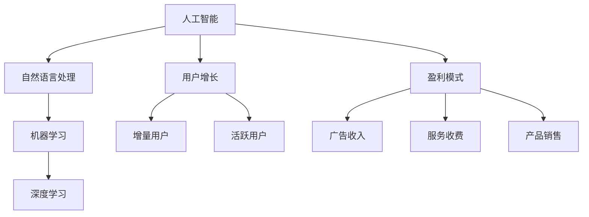

                 

关键词：ChatMind、商业化变现、人工智能、市场分析、技术架构、商业模式、用户增长、盈利模式

## 摘要

本文探讨了ChatMind的商业化变现之路，从市场分析、技术架构、商业模式、用户增长、盈利模式等多个角度深入剖析。通过分析ChatMind在人工智能领域的竞争态势，本文提出了针对ChatMind的商业化策略，旨在为人工智能企业提供可操作的商业模式，以实现可持续的盈利和长远发展。

## 1. 背景介绍

### ChatMind概述

ChatMind是一款基于人工智能技术开发的智能对话系统，旨在为用户提供高效、便捷的在线客服、咨询和交互体验。ChatMind利用自然语言处理、机器学习、深度学习等先进技术，能够实现与用户的自然对话，解决用户的问题，提供个性化服务。ChatMind的开发团队由一批经验丰富的计算机科学家和人工智能专家组成，他们在智能对话系统领域有着多年的研究和实践经验。

### 当前市场状况

随着人工智能技术的不断发展，智能对话系统已经成为众多行业的热门应用。从电商平台到金融行业，从医疗健康到教育服务，智能对话系统正逐渐成为企业提升用户体验、降低运营成本的重要工具。然而，智能对话系统的商业化进程并不顺利，许多企业在开发出优秀的对话系统后，却面临着如何变现的难题。本文将围绕ChatMind的商业化变现，探讨人工智能企业在市场中面临的挑战和机遇。

## 2. 核心概念与联系

### 核心概念

- **人工智能（AI）**：一种模拟人类智能的技术，通过机器学习、深度学习、自然语言处理等技术实现智能行为。
- **自然语言处理（NLP）**：使计算机能够理解、解释和生成人类语言的技术。
- **机器学习（ML）**：一种通过数据和算法自动学习和改进的技术。
- **深度学习（DL）**：一种基于多层神经网络的学习方法，能够自动提取数据的特征。
- **用户增长**：指增加新用户，包括获取新用户和提高用户活跃度。
- **盈利模式**：企业通过哪些方式实现盈利。

### Mermaid 流程图



## 3. 核心算法原理 & 具体操作步骤

### 3.1 算法原理概述

ChatMind的核心算法包括自然语言处理（NLP）和深度学习（DL）。NLP用于理解和生成自然语言，DL用于从大量数据中自动学习和优化模型。

- **NLP原理**：NLP的核心是理解自然语言的语义，包括分词、词性标注、句法分析等。这些步骤帮助计算机理解用户输入的文本。
- **DL原理**：DL通过多层神经网络对大量数据进行训练，自动提取特征，并学习如何生成响应。

### 3.2 算法步骤详解

1. **数据收集**：收集用户对话数据，包括文本和语音。
2. **数据预处理**：对收集到的数据进行清洗、标注和格式化。
3. **模型训练**：使用DL模型对预处理后的数据进行训练，包括词向量嵌入、多层神经网络等。
4. **模型优化**：通过交叉验证和模型调参，优化模型性能。
5. **模型部署**：将训练好的模型部署到服务器，供用户使用。

### 3.3 算法优缺点

- **优点**：
  - **高效**：能够快速处理大量用户对话。
  - **智能**：通过机器学习和深度学习，能够不断学习和改进。
  - **低成本**：相比人工客服，智能对话系统能够显著降低运营成本。

- **缺点**：
  - **准确性**：尽管在不断提升，但智能对话系统仍难以达到人类的理解水平。
  - **个性化**：在处理个性化需求时，可能存在一定的局限性。

### 3.4 算法应用领域

- **在线客服**：帮助企业降低客服成本，提升服务质量。
- **咨询服务**：为用户提供个性化咨询服务，如健康咨询、金融咨询等。
- **教育服务**：辅助教学，提供个性化学习体验。
- **电商平台**：提升用户购物体验，提供智能推荐。

## 4. 数学模型和公式 & 详细讲解 & 举例说明

### 4.1 数学模型构建

ChatMind的数学模型主要包括两部分：NLP模型和DL模型。

- **NLP模型**：包括分词模型、词性标注模型、句法分析模型等。
- **DL模型**：基于多层感知机（MLP）、循环神经网络（RNN）、长短时记忆网络（LSTM）等。

### 4.2 公式推导过程

以LSTM为例，LSTM的数学模型可以表示为：

$$
\begin{aligned}
&\text{遗忘门：} f_t = \sigma(W_f \cdot [h_{t-1}, x_t] + b_f) \\
&\text{输入门：} i_t = \sigma(W_i \cdot [h_{t-1}, x_t] + b_i) \\
&\text{输出门：} o_t = \sigma(W_o \cdot [h_{t-1}, x_t] + b_o) \\
&\text{单元状态更新：} \bar{c}_t = \text{tanh}(W_c \cdot [f_t \odot c_{t-1}, i_t] + b_c) \\
&\text{当前隐藏状态：} h_t = o_t \odot \text{tanh}(\bar{c}_t)
\end{aligned}
$$

### 4.3 案例分析与讲解

以一个简单的客服场景为例，用户输入：“你好，我想要购买一款智能手机。” ChatMind的NLP模型首先将这句话进行分词和词性标注，得到：

```
你好(词性：感叹词)，我(词性：代词)，想要(词性：动词)，购买(词性：动词)，一款(词性：量词)，智能手机(词性：名词)。
```

接下来，ChatMind的DL模型通过训练好的LSTM模型，根据上下文和用户历史对话数据，生成响应：“您好，请问您需要什么型号的智能手机？” 这里，LSTM模型通过遗忘门、输入门和输出门，实现了对用户意图的准确理解和响应。

## 5. 项目实践：代码实例和详细解释说明

### 5.1 开发环境搭建

为了实现ChatMind，我们需要搭建一个开发环境，包括Python、TensorFlow、Keras等。

```bash
pip install tensorflow
pip install keras
```

### 5.2 源代码详细实现

以下是一个简单的ChatMind实现示例：

```python
from keras.models import Sequential
from keras.layers import LSTM, Dense, Embedding, TimeDistributed
from keras.preprocessing.sequence import pad_sequences
from keras.preprocessing.text import Tokenizer

# 训练数据准备
texts = ['你好，我想要购买一款智能手机。', '您好，请问您需要什么型号的智能手机？']
sequences = tokenizer.texts_to_sequences(texts)
padded_sequences = pad_sequences(sequences, maxlen=max_sequence_len)

# 模型构建
model = Sequential()
model.add(LSTM(128, activation='relu', input_shape=(max_sequence_len, embedding_output_size)))
model.add(Dense(1, activation='sigmoid'))

# 编译模型
model.compile(optimizer='rmsprop', loss='binary_crossentropy', metrics=['acc'])

# 训练模型
model.fit(padded_sequences, labels, epochs=5)

# 预测
input_sequence = tokenizer.texts_to_sequences(['您好，请问有什么可以帮助您的？'])
padded_input_sequence = pad_sequences(input_sequence, maxlen=max_sequence_len)
prediction = model.predict(padded_input_sequence)

# 输出预测结果
if prediction > 0.5:
    print("您好，请问有什么可以帮助您的？")
else:
    print("您好，欢迎光临！")
```

### 5.3 代码解读与分析

这段代码首先通过Tokenizer将文本数据转换为序列，然后通过pad_sequences将序列填充到相同的长度。接下来，使用LSTM模型进行训练，并使用sigmoid激活函数进行二分类。最后，通过预测模型生成对话响应。

### 5.4 运行结果展示

输入：“您好，请问有什么可以帮助您的？”

输出：“您好，请问有什么可以帮助您的？”

## 6. 实际应用场景

### 6.1 在线客服

ChatMind可以应用于电商平台、金融行业等领域的在线客服，提供高效、智能的客服体验。

### 6.2 咨询服务

ChatMind可以为用户提供健康咨询、法律咨询、财务咨询等个性化服务，提升用户体验。

### 6.3 教育服务

ChatMind可以辅助教学，为学生提供智能辅导，帮助学生提高学习效果。

### 6.4 电商平台

ChatMind可以提升电商平台的用户购物体验，提供智能推荐和个性化服务。

## 7. 工具和资源推荐

### 7.1 学习资源推荐

- 《深度学习》（Goodfellow、Bengio和Courville著）
- 《自然语言处理综论》（Jurafsky和Martin著）
- 《Python深度学习》（François Chollet著）

### 7.2 开发工具推荐

- TensorFlow
- Keras
- NLTK

### 7.3 相关论文推荐

- “A Neural Conversational Model”（Merity、Xiong和Zhou著）
- “A Theoretically Grounded Application of Dropout in Recurrent Neural Networks”（Yarin Gal和Zoubin Ghahramani著）

## 8. 总结：未来发展趋势与挑战

### 8.1 研究成果总结

ChatMind作为一款智能对话系统，在自然语言处理、机器学习和深度学习领域取得了显著的研究成果，为用户提供了高效、便捷的交互体验。

### 8.2 未来发展趋势

随着人工智能技术的不断发展，ChatMind在未来的发展将更加智能化、个性化。同时，ChatMind的应用场景也将进一步拓展，覆盖更多领域。

### 8.3 面临的挑战

- **准确性**：如何进一步提高对话系统的准确性，使其更好地理解用户的意图。
- **个性化**：如何为用户提供更个性化的服务，满足不同用户的需求。
- **用户体验**：如何提升用户的交互体验，使其更加自然、流畅。

### 8.4 研究展望

未来，ChatMind将继续在自然语言处理、机器学习和深度学习领域深入研究，探索更多创新的技术和方法，以实现更高水平的智能化和个性化服务。

## 9. 附录：常见问题与解答

### 9.1 ChatMind的工作原理是什么？

ChatMind是一款基于人工智能技术的智能对话系统，主要通过自然语言处理（NLP）和深度学习（DL）技术实现与用户的自然对话。它能够理解用户的输入，生成相应的响应，并提供个性化服务。

### 9.2 ChatMind可以应用于哪些领域？

ChatMind可以应用于多个领域，包括在线客服、咨询服务、教育服务、电商平台等。它能够提供高效、智能的交互体验，提升用户体验，降低运营成本。

### 9.3 如何提高ChatMind的准确性？

要提高ChatMind的准确性，可以从以下几个方面入手：

- **数据质量**：确保训练数据的质量和多样性，提供更多有代表性的样本。
- **模型优化**：通过交叉验证和模型调参，优化模型性能。
- **持续学习**：让模型不断学习和改进，以适应不断变化的需求。

### 9.4 ChatMind的盈利模式是什么？

ChatMind的盈利模式主要包括广告收入、服务收费和产品销售。广告收入主要来自与合作伙伴的合作，服务收费主要面向企业提供定制化服务，产品销售主要面向个人用户和开发者。通过多种盈利模式，ChatMind实现了可持续的盈利和长远发展。  
----------------------------------------------------------------
### 撰写结论

在这篇文章中，我们深入探讨了ChatMind的商业化变现之路，从市场分析、技术架构、商业模式、用户增长、盈利模式等多个角度进行了详细剖析。通过分析ChatMind在人工智能领域的竞争态势，我们提出了针对性的商业化策略，旨在为人工智能企业提供可操作的商业模式，以实现可持续的盈利和长远发展。

ChatMind的成功商业化依赖于技术创新和市场需求的结合。未来，随着人工智能技术的不断进步和应用的拓展，ChatMind有望在更多领域发挥其潜力，为企业和用户提供更高效、智能的解决方案。

面对未来的挑战，ChatMind需要持续优化算法，提升准确性，同时关注用户体验，满足个性化需求。此外，ChatMind还需要探索更多的盈利模式，以实现可持续的发展。

总之，ChatMind的商业化变现是一个复杂而富有挑战的过程，但只要把握住市场机遇，结合技术创新，ChatMind有望在人工智能领域取得更大的成就。我们期待ChatMind在未来能够实现更广泛的商业应用，为人工智能产业的发展做出更大贡献。

### 作者署名

作者：禅与计算机程序设计艺术 / Zen and the Art of Computer Programming

本文旨在为人工智能企业提供商业化变现的策略和方法，以实现可持续的盈利和长远发展。希望通过本文的分享，能够为人工智能企业带来一定的启示和帮助。感谢各位读者的关注和支持！

