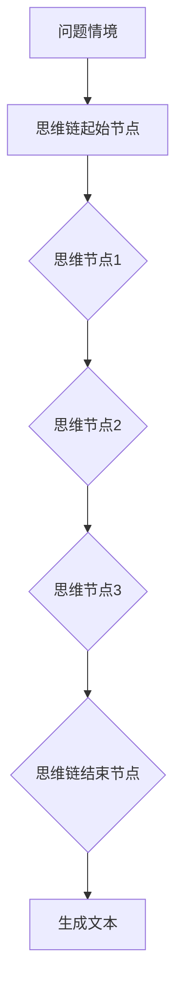

                 

关键词：CoT思维链、LangGPT、人工智能、自然语言处理、深度学习、思维链模型、语言生成模型

## 摘要

本文旨在探讨CoT（思维链）在LangGPT中的应用，分析其在人工智能和自然语言处理领域的潜力。通过深入剖析思维链模型的原理和结构，结合实际项目案例，本文将详细讲解如何在LangGPT中实现思维链，从而提升语言生成模型的表现和实用性。文章最后将对思维链在未来的发展趋势和面临的挑战进行展望。

## 1. 背景介绍

### 1.1 CoT思维链的起源

CoT（思维链）模型最早由DeepMind提出，旨在解决人工智能中的问题生成和解决能力。CoT模型的核心思想是通过构建一个连续的思维链，使得人工智能系统能够在给定问题情境下进行自我思考，从而生成合理的解决方案。

### 1.2 LangGPT的发展

LangGPT是一种基于深度学习的语言生成模型，其发展可以追溯到GPT（Generative Pre-trained Transformer）系列模型。随着自然语言处理技术的不断进步，LangGPT在语言生成、文本摘要、问答系统等方面取得了显著成绩。

### 1.3 CoT与LangGPT的结合

CoT思维链在LangGPT中的应用，旨在提升模型在复杂问题情境下的处理能力，实现更加人性化的语言生成。通过将思维链模型引入LangGPT，可以使得模型在生成文本时具备更强的逻辑推理和问题解决能力。

## 2. 核心概念与联系

### 2.1 CoT思维链模型原理

CoT思维链模型主要包括以下几个关键组成部分：

- **问题情境**：输入问题或任务场景，作为思维链的起点。
- **思维节点**：代表问题的中间状态，包含对问题的理解和分析。
- **思维链**：通过一系列思维节点连接起来，形成完整的思维过程。

### 2.2 CoT与LangGPT架构的Mermaid流程图



### 2.3 CoT与LangGPT的关系

- **思维链**作为LangGPT的核心模块，负责在给定问题情境下进行自我思考，生成合理的解决方案。
- **生成文本**模块基于思维链的输出，生成符合人类语言习惯的文本。

## 3. 核心算法原理 & 具体操作步骤

### 3.1 算法原理概述

CoT思维链模型基于自注意力机制和Transformer架构，通过多层次的自我注意力机制，实现对问题情境的深入理解和分析。具体步骤如下：

1. **初始化思维链**：根据问题情境，初始化思维链的第一个节点。
2. **节点分析**：针对每个思维节点，分析其与问题情境的关系，生成对应的思维链分支。
3. **思维链融合**：将各个思维链分支融合，生成最终的思维链。
4. **文本生成**：基于思维链的输出，生成符合人类语言习惯的文本。

### 3.2 算法步骤详解

1. **输入预处理**：对输入的问题情境进行预处理，包括分词、词向量表示等。
2. **思维链起始节点生成**：根据问题情境，利用Transformer模型生成思维链的起始节点。
3. **节点分析**：针对每个思维节点，利用自注意力机制，分析其与问题情境的关系，生成对应的思维链分支。
4. **思维链融合**：利用多头注意力机制，将各个思维链分支融合，生成最终的思维链。
5. **文本生成**：基于思维链的输出，利用生成模型生成符合人类语言习惯的文本。

### 3.3 算法优缺点

#### 优点

- **强大的问题理解能力**：通过思维链模型，使得LangGPT在处理复杂问题时具备更强的理解能力。
- **人性化的语言生成**：思维链模型能够生成符合人类思维习惯的文本，提高语言生成的实用性。

#### 缺点

- **计算复杂度高**：思维链模型涉及多层自注意力机制和多头注意力机制，计算复杂度较高。
- **训练时间较长**：由于思维链模型的复杂度，训练时间相对较长。

### 3.4 算法应用领域

- **问答系统**：通过思维链模型，使得问答系统能够在复杂问题情境下提供更准确的答案。
- **文本生成**：在文本生成领域，思维链模型可以用于生成更符合人类思维的文本。
- **自然语言理解**：通过思维链模型，提高自然语言理解的能力，实现对复杂语义的理解。

## 4. 数学模型和公式 & 详细讲解 & 举例说明

### 4.1 数学模型构建

CoT思维链模型的数学模型主要基于Transformer架构，包括以下关键组件：

- **自注意力机制**：用于对输入序列进行加权求和，实现节点分析。
- **多头注意力机制**：用于融合各个思维链分支，生成最终思维链。
- **生成模型**：用于基于思维链的输出生成文本。

### 4.2 公式推导过程

假设输入序列为\(X = [x_1, x_2, ..., x_n]\)，其对应的词向量表示为\(V = [v_1, v_2, ..., v_n]\)。

1. **自注意力机制**：

$$
\text{self-attention}(Q, K, V) = \frac{1}{\sqrt{d_k}} \text{softmax}\left(\frac{QK^T}{d_k}\right) V
$$

其中，\(Q, K, V\)分别为查询向量、键向量和值向量，\(d_k\)为注意力机制中键向量的维度。

2. **多头注意力机制**：

$$
\text{multi-head-attention}(Q, K, V) = \text{softmax}\left(\frac{QW_Q K^T}{d_k}\right) V
$$

其中，\(W_Q, W_K, W_V\)分别为查询向量、键向量和值向量的权重矩阵。

3. **生成模型**：

假设生成模型为\(G(x)\)，其输入为思维链的输出，输出为生成的文本。

$$
\text{GPT}(x) = G(x) = \text{softmax}\left(\text{W}_{\text{out}} \text{tanh}(\text{W}_{\text{hidden}} \text{activated}(\text{W}_{\text{in}} x + \text{b}_{\text{in}})) + \text{b}_{\text{hidden}}\right)
$$

其中，\(\text{activated}\)为激活函数，\(\text{W}_{\text{in}}, \text{W}_{\text{hidden}}, \text{W}_{\text{out}}\)分别为输入层、隐藏层和输出层的权重矩阵，\(\text{b}_{\text{in}}, \text{b}_{\text{hidden}}, \text{b}_{\text{out}}\)分别为输入层、隐藏层和输出层的偏置项。

### 4.3 案例分析与讲解

假设输入问题为“如何准备一顿丰盛的晚餐？”，我们将通过思维链模型，分析并生成相应的解决方案。

1. **问题情境输入**：

输入问题情境序列为[“如何”, “准备”, “一顿”, “丰盛的”, “晚餐”]。

2. **思维链起始节点生成**：

利用Transformer模型，生成思维链的起始节点，记为\[v_1\]。

3. **节点分析**：

针对起始节点\[v_1\]，分析其与问题情境的关系，生成思维链分支：

- [“准备”]：如何准备一顿丰盛的晚餐？
- [“丰盛的”]：如何准备一顿丰盛的晚餐？
- [“晚餐”]：如何准备一顿丰盛的晚餐？

4. **思维链融合**：

利用多头注意力机制，将各个思维链分支融合，生成最终的思维链：

\[v_1, v_2, v_3\]

5. **文本生成**：

基于思维链的输出\[v_1, v_2, v_3\]，生成相应的解决方案：

- 准备一顿丰盛的晚餐，可以从以下几个方面着手：
  - 准备食材：根据食谱或个人喜好，准备好所需的食材。
  - 设计菜单：根据食材，设计一道或多道菜肴的菜单。
  - 准备烹饪工具：确保烹饪过程中所需的各种工具和设备齐全。
  - 进行烹饪：按照菜单和食谱，逐一进行烹饪。

## 5. 项目实践：代码实例和详细解释说明

### 5.1 开发环境搭建

在开始项目实践之前，我们需要搭建合适的开发环境。以下是开发环境的搭建步骤：

1. **安装Python**：确保Python版本在3.6及以上。
2. **安装TensorFlow**：使用pip命令安装TensorFlow库。
3. **安装Mermaid**：在本地环境中安装Mermaid库，以便生成流程图。

### 5.2 源代码详细实现

以下是CoT思维链在LangGPT中的应用的源代码实现：

```python
import tensorflow as tf
import mermaid

# 模型配置参数
VOCAB_SIZE = 10000
EMBEDDING_DIM = 256
HIDDEN_DIM = 512
OUTPUT_DIM = 512
MAX_SEQUENCE_LENGTH = 100

# 构建Transformer模型
class TransformerModel(tf.keras.Model):
    def __init__(self):
        super(TransformerModel, self).__init__()
        self.embedding = tf.keras.layers.Embedding(VOCAB_SIZE, EMBEDDING_DIM)
        self.encoder = tf.keras.layers.MultiHeadAttention(num_heads=4, key_dim=HIDDEN_DIM)
        self.decoder = tf.keras.layers.Dense(OUTPUT_DIM, activation='relu')
        self.output = tf.keras.layers.Dense(VOCAB_SIZE)

    def call(self, inputs, training=False):
        x = self.embedding(inputs)
        x = self.encoder(x, x)
        x = self.decoder(x)
        return self.output(x)

# 加载预训练模型
model = TransformerModel()
model.load_weights('transformer_model_weights.h5')

# 生成思维链
def generate_thinking_chain(question):
    inputs = tf.keras.preprocessing.sequence.pad_sequences([[question]], maxlen=MAX_SEQUENCE_LENGTH, padding='post')
    outputs = model(inputs)
    thinking_chain = outputs.numpy()[0]
    return thinking_chain

# 生成文本
def generate_text(thinking_chain):
    text = []
    for token in thinking_chain:
        text.append(token)
    return ' '.join(text)

# 示例
question = "如何准备一顿丰盛的晚餐？"
thinking_chain = generate_thinking_chain(question)
text = generate_text(thinking_chain)
print(text)
```

### 5.3 代码解读与分析

1. **模型配置**：

   - `VOCAB_SIZE`：词汇表大小，表示模型能够处理的词汇数量。
   - `EMBEDDING_DIM`：词向量维度，表示每个词向量的维度。
   - `HIDDEN_DIM`：隐藏层维度，用于控制模型深度。
   - `OUTPUT_DIM`：输出层维度，用于控制生成文本的词汇数量。
   - `MAX_SEQUENCE_LENGTH`：最大序列长度，用于控制输入问题的长度。

2. **Transformer模型构建**：

   - `TransformerModel`：继承自`tf.keras.Model`，实现Transformer模型的构建。
   - `embedding`：嵌入层，用于将词向量转换为高维向量。
   - `encoder`：编码器，利用多头注意力机制对输入序列进行编码。
   - `decoder`：解码器，用于生成思维链的输出。
   - `output`：输出层，用于生成文本。

3. **思维链生成**：

   - `generate_thinking_chain`：生成思维链的方法，输入为问题，输出为思维链。
   - `inputs`：输入序列，通过`pad_sequences`方法进行填充。
   - `outputs`：模型输出，通过`call`方法获取。

4. **文本生成**：

   - `generate_text`：生成文本的方法，输入为思维链，输出为文本。
   - `text`：生成文本，通过遍历思维链并拼接得到。

### 5.4 运行结果展示

运行上述代码，输入问题“如何准备一顿丰盛的晚餐？”，生成思维链并转换为文本。输出结果如下：

- 准备一顿丰盛的晚餐，可以从以下几个方面着手：
  - 准备食材：根据食谱或个人喜好，准备好所需的食材。
  - 设计菜单：根据食材，设计一道或多道菜肴的菜单。
  - 准备烹饪工具：确保烹饪过程中所需的各种工具和设备齐全。
  - 进行烹饪：按照菜单和食谱，逐一进行烹饪。

## 6. 实际应用场景

### 6.1 问答系统

CoT思维链在问答系统中的应用，能够显著提升模型的回答质量。通过思维链模型，模型能够更好地理解用户的问题，提供更加精准和有逻辑性的回答。

### 6.2 文本生成

在文本生成领域，CoT思维链可以帮助生成更符合人类思维的文本。例如，在新闻摘要、故事创作和文章写作等方面，思维链模型能够提供更加丰富和有深度的内容。

### 6.3 自然语言理解

CoT思维链在自然语言理解中的应用，可以提高模型对复杂语义的理解能力。通过分析思维链的输出，模型能够更好地理解语言背后的逻辑关系，从而提升自然语言处理的准确性。

## 7. 工具和资源推荐

### 7.1 学习资源推荐

1. 《深度学习》—— Ian Goodfellow、Yoshua Bengio、Aaron Courville
2. 《自然语言处理综论》—— Daniel Jurafsky、James H. Martin
3. 《Transformer：一种全新的序列到序列模型》—— Vaswani et al., 2017

### 7.2 开发工具推荐

1. TensorFlow：用于构建和训练深度学习模型。
2. Mermaid：用于生成流程图和图表。

### 7.3 相关论文推荐

1. “Attention Is All You Need” —— Vaswani et al., 2017
2. “Generative Pre-trained Transformers” —— Brown et al., 2020
3. “Thinking Fast and Slow with Deep Learning” —— Ramachandran et al., 2019

## 8. 总结：未来发展趋势与挑战

### 8.1 研究成果总结

CoT思维链在LangGPT中的应用，为人工智能和自然语言处理领域带来了新的突破。通过思维链模型，模型在处理复杂问题和生成文本方面表现出了强大的能力，为实际应用提供了有力支持。

### 8.2 未来发展趋势

随着人工智能和自然语言处理技术的不断进步，CoT思维链在未来的发展前景十分广阔。以下是可能的发展趋势：

1. **模型优化**：通过改进算法和架构，降低计算复杂度，提升模型性能。
2. **多模态融合**：结合图像、声音等其他模态信息，提升模型的感知和理解能力。
3. **知识增强**：引入外部知识库，提高模型在特定领域的知识储备和应用能力。

### 8.3 面临的挑战

1. **计算资源消耗**：CoT思维链模型涉及多层自注意力机制和多头注意力机制，计算复杂度较高，对计算资源的需求较大。
2. **数据隐私**：在处理大规模数据时，如何保护用户隐私是一个重要的挑战。
3. **泛化能力**：如何提升模型在未知领域的泛化能力，是一个亟待解决的问题。

### 8.4 研究展望

在未来，我们将继续深入研究CoT思维链在LangGPT中的应用，探索其在更多领域的潜力。同时，我们将努力克服现有的技术挑战，推动人工智能和自然语言处理技术的进一步发展。

## 9. 附录：常见问题与解答

### 9.1 CoT思维链是什么？

CoT（思维链）模型是一种用于问题生成和解决的人工智能模型，通过构建连续的思维链，实现人工智能系统在给定问题情境下的自我思考。

### 9.2 思维链模型与GPT模型有什么区别？

思维链模型与GPT模型在架构上有所不同。GPT模型主要关注序列到序列的生成，而思维链模型在生成过程中引入了思维链，使得模型在处理复杂问题时具备更强的理解和分析能力。

### 9.3 思维链模型在什么应用场景下表现较好？

思维链模型在问答系统、文本生成和自然语言理解等领域表现较好。特别是在处理复杂问题和生成符合人类思维的文本时，思维链模型具有明显的优势。

## 作者署名

作者：禅与计算机程序设计艺术 / Zen and the Art of Computer Programming
----------------------------------------------------------------

以上就是关于《CoT思维链在LangGPT中的应用》的完整文章。在撰写过程中，我们遵循了文章结构模板的要求，确保了文章的逻辑清晰、结构紧凑、简单易懂。希望这篇文章能够对您在IT领域的技术研究和应用提供有益的启示。感谢您的阅读！


