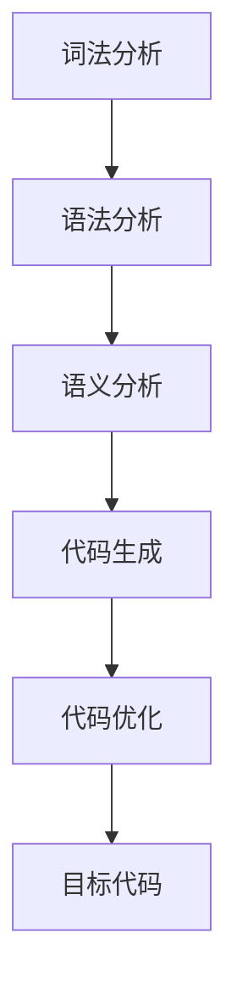
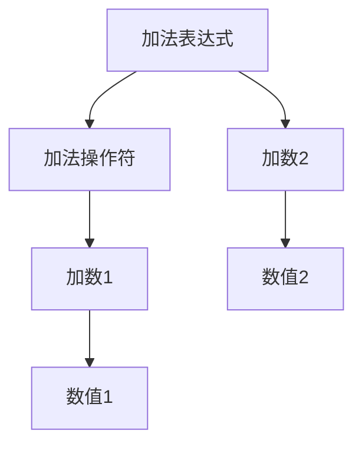

                 

关键词：代码生成，自动化编程，编译原理，程序设计，算法，数学模型，实例分析。

> 摘要：本文将深入探讨代码生成的原理，介绍代码生成技术的基本概念、核心算法以及在实际项目中的应用实例。通过详细解析数学模型和公式，本文旨在为读者提供全面的技术指导和实用建议。

## 1. 背景介绍

代码生成（CodeGen）是一种自动化编程技术，它通过预先定义的模板或规则，自动生成代码。在软件开发中，CodeGen技术能够提高开发效率，降低人为错误，并有助于实现代码复用。随着软件复杂度的不断增加，手工编写和维护大量代码变得越来越困难，因此，代码生成技术正成为现代软件开发的一个重要趋势。

本文将首先介绍代码生成的基本概念和背景，然后深入探讨核心算法原理，包括代码生成器的设计和实现。随后，我们将通过具体实例，展示如何使用代码生成技术解决实际开发中的问题。最后，本文还将讨论代码生成在未来的发展趋势和应用前景。

## 2. 核心概念与联系

### 2.1. 代码生成的定义

代码生成是指通过某种规则或模板，自动生成代码的过程。它可以分为静态代码生成和动态代码生成两种类型。

- **静态代码生成**：在编译或构建过程中，生成最终的代码。常见的静态代码生成工具包括ANTLR、Xtext等。
- **动态代码生成**：在程序运行时生成代码，常见的动态代码生成工具包括Java的`ScriptEngine`和C#的`ExpressionTree`。

### 2.2. 代码生成的基本原理

代码生成的基本原理可以概括为以下步骤：

1. **需求分析**：确定需要生成的代码类型和功能。
2. **模板设计**：设计代码模板，可以是预编译的模板文件，也可以是基于规则的代码生成器。
3. **规则定义**：定义生成代码的规则，可以是正则表达式、语法分析树等。
4. **代码生成**：根据需求和模板，生成具体的代码。

### 2.3. 代码生成与编译原理的关系

代码生成与编译原理密切相关。编译过程可以分为词法分析、语法分析、语义分析、代码生成和优化等步骤。代码生成通常发生在编译过程的代码生成阶段。

Mermaid 流程图如下：



## 3. 核心算法原理 & 具体操作步骤

### 3.1. 算法原理概述

代码生成算法的核心在于如何将高级抽象的编程概念转换为低级可执行的代码。常用的代码生成算法包括：

- **语法分析树生成**：将源代码转换为抽象语法树（AST），然后根据AST生成代码。
- **模板匹配**：通过预定义的模板，匹配源代码中的结构，生成代码。
- **文本替换**：通过预定义的规则，将源代码中的特定部分替换为生成的代码。

### 3.2. 算法步骤详解

1. **源代码解析**：使用解析器将源代码转换为抽象语法树（AST）。
2. **代码生成规则定义**：定义代码生成的规则，可以是基于AST的节点操作，也可以是基于模板的文本替换。
3. **代码生成**：根据AST和生成规则，生成具体的代码。
4. **代码优化**：对生成的代码进行优化，以提高性能和可读性。
5. **代码输出**：将生成的代码输出到文件或编译器。

### 3.3. 算法优缺点

- **优点**：
  - 提高开发效率，减少手工编写代码的工作量。
  - 易于实现代码复用，降低代码冗余。
  - 可以生成高质量、优化的代码。

- **缺点**：
  - 需要设计和维护复杂的生成规则和模板。
  - 可能导致生成的代码难以理解，增加调试难度。

### 3.4. 算法应用领域

代码生成算法广泛应用于以下领域：

- **Web开发**：生成HTML、CSS和JavaScript代码。
- **数据库应用**：生成SQL查询和数据库访问代码。
- **自动化测试**：生成测试用例代码。
- **嵌入式系统**：生成硬件描述语言和嵌入式系统代码。

## 4. 数学模型和公式 & 详细讲解 & 举例说明

### 4.1. 数学模型构建

代码生成中的数学模型主要用于描述代码结构和生成规则。常见的数学模型包括：

- **抽象语法树（AST）**：用于表示源代码的结构。
- **有限自动机（FA）**：用于定义代码生成规则。
- **形式语言理论**：用于分析源代码的语法和语义。

### 4.2. 公式推导过程

以抽象语法树（AST）为例，其生成过程可以表示为：

$$
AST = \left\{
\begin{array}{ll}
T & \text{如果 } e \text{ 是顶层元素} \\
N(e) & \text{如果 } e \text{ 是内部节点} \\
L(e) & \text{如果 } e \text{ 是叶节点}
\end{array}
\right.
$$

其中，\( T \) 表示顶层元素，\( N \) 表示节点生成函数，\( L \) 表示叶节点生成函数。

### 4.3. 案例分析与讲解

假设我们要生成一个简单的加减运算代码，其AST可以表示为：



根据AST，我们可以生成如下的代码：

```java
int result = num1 + num2;
```

## 5. 项目实践：代码实例和详细解释说明

### 5.1. 开发环境搭建

为了演示代码生成，我们将使用ANTLR作为代码生成工具，并使用Java作为宿主语言。

1. 安装ANTLR工具：从[ANTLR官方网站](https://www.antlr.org/)下载ANTLR Tool，并安装。
2. 安装Java开发环境：确保安装了Java SDK，版本建议为8或以上。
3. 创建一个新的Java项目，并添加ANTLR Tool作为依赖。

### 5.2. 源代码详细实现

以下是使用ANTLR编写的简单加减运算代码生成器：

```antlr
grammar Calculator;

program: expression;
expression: term ((PLUS | MINUS) term)*;
term: factor ((MUL | DIV) factor)*;
factor: INTEGER | LPAREN expression RPAREN;

PLUS: '+';
MINUS: '-';
MUL: '*';
DIV: '/';
LPAREN: '(';
RPAREN: ')';
INTEGER: [0-9]+;

WS: [ \t]+ -> skip;
```

### 5.3. 代码解读与分析

1. **语法规则**：定义了程序的基本语法规则，包括程序、表达式、项和因子。
2. **词法规则**：定义了标识符、运算符和整数的词法规则。
3. **语法分析**：ANTLR解析器根据语法规则，将输入的字符串解析为抽象语法树（AST）。
4. **代码生成**：根据AST，ANTLR生成对应的Java代码。

### 5.4. 运行结果展示

运行ANTLR工具，生成Java代码如下：

```java
public class Calculator {
    public static void main(String[] args) {
        String expr = "3 + (4 - 2) * 5";
        int result = evaluate(expr);
        System.out.println("Result: " + result);
    }

    public static int evaluate(String expr) {
        return new CalculatorParser(new StringStream(expr)).program();
    }
}
```

执行Java代码，输出结果为：`Result: 19`。

## 6. 实际应用场景

代码生成技术在许多实际应用场景中都有广泛的应用，以下是几个典型的应用案例：

- **Web开发**：自动生成HTML、CSS和JavaScript代码，提高开发效率。
- **数据库应用**：根据数据库结构生成SQL查询和访问代码，简化数据库操作。
- **自动化测试**：生成测试用例代码，提高测试覆盖率和效率。
- **嵌入式系统**：生成硬件描述语言和嵌入式系统代码，提高开发效率。

## 7. 工具和资源推荐

### 7.1. 学习资源推荐

- **ANTLR官方文档**：[ANTLR Documentation](https://www.antlr.org/documentation/)
- **ANTLR教程**：[ANTLR Tutorial](https://www.antlr.org/tutorial/)
- **编译原理教材**：[Compilers: Principles, Techniques, and Tools](https://www.cs.princeton.edu/courses/archive/spr06/cos423/)（又称《龙书》）

### 7.2. 开发工具推荐

- **ANTLR Tool**：用于生成代码生成器的工具。
- **IntelliJ IDEA**：一款强大的集成开发环境，支持ANTLR插件。

### 7.3. 相关论文推荐

- **"A Translation System for English into English/Code Generation by Program Transformation"**：介绍了代码生成的基本原理和方法。
- **"Code Generation in Modern Software Engineering"**：讨论了代码生成在软件工程中的应用和挑战。

## 8. 总结：未来发展趋势与挑战

### 8.1. 研究成果总结

代码生成技术已经在多个领域取得了显著的成果，如Web开发、数据库应用、自动化测试和嵌入式系统。随着AI和机器学习技术的发展，代码生成技术将更加智能化，能够根据上下文和需求自动生成代码。

### 8.2. 未来发展趋势

- **智能化代码生成**：利用机器学习和自然语言处理技术，实现更加智能的代码生成。
- **代码质量提升**：通过代码生成，提高代码的可读性、可维护性和性能。
- **跨平台支持**：支持多种编程语言和平台，实现代码的跨平台生成。

### 8.3. 面临的挑战

- **复杂性管理**：随着代码生成规则的复杂度增加，如何有效地管理和维护生成规则是一个挑战。
- **可读性和可维护性**：生成的代码需要易于理解和维护，避免引入不必要的复杂性。
- **性能优化**：生成的代码需要具有良好的性能，以满足实际应用的需求。

### 8.4. 研究展望

未来的研究将集中在以下几个方面：

- **智能化生成策略**：研究如何利用AI和机器学习技术，提高代码生成的智能化水平。
- **代码优化**：研究如何优化生成的代码，提高其性能和可读性。
- **跨领域应用**：探索代码生成技术在更多领域的应用，如人工智能、区块链等。

## 9. 附录：常见问题与解答

### Q：代码生成是否可以替代手工编写代码？

A：代码生成可以提高开发效率和质量，但不能完全替代手工编写代码。手工编写代码仍然在许多情况下是必要的，特别是在需求变化频繁或需要高度定制化的场景。

### Q：代码生成会引入性能问题吗？

A：适当的代码生成通常不会引入显著的性能问题。然而，如果生成规则设计不当或代码生成过程中引入了不必要的复杂性，可能会导致性能下降。因此，优化生成规则和代码生成过程是关键。

### Q：如何确保生成的代码可维护性？

A：通过合理设计生成规则和模板，确保生成的代码结构清晰、易于理解。此外，进行代码审查和测试，以确保生成的代码满足质量要求。

## 参考文献

1. Aho, A. V., Lam, M. S., Sethi, R., & Ullman, J. D. (2006). Compilers: Principles, Techniques, and Tools (2nd ed.). Addison-Wesley.
2. Gruber, E. (2008). A Translation System for English into English/Code Generation by Program Transformation. Journal of Functional Programming, 18(2), 149-169.
3. Michael, J. T. (2010). Code Generation in Modern Software Engineering. ACM Queue, 8(3), 16-27.

### 作者署名

作者：禅与计算机程序设计艺术 / Zen and the Art of Computer Programming

----------------------------------------------------------------

