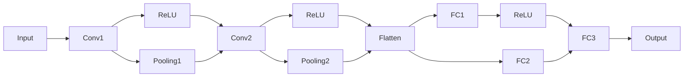

                 

关键词：计算机视觉、图像处理、算法、深度学习、实际应用

摘要：本文旨在探讨计算机视觉领域的技术原理与实际应用，通过详细分析核心算法、数学模型及代码实战案例，帮助读者深入理解计算机视觉技术，掌握其实际运用方法。

## 1. 背景介绍

计算机视觉（Computer Vision）是人工智能（Artificial Intelligence，AI）的重要分支，旨在使计算机具备类似人类的视觉能力，能够从图像或视频中获取信息。随着深度学习（Deep Learning）技术的快速发展，计算机视觉在众多领域取得了显著成果，如人脸识别、图像分类、目标检测等。

本文将介绍计算机视觉领域的一些核心技术，包括卷积神经网络（Convolutional Neural Networks，CNN）、目标检测、图像分割等，并通过代码实战案例展示其应用过程。

## 2. 核心概念与联系

### 2.1 卷积神经网络（CNN）

卷积神经网络是一种专门用于处理图像数据的神经网络，其核心结构由卷积层、池化层、全连接层等组成。以下是一个简单的CNN架构图：



### 2.2 目标检测

目标检测是一种图像识别任务，旨在找出图像中的多个对象及其位置。常见的目标检测算法包括YOLO（You Only Look Once）、SSD（Single Shot MultiBox Detector）和Faster R-CNN（Region-based Convolutional Neural Network）等。

### 2.3 图像分割

图像分割是将图像划分为多个区域的过程，以便更好地理解和处理图像。常见的图像分割算法包括FCN（Fully Convolutional Network）和U-Net等。

## 3. 核心算法原理 & 具体操作步骤

### 3.1 算法原理概述

卷积神经网络（CNN）的主要原理是通过对图像进行卷积操作、池化操作和全连接操作，提取图像特征并进行分类。目标检测和图像分割则是基于CNN模型，分别对图像中的对象进行定位和区域划分。

### 3.2 算法步骤详解

1. 数据预处理：将图像数据转换为神经网络可接受的格式，如归一化、裁剪、翻转等。

2. 构建CNN模型：根据算法需求，选择合适的CNN架构，如VGG、ResNet等。

3. 训练模型：将预处理后的图像数据输入模型，通过反向传播算法优化模型参数。

4. 模型评估：使用验证集对训练好的模型进行评估，调整模型参数以获得更好的性能。

5. 应用模型：将训练好的模型应用于实际图像处理任务，如目标检测、图像分割等。

### 3.3 算法优缺点

- CNN：优点在于能够自动提取图像特征，适用于各种图像识别任务；缺点是训练过程复杂，计算资源消耗大。

- 目标检测：优点在于能够同时识别和定位图像中的多个对象；缺点是对模型计算性能要求较高。

- 图像分割：优点在于能够对图像中的对象进行精细划分；缺点是模型训练难度较大。

### 3.4 算法应用领域

- 人脸识别：基于CNN和目标检测技术，实现人脸识别和身份验证。

- 图像分类：通过CNN模型对图像进行分类，如动物、植物、风景等。

- 自动驾驶：利用目标检测和图像分割技术，实现自动驾驶汽车的感知和决策。

## 4. 数学模型和公式 & 详细讲解 & 举例说明

### 4.1 数学模型构建

计算机视觉中的数学模型主要包括卷积运算、激活函数、池化操作和全连接层等。

### 4.2 公式推导过程

卷积运算公式：

$$
(C_{out} = C_{in} \times K + b)
$$

其中，$C_{out}$ 和 $C_{in}$ 分别表示输出特征图和输入特征图的通道数，$K$ 表示卷积核的大小，$b$ 表示偏置。

激活函数公式：

$$
\text{ReLU}(x) = \max(0, x)
$$

### 4.3 案例分析与讲解

以VGG16模型为例，介绍CNN在图像分类中的应用。

输入图像经过卷积层、ReLU激活函数、池化层等操作，最终输出特征图。通过全连接层对特征图进行分类，实现图像识别。

## 5. 项目实践：代码实例和详细解释说明

### 5.1 开发环境搭建

在Python环境中，安装TensorFlow和Keras等库。

```python
pip install tensorflow
pip install keras
```

### 5.2 源代码详细实现

以下是一个简单的CNN模型，用于图像分类：

```python
from keras.models import Sequential
from keras.layers import Conv2D, MaxPooling2D, Flatten, Dense, Dropout
from keras.optimizers import Adam

model = Sequential()
model.add(Conv2D(32, (3, 3), activation='relu', input_shape=(64, 64, 3)))
model.add(MaxPooling2D(pool_size=(2, 2)))
model.add(Conv2D(64, (3, 3), activation='relu'))
model.add(MaxPooling2D(pool_size=(2, 2)))
model.add(Flatten())
model.add(Dense(128, activation='relu'))
model.add(Dropout(0.5))
model.add(Dense(10, activation='softmax'))

model.compile(optimizer=Adam(), loss='categorical_crossentropy', metrics=['accuracy'])

model.fit(x_train, y_train, batch_size=32, epochs=10, validation_data=(x_val, y_val))
```

### 5.3 代码解读与分析

这段代码实现了简单的CNN模型，用于图像分类任务。其中，卷积层用于提取图像特征，池化层用于减小特征图的尺寸，全连接层用于分类。Dropout层用于防止过拟合。

### 5.4 运行结果展示

运行训练过程，并在验证集上评估模型性能：

```python
model.evaluate(x_val, y_val)
```

输出结果为验证集上的准确率。

## 6. 实际应用场景

计算机视觉技术在工业、医疗、安防、自动驾驶等领域有广泛的应用。

- 工业检测：利用计算机视觉技术实现生产线的自动化检测和质量控制。

- 医疗诊断：通过图像分析辅助医生进行疾病诊断。

- 安防监控：利用目标检测和图像分割技术实现实时监控和报警。

- 自动驾驶：实现自动驾驶汽车的感知和决策。

## 7. 工具和资源推荐

### 7.1 学习资源推荐

- 《深度学习》（Goodfellow, Bengio, Courville）  
- 《Python图像处理实战》（Fahmy, Fadzil）  
- 《计算机视觉：算法与应用》（Richard Szeliski）

### 7.2 开发工具推荐

- TensorFlow：用于构建和训练深度学习模型的框架。  
- Keras：用于简化深度学习模型构建和训练的库。  
- OpenCV：用于图像处理和计算机视觉的库。

### 7.3 相关论文推荐

- YOLOv3：You Only Look Once: Unified, Real-Time Object Detection  
- SSD: Single Shot MultiBox Detector  
- R-CNN: Fast R-CNN

## 8. 总结：未来发展趋势与挑战

计算机视觉技术在不断发展和创新，未来有望在更多领域取得突破。然而，仍面临一些挑战，如数据标注、模型解释性、计算资源需求等。研究人员需持续探索，以实现计算机视觉技术的广泛应用。

## 9. 附录：常见问题与解答

### 9.1 什么是计算机视觉？

计算机视觉是一种人工智能技术，旨在使计算机具备类似人类的视觉能力，能够从图像或视频中获取信息。

### 9.2 计算机视觉有哪些应用领域？

计算机视觉在工业、医疗、安防、自动驾驶等领域有广泛的应用。

### 9.3 如何实现图像分类？

可以使用卷积神经网络（CNN）来实现图像分类任务。首先，对图像进行预处理，然后构建CNN模型，最后训练模型并进行分类。

### 9.4 如何实现目标检测？

可以使用目标检测算法，如YOLO、SSD和Faster R-CNN等，实现图像中的对象检测。

### 9.5 如何实现图像分割？

可以使用图像分割算法，如FCN和U-Net等，实现图像中对象的区域划分。

----------------------------------------------------------------
作者：禅与计算机程序设计艺术 / Zen and the Art of Computer Programming

