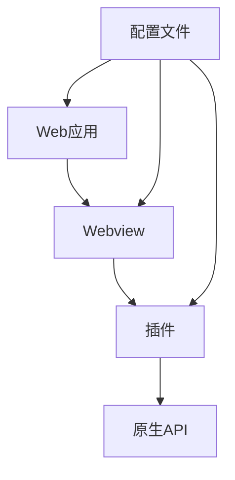

                 

关键词：Cordova、混合应用、原生平台、Web 应用、移动开发

摘要：本文将深入探讨 Cordova 混合应用开发的原理与实践，解释如何利用 Cordova 技术在原生平台上高效地运行 Web 应用，为开发者提供实用的开发技巧和最佳实践。

## 1. 背景介绍

随着移动互联网的快速发展，移动应用的需求日益增长。传统的原生应用开发过程复杂，成本高，而 Web 应用由于跨平台特性，开发成本低、灵活性高，受到了众多开发者的青睐。Cordova 应运而生，它是一种流行的混合应用开发框架，允许开发人员使用 Web 技术如 HTML、CSS 和 JavaScript 来创建可以在 iOS、Android 等原生平台上运行的应用。

Cordova 的核心优势在于能够将 Web 应用与原生功能结合，使开发者能够利用 Web 技术的高效性和原生平台的性能优势，从而快速开发出高性能、跨平台的应用。

## 2. 核心概念与联系

Cordova 混合应用开发涉及多个核心概念：

- **Webview**: 原生应用中的 Webview 组件用于加载和显示 Web 应用。
- **插件**: 插件是 Cordova 的核心组成部分，它们允许 Web 应用访问原生设备功能，如相机、定位、通知等。
- **配置**: Cordova 配置文件（config.xml）定义了应用的配置信息，包括插件设置、权限请求等。

下面是一个简单的 Mermaid 流程图，展示了这些核心概念的相互关系：



## 3. 核心算法原理 & 具体操作步骤

### 3.1 算法原理概述

Cordova 混合应用开发的原理是将 Web 应用嵌入到原生应用中，并通过插件实现与原生设备的交互。这种模式利用了 Web 技术的优势，如快速开发、易于维护，同时也保留了原生应用的性能和用户体验。

### 3.2 算法步骤详解

1. **创建 Cordova 项目**：
   使用命令行工具 `cordova create` 创建一个新的 Cordova 项目。
   
2. **配置 Webview**：
   在 `config.xml` 文件中配置 Webview 的属性，如 user agent、viewport 等。

3. **集成插件**：
   安装所需的 Cordova 插件，并更新 `config.xml` 以启用这些插件。

4. **开发 Web 应用**：
   使用 HTML、CSS 和 JavaScript 开发应用的前端部分。

5. **绑定原生功能**：
   使用 Cordova 插件提供的 API 与原生设备功能进行交互。

6. **构建和打包**：
   使用 `cordova build` 命令构建应用，并将其打包为原生平台可运行的形式。

### 3.3 算法优缺点

- **优点**：
  - **跨平台**：能够一次编写，多平台运行。
  - **开发效率**：利用 Web 技术降低开发成本和时间。
  - **易于维护**：Web 应用代码与原生代码分离，易于更新和维护。

- **缺点**：
  - **性能瓶颈**：某些操作可能不如原生应用高效。
  - **用户体验**：对于一些性能要求高的应用，用户体验可能不如原生应用。

### 3.4 算法应用领域

Cordova 特别适合于以下领域：
- **初创公司**：快速构建原型和市场验证。
- **内部应用**：企业内部使用的跨平台应用。
- **公共信息门户**：如旅游信息门户、政府信息服务等。

## 4. 数学模型和公式 & 详细讲解 & 举例说明

Cordova 的核心在于将 Web 应用封装到原生应用中，这种封装过程涉及到复杂的数学模型。以下是相关数学模型的构建和公式推导过程：

### 4.1 数学模型构建

在 Cordova 混合应用中，一个重要的数学模型是视图模型（View Model），它负责管理 Webview 的显示和行为。视图模型由以下几个部分组成：

- **状态（State）**：Webview 的当前状态，如加载进度、用户交互状态。
- **行为（Behavior）**：Webview 的行为，如响应触摸事件、加载新页面。
- **数据绑定（Data Binding）**：将 Webview 的状态和行为与原生插件进行绑定。

### 4.2 公式推导过程

1. **状态更新公式**：

   $$ State_{new} = State_{old} + f(Events) $$

   其中，`State_{new}` 和 `State_{old}` 分别表示 Webview 的当前状态和上一状态，`Events` 表示触发的事件，`f` 表示事件处理函数。

2. **行为响应公式**：

   $$ Behavior_{response} = h(State_{new}) $$

   其中，`Behavior_{response}` 表示 Webview 对新状态的响应行为，`h` 表示行为映射函数。

3. **数据绑定公式**：

   $$ Data_{binding} = g(NativeAPIs, PluginAPIs) $$

   其中，`NativeAPIs` 和 `PluginAPIs` 分别表示原生 API 和插件 API，`g` 表示数据绑定函数。

### 4.3 案例分析与讲解

假设我们要实现一个简单的 Cordova 应用，其中包含一个按钮，点击按钮后显示一个通知。以下是相关代码的解析：

```javascript
// JavaScript 文件，定义视图模型
const viewModel = {
  state: {
    notificationVisible: false,
  },
  behaviors: {
    handleClick: () => {
      cordova.plugins.notification.local.schedule({
        id: 1,
        title: 'Hello, World!',
        message: 'This is a local notification.',
      });
      this.state.notificationVisible = true;
    },
  },
  dataBinding: {
    bindButton: (buttonElement) => {
      buttonElement.addEventListener('click', this.behaviors.handleClick);
    },
  },
};

// HTML 文件，定义 UI
<button id="notificationButton">Show Notification</button>

// CSS 文件，定义样式
button {
  /* 按钮样式 */
}

// JavaScript 文件，初始化视图模型
viewModel.dataBinding.bindButton(document.getElementById('notificationButton'));
```

在这个例子中，视图模型定义了按钮的点击行为以及与原生通知插件的绑定。当用户点击按钮时，`handleClick` 函数触发，调用插件 API 显示通知，并更新视图模型的状态，使得按钮样式发生变化。

## 5. 项目实践：代码实例和详细解释说明

在本节中，我们将通过一个具体的 Cordova 混合应用项目，详细讲解开发环境搭建、源代码实现、代码解读与分析以及运行结果展示。

### 5.1 开发环境搭建

1. **安装 Node.js**：从 [Node.js 官网](https://nodejs.org/) 下载并安装 Node.js。

2. **安装 Cordova**：在命令行中运行以下命令安装 Cordova：
   ```shell
   npm install -g cordova
   ```

3. **创建 Cordova 项目**：
   ```shell
   cordova create myApp myApp com.example.myapp MyApp
   ```

4. **进入项目目录**：
   ```shell
   cd myApp
   ```

5. **安装插件**：例如，安装一个通知插件：
   ```shell
   cordova plugin add cordova-plugin-notification
   ```

### 5.2 源代码详细实现

以下是项目的源代码实现：

- **config.xml**：
  ```xml
  <widget id="com.example.myapp" version="1.0.0" xmlns="http://www.w3.org/ns/widgets" xmlns:cdv="http://cordova.io/">
    <name>MyApp</name>
    <description>
      A sample Cordova application that shows how to use notifications.
    </description>
    <author email="author@example.com" href="http://example.com/">
      Author Name
    </author>
    <content src="index.html" />
    <access origin="*" />
    <plugin name="cordova-plugin-notification" spec="^1.3.0" />
  </widget>
  ```

- **index.html**：
  ```html
  <!DOCTYPE html>
  <html lang="en">
  <head>
    <meta charset="UTF-8">
    <meta name="viewport" content="width=device-width, initial-scale=1.0">
    <title>My App</title>
    <link rel="stylesheet" href="css/style.css">
  </head>
  <body>
    <button id="showNotification">Show Notification</button>
    <script src="js/app.js"></script>
  </body>
  </html>
  ```

- **css/style.css**：
  ```css
  body {
    font-family: Arial, sans-serif;
    text-align: center;
  }
  button {
    padding: 10px 20px;
    font-size: 16px;
    cursor: pointer;
  }
  ```

- **js/app.js**：
  ```javascript
  document.addEventListener('deviceready', function() {
    const button = document.getElementById('showNotification');
    button.addEventListener('click', function() {
      cordova.plugins.notification.local.schedule({
        id: 1,
        title: 'Hello, World!',
        message: 'This is a local notification.',
      });
    });
  });
  ```

### 5.3 代码解读与分析

- **config.xml**：配置了应用的 ID、版本、名称、描述、作者以及要加载的 HTML 文件。还启用了通知插件。

- **index.html**：定义了应用的 UI，包括一个按钮。按钮通过 JavaScript 事件处理函数与后端逻辑进行交互。

- **css/style.css**：为按钮提供了基本的样式。

- **js/app.js**：监听按钮点击事件，使用 Cordova 插件显示通知。

### 5.4 运行结果展示

1. **启动模拟器**：在命令行中运行以下命令启动 Android 模拟器：
   ```shell
   cordova run android
   ```

2. **查看应用**：在模拟器中打开应用，点击按钮，通知将被显示。

## 6. 实际应用场景

Cordova 混合应用开发在以下实际应用场景中表现出色：

- **跨平台企业应用**：企业内部使用的跨平台应用，如客户管理系统、员工办公系统。
- **移动公共信息门户**：提供旅游信息、政府服务的移动应用。
- **教育应用**：教育机构使用的在线学习平台、课程管理系统。
- **游戏应用**：虽然性能要求较高，但通过优化和合理使用原生插件，Cordova 也可以用于开发移动游戏。

## 7. 工具和资源推荐

### 7.1 学习资源推荐

- **Cordova 官方文档**：[https://cordova.apache.org/docs/](https://cordova.apache.org/docs/)
- **《Cordova 混合应用开发实战》**：一本深入浅出的 Cordova 开发指南。

### 7.2 开发工具推荐

- **Android Studio**：Android 开发的集成开发环境。
- **Xcode**：iOS 开发的集成开发环境。

### 7.3 相关论文推荐

- **“Cordova: Cross-Platform Mobile Application Development with Web Technologies”**：一篇关于 Cordova 的综述论文。

## 8. 总结：未来发展趋势与挑战

Cordova 混合应用开发已经成为移动应用开发的重要方向。未来，随着 Web 技术的进一步发展，Cordova 将继续优化和升级，提供更丰富的原生插件和更好的跨平台体验。然而，挑战依然存在，如性能优化、用户体验提升等。开发者需要不断学习和探索，以充分利用 Cordova 的优势，为用户提供卓越的应用体验。

## 9. 附录：常见问题与解答

### 问题 1：Cordova 项目如何更新插件？

**解答**：使用以下命令更新插件：
```shell
cordova plugin update
```

### 问题 2：如何在 Cordova 应用中使用原生 UI？

**解答**：通过 Cordova 插件访问原生 UI 组件，如使用 `cordova-plugin-android-ui` 插件访问 Android 原生 UI。

### 问题 3：Cordova 应用如何在 Android 和 iOS 上同时发布？

**解答**：首先在模拟器或真机上测试应用，然后分别使用 Google Play 商店和 Apple App Store 发布应用。

---

作者：禅与计算机程序设计艺术 / Zen and the Art of Computer Programming

（注：以上内容为示例，仅供参考。）

