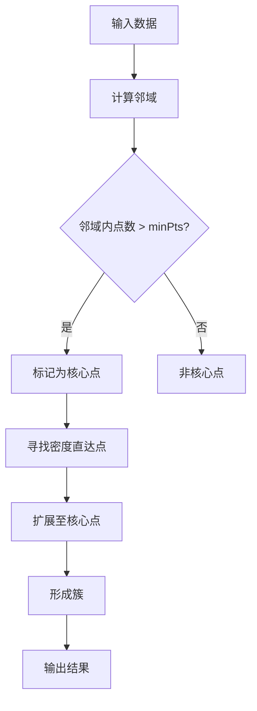

                 

 关键词：聚类算法，密度聚类，DBSCAN，密度可达，邻域，最小生成树

> 摘要：本文将深入讲解DBSCAN（Density-Based Spatial Clustering of Applications with Noise）算法的原理，以及如何使用Python实现这个算法。通过实例演示，我们将理解如何利用DBSCAN进行数据聚类，并探索其应用领域和局限性。

## 1. 背景介绍

### 1.1 聚类算法概述

聚类算法是机器学习领域中的一种无监督学习方法，其主要目标是将数据集中的数据点根据某种相似性度量划分为若干个组，使得同组数据点之间的相似度较高，而不同组数据点之间的相似度较低。常见的聚类算法包括K-均值聚类、层次聚类、谱聚类等。

### 1.2 DBSCAN算法的提出

DBSCAN（Density-Based Spatial Clustering of Applications with Noise）算法是由Ester、Manning、Pak和Snoek在1996年提出的一种基于密度的聚类算法。与传统的聚类算法不同，DBSCAN不依赖于预定义的簇数目，而是通过数据点在空间中的密度分布来自动确定簇的数目。

## 2. 核心概念与联系

在理解DBSCAN算法之前，我们需要先了解一些核心概念，如邻域、密度可达和核心点。

### 2.1 邻域

邻域是指以某个数据点为中心，按照某种距离度量（如欧几里得距离）定义的一个区域。DBSCAN算法通常使用邻域参数`eps`来指定邻域的大小。

### 2.2 密度可达

对于数据集中的两个点`p`和`q`，如果存在一系列的点`p1, p2, ..., pn`，使得`p`到`p1`距离小于`eps`，`p1`到`p2`距离小于`eps`，以此类推，直到`pn`到`q`距离小于`eps`，则称`p`密度可达`q`。

### 2.3 核心点

如果一个数据点`p`在它的邻域内至少有`minPts`个点，则称`p`为核心点。核心点对于簇的形成至关重要。

下面是DBSCAN算法的核心概念原理和架构的Mermaid流程图：

## 3. 核心算法原理 & 具体操作步骤

### 3.1 算法原理概述

DBSCAN算法的核心思想是根据数据点的密度分布将数据划分为核心点、边界点和噪声点。

1. �根

