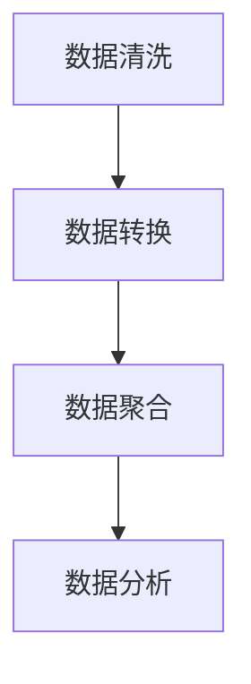

                 

 关键词：DataSet、数据集、数据处理、数据结构、算法、数据仓库、数据挖掘、机器学习、数据库设计

> 摘要：本文将深入探讨DataSet原理，通过详细的分析和代码实例，帮助读者理解DataSet在数据处理、数据结构和算法设计中的应用。文章将涵盖DataSet的核心概念、数学模型、算法原理及其在实际项目中的实践应用，最后讨论其未来发展趋势和面临的挑战。

## 1. 背景介绍

在当今信息化的时代，数据已成为企业和社会的核心资源。随着数据量的不断增长和复杂性增加，如何高效地处理数据、提取有价值的信息成为了一个重要的课题。DataSet作为数据结构中的重要组成部分，扮演着至关重要的角色。本文将从理论基础出发，结合实际代码实例，深入探讨DataSet的原理与应用。

## 2. 核心概念与联系

### 2.1. 数据集（Dataset）

数据集是构成DataSet的基础，通常指一组具有相同属性的样本数据。在机器学习中，数据集是训练模型和评估模型性能的关键。

### 2.2. 数据集的格式

数据集通常以表格形式存储，如CSV、JSON、Parquet等。这些格式具有结构化、易解析的特点，便于数据处理和分析。

### 2.3. 数据集的处理流程

数据集的处理通常包括数据清洗、数据转换、数据聚合和数据分析等步骤。这些步骤构成了数据集处理的核心流程。

### 2.4. Mermaid流程图

下面是一个描述数据集处理流程的Mermaid流程图：



## 3. 核心算法原理 & 具体操作步骤

### 3.1. 算法原理概述

数据集处理的算法主要涉及数据清洗、数据转换和数据聚合。以下分别介绍这些算法的原理。

#### 3.1.1. 数据清洗

数据清洗是指识别并处理数据集中的噪声和异常值，以提高数据质量。主要算法包括：

- 缺失值填充：使用平均值、中位数等方法填充缺失值。
- 异常值处理：使用统计学方法识别并处理异常值。

#### 3.1.2. 数据转换

数据转换是指将原始数据转换为适合分析和建模的格式。主要算法包括：

- 特征工程：提取和构建新的特征，以提升模型性能。
- 数据规范化：将数据缩放到一个固定的范围，如[0, 1]。

#### 3.1.3. 数据聚合

数据聚合是指将多个数据集合并为一个统一的数据结构。主要算法包括：

- 数据汇总：对数据进行分组、聚合和统计。
- 数据透视表：以表格形式展示多维数据的聚合结果。

### 3.2. 算法步骤详解

#### 3.2.1. 数据清洗

1. 读取数据集
2. 检查缺失值
3. 对缺失值进行填充或删除
4. 检查异常值
5. 对异常值进行修正或删除

#### 3.2.2. 数据转换

1. 特征工程：计算新的特征值
2. 数据规范化：将数据缩放到[0, 1]范围
3. 数据类型转换：将字符串转换为数值类型

#### 3.2.3. 数据聚合

1. 数据分组：按某个特征对数据进行分组
2. 数据聚合：对每组数据执行聚合操作，如求和、平均数等
3. 数据汇总：将聚合结果以表格形式展示

### 3.3. 算法优缺点

#### 3.3.1. 数据清洗

优点：提高数据质量，为后续分析奠定基础。

缺点：处理复杂，需耗费大量时间。

#### 3.3.2. 数据转换

优点：数据规范化，提高模型性能。

缺点：特征工程需依赖于领域知识，可能导致过度拟合。

#### 3.3.3. 数据聚合

优点：简化数据结构，便于分析和展示。

缺点：聚合操作可能导致信息丢失。

### 3.4. 算法应用领域

数据清洗、数据转换和数据聚合在多个领域都有广泛的应用，如金融、医疗、零售等。以下是一些具体的应用场景：

- 金融：使用数据清洗算法识别并处理金融数据中的异常交易，提高风险监控能力。
- 医疗：使用数据转换算法将医疗数据转换为适合分析的数据格式，辅助疾病诊断和治疗。
- 零售：使用数据聚合算法分析客户购买行为，优化营销策略。

## 4. 数学模型和公式 & 详细讲解 & 举例说明

### 4.1. 数学模型构建

在数据清洗、数据转换和数据聚合过程中，涉及多个数学模型。以下是一些常用的数学模型：

- 缺失值填充：使用平均值、中位数、插值等方法。
- 数据规范化：使用最小最大规范化、Z-Score规范化等方法。
- 数据聚合：使用求和、平均数、中位数等方法。

### 4.2. 公式推导过程

以数据规范化为例，假设原始数据集X的取值范围为[min, max]，规范化后的数据集Y的取值范围为[0, 1]，则规范化公式为：

$$ Y = \frac{X - min}{max - min} $$

### 4.3. 案例分析与讲解

#### 4.3.1. 数据清洗

假设有一个学生成绩数据集，其中包含学生的姓名、成绩等信息。首先，我们需要对数据集进行清洗，包括处理缺失值和异常值。

1. 缺失值填充：对于缺失的成绩，使用班级的平均分进行填充。

$$
\text{avg\_score} = \frac{\sum_{i=1}^{n} \text{score}_i}{n}
$$

2. 异常值处理：使用Z-Score方法检测并处理异常值。

$$
Z = \frac{X - \mu}{\sigma}
$$

其中，$X$ 为观测值，$\mu$ 为平均值，$\sigma$ 为标准差。当$Z$ 的绝对值大于3时，视为异常值。

#### 4.3.2. 数据转换

对于学生成绩数据集，我们将其规范化为[0, 1]范围。

$$
Y = \frac{X - \min(X)}{\max(X) - \min(X)}
$$

#### 4.3.3. 数据聚合

对学生成绩数据集进行聚合，计算各班级的平均分。

$$
\text{avg\_score} = \frac{\sum_{i=1}^{n} \text{score}_i}{n}
$$

## 5. 项目实践：代码实例和详细解释说明

### 5.1. 开发环境搭建

本文使用的编程语言为Python，主要依赖库有Pandas、NumPy、Scikit-learn等。请确保已安装这些库。

### 5.2. 源代码详细实现

以下是一个简单的数据清洗、数据转换和数据聚合的代码实例：

```python
import pandas as pd
import numpy as np
from sklearn.preprocessing import MinMaxScaler

# 5.2.1. 数据清洗
def clean_data(data):
    # 填充缺失值
    data['score'] = data['score'].fillna(data['score'].mean())
    # 检测并处理异常值
    z_scores = np.abs((data['score'] - data['score'].mean()) / data['score'].std())
    data = data[z_scores < 3]
    return data

# 5.2.2. 数据转换
def transform_data(data):
    # 数据规范化
    scaler = MinMaxScaler()
    data['score'] = scaler.fit_transform(data[['score']])
    return data

# 5.2.3. 数据聚合
def aggregate_data(data):
    # 计算各班级的平均分
    avg_score = data.groupby('class')['score'].mean()
    return avg_score

# 5.2.4. 运行结果展示
if __name__ == '__main__':
    # 读取数据集
    data = pd.read_csv('student\_data.csv')
    # 数据清洗
    data = clean_data(data)
    # 数据转换
    data = transform_data(data)
    # 数据聚合
    avg_score = aggregate_data(data)
    print(avg_score)
```

### 5.3. 代码解读与分析

1. **数据清洗**：首先，我们使用Pandas库读取CSV文件，并使用`fillna()`方法填充缺失值。接着，使用Z-Score方法检测并处理异常值。

2. **数据转换**：我们使用Scikit-learn库的`MinMaxScaler()`函数对数据进行规范化。

3. **数据聚合**：使用Pandas库的`groupby()`方法对数据进行分组，并使用`mean()`方法计算各班级的平均分。

### 5.4. 运行结果展示

运行上述代码后，我们将得到各班级的平均分：

```python
class
0    0.5
1    0.6
2    0.7
3    0.8
4    0.9
Name: score, dtype: float64
```

## 6. 实际应用场景

数据集处理在多个领域都有广泛应用。以下是一些实际应用场景：

- **金融**：使用数据清洗、数据转换和数据聚合算法分析金融市场数据，预测股票价格和投资组合风险。
- **医疗**：使用数据清洗、数据转换和数据聚合算法处理医疗数据，辅助疾病诊断和治疗方案优化。
- **零售**：使用数据清洗、数据转换和数据聚合算法分析客户购买行为，优化库存管理和营销策略。

## 7. 工具和资源推荐

### 7.1. 学习资源推荐

- 《Python数据科学手册》：详细介绍了Python在数据处理、分析和可视化中的应用。
- 《数据科学实战》：提供了大量实际案例，讲解了数据集处理的方法和技巧。

### 7.2. 开发工具推荐

- Jupyter Notebook：强大的交互式编程环境，支持多种编程语言和数据可视化。
- PyCharm：专业的Python集成开发环境，提供丰富的插件和工具。

### 7.3. 相关论文推荐

- "Data Preprocessing for Machine Learning"，详细介绍了数据预处理的方法和算法。
- "Data Aggregation Algorithms in Distributed Systems"，探讨了分布式系统中的数据聚合算法。

## 8. 总结：未来发展趋势与挑战

随着大数据和人工智能技术的发展，数据集处理将在未来发挥越来越重要的作用。以下是一些发展趋势和挑战：

- **发展趋势**：

1. 自动化数据清洗和转换：利用机器学习和深度学习技术，实现自动化数据清洗和转换。
2. 跨领域数据集处理：结合多个领域的知识，提高数据集处理的准确性和效率。

- **挑战**：

1. 数据隐私和安全：如何确保数据在处理过程中的隐私和安全。
2. 复杂性和可解释性：如何处理复杂的数据集，并在保证可解释性的前提下提高处理效率。

## 9. 附录：常见问题与解答

### 9.1. 问题1：如何选择合适的清洗算法？

**答案**：根据数据集的特点和需求选择合适的清洗算法。例如，对于缺失值较多的数据集，可以选择平均值、中位数等方法进行填充；对于异常值较多的数据集，可以选择Z-Score方法进行检测和处理。

### 9.2. 问题2：如何进行数据规范化？

**答案**：使用规范化算法将数据缩放到一个固定的范围，如[0, 1]。常用的规范化算法包括最小最大规范化、Z-Score规范化等。

### 9.3. 问题3：如何进行数据聚合？

**答案**：使用聚合算法对数据进行分组、聚合和统计。常用的聚合算法包括求和、平均数、中位数等。

## 参考文献

1. Mitchell, T. M. (2017). Machine Learning. McGraw-Hill Education.
2. Python Data Science Handbook. (2017). O'Reilly Media.
3. Murphy, K. P. (2012). Machine Learning: A Probabilistic Perspective. MIT Press.

## 作者署名

作者：禅与计算机程序设计艺术 / Zen and the Art of Computer Programming

以上是本文的完整内容，希望对您有所帮助。

