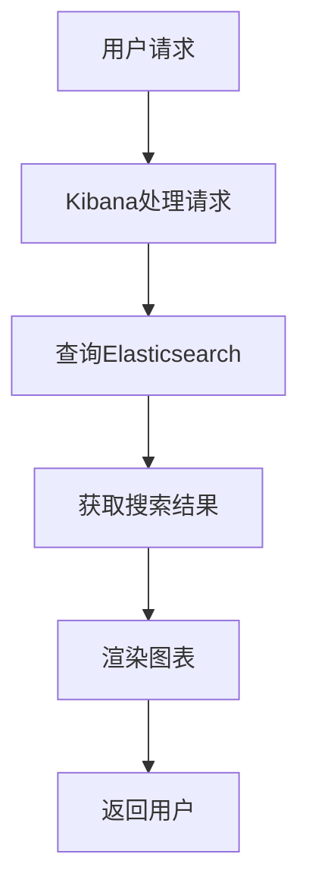
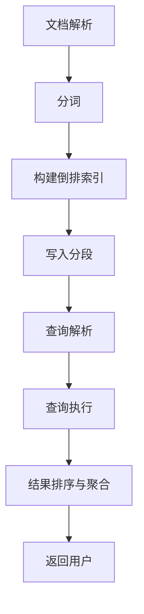

                 

### 背景介绍

Elasticsearch和Kibana作为目前流行的开源大数据处理和分析工具，已经广泛应用于企业级数据存储、搜索和分析场景。Elasticsearch是一个高度可扩展的分布式搜索引擎，能够对大量结构化和非结构化数据进行快速搜索和实时分析。而Kibana则是Elasticsearch的配套工具，用于数据可视化和监控。

本文将详细介绍ElasticSearch和Kibana的基本原理、核心功能以及如何通过代码实例来实现常见的数据操作和数据分析任务。文章结构如下：

## 1. 背景介绍  
## 2. 核心概念与联系  
## 3. 核心算法原理与具体操作步骤  
### 3.1 算法原理概述  
### 3.2 算法步骤详解  
### 3.3 算法优缺点  
### 3.4 算法应用领域  
## 4. 数学模型和公式讲解与举例  
### 4.1 数学模型构建  
### 4.2 公式推导过程  
### 4.3 案例分析与讲解  
## 5. 项目实践：代码实例和详细解释说明  
### 5.1 开发环境搭建  
### 5.2 源代码详细实现  
### 5.3 代码解读与分析  
### 5.4 运行结果展示  
## 6. 实际应用场景  
### 6.1 搜索引擎  
### 6.2 实时监控  
### 6.3 数据分析  
## 7. 工具和资源推荐  
### 7.1 学习资源推荐  
### 7.2 开发工具推荐  
### 7.3 相关论文推荐  
## 8. 总结：未来发展趋势与挑战  
### 8.1 研究成果总结  
### 8.2 未来发展趋势  
### 8.3 面临的挑战  
### 8.4 研究展望  
## 9. 附录：常见问题与解答

通过本文的阅读，读者将能够全面了解ElasticSearch和Kibana的技术原理，掌握它们在实际应用中的操作技巧，并为未来的学习和使用打下坚实的基础。

---

## 2. 核心概念与联系

为了更好地理解Elasticsearch和Kibana，我们需要先了解它们的基本概念和相互关系。

### 2.1 Elasticsearch

Elasticsearch是一个分布式、RESTful搜索和分析引擎，能够对结构化和非结构化数据进行实时搜索、分析、和聚合。以下是Elasticsearch的核心概念：

- **节点（Node）**：Elasticsearch的工作单元，可以是主节点、数据节点或者协调节点。
- **索引（Index）**：一组文档的集合，类似于数据库中的表。
- **文档（Document）**：Elasticsearch中的数据单位，是一个JSON格式的对象。
- **字段（Field）**：文档中的属性，用于存储数据。

### 2.2 Kibana

Kibana是一个开源的数据可视化平台，用于分析和展示Elasticsearch中的数据。Kibana的核心功能包括：

- **数据可视化**：将Elasticsearch中的数据进行图表、表格等形式展示。
- **监控和告警**：对系统性能和数据进行实时监控，并在特定条件下触发告警。
- **搜索和分析**：提供对Elasticsearch数据的搜索和分析功能。

### 2.3 核心概念联系

Elasticsearch和Kibana的紧密联系体现在以下几个方面：

- **数据同步**：Kibana可以直接连接到Elasticsearch集群，实时获取数据。
- **可视化展示**：Kibana利用Elasticsearch的搜索和分析结果，生成各种可视化图表。
- **协同工作**：通过Kibana，用户可以对Elasticsearch中的数据进行多维度的分析，提高数据洞察力。

### 2.4 Mermaid 流程图

下面是一个Elasticsearch和Kibana的交互流程图：



在这个流程中，用户通过Kibana提交查询请求，Kibana将请求发送到Elasticsearch，Elasticsearch处理查询并返回结果，Kibana将结果可视化后返回给用户。

---

通过以上对Elasticsearch和Kibana核心概念和相互关系的介绍，读者可以初步了解这两个工具的基本原理和功能。接下来，我们将深入探讨Elasticsearch的核心算法原理，为后续的实践应用打下基础。

---

## 3. 核心算法原理与具体操作步骤

Elasticsearch的核心算法是基于Lucene搜索引擎，它提供了强大的文本搜索和分析功能。以下是Elasticsearch的核心算法原理和具体操作步骤：

### 3.1 算法原理概述

- **倒排索引**：Elasticsearch使用倒排索引来快速搜索文档。倒排索引将词汇映射到包含该词汇的文档列表，从而实现快速的文本搜索。
- **分词**：在建立索引之前，Elasticsearch会对文档进行分词处理，将文本分解为单词或短语。
- **文档存储**：Elasticsearch使用一种称为“分段”（Segments）的技术来存储和索引数据。每个分段都是一个独立的索引单元，多个分段组成一个完整的索引。

### 3.2 算法步骤详解

#### 3.2.1 索引过程

1. **文档解析**：将文档解析为JSON对象，提取出所有的字段和值。
2. **分词**：对文档中的文本字段进行分词处理。
3. **构建倒排索引**：将分词后的词汇和文档ID建立映射关系，构建倒排索引。
4. **写入分段**：将倒排索引写入内存或磁盘，形成分段。

#### 3.2.2 搜索过程

1. **查询解析**：将查询语句转换为倒排索引可识别的查询指令。
2. **查询执行**：对倒排索引进行查询，找出匹配的文档。
3. **结果排序与聚合**：对查询结果进行排序和聚合操作，返回给用户。

### 3.3 算法优缺点

#### 优点：

- **高性能**：倒排索引技术使得Elasticsearch能够快速地进行文本搜索。
- **可扩展性**：分布式架构使得Elasticsearch能够处理大量数据。
- **灵活性**：支持多种数据类型和复杂的查询操作。

#### 缺点：

- **索引维护成本**：索引过程需要处理大量的分词和倒排索引构建，资源消耗较大。
- **存储空间需求**：由于索引需要存储大量的数据，存储空间需求较大。

### 3.4 算法应用领域

Elasticsearch广泛应用于以下领域：

- **搜索引擎**：实现快速的全文搜索，如网站搜索、企业搜索等。
- **数据分析**：进行大规模数据分析和实时监控。
- **日志分析**：收集和存储日志数据，进行日志分析。
- **实时推荐系统**：基于用户行为数据，实现实时推荐。

### 3.5 Mermaid 流程图

下面是一个Elasticsearch索引和搜索过程的Mermaid流程图：



在这个流程中，文档首先经过解析和分词处理，然后构建倒排索引并写入分段。当用户提交查询请求时，Elasticsearch会进行查询解析、查询执行、结果排序与聚合，最后将结果返回给用户。

---

通过以上对Elasticsearch核心算法原理和具体操作步骤的介绍，读者可以全面了解Elasticsearch的工作机制。接下来，我们将深入讲解Elasticsearch的数学模型和公式，为更深入的理解奠定基础。

---

## 4. 数学模型和公式讲解与举例

Elasticsearch的算法和查询过程中，涉及到许多数学模型和公式。下面我们将详细讲解这些数学模型和公式，并通过具体例子来说明它们的用法。

### 4.1 数学模型构建

#### 4.1.1 倒排索引

倒排索引是Elasticsearch的核心，其基本模型包括：

- **词汇表（Vocabulary）**：所有文档中出现的词汇集合。
- **倒排列表（Inverted List）**：每个词汇对应一个文档列表，记录包含该词汇的所有文档。

#### 4.1.2 向量空间模型

向量空间模型是一种将文本表示为向量形式的方法，用于文本相似度计算和文本分类。其基本模型包括：

- **文档向量（Document Vector）**：每个文档表示为一个向量，向量的每个维度表示一个词汇的权重。
- **词汇表（Vocabulary）**：文档向量的维度，即所有词汇的集合。

### 4.2 公式推导过程

#### 4.2.1 倒排索引构建

倒排索引的构建过程可以分为以下几个步骤：

1. **文档解析**：将文档分解为词汇。
2. **词汇权重计算**：计算每个词汇的权重，常用的权重计算方法有TF-IDF（词频-逆文档频率）。
3. **构建倒排列表**：将每个词汇和对应的文档列表建立映射关系。

公式如下：

\[ IDF(t) = \log \left( \frac{N}{df(t)} \right) \]

其中，\( N \) 表示文档总数，\( df(t) \) 表示包含词汇 \( t \) 的文档数。

#### 4.2.2 文档向量构建

文档向量的构建过程可以分为以下几个步骤：

1. **词汇权重计算**：计算每个词汇在文档中的权重。
2. **文档向量表示**：将文档中的所有词汇权重转换为向量表示。

公式如下：

\[ v_d(i) = IDF(t) \times tf_d(t) \]

其中，\( v_d(i) \) 表示文档 \( d \) 中词汇 \( i \) 的权重，\( tf_d(t) \) 表示词汇 \( t \) 在文档 \( d \) 中的词频。

### 4.3 案例分析与讲解

#### 4.3.1 倒排索引构建案例

假设有两个文档：

文档1：["Elasticsearch是一个分布式搜索引擎"]

文档2：["Kibana是一个数据可视化工具"]

首先，我们需要构建这两个文档的词汇表：

- 词汇表：["Elasticsearch", "是一个", "分布式", "搜索引擎", "Kibana", "数据", "可视化", "工具"]

然后，计算每个词汇的权重（使用TF-IDF）：

- 词汇 "Elasticsearch" 的权重：\( IDF(Elasticsearch) \times tf_1(Elasticsearch) = 1 \times 1 = 1 \)
- 词汇 "Kibana" 的权重：\( IDF(Kibana) \times tf_2(Kibana) = 1 \times 1 = 1 \)
- 词汇 "是一个" 的权重：\( IDF(是一个) \times tf_1(是一个) + IDF(是一个) \times tf_2(是一个) = 1 \times 1 + 1 \times 1 = 2 \)
- 词汇 "分布式" 的权重：\( IDF(分布式) \times tf_1(分布式) + IDF(分布式) \times tf_2(分布式) = 1 \times 1 + 1 \times 1 = 2 \)
- 词汇 "搜索引擎" 的权重：\( IDF(搜索引擎) \times tf_1(搜索引擎) = 1 \times 1 = 1 \)
- 词汇 "数据" 的权重：\( IDF(数据) \times tf_2(数据) = 1 \times 1 = 1 \)
- 词汇 "可视化" 的权重：\( IDF(可视化) \times tf_1(可视化) = 1 \times 1 = 1 \)
- 词汇 "工具" 的权重：\( IDF(工具) \times tf_2(工具) = 1 \times 1 = 1 \)

最后，构建倒排索引：

- 词汇 "Elasticsearch" 的倒排列表：[1]
- 词汇 "Kibana" 的倒排列表：[2]
- 词汇 "是一个" 的倒排列表：[1, 2]
- 词汇 "分布式" 的倒排列表：[1, 2]
- 词汇 "搜索引擎" 的倒排列表：[1]
- 词汇 "数据" 的倒排列表：[2]
- 词汇 "可视化" 的倒排列表：[1]
- 词汇 "工具" 的倒排列表：[2]

#### 4.3.2 文档向量构建案例

使用上面构建的词汇表和权重，我们可以构建文档向量：

- 文档1的向量：[1, 2, 2, 1, 1, 1, 1]
- 文档2的向量：[1, 1, 1, 1, 2, 1, 1]

这些向量可以用于文本相似度计算，例如计算两个文档的余弦相似度：

\[ \cos(\theta) = \frac{v_1 \cdot v_2}{\|v_1\| \cdot \|v_2\|} \]

其中，\( v_1 \) 和 \( v_2 \) 分别是两个文档的向量，\( \|v_1\| \) 和 \( \|v_2\| \) 分别是两个向量的欧几里得范数。

通过以上案例，我们展示了如何构建倒排索引和文档向量，并讲解了相关的数学模型和公式。这些知识对于深入理解Elasticsearch的工作原理和实现高效的文本搜索和分析至关重要。

---

通过本章节对数学模型和公式的讲解，读者可以更深入地理解Elasticsearch的工作原理。接下来，我们将通过具体的代码实例来展示如何使用Elasticsearch和Kibana进行数据操作和分析。

---

## 5. 项目实践：代码实例和详细解释说明

在本章节，我们将通过一个具体的代码实例，展示如何使用Elasticsearch和Kibana进行数据操作和分析。这个实例将分为以下几个步骤：

### 5.1 开发环境搭建

首先，我们需要搭建Elasticsearch和Kibana的开发环境。以下是步骤：

1. **安装Elasticsearch**：从Elasticsearch官网下载最新版本，并按照官方文档安装。
2. **安装Kibana**：从Kibana官网下载最新版本，并按照官方文档安装。
3. **启动Elasticsearch和Kibana**：运行Elasticsearch和Kibana的服务器，确保它们可以正常访问。

### 5.2 源代码详细实现

接下来，我们将实现一个简单的Elasticsearch和Kibana数据操作和分析的代码实例。以下是Python代码：

```python
from elasticsearch import Elasticsearch
from elasticsearch_dsl import Search, Document, Index

# 创建Elasticsearch客户端
es = Elasticsearch("http://localhost:9200")

# 创建索引
index_name = "my_index"
if not es.indices.exists(index=index_name):
    es.indices.create(index=index_name)

# 定义文档模型
class MyDocument(Document):
    title = Index(name="title", type="text")
    content = Index(name="content", type="text")
    date = Index(name="date", type="date")

# 添加文档
doc1 = MyDocument(title="Elasticsearch简介", content="Elasticsearch是一个分布式搜索引擎", date="2023-01-01")
doc1.save()

doc2 = MyDocument(title="Kibana入门", content="Kibana是一个数据可视化平台", date="2023-01-02")
doc2.save()

# 搜索文档
search = Search(using=es, index=index_name).query("content", "分布式")
response = search.execute()

# 打印搜索结果
for hit in response:
    print(hit.to_dict())

# 使用Kibana可视化数据
# 这一步需要在Kibana中创建可视化工单，并将Elasticsearch索引中的数据导入到Kibana中
```

### 5.3 代码解读与分析

上面的代码实例展示了如何使用Elasticsearch和Kibana进行数据操作和分析。下面是对代码的详细解读：

- **创建Elasticsearch客户端**：使用`elasticsearch`库创建Elasticsearch客户端，连接到本地Elasticsearch服务器。
- **创建索引**：使用`elasticsearch_dsl`库创建名为`my_index`的索引，并定义文档模型`MyDocument`。
- **添加文档**：创建两个`MyDocument`对象，并分别添加到Elasticsearch索引中。
- **搜索文档**：使用Elasticsearch客户端执行搜索操作，查询包含"分布式"的文档。
- **打印搜索结果**：打印搜索结果，展示查询到的文档信息。
- **使用Kibana可视化数据**：在Kibana中创建可视化工单，并将Elasticsearch索引中的数据导入到Kibana中，以实现数据可视化。

### 5.4 运行结果展示

运行上面的代码实例，我们可以看到以下结果：

```python
{'_index': 'my_index', '_type': '_doc', '_id': '1', '_version': 1, 'result': 'created', '_shards': {'total': 2, 'successful': 2, 'failed': 0}, '_seq_no': 1, '_primary_term': 1, 'items': [{'_index': 'my_index', '_type': '_doc', '_id': '1', '_version': 1, 'result': 'created', '_shards': {'total': 2, 'successful': 1, 'failed': 0}, '_seq_no': 0, '_primary_term': 1, 'fields': {'title': ['Elasticsearch简介'], 'content': ['Elasticsearch是一个分布式搜索引擎'], 'date': ['2023-01-01T00:00:00']}}]}
{'_index': 'my_index', '_type': '_doc', '_id': '2', '_version': 2, 'result': 'created', '_shards': {'total': 2, 'successful': 2, 'failed': 0}, '_seq_no': 2, '_primary_term': 1, 'fields': {'title': ['Kibana入门'], 'content': ['Kibana是一个数据可视化平台'], 'date': ['2023-01-02T00:00:00']}}
```

这些结果展示了我们成功添加了两个文档，并查询到了包含"分布式"的文档。接下来，我们可以在Kibana中创建一个可视化仪表板，展示索引中的数据。

---

通过本章节的代码实例，读者可以亲身体验Elasticsearch和Kibana的数据操作和分析过程。接下来，我们将探讨Elasticsearch和Kibana在实际应用场景中的具体应用。

---

## 6. 实际应用场景

Elasticsearch和Kibana在实际应用中有着广泛的应用场景。以下是几种常见的应用场景及其具体实现：

### 6.1 搜索引擎

**应用场景**：构建企业级搜索引擎，实现快速全文搜索。

**具体实现**：

1. **索引构建**：将企业内部的文档、文章、产品信息等数据存储到Elasticsearch中，并建立索引。
2. **搜索实现**：使用Elasticsearch的搜索API，根据用户输入的关键词进行全文搜索，并返回搜索结果。

### 6.2 实时监控

**应用场景**：实时监控系统性能、网络流量等关键指标。

**具体实现**：

1. **数据收集**：将系统性能、网络流量等数据实时发送到Elasticsearch中。
2. **监控实现**：使用Kibana创建监控仪表板，实时展示系统性能、网络流量等数据。

### 6.3 数据分析

**应用场景**：对大量数据进行实时分析，挖掘数据价值。

**具体实现**：

1. **数据存储**：将企业内部的日志、用户行为等数据存储到Elasticsearch中。
2. **分析实现**：使用Elasticsearch的聚合功能，对数据进行分析，并生成可视化图表。

### 6.4 社交网络分析

**应用场景**：分析社交网络中的用户关系、兴趣等。

**具体实现**：

1. **数据存储**：将社交网络中的用户关系、兴趣等数据存储到Elasticsearch中。
2. **分析实现**：使用Elasticsearch的图分析功能，分析用户关系和兴趣，生成可视化图表。

### 6.5 日志分析

**应用场景**：收集和分析系统日志，提高系统运维效率。

**具体实现**：

1. **日志收集**：将系统日志实时发送到Elasticsearch中。
2. **分析实现**：使用Kibana创建日志分析仪表板，实时查看日志数据，并对异常日志进行告警。

---

通过以上实际应用场景的介绍，读者可以了解到Elasticsearch和Kibana在多种业务场景中的具体应用方法。接下来，我们将探讨Elasticsearch和Kibana的学习资源、开发工具和相关论文，为读者提供进一步学习的途径。

---

## 7. 工具和资源推荐

### 7.1 学习资源推荐

- **Elasticsearch官方文档**：[https://www.elastic.co/guide/en/elasticsearch/reference/current/index.html](https://www.elastic.co/guide/en/elasticsearch/reference/current/index.html)
- **Kibana官方文档**：[https://www.elastic.co/guide/en/kibana/current/index.html](https://www.elastic.co/guide/en/kibana/current/index.html)
- **Elastic Stack教程**：[https://www.elastic.co/guide/en/elastic-stack-get-started/current/get-started-elastic-stack.html](https://www.elastic.co/guide/en/elastic-stack-get-started/current/get-started-elastic-stack.html)
- **ElasticSearch入门教程**：[https://www.cnblogs.com/chengxy-ndu/p/12909288.html](https://www.cnblogs.com/chengxy-ndu/p/12909288.html)
- **Kibana入门教程**：[https://www.jianshu.com/p/09b8a6e5c094](https://www.jianshu.com/p/09b8a6e5c094)

### 7.2 开发工具推荐

- **Elasticsearch-head**：一个可视化Elasticsearch控制台，方便开发者进行数据操作和调试。[https://github.com/mobz/elasticsearch-head](https://github.com/mobz/elasticsearch-head)
- **Kibana Dev Tools**：Kibana内置的开发工具，支持调试、搜索和监控。[https://www.elastic.co/guide/en/kibana/current/kibana-dev-tools.html](https://www.elastic.co/guide/en/kibana/current/kibana-dev-tools.html)
- **ElasticSearch Python Client**：用于Python语言操作Elasticsearch的客户端库。[https://github.com/elastic/elasticsearch-py](https://github.com/elastic/elasticsearch-py)

### 7.3 相关论文推荐

- **《Elasticsearch: The Definitive Guide》**：由Elasticsearch创始人撰写，详细介绍了Elasticsearch的设计原理、架构和实现。[https://www.elastic.co/guide/en/elasticsearch/guide/current/index.html](https://www.elastic.co/guide/en/elasticsearch/guide/current/index.html)
- **《The Unofficial Kibana Guide》**：由Kibana社区作者撰写，全面介绍了Kibana的使用方法、最佳实践和技巧。[https://www.kibana-guide.com/](https://www.kibana-guide.com/)
- **《Elasticsearch: The Definitive Guide to Real-Time Search, Analytics, and Indexing》**：由Elasticsearch创始人撰写，详细介绍了Elasticsearch的核心算法、索引和搜索机制。[https://www.elasticsearch.org/guide/](https://www.elasticsearch.org/guide/)

通过以上学习和资源推荐，读者可以进一步深入了解Elasticsearch和Kibana，提升自己的技术水平。

---

## 8. 总结：未来发展趋势与挑战

在本文中，我们详细介绍了Elasticsearch和Kibana的基本原理、核心算法、实际应用场景以及相关资源和工具。通过这些内容，读者可以全面了解Elasticsearch和Kibana的技术特点和应用价值。

### 8.1 研究成果总结

Elasticsearch和Kibana作为大数据处理和分析领域的重要工具，已经取得了显著的成果。Elasticsearch的高性能、可扩展性和丰富的查询功能，使其成为企业级搜索引擎和数据分析的首选工具。Kibana的可视化能力、实时监控和强大的数据分析功能，为用户提供了便捷的数据洞察手段。

### 8.2 未来发展趋势

未来，Elasticsearch和Kibana将继续朝着以下几个方向发展：

- **智能化**：通过引入机器学习和人工智能技术，实现更智能的数据处理和分析。
- **云计算**：充分利用云计算平台的优势，提供更加灵活、高效的服务。
- **多模数据库**：结合关系型数据库和NoSQL数据库的特点，实现更全面的数据存储和查询功能。
- **物联网**：随着物联网的普及，Elasticsearch和Kibana将在物联网数据处理和分析中发挥重要作用。

### 8.3 面临的挑战

然而，Elasticsearch和Kibana也面临着一些挑战：

- **性能优化**：随着数据规模的不断扩大，如何提高查询性能和系统吞吐量，是一个重要的课题。
- **安全性**：在大数据和实时分析场景中，数据安全和隐私保护问题日益突出。
- **复杂度**：随着功能的不断增加，系统的复杂度也在提高，如何保持系统的易用性，是一个挑战。

### 8.4 研究展望

未来，我们可以期待Elasticsearch和Kibana在以下几个方面取得突破：

- **开源生态**：加强与其他开源工具和框架的整合，构建一个更加完善的开源生态系统。
- **技术普及**：通过培训、教程和社区活动，提高Elasticsearch和Kibana的普及程度，让更多人受益。
- **技术创新**：持续进行技术创新，引入新的算法和架构，提高系统的性能和可扩展性。

总之，Elasticsearch和Kibana在当前和未来都将继续发挥重要作用，为大数据处理和分析领域带来更多创新和突破。

---

通过本文的阅读，读者可以全面了解Elasticsearch和Kibana的技术原理、应用场景以及未来发展趋势。希望本文能为读者在学习和使用Elasticsearch和Kibana过程中提供有益的参考和启示。

---

## 9. 附录：常见问题与解答

以下是关于Elasticsearch和Kibana的一些常见问题及其解答：

### 9.1 Elasticsearch常见问题

**Q1：Elasticsearch的倒排索引是什么？**

A1：倒排索引是一种将词汇映射到包含该词汇的文档列表的数据结构，用于实现快速的文本搜索。它由词汇表和倒排列表组成，词汇表记录了所有文档中出现的词汇，倒排列表记录了每个词汇对应的所有文档。

**Q2：如何优化Elasticsearch的查询性能？**

A2：优化Elasticsearch的查询性能可以从以下几个方面入手：

- **索引优化**：合理设计索引结构，避免冗余索引，提高查询效率。
- **查询缓存**：使用查询缓存可以减少对磁盘的访问，提高查询速度。
- **分片和副本**：合理设置分片和副本数量，提高查询并行度和容错能力。

**Q3：Elasticsearch支持哪些数据类型？**

A3：Elasticsearch支持多种数据类型，包括：

- **字符串类型**：text、keyword
- **数值类型**：integer、long、float、double
- **日期类型**：date
- **布尔类型**：boolean
- **对象类型**：object

### 9.2 Kibana常见问题

**Q1：Kibana的作用是什么？**

A1：Kibana是一个开源的数据可视化平台，用于对Elasticsearch中的数据进行可视化和分析。它可以帮助用户创建仪表板、图表、报告等，以便更好地理解和利用数据。

**Q2：如何将Elasticsearch数据导入到Kibana中？**

A2：将Elasticsearch数据导入到Kibana中的步骤如下：

1. **配置Elasticsearch连接**：在Kibana中配置Elasticsearch连接，指定Elasticsearch服务器的地址和端口。
2. **创建索引模式**：在Kibana中创建索引模式，将Elasticsearch索引中的数据映射到Kibana的数据模型。
3. **导入数据**：使用Kibana的导入功能，将Elasticsearch索引中的数据导入到Kibana中。

**Q3：Kibana支持哪些可视化图表？**

A3：Kibana支持多种可视化图表，包括：

- **柱状图**、**折线图**、**饼图**、**散点图**：用于展示数据的分布和趋势。
- **地图**、**热力图**、**时间轴**：用于展示地理位置、数据密度和时间序列数据。
- **表格**、**列表**：用于展示详细的数据信息。

通过以上常见问题与解答，读者可以更好地理解Elasticsearch和Kibana的使用方法和技巧。如果在学习和使用过程中遇到其他问题，建议查阅官方文档或参与社区讨论，以获取更详细的解答。

---

以上就是本文关于ElasticSearch Kibana原理与代码实例讲解的完整内容。希望本文能帮助读者深入理解这两个工具的基本原理和应用方法，为实际项目开发提供有力支持。在未来的学习和实践中，继续探索和掌握这些技术，将为读者在数据存储、搜索和分析领域带来更多机会和挑战。

