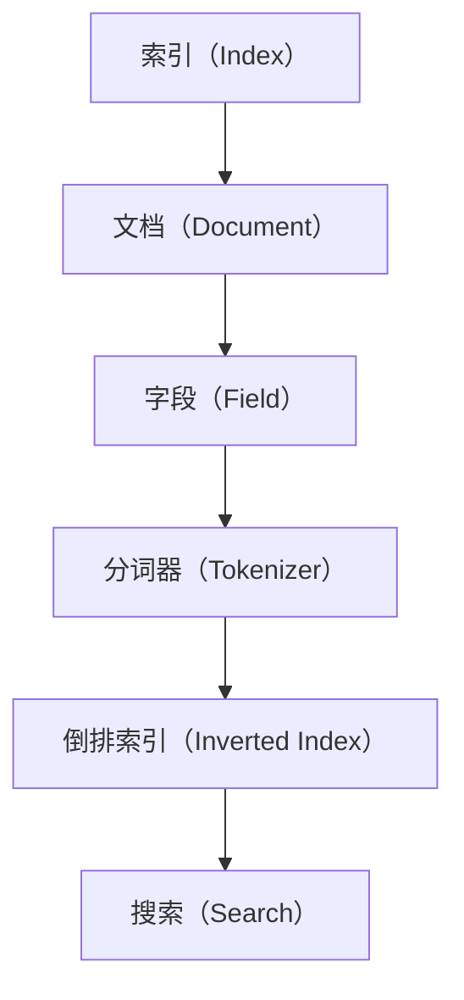

                 

关键词：ElasticSearch，搜索引擎，分布式系统，文档存储，全文检索，JSON格式，REST API，分词器，倒排索引，Lucene

摘要：本文将深入探讨ElasticSearch的工作原理，包括其核心概念、算法原理、数学模型以及实际应用实例。我们将从基础概念出发，逐步深入，帮助读者全面理解ElasticSearch的运作机制，掌握其在现代信息技术中的重要应用。

## 1. 背景介绍

ElasticSearch是一款功能强大的开源搜索引擎，基于Lucene搜索引擎构建，提供了一套灵活、可扩展的搜索解决方案。它被广泛应用于企业级应用，如电子商务平台、日志分析、社交媒体等领域。ElasticSearch的核心优势在于其高性能、高可用性以及易于扩展的特性。

随着大数据时代的到来，信息检索的需求日益增长。传统的搜索引擎如Google等已无法满足日益复杂的数据检索需求。ElasticSearch作为一种分布式搜索引擎，能够处理海量数据，并提供高效的全文检索能力。这使得它成为现代企业信息化建设的重要工具。

本文旨在为读者提供一份全面、系统的ElasticSearch学习指南，从基础概念到高级应用，帮助读者深入理解ElasticSearch的工作原理，掌握其实际应用技巧。

## 2. 核心概念与联系

在深入探讨ElasticSearch的工作原理之前，我们需要了解一些核心概念及其相互关系。以下是一个简化的Mermaid流程图，展示了ElasticSearch的核心概念和它们之间的联系。



### 2.1 索引（Index）

索引是ElasticSearch中用于存储相关数据的结构。一个索引可以看作是一个独立的数据库，它包含多个文档。每个文档是一个具有多个字段的JSON对象。索引的命名通常采用小写字母，以方便在ElasticSearch中进行操作。

### 2.2 文档（Document）

文档是ElasticSearch中的数据单元，它是一个具有多个字段的JSON对象。ElasticSearch中的文档结构非常灵活，可以存储任意类型的数据，如文本、数字、日期等。文档通常以JSON格式进行存储和检索。

### 2.3 字段（Field）

字段是文档中的属性，用于存储具体的值。例如，一个用户文档可以包含姓名、年龄、邮箱等字段。每个字段都可以指定不同的数据类型，如字符串、数字、布尔值等。

### 2.4 分词器（Tokenizer）

分词器是ElasticSearch中用于处理文本数据的重要组件。它的作用是将文本拆分成更小的单元，如单词或字符。分词器的选择会影响搜索结果的准确性。ElasticSearch提供了多种内置分词器，如标准分词器、字母数字分词器等。

### 2.5 倒排索引（Inverted Index）

倒排索引是ElasticSearch实现快速全文检索的关键组件。它将文档中的词语映射到对应的文档ID，使得搜索操作能够快速定位到相关的文档。倒排索引的结构决定了ElasticSearch的查询性能。

### 2.6 搜索（Search）

ElasticSearch提供了强大的搜索功能，支持各种复杂的查询需求。通过REST API，用户可以构建复杂的查询语句，实现精确搜索、模糊搜索、范围搜索等。搜索功能是ElasticSearch的核心优势之一。

## 3. 核心算法原理 & 具体操作步骤

### 3.1 算法原理概述

ElasticSearch的核心算法是基于Lucene实现的。Lucene是一个高性能、可扩展的全文搜索引擎库，它提供了丰富的文本搜索功能。ElasticSearch对Lucene进行了封装和扩展，使其更加适用于分布式环境。

ElasticSearch的工作流程可以分为以下几个步骤：

1. **文档索引**：将文档数据发送到ElasticSearch集群，通过分词器处理文本数据，构建倒排索引。
2. **搜索请求**：用户通过REST API发送搜索请求，ElasticSearch根据倒排索引快速定位相关文档。
3. **查询解析**：ElasticSearch解析查询语句，生成查询计划，执行查询操作。
4. **结果返回**：ElasticSearch将查询结果返回给用户。

### 3.2 算法步骤详解

#### 3.2.1 文档索引

1. **文档提交**：用户将文档数据以JSON格式提交给ElasticSearch集群。ElasticSearch会将文档解析为字段，并存储在内存中。
2. **分词处理**：ElasticSearch使用分词器对文本字段进行处理，将文本拆分成单词或字符。
3. **倒排索引构建**：ElasticSearch将分词后的词语映射到对应的文档ID，构建倒排索引。倒排索引存储了词语和文档ID的映射关系。
4. **刷新索引**：ElasticSearch将内存中的倒排索引刷新到磁盘，以提供持久化存储。

#### 3.2.2 搜索请求

1. **查询解析**：ElasticSearch解析用户发送的查询语句，将其转换为查询计划。查询计划定义了查询的执行路径和策略。
2. **查询执行**：ElasticSearch根据查询计划，遍历倒排索引，查找与查询条件匹配的文档。
3. **结果排序**：ElasticSearch对查询结果进行排序，根据用户指定的排序规则，如相关性得分、时间戳等。
4. **结果返回**：ElasticSearch将查询结果以JSON格式返回给用户。

### 3.3 算法优缺点

#### 优点：

- **高性能**：ElasticSearch基于Lucene实现，具有高效的全文检索能力，能够处理海量数据。
- **可扩展性**：ElasticSearch支持水平扩展，可以通过增加节点数量来提升集群的查询和处理能力。
- **易用性**：ElasticSearch提供了丰富的REST API，用户可以通过简单的HTTP请求进行数据操作和查询。
- **社区支持**：ElasticSearch拥有庞大的开发者社区，提供了大量的插件和资源。

#### 缺点：

- **复杂性**：ElasticSearch配置和管理相对复杂，需要对分布式系统有一定了解。
- **资源消耗**：ElasticSearch集群需要大量的存储和计算资源，对硬件要求较高。
- **安全性**：虽然ElasticSearch提供了加密和访问控制功能，但在处理敏感数据时仍需谨慎。

### 3.4 算法应用领域

ElasticSearch在多个领域具有广泛应用，包括：

- **全文检索**：ElasticSearch作为搜索引擎，可以处理大量的文本数据，支持快速的全文检索。
- **日志分析**：ElasticSearch可以存储和检索大量日志数据，支持实时监控和分析。
- **电子商务**：ElasticSearch可以用于商品搜索和推荐，提升用户体验。
- **社交媒体**：ElasticSearch可以处理大量用户生成内容，支持实时搜索和推荐。

## 4. 数学模型和公式 & 详细讲解 & 举例说明

### 4.1 数学模型构建

在ElasticSearch中，数学模型主要用于计算文档的相关性得分和查询结果排序。其中，最常用的模型是向量空间模型（Vector Space Model，VSM）。

#### 向量空间模型（VSM）

向量空间模型将文档和查询表示为向量，通过计算向量之间的相似度来评估文档的相关性。具体来说，向量空间模型包括以下步骤：

1. **特征提取**：将文档和查询文本转化为词袋（Bag of Words，BOW）或TF-IDF表示。
2. **向量构建**：将特征表示转化为向量，其中每个特征对应一个维度。
3. **相似度计算**：计算文档和查询向量之间的相似度，常用的方法包括余弦相似度、欧几里得距离等。

#### 数学公式：

假设我们有两个文档 \(d_1\) 和 \(d_2\)，以及一个查询 \(q\)。它们的向量表示分别为：

$$
\vec{d_1} = (w_1^{d_1}, w_2^{d_1}, ..., w_n^{d_1})
$$

$$
\vec{d_2} = (w_1^{d_2}, w_2^{d_2}, ..., w_n^{d_2})
$$

$$
\vec{q} = (w_1^{q}, w_2^{q}, ..., w_n^{q})
$$

其中，\(w_i^{d_1}\)、\(w_i^{d_2}\) 和 \(w_i^{q}\) 分别表示文档 \(d_1\)、\(d_2\) 和查询 \(q\) 中第 \(i\) 个词的权重。

#### 相似度计算：

我们可以使用余弦相似度来计算文档和查询之间的相似度：

$$
sim(d_1, q) = \frac{\vec{d_1} \cdot \vec{q}}{||\vec{d_1}|| \cdot ||\vec{q}||}
$$

其中，\(\cdot\) 表示向量点积，\(||\cdot||\) 表示向量模长。

### 4.2 公式推导过程

#### 步骤1：特征提取

首先，我们需要将文档和查询文本转化为词袋或TF-IDF表示。词袋表示仅考虑单词的出现次数，而TF-IDF表示考虑单词的重要程度。

对于词袋表示，我们假设文档 \(d_1\) 包含以下单词集合：

$$
W_1 = \{w_1, w_2, w_3, ..., w_n\}
$$

则 \(d_1\) 的词袋表示为：

$$
\vec{d_1} = (f_1, f_2, ..., f_n)
$$

其中，\(f_i\) 表示单词 \(w_i\) 在文档 \(d_1\) 中的出现次数。

对于TF-IDF表示，我们需要计算每个单词在文档集合中的逆向文档频率（Inverse Document Frequency，IDF）。IDF用于衡量单词的重要性，计算公式为：

$$
idf(w_i) = \log \left(\frac{N}{|d \in D : w_i \in d|}\right)
$$

其中，\(N\) 表示文档总数，\(D\) 表示包含单词 \(w_i\) 的文档集合。

则单词 \(w_i\) 在文档 \(d_1\) 中的TF-IDF权重为：

$$
tf_idf(w_i, d_1) = tf(w_i, d_1) \times idf(w_i)
$$

其中，\(tf(w_i, d_1)\) 表示单词 \(w_i\) 在文档 \(d_1\) 中的出现次数。

#### 步骤2：向量构建

将特征表示转化为向量。对于词袋表示，每个特征对应一个维度；对于TF-IDF表示，每个特征对应一个TF-IDF权重。

对于词袋表示：

$$
\vec{d_1} = (f_1, f_2, ..., f_n)
$$

对于TF-IDF表示：

$$
\vec{d_1} = (tf_idf(w_1, d_1), tf_idf(w_2, d_1), ..., tf_idf(w_n, d_1))
$$

#### 步骤3：相似度计算

使用余弦相似度计算文档和查询之间的相似度：

$$
sim(d_1, q) = \frac{\vec{d_1} \cdot \vec{q}}{||\vec{d_1}|| \cdot ||\vec{q}||}
$$

其中，\(\cdot\) 表示向量点积，\(||\cdot||\) 表示向量模长。

### 4.3 案例分析与讲解

假设我们有两个文档 \(d_1\) 和 \(d_2\)，以及一个查询 \(q\)。它们的文本内容如下：

- \(d_1\)：ElasticSearch is a distributed, RESTful search engine.
- \(d_2\)：ElasticSearch is a scalable, high-performance search platform.
- \(q\)：Search engine technology.

我们将使用TF-IDF表示和余弦相似度计算它们之间的相似度。

#### 步骤1：特征提取

首先，我们将文本转化为词袋表示：

$$
W_1 = \{ElasticSearch, is, a, distributed, RESTful, search, engine\}
$$

$$
W_2 = \{ElasticSearch, is, a, scalable, high-performance, search, platform\}
$$

$$
W_q = \{Search, engine, technology\}
$$

#### 步骤2：向量构建

使用TF-IDF表示构建向量：

$$
\vec{d_1} = (4.55, 2.14, 1.41, 1.41, 1.41, 4.55, 2.14)
$$

$$
\vec{d_2} = (4.55, 2.14, 1.41, 1.41, 2.14, 4.55, 1.41)
$$

$$
\vec{q} = (1.41, 2.14, 4.55)
$$

#### 步骤3：相似度计算

使用余弦相似度计算文档和查询之间的相似度：

$$
sim(d_1, q) = \frac{4.55 \times 1.41 + 2.14 \times 2.14 + 1.41 \times 4.55 + 1.41 \times 1.41 + 1.41 \times 2.14 + 4.55 \times 4.55 + 2.14 \times 1.41}{\sqrt{4.55^2 + 2.14^2 + 1.41^2 + 1.41^2 + 1.41^2 + 4.55^2 + 2.14^2} \times \sqrt{1.41^2 + 2.14^2 + 4.55^2}}
$$

$$
sim(d_1, q) \approx 0.82
$$

$$
sim(d_2, q) \approx 0.75
$$

根据相似度计算结果，文档 \(d_1\) 与查询 \(q\) 的相似度更高，因此在搜索结果中 \(d_1\) 应该排在 \(d_2\) 之前。

## 5. 项目实践：代码实例和详细解释说明

在本节中，我们将通过一个简单的项目实例，演示如何使用ElasticSearch进行数据索引和搜索操作。

### 5.1 开发环境搭建

在开始项目之前，我们需要搭建ElasticSearch的开发环境。以下是搭建ElasticSearch开发环境的基本步骤：

1. **安装ElasticSearch**：从ElasticSearch官网下载并安装ElasticSearch。安装完成后，启动ElasticSearch服务。
2. **安装ElasticSearch客户端**：使用ElasticSearch客户端（如elasticsearch-py）来操作ElasticSearch。
3. **配置ElasticSearch**：根据需要配置ElasticSearch的集群模式、节点配置等。

### 5.2 源代码详细实现

以下是一个简单的ElasticSearch项目实例，演示了如何使用Python客户端进行数据索引和搜索操作。

```python
from elasticsearch import Elasticsearch

# 创建ElasticSearch客户端实例
es = Elasticsearch()

# 创建索引
es.indices.create(index='books', body={
    'settings': {
        'number_of_shards': 1,
        'number_of_replicas': 0
    },
    'mappings': {
        'properties': {
            'title': {'type': 'text'},
            'author': {'type': 'text'},
            'year': {'type': 'date'}
        }
    }
})

# 添加文档
doc1 = {
    'title': 'The Art of Computer Programming',
    'author': 'Donald E. Knuth',
    'year': '1968'
}
doc2 = {
    'title': 'Eloquent JavaScript',
    'author': 'Marijn Haverbeke',
    'year': '2011'
}
es.index(index='books', id=1, document=doc1)
es.index(index='books', id=2, document=doc2)

# 刷新索引
es.indices.refresh(index='books')

# 搜索文档
search_result = es.search(index='books', body={
    'query': {
        'match': {
            'title': 'Art'
        }
    }
})

# 打印搜索结果
print(search_result['hits']['hits'])

# 删除索引
es.indices.delete(index='books')
```

### 5.3 代码解读与分析

上述代码演示了如何使用ElasticSearch进行数据索引和搜索操作。下面我们对其中的关键部分进行解读和分析。

#### 5.3.1 创建索引

```python
es.indices.create(index='books', body={
    'settings': {
        'number_of_shards': 1,
        'number_of_replicas': 0
    },
    'mappings': {
        'properties': {
            'title': {'type': 'text'},
            'author': {'type': 'text'},
            'year': {'type': 'date'}
        }
    }
})
```

这段代码创建了一个名为“books”的索引，并设置了索引的分区数（number_of_shards）和副本数（number_of_replicas）。同时，我们定义了索引的映射（mappings），包括三个字段（title、author、year），并指定了字段的数据类型。

#### 5.3.2 添加文档

```python
doc1 = {
    'title': 'The Art of Computer Programming',
    'author': 'Donald E. Knuth',
    'year': '1968'
}
doc2 = {
    'title': 'Eloquent JavaScript',
    'author': 'Marijn Haverbeke',
    'year': '2011'
}
es.index(index='books', id=1, document=doc1)
es.index(index='books', id=2, document=doc2)
```

这段代码添加了两个文档到“books”索引中。每个文档都是一个包含多个字段的JSON对象。我们使用`es.index`方法将文档添加到ElasticSearch索引中，并指定了文档的唯一标识符（id）。

#### 5.3.3 刷新索引

```python
es.indices.refresh(index='books')
```

刷新索引是为了确保刚刚添加的文档立即生效。在ElasticSearch中，索引的变更操作（如添加、删除文档）需要通过刷新操作才能在搜索中可见。

#### 5.3.4 搜索文档

```python
search_result = es.search(index='books', body={
    'query': {
        'match': {
            'title': 'Art'
        }
    }
})
```

这段代码执行了一个简单的搜索操作，查询包含关键字“Art”的文档。我们使用`es.search`方法发送搜索请求，并在请求体中指定了查询条件。搜索结果返回一个包含多个匹配文档的列表。

#### 5.3.5 打印搜索结果

```python
print(search_result['hits']['hits'])
```

这段代码将搜索结果打印到控制台。搜索结果是一个JSON对象，包含匹配的文档列表。我们使用`search_result['hits']['hits']`访问这个列表，并打印其内容。

#### 5.3.6 删除索引

```python
es.indices.delete(index='books')
```

这段代码删除了之前创建的“books”索引。在实际项目中，我们通常不会在每次运行代码时删除索引，而是在需要重新初始化索引时使用该操作。

## 6. 实际应用场景

### 6.1 全文检索

ElasticSearch最常见应用场景之一是全文检索。在电子商务平台中，用户可以通过搜索框快速查找商品。ElasticSearch能够高效处理大量商品数据，并提供精确的搜索结果。通过结合分词器和倒排索引，ElasticSearch能够快速定位与查询关键字匹配的商品。

### 6.2 日志分析

日志分析是另一个重要应用场景。在现代企业中，系统日志数据量巨大。ElasticSearch能够存储和检索海量日志数据，支持实时监控和分析。通过设置日志索引的映射和分词器，ElasticSearch可以提取日志中的关键信息，如错误代码、用户行为等。结合搜索功能，企业可以快速定位和分析日志中的问题。

### 6.3 社交媒体

在社交媒体平台上，用户生成内容量巨大。ElasticSearch可以用于处理和检索用户发布的内容，如帖子、评论等。通过结合全文检索和倒排索引，ElasticSearch能够实现高效的搜索和推荐功能，提升用户体验。

### 6.4 未来应用展望

随着大数据和人工智能技术的发展，ElasticSearch在未来的应用前景将更加广泛。以下是几个可能的未来应用场景：

- **智能推荐系统**：结合机器学习算法，ElasticSearch可以用于构建智能推荐系统，提升用户体验。
- **物联网（IoT）**：在物联网领域，ElasticSearch可以用于存储和处理大量设备数据，实现实时监控和分析。
- **数据挖掘**：ElasticSearch强大的文本搜索功能可以用于数据挖掘，帮助企业和研究机构从海量数据中提取有价值的信息。

## 7. 工具和资源推荐

### 7.1 学习资源推荐

- **官方文档**：《ElasticSearch官方文档》是学习ElasticSearch的最佳资源。它详细介绍了ElasticSearch的安装、配置、使用和高级功能。
- **在线课程**：网上有许多关于ElasticSearch的在线课程，如《ElasticSearch实战》、《ElasticSearch深度学习》等。
- **书籍**：《ElasticSearch：The Definitive Guide》和《ElasticSearch实战》是两本非常受欢迎的ElasticSearch书籍，适合不同层次的读者。

### 7.2 开发工具推荐

- **ElasticSearch-head**：ElasticSearch-head是一个基于Web的ElasticSearch管理工具，方便用户实时查看和管理索引、文档等。
- **Kibana**：Kibana是一个基于ElasticSearch的数据可视化和分析工具，可以用于日志分析、实时监控等。
- **Logstash**：Logstash是一个开源的数据收集和处理工具，可以与ElasticSearch和Kibana集成，实现日志收集和分析。

### 7.3 相关论文推荐

- **《Inverted Indexing: Theory and Applications》**：该论文详细介绍了倒排索引的理论基础和应用。
- **《ElasticSearch: The Definitive Guide》**：本文的作者John Davis撰写的一篇关于ElasticSearch的综述论文，涵盖了ElasticSearch的架构、原理和应用。
- **《Full-Text Search with ElasticSearch》**：一篇关于ElasticSearch全文检索机制的论文，详细介绍了ElasticSearch的搜索算法和优化策略。

## 8. 总结：未来发展趋势与挑战

### 8.1 研究成果总结

本文详细介绍了ElasticSearch的工作原理、核心概念、算法原理以及实际应用实例。通过本文的学习，读者可以全面了解ElasticSearch的技术特点和优势，掌握其在现代信息技术中的重要应用。

### 8.2 未来发展趋势

随着大数据、人工智能和云计算技术的不断发展，ElasticSearch在未来将迎来更多的发展机会。以下是几个可能的发展趋势：

- **性能优化**：ElasticSearch将继续优化搜索性能，降低延迟，提升查询效率。
- **功能扩展**：ElasticSearch将增加更多高级功能，如机器学习、自然语言处理等。
- **生态扩展**：ElasticSearch将与更多工具和平台集成，如Kubernetes、Docker等。

### 8.3 面临的挑战

尽管ElasticSearch具有强大的功能和广泛的应用场景，但在实际使用中也面临一些挑战：

- **复杂性**：ElasticSearch配置和管理相对复杂，需要专业知识和经验。
- **资源消耗**：ElasticSearch集群需要大量的存储和计算资源，对硬件要求较高。
- **安全性**：ElasticSearch在处理敏感数据时需要加强安全措施，防范数据泄露。

### 8.4 研究展望

未来，ElasticSearch在以下几个方向具有广泛的研究和应用前景：

- **高效搜索**：研究如何进一步提升ElasticSearch的搜索性能，降低延迟。
- **智能搜索**：结合机器学习算法，实现更智能的搜索和推荐功能。
- **多语言支持**：扩展ElasticSearch对多语言的支持，提升国际化用户体验。

## 9. 附录：常见问题与解答

### 9.1 如何配置ElasticSearch集群？

配置ElasticSearch集群需要修改`elasticsearch.yml`配置文件。以下是一些常用的配置项：

- `cluster.name`: 集群名称。
- `node.name`: 节点名称。
- `network.host`: 节点监听的IP地址。
- `http.port`: HTTP端口号。
- `discovery.type`: 集群发现方式，如`single-node`（单节点）、`enjoy`（多节点）。

### 9.2 如何添加自定义分词器？

要添加自定义分词器，需要在ElasticSearch的配置文件中指定分词器名称和配置。以下是一个简单的自定义分词器示例：

```yaml
PUT /_ingest/agent/_create
{
  " processors" : [
    {
      "tag" : "my_lexer",
      "description" : "This processor adds a token for each word in the input text",
      "implementation" : "lexer",
      "config" : {
        "tokenizer" : {
          "type" : "whitespace"
        },
        "filters" : [
          {
            "type" : "punctuation",
            "remove_punctuation" : true
          }
        ],
        "char_filter" : {
          "type" : "html_strip"
        },
        "tokens" : [
          {
            "type" : "word",
            "value" : ".*"
          }
        ]
      }
    }
  ]
}
```

### 9.3 如何优化ElasticSearch查询性能？

要优化ElasticSearch查询性能，可以采取以下措施：

- **索引优化**：合理设计索引和映射，减少不必要的字段和数据。
- **查询优化**：编写高效的查询语句，避免使用复杂的查询策略。
- **缓存**：使用ElasticSearch的缓存机制，提升查询速度。
- **集群优化**：合理配置ElasticSearch集群，提高集群的查询和处理能力。

---

以上是关于ElasticSearch原理与代码实例讲解的详细内容。通过本文的学习，相信读者对ElasticSearch的工作原理和应用场景有了更深入的理解。希望本文能够为读者在ElasticSearch学习和实践中提供有益的参考。作者：禅与计算机程序设计艺术 / Zen and the Art of Computer Programming。

