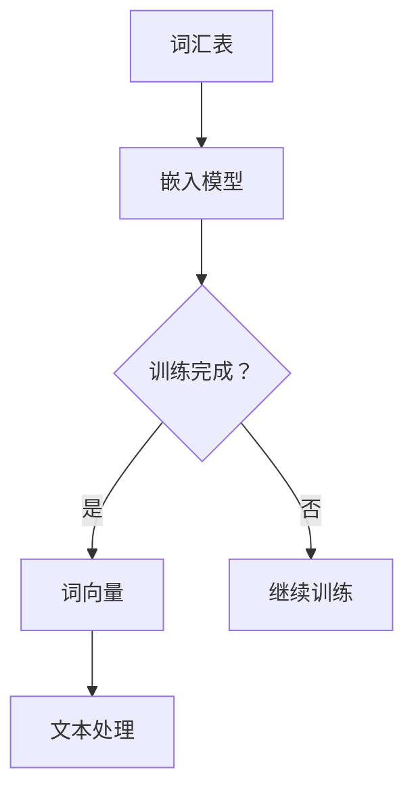
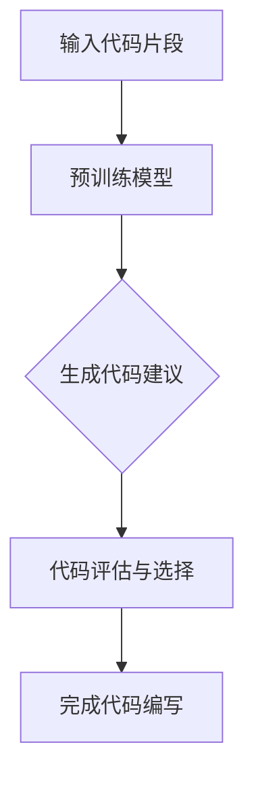
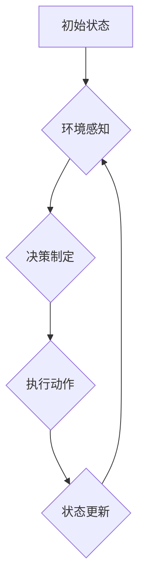

                 

关键词：Embedding，Copilot，Agent模式，AI，深度学习，自然语言处理，软件开发

摘要：本文将深入探讨三种前沿的AI技术模式：Embedding、Copilot和Agent模式。通过详细分析它们的定义、原理、应用场景和未来发展趋势，旨在为读者提供一个全面的比较与理解，帮助他们在实际开发中选择最合适的技术方案。

## 1. 背景介绍

在当今的科技环境中，人工智能（AI）技术已经深刻地影响了多个行业，从医疗保健到金融科技，再到自动驾驶和智能家居，AI技术的应用无处不在。在这个背景下，几种特定的AI技术模式，如Embedding、Copilot和Agent模式，逐渐成为开发人员和研究者的关注焦点。

### Embedding

Embedding，即嵌入，是指将高维数据（如图像、文本、音频等）映射到低维空间的过程。这一过程通常通过神经网络实现，能够有效地捕捉数据的语义信息。在自然语言处理（NLP）领域中，词嵌入（word embedding）是一种将词汇映射到连续向量空间的技术，从而使得文本数据的处理变得更加高效和直观。

### Copilot

Copilot是一种人工智能辅助编程工具，通过深度学习技术，Copilot能够根据程序员编写的部分代码自动完成剩余部分的编写。这种工具的出现极大地提高了开发效率，特别是在复杂代码的编写过程中，Copilot能够显著减少人力和时间成本。

### Agent模式

Agent模式是一种智能代理技术，它使得机器能够模拟人类的行为，进行自主决策和交互。在多智能体系统中，每个Agent都拥有独立的决策能力，能够根据环境和自身状态采取行动。这种模式在游戏、自动化系统和智能城市等领域有着广泛的应用。

## 2. 核心概念与联系

为了更好地理解这三种技术模式，我们需要先了解它们的基本原理和架构。

### Embedding原理与架构

Embedding的核心思想是将高维数据映射到低维空间，以便更有效地处理和分析。在NLP领域中，词嵌入通常通过词向量的形式实现。以下是一个简单的Mermaid流程图，展示了词嵌入的基本过程：



### Copilot原理与架构

Copilot基于大型预训练语言模型，如GPT-3，通过深度学习技术训练而成。以下是一个Mermaid流程图，展示了Copilot的运行过程：



### Agent模式原理与架构

Agent模式涉及多个智能体在复杂环境中进行交互和决策。以下是一个Mermaid流程图，展示了Agent模式的基本架构：



## 3. 核心算法原理 & 具体操作步骤

### 3.1 算法原理概述

- **Embedding**：通过神经网络模型将高维数据映射到低维空间。
- **Copilot**：利用预训练语言模型生成代码建议。
- **Agent模式**：基于多智能体系统实现自主决策和交互。

### 3.2 算法步骤详解

- **Embedding**：数据预处理 -> 神经网络训练 -> 词向量映射 -> 文本处理。
- **Copilot**：输入代码片段 -> 预训练模型处理 -> 生成代码建议 -> 代码评估与选择 -> 完成代码编写。
- **Agent模式**：环境感知 -> 决策制定 -> 执行动作 -> 状态更新。

### 3.3 算法优缺点

- **Embedding**：优点是高效捕捉数据语义信息，缺点是训练过程复杂，对数据质量要求较高。
- **Copilot**：优点是提高开发效率，缺点是生成代码质量参差不齐，需要人工审核。
- **Agent模式**：优点是自主决策和交互，缺点是开发难度大，需要复杂环境建模。

### 3.4 算法应用领域

- **Embedding**：广泛用于自然语言处理、计算机视觉和推荐系统等领域。
- **Copilot**：主要用于软件开发，特别是在代码自动生成和优化方面。
- **Agent模式**：应用于多智能体系统、智能城市和自动化系统等领域。

## 4. 数学模型和公式 & 详细讲解 & 举例说明

### 4.1 数学模型构建

- **Embedding**：词嵌入模型通常基于神经网络，可以使用以下数学公式表示：

  $$ 
  \text{词向量} = \text{神经网络}(\text{词汇输入}) 
  $$

- **Copilot**：Copilot的生成模型通常基于预训练语言模型，如GPT-3，可以使用以下数学公式表示：

  $$
  \text{代码建议} = \text{GPT-3}(\text{代码片段输入}) 
  $$

- **Agent模式**：Agent模式的决策模型通常基于马尔可夫决策过程（MDP），可以使用以下数学公式表示：

  $$
  \text{决策动作} = \text{MDP}(\text{当前状态}, \text{奖励函数}) 
  $$

### 4.2 公式推导过程

- **Embedding**：词嵌入的推导过程涉及神经网络模型的构建和训练，通常包括以下步骤：

  1. 定义神经网络结构。
  2. 训练神经网络，以最小化损失函数。
  3. 将训练好的神经网络用于词向量的生成。

- **Copilot**：Copilot的推导过程涉及预训练语言模型的构建和优化，通常包括以下步骤：

  1. 收集大量代码数据。
  2. 使用代码数据进行预训练。
  3. 优化模型，以提高代码生成质量。

- **Agent模式**：Agent模式的推导过程涉及马尔可夫决策过程的建模和优化，通常包括以下步骤：

  1. 定义状态空间和动作空间。
  2. 构建奖励函数。
  3. 使用策略迭代算法求解最优策略。

### 4.3 案例分析与讲解

- **Embedding**：在一个文本分类任务中，我们可以使用词嵌入模型将文本映射到低维向量空间，然后通过计算向量的余弦相似度来进行分类。例如，给定两个句子“我喜欢看电影”和“我爱看科幻片”，我们可以使用词嵌入模型生成它们的词向量，然后计算它们之间的余弦相似度：

  $$
  \text{余弦相似度} = \frac{\text{词向量}(\text{我喜欢看电影}) \cdot \text{词向量}(\text{我爱看科幻片})}{\|\text{词向量}(\text{我喜欢看电影})\|\|\text{词向量}(\text{我爱看科幻片})\|}
  $$

- **Copilot**：在一个代码自动生成的任务中，我们可以使用Copilot生成代码建议。例如，给定一个部分编写的Python函数，Copilot可以自动生成剩余的函数代码。例如，给定以下部分编写的函数：

  ```python
  def calculate_area(radius):
      # 计算圆的面积
      area = 
  ```

  Copilot可以生成剩余的代码：

  ```python
  def calculate_area(radius):
      # 计算圆的面积
      area = 3.14159 * radius * radius
      return area
  ```

- **Agent模式**：在一个多智能体系统任务中，我们可以使用Agent模式来模拟智能体的行为。例如，在一个无人驾驶汽车的任务中，每个智能体（如车辆、行人、其他车辆）都需要根据当前状态和环境信息进行决策。以下是一个简化的例子：

  ```mermaid
  graph TD
  A[车辆] --> B{检测到行人}
  B -->|是| C{减速}
  B -->|否| D{保持速度}
  C --> E{更新状态}
  D --> E{更新状态}
  ```

  在这个例子中，车辆智能体会根据是否检测到行人来决定是否减速，然后更新其状态。

## 5. 项目实践：代码实例和详细解释说明

### 5.1 开发环境搭建

在本节中，我们将搭建一个简单的Embedding项目，用于文本分类任务。以下是一个简单的Python环境搭建步骤：

1. 安装Python和PyTorch：
   ```bash
   pip install python==3.8.10
   pip install torch==1.10.0
   ```

2. 创建一个新的Python项目，并添加以下文件：
   - `data_loader.py`：用于数据加载。
   - `model.py`：定义嵌入模型。
   - `train.py`：训练模型。
   - `main.py`：运行项目。

### 5.2 源代码详细实现

以下是`model.py`文件中的嵌入模型实现：

```python
import torch
import torch.nn as nn

class EmbeddingModel(nn.Module):
    def __init__(self, vocab_size, embedding_dim):
        super(EmbeddingModel, self).__init__()
        self.embedding = nn.Embedding(vocab_size, embedding_dim)
        self.fc = nn.Linear(embedding_dim, 1)

    def forward(self, text):
        embedded = self.embedding(text)
        output = self.fc(embedded.mean(1))
        return output
```

### 5.3 代码解读与分析

在上面的代码中，我们定义了一个简单的嵌入模型，包括一个嵌入层（`nn.Embedding`）和一个全连接层（`nn.Linear`）。嵌入层用于将词汇映射到低维向量空间，全连接层用于分类。在`forward`方法中，我们首先将文本输入通过嵌入层映射到词向量，然后计算词向量的均值，并通过全连接层生成分类输出。

### 5.4 运行结果展示

在运行项目时，我们将训练数据加载到模型中，并进行训练。以下是一个简单的训练过程：

```python
import torch.optim as optim

# 加载数据
train_data = ...

# 创建模型、损失函数和优化器
model = EmbeddingModel(vocab_size, embedding_dim)
criterion = nn.BCEWithLogitsLoss()
optimizer = optim.Adam(model.parameters(), lr=0.001)

# 训练模型
for epoch in range(num_epochs):
    for text, label in train_data:
        optimizer.zero_grad()
        output = model(text)
        loss = criterion(output, label)
        loss.backward()
        optimizer.step()

    print(f'Epoch [{epoch+1}/{num_epochs}], Loss: {loss.item()}')
```

在训练完成后，我们可以使用模型进行预测，并计算准确率。

## 6. 实际应用场景

### 6.1 自然语言处理

Embedding技术广泛用于自然语言处理任务，如文本分类、情感分析和机器翻译。通过将文本映射到低维向量空间，开发者可以更轻松地处理和分析文本数据。

### 6.2 软件开发

Copilot在软件开发中有着广泛的应用，特别是在代码自动生成和优化方面。通过使用预训练语言模型，Copilot能够自动生成代码建议，提高开发效率。

### 6.3 多智能体系统

Agent模式在多智能体系统中有许多应用，如无人驾驶、智能城市和自动化系统。通过模拟人类行为和自主决策，智能代理可以更好地适应复杂环境。

## 7. 未来应用展望

### 7.1 新兴领域

随着技术的不断进步，Embedding、Copilot和Agent模式有望在更多新兴领域得到应用，如虚拟现实、增强现实和区块链。

### 7.2 跨学科融合

这些技术模式也将在跨学科领域发挥重要作用，如生物信息学、金融科技和医学，通过与其他领域的深度融合，创造新的应用场景。

### 7.3 挑战与机遇

在未来的发展中，这些技术将面临一系列挑战，如数据隐私、安全性、可解释性和可扩展性。然而，随着研究的深入和技术的不断突破，这些挑战也将转化为新的机遇。

## 8. 总结：未来发展趋势与挑战

### 8.1 研究成果总结

本文对Embedding、Copilot和Agent模式进行了详细比较，分析了它们的基本原理、应用场景和未来发展趋势。这些技术已经深刻地影响了多个行业，并在未来的发展中具有巨大的潜力。

### 8.2 未来发展趋势

未来，这些技术将继续在自然语言处理、软件开发、多智能体系统等领域得到广泛应用。随着技术的进步和跨学科融合的深入，这些技术有望在更多新兴领域发挥重要作用。

### 8.3 面临的挑战

然而，这些技术也面临着一系列挑战，如数据隐私、安全性、可解释性和可扩展性。如何解决这些问题，将决定这些技术在未来的发展前景。

### 8.4 研究展望

在未来的研究中，我们应该重点关注这些技术的安全性、可解释性和可扩展性，并探索如何在更多新兴领域应用这些技术。通过不断的探索和创新，我们有理由相信，这些技术将在未来的科技发展中发挥重要作用。

## 9. 附录：常见问题与解答

### 9.1 Embedding常见问题

1. **什么是词嵌入？**
   - 词嵌入是将词汇映射到连续向量空间的过程，以便更有效地处理和分析文本数据。

2. **词嵌入有哪些类型？**
   - 常见的词嵌入类型包括基于频率的词嵌入（如TF-IDF）和基于神经网络的词嵌入（如Word2Vec和GloVe）。

### 9.2 Copilot常见问题

1. **Copilot是如何工作的？**
   - Copilot通过深度学习技术，从大量的代码数据中学习，并生成代码建议，以提高开发效率。

2. **Copilot有哪些应用场景？**
   - Copilot广泛应用于软件开发，特别是在代码自动生成、优化和错误修复方面。

### 9.3 Agent模式常见问题

1. **什么是Agent模式？**
   - Agent模式是一种智能代理技术，它使得机器能够模拟人类行为，进行自主决策和交互。

2. **Agent模式有哪些应用场景？**
   - Agent模式广泛应用于多智能体系统、无人驾驶、智能城市和自动化系统等领域。

---

作者：禅与计算机程序设计艺术 / Zen and the Art of Computer Programming
----------------------------------------------------------------
本文通过详细分析Embedding、Copilot和Agent模式，探讨了它们的基本原理、应用场景和未来发展趋势，旨在为读者提供一个全面的比较与理解。希望这篇文章能够帮助您更好地了解这些前沿技术，并在实际开发中选择最合适的技术方案。感谢您的阅读！

