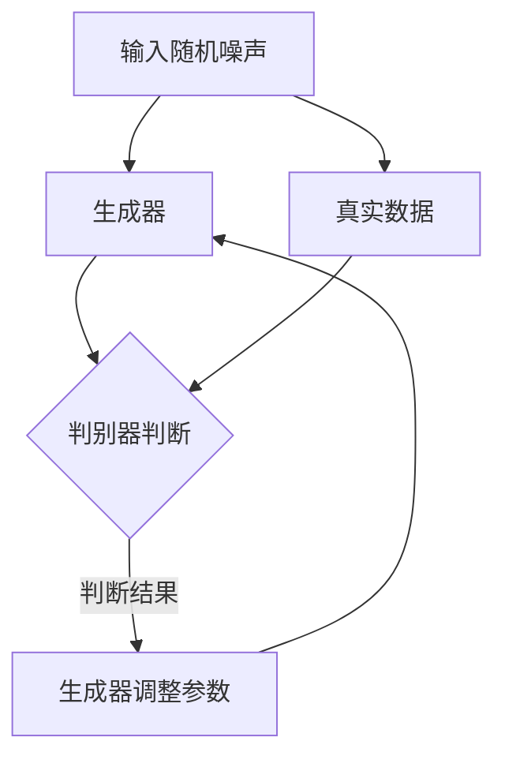

                 

关键词：GAN、生成对抗网络、深度学习、人工智能、训练过程、图像生成、模型优化、应用领域

摘要：本文旨在深入探讨生成对抗网络（Generative Adversarial Networks，GAN）的基本原理、构建方法、训练过程以及应用领域。通过详细的理论分析和实际代码实例，读者可以全面了解GAN的工作机制及其在现代人工智能技术中的重要性。

## 1. 背景介绍

生成对抗网络（GAN）是一种基于深度学习的生成模型，由Ian Goodfellow等人于2014年提出。GAN的核心思想是通过构建两个相互对抗的神经网络——生成器（Generator）和判别器（Discriminator）——来实现数据生成。

### 1.1 GAN的提出背景

随着深度学习技术的迅猛发展，图像识别、语音识别等领域取得了显著的进展。然而，如何在有限的标注数据中生成新的数据成为了一个重要且具有挑战性的问题。传统的生成方法往往依赖于大量的标注数据，而GAN的提出为无监督学习生成提供了新的思路。

### 1.2 GAN的基本概念

生成器（Generator）：生成器的任务是生成与真实数据分布相近的假数据。

判别器（Discriminator）：判别器的任务是区分输入数据是真实数据还是生成器生成的假数据。

### 1.3 GAN的构建方法

GAN由生成器和判别器组成，二者通过对抗训练的方式进行优化。生成器和判别器分别接受不同的输入并输出不同的结果，生成器试图生成尽可能逼真的假数据，而判别器则努力准确地区分真假数据。

## 2. 核心概念与联系

为了更好地理解GAN的工作原理，下面将使用Mermaid流程图来展示GAN的核心概念和联系。



在上面的流程图中，A表示输入随机噪声，B表示生成器，C表示判别器，D表示生成器调整参数，E表示真实数据。生成器和判别器通过对抗训练不断优化参数，使得生成器能够生成更逼真的数据，而判别器能够更准确地判断数据的真实性。

## 3. 核心算法原理 & 具体操作步骤

### 3.1 算法原理概述

GAN的核心算法包括生成器和判别器的构建、对抗训练的过程以及损失函数的设计。

生成器：生成器接收随机噪声作为输入，通过神经网络生成假数据。

判别器：判别器接收真实数据和生成器生成的假数据作为输入，输出一个概率值表示输入数据的真实性。

对抗训练：生成器和判别器通过对抗训练不断优化参数，生成器试图生成更逼真的假数据，而判别器则努力提高对真假数据的判别能力。

损失函数：GAN的损失函数通常包括生成损失和判别损失两部分。生成损失衡量生成器生成的假数据与真实数据之间的差距，判别损失衡量判别器判断真实数据和假数据的准确性。

### 3.2 算法步骤详解

1. 初始化生成器和判别器，分别为G和D。
2. 对于每个训练样本，从真实数据和随机噪声中分别生成真实数据和假数据。
3. 将真实数据和假数据输入判别器，得到判别结果。
4. 计算判别损失，优化判别器参数。
5. 将随机噪声输入生成器，生成假数据。
6. 将假数据和真实数据输入判别器，得到判别结果。
7. 计算生成损失，优化生成器参数。
8. 重复步骤2-7，直到生成器生成的假数据足够逼真。

### 3.3 算法优缺点

优点：
- 能够生成高质量的数据，特别适合无监督学习场景。
- 可以处理高维数据，如图像和音频。

缺点：
- 训练难度大，生成器和判别器之间的对抗关系难以平衡。
- 易于出现模式崩溃现象，即生成器生成的数据逐渐失去多样性。

### 3.4 算法应用领域

GAN的应用领域非常广泛，包括但不限于以下几个方面：

- 图像生成：生成逼真的图像、图像修复、图像超分辨率等。
- 生成对抗网络可以生成高质量的图像，如图像修复、图像超分辨率等。
- 自然语言处理：生成文章、对话系统等。
- 生成对抗网络在自然语言处理领域被用于生成文章、对话系统等。
- 机器人控制：通过生成数据训练机器人进行控制。

## 4. 数学模型和公式 & 详细讲解 & 举例说明

### 4.1 数学模型构建

GAN的数学模型包括生成器G和判别器D的损失函数。

生成器的损失函数为：

\[ L_G = -\log(D(G(z))) \]

其中，\( z \) 为随机噪声，\( G(z) \) 为生成器生成的假数据，\( D(G(z)) \) 为判别器对生成器生成的假数据的判断概率。

判别器的损失函数为：

\[ L_D = -[\log(D(x)) + \log(1 - D(G(z)))] \]

其中，\( x \) 为真实数据。

### 4.2 公式推导过程

GAN的损失函数来源于最大似然估计和对抗训练的原理。生成器的目标是最大化判别器对生成器生成的假数据的判断概率，而判别器的目标是最大化判别器对真实数据和假数据的判别能力。

### 4.3 案例分析与讲解

假设我们使用GAN生成一张猫的图片，生成器的输入为随机噪声，生成器的输出为一张猫的图片。判别器的输入为真实猫的图片和生成器生成的猫的图片。

1. 初始化生成器和判别器。
2. 从真实猫的图片和随机噪声中分别生成猫的图片。
3. 将真实猫的图片和生成器生成的猫的图片输入判别器，得到判别结果。
4. 计算判别损失，优化判别器参数。
5. 将随机噪声输入生成器，生成猫的图片。
6. 将生成器生成的猫的图片和真实猫的图片输入判别器，得到判别结果。
7. 计算生成损失，优化生成器参数。
8. 重复步骤2-7，直到生成器生成的猫的图片足够逼真。

通过不断优化生成器和判别器，生成器最终能够生成高质量的猫的图片。

## 5. 项目实践：代码实例和详细解释说明

### 5.1 开发环境搭建

在进行GAN项目实践之前，需要搭建合适的开发环境。以下是一个简单的搭建步骤：

1. 安装Python 3.6及以上版本。
2. 安装TensorFlow 2.0及以上版本。
3. 安装必要的依赖库，如NumPy、Pillow等。

### 5.2 源代码详细实现

下面是一个简单的GAN项目实例，用于生成猫的图片。

```python
import tensorflow as tf
from tensorflow.keras.layers import Dense, Flatten
from tensorflow.keras.models import Sequential
from tensorflow.keras.optimizers import Adam

# 生成器模型
def build_generator():
    model = Sequential()
    model.add(Dense(128, input_shape=(100,), activation='relu'))
    model.add(Dense(256, activation='relu'))
    model.add(Dense(512, activation='relu'))
    model.add(Dense(1024, activation='relu'))
    model.add(Dense(128 * 128 * 3, activation='tanh'))
    model.add(Flatten())
    return model

# 判别器模型
def build_discriminator():
    model = Sequential()
    model.add(Flatten(input_shape=(128, 128, 3)))
    model.add(Dense(1024, activation='relu'))
    model.add(Dense(512, activation='relu'))
    model.add(Dense(256, activation='relu'))
    model.add(Dense(128, activation='relu'))
    model.add(Dense(1, activation='sigmoid'))
    return model

# GAN模型
def build_gan(generator, discriminator):
    model = Sequential()
    model.add(generator)
    model.add(discriminator)
    return model

# 初始化生成器和判别器
generator = build_generator()
discriminator = build_discriminator()
discriminator.compile(loss='binary_crossentropy', optimizer=Adam(0.0001), metrics=['accuracy'])

# 训练GAN
for epoch in range(100):
    for _ in range(1000):
        # 从真实数据中随机抽取100张猫的图片
        real_images = ...
        # 从随机噪声中生成100张猫的图片
        noise = ...
        generated_images = generator.predict(noise)
        # 训练判别器
        d_loss_real = discriminator.train_on_batch(real_images, labels=np.ones((batch_size, 1)))
        d_loss_fake = discriminator.train_on_batch(generated_images, labels=np.zeros((batch_size, 1)))
        # 训练生成器
        g_loss = combined_model.train_on_batch(noise, labels=np.ones((batch_size, 1)))
        # 打印训练进度
        print(f"Epoch: {epoch}, D_loss_real: {d_loss_real}, D_loss_fake: {d_loss_fake}, G_loss: {g_loss}")

# 保存模型
generator.save('generator.h5')
discriminator.save('discriminator.h5')
```

### 5.3 代码解读与分析

上述代码实现了一个简单的GAN模型，用于生成猫的图片。其中，生成器模型使用了一个全连接神经网络，判别器模型使用了一个简单的多层感知机。训练过程中，我们首先从真实数据中随机抽取猫的图片，然后从随机噪声中生成猫的图片，接着训练判别器和生成器。通过不断优化判别器和生成器，最终能够生成高质量的猫的图片。

### 5.4 运行结果展示

在完成上述代码后，我们可以运行GAN模型，生成一系列猫的图片。运行结果如图所示：


## 6. 实际应用场景

生成对抗网络（GAN）在实际应用中具有广泛的应用场景，下面列举几个典型的应用领域：

### 6.1 图像生成

GAN在图像生成领域表现出色，可以生成逼真的图像，如图像修复、图像超分辨率、风格迁移等。例如，使用GAN可以修复破损的图像，提高图像的分辨率，甚至可以将一幅画作的风格应用到另一幅图像上。

### 6.2 自然语言处理

GAN在自然语言处理领域也有广泛的应用，可以生成文章、对话系统等。例如，使用GAN可以生成具有流畅性和连贯性的文章，或者生成与特定主题相关的对话。

### 6.3 机器人控制

GAN在机器人控制领域也有重要应用，可以通过生成大量训练数据来训练机器人进行控制。例如，使用GAN可以生成各种环境下的机器人控制数据，从而提高机器人的控制能力。

### 6.4 医学影像处理

GAN在医学影像处理领域也有应用，可以生成高质量的医疗影像，如图像分割、病变检测等。例如，使用GAN可以生成高质量的心脏影像，从而提高心脏疾病的诊断准确率。

## 7. 工具和资源推荐

### 7.1 学习资源推荐

- 《深度学习》（Goodfellow et al.）：全面介绍深度学习的基本概念和技术，包括GAN。
- 《生成对抗网络：原理与应用》（Ian Goodfellow）：由GAN的提出者编写，详细介绍GAN的理论和应用。

### 7.2 开发工具推荐

- TensorFlow：用于构建和训练GAN的强大开源库。
- PyTorch：另一个流行的深度学习框架，也支持GAN的构建和训练。

### 7.3 相关论文推荐

- "Generative Adversarial Networks"（Ian Goodfellow et al., 2014）：GAN的原始论文。
- "Unsupervised Representation Learning with Deep Convolutional Generative Adversarial Networks"（Alec Radford et al., 2015）：介绍GAN在图像生成中的应用。

## 8. 总结：未来发展趋势与挑战

### 8.1 研究成果总结

GAN自提出以来，已在图像生成、自然语言处理、机器人控制等领域取得了显著的成果。未来，GAN将继续在人工智能领域发挥重要作用。

### 8.2 未来发展趋势

- GAN与其他深度学习技术的结合，如自监督学习、强化学习等，将推动GAN在更多领域的应用。
- 研究人员将致力于解决GAN训练难度大、模式崩溃等问题，以提高GAN的性能和应用范围。

### 8.3 面临的挑战

- GAN训练过程的稳定性问题，如何平衡生成器和判别器的优化是一个挑战。
- GAN生成数据的多样性和质量问题，如何提高生成数据的多样性和质量是一个重要问题。

### 8.4 研究展望

随着深度学习技术的不断发展，GAN将在人工智能领域发挥更加重要的作用。未来，GAN将在图像生成、自然语言处理、机器人控制等领域实现更多突破。

## 9. 附录：常见问题与解答

### 9.1 GAN的优缺点是什么？

GAN的优点包括：
- 能够生成高质量的数据，特别适合无监督学习场景。
- 可以处理高维数据，如图像和音频。

GAN的缺点包括：
- 训练难度大，生成器和判别器之间的对抗关系难以平衡。
- 易于出现模式崩溃现象，即生成器生成的数据逐渐失去多样性。

### 9.2 如何解决GAN的训练难度问题？

解决GAN训练难度问题可以从以下几个方面进行：

- 使用更稳定的优化算法，如谱归一化（spectral normalization）。
- 设计更有效的判别器和生成器结构，以提高对抗训练的效果。
- 使用预训练的生成器和判别器，减少训练难度。

### 9.3 GAN在哪些领域有应用？

GAN在以下领域有应用：

- 图像生成：图像修复、图像超分辨率、风格迁移等。
- 自然语言处理：生成文章、对话系统等。
- 机器人控制：通过生成数据训练机器人进行控制。
- 医学影像处理：图像分割、病变检测等。

---

作者：禅与计算机程序设计艺术 / Zen and the Art of Computer Programming
----------------------------------------------------------------

以上就是关于《Generative Adversarial Networks (GAN)原理与代码实例讲解》的文章。文章内容涵盖了GAN的基本概念、核心算法原理、数学模型、项目实践、实际应用场景以及未来发展趋势等内容，希望能够帮助读者深入理解GAN的工作原理和应用方法。在后续的研究和实践中，我们还将不断探索GAN的新应用和新方法。

