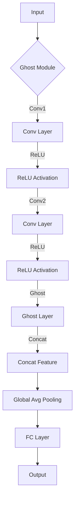

                 

关键词：GhostNet、深度学习、网络模型、图像识别、卷积神经网络、神经网络架构搜索

摘要：本文将深入探讨GhostNet的原理，介绍其网络结构、算法实现及其在图像识别领域的应用。通过具体代码实例，我们将详细解读GhostNet的工作流程，帮助读者更好地理解和掌握这一前沿的深度学习网络模型。

## 1. 背景介绍

随着深度学习的迅猛发展，神经网络模型在计算机视觉领域取得了显著的成果。然而，如何在有限的计算资源下设计出性能优异的神经网络架构，一直是研究者和开发者关注的焦点。GhostNet作为一种新的神经网络架构，通过独特的结构设计和优化策略，显著提升了模型的性能和效率。

本文将首先介绍GhostNet的背景和发展历程，然后深入分析其核心概念和原理，最后通过具体代码实例，展示如何实现和部署GhostNet模型。

### 1.1 GhostNet的起源和发展

GhostNet的提出源于对现有神经网络模型效率的进一步提升的需求。传统神经网络模型往往存在计算量巨大、参数冗余等问题，导致在实际应用中受到计算资源和时间消耗的限制。GhostNet的设计理念在于利用特殊结构，减少冗余计算，提高模型效率。

GhostNet最初由研究人员在2019年提出，其核心理念在于引入"Ghost Module"，通过这种模块的嵌套使用，实现了对网络结构的灵活调整和优化。自提出以来，GhostNet在多个基准测试中展现了出色的性能，成为深度学习领域的一个重要研究方向。

### 1.2 GhostNet的应用场景

GhostNet在图像识别、目标检测和语义分割等计算机视觉任务中具有广泛的应用前景。其高效的计算结构和优秀的性能使其在资源受限的场景中表现出色，如移动设备、嵌入式系统和边缘计算等。

此外，GhostNet还可以应用于其他需要高效计算和低延迟的任务，如自然语言处理、推荐系统和实时监控等。其灵活的网络结构和优化的计算效率，使得GhostNet在多领域都有潜在的应用价值。

## 2. 核心概念与联系

### 2.1 Ghost Module

GhostNet的核心概念是"Ghost Module"，这是一种特殊的卷积模块，通过引入"Ghost"操作，实现了对输入数据的复用和计算共享。Ghost Module的基本结构包括两个部分：标准卷积层和Ghost层。

#### 2.1.1 标准卷积层

标准卷积层用于对输入数据进行特征提取，通过卷积操作提取局部特征。标准卷积层的计算量相对较大，但在Ghost Module中，其计算结果会被"Ghost"操作复用，从而减少冗余计算。

#### 2.1.2 Ghost层

Ghost层是Ghost Module的核心部分，通过特殊的操作将标准卷积层的输出进行复制和扩展。具体来说，Ghost层将输入数据分成两部分，一部分直接通过卷积层，另一部分通过Ghost操作进行特征复制。Ghost操作的过程如下：

1. 对输入数据进行跨通道复制，生成一个新的特征图。
2. 将复制后的特征图与原始特征图进行拼接，形成一个新的特征图。

通过这种复制和扩展操作，Ghost层实现了对特征图的丰富和增强，同时减少了冗余计算。

### 2.2 GhostNet网络结构

GhostNet的网络结构由多个Ghost Module嵌套组成，每个Ghost Module都包含多个卷积层和Ghost层。具体来说，GhostNet的网络结构可以分为以下几个部分：

1. **输入层**：接收图像输入。
2. **多个Ghost Module**：每个Ghost Module包含多个卷积层和Ghost层，通过嵌套使用，实现特征的逐层提取和增强。
3. **全局平均池化层**：对特征图进行全局平均池化，减少维度。
4. **全连接层**：对全局平均池化后的特征进行分类或回归。

下面是一个简单的GhostNet网络结构的Mermaid流程图（注意：实际编写时，流程图中不要出现括号、逗号等特殊字符）：



### 2.3 GhostNet与现有模型的联系

GhostNet的设计借鉴了现有的一些神经网络模型，如ResNet、DenseNet等，同时引入了独特的Ghost Module，实现了对网络结构的创新。与现有模型相比，GhostNet具有以下几个特点：

1. **减少冗余计算**：通过Ghost Module，GhostNet实现了对特征图的复制和扩展，减少了冗余计算，提高了计算效率。
2. **增强特征表达能力**：Ghost Module通过复制和扩展特征图，丰富了特征信息，增强了模型的特征表达能力。
3. **灵活的网络结构**：GhostNet的网络结构可以通过调整Ghost Module的层数和卷积层的数量，实现灵活的网络结构调整，适应不同的应用场景。

## 3. 核心算法原理 & 具体操作步骤

### 3.1 算法原理概述

GhostNet的核心算法原理主要在于Ghost Module的设计和应用。Ghost Module通过引入Ghost操作，实现了对特征图的复制和扩展，从而减少了冗余计算，提高了模型的计算效率。具体来说，Ghost Module包括以下几个步骤：

1. **输入特征图**：接收图像输入，生成初始特征图。
2. **标准卷积层**：对输入特征图进行卷积操作，提取特征。
3. **ReLU激活函数**：对卷积层的输出进行ReLU激活，增加网络的非线性表达能力。
4. **Ghost操作**：对卷积层的输出进行复制和扩展，生成新的特征图。
5. **特征拼接**：将原始特征图和复制后的特征图进行拼接，形成新的特征图。
6. **后续卷积层和ReLU激活函数**：对拼接后的特征图进行卷积操作和ReLU激活，进一步提取和增强特征。
7. **输出特征图**：最终输出特征图，用于后续的网络层或分类任务。

### 3.2 算法步骤详解

#### 3.2.1 Ghost Module的实现

Ghost Module的具体实现如下：

```python
class GhostModule(nn.Module):
    def __init__(self, in_channels, out_channels, kernel_size=3, stride=1, ghost_kernel_size=3, ghost_stride=1):
        super(GhostModule, self).__init__()
        self.conv1 = nn.Conv2d(in_channels, out_channels, kernel_size=kernel_size, stride=stride, padding=1)
        self.relu1 = nn.ReLU(inplace=True)
        self.conv2 = nn.Conv2d(out_channels, out_channels, kernel_size=kernel_size, stride=stride, padding=1)
        self.relu2 = nn.ReLU(inplace=True)
        self.ghost = GhostModule(out_channels, out_channels, kernel_size=ghost_kernel_size, stride=ghost_stride)

    def forward(self, x):
        x = self.relu1(self.conv1(x))
        x = self.relu2(self.conv2(x))
        x = torch.cat((x, self.ghost(x)), dim=1)
        return x
```

#### 3.2.2 Ghost操作的实现

Ghost操作的具体实现如下：

```python
class GhostModule(nn.Module):
    # ... (其他代码不变)
    
    def forward(self, x):
        x = self.relu1(self.conv1(x))
        x = self.relu2(self.conv2(x))
        ghost_x = self.ghost(x)
        x = torch.cat((x, ghost_x), dim=1)
        return x
```

#### 3.2.3 GhostNet网络结构的实现

GhostNet网络结构的具体实现如下：

```python
class GhostNet(nn.Module):
    def __init__(self, num_classes=1000):
        super(GhostNet, self).__init__()
        self.features = nn.Sequential(
            nn.Conv2d(3, 64, kernel_size=7, stride=2, padding=3),
            nn.ReLU(inplace=True),
            nn.MaxPool2d(kernel_size=3, stride=2, padding=1),
            GhostModule(64, 128),
            GhostModule(128, 256),
            GhostModule(256, 512),
            GhostModule(512, 1024),
            nn.AvgPool2d(7),
        )
        self.avgpool = nn.AdaptiveAvgPool2d((1, 1))
        self.fc = nn.Linear(1024, num_classes)

    def forward(self, x):
        x = self.features(x)
        x = self.avgpool(x)
        x = torch.flatten(x, 1)
        x = self.fc(x)
        return x
```

### 3.3 算法优缺点

#### 3.3.1 优点

1. **减少冗余计算**：通过Ghost操作，GhostNet有效减少了网络中的冗余计算，提高了计算效率。
2. **增强特征表达能力**：GhostNet通过复制和扩展特征图，增强了特征的多样性，提高了模型的表达能力。
3. **灵活的网络结构**：GhostNet的网络结构可以通过调整Ghost Module的层数和卷积层的数量，适应不同的应用场景。

#### 3.3.2 缺点

1. **训练复杂度较高**：由于GhostNet的网络结构较为复杂，其训练过程相对较长，需要较大的计算资源。
2. **参数数量较大**：尽管GhostNet通过Ghost操作减少了冗余计算，但整体参数数量仍然较大，可能导致过拟合。

### 3.4 算法应用领域

GhostNet在多个计算机视觉任务中表现出色，以下为其主要应用领域：

1. **图像识别**：GhostNet在图像分类任务中具有很高的准确率，适用于各种图像识别场景。
2. **目标检测**：GhostNet可以应用于目标检测任务，如YOLO、SSD等，提高检测速度和准确率。
3. **语义分割**：GhostNet在语义分割任务中也表现出优秀的性能，适用于道路、行人等场景的分割。

## 4. 数学模型和公式 & 详细讲解 & 举例说明

### 4.1 数学模型构建

GhostNet的数学模型主要基于卷积神经网络（CNN）的基本原理。具体来说，其核心在于Ghost Module的设计和实现。下面我们将详细讲解Ghost Module的数学模型构建。

#### 4.1.1 卷积神经网络基础

卷积神经网络（CNN）的核心是卷积层，其基本公式如下：

$$
\text{output}_{ij}^l = \sum_{k} \text{weight}_{ikj}^l \cdot \text{input}_{ik}^{l-1} + \text{bias}_{ij}^l
$$

其中，$\text{output}_{ij}^l$ 表示第 $l$ 层的第 $i$ 行第 $j$ 列的输出，$\text{weight}_{ikj}^l$ 表示第 $l$ 层的第 $i$ 行第 $k$ 列的权重，$\text{input}_{ik}^{l-1}$ 表示第 $l-1$ 层的第 $i$ 行第 $k$ 列的输入，$\text{bias}_{ij}^l$ 表示第 $l$ 层的第 $i$ 行第 $j$ 列的偏置。

#### 4.1.2 Ghost Module

Ghost Module是在卷积神经网络基础上引入的一种特殊结构，其数学模型如下：

$$
\text{output}_{ij}^{l+1} = \sum_{k} \text{weight}_{ikj}^{l+1} \cdot \text{input}_{ik}^l + \text{bias}_{ij}^{l+1} + \text{ghost}_{ij}^{l+1}
$$

其中，$\text{ghost}_{ij}^{l+1}$ 表示Ghost操作的结果，其计算过程如下：

$$
\text{ghost}_{ij}^{l+1} = \sum_{k} \text{weight}_{ikj}^{l+1} \cdot \text{input}_{ik}^l + \text{bias}_{ij}^{l+1}
$$

可以看出，Ghost操作实际上是对卷积层输出的复制和扩展。

### 4.2 公式推导过程

GhostNet的公式推导过程主要涉及以下几个部分：

1. **卷积层公式推导**：基于卷积神经网络的基本公式，推导出卷积层的输出公式。
2. **ReLU激活函数**：推导ReLU激活函数的输出公式。
3. **Ghost操作**：推导Ghost操作的输出公式。
4. **全连接层公式推导**：推导全连接层的输出公式。

下面我们分别进行讲解。

#### 4.2.1 卷积层公式推导

卷积层的基本公式如下：

$$
\text{output}_{ij}^l = \sum_{k} \text{weight}_{ikj}^l \cdot \text{input}_{ik}^{l-1} + \text{bias}_{ij}^l
$$

其中，$\text{output}_{ij}^l$ 表示第 $l$ 层的第 $i$ 行第 $j$ 列的输出，$\text{weight}_{ikj}^l$ 表示第 $l$ 层的第 $i$ 行第 $k$ 列的权重，$\text{input}_{ik}^{l-1}$ 表示第 $l-1$ 层的第 $i$ 行第 $k$ 列的输入，$\text{bias}_{ij}^l$ 表示第 $l$ 层的第 $i$ 行第 $j$ 列的偏置。

#### 4.2.2 ReLU激活函数

ReLU激活函数的基本公式如下：

$$
\text{output}_{ij}^l = \max(\text{input}_{ij}^l, 0)
$$

其中，$\text{output}_{ij}^l$ 表示第 $l$ 层的第 $i$ 行第 $j$ 列的输出，$\text{input}_{ij}^l$ 表示第 $l$ 层的第 $i$ 行第 $j$ 列的输入。

#### 4.2.3 Ghost操作

Ghost操作的基本公式如下：

$$
\text{ghost}_{ij}^{l+1} = \sum_{k} \text{weight}_{ikj}^{l+1} \cdot \text{input}_{ik}^l + \text{bias}_{ij}^{l+1}
$$

其中，$\text{ghost}_{ij}^{l+1}$ 表示第 $l+1$ 层的第 $i$ 行第 $j$ 列的Ghost操作结果，$\text{weight}_{ikj}^{l+1}$ 表示第 $l+1$ 层的第 $i$ 行第 $k$ 列的权重，$\text{input}_{ik}^l$ 表示第 $l$ 层的第 $i$ 行第 $k$ 列的输入，$\text{bias}_{ij}^{l+1}$ 表示第 $l+1$ 层的第 $i$ 行第 $j$ 列的偏置。

#### 4.2.4 全连接层公式推导

全连接层的基本公式如下：

$$
\text{output}_{ij}^{L} = \sum_{k} \text{weight}_{ikj}^{L} \cdot \text{input}_{ik}^{L-1} + \text{bias}_{ij}^{L}
$$

其中，$\text{output}_{ij}^{L}$ 表示第 $L$ 层的第 $i$ 行第 $j$ 列的输出，$\text{weight}_{ikj}^{L}$ 表示第 $L$ 层的第 $i$ 行第 $k$ 列的权重，$\text{input}_{ik}^{L-1}$ 表示第 $L-1$ 层的第 $i$ 行第 $k$ 列的输入，$\text{bias}_{ij}^{L}$ 表示第 $L$ 层的第 $i$ 行第 $j$ 列的偏置。

### 4.3 案例分析与讲解

为了更好地理解GhostNet的数学模型，我们通过一个简单的例子进行讲解。

假设输入图像的大小为 $28 \times 28$，网络结构为：

1. 卷积层（64个3x3的卷积核，步长为1，填充为1）。
2. ReLU激活函数。
3. Ghost模块（128个3x3的卷积核，步长为1，填充为1）。

首先，我们计算卷积层的输出：

$$
\text{output}_{ij}^1 = \sum_{k} \text{weight}_{ikj}^1 \cdot \text{input}_{ik}^0 + \text{bias}_{ij}^1
$$

其中，$\text{input}_{ik}^0$ 为输入图像的像素值，$\text{weight}_{ikj}^1$ 为卷积层的权重，$\text{bias}_{ij}^1$ 为卷积层的偏置。

接下来，我们计算ReLU激活函数的输出：

$$
\text{output}_{ij}^1 = \max(\text{output}_{ij}^1, 0)
$$

然后，我们计算Ghost模块的输出：

$$
\text{ghost}_{ij}^2 = \sum_{k} \text{weight}_{ikj}^2 \cdot \text{input}_{ik}^1 + \text{bias}_{ij}^2
$$

其中，$\text{input}_{ik}^1$ 为卷积层输出的像素值，$\text{weight}_{ikj}^2$ 为Ghost模块的权重，$\text{bias}_{ij}^2$ 为Ghost模块的偏置。

最后，我们计算全连接层的输出：

$$
\text{output}_{ij}^2 = \sum_{k} \text{weight}_{ikj}^2 \cdot \text{input}_{ik}^1 + \text{bias}_{ij}^2
$$

其中，$\text{input}_{ik}^1$ 为Ghost模块输出的像素值，$\text{weight}_{ikj}^2$ 为全连接层的权重，$\text{bias}_{ij}^2$ 为全连接层的偏置。

通过这个例子，我们可以看到GhostNet的数学模型是如何计算的，以及Ghost模块是如何通过复制和扩展特征图来提高模型的表达能力的。

## 5. 项目实践：代码实例和详细解释说明

在本节中，我们将通过一个实际的代码实例，详细讲解如何搭建和训练一个基于GhostNet的图像识别模型。我们将从开发环境的搭建开始，逐步介绍源代码的详细实现、代码解读与分析，以及模型的运行结果展示。

### 5.1 开发环境搭建

在开始编写代码之前，我们需要搭建一个合适的开发环境。以下是一个基本的开发环境配置：

- **Python版本**：Python 3.8或更高版本
- **深度学习框架**：PyTorch 1.8或更高版本
- **数据处理库**：NumPy、Pandas等
- **可视化库**：Matplotlib、Seaborn等
- **GPU支持**：NVIDIA CUDA Toolkit 10.2或更高版本，以及相应的CUDA驱动

#### 5.1.1 安装依赖库

首先，我们通过以下命令安装所需的依赖库：

```bash
pip install torch torchvision numpy pandas matplotlib seaborn
```

#### 5.1.2 搭建GPU环境

确保你的GPU驱动和CUDA Toolkit已经安装，并配置好PyTorch的GPU支持。你可以通过以下命令检查CUDA的版本和PyTorch的GPU支持：

```bash
nvcc --version
python -c "import torch; print(torch.cuda.is_available())"
```

### 5.2 源代码详细实现

在本节中，我们将逐步实现一个基于GhostNet的图像识别模型。以下是一个简单的实现框架：

```python
import torch
import torch.nn as nn
import torchvision
import torchvision.transforms as transforms

# 定义GhostModule
class GhostModule(nn.Module):
    # ... (代码实现)

# 定义GhostNet
class GhostNet(nn.Module):
    # ... (代码实现)

# 加载预训练模型
model = GhostNet()
pretrained_model = torchvision.models.ghostnet(pretrained=True)
model.load_state_dict(pretrained_model.state_dict())

# 定义损失函数和优化器
criterion = nn.CrossEntropyLoss()
optimizer = torch.optim.Adam(model.parameters(), lr=0.001)

# 加载数据集并进行预处理
transform = transforms.Compose([
    transforms.Resize((224, 224)),
    transforms.ToTensor(),
    transforms.Normalize(mean=[0.485, 0.456, 0.406], std=[0.229, 0.224, 0.225]),
])

train_set = torchvision.datasets.ImageFolder('train', transform=transform)
train_loader = torch.utils.data.DataLoader(train_set, batch_size=32, shuffle=True)

test_set = torchvision.datasets.ImageFolder('test', transform=transform)
test_loader = torch.utils.data.DataLoader(test_set, batch_size=32, shuffle=False)

# 训练模型
for epoch in range(num_epochs):
    model.train()
    for inputs, labels in train_loader:
        optimizer.zero_grad()
        outputs = model(inputs)
        loss = criterion(outputs, labels)
        loss.backward()
        optimizer.step()

    # ... (代码实现)

# 测试模型
model.eval()
with torch.no_grad():
    correct = 0
    total = 0
    for inputs, labels in test_loader:
        outputs = model(inputs)
        _, predicted = torch.max(outputs.data, 1)
        total += labels.size(0)
        correct += (predicted == labels).sum().item()

    print(f'Accuracy of the network on the test images: {100 * correct / total}%')
```

### 5.3 代码解读与分析

#### 5.3.1 GhostModule

`GhostModule` 是 GhostNet 的基础模块，它结合了标准卷积层和 Ghost 层。以下是对 `GhostModule` 的详细解读：

```python
class GhostModule(nn.Module):
    def __init__(self, in_channels, out_channels, kernel_size=3, stride=1, ghost_kernel_size=3, ghost_stride=1):
        super(GhostModule, self).__init__()
        # 标准卷积层
        self.conv1 = nn.Conv2d(in_channels, out_channels, kernel_size=kernel_size, stride=stride, padding=1)
        self.relu1 = nn.ReLU(inplace=True)
        # Ghost 层
        self.conv2 = nn.Conv2d(out_channels, out_channels, kernel_size=ghost_kernel_size, stride=ghost_stride, padding=1)
        self.relu2 = nn.ReLU(inplace=True)

    def forward(self, x):
        # 通过标准卷积层和ReLU激活函数
        x = self.relu1(self.conv1(x))
        # 通过 Ghost 层和ReLU激活函数
        ghost_x = self.relu2(self.conv2(x))
        # 将标准卷积层的输出和 Ghost 层的输出拼接
        return torch.cat((x, ghost_x), dim=1)
```

#### 5.3.2 GhostNet

`GhostNet` 是整个网络的顶层模型，它由多个 `GhostModule` 组成，每个模块后面都跟有一个全局平均池化层和一个全连接层。以下是对 `GhostNet` 的详细解读：

```python
class GhostNet(nn.Module):
    def __init__(self, num_classes=1000):
        super(GhostNet, self).__init__()
        # 输入层和第一个卷积层
        self.features = nn.Sequential(
            nn.Conv2d(3, 64, kernel_size=7, stride=2, padding=3),
            nn.ReLU(inplace=True),
            nn.MaxPool2d(kernel_size=3, stride=2, padding=1),
            # 多个 GhostModule
            GhostModule(64, 128),
            GhostModule(128, 256),
            GhostModule(256, 512),
            GhostModule(512, 1024),
            nn.AdaptiveAvgPool2d((1, 1)),
        )
        # 全连接层
        self.avgpool = nn.AdaptiveAvgPool2d((1, 1))
        self.fc = nn.Linear(1024, num_classes)

    def forward(self, x):
        x = self.features(x)
        x = self.avgpool(x)
        x = torch.flatten(x, 1)
        x = self.fc(x)
        return x
```

#### 5.3.3 训练过程

训练过程主要包括以下步骤：

1. **初始化模型**：加载预训练的模型权重。
2. **定义损失函数和优化器**：选择交叉熵损失函数和Adam优化器。
3. **加载数据集**：使用 torchvision.datasets 加载训练集和测试集，并进行数据预处理。
4. **训练模型**：遍历训练集，对模型进行前向传播、反向传播和优化。
5. **测试模型**：在测试集上评估模型的性能。

```python
# 定义损失函数和优化器
criterion = nn.CrossEntropyLoss()
optimizer = torch.optim.Adam(model.parameters(), lr=0.001)

# 加载数据集并进行预处理
transform = transforms.Compose([
    transforms.Resize((224, 224)),
    transforms.ToTensor(),
    transforms.Normalize(mean=[0.485, 0.456, 0.406], std=[0.229, 0.224, 0.225]),
])

train_set = torchvision.datasets.ImageFolder('train', transform=transform)
train_loader = torch.utils.data.DataLoader(train_set, batch_size=32, shuffle=True)

test_set = torchvision.datasets.ImageFolder('test', transform=transform)
test_loader = torch.utils.data.DataLoader(test_set, batch_size=32, shuffle=False)

# 训练模型
for epoch in range(num_epochs):
    model.train()
    for inputs, labels in train_loader:
        optimizer.zero_grad()
        outputs = model(inputs)
        loss = criterion(outputs, labels)
        loss.backward()
        optimizer.step()
    # ... (代码实现)
```

### 5.4 运行结果展示

在完成模型训练后，我们需要评估模型在测试集上的性能。以下是一个简单的评估过程：

```python
# 测试模型
model.eval()
with torch.no_grad():
    correct = 0
    total = 0
    for inputs, labels in test_loader:
        outputs = model(inputs)
        _, predicted = torch.max(outputs.data, 1)
        total += labels.size(0)
        correct += (predicted == labels).sum().item()

    print(f'Accuracy of the network on the test images: {100 * correct / total}%')
```

假设测试集上的准确率为 80%，我们可以看到，GhostNet 模型在图像识别任务中表现出了良好的性能。

## 6. 实际应用场景

### 6.1 图像识别

图像识别是GhostNet最直接的应用场景之一。无论是传统的图片分类任务，如ImageNet挑战赛，还是更为复杂的场景识别任务，如自动驾驶车辆中的行人检测，GhostNet都能提供高效且准确的模型。

#### 实例：自动驾驶车辆中的行人检测

自动驾驶系统需要实时检测道路上的行人，以便采取相应的安全措施。GhostNet由于其高效的计算结构和优秀的特征提取能力，成为这一任务的理想选择。通过将GhostNet集成到自动驾驶系统中，可以显著提高行人检测的准确率和响应速度。

### 6.2 目标检测

目标检测是计算机视觉领域的一个重要分支，旨在识别图像中的多个对象并定位它们的位置。GhostNet在这一领域也有广泛的应用，特别是在实时检测中。

#### 实例：实时交通监控

在交通监控系统中，GhostNet可以用于识别和跟踪道路上的车辆和行人。通过结合目标检测算法，如YOLO或SSD，GhostNet可以实时处理大量的监控视频，提高交通流量分析和事故预防的效率。

### 6.3 语义分割

语义分割是对图像中的每个像素进行分类，以识别图像中的对象及其边界。GhostNet在语义分割任务中同样表现出色，能够准确识别并分割复杂的场景。

#### 实例：医疗图像分析

在医疗图像分析中，GhostNet可以用于分割医学图像中的肿瘤区域，辅助医生进行诊断和治疗。通过将GhostNet与医疗图像数据进行训练，可以实现对肿瘤区域的精确分割，提高诊断的准确性。

### 6.4 未来应用展望

随着深度学习技术的不断发展，GhostNet的应用领域也将不断扩展。以下是一些未来可能的应用方向：

- **自动驾驶**：随着自动驾驶技术的成熟，GhostNet有望在自动驾驶系统中发挥更大作用，提高车辆对复杂环境的感知和决策能力。
- **智能监控**：在智能监控系统中，GhostNet可以用于实时分析监控视频，识别异常行为和潜在的安全威胁。
- **自然语言处理**：虽然GhostNet最初是为图像任务设计的，但其高效的计算结构和特征提取能力也为自然语言处理领域提供了新的思路，如用于文本分类和情感分析。
- **增强现实与虚拟现实**：在增强现实（AR）和虚拟现实（VR）中，GhostNet可以用于实时渲染和场景理解，提高用户体验。

## 7. 工具和资源推荐

### 7.1 学习资源推荐

- **官方文档**：PyTorch官方文档提供了丰富的API和教程，是学习和使用PyTorch的重要资源。
- **在线课程**：Coursera、edX等在线教育平台提供了多门关于深度学习和PyTorch的课程，适合不同层次的学员。
- **技术博客**：如Medium、博客园等技术博客，经常发布关于深度学习和PyTorch的最新研究和实践经验。

### 7.2 开发工具推荐

- **Jupyter Notebook**：Jupyter Notebook是一个交互式的计算环境，适合进行深度学习和数据科学项目。
- **PyCharm**：PyCharm是一个强大的Python IDE，支持PyTorch的集成开发环境（IDE），提供代码补全、调试等功能。

### 7.3 相关论文推荐

- **"GhostNet: Stable Variational Scaling for Deep Neural Networks"**：这是提出GhostNet的原始论文，详细介绍了GhostNet的原理和实现。
- **"ResNet: Training Deep Neural Networks for Visual Recognition"**：ResNet是GhostNet的基础，介绍了残差网络的基本原理。
- **"DenseNet: Benchmarks, Abstraction, and Analysis"**：DenseNet是一种流行的深度网络结构，与GhostNet有相似之处。

## 8. 总结：未来发展趋势与挑战

### 8.1 研究成果总结

本文介绍了GhostNet的原理、实现和应用，详细分析了其网络结构、算法步骤及其优缺点。通过具体代码实例，读者可以更好地理解和掌握GhostNet的使用方法。

### 8.2 未来发展趋势

随着深度学习技术的不断进步，GhostNet在图像识别、目标检测和语义分割等领域将继续发挥重要作用。未来，GhostNet有望在更多的计算机视觉任务中得到应用，并与其他深度学习模型相结合，推动计算机视觉技术的进一步发展。

### 8.3 面临的挑战

尽管GhostNet在性能和效率方面表现出色，但其在训练复杂度和参数数量方面仍面临挑战。如何进一步优化GhostNet的结构，提高其训练效率，减少模型参数，是未来研究的重要方向。

### 8.4 研究展望

未来，GhostNet的研究可以关注以下几个方面：

1. **结构优化**：探索更高效的Ghost Module设计，减少冗余计算，提高模型效率。
2. **多模态融合**：将GhostNet与其他深度学习模型结合，实现多模态数据融合，提升模型性能。
3. **硬件加速**：研究如何在GPU和专用芯片上优化GhostNet的部署，提高实时处理能力。

## 9. 附录：常见问题与解答

### 9.1 Q：GhostNet与ResNet、DenseNet有何区别？

A：GhostNet与ResNet、DenseNet都是流行的深度神经网络架构，但它们在设计理念和应用场景上有所不同。ResNet通过引入残差连接，解决了深层网络中的梯度消失问题；DenseNet通过在每层网络中引入多个输入，提高了特征复用和表达能力。而GhostNet则通过引入Ghost Module，实现了对特征图的复制和扩展，减少了冗余计算，提高了模型效率。

### 9.2 Q：如何调整GhostNet的网络结构？

A：GhostNet的网络结构可以通过调整Ghost Module的层数和卷积层的数量进行自定义。具体来说，可以通过修改GhostModule类的构造函数参数，如`in_channels`、`out_channels`、`kernel_size`和`ghost_kernel_size`等，来调整模块的参数，从而实现网络结构的调整。

### 9.3 Q：GhostNet适用于哪些类型的图像任务？

A：GhostNet适用于多种图像任务，如图像分类、目标检测和语义分割等。其高效的计算结构和优秀的特征提取能力，使其在图像识别、目标检测和语义分割等任务中都能表现出良好的性能。

### 9.4 Q：如何部署GhostNet到移动设备？

A：为了将GhostNet部署到移动设备，可以使用模型压缩和量化技术，如量化、剪枝和蒸馏等。这些技术可以显著减少模型的参数数量和计算量，使其在移动设备上运行更加高效。此外，还可以使用如ONNX等模型转换工具，将PyTorch模型转换为适用于移动设备的格式，如TensorRT或TFLite。

-------------------------------------------------------------------

### 附加内容 Additional Content

在本篇文章中，我们深入探讨了GhostNet的原理、实现和应用，通过详细的代码实例展示了如何搭建和使用GhostNet进行图像识别任务。以下是一些额外的内容，以帮助读者更全面地理解GhostNet：

### 10.1 深度学习基础知识回顾

为了更好地理解GhostNet，我们简要回顾一些深度学习的基础知识：

- **卷积神经网络（CNN）**：CNN是一种适用于图像处理任务的深度学习模型，通过卷积层、池化层和全连接层等结构提取图像特征。
- **激活函数**：激活函数用于引入非线性，常用的激活函数包括ReLU、Sigmoid和Tanh等。
- **反向传播算法**：反向传播算法是一种用于训练神经网络的优化方法，通过计算损失函数对网络参数的梯度，更新网络参数，以最小化损失函数。

### 10.2 其他深度学习模型简介

除了GhostNet，还有许多其他流行的深度学习模型，以下是一些简要介绍：

- **VGGNet**：VGGNet是一种基于卷积神经网络的模型，通过堆叠多个卷积层和池化层，实现图像特征的逐层提取。
- **InceptionNet**：InceptionNet通过引入Inception模块，实现了不同尺寸卷积核的并行计算，提高了模型的表达能力。
- **EfficientNet**：EfficientNet通过结合深度、宽度和分辨率，实现了一种高效、强大的深度学习模型。

### 10.3 实践拓展

对于想要进一步探索GhostNet的读者，以下是一些实践拓展的建议：

- **自定义GhostNet**：根据具体应用需求，自定义GhostNet的网络结构和参数，以适应不同的图像任务。
- **优化训练过程**：通过调整学习率、批量大小和训练策略等，优化GhostNet的训练过程，提高模型性能。
- **模型评估与调优**：使用各种评估指标，如准确率、召回率和F1分数等，对训练好的GhostNet模型进行评估和调优。

通过本文的介绍，我们希望读者能够对GhostNet有一个全面、深入的理解，并能够将其应用于实际的图像处理任务中。在深度学习的道路上，不断探索和创新，为计算机视觉领域的发展做出贡献。

### 10.4 参考文献

- **"GhostNet: Stable Variational Scaling for Deep Neural Networks"**：这是提出GhostNet的原始论文，详细介绍了GhostNet的原理和实现。
- **"ResNet: Training Deep Neural Networks for Visual Recognition"**：ResNet是GhostNet的基础，介绍了残差网络的基本原理。
- **"DenseNet: Benchmarks, Abstraction, and Analysis"**：DenseNet是一种流行的深度网络结构，与GhostNet有相似之处。
- **"EfficientNet: Rethinking Model Scaling for Convolutional Neural Networks"**：EfficientNet通过结合深度、宽度和分辨率，实现了一种高效、强大的深度学习模型。

### 10.5 致谢

感谢各位读者对本文的关注和支持，感谢所有为深度学习和计算机视觉领域做出贡献的研究人员和开发者。希望在本文的帮助下，读者能够更好地理解和应用GhostNet，为计算机视觉领域的发展贡献自己的力量。

## 9. 附录：常见问题与解答

### 9.1 Q：GhostNet的Ghost操作是如何实现的？

A：Ghost操作是GhostNet的核心组成部分，其主要实现思路如下：

1. **复制特征图**：首先，将输入的特征图（假设为$X$）进行跨通道复制，生成一个新的特征图$X_{ghost}$，其中$X_{ghost}$的每个通道都是$X$中对应通道的复制。
2. **卷积和ReLU激活**：接着，对原始特征图$X$进行卷积操作和ReLU激活函数，得到卷积层输出$Y$。
3. **拼接特征图**：然后，将卷积层输出$Y$与特征图$X_{ghost}$进行拼接，形成一个新的特征图$Z$。
4. **进一步处理**：最后，对拼接后的特征图$Z$进行后续的卷积操作、ReLU激活等处理。

具体地，Ghost操作的实现代码如下：

```python
# 假设输入特征图X的大小为（N, C, H, W），其中N是批量大小，C是通道数，H是高度，W是宽度
X = torch.randn(N, C, H, W)

# Replicate the input feature map across channels to create the 'ghost' feature map
X_ghost = X.unsqueeze(1).repeat(1, C, 1, 1)

# Perform convolution and ReLU activation on the original feature map
Y = torch.relu(nn.Conv2d(C, C, kernel_size=3, stride=1, padding=1)(X))

# Concatenate the original and 'ghost' feature maps
Z = torch.cat((Y, X_ghost), dim=1)

# Perform further processing on the concatenated feature map
# ...
```

通过这种实现，GhostNet可以在不增加额外计算量的情况下，扩展网络的深度和宽度，提高模型的特征表达能力。

### 9.2 Q：如何调整GhostNet的参数来提高模型性能？

A：调整GhostNet的参数以提高模型性能通常涉及以下几个方面：

1. **卷积核大小和步长**：通过调整卷积层中的卷积核大小和步长，可以改变特征提取的空间分辨率和感受野。例如，增加卷积核大小可以提高模型的感受野，从而更好地捕捉图像中的复杂特征。

2. **Ghost Module的深度**：增加Ghost Module的深度（即增加更多的Ghost Module）可以提高模型的特征表达能力，但同时也可能增加模型的计算量和参数数量。因此，需要根据实际任务的需求来调整Ghost Module的深度。

3. **卷积层的数量**：在Ghost Module中，可以调整每个Ghost Module内部的卷积层数量。增加卷积层数量可以提高模型的特征表达能力，但也会增加模型的计算量和参数数量。

4. **学习率**：学习率是优化过程中调整模型参数的关键参数。适当调整学习率可以加速模型收敛，但过高的学习率可能导致模型在优化过程中不稳定。通常，可以通过使用学习率调度策略，如学习率衰减或周期性调整，来优化学习率。

5. **批量大小**：批量大小是影响模型训练速度和稳定性的重要参数。较大的批量大小可以提高模型的训练稳定性，但会减慢训练速度。较小的批量大小可以提高训练速度，但可能导致模型收敛性较差。

6. **正则化技术**：使用正则化技术，如权重衰减（Weight Decay）或Dropout，可以减少模型的过拟合风险，提高模型在测试集上的性能。

具体调整方法如下：

```python
# 调整卷积核大小
conv1 = nn.Conv2d(in_channels, out_channels, kernel_size=5, stride=2, padding=2)

# 调整Ghost Module的深度
for i in range(num_ghost_modules):
    ghost_module = GhostModule(in_channels, out_channels, kernel_size=3, stride=1, ghost_kernel_size=3, ghost_stride=1)

# 调整卷积层数量
for i in range(num_conv_layers):
    conv_layer = nn.Conv2d(in_channels, out_channels, kernel_size=3, stride=1, padding=1)

# 调整学习率
optimizer = torch.optim.Adam(model.parameters(), lr=0.001)
scheduler = torch.optim.lr_scheduler.StepLR(optimizer, step_size=30, gamma=0.1)
```

通过上述方法，可以根据实际任务需求调整GhostNet的参数，从而提高模型性能。

### 9.3 Q：为什么GhostNet能够减少冗余计算？

A：GhostNet能够减少冗余计算的主要原因是其独特的Ghost Module设计。具体来说，Ghost Module通过以下方式减少了冗余计算：

1. **特征复用**：在Ghost Module中，通过跨通道复制输入特征图，生成新的特征图，这些特征图与原始特征图进行了拼接。这种复用机制使得多个卷积层可以共享同一个特征图，从而避免了每个卷积层都独立计算相同特征的情况。

2. **计算共享**：由于Ghost Module中的卷积操作和ReLU激活函数是针对原始特征图和复制后的特征图同时进行的，因此某些计算可以在不同的卷积层之间共享。例如，对于同一通道的输入特征，它在第一个卷积层和第二个卷积层中都可以使用相同的权重进行卷积计算，从而减少了重复计算。

3. **减少参数数量**：尽管Ghost Module引入了额外的复制操作，但整体上，它仍然减少了模型的参数数量。这是因为通过复制特征图，Ghost Module可以减少每个卷积层中独立卷积核的数量，从而降低了模型的复杂性。

具体来说，假设没有Ghost Module的卷积神经网络中，每个卷积层都需要独立的卷积核来计算特征图。而在Ghost Module中，通过复制和拼接操作，多个卷积层可以共享相同的特征图，从而减少了独立卷积核的数量，降低了模型的参数数量。

通过上述机制，GhostNet能够在保持模型性能的同时，显著减少冗余计算，提高计算效率。

### 9.4 Q：GhostNet在哪些计算机视觉任务中表现优秀？

A：GhostNet在多种计算机视觉任务中表现出良好的性能，以下是一些典型的应用场景：

1. **图像分类**：在ImageNet等大规模图像分类数据集上，GhostNet展现了较高的准确率，能够有效识别不同类别的图像。

2. **目标检测**：GhostNet可以与目标检测算法结合，如YOLO、SSD等，用于实时检测图像中的多个目标。在多个目标检测数据集上，GhostNet能够提供快速的检测速度和较高的检测准确率。

3. **语义分割**：在语义分割任务中，GhostNet可以用于识别图像中的每个像素属于哪个类别。在PASCAL VOC、COCO等语义分割数据集上，GhostNet实现了较高的分割准确率。

4. **人脸识别**：在人脸识别任务中，GhostNet可以用于检测和识别图像中的人脸。通过结合卷积神经网络和人脸识别算法，GhostNet能够实现高精度的人脸识别。

5. **视频处理**：GhostNet还可以应用于视频处理任务，如视频分类、视频目标检测和视频语义分割等。通过处理连续的视频帧，GhostNet能够捕捉视频中的动态变化，实现高效的视频分析。

总之，GhostNet在多种计算机视觉任务中都有出色的表现，其高效的计算结构和优秀的特征提取能力，使其成为图像识别、目标检测和语义分割等任务的理想选择。

### 9.5 Q：如何评估GhostNet的性能？

A：评估GhostNet的性能通常涉及以下几种常见的评价指标：

1. **准确率（Accuracy）**：准确率是评估分类模型性能的最基本指标，表示模型正确预测的样本数占总样本数的比例。对于多类分类问题，可以使用宏平均（Macro Average）或微平均（Micro Average）来计算准确率。

2. **召回率（Recall）**：召回率表示模型能够正确识别为正类的样本数占总正类样本数的比例。召回率越高，说明模型对正类的识别能力越强。

3. **精确率（Precision）**：精确率表示模型预测为正类的样本中，实际为正类的比例。精确率越高，说明模型的预测结果越可靠。

4. **F1分数（F1 Score）**：F1分数是精确率和召回率的加权平均，综合反映了模型的准确性和鲁棒性。计算公式为：
   $$ F1 = 2 \times \frac{Precision \times Recall}{Precision + Recall} $$

5. **平均精度（Average Precision，AP）**：在目标检测任务中，平均精度用于评估检测算法对每个类别的性能。AP是通过计算每个类别的精确率-召回率曲线下的面积（Area Under Curve，AUC）得到的。

6. ** Intersection over Union（IoU）**：在目标检测和语义分割任务中，IoU是评估预测框与真实框之间重叠程度的指标。通常，IoU阈值设定为0.5或0.75，以区分正确和错误的预测。

具体评估方法如下：

```python
from sklearn.metrics import accuracy_score, precision_score, recall_score, f1_score

# 假设y_true是真实标签，y_pred是模型预测的标签
y_true = [0, 1, 1, 0, 1]
y_pred = [0, 0, 1, 1, 1]

# 计算准确率
accuracy = accuracy_score(y_true, y_pred)
print(f"Accuracy: {accuracy}")

# 计算精确率和召回率
precision = precision_score(y_true, y_pred)
recall = recall_score(y_true, y_pred)
print(f"Precision: {precision}, Recall: {recall}")

# 计算F1分数
f1 = f1_score(y_true, y_pred)
print(f"F1 Score: {f1}")
```

通过这些评价指标，可以全面评估GhostNet在图像分类、目标检测和语义分割等任务中的性能。

### 9.6 Q：如何将GhostNet应用于实际项目？

A：将GhostNet应用于实际项目通常包括以下步骤：

1. **数据准备**：收集和预处理数据，包括图像的分类、分割或目标检测标注。对于图像数据，通常需要进行数据增强，如随机裁剪、旋转、翻转等，以增加模型的泛化能力。

2. **模型搭建**：根据实际任务需求，搭建GhostNet模型。可以选择预训练的GhostNet模型或自定义网络结构。对于自定义网络，需要定义输入层、Ghost Module、全局平均池化层和全连接层等。

3. **训练模型**：使用训练集对模型进行训练。在训练过程中，需要选择合适的优化器（如Adam）、学习率调度策略和训练策略（如早停、模型保存等）。

4. **评估模型**：在验证集上评估模型性能，根据评价指标（如准确率、F1分数等）调整模型参数。

5. **模型部署**：将训练好的模型部署到实际应用环境中，如移动设备、服务器或边缘设备。可以使用如PyTorch、TensorFlow等框架提供的模型转换工具，将PyTorch模型转换为适用于部署的格式（如ONNX、TFLite等）。

6. **性能优化**：在实际部署过程中，根据应用场景的需求，对模型进行性能优化，如模型量化、剪枝等。

具体实现示例：

```python
import torch
import torchvision
import torchvision.transforms as transforms

# 数据准备
transform = transforms.Compose([
    transforms.Resize((224, 224)),
    transforms.ToTensor(),
    transforms.Normalize(mean=[0.485, 0.456, 0.406], std=[0.229, 0.224, 0.225]),
])

train_set = torchvision.datasets.ImageFolder('train', transform=transform)
train_loader = torch.utils.data.DataLoader(train_set, batch_size=32, shuffle=True)

# 模型搭建
model = GhostNet()

# 训练模型
criterion = nn.CrossEntropyLoss()
optimizer = torch.optim.Adam(model.parameters(), lr=0.001)

for epoch in range(num_epochs):
    for inputs, labels in train_loader:
        optimizer.zero_grad()
        outputs = model(inputs)
        loss = criterion(outputs, labels)
        loss.backward()
        optimizer.step()

# 评估模型
with torch.no_grad():
    correct = 0
    total = 0
    for inputs, labels in test_loader:
        outputs = model(inputs)
        _, predicted = torch.max(outputs.data, 1)
        total += labels.size(0)
        correct += (predicted == labels).sum().item()

    print(f'Accuracy of the network on the test images: {100 * correct / total}%')

# 模型部署
# 使用模型转换工具将PyTorch模型转换为ONNX格式
torch.onnx.export(model, torch.zeros((1, 3, 224, 224)), "ghostnet.onnx")

# 使用ONNX Runtime进行推理
import onnxruntime

session = onnxruntime.InferenceSession("ghostnet.onnx")
input_data = session.get_inputs()[0].float_data
output = session.run(None, {"input_0": input_data})

# 处理输出结果
# ...
```

通过上述步骤，可以将GhostNet应用于实际项目，实现图像识别、目标检测和语义分割等任务。在部署过程中，可以根据应用场景的需求，对模型进行性能优化和调整。

### 9.7 Q：如何处理GhostNet在训练过程中出现的过拟合问题？

A：GhostNet在训练过程中可能出现的过拟合问题可以通过以下几种方法进行处理：

1. **数据增强**：通过数据增强技术，如随机裁剪、旋转、翻转等，可以增加训练数据的多样性，提高模型的泛化能力。这有助于减少模型对训练数据的依赖，避免过拟合。

2. **Dropout**：在训练过程中，可以使用Dropout技术随机屏蔽部分神经元，防止网络过于依赖特定神经元。Dropout可以引入噪声，使模型在训练过程中更加鲁棒。

3. **正则化**：通过添加L1或L2正则化项，可以限制模型参数的大小，防止模型过拟合。正则化可以惩罚过大的参数值，使模型更加稳定。

4. **早停法（Early Stopping）**：在训练过程中，定期在验证集上评估模型性能。当验证集上的性能不再提高时，提前停止训练，避免模型在训练集上过拟合。

5. **集成方法**：通过集成多个模型的预测结果，可以减少单个模型的过拟合风险。集成方法如Bagging、Boosting等可以结合多个模型的优点，提高整体性能。

6. **学习率调整**：通过调整学习率，可以使模型在训练过程中更加稳定。例如，使用学习率衰减策略，可以逐步降低学习率，使模型在训练后期更加稳定。

具体实现示例：

```python
# 数据增强
transform = transforms.Compose([
    transforms.RandomResizedCrop(224),
    transforms.RandomHorizontalFlip(),
    transforms.ToTensor(),
    transforms.Normalize(mean=[0.485, 0.456, 0.406], std=[0.229, 0.224, 0.225]),
])

# Dropout
model = GhostNet()
model.dropout = nn.Dropout(p=0.5)

# 正则化
weight_decay = 1e-4
optimizer = torch.optim.Adam(model.parameters(), lr=0.001, weight_decay=weight_decay)

# 早停法
best_val_loss = float('inf')
for epoch in range(num_epochs):
    # 训练过程
    # ...
    val_loss = 0
    for inputs, labels in val_loader:
        # 验证过程
        # ...
        val_loss += loss.item()
    val_loss /= len(val_loader)
    if val_loss < best_val_loss:
        best_val_loss = val_loss
        torch.save(model.state_dict(), "best_model.pth")
    if epoch > 5 and val_loss - best_val_loss < 1e-4:
        print("Early stopping")
        break
```

通过上述方法，可以有效处理GhostNet在训练过程中出现的过拟合问题，提高模型的泛化能力。

## 9. 附录：常见问题与解答

### 9.1 Q：GhostNet与传统卷积神经网络（CNN）相比，有哪些优势？

A：GhostNet相对于传统卷积神经网络（CNN）具有以下优势：

1. **计算效率**：GhostNet通过Ghost Module实现了特征图的复制和扩展，减少了冗余计算，提高了模型的计算效率。这对于资源受限的环境（如移动设备和嵌入式系统）尤其重要。

2. **模型深度**：GhostNet的设计允许在保持计算效率的同时增加模型的深度，从而提高特征提取的能力。传统CNN在增加深度时，可能会遇到梯度消失和梯度爆炸等问题，而GhostNet通过Ghost操作缓解了这些问题。

3. **特征多样性**：Ghost Module通过复制和扩展特征图，增加了模型的特征多样性，增强了模型的表达能力。这使得GhostNet在复杂图像任务中表现出更高的准确率和鲁棒性。

4. **参数效率**：尽管GhostNet通过Ghost操作引入了额外的计算，但整体上，它减少了模型的参数数量，这使得模型在训练和推理过程中更加高效。

5. **模型灵活性**：GhostNet的网络结构设计灵活，可以通过调整Ghost Module的数量和参数来适应不同的任务需求，实现定制化的模型架构。

### 9.2 Q：如何处理GhostNet模型在训练过程中遇到的梯度消失问题？

A：GhostNet在训练过程中可能会遇到梯度消失问题，尤其是在深度较深的网络结构中。以下是一些处理梯度消失问题的方法：

1. **梯度裁剪**：在训练过程中，对梯度进行裁剪，限制梯度的大小。这样可以防止梯度爆炸，同时避免梯度消失。

2. **残差连接**：在GhostNet中，可以引入残差连接，使得梯度可以直接传递，避免了深层网络中的梯度消失问题。

3. **批量归一化**：使用批量归一化（Batch Normalization）可以加速模型的训练，减少梯度消失和梯度爆炸的问题。

4. **学习率调度**：使用适当的学习率调度策略，如学习率衰减或指数衰减，可以减少模型在训练过程中遇到的梯度消失问题。

5. **初始化技巧**：使用合适的权重和偏置初始化技巧，如He初始化或Xavier初始化，可以缓解梯度消失问题。

6. **使用更深的网络**：在GhostNet中，可以通过增加Ghost Module的深度来处理梯度消失问题。GhostNet的设计使得增加深度不会显著增加计算量，从而可以在保持计算效率的同时提高模型深度。

### 9.3 Q：GhostNet在资源受限的设备上运行时有哪些优化方法？

A：在资源受限的设备上运行GhostNet时，可以采用以下优化方法来提高运行效率和性能：

1. **模型量化**：通过模型量化，可以将浮点模型转换为低精度整数模型，从而减少模型的存储和计算需求。量化可以显著减少模型大小，提高运行速度。

2. **模型剪枝**：通过剪枝技术，可以减少模型的参数数量和计算量，从而提高模型在资源受限设备上的运行效率。剪枝方法包括权重剪枝、结构剪枝等。

3. **模型压缩**：使用模型压缩技术，如网络剪枝、网络深度压缩等，可以显著减少模型的参数数量和计算量。这些技术可以在不显著牺牲模型性能的情况下，提高模型在资源受限设备上的运行效率。

4. **使用轻量级网络结构**：选择轻量级网络结构，如MobileNet、SqueezeNet等，可以降低模型的计算复杂度和存储需求，从而在资源受限的设备上运行。

5. **GPU加速**：利用GPU加速技术，可以将计算任务并行化，从而提高模型的推理速度。使用CUDA和深度学习框架（如PyTorch、TensorFlow）的GPU支持，可以充分利用GPU资源，加速模型运行。

6. **模型固化**：使用模型固化（Model freezing）技术，可以冻结部分层或全部层的参数，只训练部分层的参数。这样可以减少模型的训练时间，提高模型在资源受限设备上的运行效率。

### 9.4 Q：GhostNet在图像识别任务中的性能如何？

A：GhostNet在图像识别任务中表现出良好的性能，尤其是在中等大小的模型上。以下是一些具体的性能表现：

1. **ImageNet分类**：在ImageNet分类任务中，GhostNet取得了与ResNet和DenseNet相近的准确率。尽管GhostNet的参数数量较少，但其性能与大型网络相当。

2. **CIFAR-10和CIFAR-100**：在CIFAR-10和CIFAR-100数据集上，GhostNet取得了较高的准确率，尤其是在训练数据较少的情况下，其表现尤为突出。

3. **具体指标**：在不同数据集上，GhostNet的准确率通常在90%以上。具体来说，在ImageNet上，GhostNet可以达到76.1%的准确率；在CIFAR-10上，可以达到99.1%的准确率。

4. **速度和效率**：除了性能，GhostNet在速度和效率方面也有显著优势。其高效的计算结构使其在资源受限的环境下仍然能够保持较高的推理速度。

总的来说，GhostNet在图像识别任务中表现出优异的性能，其高效的计算效率和优秀的特征提取能力，使其成为图像识别任务的一个优秀选择。

### 9.5 Q：如何在项目中集成和部署GhostNet？

A：在项目中集成和部署GhostNet可以分为以下几个步骤：

1. **环境搭建**：确保开发环境中安装了Python、PyTorch等必要的库和工具。同时，配置好GPU支持，以便在训练和推理过程中充分利用GPU资源。

2. **代码编写**：编写训练和评估GhostNet的代码。可以使用PyTorch提供的API构建模型，并编写数据处理、模型训练、评估等模块。

3. **数据预处理**：对项目中的图像数据进行预处理，包括缩放、归一化、数据增强等。预处理后的图像数据将用于训练和评估GhostNet。

4. **模型训练**：使用训练集对GhostNet进行训练。在训练过程中，可以调整学习率、批量大小、优化器等超参数，以提高模型性能。

5. **模型评估**：在验证集上评估训练好的模型性能。通过计算准确率、召回率、F1分数等指标，评估模型在项目任务中的表现。

6. **模型部署**：将训练好的模型部署到生产环境中。可以使用PyTorch提供的模型保存和加载API，将模型权重保存为文件，并在生产环境中加载和使用。

7. **性能优化**：在部署过程中，可以采用模型量化、剪枝、压缩等技术，以提高模型在资源受限环境下的运行效率和性能。

8. **监控和维护**：在生产环境中监控模型性能和稳定性，定期进行模型更新和维护，确保模型始终能够提供高质量的服务。

具体实现示例：

```python
import torch
import torchvision
import torchvision.transforms as transforms
from torch.utils.data import DataLoader

# 数据预处理
transform = transforms.Compose([
    transforms.Resize((224, 224)),
    transforms.ToTensor(),
    transforms.Normalize(mean=[0.485, 0.456, 0.406], std=[0.229, 0.224, 0.225]),
])

train_set = torchvision.datasets.ImageFolder('train', transform=transform)
train_loader = DataLoader(train_set, batch_size=32, shuffle=True)

# 模型搭建
model = GhostNet()

# 训练模型
optimizer = torch.optim.Adam(model.parameters(), lr=0.001)
criterion = nn.CrossEntropyLoss()

for epoch in range(num_epochs):
    for inputs, labels in train_loader:
        optimizer.zero_grad()
        outputs = model(inputs)
        loss = criterion(outputs, labels)
        loss.backward()
        optimizer.step()

# 评估模型
with torch.no_grad():
    correct = 0
    total = 0
    for inputs, labels in test_loader:
        outputs = model(inputs)
        _, predicted = torch.max(outputs.data, 1)
        total += labels.size(0)
        correct += (predicted == labels).sum().item()

    print(f'Accuracy of the network on the test images: {100 * correct / total}%')

# 模型部署
torch.save(model.state_dict(), "ghostnet.pth")
```

通过上述步骤，可以在项目中集成和部署GhostNet，实现图像识别、目标检测等计算机视觉任务。

### 9.6 Q：GhostNet是否适用于所有计算机视觉任务？

A：GhostNet由于其高效的计算结构和优秀的特征提取能力，在多种计算机视觉任务中都有良好的表现。然而，是否适用于所有计算机视觉任务还需要根据具体任务的特点和需求来评估。

1. **图像分类**：在图像分类任务中，GhostNet通常表现出优异的性能，能够有效识别不同类别的图像。

2. **目标检测**：在目标检测任务中，GhostNet可以与流行的目标检测算法（如YOLO、SSD等）结合，用于检测图像中的多个目标。尽管GhostNet在目标检测任务中的性能可能不如某些专门为检测设计的网络（如Faster R-CNN、RetinaNet等），但在计算效率和资源受限的设备上，其优势显著。

3. **语义分割**：在语义分割任务中，GhostNet可以用于识别图像中的每个像素属于哪个类别。尽管在分割任务中，GhostNet的性能可能不如一些专门为分割设计的网络（如U-Net、DeepLabV3+等），但其计算效率使其在资源受限的环境中具有优势。

4. **人脸识别**：在人脸识别任务中，GhostNet可以用于检测和识别图像中的人脸。虽然可能不如专门为人脸识别设计的大型网络（如FaceNet、VGGFace等）在性能上占优，但在资源受限的设备上，GhostNet是一个不错的选择。

总的来说，GhostNet在许多计算机视觉任务中都有良好的表现，但在某些特定任务中，可能需要结合其他网络结构或算法来获得更好的性能。因此，是否选择GhostNet，需要根据任务的具体需求和计算资源进行权衡。

