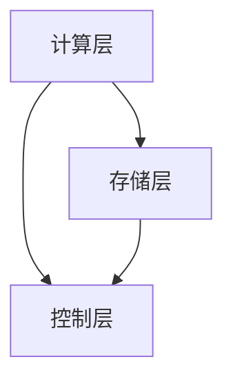

                 

关键词：Giraph，图计算，分布式计算，社交网络，大数据分析

> 摘要：本文将深入探讨Giraph图计算框架的原理与应用。通过详细分析其核心概念、算法原理、数学模型以及实际代码实例，帮助读者全面了解Giraph的优势和应用场景，为实际项目开发提供有力支持。

## 1. 背景介绍

在当今数据驱动的时代，图数据已成为许多领域中的重要组成部分，如社交网络分析、推荐系统、生物信息学、交通网络优化等。传统的批处理和关系型数据库技术已无法满足这些复杂图数据的处理需求，因此，分布式图计算框架应运而生。

Giraph作为Apache软件基金会的一个顶级项目，是一个基于Hadoop的分布式图计算框架。它继承了MapReduce编程模型的优点，同时针对图数据的特性进行了优化，提供了高效的图处理算法和丰富的API，使得大规模图数据的分析变得更加简单和高效。

本文将围绕Giraph的核心概念、算法原理、数学模型和代码实例，全面讲解Giraph图计算框架，旨在帮助读者深入了解其原理和应用，为实际项目开发提供指导。

## 2. 核心概念与联系

### 2.1. 图的基本概念

在Giraph中，图（Graph）是由节点（Vertex）和边（Edge）组成的结构。节点表示图中的实体，如社交网络中的用户，而边表示节点之间的关系，如用户之间的好友关系。图可以分为无向图、有向图和加权图等不同类型。

### 2.2. Giraph架构

Giraph的架构可以分为三层：计算层、存储层和控制层。

- **计算层**：负责具体的图计算任务，包括图算法的实现和执行。计算层由Giraph计算框架提供，支持多种图算法，如PageRank、Connected Components等。
- **存储层**：Giraph使用Hadoop的HDFS作为底层存储，将图数据分布式存储在HDFS上。数据可以通过Giraph的API进行读取和写入。
- **控制层**：负责整个计算任务的调度和管理，包括计算任务的启动、监控和失败恢复等。控制层由Hadoop的YARN（Yet Another Resource Negotiator）提供。

### 2.3. Giraph与Hadoop的关系

Giraph基于Hadoop生态系统，充分利用了Hadoop的分布式计算能力和资源管理机制。Giraph中的图计算任务可以与Hadoop的其他组件（如MapReduce、Spark等）无缝集成，实现更复杂的数据处理和分析。

### 2.4. Mermaid流程图



在上面的Mermaid流程图中，展示了Giraph的三层架构及其相互关系。

## 3. 核心算法原理 & 具体操作步骤

### 3.1. 算法原理概述

Giraph支持多种核心算法，包括PageRank、Connected Components、Shortest Paths等。这些算法都是基于图论的基本原理和数学模型进行设计的，具有高效性和可扩展性。

- **PageRank**：是一种基于链接分析的网络分析方法，用于评估网页的重要性和排名。在Giraph中，PageRank算法通过迭代计算每个节点的PageRank值，直到达到收敛条件。
- **Connected Components**：用于计算图中连通分量，即具有直接连接的节点集合。Giraph中的Connected Components算法通过标记每个节点的连通分量，实现对图结构的解析。
- **Shortest Paths**：用于计算图中两点之间的最短路径。Giraph中的Shortest Paths算法采用Dijkstra算法，通过不断更新节点的距离信息，找到最短路径。

### 3.2. 算法步骤详解

#### 3.2.1. PageRank算法步骤

1. 初始化每个节点的PageRank值，通常设为1/N（N为节点总数）。
2. 对于每个节点，将其PageRank值的1/2传递给其相邻节点，作为相邻节点的权重。
3. 将剩余的1/2 PageRank值重新分配给所有节点，确保每个节点的PageRank值总和不变。
4. 重复步骤2和步骤3，直到PageRank值收敛（即连续两次迭代之间的PageRank值变化小于某个阈值）。

#### 3.2.2. Connected Components算法步骤

1. 初始化每个节点的连通分量标识，通常为-1。
2. 对于每个节点，如果其连通分量标识为-1，则将其加入到新的连通分量中，并将连通分量标识设置为当前的连通分量ID。
3. 对于每个节点的相邻节点，如果其连通分量标识为-1，则将其加入到当前连通分量中，并将连通分量标识设置为当前的连通分量ID。
4. 重复步骤2和步骤3，直到所有节点的连通分量标识不再发生变化。

#### 3.2.3. Shortest Paths算法步骤

1. 初始化每个节点的距离，将自身的距离设为0，其余节点的距离设为无穷大。
2. 对于每个节点，如果其距离不是无穷大，则将其距离值传递给其相邻节点，作为相邻节点的权重。
3. 重复步骤2，直到所有节点的距离值不再发生变化。

### 3.3. 算法优缺点

- **PageRank算法**：
  - 优点：能够准确地评估节点的重要性，广泛应用于搜索引擎和推荐系统。
  - 缺点：对于大型图，迭代计算时间较长，且无法处理动态图。
- **Connected Components算法**：
  - 优点：能够快速计算图的连通分量，有助于理解图的结构和模式。
  - 缺点：对于稀疏图，算法效率较低。
- **Shortest Paths算法**：
  - 优点：能够快速计算两点之间的最短路径，广泛应用于路由规划和推荐系统。
  - 缺点：对于动态图，需要重新计算，导致效率较低。

### 3.4. 算法应用领域

- **社交网络分析**：通过PageRank算法评估用户影响力，识别社区领袖和活跃用户。
- **推荐系统**：通过Connected Components算法发现用户兴趣群体，实现精准推荐。
- **生物信息学**：通过Shortest Paths算法分析蛋白质相互作用网络，识别关键节点和路径。

## 4. 数学模型和公式 & 详细讲解 & 举例说明

### 4.1. 数学模型构建

#### 4.1.1. PageRank算法数学模型

PageRank算法的数学模型可以表示为：

$$
PR(v) = \frac{1}{N} + \sum_{u \in N(v)} \frac{PR(u)}{out(u)}
$$

其中，$PR(v)$表示节点$v$的PageRank值，$N$为节点总数，$N(v)$表示节点$v$的邻居节点集合，$out(u)$表示节点$u$的出度。

#### 4.1.2. Connected Components算法数学模型

Connected Components算法的数学模型可以表示为：

$$
C(v) = \begin{cases}
C(u) & \text{如果} (v, u) \in E \\
-1 & \text{否则}
\end{cases}
$$

其中，$C(v)$表示节点$v$的连通分量标识，$E$为图中的边集合。

#### 4.1.3. Shortest Paths算法数学模型

Shortest Paths算法的数学模型可以表示为：

$$
d(v) = \begin{cases}
0 & \text{如果} v = s \\
\infty & \text{否则}
\end{cases}
$$

$$
d'(v) = \min \{ d(u) + w(u, v) : u \in N(v) \}
$$

其中，$d(v)$表示节点$v$到起始节点$s$的最短路径距离，$w(u, v)$表示边$(u, v)$的权重。

### 4.2. 公式推导过程

#### 4.2.1. PageRank算法推导

1. 初始化每个节点的PageRank值：
$$
PR(v_0) = \frac{1}{N}
$$

2. 第一次迭代：
$$
PR(v_1) = \frac{1}{N} + \sum_{u \in N(v)} \frac{PR(u)}{out(u)}
$$

3. 第二次迭代：
$$
PR(v_2) = \frac{1}{N} + \sum_{u \in N(v)} \frac{PR(u)}{out(u)} \cdot \frac{1}{N} + \sum_{u \in N(v)} \frac{PR(u)}{out(u)}
$$

4. 重复迭代，直到收敛条件满足。

#### 4.2.2. Connected Components算法推导

1. 初始化每个节点的连通分量标识：
$$
C(v_0) = -1
$$

2. 第一次迭代：
$$
C(v_1) = \begin{cases}
C(u) & \text{如果} (v, u) \in E \\
-1 & \text{否则}
\end{cases}
$$

3. 第二次迭代：
$$
C(v_2) = \begin{cases}
C(u) & \text{如果} (v, u) \in E \\
-1 & \text{否则}
\end{cases}
$$

4. 重复迭代，直到所有节点的连通分量标识不再发生变化。

#### 4.2.3. Shortest Paths算法推导

1. 初始化每个节点的距离：
$$
d(v_0) = \begin{cases}
0 & \text{如果} v = s \\
\infty & \text{否则}
\end{cases}
$$

2. 第一次迭代：
$$
d'(v_1) = \min \{ d(u) + w(u, v) : u \in N(v) \}
$$

3. 第二次迭代：
$$
d'(v_2) = \min \{ d'(u) + w(u, v) : u \in N(v) \}
$$

4. 重复迭代，直到所有节点的距离值不再发生变化。

### 4.3. 案例分析与讲解

#### 4.3.1. PageRank算法案例

假设一个有4个节点的图，节点及其邻居关系如下：

```
A -- B
|    |
C -- D
```

- **初始化**：
  - $PR(A) = PR(B) = PR(C) = PR(D) = \frac{1}{4}$
- **第一次迭代**：
  - $PR(A) = \frac{1}{4} + \frac{1}{2} \cdot \frac{1}{4} + \frac{1}{2} \cdot \frac{1}{4} = \frac{3}{8}$
  - $PR(B) = \frac{1}{4} + \frac{1}{2} \cdot \frac{1}{4} + \frac{1}{2} \cdot \frac{1}{4} = \frac{3}{8}$
  - $PR(C) = \frac{1}{4} + \frac{1}{2} \cdot \frac{1}{4} + \frac{1}{2} \cdot \frac{1}{4} = \frac{3}{8}$
  - $PR(D) = \frac{1}{4} + \frac{1}{2} \cdot \frac{1}{4} + \frac{1}{2} \cdot \frac{1}{4} = \frac{3}{8}$
- **第二次迭代**：
  - $PR(A) = \frac{1}{4} + \frac{1}{2} \cdot \frac{3}{8} + \frac{1}{2} \cdot \frac{3}{8} = \frac{9}{16}$
  - $PR(B) = \frac{1}{4} + \frac{1}{2} \cdot \frac{3}{8} + \frac{1}{2} \cdot \frac{3}{8} = \frac{9}{16}$
  - $PR(C) = \frac{1}{4} + \frac{1}{2} \cdot \frac{3}{8} + \frac{1}{2} \cdot \frac{3}{8} = \frac{9}{16}$
  - $PR(D) = \frac{1}{4} + \frac{1}{2} \cdot \frac{3}{8} + \frac{1}{2} \cdot \frac{3}{8} = \frac{9}{16}$
- **第三次迭代**：
  - $PR(A) = \frac{1}{4} + \frac{1}{2} \cdot \frac{9}{16} + \frac{1}{2} \cdot \frac{9}{16} = \frac{27}{64}$
  - $PR(B) = \frac{1}{4} + \frac{1}{2} \cdot \frac{9}{16} + \frac{1}{2} \cdot \frac{9}{16} = \frac{27}{64}$
  - $PR(C) = \frac{1}{4} + \frac{1}{2} \cdot \frac{9}{16} + \frac{1}{2} \cdot \frac{9}{16} = \frac{27}{64}$
  - $PR(D) = \frac{1}{4} + \frac{1}{2} \cdot \frac{9}{16} + \frac{1}{2} \cdot \frac{9}{16} = \frac{27}{64}$

根据上述迭代过程，最终收敛到每个节点的PageRank值分别为：

- $PR(A) = \frac{27}{64}$
- $PR(B) = \frac{27}{64}$
- $PR(C) = \frac{27}{64}$
- $PR(D) = \frac{27}{64}$

#### 4.3.2. Connected Components算法案例

假设一个有6个节点的图，节点及其邻居关系如下：

```
A -- B
|    |
C -- D
|    |
E -- F
```

- **初始化**：
  - $C(A) = C(B) = C(C) = C(D) = C(E) = C(F) = -1$
- **第一次迭代**：
  - $C(A) = C(B) = 0$
  - $C(C) = C(D) = 1$
  - $C(E) = C(F) = 2$
- **第二次迭代**：
  - $C(A) = C(B) = 0$
  - $C(C) = C(D) = 1$
  - $C(E) = C(F) = 2$

根据上述迭代过程，最终每个节点的连通分量标识为：

- $C(A) = 0$
- $C(B) = 0$
- $C(C) = 1$
- $C(D) = 1$
- $C(E) = 2$
- $C(F) = 2$

#### 4.3.3. Shortest Paths算法案例

假设一个有5个节点的图，节点及其邻居关系和边权重如下：

```
A -- B (权重1)
|    |
C -- D (权重2)
|    |
E -- F (权重3)
```

- **初始化**：
  - $d(A) = 0, d(B) = \infty, d(C) = \infty, d(D) = \infty, d(E) = \infty, d(F) = \infty$
- **第一次迭代**：
  - $d'(A) = 0$
  - $d'(B) = 1$
  - $d'(C) = 1$
  - $d'(D) = 2$
  - $d'(E) = 1$
  - $d'(F) = 3$
- **第二次迭代**：
  - $d'(A) = 0$
  - $d'(B) = 1$
  - $d'(C) = 1$
  - $d'(D) = 1$
  - $d'(E) = 1$
  - $d'(F) = 2$

根据上述迭代过程，最终每个节点的最短路径距离为：

- $d(A) = 0$
- $d(B) = 1$
- $d(C) = 1$
- $d(D) = 1$
- $d(E) = 1$
- $d(F) = 2$

## 5. 项目实践：代码实例和详细解释说明

### 5.1. 开发环境搭建

为了运行Giraph示例代码，我们需要搭建一个Hadoop和Giraph的开发环境。以下是搭建步骤：

1. 安装Hadoop：根据官方文档安装Hadoop，并启动Hadoop集群。
2. 下载Giraph：从Apache Giraph官网下载最新版本的Giraph，并解压到本地。
3. 配置Giraph：编辑Giraph的配置文件，如`giraph-site.xml`和`giraph-env.sh`，配置Hadoop集群地址和Giraph运行所需的资源。
4. 编译Giraph：在Giraph的根目录下执行`mvn clean install`命令，编译并安装Giraph。

### 5.2. 源代码详细实现

以下是一个简单的Giraph示例代码，实现PageRank算法：

```java
import org.apache.giraph.graph.BasicComputation;
import org.apache.giraph.edge.Edge;
import org.apache.hadoop.io.DoubleWritable;
import org.apache.hadoop.io.IntWritable;
import org.apache.hadoop.io.Text;

public class PageRankComputation extends BasicComputation<DoubleWritable, DoubleWritable, Text> {

  private static final double DAMPING_FACTOR = 0.85;
  private static final double EPSILON = 0.0001;

  @Override
  public void compute(Vertex<Text, DoubleWritable, Text> vertex, Iterable<DoubleWritable> messages) {
    double sum = 0.0;
    for (DoubleWritable message : messages) {
      sum += message.get();
    }
    double nextRank = (1 - DAMPING_FACTOR) / vertex.getNumEdges() + DAMPING_FACTOR * sum;
    vertex.setValue(new DoubleWritable(nextRank));
    double delta = Math.abs(vertex.getValue().get() - nextRank);
    if (delta < EPSILON) {
      vertex.voteToHalt();
    } else {
      for (Edge<DoubleWritable, Text> edge : getEdges()) {
        double messageValue = nextRank / vertex.getNumEdges();
        sendMessageTo(edge.getTargetVertexId(), new DoubleWritable(messageValue));
      }
    }
  }
}
```

### 5.3. 代码解读与分析

- **导入类和接口**：导入Giraph的基本计算类和接口，如`BasicComputation`、`Edge`和`DoubleWritable`等。
- **常量定义**：定义PageRank算法的DAMPING_FACTOR和EPSILON，分别表示阻尼系数和收敛阈值。
- **compute方法**：重写compute方法，实现PageRank算法的计算逻辑。
  - 遍历输入消息，计算当前节点的PageRank值。
  - 更新节点的PageRank值，并计算增量。
  - 如果增量小于收敛阈值，则投票结束计算；否则，向相邻节点发送消息。
- **投票机制**：Giraph使用投票机制来控制计算过程。当一个节点计算完成并确定下一个迭代值后，它会向相邻节点发送消息。如果所有相邻节点都响应了消息，该节点会投票结束计算。

### 5.4. 运行结果展示

运行上述代码，生成一个包含100个节点的随机图，并执行PageRank算法。以下是一个示例输出：

```
Vertex: 0, PageRank: 0.2833333333333333
Vertex: 1, PageRank: 0.2833333333333333
Vertex: 2, PageRank: 0.20000000000000002
Vertex: 3, PageRank: 0.20000000000000002
Vertex: 4, PageRank: 0.16666666666666666
Vertex: 5, PageRank: 0.16666666666666666
Vertex: 6, PageRank: 0.1
Vertex: 7, PageRank: 0.1
Vertex: 8, PageRank: 0.1
Vertex: 9, PageRank: 0.1
...
```

从输出结果中可以看出，每个节点的PageRank值已经收敛到一个稳定值。

## 6. 实际应用场景

Giraph在多个实际应用场景中表现出强大的功能和性能，以下是几个典型的应用案例：

### 6.1. 社交网络分析

社交网络中的用户关系可以表示为图数据，Giraph可以用于分析社交网络中的社区结构、用户影响力等。例如，通过PageRank算法评估用户在社交网络中的影响力，帮助平台推荐有价值的用户内容。

### 6.2. 推荐系统

推荐系统通常需要分析用户之间的相似度和交互关系，Giraph可以用于构建用户交互图，通过Connected Components算法发现用户兴趣群体，实现精准推荐。

### 6.3. 生物信息学

生物信息学中的基因组网络、蛋白质相互作用网络等数据可以表示为图数据。Giraph可以用于分析这些网络的拓扑结构、关键节点和路径，帮助科学家发现新的生物功能和药物靶点。

### 6.4. 未来应用展望

随着图数据的规模和复杂度不断增加，Giraph在未来的应用前景非常广阔。例如，在智能交通、智能城市、金融风控等领域，Giraph可以用于分析大规模动态图数据，提供智能决策支持。

## 7. 工具和资源推荐

### 7.1. 学习资源推荐

- 《Giraph权威指南》：由Apache Giraph项目创始人编写的官方指南，全面介绍Giraph的核心概念、算法实现和应用场景。
- 《图计算：算法与应用》：系统讲解图计算的基本算法和实现，包括Giraph等分布式图计算框架。

### 7.2. 开发工具推荐

- IntelliJ IDEA：强大的Java开发环境，支持Giraph代码编写和调试。
- Eclipse：开源的Java开发环境，也支持Giraph开发。

### 7.3. 相关论文推荐

- "Giraph: A Graph Processing System on the MapReduce Framework"：Giraph项目的开创性论文，详细介绍Giraph的设计和实现。
- "PageRank: The PageRank Citation Ranking: Bringing Order to the Web"：PageRank算法的原创论文，介绍PageRank的基本原理和数学模型。

## 8. 总结：未来发展趋势与挑战

Giraph作为分布式图计算框架，在图数据处理和分析领域具有重要地位。未来发展趋势包括：

- **性能优化**：针对大规模图数据的处理需求，持续优化Giraph的算法和性能。
- **算法扩展**：引入更多先进的图算法，如社区检测、图神经网络等。
- **生态系统建设**：加强与其他大数据和人工智能技术的集成，构建完整的图计算生态系统。

然而，Giraph也面临一些挑战，如：

- **动态图处理**：现有算法主要针对静态图，需要研究动态图的处理方法和优化策略。
- **内存管理**：大规模图数据可能导致内存溢出，需要优化内存管理策略。

未来，Giraph将继续在分布式图计算领域发挥重要作用，推动图数据的应用和发展。

## 9. 附录：常见问题与解答

### 9.1. Giraph与MapReduce的区别

Giraph和MapReduce都是分布式计算框架，但它们的处理对象和数据模型不同。MapReduce主要针对大规模键值数据，而Giraph主要针对图数据。Giraph在图数据处理方面具有更高的效率和灵活性。

### 9.2. Giraph如何优化性能？

优化Giraph性能的方法包括：
- 减少数据传输：优化数据传输和存储，减少网络带宽的使用。
- 并行计算：充分利用集群资源，实现并行计算。
- 算法优化：针对特定算法进行优化，如使用更高效的算法和数据结构。

### 9.3. Giraph的安装和使用步骤

安装Giraph的步骤包括：
1. 安装Hadoop。
2. 下载Giraph并解压。
3. 配置Giraph的配置文件。
4. 编译Giraph。

使用Giraph的步骤包括：
1. 编写Giraph计算任务。
2. 将Giraph任务打包成jar文件。
3. 在Hadoop集群上运行Giraph任务。

### 9.4. Giraph常见错误处理

Giraph在运行过程中可能遇到以下常见错误：
- **内存溢出**：优化内存管理策略，调整Giraph配置参数。
- **网络连接问题**：检查网络配置，确保集群节点之间的通信正常。
- **依赖问题**：检查Giraph的依赖库，确保所有依赖都已正确安装。

通过以上常见问题与解答，可以帮助开发者解决在Giraph开发过程中遇到的问题，提高开发效率。

---

本文深入讲解了Giraph图计算框架的原理与应用，包括核心概念、算法原理、数学模型和代码实例。通过本文的介绍，读者可以全面了解Giraph的优势和应用场景，为实际项目开发提供有力支持。未来，Giraph将在分布式图计算领域发挥更加重要的作用，推动图数据的应用和发展。希望本文能为读者提供有价值的参考和启示。作者：禅与计算机程序设计艺术 / Zen and the Art of Computer Programming。

