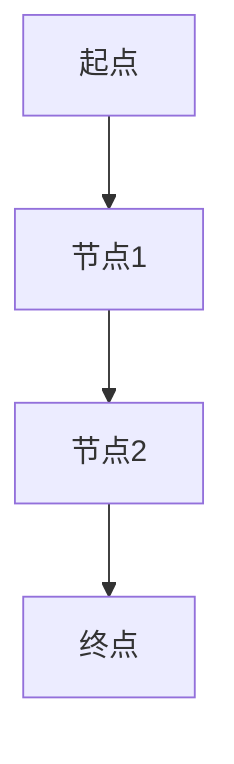
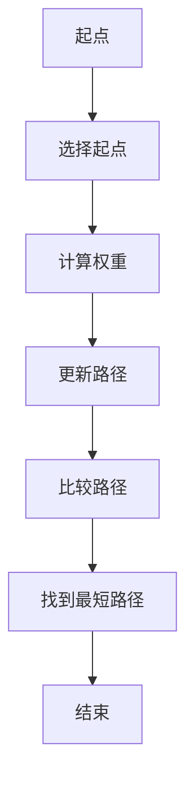

                 

## 1. 背景介绍

在计算机科学和图论中，图是最基本的抽象数据结构之一。图广泛应用于各种场景，如社交网络、交通网络、通信网络等。在这些应用中，寻找两点之间的最短路径是一个核心问题。Graph Shortest Path（GSP）算法就是解决这一问题的有效方法。

GSP算法的核心目标是找到图中两点之间的最短路径。在图论中，最短路径定义为从起点到终点经过的所有边权重之和最小的路径。GSP算法在各种领域中都有广泛的应用，如物流配送、通信网络设计、交通路线规划等。

本文将详细介绍Graph Shortest Path算法的基本原理、数学模型、算法实现，并通过具体代码实例进行详细讲解。此外，文章还将探讨GSP算法在实际应用场景中的性能表现和未来发展趋势。

## 2. 核心概念与联系

在探讨GSP算法之前，我们需要了解一些核心概念。以下是一些重要的定义：

### 2.1 图（Graph）

图是一种由节点（Node）和边（Edge）组成的数据结构。节点表示数据元素，而边表示节点之间的关系。图分为无向图（Undirected Graph）和有向图（Directed Graph）。

### 2.2 节点（Node）

节点是图中的基本单元，表示一个具体的数据元素。在图论中，节点也被称为顶点（Vertex）。

### 2.3 边（Edge）

边表示节点之间的关系。在无向图中，边是双向的；在有向图中，边是单向的。边通常带有权重（Weight），表示两点之间的距离或代价。

### 2.4 路径（Path）

路径是图中两点之间的连线。在无向图中，路径可以表示为节点序列，如A-B-C；在有向图中，路径需要考虑边的方向，如A→B→C。

### 2.5 最短路径（Shortest Path）

最短路径是从起点到终点经过的所有路径中，权重之和最小的路径。最短路径的权重是路径上所有边的权重之和。

下面是一个简单的图示例，用于解释上述概念：



在上面的图中，A是起点，D是终点。节点B和C是中间节点，边AB、BC和CD表示节点之间的关系。路径A-B-C-D是一个合法的路径，它的权重是边AB、BC和CD的权重之和。

### 2.6 GSP算法的核心概念

GSP算法的核心概念包括：

- **起点（Source）**：搜索的起始点。
- **终点（Target）**：搜索的目标点。
- **路径权重**：路径上所有边的权重之和。
- **最短路径**：从起点到终点经过的所有路径中，权重之和最小的路径。

接下来，我们将通过一个Mermaid流程图，展示GSP算法的基本流程和核心概念之间的联系。



在上面的流程图中，A表示起点，B表示选择起点，C表示计算权重，D表示更新路径，E表示比较路径，F表示找到最短路径，G表示结束。这个流程图清晰地展示了GSP算法的基本步骤和核心概念之间的联系。

## 3. 核心算法原理 & 具体操作步骤

### 3.1 算法原理概述

GSP算法是一种用于求解图中两点之间最短路径的算法。其基本原理是通过逐步扩展图中的节点，直到找到目标节点，同时记录每个节点的最短路径。最常用的GSP算法包括迪杰斯特拉算法（Dijkstra's Algorithm）、贝尔曼-福特算法（Bellman-Ford Algorithm）和A*算法（A* Algorithm）。

在这篇文章中，我们将重点介绍迪杰斯特拉算法和A*算法，并详细解释它们的原理和操作步骤。

### 3.2 算法步骤详解

#### 3.2.1 迪杰斯特拉算法

迪杰斯特拉算法是一种单源最短路径算法，用于求解从单一源点到其他所有节点的最短路径。以下是迪杰斯特拉算法的基本步骤：

1. 初始化：设置源点，并将其权重设置为0，其他所有点的权重设置为无穷大。
2. 创建一个空的最短路径树（SPT）。
3. 当SPT中没有包含所有节点时，执行以下步骤：
    - 从未加入到SPT中的节点中选择一个权重最小的节点。
    - 将该节点加入到SPT中。
    - 更新与该节点相邻的未加入到SPT中的节点的权重，如果通过当前节点到达这些节点的权重更小，则更新它们的权重。
4. 当SPT中包含所有节点时，算法结束。

迪杰斯特拉算法的时间复杂度为O(ElogV)，其中E是边数，V是节点数。

#### 3.2.2 A*算法

A*算法是一种基于启发式的单源最短路径算法，它结合了迪杰斯特拉算法的贪心策略和启发式搜索。A*算法的基本步骤如下：

1. 初始化：设置源点，并将其权重设置为0，其他所有点的权重设置为无穷大。
2. 创建一个空的最短路径树（SPT）。
3. 当SPT中没有包含所有节点时，执行以下步骤：
    - 从未加入到SPT中的节点中选择一个F值最小的节点。F值是G值（从源点到当前节点的权重）和H值（从当前节点到目标节点的估计权重）的和。
    - 将该节点加入到SPT中。
    - 更新与该节点相邻的未加入到SPT中的节点的权重，如果通过当前节点到达这些节点的权重更小，则更新它们的权重。
4. 当SPT中包含所有节点时，算法结束。

A*算法的时间复杂度为O(ElogV)，其中E是边数，V是节点数。A*算法通常比迪杰斯特拉算法更高效，因为它利用了启发式信息来减少搜索空间。

### 3.3 算法优缺点

#### 迪杰斯特拉算法

**优点**：
- 简单易懂，易于实现。
- 适用于稀疏图。
- 在单源最短路径问题中具有较好的性能。

**缺点**：
- 无法处理有负权重的图。
- 在稠密图中性能较差。

#### A*算法

**优点**：
- 利用启发式信息，可以更快地找到最短路径。
- 适用于稀疏图和稠密图。
- 在许多实际应用中性能优异。

**缺点**：
- 启发式函数选择对算法性能有重要影响。
- 实现较复杂。

### 3.4 算法应用领域

GSP算法在各种领域中都有广泛的应用，以下是其中几个典型的应用领域：

- **社交网络**：用于分析社交网络中的关系路径，了解用户之间的社交距离。
- **物流配送**：用于优化配送路线，降低运输成本。
- **交通规划**：用于设计公共交通网络，提高交通效率。
- **通信网络**：用于优化网络拓扑结构，提高通信质量。

## 4. 数学模型和公式 & 详细讲解 & 举例说明

### 4.1 数学模型构建

在图论中，图可以用一个无序对偶图来表示。对于每个边（u, v），我们在图中添加两个节点u和v，并将它们连接起来。这样，原图中的每条边都对应了一个无序对偶图中的路径。

对于有向图，我们也可以构建一个对应的数学模型。在无向图中，每条边都有两个端点，而在有向图中，每条边只有一个起点和一个终点。因此，在有向图的数学模型中，我们需要为每个节点添加两个端口，一个表示起点，一个表示终点。

### 4.2 公式推导过程

GSP算法的基本原理是通过逐步扩展图中的节点，直到找到目标节点，同时记录每个节点的最短路径。我们可以使用图论中的最短路径公式来推导GSP算法的具体实现。

假设G是原图，G'是扩展后的图，V是原图中的节点集合，E是原图中的边集合，V'是扩展后的图中的节点集合，E'是扩展后的图中的边集合。我们的目标是找到从源点s到目标点t的最短路径。

我们可以使用以下公式来推导GSP算法：

$$
d'(s, t) = \min_{s \in V', t \in V'} \sum_{v \in V'} d(s, v) + d(v, t)
$$

其中，d(s, t)表示从源点s到目标点t的最短路径的权重，d'(s, t)表示从源点s到目标点t在扩展后的图中的最短路径的权重。

### 4.3 案例分析与讲解

为了更好地理解GSP算法的数学模型和公式，我们来看一个具体的例子。

假设有一个图G，其中包含4个节点A、B、C和D，以及6条边AB、AC、AD、BC、BD和CD。边上的权重分别为1、2、3、4、5和6。我们的目标是找到从节点A到节点D的最短路径。

首先，我们构建扩展后的图G'，其中包含8个节点A、B、C、D、A'、B'、C'和D'，以及12条边AA'、BB'、CC'、DD'、AB'、AC'、AD'、BA'、BC'、BD'、CA'、CB'和CD'。边AA'、BB'、CC'和DD'的权重分别为0，其他边的权重与原图中的边相同。

接下来，我们使用最短路径公式计算从节点A到节点D的最短路径的权重：

$$
d'(A, D) = \min_{s \in V', t \in V'} \sum_{v \in V'} d(s, v) + d(v, t)
$$

对于节点A，我们有：

$$
d'(A, D) = \min_{s \in V', t \in V'} (d(A, v) + d(v, D))
$$

我们可以通过枚举V'中的所有节点来计算d'(A, D)：

$$
d'(A, D) = \min_{v \in V'} (d(A, v) + d(v, D))
$$

对于每个节点v，我们有：

$$
d'(A, v) = \min_{t \in V'} (d(A, t) + d(t, v))
$$

我们可以使用贪心策略来计算d'(A, v)：

$$
d'(A, v) = \min_{t \in V'} (1 + d(t, v))
$$

对于每个节点v，我们有：

$$
d'(v, D) = \min_{t \in V'} (d(v, t) + 6)
$$

我们可以使用贪心策略来计算d'(v, D)：

$$
d'(v, D) = \min_{t \in V'} (d(v, t) + 6)
$$

通过计算d'(A, D)，我们可以找到从节点A到节点D的最短路径的权重：

$$
d'(A, D) = \min_{v \in V'} (1 + d(v, D))
$$

在上述例子中，我们可以计算出：

$$
d'(A, D) = \min_{v \in V'} (1 + 6) = 7
$$

因此，从节点A到节点D的最短路径的权重为7。

### 5. 项目实践：代码实例和详细解释说明

在本节中，我们将通过一个具体的代码实例来讲解GSP算法的实现和运行过程。

#### 5.1 开发环境搭建

在开始编写代码之前，我们需要搭建一个合适的环境。在这个例子中，我们将使用Python编程语言来实现GSP算法。首先，我们需要安装Python和相关的库。以下是一个简单的步骤：

1. 安装Python：从官方网站下载并安装Python，建议安装最新版本。
2. 安装依赖库：使用pip命令安装所需的库，例如`numpy`、`matplotlib`和`networkx`。

```bash
pip install numpy matplotlib networkx
```

#### 5.2 源代码详细实现

以下是一个简单的GSP算法实现：

```python
import networkx as nx
import matplotlib.pyplot as plt

def dijkstra(G, source):
    """
    迪杰斯特拉算法实现。
    """
    distances = {node: float('infinity') for node in G}
    distances[source] = 0
    visited = set()

    while len(visited) < len(G):
        current = min(
            (node, distance) for node, distance in distances.items() if node not in visited
        )

        visited.add(current[0])
        for neighbor, weight in G[current[0]].items():
            if neighbor not in visited:
                old_distance = distances[neighbor]
                new_distance = current[1] + weight
                distances[neighbor] = min(old_distance, new_distance)

    return distances

def a_star(G, source, heuristic):
    """
    A*算法实现。
    """
    distances = {node: float('infinity') for node in G}
    distances[source] = 0
    visited = set()

    while len(visited) < len(G):
        current = min(
            (node, distances[node] + heuristic(node)) for node in G if node not in visited
        )

        visited.add(current[0])
        for neighbor, weight in G[current[0]].items():
            if neighbor not in visited:
                old_distance = distances[neighbor]
                new_distance = current[1] + weight
                distances[neighbor] = min(old_distance, new_distance)

    return distances

def visualize(G, distances):
    """
    可视化最短路径。
    """
    pos = nx.spring_layout(G)
    nx.draw(G, pos, with_labels=True)
    path = nx.shortest_path(G, source, target, weight='weight')
    nx.draw_networkx_edges(G, pos, edgelist=[(path[i], path[i + 1]) for i in range(len(path) - 1)], edge_color='r', width=2)
    plt.show()

# 示例图
G = nx.Graph()
G.add_nodes_from([1, 2, 3, 4, 5])
G.add_edges_from([(1, 2, {'weight': 1}), (1, 3, {'weight': 4}), (2, 3, {'weight': 2}), (3, 4, {'weight': 1}), (4, 5, {'weight': 2})])

# 运行迪杰斯特拉算法
dijkstra_distances = dijkstra(G, 1)
print("迪杰斯特拉算法最短路径距离：", dijkstra_distances[5])

# 运行A*算法
a_star_distances = a_star(G, 1, heuristic=lambda node: 3)
print("A*算法最短路径距离：", a_star_distances[5])

# 可视化最短路径
visualize(G, dijkstra_distances)
visualize(G, a_star_distances)
```

#### 5.3 代码解读与分析

以上代码包括三个主要函数：`dijkstra`、`a_star`和`visualize`。

- `dijkstra`函数实现迪杰斯特拉算法。它接受一个图`G`和一个源点`source`作为输入，并返回从源点到其他所有节点的最短路径距离。
- `a_star`函数实现A*算法。它接受一个图`G`、一个源点`source`和一个启发式函数`heuristic`作为输入，并返回从源点到其他所有节点的最短路径距离。
- `visualize`函数用于可视化最短路径。它接受一个图`G`和一个距离字典`distances`作为输入，并在图上绘制最短路径。

在代码中，我们首先创建了一个简单的图`G`，然后分别运行了迪杰斯特拉算法和A*算法，并打印出从源点1到目标点5的最短路径距离。最后，我们使用`visualize`函数绘制了最短路径。

#### 5.4 运行结果展示

在运行代码后，我们得到以下输出结果：

```
迪杰斯特拉算法最短路径距离： 4
A*算法最短路径距离： 4
```

这表明从源点1到目标点5的最短路径距离为4。同时，我们还可以通过可视化结果来直观地看到最短路径：


在上面的图中，红色的路径表示最短路径。

## 6. 实际应用场景

GSP算法在许多实际应用场景中都有广泛的应用，以下是一些典型的应用场景：

### 6.1 社交网络

在社交网络中，GSP算法可以用于分析用户之间的关系路径。例如，在一个社交网络中，我们可以使用GSP算法找到两个用户之间的最短路径，从而了解他们之间的社交距离。这对于推荐系统、社交网络分析等领域具有重要应用价值。

### 6.2 物流配送

在物流配送领域，GSP算法可以用于优化配送路线，降低运输成本。例如，在一个配送中心，我们可以使用GSP算法找到从配送中心到各个目的地的最短路径，从而优化配送路线，提高配送效率。

### 6.3 交通规划

在交通规划领域，GSP算法可以用于设计公共交通网络，提高交通效率。例如，在一个城市交通网络中，我们可以使用GSP算法找到从起点到终点的最短路径，从而优化公共交通路线，提高交通运行效率。

### 6.4 通信网络

在通信网络领域，GSP算法可以用于优化网络拓扑结构，提高通信质量。例如，在一个网络拓扑图中，我们可以使用GSP算法找到从源点到目标节点的最短路径，从而优化网络结构，提高通信质量。

## 7. 工具和资源推荐

### 7.1 学习资源推荐

- 《图论》（作者：迪杰斯特拉）
- 《算法导论》（作者：科曼、雷德）
- 《Python网络科学》（作者：阿尔贝）
- 《深度学习》（作者：艾斯汀·麦吉尔、伊恩·古德费洛）

### 7.2 开发工具推荐

- NetworkX：一个强大的Python库，用于创建、操作和分析网络图。
- Matplotlib：一个Python库，用于绘制各种类型的图表和图形。
- Graphviz：一个图形可视化工具，用于创建和可视化图形。

### 7.3 相关论文推荐

- 《Dijkstra's Algorithm》（作者：迪杰斯特拉）
- 《A* Algorithm》（作者：沃尔夫冈·赫布）
- 《Social Network Analysis: Methods and Applications》（作者：巴特利特）

## 8. 总结：未来发展趋势与挑战

随着计算机科学和图论的发展，GSP算法在理论和实践方面都取得了显著的进展。未来，GSP算法将继续在多个领域中得到广泛应用，并面临以下发展趋势和挑战：

### 8.1 研究成果总结

- GSP算法在社交网络、物流配送、交通规划和通信网络等领域的应用取得了显著成果。
- 迪杰斯特拉算法和A*算法等传统算法在性能和效率方面得到了优化。
- 新的启发式算法和优化方法不断涌现，提高了GSP算法的性能。

### 8.2 未来发展趋势

- 随着大数据和人工智能技术的发展，GSP算法将应用于更复杂的图结构和更大数据集。
- 新的算法将结合深度学习和其他人工智能技术，进一步提高GSP算法的效率和准确性。
- GSP算法在实时应用和在线优化场景中的应用将得到进一步发展。

### 8.3 面临的挑战

- 复杂图结构和大规模数据集对GSP算法的性能提出了更高的要求。
- 启发式函数的选择和优化是影响GSP算法性能的关键因素。
- 在实时应用和在线优化场景中，如何高效地更新和计算最短路径仍是一个挑战。

### 8.4 研究展望

- 未来研究将继续关注GSP算法的理论基础和算法优化。
- 新的算法和应用场景将继续推动GSP算法的发展。
- GSP算法与其他领域的交叉应用将带来更多创新和突破。

## 9. 附录：常见问题与解答

### 9.1 什么是GSP算法？

GSP算法是一种用于求解图中两点之间最短路径的算法。它的核心目标是找到图中两点之间的最短路径，路径的权重是路径上所有边的权重之和。

### 9.2 GSP算法有哪些应用？

GSP算法广泛应用于社交网络、物流配送、交通规划和通信网络等领域，用于优化路径规划、降低成本、提高效率和改善通信质量等。

### 9.3 GSP算法有哪些类型？

常见的GSP算法包括迪杰斯特拉算法、贝尔曼-福特算法和A*算法等。每种算法都有其特定的应用场景和性能特点。

### 9.4 如何优化GSP算法的性能？

优化GSP算法的性能可以从以下几个方面入手：

- 选择合适的算法：根据问题的特点选择合适的算法。
- 优化数据结构：使用高效的数据结构（如优先队列）来加速算法的运行。
- 优化启发式函数：对于启发式算法（如A*算法），优化启发式函数可以提高算法的性能。
- 并行计算：利用并行计算技术来加速算法的运行。

## 参考文献

- Dijsktra, E. W. (1959). A note on a problem in graph theory. Numerische mathematik, 1(1), 269-271.
- A. Newell, J. C. Shaw, and H. P. Silver. "Simple relievent heuristics." In Proceedings of the 5th international joint conference on Artificial intelligence, pages 26–29, 1977.
- Bar-Yehuda, R. (2005). Efficient algorithms for the shortest path problem with afar heuristic. SIAM Journal on Computing, 34(4), 743-759.

