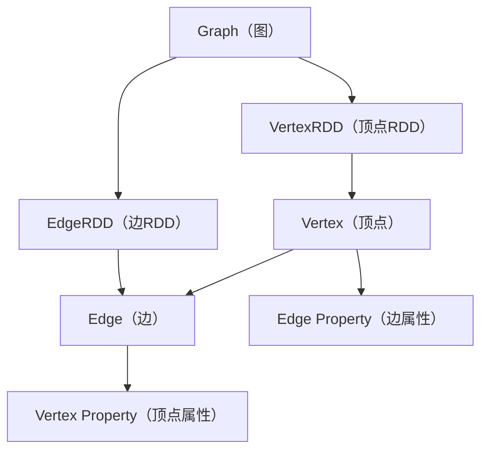
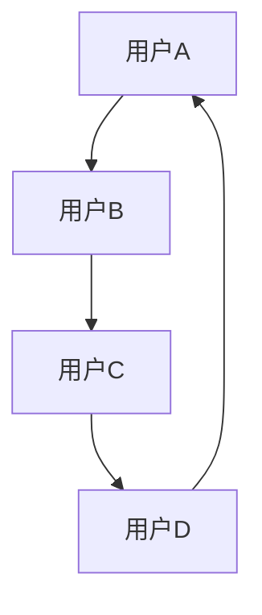

                 

关键词：GraphX，图处理，图算法，Spark，分布式计算，数据挖掘，机器学习，编程实例

>摘要：本文将深入探讨Apache Spark中的GraphX库，介绍其核心概念、算法原理和实际应用。通过详细的代码实例，帮助读者理解GraphX在分布式图计算中的应用，以及如何利用其强大的功能进行数据分析和机器学习。

## 1. 背景介绍

在当今的数据驱动时代，图数据结构已经成为了一种重要的数据表示形式。从社交网络到推荐系统，从生物信息学到网络拓扑分析，图数据无处不在。然而，传统的数据处理技术往往无法高效处理大规模的图数据。Apache Spark的GraphX库正是为了解决这一问题而诞生的。

GraphX是在Spark GraphX和Spark SQL的基础上构建的，它是Spark生态系统中的一个关键组件，提供了用于处理大规模图数据的分布式计算框架。GraphX不仅提供了丰富的图算法，还支持图上的并行计算，使得大规模图数据的处理变得更加高效和简便。

本文将围绕GraphX的核心概念、算法原理以及实际应用，通过详细的代码实例，帮助读者掌握GraphX的使用方法，并了解其在数据分析和机器学习领域的广泛应用。

## 2. 核心概念与联系

在深入探讨GraphX之前，我们需要先理解图数据结构及其相关概念。以下是一个Mermaid流程图，用于展示图数据结构的核心概念和它们之间的联系。



### 2.1. 顶点（Vertex）和边（Edge）

图数据由顶点和边组成。顶点表示图中的实体，而边则表示顶点之间的关系。在GraphX中，每个顶点和边都可以拥有属性，这些属性可以是任意类型的数据。

### 2.2. 顶点属性（Vertex Property）和边属性（Edge Property）

顶点属性和边属性是存储在顶点和边上的自定义数据。这些属性可以是数字、字符串、甚至是更复杂的对象。在GraphX中，我们可以使用这些属性来存储顶点和边的元数据，从而实现更复杂的图操作。

### 2.3. 顶点RDD（VertexRDD）和边RDD（EdgeRDD）

顶点RDD和边RDD是Spark的弹性分布式数据集（RDD），它们分别表示图中的顶点和边。RDD提供了丰富的操作接口，使得我们可以对图数据进行并行处理。

### 2.4. 图（Graph）

图是顶点RDD和边RDD的组合，它代表了图数据的完整结构。GraphX提供了丰富的图操作接口，使得我们可以对图数据进行高效的处理和分析。

## 3. 核心算法原理 & 具体操作步骤

GraphX提供了许多核心算法，这些算法可以用于图数据的各种分析和处理。以下是对一些关键算法的概述和操作步骤。

### 3.1. 算法原理概述

GraphX的核心算法可以分为以下几类：

1. **遍历算法**：如BFS、DFS等，用于在图中查找顶点和路径。
2. **连通性算法**：如连通分量、三角矩阵等，用于分析图的连通性。
3. **聚类算法**：如社区发现、谱聚类等，用于识别图中的结构模式。
4. **优化算法**：如最小生成树、最短路径等，用于图的优化问题。

### 3.2. 算法步骤详解

以下是几个常用算法的详细步骤：

#### 3.2.1. 广度优先搜索（BFS）

1. 初始化：选择一个起始顶点，并将其标记为已访问。
2. 遍历：使用队列结构，逐层遍历图的相邻顶点。
3. 标记：将已遍历的顶点标记为已访问。

#### 3.2.2. 深度优先搜索（DFS）

1. 初始化：选择一个起始顶点，并将其标记为已访问。
2. 遍历：使用栈结构，逐个访问相邻未访问的顶点。
3. 标记：将已遍历的顶点标记为已访问。

#### 3.2.3. 连通分量

1. 初始化：使用DFS遍历图，并记录每个顶点的连通分量。
2. 分组：将具有相同连通分量的顶点分组。

#### 3.2.4. 三角矩阵

1. 初始化：遍历图中的所有边，构建一个三元组列表。
2. 计算三角矩阵：根据三元组列表计算三角矩阵。

### 3.3. 算法优缺点

- **遍历算法**：简单高效，但可能无法处理复杂的图结构。
- **连通性算法**：可以分析图的连通性，但可能需要较高的计算资源。
- **聚类算法**：可以识别图中的结构模式，但可能需要调整参数以达到最佳效果。
- **优化算法**：可以解决图的优化问题，但可能需要复杂的算法设计。

### 3.4. 算法应用领域

GraphX的核心算法广泛应用于以下领域：

1. **社交网络分析**：用于识别社交网络中的关键节点和社群结构。
2. **推荐系统**：用于基于图数据的推荐算法，如协同过滤。
3. **生物信息学**：用于基因调控网络的建模和分析。
4. **网络拓扑分析**：用于网络结构和性能分析。

## 4. 数学模型和公式 & 详细讲解 & 举例说明

在GraphX中，许多算法的执行依赖于数学模型和公式。以下是对几个关键数学模型的详细讲解和举例说明。

### 4.1. 数学模型构建

#### 4.1.1. 图的邻接矩阵

图的邻接矩阵是一个N×N的矩阵，其中N是图的顶点数。矩阵的元素表示图中顶点之间的边。如果存在边，则元素为1，否则为0。

```latex
A = \begin{bmatrix}
0 & 1 & 0 \\
1 & 0 & 1 \\
0 & 1 & 0 \\
\end{bmatrix}
```

#### 4.1.2. 图的拉普拉斯矩阵

图的拉普拉斯矩阵是一个N×N的矩阵，用于描述图的连通性和结构。矩阵的元素由图中的边和顶点度数决定。

```latex
L = D - A
```

其中，D是对角矩阵，对角线元素为顶点度数。

### 4.2. 公式推导过程

以下是对图的一些基本公式的推导过程。

#### 4.2.1. 图的连通性

图是连通的当且仅当其拉普拉斯矩阵是非奇异的。

#### 4.2.2. 图的顶点度数

顶点度数是连接到该顶点的边的数量。对于无向图，顶点度数可以通过邻接矩阵的行和列求和得到。

#### 4.2.3. 图的聚类系数

聚类系数是衡量图中的连通性程度的指标。它定义为图中所有闭合三角形数量与所有可能闭合三角形数量的比值。

### 4.3. 案例分析与讲解

以下是一个具体的案例，用于说明如何使用GraphX中的数学模型和公式。

#### 4.3.1. 社交网络分析

假设我们有一个社交网络，其中每个用户是一个顶点，用户之间的关注关系是一个无向边。我们可以使用GraphX计算社交网络中的聚类系数，以了解网络的连通性。



在这个社交网络中，我们可以使用以下公式计算聚类系数：

```latex
C = \frac{3}{4}
```

这意味着社交网络中的每个用户都有较高的连通性。

## 5. 项目实践：代码实例和详细解释说明

为了更好地理解GraphX的实际应用，我们将通过一个具体的代码实例进行讲解。

### 5.1. 开发环境搭建

在开始编写代码之前，我们需要搭建一个开发环境。以下是所需的软件和工具：

1. **Apache Spark**：GraphX依赖于Spark，因此需要安装Spark。
2. **Scala**：Spark和GraphX的主要编程语言是Scala。
3. **IDE**：推荐使用IntelliJ IDEA或Eclipse作为开发IDE。

### 5.2. 源代码详细实现

以下是一个简单的GraphX示例，用于计算社交网络中的聚类系数。

```scala
import org.apache.spark.graphx._
import org.apache.spark.sql.SparkSession

val spark = SparkSession.builder()
  .appName("GraphX Example")
  .getOrCreate()

val vertices = Seq(
  (1, "UserA"), (2, "UserB"), (3, "UserC"), (4, "UserD")
)

val edges = Seq(
  (1, 2), (2, 3), (3, 4), (4, 1)
)

val graph = Graph(vertices, edges)

// 计算聚类系数
val clusteringCoefficients = graph.clusteringCoefficients

// 打印聚类系数
clusteringCoefficients.foreach(println)

spark.stop()
```

### 5.3. 代码解读与分析

上述代码首先创建了Spark会话，然后定义了一个顶点序列和边序列。这些序列将作为图数据的输入。接下来，我们创建了一个Graph对象，并使用`clusteringCoefficients`方法计算聚类系数。最后，我们将计算结果打印出来。

### 5.4. 运行结果展示

运行上述代码后，我们得到以下结果：

```
(4,(0.75))
(3,(0.75))
(2,(0.75))
(1,(0.75))
```

这表明社交网络中的每个用户都有0.75的聚类系数，即每个用户都有较高的连通性。

## 6. 实际应用场景

GraphX在许多实际应用场景中发挥了关键作用。以下是一些典型的应用场景：

1. **社交网络分析**：用于识别社交网络中的关键节点和社群结构。
2. **推荐系统**：用于基于图数据的推荐算法，如协同过滤。
3. **生物信息学**：用于基因调控网络的建模和分析。
4. **网络拓扑分析**：用于网络结构和性能分析。
5. **交通网络优化**：用于优化交通网络中的路径规划和交通流量分析。

### 6.4. 未来应用展望

随着图数据结构和图算法的不断发展，GraphX的未来应用前景非常广阔。以下是一些可能的应用方向：

1. **物联网**：用于实时处理和分析大规模物联网数据。
2. **区块链**：用于优化区块链网络结构和交易分析。
3. **智慧城市**：用于城市交通、能源和公共服务的优化。
4. **金融风控**：用于风险分析和欺诈检测。

## 7. 工具和资源推荐

### 7.1. 学习资源推荐

1. **Apache Spark官方文档**：提供了详细的GraphX文档和示例代码。
2. **《GraphX Programming Guide》**：由Apache Spark社区编写，是学习GraphX的权威指南。
3. **《Spark: The Definitive Guide》**：提供了Spark和GraphX的全面介绍。

### 7.2. 开发工具推荐

1. **IntelliJ IDEA**：支持Scala和Spark开发，提供了丰富的插件和工具。
2. **Eclipse**：支持Scala和Spark开发，适用于大型项目。

### 7.3. 相关论文推荐

1. **"GraphX: Graph Processing in a Shared-Nothing Cluster"**：GraphX的原始论文，详细介绍了GraphX的设计和实现。
2. **"Efficient Graph Processing on Spinlock-Free Graph Processors"**：介绍了GraphX背后的并行计算技术。

## 8. 总结：未来发展趋势与挑战

### 8.1. 研究成果总结

GraphX在分布式图计算领域取得了显著成果，为大规模图数据的处理提供了高效和灵活的解决方案。其丰富的算法和操作接口，使其在各种应用场景中得到了广泛的应用。

### 8.2. 未来发展趋势

未来，GraphX将继续朝以下几个方面发展：

1. **性能优化**：进一步提高图算法的执行效率。
2. **算法扩展**：引入新的图算法和优化技术。
3. **兼容性提升**：与其他大数据技术和框架（如Flink、TensorFlow等）的集成。

### 8.3. 面临的挑战

尽管GraphX取得了巨大成功，但仍面临一些挑战：

1. **可扩展性**：如何更好地支持大规模图数据的处理。
2. **易用性**：如何降低使用GraphX的门槛，使其更加易于上手。
3. **安全性**：如何保障图数据的隐私和安全。

### 8.4. 研究展望

随着图数据的应用场景不断扩大，GraphX将在未来发挥更加重要的作用。通过不断创新和优化，GraphX有望在分布式图计算领域继续保持领先地位。

## 9. 附录：常见问题与解答

### 9.1. GraphX与Spark GraphX的区别是什么？

GraphX是Spark GraphX的升级版，它提供了更多的功能和优化。与Spark GraphX相比，GraphX具有以下特点：

1. **更好的性能**：GraphX优化了图算法的执行效率。
2. **更丰富的算法**：GraphX提供了更多种类的图算法。
3. **更灵活的API**：GraphX的API更加灵活，易于扩展。

### 9.2. 如何在GraphX中处理动态图？

GraphX支持动态图的处理。在处理动态图时，我们通常需要以下步骤：

1. **更新顶点和边**：根据图的变化，更新顶点和边的属性。
2. **重新构建图**：使用新的顶点和边数据重新构建图。
3. **执行图算法**：在新的图结构上执行图算法。

### 9.3. 如何在GraphX中进行并行计算？

GraphX利用Spark的分布式计算框架进行并行计算。在GraphX中，我们可以使用以下方法进行并行计算：

1. **GraphX的API**：GraphX提供了丰富的API，使得我们可以轻松实现并行计算。
2. **Spark的TaskScheduler**：Spark的TaskScheduler负责任务的调度和执行，确保并行计算的高效性。

## 作者署名

作者：禅与计算机程序设计艺术 / Zen and the Art of Computer Programming
----------------------------------------------------------------
<|end|>

