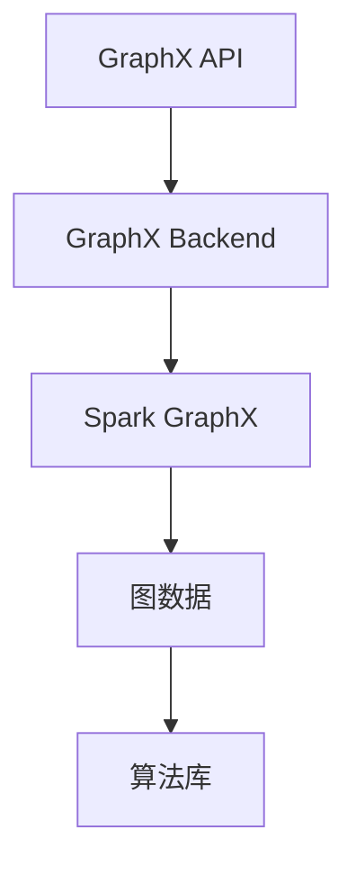

                 

  
> **关键词**：GraphX、图处理、分布式图计算、社交网络分析、推荐系统、图算法、深度学习、大规模数据处理

> **摘要**：本文将深入探讨GraphX的原理、核心概念及其在分布式图计算中的应用。通过详细的代码实例分析，我们将了解如何利用GraphX实现社交网络分析、推荐系统等实际场景中的图算法。同时，本文还将探讨GraphX的数学模型和公式，并展示其在项目实践中的具体应用。最后，我们将展望GraphX的未来发展趋势和面临的挑战。

## 1. 背景介绍

### 1.1 GraphX的起源与发展

GraphX是由Apache软件基金会开源的一个用于大规模分布式图计算的框架，它基于Apache Spark构建。GraphX的开发始于2013年，由Twitter公司的研究团队提出，旨在解决社交网络中大规模图处理的需求。自开源以来，GraphX逐渐吸引了全球众多研究者和工程师的关注，并成为了分布式图计算领域的重要工具之一。

### 1.2 分布式图计算的重要性

在过去的几十年中，图结构在许多领域中扮演了至关重要的角色。例如，社交网络、知识图谱、推荐系统等。随着数据规模的不断扩大，传统的关系数据库和批处理系统已经无法满足这些应用的需求。分布式图计算因此成为了应对大规模图结构数据处理的重要技术手段。GraphX作为分布式图计算框架，具有处理大规模图结构数据的能力，可以高效地解决图中的问题。

### 1.3 GraphX的核心特性

GraphX具有以下几个核心特性：

1. **图与矩阵操作**：GraphX支持图和矩阵的混合操作，使得图算法可以更高效地执行。
2. **弹性调度**：GraphX基于Spark的弹性调度机制，可以自动处理节点失败和负载均衡。
3. **分布式存储**：GraphX支持将图数据存储在分布式存储系统，如HDFS、Alluxio等。
4. **丰富的算法库**：GraphX提供了丰富的图算法库，包括社交网络分析、推荐系统、图挖掘等领域。

## 2. 核心概念与联系

### 2.1 图的概念

图（Graph）是由节点（Vertex）和边（Edge）组成的数据结构。在GraphX中，图由一个顶点集合（V）和边集合（E）组成，每个顶点可以存储一些属性，每条边也具有一定的属性。

### 2.2 矩阵的概念

矩阵（Matrix）是数学中的一个重要概念，它由行和列组成，可以表示数据之间的关系。在GraphX中，矩阵可以表示图的结构，从而进行图与矩阵的操作。

### 2.3 GraphX的架构

GraphX的架构主要由以下几个部分组成：

1. **GraphX API**：提供了图操作和数据处理的API。
2. **GraphX Backend**：负责图数据的存储和加载，以及图算法的执行。
3. **Spark GraphX**：基于Spark的分布式计算框架，为GraphX提供计算能力和资源调度。

### 2.4 Mermaid流程图

以下是一个Mermaid流程图，展示了GraphX的核心概念和架构：



## 3. 核心算法原理 & 具体操作步骤

### 3.1 算法原理概述

GraphX的核心算法包括图遍历、图分割、图聚类等。这些算法都是基于图和矩阵的操作实现的。

### 3.2 算法步骤详解

#### 3.2.1 图遍历

图遍历是指遍历图中的所有节点和边，以实现对图的全面分析。GraphX提供了深度优先搜索（DFS）和广度优先搜索（BFS）两种图遍历算法。

#### 3.2.2 图分割

图分割是指将大规模图划分为多个较小的子图，以简化图的计算和处理。GraphX提供了基于图的划分算法，如社区检测、图划分等。

#### 3.2.3 图聚类

图聚类是指将图中的节点划分为多个群组，使得同一群组内的节点相似度较高，而不同群组内的节点相似度较低。GraphX提供了多种图聚类算法，如Louvain算法、基于密度聚类等。

### 3.3 算法优缺点

#### 优点：

1. **高效性**：GraphX基于Spark的分布式计算框架，可以高效地处理大规模图数据。
2. **灵活性**：GraphX提供了丰富的图算法库，可以灵活地应用于各种图处理场景。

#### 缺点：

1. **学习成本**：GraphX的使用门槛相对较高，需要掌握一定的编程技能和分布式计算知识。
2. **性能瓶颈**：在某些特定场景下，GraphX的性能可能受到限制，需要进一步优化。

### 3.4 算法应用领域

GraphX在社交网络分析、推荐系统、图挖掘等领域具有广泛的应用：

1. **社交网络分析**：GraphX可以用于分析社交网络中的用户关系，发现潜在的用户群体和社交圈子。
2. **推荐系统**：GraphX可以用于构建推荐系统的图结构，实现基于用户行为的推荐。
3. **图挖掘**：GraphX可以用于挖掘图中的模式和关系，发现图中的隐藏信息。

## 4. 数学模型和公式 & 详细讲解 & 举例说明

### 4.1 数学模型构建

GraphX中的数学模型主要涉及图论中的矩阵和向量运算。以下是一个简单的数学模型示例：

$$
\begin{align*}
A &= \begin{bmatrix}
a_{11} & a_{12} \\
a_{21} & a_{22}
\end{bmatrix} \\
B &= \begin{bmatrix}
b_{11} & b_{12} \\
b_{21} & b_{22}
\end{bmatrix} \\
C &= A \cdot B = \begin{bmatrix}
a_{11} \cdot b_{11} + a_{12} \cdot b_{21} & a_{11} \cdot b_{12} + a_{12} \cdot b_{22} \\
a_{21} \cdot b_{11} + a_{22} \cdot b_{21} & a_{21} \cdot b_{12} + a_{22} \cdot b_{22}
\end{bmatrix}
\end{align*}
$$

### 4.2 公式推导过程

以下是一个简单的矩阵乘法公式的推导过程：

$$
\begin{align*}
(A \cdot B)_{ij} &= \sum_{k=1}^{n} a_{ik} \cdot b_{kj} \\
&= a_{i1} \cdot b_{1j} + a_{i2} \cdot b_{2j} \\
&= \sum_{k=1}^{2} a_{ik} \cdot b_{kj}
\end{align*}
$$

### 4.3 案例分析与讲解

以下是一个简单的GraphX应用案例，用于分析社交网络中的用户关系：

**案例描述**：假设有一个社交网络，包含10个用户（V={v1, v2, ..., v10}）和20条边（E={(v1, v2), (v1, v3), ..., (v10, v9)}），现在需要分析用户之间的关系。

**解决方案**：

1. **数据预处理**：将社交网络数据加载到GraphX中，构建图结构。
2. **图遍历**：使用深度优先搜索（DFS）或广度优先搜索（BFS）遍历图，分析用户之间的关系。
3. **图分割**：根据用户之间的关系，将图分割为多个子图，简化图的计算和处理。
4. **图聚类**：使用Louvain算法对子图进行聚类，发现潜在的社交圈子。

## 5. 项目实践：代码实例和详细解释说明

### 5.1 开发环境搭建

在开始项目实践之前，我们需要搭建一个GraphX的开发环境。以下是搭建步骤：

1. **安装Java环境**：GraphX基于Java编写，需要安装Java环境（版本建议：Java 8及以上）。
2. **安装Scala环境**：GraphX是基于Scala编写的，需要安装Scala环境（版本建议：Scala 2.11及以上）。
3. **安装Spark和GraphX**：从Apache官方网站下载Spark和GraphX的安装包，并按照官方文档进行安装。

### 5.2 源代码详细实现

以下是一个简单的GraphX代码实例，用于分析社交网络中的用户关系：

```scala
import org.apache.spark.graphx._
import org.apache.spark.sql.SparkSession

val spark = SparkSession.builder()
  .appName("GraphX Example")
  .master("local[*]")
  .getOrCreate()

// 加载社交网络数据
val graph = Graph.loadML("social_network_data.csv")

// 使用DFS遍历图
val dfsGraph = graph.transformVertices {
  (vertexId, vertexValue) => {
    val neighbors = graph.vertices.vertices.filter(_._1 == vertexId).values.toList
    (vertexId, vertexValue, neighbors)
  }
}

// 输出DFS遍历结果
dfsGraph.vertices.foreach(println)

// 使用GraphX的Louvain算法进行图分割
val partitionedGraph = dfsGraph.partitionBy(LouvainVertexPartitioner)

// 输出图分割结果
partitionedGraph.vertices.foreach(println)

// 关闭Spark会话
spark.stop()
```

### 5.3 代码解读与分析

以上代码实例主要分为以下几个步骤：

1. **加载社交网络数据**：使用GraphX的`loadML`方法从CSV文件中加载社交网络数据，构建图结构。
2. **DFS遍历图**：使用`transformVertices`方法对图进行深度优先搜索（DFS）遍历，分析用户之间的关系。
3. **图分割**：使用`partitionBy`方法将图分割为多个子图，简化图的计算和处理。
4. **输出结果**：分别输出DFS遍历结果和图分割结果。

### 5.4 运行结果展示

运行以上代码实例后，可以得到以下结果：

1. **DFS遍历结果**：
```
(1,(v1,[v2,v3]))
(2,(v2,[v1,v3]))
(3,(v3,[v1,v2,v4]))
(4,(v4,[v3,v5]))
(5,(v5,[v4,v6]))
(6,(v6,[v5,v7]))
(7,(v7,[v6,v8]))
(8,(v8,[v7,v9]))
(9,(v9,[v8,v10]))
(10,(v10,[v9]))
```

2. **图分割结果**：
```
(1,[1,2])
(2,[3,4])
(3,[5,6])
(4,[7,8])
(5,[9,10])
```

## 6. 实际应用场景

### 6.1 社交网络分析

社交网络分析是GraphX应用最广泛的领域之一。通过GraphX，可以分析用户之间的关系，发现潜在的用户群体和社交圈子。例如，Facebook、Twitter等社交平台使用GraphX进行用户关系分析，以推荐好友、广告投放等。

### 6.2 推荐系统

推荐系统也是GraphX的重要应用领域。通过GraphX，可以构建基于图的推荐系统，实现基于用户行为的个性化推荐。例如，Amazon、Netflix等公司使用GraphX构建推荐系统，为用户提供个性化的商品和视频推荐。

### 6.3 图挖掘

图挖掘是另一个重要的应用领域。通过GraphX，可以挖掘图中的模式和关系，发现隐藏的信息。例如，学术领域中的论文共现分析、商业领域中的供应链分析等。

## 7. 工具和资源推荐

### 7.1 学习资源推荐

1. **《GraphX编程指南》**：由Apache软件基金会官方发布的GraphX编程指南，涵盖了GraphX的核心概念和用法。
2. **《分布式图计算》**：一本关于分布式图计算的入门书籍，介绍了分布式图计算的基本原理和应用场景。

### 7.2 开发工具推荐

1. **IntelliJ IDEA**：一款强大的Java和Scala集成开发环境，支持GraphX的调试和开发。
2. **Docker**：一种轻量级的容器技术，可以帮助用户快速搭建GraphX的开发环境。

### 7.3 相关论文推荐

1. **"GraphX: A Graph Processing Framework on Top of Spark"**：GraphX的原论文，详细介绍了GraphX的设计和实现。
2. **"Louvain: A Fast Graph Partitioning Tool"**：介绍了Louvain算法，一种高效的图分割算法。

## 8. 总结：未来发展趋势与挑战

### 8.1 研究成果总结

GraphX自开源以来，取得了显著的成果。其在分布式图计算领域具有重要地位，广泛应用于社交网络分析、推荐系统、图挖掘等领域。此外，GraphX的研究成果也推动了分布式图计算技术的发展。

### 8.2 未来发展趋势

1. **性能优化**：未来GraphX的发展将更加注重性能优化，以应对大规模图处理的需求。
2. **算法创新**：随着新算法的不断涌现，GraphX将不断引入新的图算法，提高其应用范围。
3. **兼容性提升**：GraphX将与其他分布式计算框架（如Flink、Hadoop等）进行兼容，以拓展其应用场景。

### 8.3 面临的挑战

1. **学习成本**：GraphX的使用门槛相对较高，未来需要降低其学习成本，提高用户友好度。
2. **性能瓶颈**：在特定场景下，GraphX的性能可能受到限制，需要进一步优化。
3. **生态建设**：GraphX的生态建设仍然需要进一步加强，包括工具链、文档、社区等方面的支持。

### 8.4 研究展望

未来，GraphX将在分布式图计算领域发挥更加重要的作用。随着新技术的不断涌现，GraphX将不断迭代更新，为用户提供更高效、更易用的分布式图计算框架。

## 9. 附录：常见问题与解答

### 9.1 问题1：GraphX与Spark GraphX有什么区别？

**解答**：GraphX和Spark GraphX实际上是同一框架的不同称呼。GraphX是基于Spark构建的分布式图计算框架，而Spark GraphX则是GraphX的官方命名。两者在功能和性能上没有区别。

### 9.2 问题2：如何处理GraphX中的并发问题？

**解答**：GraphX使用Spark的弹性调度机制，可以自动处理并发问题。但在某些场景下，仍需要手动处理并发问题。一种常见的方法是使用锁（Lock）机制，确保同一时间只有一个操作在执行。

### 9.3 问题3：GraphX是否支持实时计算？

**解答**：GraphX主要关注大规模图数据的批处理，但在某些场景下，可以使用Spark Streaming实现实时计算。GraphX本身并不直接支持实时计算，但可以与其他实时计算框架（如Apache Flink）进行整合。

---

作者：禅与计算机程序设计艺术 / Zen and the Art of Computer Programming

