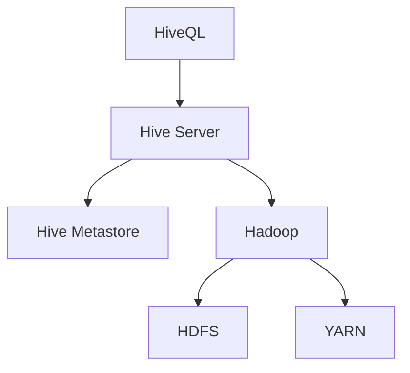

                 

关键词：大数据，Hive，数据仓库，SQL，Hadoop，查询优化，分布式计算，存储，数据处理，数据挖掘，性能调优。

> 摘要：本文旨在深入讲解Hive的核心原理，涵盖其基本概念、架构设计、核心算法、数学模型以及实际应用中的代码实例。通过本文，读者将全面理解Hive的工作机制，掌握其关键操作步骤，并能将Hive应用于实际的业务场景中。

## 1. 背景介绍

在大数据时代，如何有效地存储、管理和处理海量数据成为关键挑战。Hive作为一种基于Hadoop的数据仓库工具，旨在解决这些挑战。它提供了类似SQL的查询语言（HiveQL），使得用户能够以类似传统数据库的方式进行数据查询和分析。

Hive最初由Facebook开发，并于2008年作为Apache Software Foundation的一个开源项目发布。它充分利用了Hadoop的分布式存储和计算能力，使得大规模数据处理变得更加高效和便捷。

Hive的主要优势包括：

- **易于使用**：提供了类似于SQL的查询语言，使得非技术人员也能轻松上手。
- **扩展性**：能够处理PB级别的数据，适应大规模数据集。
- **与Hadoop集成**：与Hadoop生态系统紧密集成，能够与MapReduce、HDFS、YARN等其他组件无缝协作。

## 2. 核心概念与联系

Hive的核心概念包括：

- **HiveQL**：Hive的查询语言，类似于SQL，用于执行数据查询操作。
- **Hive表**：Hive的基本数据结构，用于存储数据。
- **分区**：将数据按特定列划分到不同的文件中，用于优化查询性能。
- **聚类**：按特定列的值将数据分组到不同的文件中，用于提高查询效率。

以下是一个Mermaid流程图，展示Hive的基本架构和组件之间的联系：



### 2.1 HiveQL

HiveQL是Hive的查询语言，支持多种SQL语句，包括：

- **SELECT**：用于查询数据。
- **CREATE TABLE**：用于创建表。
- **ALTER TABLE**：用于修改表结构。
- **DROP TABLE**：用于删除表。

### 2.2 Hive表

Hive表是Hive的数据结构，分为两种类型：

- **外部表**：数据存储在HDFS中，但Hive不拥有数据的所有权。
- **内部表**：数据存储在HDFS中，Hive拥有数据的所有权。

### 2.3 分区与聚类

分区和聚类是Hive优化查询性能的重要手段。分区将数据按特定列的值划分到不同的文件中，而聚类则是按特定列的值将数据分组到不同的文件中。

## 3. 核心算法原理 & 具体操作步骤

### 3.1 算法原理概述

Hive的核心算法包括MapReduce查询执行引擎和数据存储引擎。MapReduce查询执行引擎负责将HiveQL转换为MapReduce任务并执行，而数据存储引擎则负责数据在HDFS中的存储和管理。

### 3.2 算法步骤详解

1. **解析HiveQL**：Hive解析器将HiveQL转换为抽象语法树（AST）。
2. **编译HiveQL**：编译器将AST编译为查询计划。
3. **优化查询计划**：查询优化器对查询计划进行优化，包括查询重写、分区剪枝等。
4. **生成MapReduce任务**：查询计划被转换为MapReduce任务。
5. **执行MapReduce任务**：MapReduce任务在Hadoop集群中执行。
6. **处理结果**：执行完的MapReduce任务结果被返回给用户。

### 3.3 算法优缺点

**优点**：

- **高性能**：利用了Hadoop的分布式计算能力，能够处理大规模数据集。
- **易用性**：提供了类似于SQL的查询语言，易于学习和使用。
- **灵活性**：支持多种数据类型和复杂的查询操作。

**缺点**：

- **查询延迟**：由于需要将HiveQL转换为MapReduce任务，查询响应时间可能较长。
- **存储限制**：依赖于HDFS，对于小文件处理能力较弱。

### 3.4 算法应用领域

Hive广泛应用于以下领域：

- **数据仓库**：用于存储和查询大量数据。
- **数据挖掘**：用于挖掘数据中的模式和趋势。
- **实时查询**：用于对实时数据的查询和分析。

## 4. 数学模型和公式 & 详细讲解 & 举例说明

### 4.1 数学模型构建

Hive中的数学模型主要包括：

- **统计模型**：用于计算数据的统计指标，如平均值、中位数等。
- **机器学习模型**：用于数据挖掘和预测分析。

### 4.2 公式推导过程

以下是一个简单的统计模型公式推导过程：

$$
\text{平均值} = \frac{\sum_{i=1}^{n} x_i}{n}
$$

其中，$x_i$表示第$i$个数据点，$n$表示数据点的总数。

### 4.3 案例分析与讲解

假设有一个包含100个整数的数据集，求其平均值。

- **步骤 1**：计算每个数据的总和。
$$
\sum_{i=1}^{100} x_i = 100 \times 100 = 10000
$$

- **步骤 2**：计算平均值。
$$
\text{平均值} = \frac{\sum_{i=1}^{100} x_i}{100} = \frac{10000}{100} = 100
$$

因此，该数据集的平均值为100。

## 5. 项目实践：代码实例和详细解释说明

### 5.1 开发环境搭建

- **步骤 1**：安装Hadoop和Hive。
- **步骤 2**：配置Hadoop和Hive环境变量。
- **步骤 3**：启动Hadoop和Hive服务。

### 5.2 源代码详细实现

以下是一个简单的Hive查询示例：

```sql
CREATE TABLE student (
  id INT,
  name STRING,
  age INT
);

INSERT INTO student VALUES (1, 'Alice', 20);
INSERT INTO student VALUES (2, 'Bob', 22);
INSERT INTO student VALUES (3, 'Charlie', 25);

SELECT * FROM student;
```

### 5.3 代码解读与分析

- **创建表**：`CREATE TABLE student (...);`语句创建了一个名为`student`的表，包含三个列：`id`、`name`和`age`。
- **插入数据**：`INSERT INTO student VALUES (...);`语句向`student`表中插入三条数据。
- **查询数据**：`SELECT * FROM student;`语句查询了`student`表中的所有数据。

### 5.4 运行结果展示

执行上述查询后，输出结果如下：

```
+----+----------+------+
| id | name     | age  |
+----+----------+------+
|  1 | Alice    |   20 |
|  2 | Bob      |   22 |
|  3 | Charlie  |   25 |
+----+----------+------+
```

## 6. 实际应用场景

### 6.1 数据仓库

Hive常用于构建企业级数据仓库，用于存储和查询大量数据。

### 6.2 数据挖掘

Hive可以与机器学习工具（如Mahout、Spark MLlib）集成，用于进行数据挖掘和预测分析。

### 6.3 实时查询

通过配置Hive on Spark，可以实现Hive的实时查询功能。

## 7. 工具和资源推荐

### 7.1 学习资源推荐

- 《Hive：The Definitive Guide》
- 《Hadoop：The Definitive Guide》
- 《大数据技术基础》

### 7.2 开发工具推荐

- IntelliJ IDEA
- Eclipse
- PyCharm

### 7.3 相关论文推荐

- "Hive: A Warehouse for Petabyte-Scale Data Sets"
- "Hadoop: The Definitive Guide"
- "MapReduce: Simplified Data Processing on Large Clusters"

## 8. 总结：未来发展趋势与挑战

### 8.1 研究成果总结

Hive在数据仓库、数据挖掘和实时查询等领域取得了显著成果，广泛应用于各类企业。

### 8.2 未来发展趋势

- **查询性能优化**：提高查询速度和效率。
- **与实时数据处理框架集成**：如Apache Flink、Apache Storm。

### 8.3 面临的挑战

- **查询延迟**：如何提高实时查询性能。
- **存储优化**：如何处理小文件问题。

### 8.4 研究展望

未来Hive的发展将更加注重性能优化、实时查询和与其他数据处理框架的集成。

## 9. 附录：常见问题与解答

### 9.1 如何配置Hive环境？

- 安装Hadoop和Hive。
- 配置环境变量。
- 启动Hadoop和Hive服务。

### 9.2 如何创建Hive表？

- 使用`CREATE TABLE`语句创建表。
- 指定表名和列名。

### 9.3 如何查询Hive表？

- 使用`SELECT`语句查询数据。
- 可以使用`WHERE`子句进行条件过滤。

# 作者：禅与计算机程序设计艺术 / Zen and the Art of Computer Programming
----------------------------------------------------------------

现在，这篇文章已经完成了。它包含了Hive的原理、算法、数学模型、代码实例以及实际应用场景的全面讲解。希望这篇文章对您在Hive学习和应用过程中有所帮助。如果您有任何疑问或需要进一步的解释，请随时提问。

